## pacien-tincapp
----
#### Metrics provided by Detekt
* Number of lines of code 3689
* Number of Kotlin files: 59
* Cyclomatic complexity: 445
* Cyclomatic complexity by thousands of lines: 342 

----
**15** features analyzed

*	<a href="#type_inference">Type Inference</a> 
*	<a href="#lambda">Lambda</a> 
*	<a href="#safe_call">Safe Call</a> 
*	<a href="#when_expr">When expression</a> 
*	<a href="#companion_object">Companion Object</a> 
*	<a href="#unsafe_call">Unsafe Call</a> 
*	<a href="#string_template">String Template</a> 
*	<a href="#func_with_default_value">Function with Default Value</a> 
*	<a href="#singleton">Singleton</a> 
*	<a href="#smart_cast">Smart Cast</a> 
*	<a href="#func_call_with_named_arg">Function call with Named Argument</a> 
*	<a href="#data_class">Data Class</a> 
*	<a href="#extension_function">Extension Function</a> 
*	<a href="#property_delegation">Property Delegation</a> 
*	<a href="#overloaded_op">Overloaded Operator</a> 

### <a name="type_inference">Type Inference</a>
----
#### Functions
* **Constant Rise - Linear:** 
    * **R_Squared:** 0.97427961
* **Sudden Rise Plateau - Logarithm:** 
    * **R_Squared:** 0.64053362

**Plots** :chart_with_upwards_trend:
-----

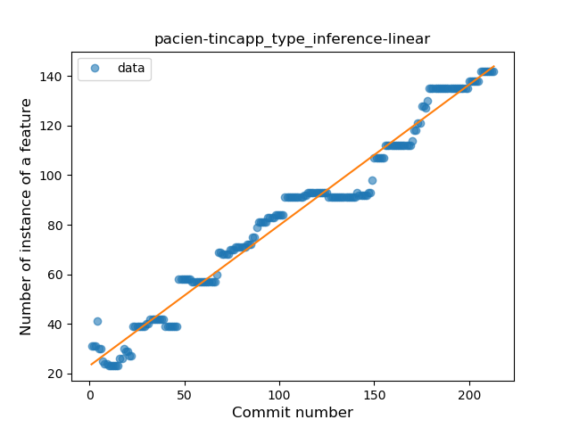
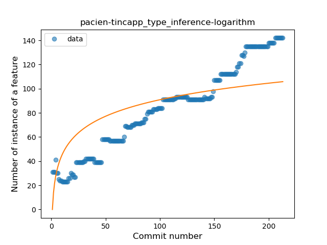
### <a name="lambda">Lambda</a>
----
#### Functions
* **Constant Rise - Linear:** 
    * **R_Squared:** 0.91602652
* **Plateau Sudden Rise - Binary Sigmoid:** 
    * **R_Squared:** 0.74316666
* **Sudden Rise Plateau - Logarithm:** 
    * **R_Squared:** 0.68922258

**Plots** :chart_with_upwards_trend:
-----

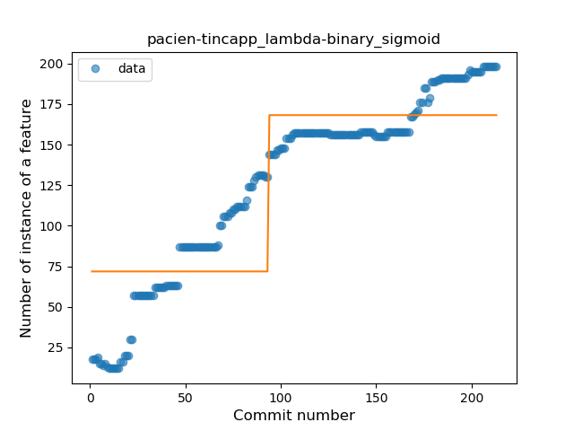
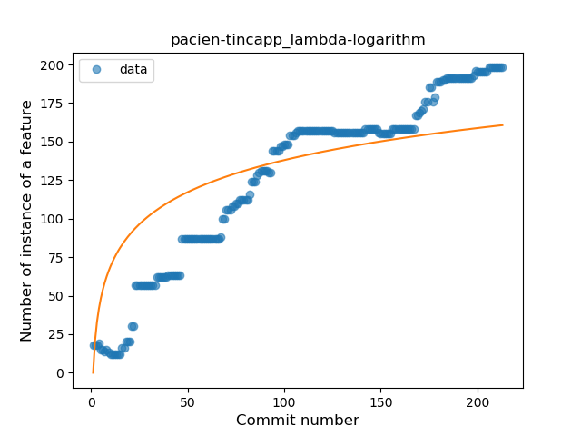
### <a name="safe_call">Safe Call</a>
----
#### Functions
* **Sudden Rise Plateau - Logarithm:** 
    * **R_Squared:** 0.55699922
* **Constant Rise - Linear:** 
    * **R_Squared:** 0.43043228
* **Plateau Gradual Rise - Sigmoid:** 
    * **R_Squared:** 0.27796428

**Plots** :chart_with_upwards_trend:
-----

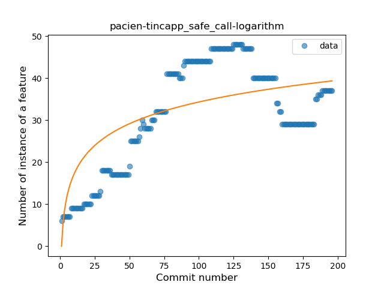
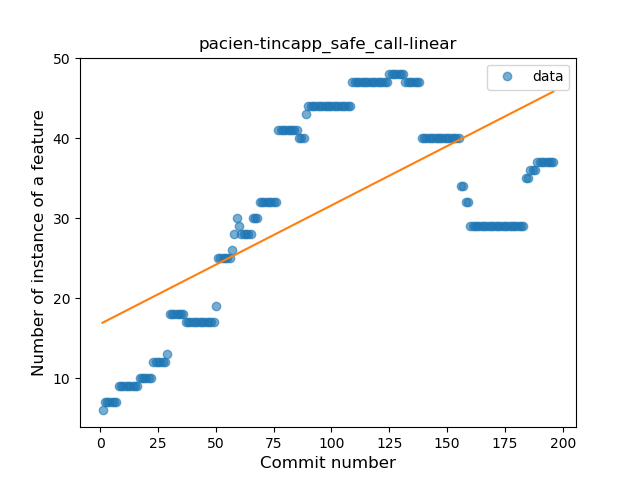
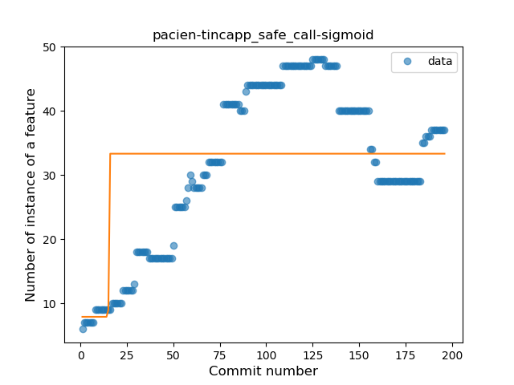
### <a name="when_expr">When expression</a>
----
#### Functions
* **Plateau Gradual Rise - Sigmoid:** 
    * **R_Squared:** 0.90327532
* **Sudden Rise - Exponential:** 
    * **R_Squared:** 0.85024167
* **Constant Rise - Linear:** 
    * **R_Squared:** 0.70531009
* **Sudden Rise Plateau - Logarithm:** 
    * **R_Squared:** 0.32318063

**Plots** :chart_with_upwards_trend:
-----

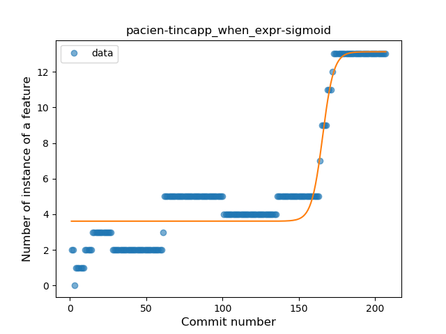
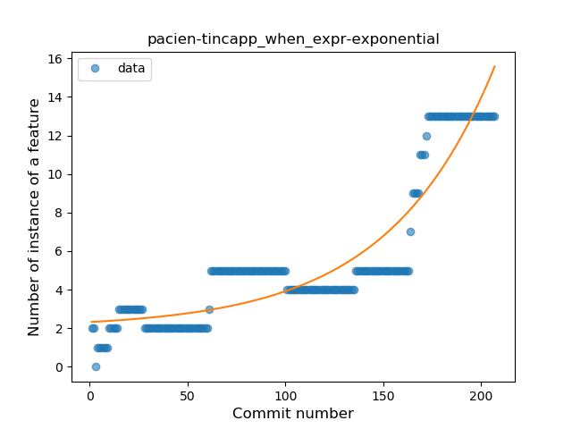
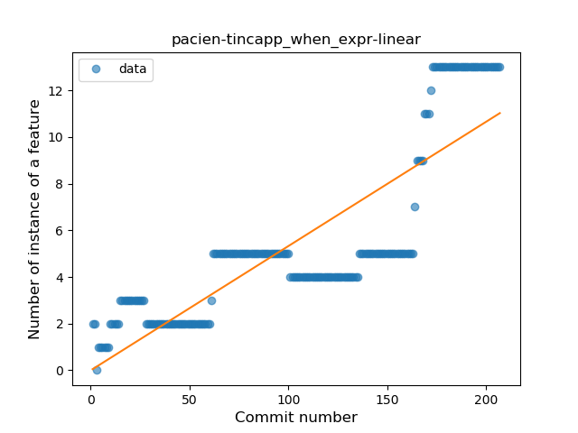
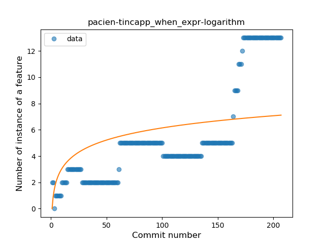
### <a name="companion_object">Companion Object</a>
----
#### Functions
* **Sudden Rise Plateau - Logarithm:** 
    * **R_Squared:** 0.78329643
* **Constant Rise - Linear:** 
    * **R_Squared:** 0.4508372

**Plots** :chart_with_upwards_trend:
-----

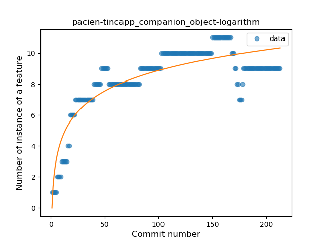
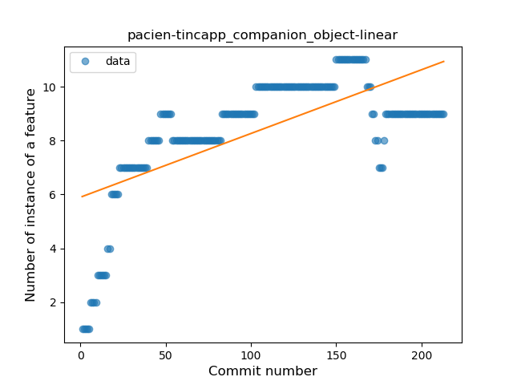
### <a name="unsafe_call">Unsafe Call</a>
----
#### Functions
* **Constant Rise - Linear:** 
    * **R_Squared:** 0.74941673
* **Sudden Rise Plateau - Logarithm:** 
    * **R_Squared:** 0.69915702

**Plots** :chart_with_upwards_trend:
-----

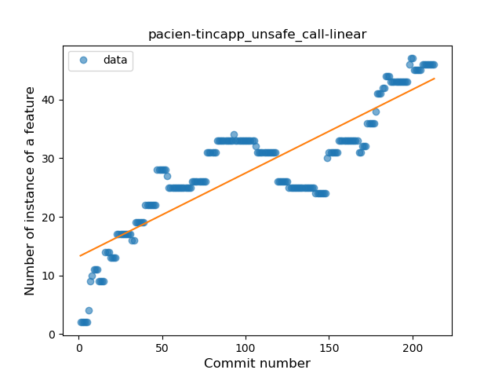
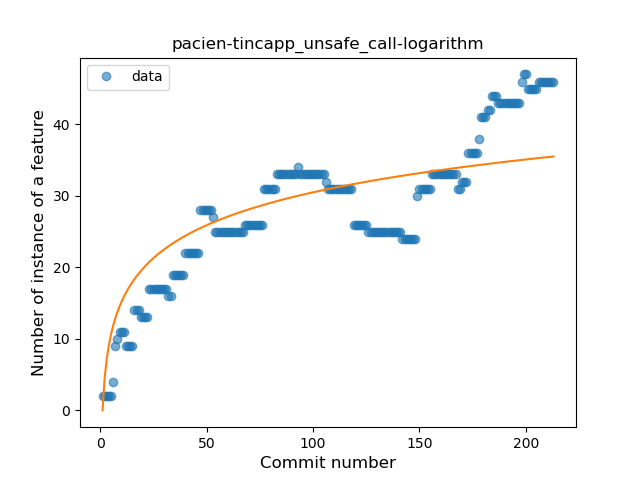
### <a name="string_template">String Template</a>
----
#### Functions
* **Constant Rise - Linear:** 
    * **R_Squared:** 0.75994141
* **Sudden Rise Plateau - Logarithm:** 
    * **R_Squared:** 0.69124779

**Plots** :chart_with_upwards_trend:
-----

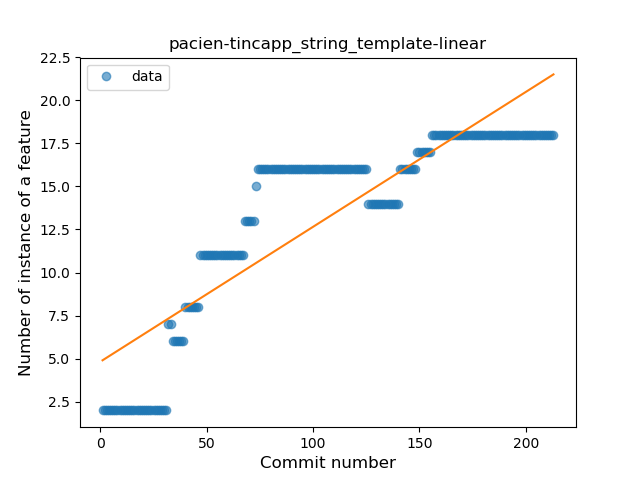
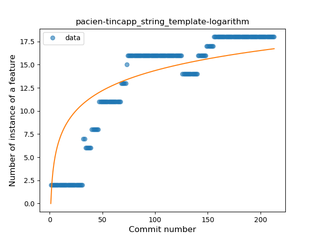
### <a name="func_with_default_value">Function with Default Value</a>
----
#### Functions
* **Plateau Gradual Rise - Sigmoid:** 
    * **R_Squared:** 0.96206922
* **Sudden Rise Plateau - Logarithm:** 
    * **R_Squared:** 0.6991381
* **Constant Rise - Linear:** 
    * **R_Squared:** 0.65770072

**Plots** :chart_with_upwards_trend:
-----

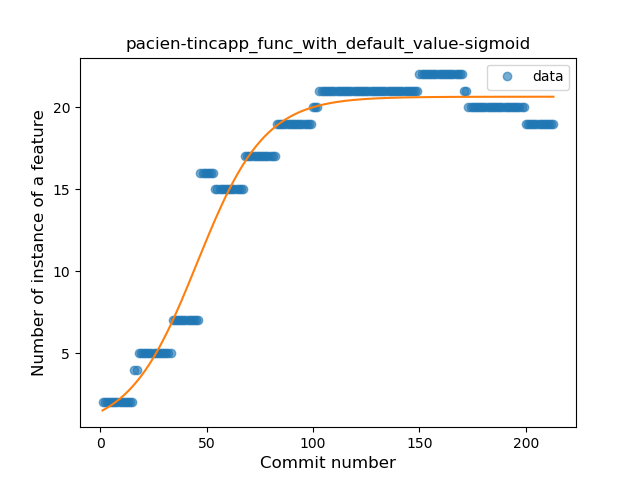

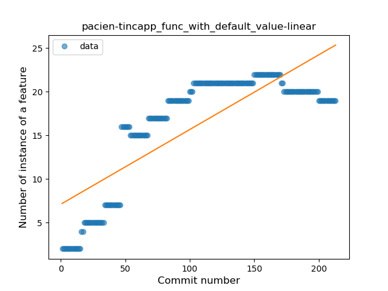
### <a name="singleton">Singleton</a>
----
#### Functions
* **Sudden Rise Plateau - Logarithm:** 
    * **R_Squared:** 0.86353406
* **Constant Rise - Linear:** 
    * **R_Squared:** 0.77452755
* **Plateau Sudden Rise - Binary Sigmoid:** 
    * **R_Squared:** 0.64918246

**Plots** :chart_with_upwards_trend:
-----

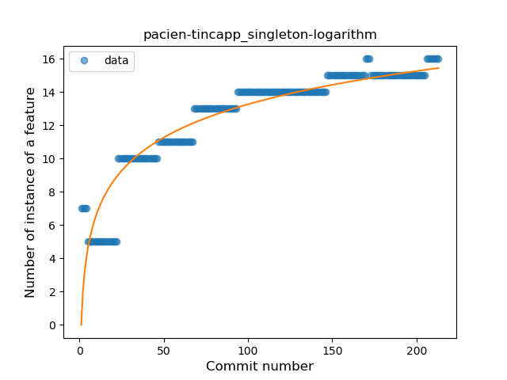
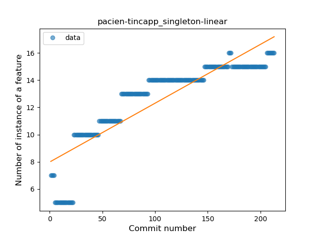
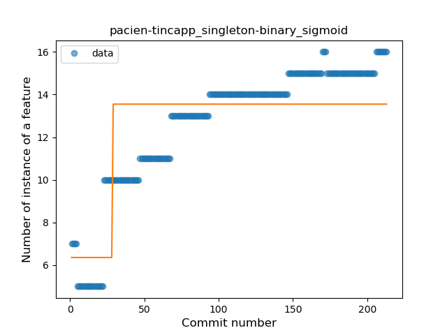
### <a name="smart_cast">Smart Cast</a>
----
#### Functions
* **Plateau Sudden Rise - Binary Sigmoid:** 
    * **R_Squared:** 0.96327358
* **Constant Rise - Linear:** 
    * **R_Squared:** 0.63764113
* **Sudden Rise Plateau - Logarithm:** 
    * **R_Squared:** 0.55264629

**Plots** :chart_with_upwards_trend:
-----

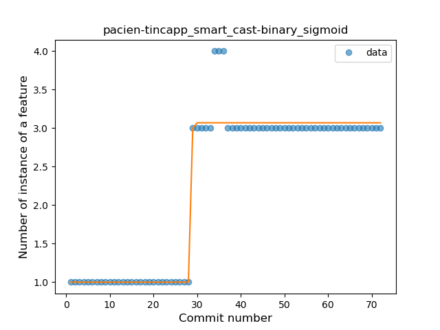
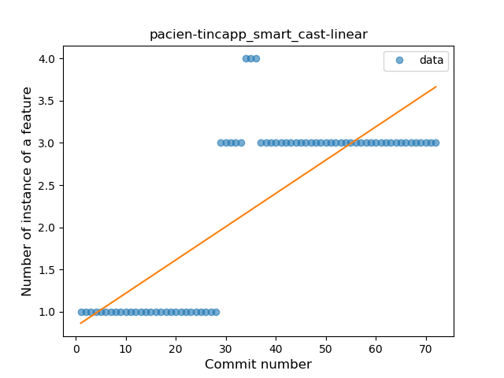
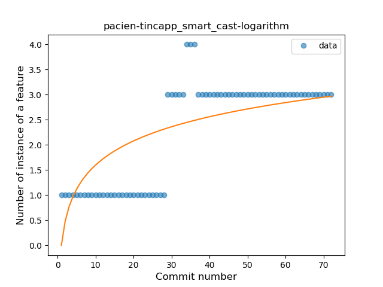
### <a name="func_call_with_named_arg">Function call with Named Argument</a>
----
#### Functions
* **Constant Rise - Linear:** 
    * **R_Squared:** 0.85709676
* **Sudden Rise Plateau - Logarithm:** 
    * **R_Squared:** 0.8339257

**Plots** :chart_with_upwards_trend:
-----

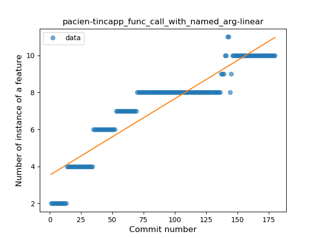
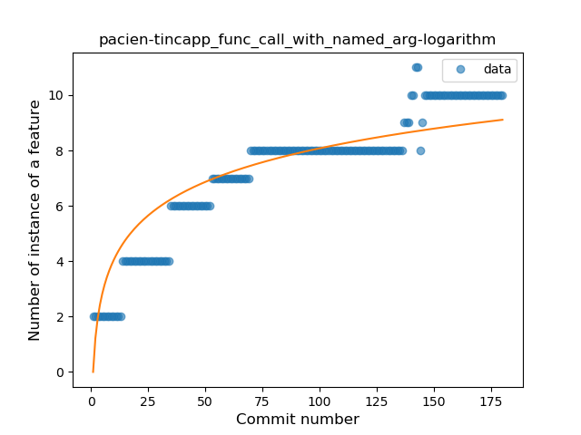
### <a name="data_class">Data Class</a>
----
#### Functions
* **Sudden Rise - Exponential:** 
    * **R_Squared:** 0.75498079
* **Constant Rise - Linear:** 
    * **R_Squared:** 0.68308071
* **Sudden Rise Plateau - Logarithm:** 
    * **R_Squared:** 0.51908056

**Plots** :chart_with_upwards_trend:
-----

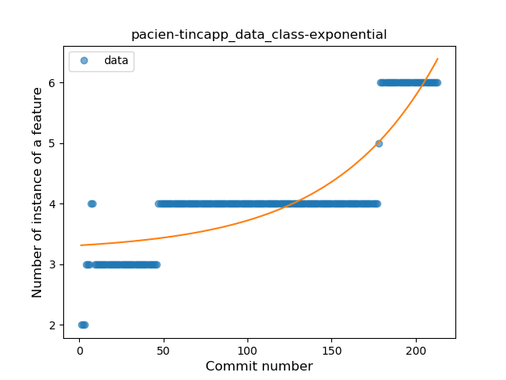
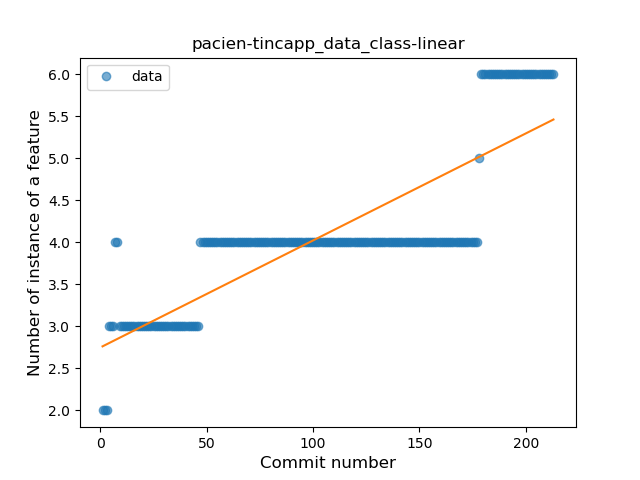
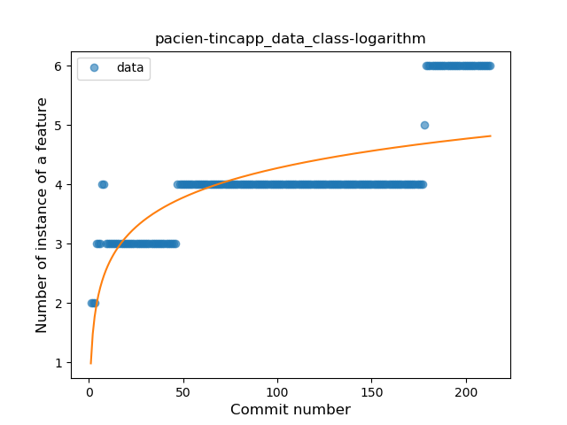
### <a name="extension_function">Extension Function</a>
----
#### Functions
* **Constant Rise - Linear:** 
    * **R_Squared:** 0.94322913
* **Sudden Rise Plateau - Logarithm:** 
    * **R_Squared:** 0.79927951

**Plots** :chart_with_upwards_trend:
-----

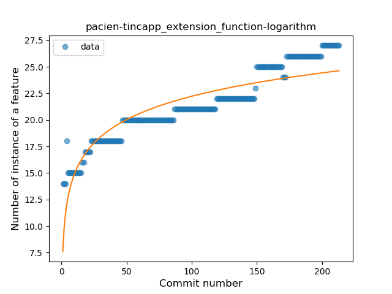
### <a name="property_delegation">Property Delegation</a>
----
#### Functions
* **Constant Rise - Linear:** 
    * **R_Squared:** 0.8452788
* **Sudden Rise Plateau - Logarithm:** 
    * **R_Squared:** 0.60449351

**Plots** :chart_with_upwards_trend:
-----

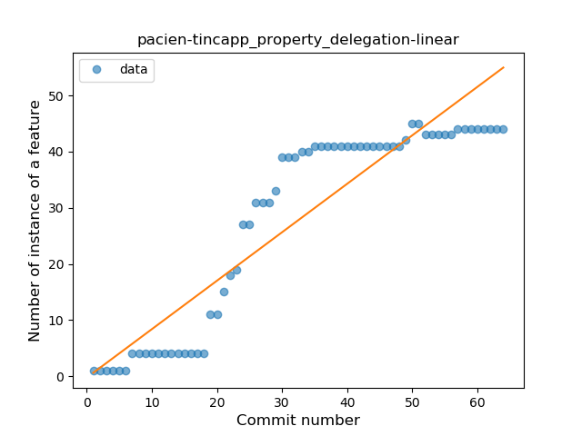
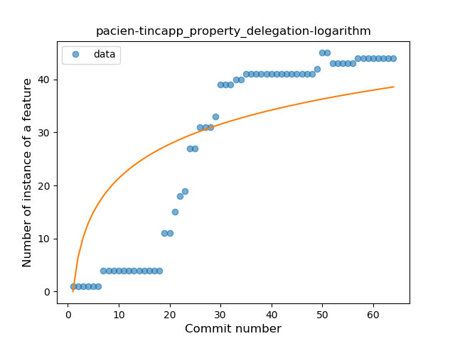
### <a name="overloaded_op">Overloaded Operator</a>
----
#### Functions
* **Instability - Polinomial 3:** )
    * **R_Squared:** 0.34522377
* **Sudden Rise Plateau - Logarithm:** 
    * **R_Squared:** 0.27745498
* **Constant Rise - Linear:** 
    * **R_Squared:** 0.08108108

**Plots** :chart_with_upwards_trend:
-----

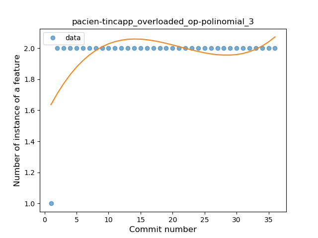
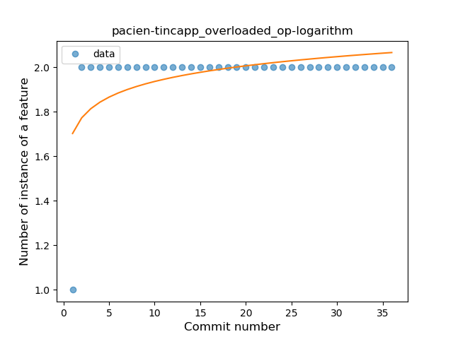
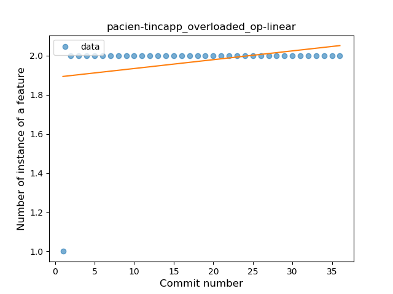
