## pennlabs-penn-mobile-android
----
#### Metrics provided by Detekt
* Number of lines of code 1570
* Number of Kotlin files: 21
* Cyclomatic complexity: 121
* Cyclomatic complexity by thousands of lines: 135 

----
**6** features analyzed

*	<a href="#type_inference">Type Inference</a> 
*	<a href="#lambda">Lambda</a> 
*	<a href="#safe_call">Safe Call</a> 
*	<a href="#companion_object">Companion Object</a> 
*	<a href="#unsafe_call">Unsafe Call</a> 
*	<a href="#string_template">String Template</a> 

### <a name="type_inference">Type Inference</a>
----
#### Functions
* **Instability - Polinomial 4:** 
    * **R_Squared:** 0.89937013
* **Instability - Polinomial 3:** )
    * **R_Squared:** 0.82431217
* **Sudden Rise Plateau - Logarithm:** 
    * **R_Squared:** 0.66874661
* **Constant Rise - Linear:** 
    * **R_Squared:** 0.32143648

**Plots** :chart_with_upwards_trend:
-----

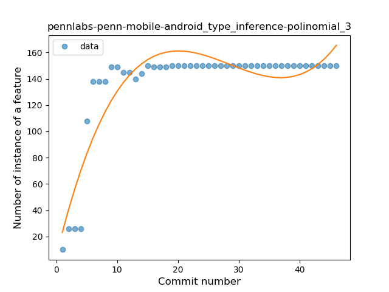
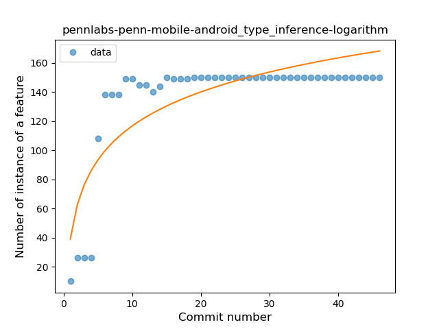
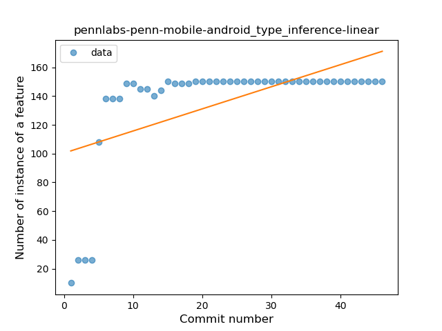
### <a name="lambda">Lambda</a>
----
#### Functions
* **Instability - Polinomial 3:** )
    * **R_Squared:** 0.88012153
* **Sudden Rise Plateau - Logarithm:** 
    * **R_Squared:** 0.81513332
* **Constant Rise - Linear:** 
    * **R_Squared:** 0.51364201

**Plots** :chart_with_upwards_trend:
-----

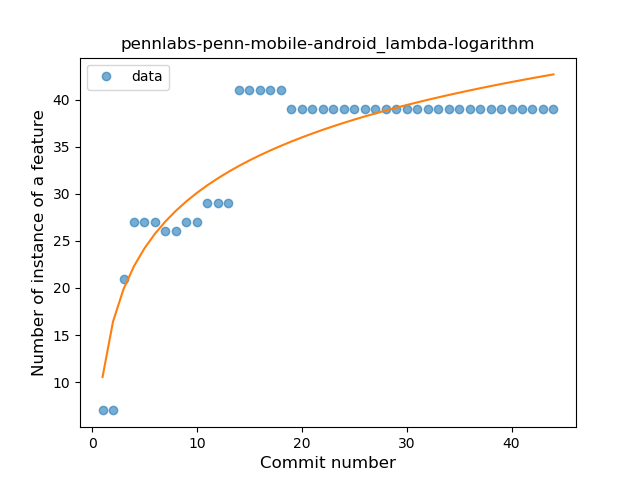
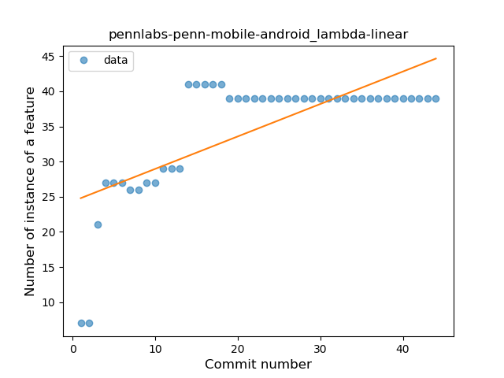
### <a name="safe_call">Safe Call</a>
----
#### Functions
* **Instability - Polinomial 4:** 
    * **R_Squared:** 0.86471201
* **Instability - Polinomial 3:** )
    * **R_Squared:** 0.81626727
* **Sudden Rise Plateau - Logarithm:** 
    * **R_Squared:** 0.45142644
* **Constant Rise - Linear:** 
    * **R_Squared:** 0.13789656
* **Plateau Sudden Rise - Binary Sigmoid:** 
    * **R_Squared:** 0.00614514

**Plots** :chart_with_upwards_trend:
-----

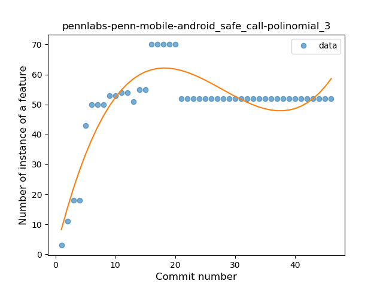
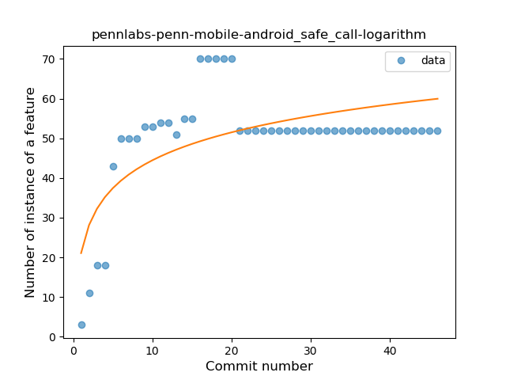
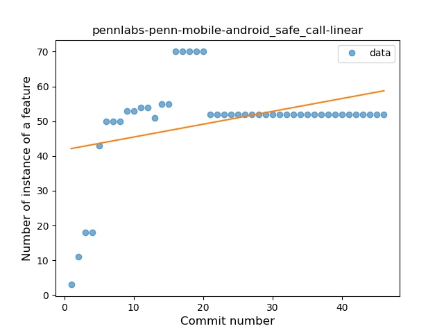
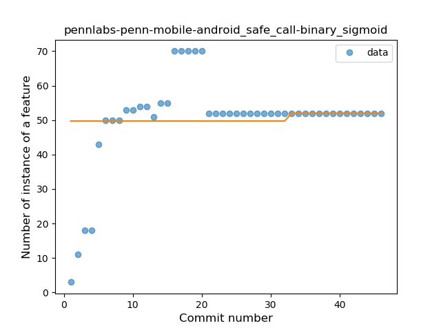
### <a name="companion_object">Companion Object</a>
----
#### Functions
* **Plateau Sudden Rise - Binary Sigmoid:** 
    * **R_Squared:** 1.0
* **Instability - Polinomial 3:** )
    * **R_Squared:** 0.76998336
* **Sudden Rise Plateau - Logarithm:** 
    * **R_Squared:** 0.59663961
* **Constant Rise - Linear:** 
    * **R_Squared:** 0.29078014

**Plots** :chart_with_upwards_trend:
-----

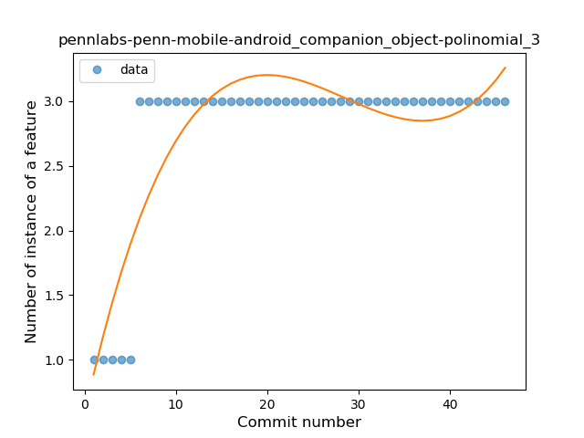
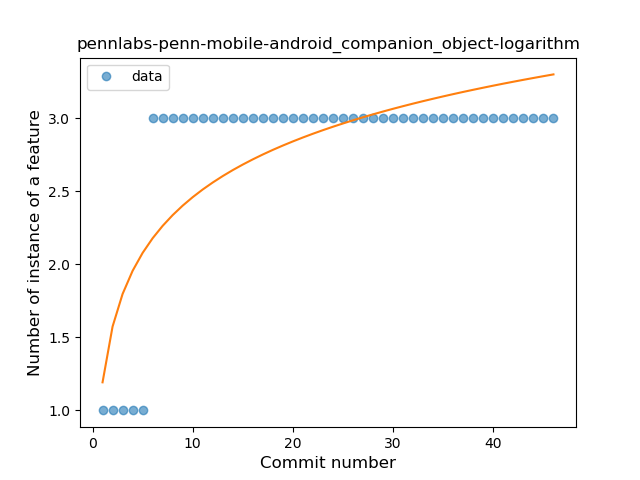
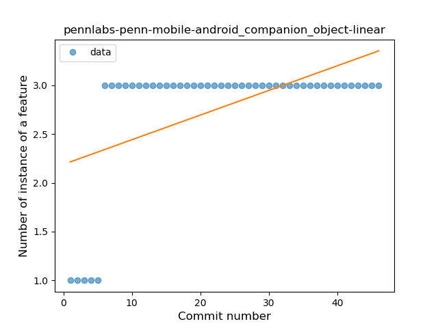
### <a name="unsafe_call">Unsafe Call</a>
----
#### Functions
* **Instability - Polinomial 4:** 
    * **R_Squared:** 0.73286434
* **Plateau Sudden Decline - Binary Sigmoid:** 
    * **R_Squared:** 0.66551526
* **Instability - Polinomial 3:** )
    * **R_Squared:** 0.49186971
* **Constant Decline - Linear:** 
    * **R_Squared:** 0.3385747
* **Sudden Decline - Exponential:** 
    * **R_Squared:** 0.34510382
* **Sudden Rise Plateau - Logarithm:** 
    * **R_Squared:** -0.0

**Plots** :chart_with_upwards_trend:
-----

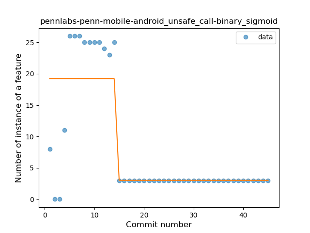
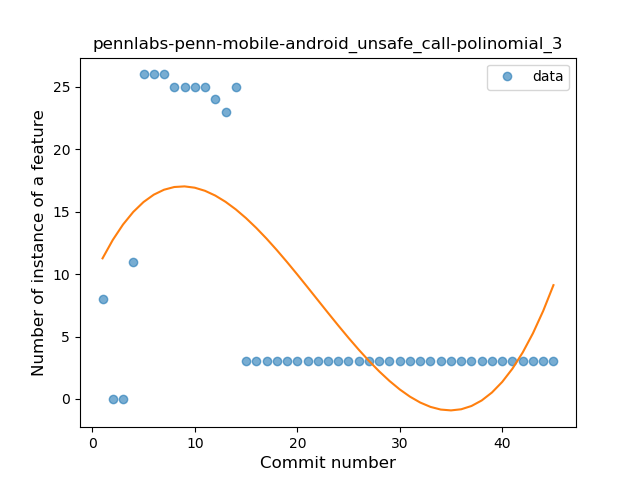
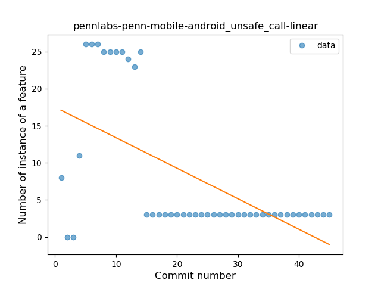
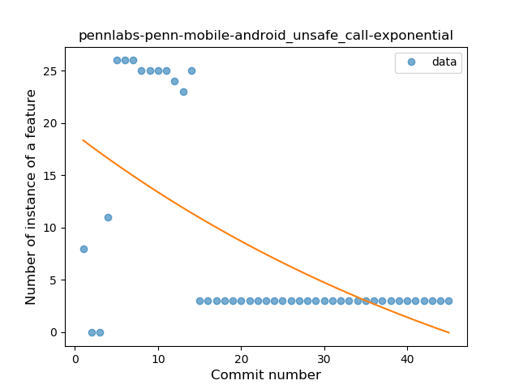
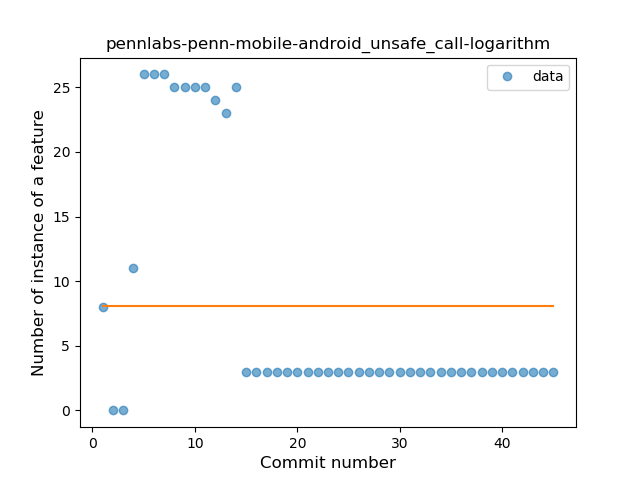
### <a name="string_template">String Template</a>
----
#### Functions
* **Plateau Sudden Decline - Binary Sigmoid:** 
    * **R_Squared:** 1.0
* **Instability - Polinomial 3:** )
    * **R_Squared:** 0.82797917
* **Sudden Decline - Exponential:** 
    * **R_Squared:** 0.75524544
* **Constant Decline - Linear:** 
    * **R_Squared:** 0.70788429
* **Sudden Rise Plateau - Logarithm:** 
    * **R_Squared:** -0.0

**Plots** :chart_with_upwards_trend:
-----

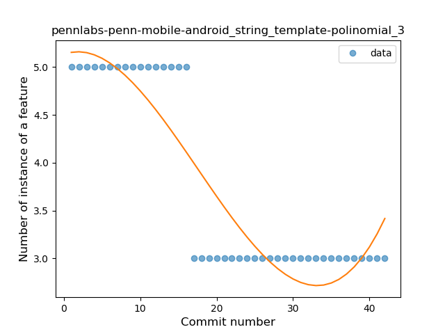
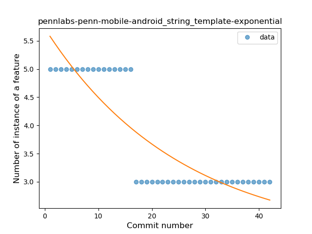
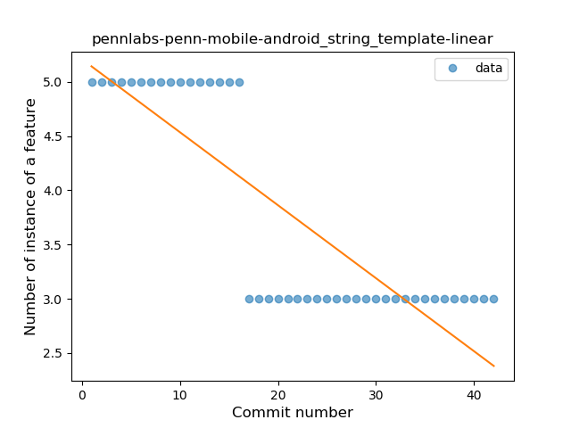
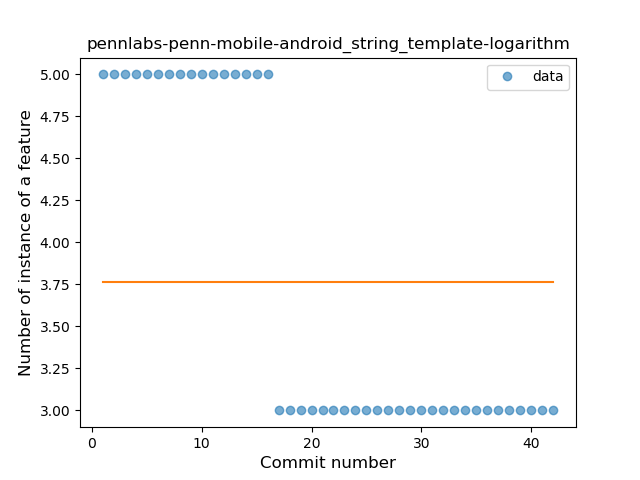
