## peppercarrot-e-reader
----
#### Metrics provided by Detekt
* Number of lines of code 2258
* Number of Kotlin files: 28
* Cyclomatic complexity: 226
* Cyclomatic complexity by thousands of lines: 255 

----
**13** features analyzed

*	<a href="#type_inference">Type Inference</a> 
*	<a href="#lambda">Lambda</a> 
*	<a href="#safe_call">Safe Call</a> 
*	<a href="#when_expr">When expression</a> 
*	<a href="#companion_object">Companion Object</a> 
*	<a href="#unsafe_call">Unsafe Call</a> 
*	<a href="#string_template">String Template</a> 
*	<a href="#singleton">Singleton</a> 
*	<a href="#smart_cast">Smart Cast</a> 
*	<a href="#range_expr">Range Expression</a> 
*	<a href="#func_call_with_named_arg">Function call with Named Argument</a> 
*	<a href="#data_class">Data Class</a> 
*	<a href="#property_delegation">Property Delegation</a> 

### <a name="type_inference">Type Inference</a>
----
#### Functions
* **Instability - Polinomial 3:** )
    * **R_Squared:** 0.93773084
* **Sudden Rise Plateau - Logarithm:** 
    * **R_Squared:** 0.76930624
* **Constant Rise - Linear:** 
    * **R_Squared:** 0.5943795

**Plots** :chart_with_upwards_trend:
-----

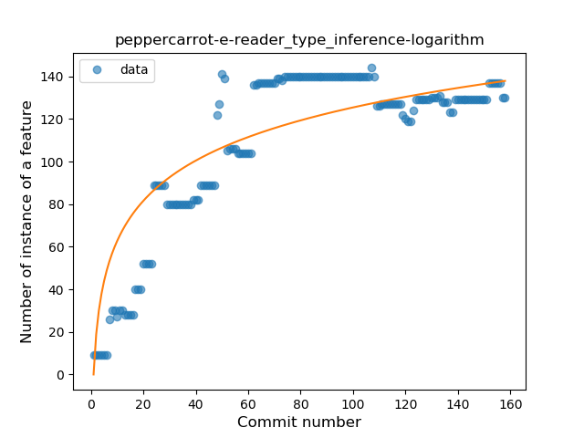
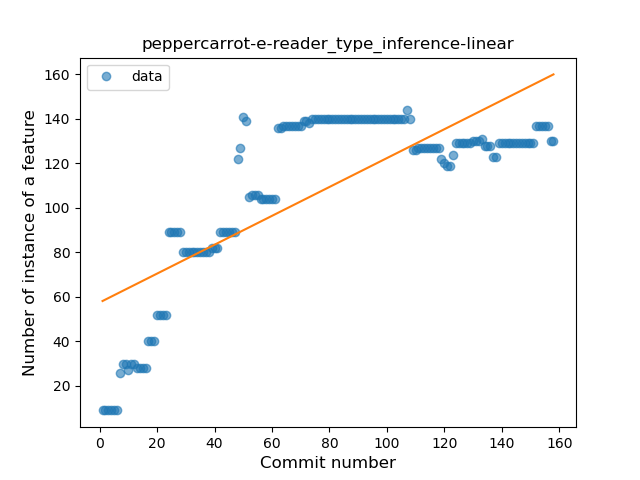
### <a name="lambda">Lambda</a>
----
#### Functions
* **Plateau Gradual Rise - Sigmoid:** 
    * **R_Squared:** 0.88813554
* **Constant Rise - Linear:** 
    * **R_Squared:** 0.75012947
* **Sudden Rise Plateau - Logarithm:** 
    * **R_Squared:** 0.62722033

**Plots** :chart_with_upwards_trend:
-----

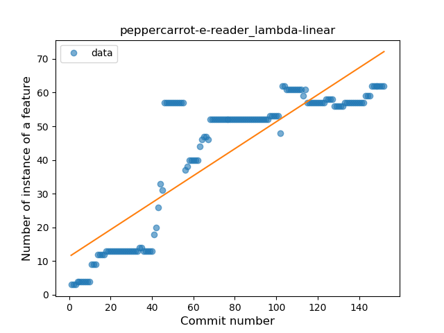
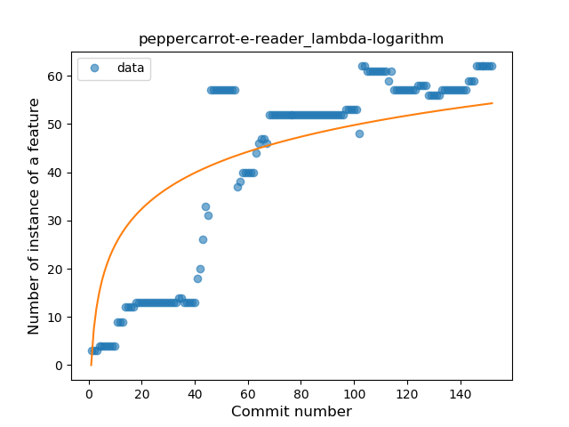
### <a name="safe_call">Safe Call</a>
----
#### Functions
* **Sudden Rise Plateau - Logarithm:** 
    * **R_Squared:** 0.39120261
* **Constant Rise - Linear:** 
    * **R_Squared:** 0.13427159

**Plots** :chart_with_upwards_trend:
-----

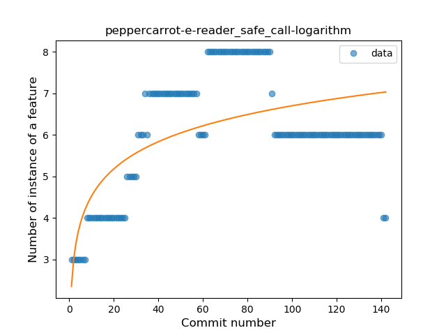
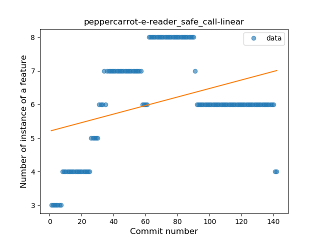
### <a name="when_expr">When expression</a>
----
#### Functions
* **Plateau Gradual Rise - Sigmoid:** 
    * **R_Squared:** 0.90133949
* **Sudden Rise - Exponential:** 
    * **R_Squared:** 0.75981118
* **Constant Rise - Linear:** 
    * **R_Squared:** 0.72238262
* **Sudden Rise Plateau - Logarithm:** 
    * **R_Squared:** 0.25432636

**Plots** :chart_with_upwards_trend:
-----

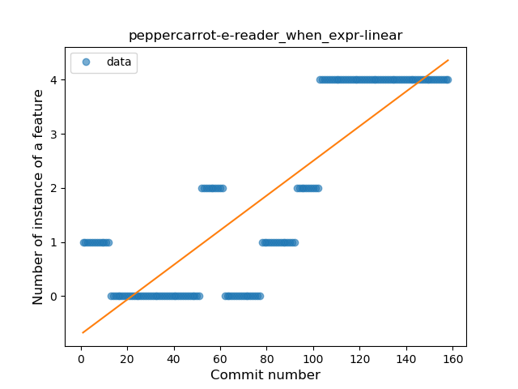
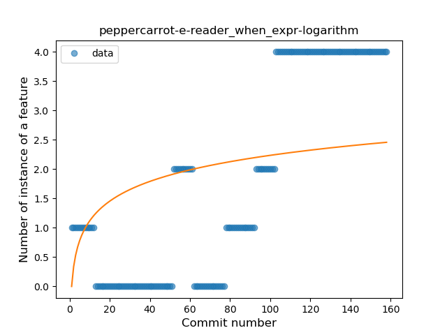
### <a name="companion_object">Companion Object</a>
----
#### Functions
* **Sudden Rise Plateau - Logarithm:** 
    * **R_Squared:** 0.8047484
* **Constant Rise - Linear:** 
    * **R_Squared:** 0.76330009

**Plots** :chart_with_upwards_trend:
-----

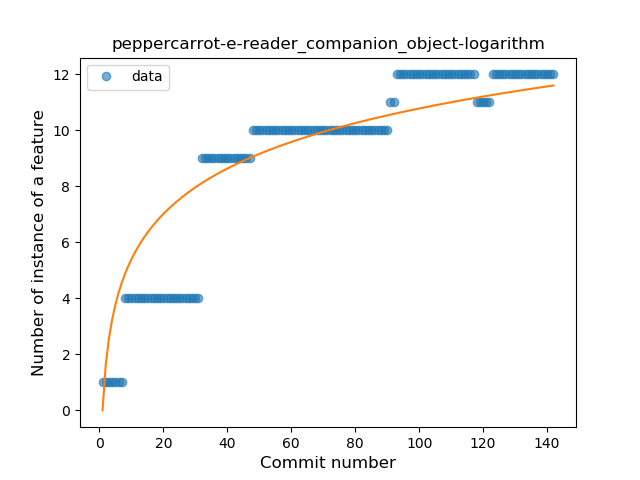
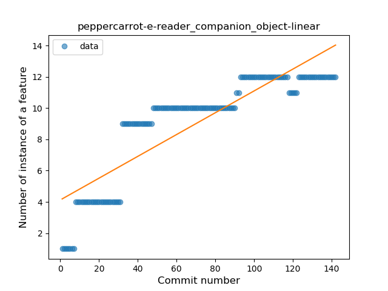
### <a name="unsafe_call">Unsafe Call</a>
----
#### Functions
* **Sudden Rise - Exponential:** 
    * **R_Squared:** 0.50853403
* **Constant Rise - Linear:** 
    * **R_Squared:** 0.49363866
* **Sudden Rise Plateau - Logarithm:** 
    * **R_Squared:** 0.4557898

**Plots** :chart_with_upwards_trend:
-----

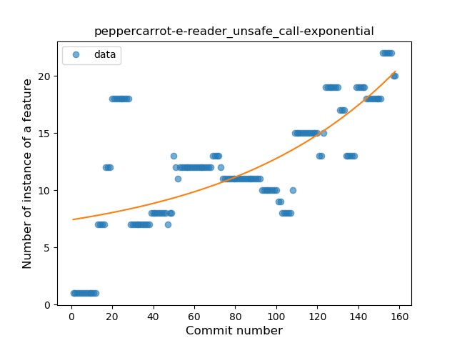
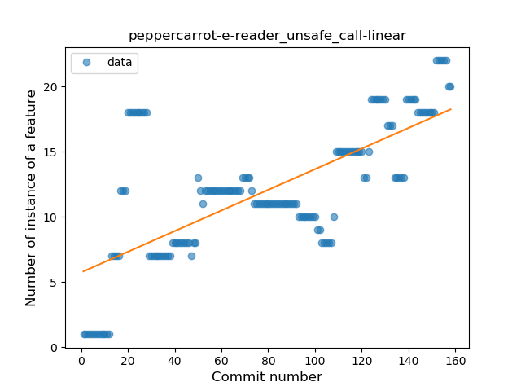
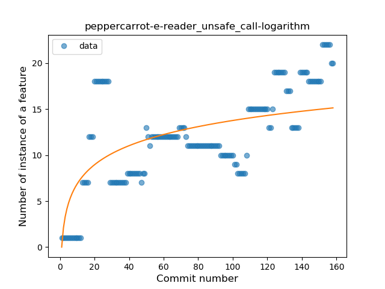
### <a name="string_template">String Template</a>
----
#### Functions
* **Plateau Gradual Rise - Sigmoid:** 
    * **R_Squared:** 0.64470605
* **Sudden Rise Plateau - Logarithm:** 
    * **R_Squared:** 0.55373876
* **Constant Rise - Linear:** 
    * **R_Squared:** 0.31250193

**Plots** :chart_with_upwards_trend:
-----

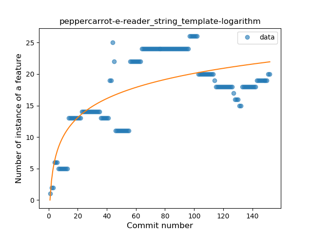
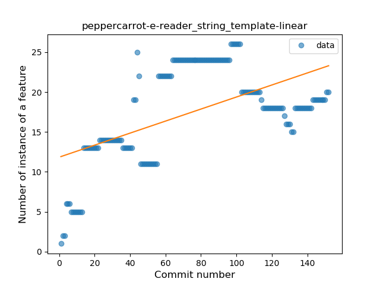
### <a name="singleton">Singleton</a>
----
#### Functions
* **Plateau Sudden Decline - Binary Sigmoid:** 
    * **R_Squared:** 0.89125454
* **Sudden Decline - Exponential:** 
    * **R_Squared:** 0.60244148
* **Constant Decline - Linear:** 
    * **R_Squared:** 0.31884959
* **Sudden Rise Plateau - Logarithm:** 
    * **R_Squared:** -0.0

**Plots** :chart_with_upwards_trend:
-----

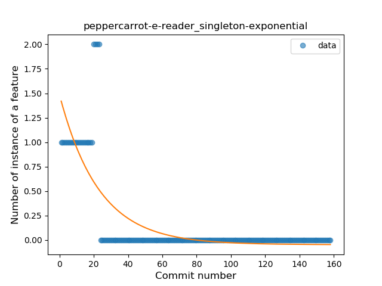
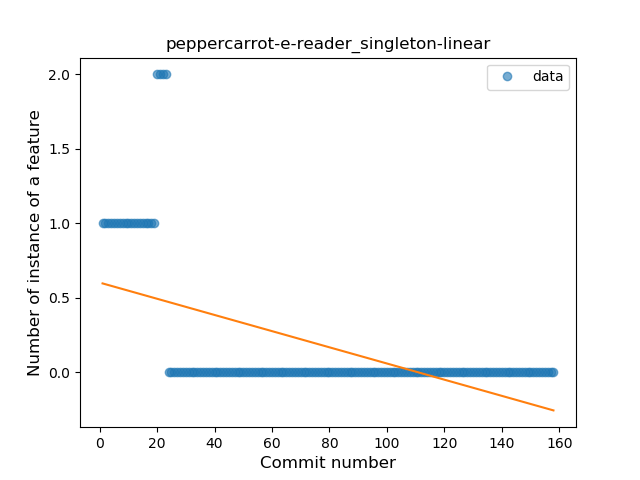
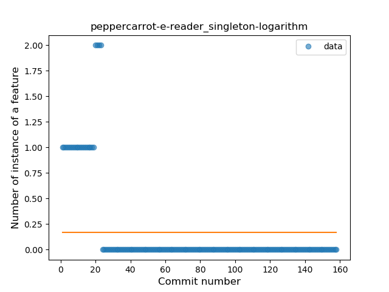
### <a name="smart_cast">Smart Cast</a>
----
#### Functions
* **Plateau Gradual Rise - Sigmoid:** 
    * **R_Squared:** 0.88418392
* **Constant Rise - Linear:** 
    * **R_Squared:** 0.83565301
* **Sudden Rise - Exponential:** 
    * **R_Squared:** 0.83840638
* **Sudden Rise Plateau - Logarithm:** 
    * **R_Squared:** 0.51085788

**Plots** :chart_with_upwards_trend:
-----

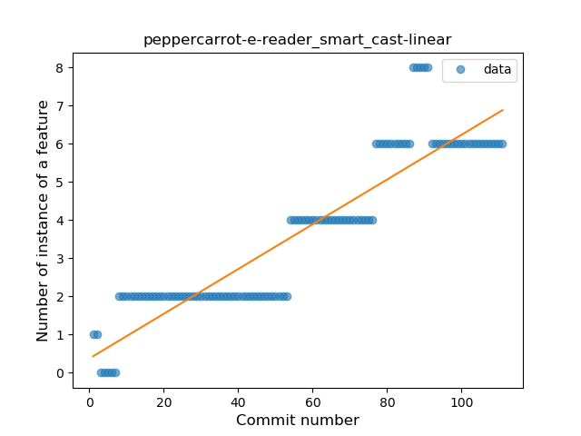
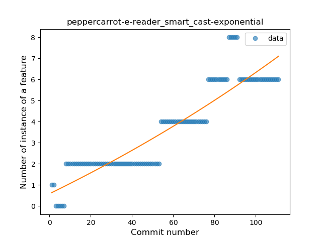
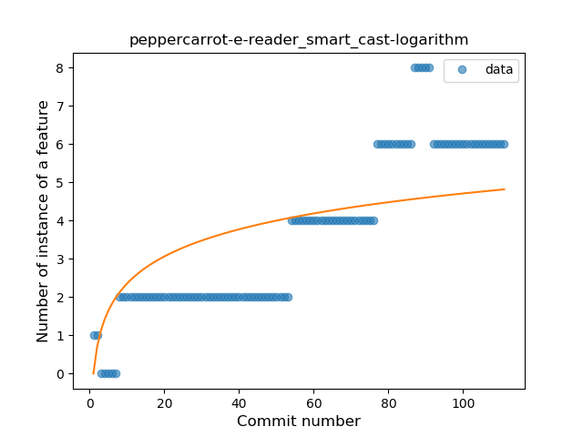
### <a name="range_expr">Range Expression</a>
----
#### Functions
* **Plateau Gradual Rise - Sigmoid:** 
    * **R_Squared:** 0.91262552
* **Sudden Rise Plateau - Logarithm:** 
    * **R_Squared:** 0.78037596
* **Constant Rise - Linear:** 
    * **R_Squared:** 0.46904194

**Plots** :chart_with_upwards_trend:
-----

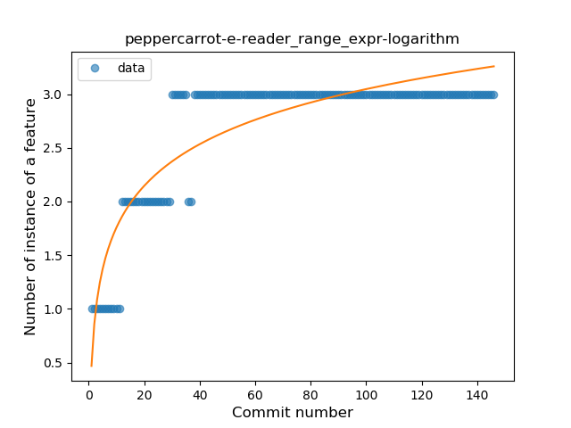

### <a name="func_call_with_named_arg">Function call with Named Argument</a>
----
#### Functions
* **Plateau Sudden Decline - Binary Sigmoid:** 
    * **R_Squared:** 0.8686117
* **Sudden Decline - Exponential:** 
    * **R_Squared:** 0.55628924
* **Constant Decline - Linear:** 
    * **R_Squared:** 0.37842666
* **Sudden Rise Plateau - Logarithm:** 
    * **R_Squared:** -0.0

**Plots** :chart_with_upwards_trend:
-----

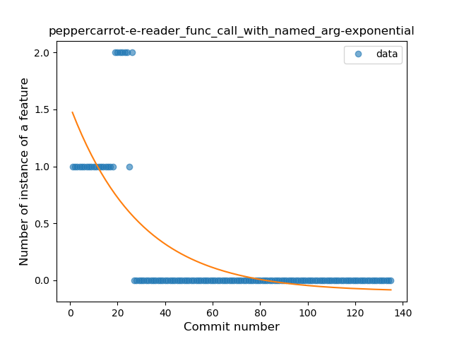
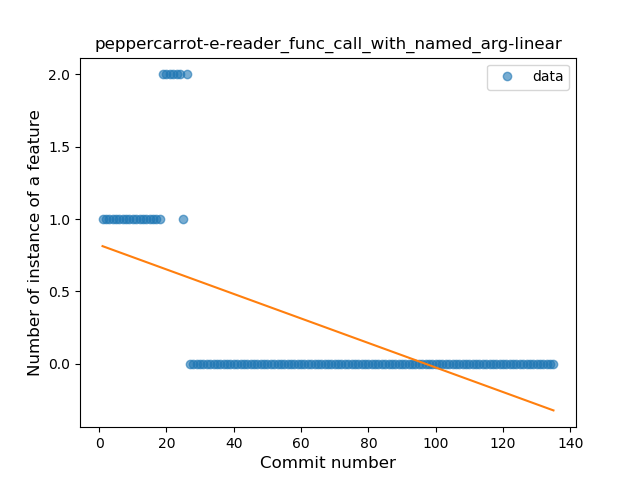
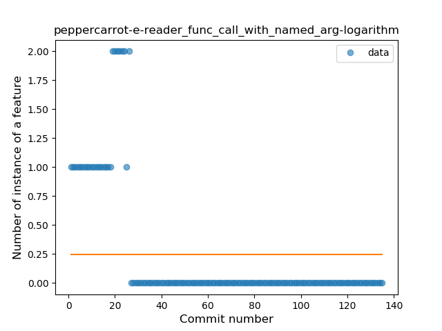
### <a name="data_class">Data Class</a>
----
#### Functions
* **Plateau Sudden Rise - Binary Sigmoid:** 
    * **R_Squared:** 1.0
* **Sudden Rise Plateau - Logarithm:** 
    * **R_Squared:** 0.66802116
* **Constant Rise - Linear:** 
    * **R_Squared:** 0.43854258

**Plots** :chart_with_upwards_trend:
-----

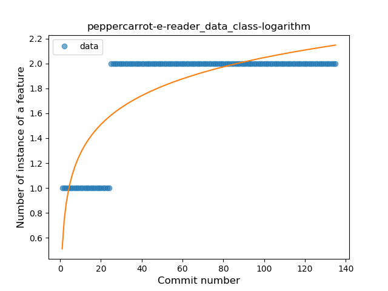
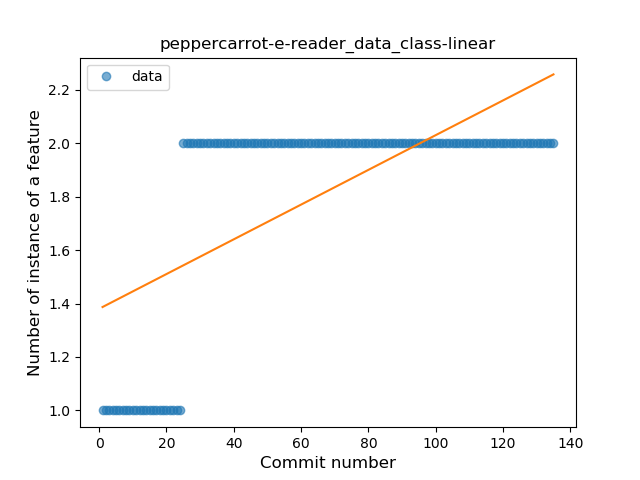
### <a name="property_delegation">Property Delegation</a>
----
#### Functions
* **Plateau Gradual Rise - Sigmoid:** 
    * **R_Squared:** 0.83572698
* **Sudden Rise Plateau - Logarithm:** 
    * **R_Squared:** 0.51626396
* **Constant Rise - Linear:** 
    * **R_Squared:** 0.2323539

**Plots** :chart_with_upwards_trend:
-----

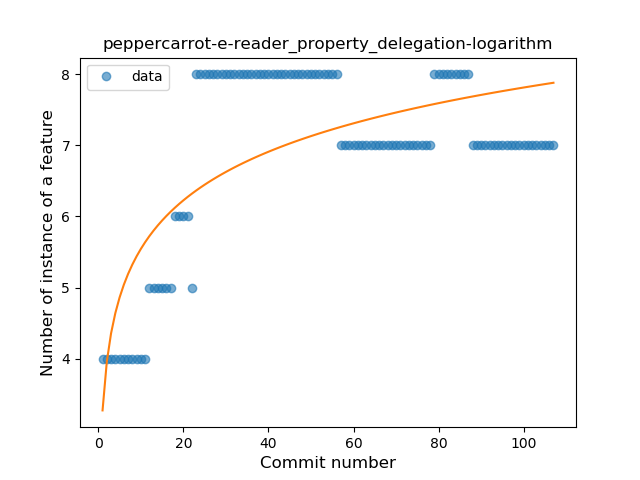
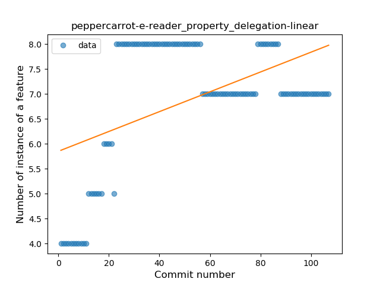
