## peterLaurence-TrekAdvisor
----
#### Metrics provided by Detekt
* Number of lines of code 4907
* Number of Kotlin files: 70
* Cyclomatic complexity: 555
* Cyclomatic complexity by thousands of lines: 235 

----
**15** features analyzed

*	<a href="#type_inference">Type Inference</a> 
*	<a href="#lambda">Lambda</a> 
*	<a href="#safe_call">Safe Call</a> 
*	<a href="#when_expr">When expression</a> 
*	<a href="#companion_object">Companion Object</a> 
*	<a href="#unsafe_call">Unsafe Call</a> 
*	<a href="#string_template">String Template</a> 
*	<a href="#func_with_default_value">Function with Default Value</a> 
*	<a href="#singleton">Singleton</a> 
*	<a href="#range_expr">Range Expression</a> 
*	<a href="#func_call_with_named_arg">Function call with Named Argument</a> 
*	<a href="#data_class">Data Class</a> 
*	<a href="#extension_function">Extension Function</a> 
*	<a href="#property_delegation">Property Delegation</a> 
*	<a href="#destructuring_declaration">Destructuring Declaration</a> 

### <a name="type_inference">Type Inference</a>
----
#### Functions
* **Constant Rise - Linear:** 
    * **R_Squared:** 0.96875584
* **Sudden Rise Plateau - Logarithm:** 
    * **R_Squared:** 0.67170942

**Plots** :chart_with_upwards_trend:
-----

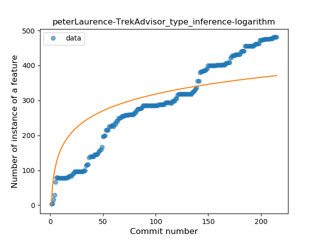
### <a name="lambda">Lambda</a>
----
#### Functions
* **Sudden Rise - Exponential:** 
    * **R_Squared:** 0.97310275
* **Constant Rise - Linear:** 
    * **R_Squared:** 0.94928859
* **Sudden Rise Plateau - Logarithm:** 
    * **R_Squared:** 0.41272504
* **Plateau Gradual Rise - Sigmoid:** 
    * **R_Squared:** 0.26127864

**Plots** :chart_with_upwards_trend:
-----

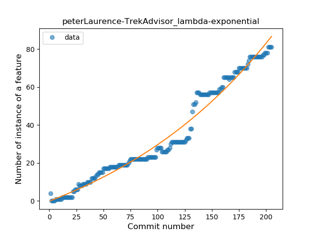
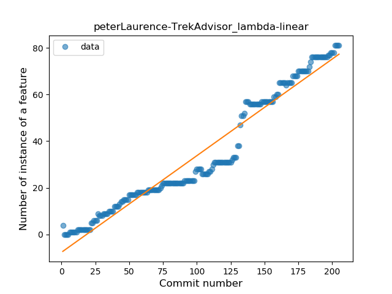
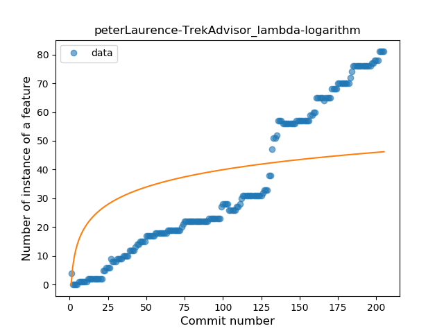
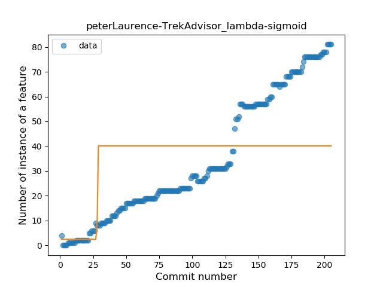
### <a name="safe_call">Safe Call</a>
----
#### Functions
* **Sudden Rise - Exponential:** 
    * **R_Squared:** 0.92837583
* **Constant Rise - Linear:** 
    * **R_Squared:** 0.85847528
* **Sudden Rise Plateau - Logarithm:** 
    * **R_Squared:** 0.37809297

**Plots** :chart_with_upwards_trend:
-----

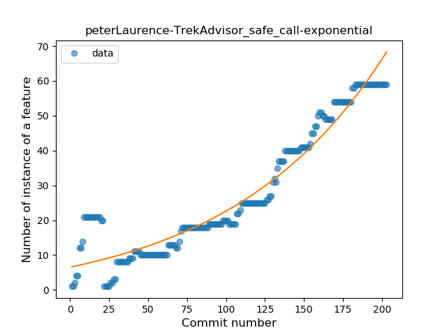
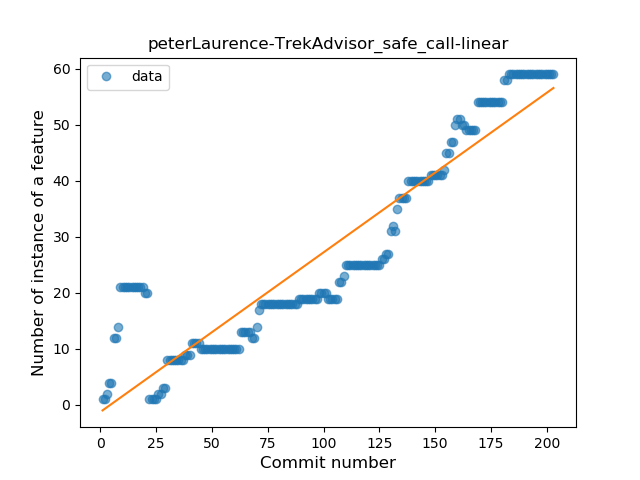
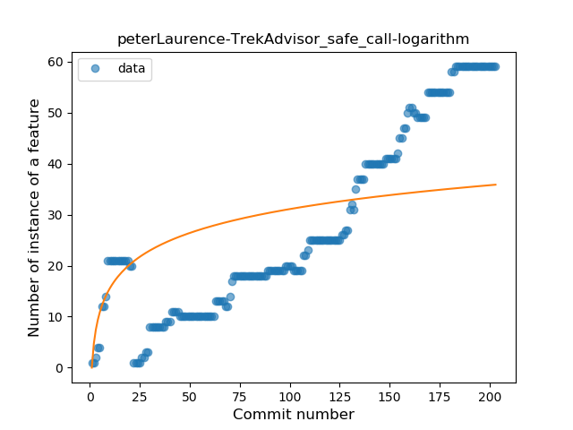
### <a name="when_expr">When expression</a>
----
#### Functions
* **Constant Rise - Linear:** 
    * **R_Squared:** 0.94451336
* **Sudden Rise Plateau - Logarithm:** 
    * **R_Squared:** 0.82065294
* **Plateau Sudden Rise - Binary Sigmoid:** 
    * **R_Squared:** 0.4771494

**Plots** :chart_with_upwards_trend:
-----

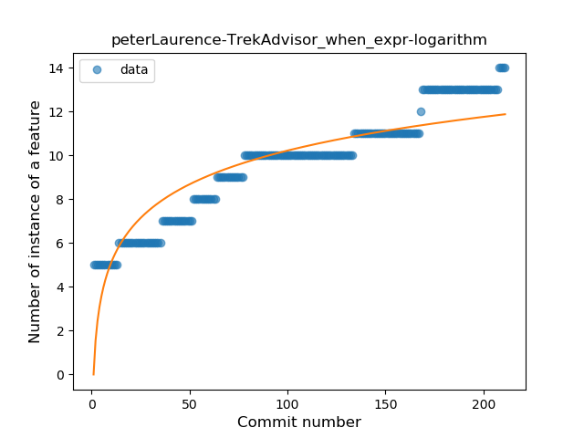
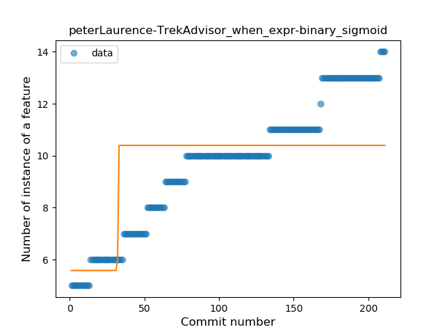
### <a name="companion_object">Companion Object</a>
----
#### Functions
* **Plateau Gradual Rise - Sigmoid:** 
    * **R_Squared:** 0.97075136
* **Constant Rise - Linear:** 
    * **R_Squared:** 0.95425692
* **Sudden Rise Plateau - Logarithm:** 
    * **R_Squared:** 0.60864127

**Plots** :chart_with_upwards_trend:
-----

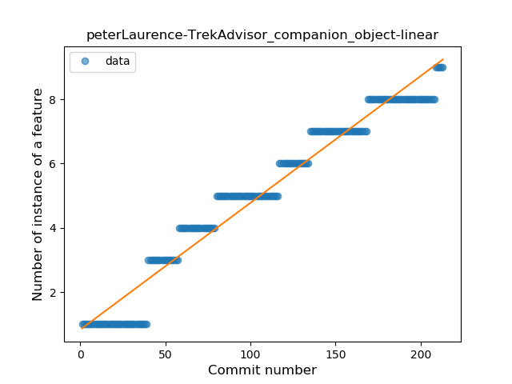
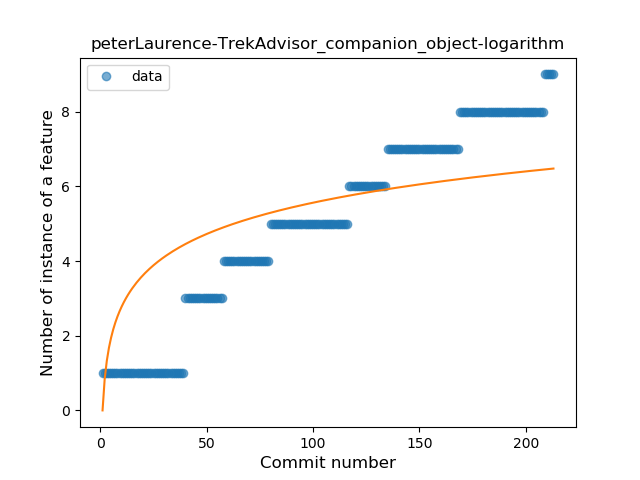
### <a name="unsafe_call">Unsafe Call</a>
----
#### Functions
* **Plateau Gradual Rise - Sigmoid:** 
    * **R_Squared:** 0.97052105
* **Sudden Rise - Exponential:** 
    * **R_Squared:** 0.94142478
* **Constant Rise - Linear:** 
    * **R_Squared:** 0.88812177
* **Sudden Rise Plateau - Logarithm:** 
    * **R_Squared:** 0.34497868

**Plots** :chart_with_upwards_trend:
-----

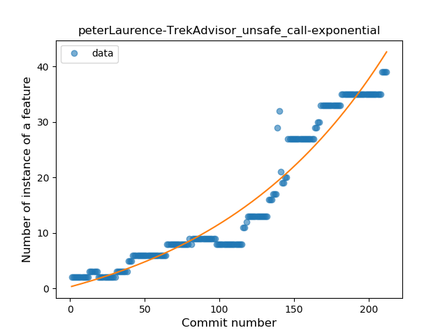
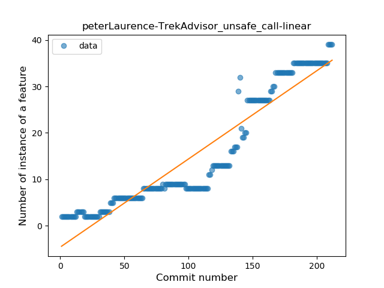
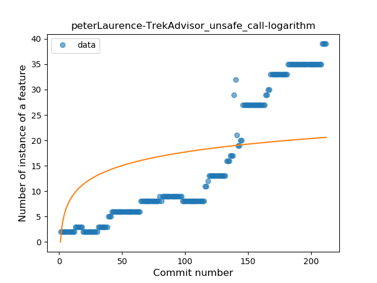
### <a name="string_template">String Template</a>
----
#### Functions
* **Constant Rise - Linear:** 
    * **R_Squared:** 0.95798698
* **Sudden Rise - Exponential:** 
    * **R_Squared:** 0.96030685
* **Sudden Rise Plateau - Logarithm:** 
    * **R_Squared:** 0.51293613

**Plots** :chart_with_upwards_trend:
-----

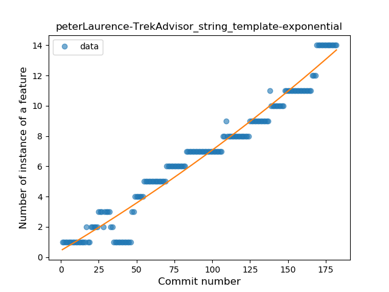
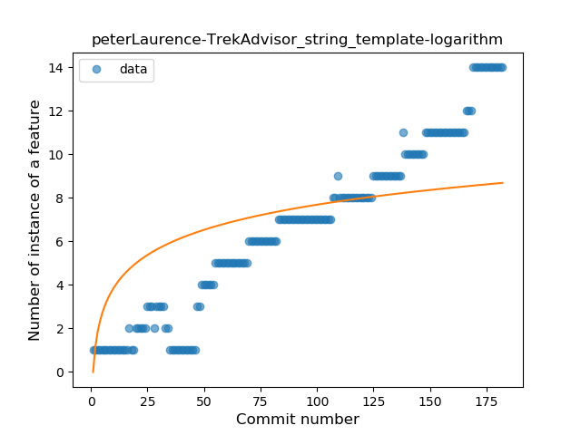
### <a name="func_with_default_value">Function with Default Value</a>
----
#### Functions
* **Sudden Rise - Exponential:** 
    * **R_Squared:** 0.94532541
* **Constant Rise - Linear:** 
    * **R_Squared:** 0.90877039
* **Sudden Rise Plateau - Logarithm:** 
    * **R_Squared:** 0.50822951

**Plots** :chart_with_upwards_trend:
-----

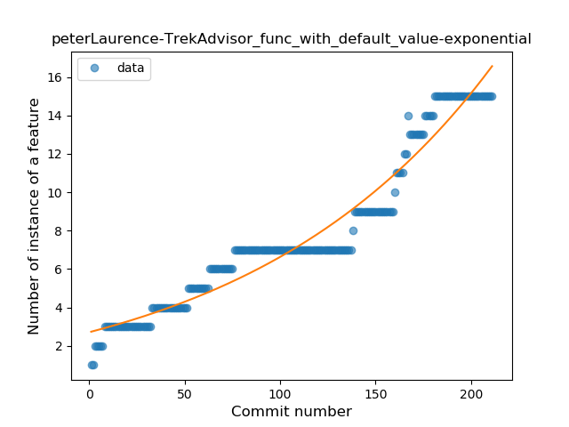

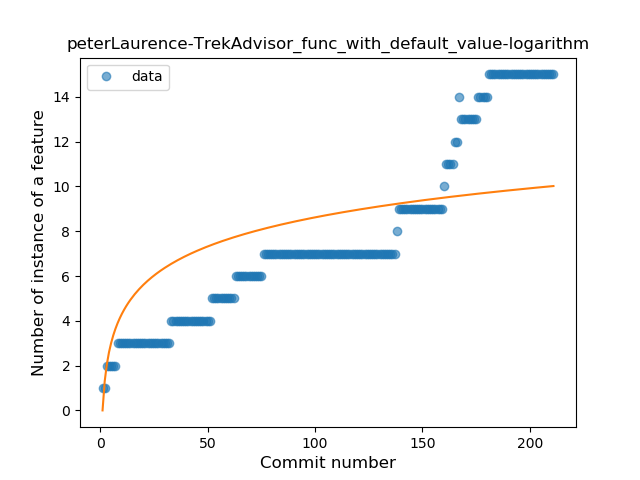
### <a name="singleton">Singleton</a>
----
#### Functions
* **Plateau Gradual Rise - Sigmoid:** 
    * **R_Squared:** 0.97892952
* **Sudden Rise - Exponential:** 
    * **R_Squared:** 0.93647872
* **Constant Rise - Linear:** 
    * **R_Squared:** 0.8248686
* **Sudden Rise Plateau - Logarithm:** 
    * **R_Squared:** 0.42712517

**Plots** :chart_with_upwards_trend:
-----

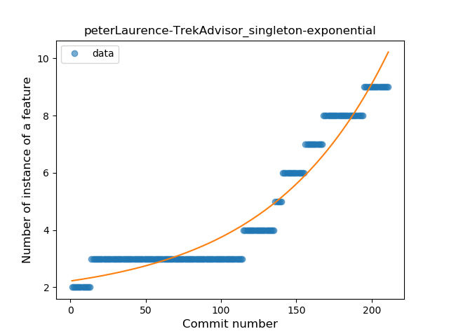
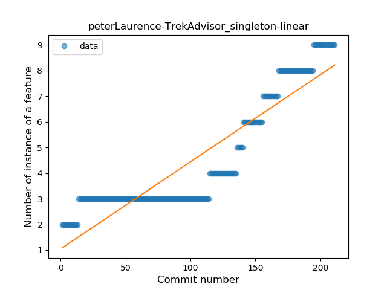
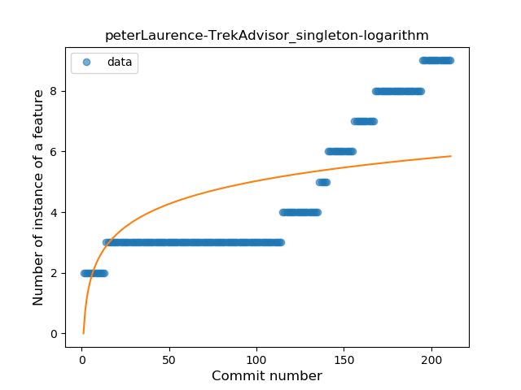
### <a name="range_expr">Range Expression</a>
----
#### Functions
* **Plateau Gradual Rise - Sigmoid:** 
    * **R_Squared:** 0.99146833
* **Sudden Rise Plateau - Logarithm:** 
    * **R_Squared:** 0.60474681
* **Constant Rise - Linear:** 
    * **R_Squared:** 0.25789838

**Plots** :chart_with_upwards_trend:
-----

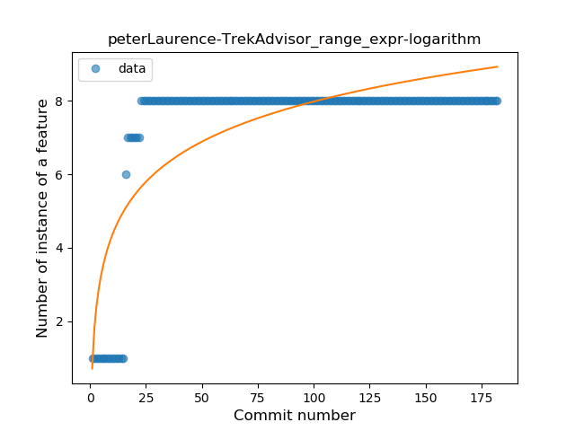
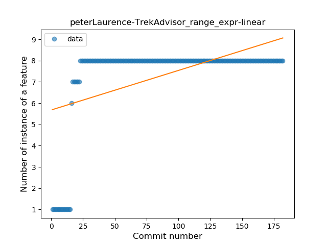
### <a name="func_call_with_named_arg">Function call with Named Argument</a>
----
#### Functions
* **Sudden Rise - Exponential:** 
    * **R_Squared:** 0.74652996
* **Constant Rise - Linear:** 
    * **R_Squared:** 0.44319554
* **Sudden Rise Plateau - Logarithm:** 
    * **R_Squared:** 0.25966045
* **Plateau Sudden Rise - Binary Sigmoid:** 
    * **R_Squared:** 0.08462602

**Plots** :chart_with_upwards_trend:
-----

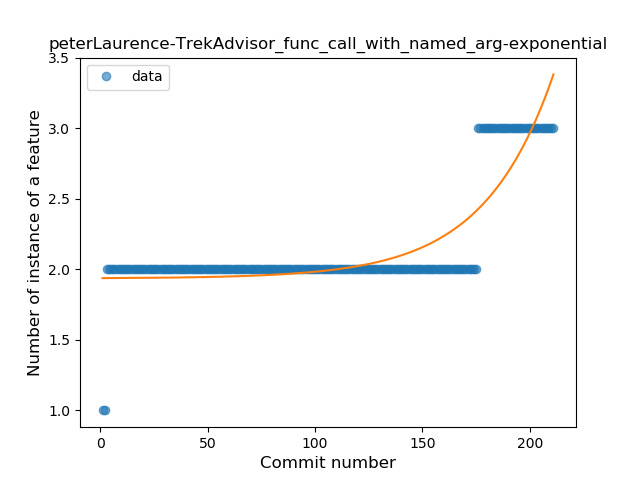

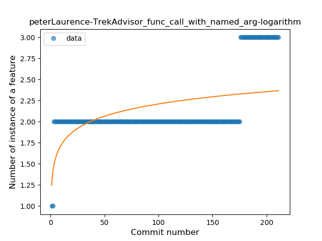
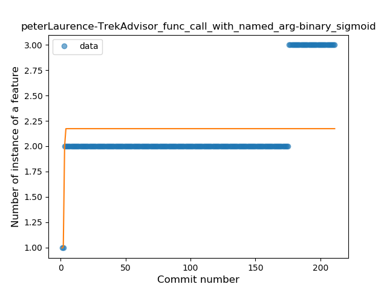
### <a name="data_class">Data Class</a>
----
#### Functions
* **Constant Rise - Linear:** 
    * **R_Squared:** 0.90319789
* **Sudden Rise Plateau - Logarithm:** 
    * **R_Squared:** 0.62936278

**Plots** :chart_with_upwards_trend:
-----

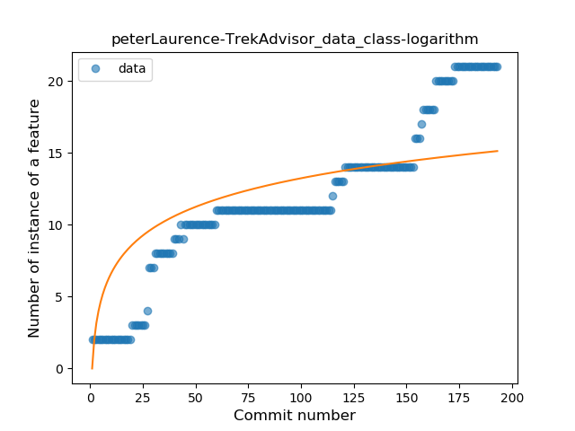
### <a name="extension_function">Extension Function</a>
----
#### Functions
* **Sudden Rise - Exponential:** 
    * **R_Squared:** 0.96562541
* **Constant Rise - Linear:** 
    * **R_Squared:** 0.93611535
* **Sudden Rise Plateau - Logarithm:** 
    * **R_Squared:** 0.53238364

**Plots** :chart_with_upwards_trend:
-----

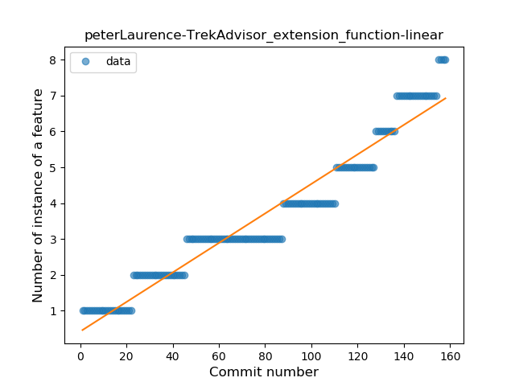
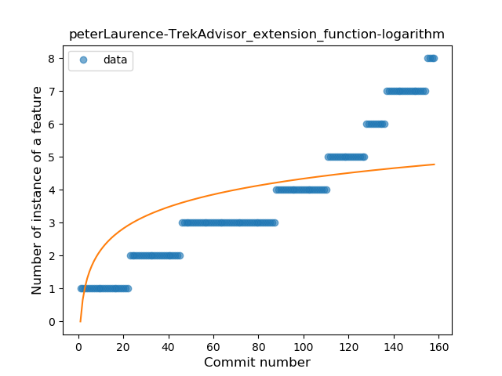
### <a name="property_delegation">Property Delegation</a>
----
#### Functions
* **Plateau Sudden Decline - Binary Sigmoid:** 
    * **R_Squared:** 1.0
* **Sudden Decline - Exponential:** 
    * **R_Squared:** 0.7880212
* **Constant Decline - Linear:** 
    * **R_Squared:** 0.38653846
* **Sudden Rise Plateau - Logarithm:** 
    * **R_Squared:** -0.0

**Plots** :chart_with_upwards_trend:
-----

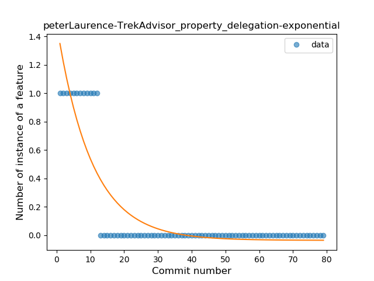
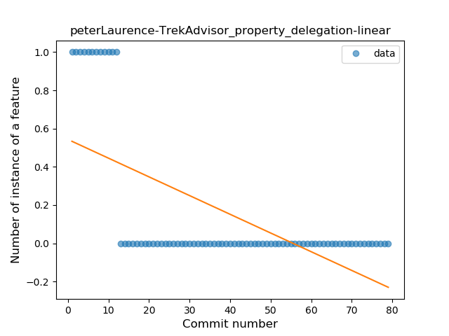
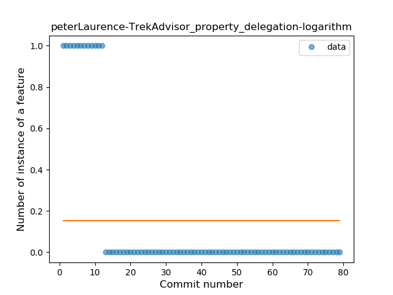
### <a name="destructuring_declaration">Destructuring Declaration</a>
----
#### Functions
* **Plateau Gradual Rise - Sigmoid:** 
    * **R_Squared:** 0.89748541
* **Sudden Rise Plateau - Logarithm:** 
    * **R_Squared:** 0.77272088
* **Constant Rise - Linear:** 
    * **R_Squared:** 0.44961057

**Plots** :chart_with_upwards_trend:
-----

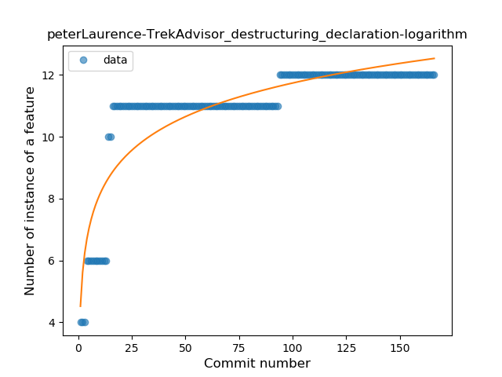
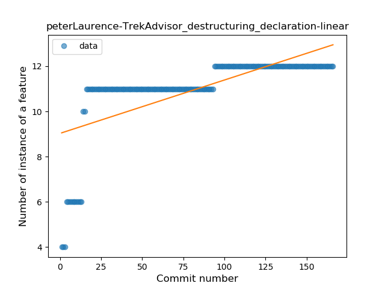
