## pflammertsma-cryptogram
----
#### Metrics provided by Detekt
* Number of lines of code 6744
* Number of Kotlin files: 46
* Cyclomatic complexity: 1136
* Cyclomatic complexity by thousands of lines: 291 

----
**12** features analyzed

*	<a href="#type_inference">Type Inference</a> 
*	<a href="#lambda">Lambda</a> 
*	<a href="#safe_call">Safe Call</a> 
*	<a href="#when_expr">When expression</a> 
*	<a href="#companion_object">Companion Object</a> 
*	<a href="#unsafe_call">Unsafe Call</a> 
*	<a href="#string_template">String Template</a> 
*	<a href="#func_with_default_value">Function with Default Value</a> 
*	<a href="#singleton">Singleton</a> 
*	<a href="#smart_cast">Smart Cast</a> 
*	<a href="#range_expr">Range Expression</a> 
*	<a href="#func_call_with_named_arg">Function call with Named Argument</a> 

### <a name="type_inference">Type Inference</a>
----
#### Functions
* **Instability - Polinomial 3:** )
    * **R_Squared:** 0.86675113
* **Sudden Rise Plateau - Logarithm:** 
    * **R_Squared:** 0.6388494
* **Constant Rise - Linear:** 
    * **R_Squared:** 0.46892142

**Plots** :chart_with_upwards_trend:
-----

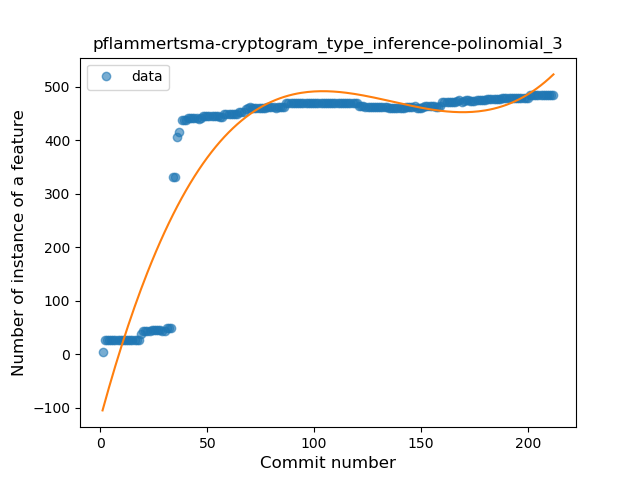
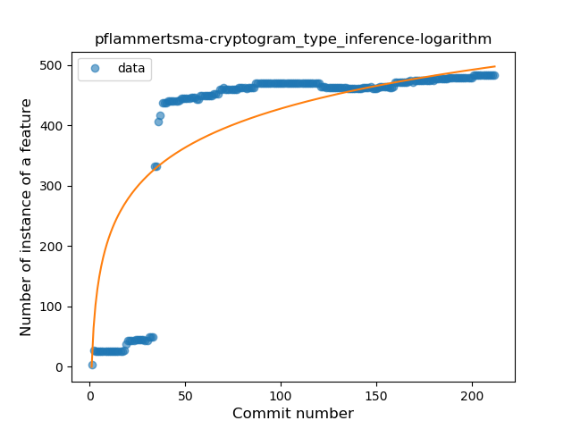
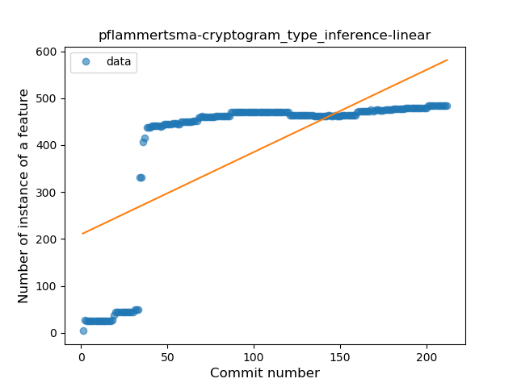
### <a name="lambda">Lambda</a>
----
#### Functions
* **Instability - Polinomial 3:** )
    * **R_Squared:** 0.92904633
* **Sudden Rise Plateau - Logarithm:** 
    * **R_Squared:** 0.77160499
* **Constant Rise - Linear:** 
    * **R_Squared:** 0.63899916
* **Plateau Sudden Rise - Binary Sigmoid:** 
    * **R_Squared:** 0.39734912

**Plots** :chart_with_upwards_trend:
-----

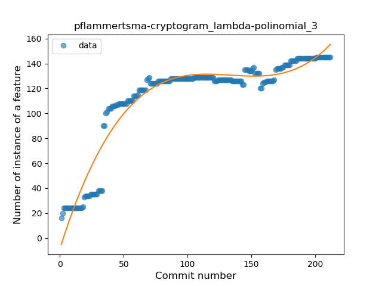
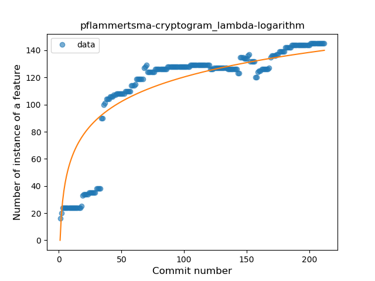
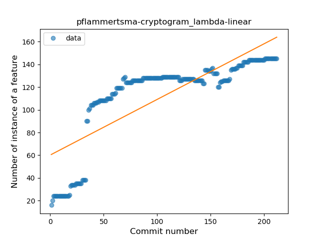
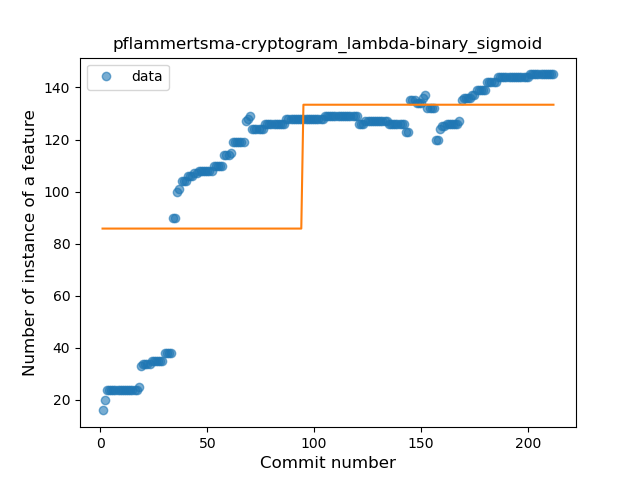
### <a name="safe_call">Safe Call</a>
----
#### Functions
* **Constant Rise - Linear:** 
    * **R_Squared:** 0.74864384
* **Sudden Rise Plateau - Logarithm:** 
    * **R_Squared:** 0.65281846

**Plots** :chart_with_upwards_trend:
-----

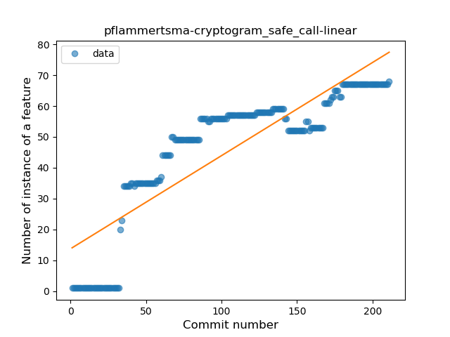
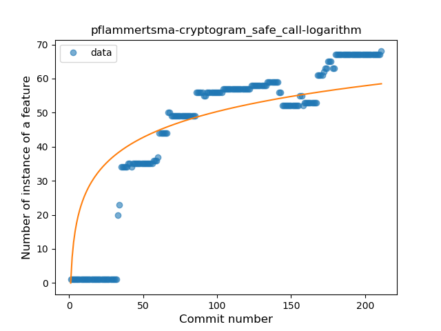
### <a name="when_expr">When expression</a>
----
#### Functions
* **Plateau Sudden Rise - Binary Sigmoid:** 
    * **R_Squared:** 0.83433025
* **Sudden Rise Plateau - Logarithm:** 
    * **R_Squared:** 0.69280194
* **Constant Rise - Linear:** 
    * **R_Squared:** 0.57671174

**Plots** :chart_with_upwards_trend:
-----

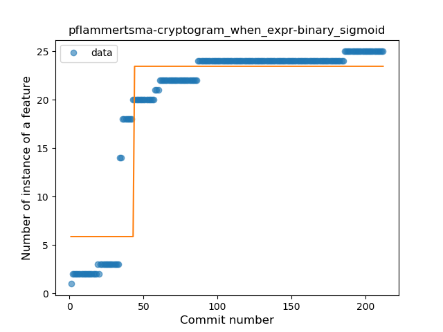
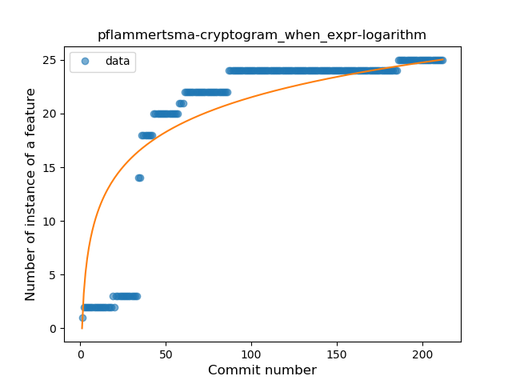
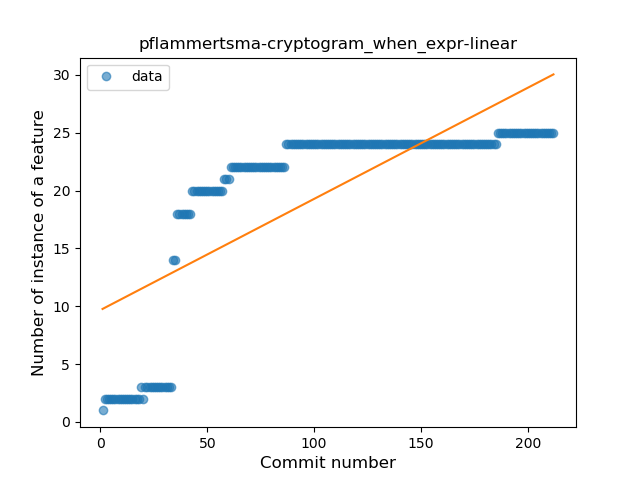
### <a name="companion_object">Companion Object</a>
----
#### Functions
* **Sudden Rise Plateau - Logarithm:** 
    * **R_Squared:** 0.67196177
* **Constant Rise - Linear:** 
    * **R_Squared:** 0.38353774
* **Plateau Sudden Rise - Binary Sigmoid:** 
    * **R_Squared:** 0.35220652

**Plots** :chart_with_upwards_trend:
-----

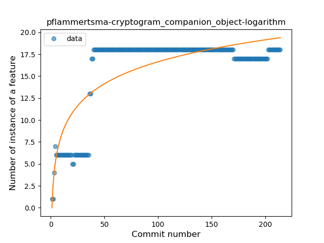
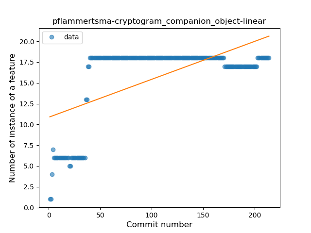
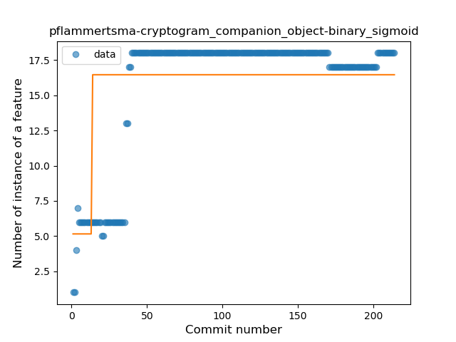
### <a name="unsafe_call">Unsafe Call</a>
----
#### Functions
* **Sudden Rise Plateau - Logarithm:** 
    * **R_Squared:** 0.28239789
* **Plateau Sudden Rise - Binary Sigmoid:** 
    * **R_Squared:** 0.06286184
* **Constant Rise - Linear:** 
    * **R_Squared:** 0.05231873

**Plots** :chart_with_upwards_trend:
-----

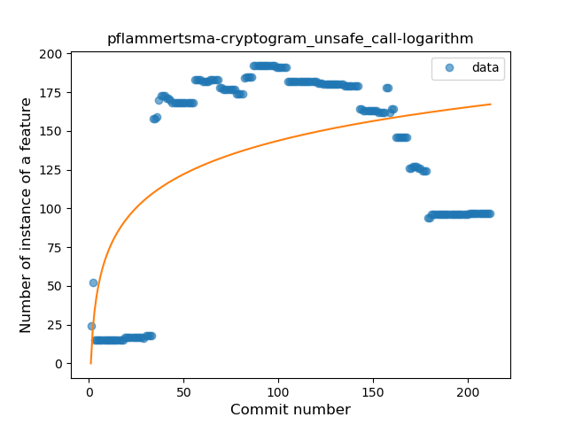
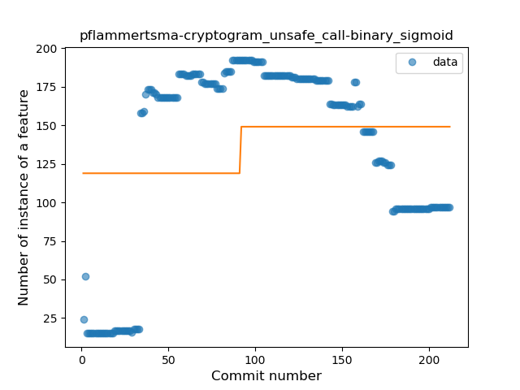
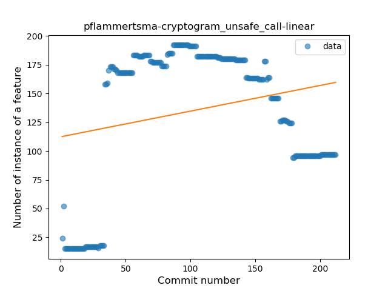
### <a name="string_template">String Template</a>
----
#### Functions
* **Sudden Rise Plateau - Logarithm:** 
    * **R_Squared:** 0.25375024
* **Plateau Sudden Rise - Binary Sigmoid:** 
    * **R_Squared:** 0.22906239
* **Constant Rise - Linear:** 
    * **R_Squared:** 0.01741747

**Plots** :chart_with_upwards_trend:
-----

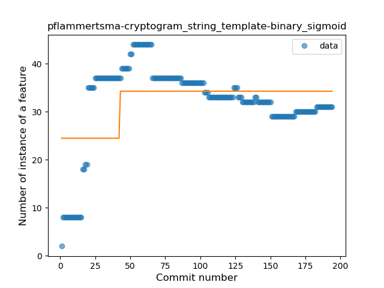
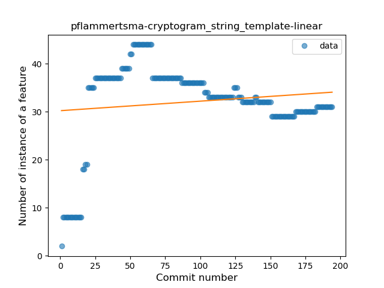
### <a name="func_with_default_value">Function with Default Value</a>
----
#### Functions
* **Plateau Gradual Rise - Sigmoid:** 
    * **R_Squared:** 0.97473215
* **Sudden Rise Plateau - Logarithm:** 
    * **R_Squared:** 0.71150889
* **Constant Rise - Linear:** 
    * **R_Squared:** 0.39030107

**Plots** :chart_with_upwards_trend:
-----

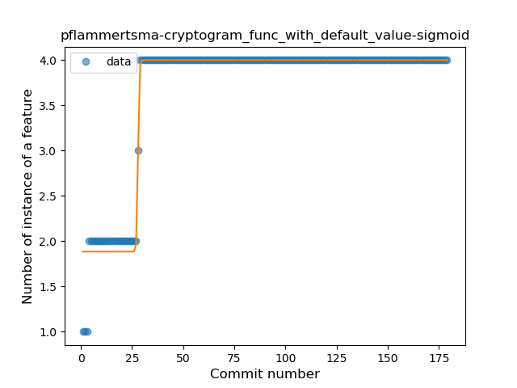
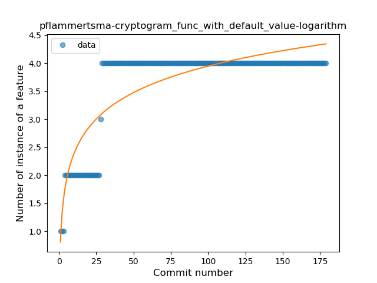
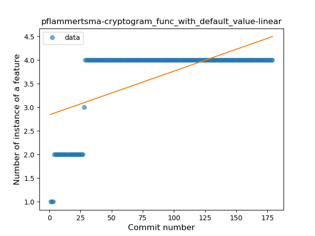
### <a name="singleton">Singleton</a>
----
#### Functions
* **Plateau Gradual Rise - Sigmoid:** 
    * **R_Squared:** 0.99246574
* **Sudden Rise Plateau - Logarithm:** 
    * **R_Squared:** 0.63649617
* **Constant Rise - Linear:** 
    * **R_Squared:** 0.45165792

**Plots** :chart_with_upwards_trend:
-----

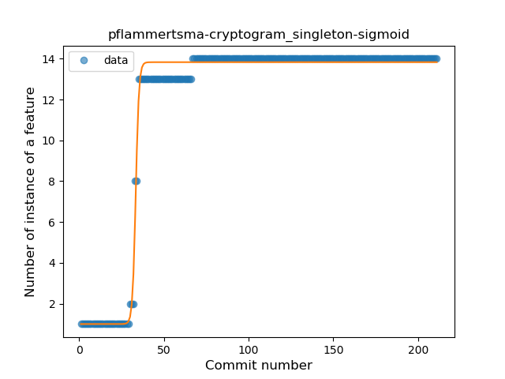
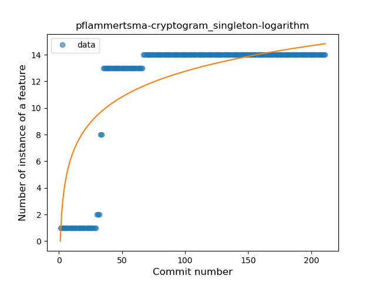
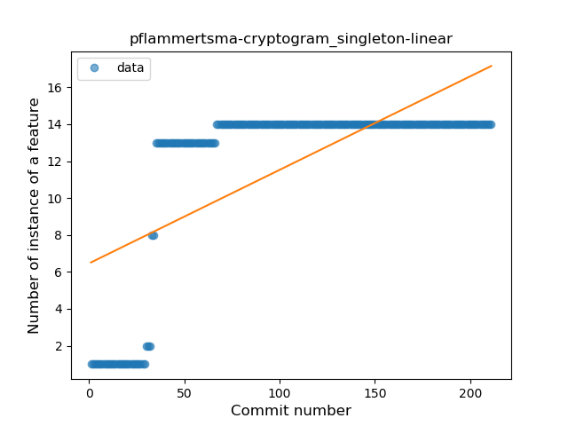
### <a name="smart_cast">Smart Cast</a>
----
#### Functions
* **Plateau Sudden Decline - Binary Sigmoid:** 
    * **R_Squared:** 1.0
* **Sudden Decline - Exponential:** 
    * **R_Squared:** 0.77705731
* **Constant Decline - Linear:** 
    * **R_Squared:** 0.49514825
* **Sudden Rise Plateau - Logarithm:** 
    * **R_Squared:** -0.0

**Plots** :chart_with_upwards_trend:
-----

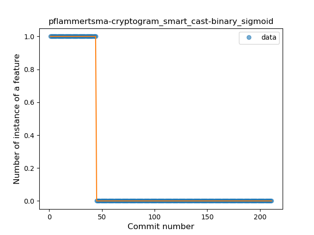
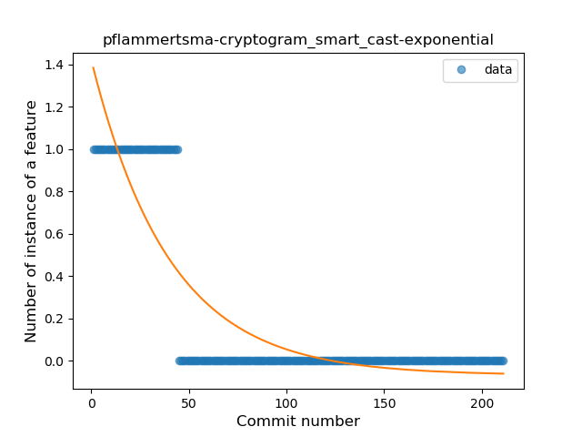
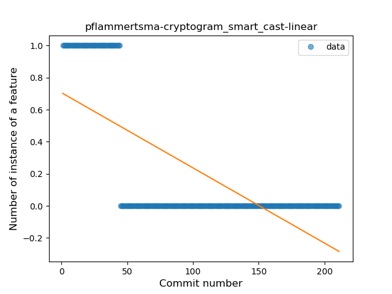
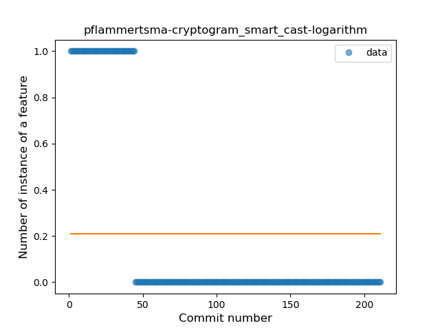
### <a name="range_expr">Range Expression</a>
----
#### Functions
* **Plateau Sudden Rise - Binary Sigmoid:** 
    * **R_Squared:** 0.76871055
* **Sudden Rise Plateau - Logarithm:** 
    * **R_Squared:** 0.48483524
* **Constant Rise - Linear:** 
    * **R_Squared:** 0.21921317

**Plots** :chart_with_upwards_trend:
-----

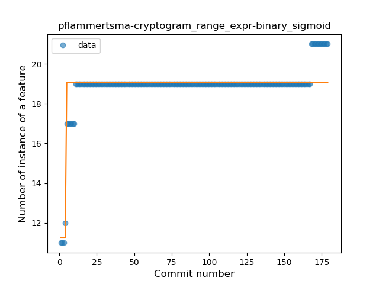
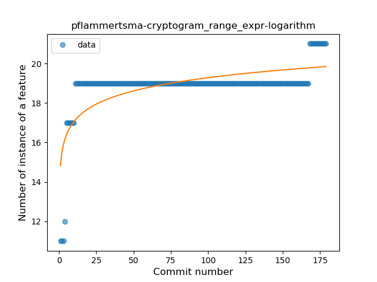
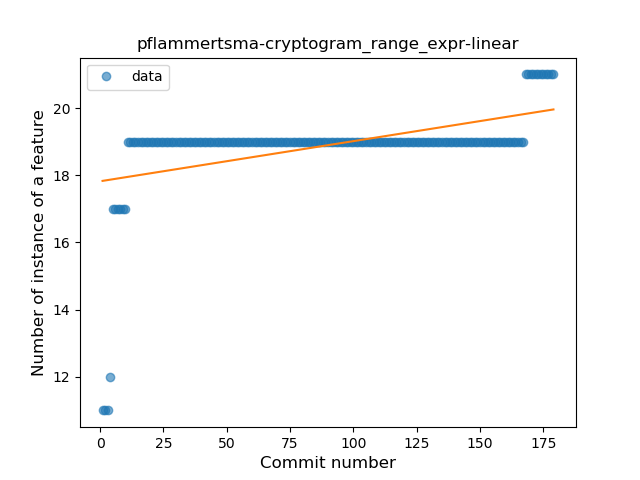
### <a name="func_call_with_named_arg">Function call with Named Argument</a>
----
#### Functions
* **Plateau Gradual Rise - Sigmoid:** 
    * **R_Squared:** 0.91713149
* **Sudden Rise Plateau - Logarithm:** 
    * **R_Squared:** 0.49322483
* **Constant Rise - Linear:** 
    * **R_Squared:** 0.14529886

**Plots** :chart_with_upwards_trend:
-----

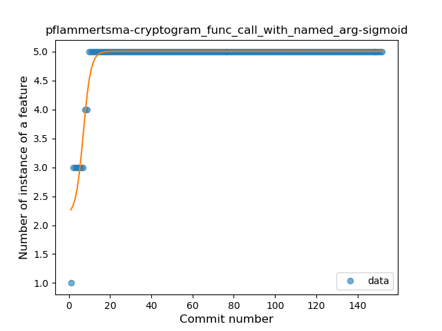
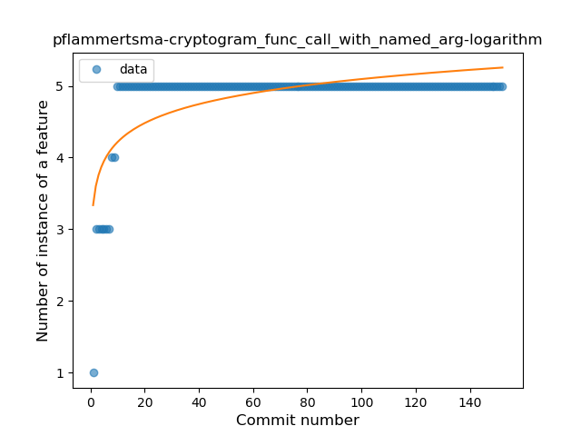
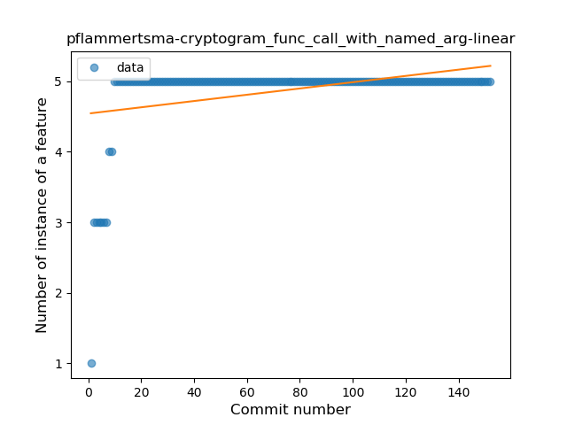
