## pistatium-mahougen
----
#### Metrics provided by Detekt
* Number of lines of code 231
* Number of Kotlin files: 4
* Cyclomatic complexity: 31
* Cyclomatic complexity by thousands of lines: 269 

----
**5** features analyzed

*	<a href="#type_inference">Type Inference</a> 
*	<a href="#lambda">Lambda</a> 
*	<a href="#companion_object">Companion Object</a> 
*	<a href="#string_template">String Template</a> 
*	<a href="#func_with_default_value">Function with Default Value</a> 

### <a name="type_inference">Type Inference</a>
----
#### Functions
* **Instability - Polinomial 4:** 
    * **R_Squared:** 0.88179121
* **Instability - Polinomial 3:** )
    * **R_Squared:** 0.74438419
* **Sudden Rise Plateau - Logarithm:** 
    * **R_Squared:** 0.64701439
* **Constant Rise - Linear:** 
    * **R_Squared:** 0.32735015
* **Plateau Sudden Rise - Binary Sigmoid:** 
    * **R_Squared:** 0.33418509

**Plots** :chart_with_upwards_trend:
-----

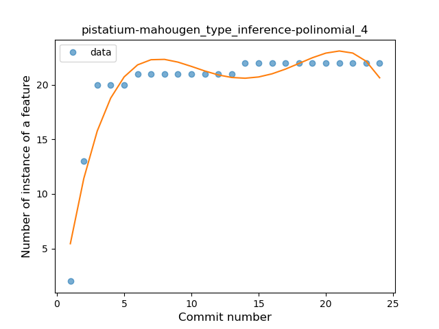
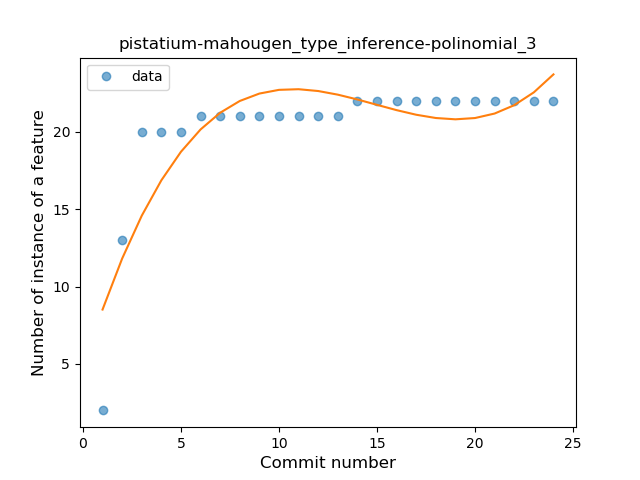
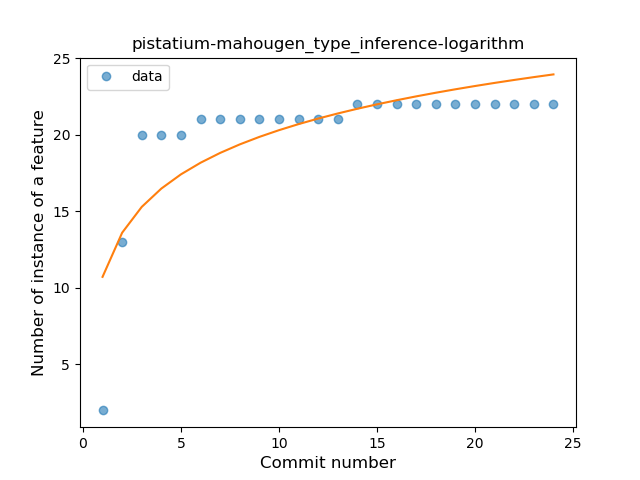

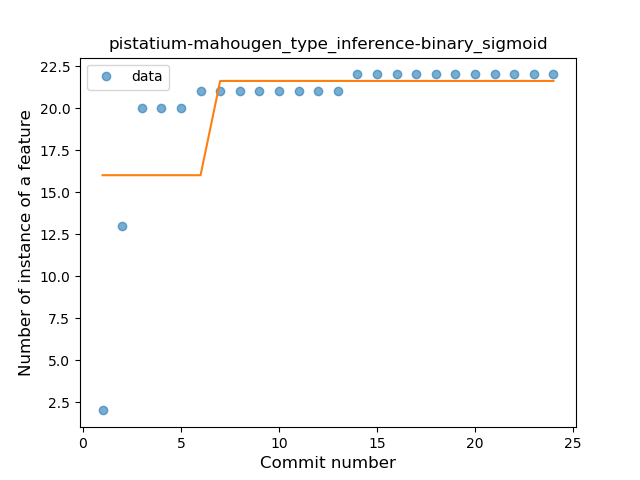
### <a name="lambda">Lambda</a>
----
#### Functions
* **Plateau Gradual Rise - Sigmoid:** 
    * **R_Squared:** 0.97134587
* **Instability - Polinomial 4:** 
    * **R_Squared:** 0.95421778
* **Instability - Polinomial 3:** )
    * **R_Squared:** 0.92413558
* **Sudden Rise Plateau - Logarithm:** 
    * **R_Squared:** 0.73685024
* **Constant Rise - Linear:** 
    * **R_Squared:** 0.40525974

**Plots** :chart_with_upwards_trend:
-----

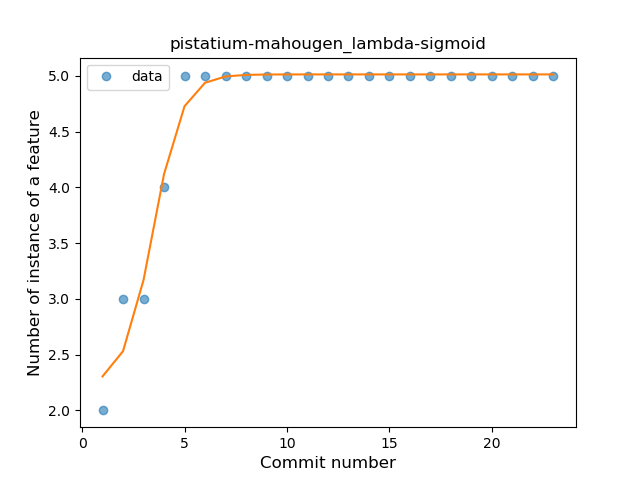
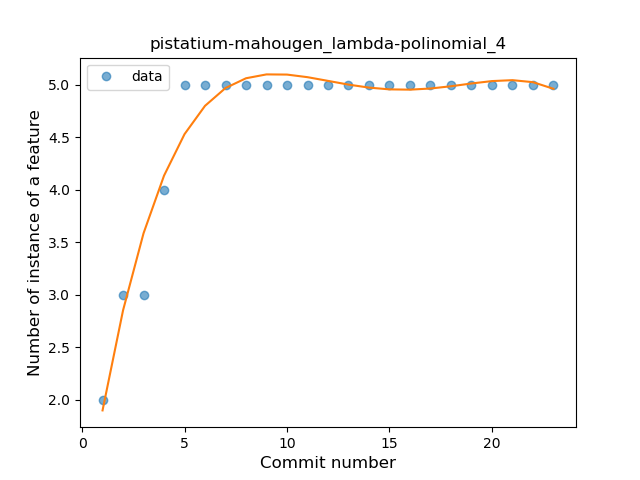
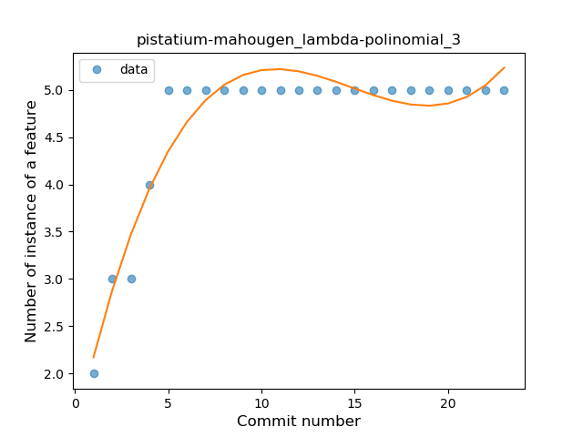
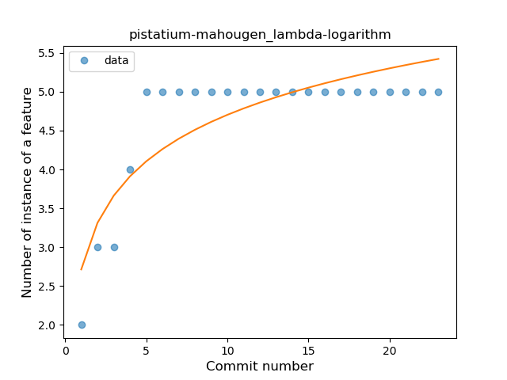
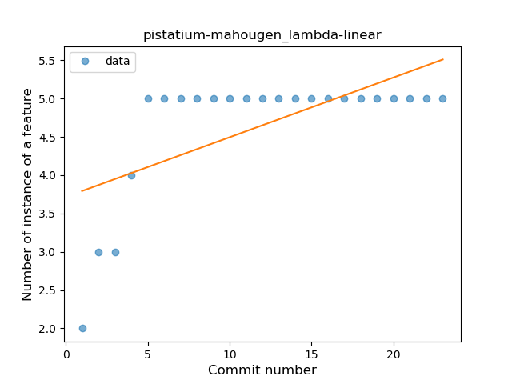
### <a name="companion_object">Companion Object</a>
----
#### Functions
* **Instability - Polinomial 4:** 
    * **R_Squared:** 0.65897436
* **Instability - Polinomial 3:** )
    * **R_Squared:** 0.48846154
* **Sudden Rise Plateau - Logarithm:** 
    * **R_Squared:** 0.35027481
* **Constant Rise - Linear:** 
    * **R_Squared:** 0.125

**Plots** :chart_with_upwards_trend:
-----

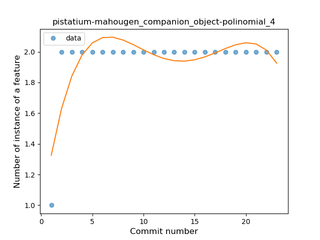
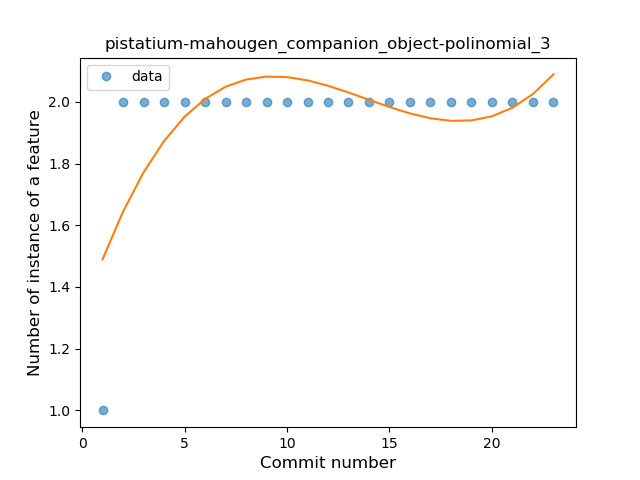
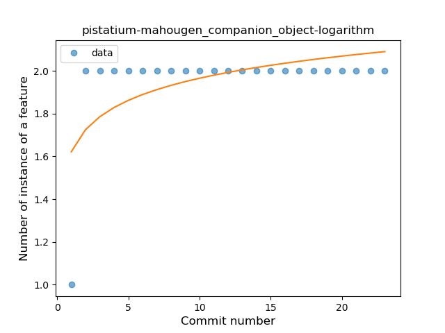
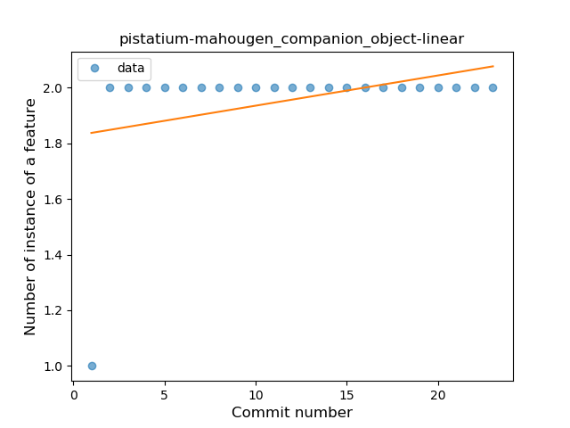
### <a name="string_template">String Template</a>
----
#### Functions
* **Plateau Sudden Rise - Binary Sigmoid:** 
    * **R_Squared:** 1.0
* **Instability - Polinomial 3:** )
    * **R_Squared:** 0.86230794
* **Constant Rise - Linear:** 
    * **R_Squared:** 0.7515528
* **Sudden Rise Plateau - Logarithm:** 
    * **R_Squared:** 0.58070545

**Plots** :chart_with_upwards_trend:
-----

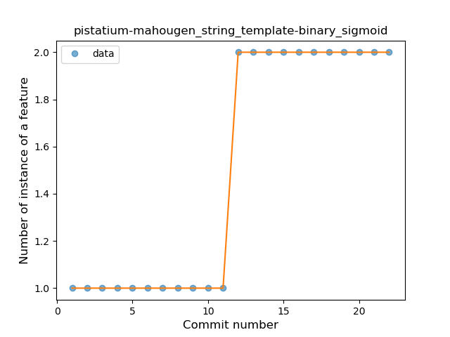
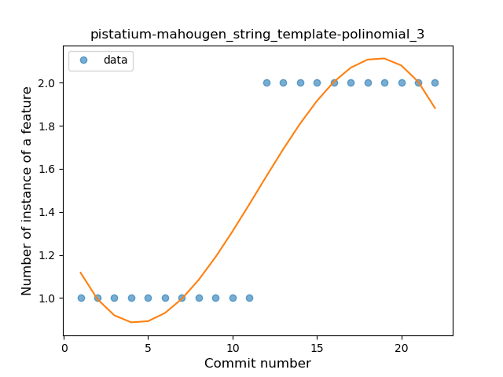
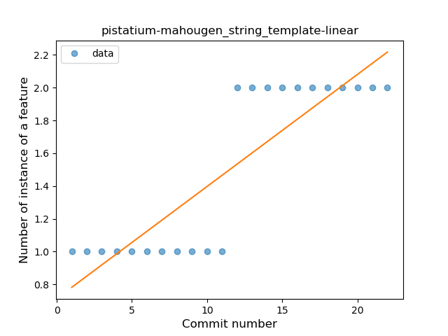
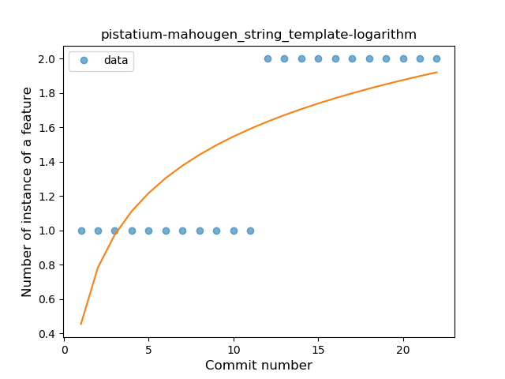
### <a name="func_with_default_value">Function with Default Value</a>
----
#### Functions
* **Plateau Sudden Rise - Binary Sigmoid:** 
    * **R_Squared:** 1.0
* **Instability - Polinomial 4:** 
    * **R_Squared:** 0.83333015
* **Instability - Polinomial 3:** )
    * **R_Squared:** 0.73447205
* **Sudden Rise Plateau - Logarithm:** 
    * **R_Squared:** 0.53426069
* **Constant Rise - Linear:** 
    * **R_Squared:** 0.2484472

**Plots** :chart_with_upwards_trend:
-----

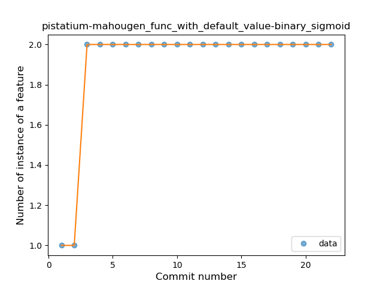
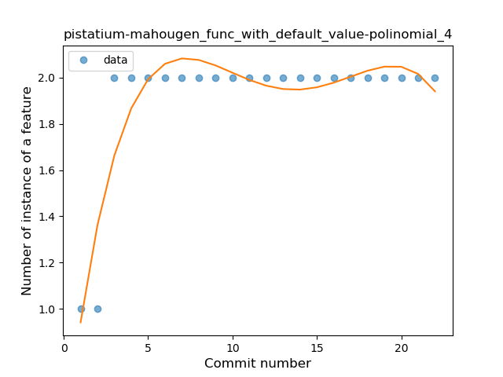
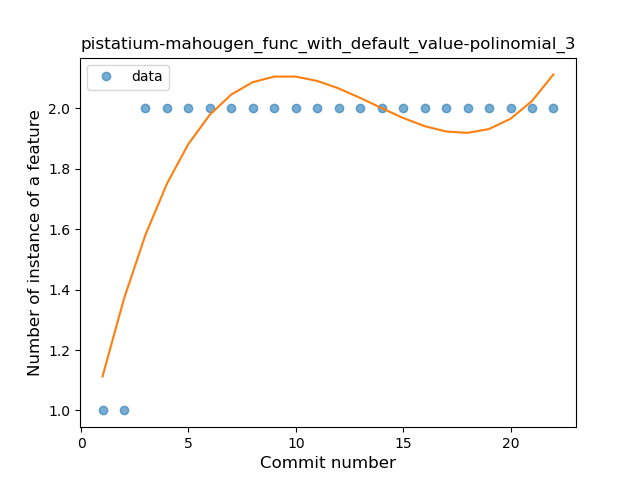
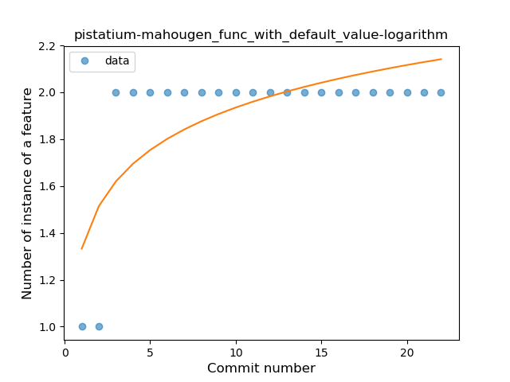
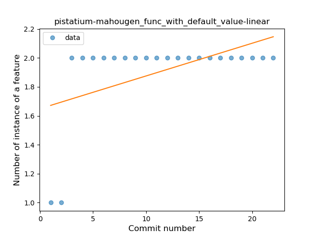
