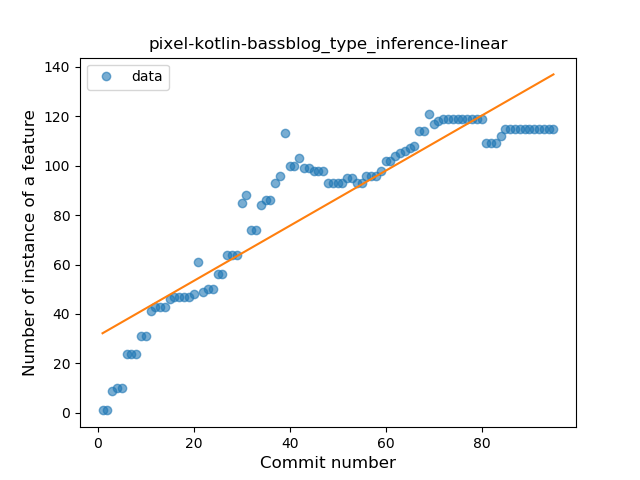
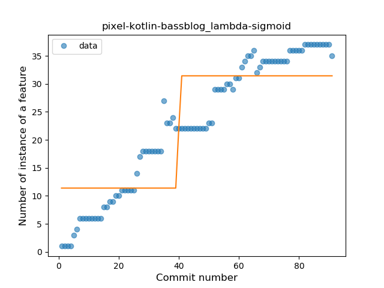
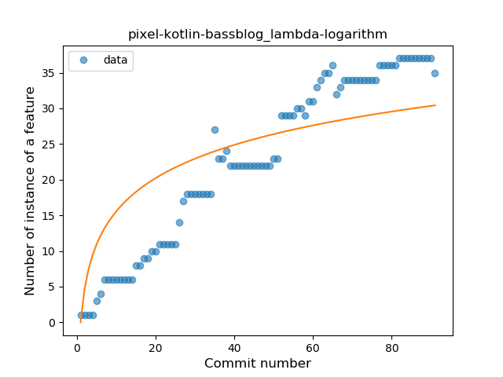
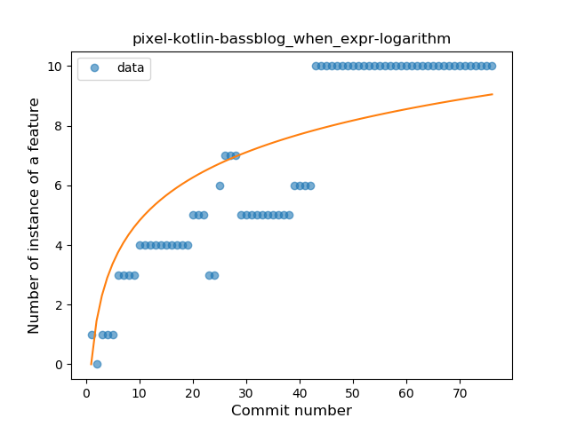
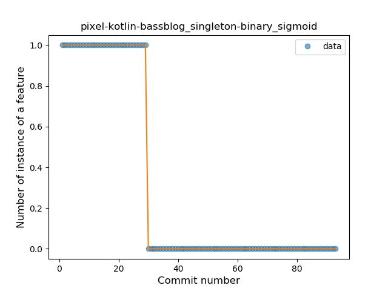
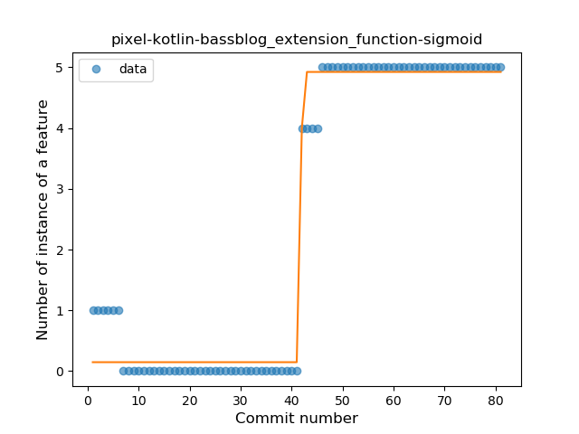

## pixel-kotlin-bassblog
----
#### Metrics provided by Detekt
* Number of lines of code 1860
* Number of Kotlin files: 25
* Cyclomatic complexity: 326
* Cyclomatic complexity by thousands of lines: 357 

----
**11** features analyzed

*	<a href="#type_inference">Type Inference</a> 
*	<a href="#lambda">Lambda</a> 
*	<a href="#safe_call">Safe Call</a> 
*	<a href="#when_expr">When expression</a> 
*	<a href="#unsafe_call">Unsafe Call</a> 
*	<a href="#companion_object">Companion Object</a> 
*	<a href="#string_template">String Template</a> 
*	<a href="#func_with_default_value">Function with Default Value</a> 
*	<a href="#singleton">Singleton</a> 
*	<a href="#smart_cast">Smart Cast</a> 
*	<a href="#extension_function">Extension Function</a> 

### <a name="type_inference">Type Inference</a>
----
#### Functions
* **Constant Rise - Linear:** 
    * **R_Squared:** 0.83606957
* **Sudden Rise Plateau - Logarithm:** 
    * **R_Squared:** 0.82908654

**Plots** :chart_with_upwards_trend:
-----

### <a name="lambda">Lambda</a>
----
#### Functions
* **Constant Rise - Linear:** 
    * **R_Squared:** 0.94890958
* **Plateau Gradual Rise - Sigmoid:** 
    * **R_Squared:** 0.72037042
* **Sudden Rise Plateau - Logarithm:** 
    * **R_Squared:** 0.68737143

**Plots** :chart_with_upwards_trend:
-----

### <a name="safe_call">Safe Call</a>
----
#### Functions
* **Constant Rise - Linear:** 
    * **R_Squared:** 0.90825671
* **Sudden Rise Plateau - Logarithm:** 
    * **R_Squared:** 0.73298609
* **Plateau Sudden Rise - Binary Sigmoid:** 
    * **R_Squared:** 0.25936071

**Plots** :chart_with_upwards_trend:
-----

### <a name="when_expr">When expression</a>
----
#### Functions
* **Plateau Gradual Rise - Sigmoid:** 
    * **R_Squared:** 0.87575995
* **Constant Rise - Linear:** 
    * **R_Squared:** 0.84838871
* **Sudden Rise Plateau - Logarithm:** 
    * **R_Squared:** 0.69686814

**Plots** :chart_with_upwards_trend:
-----

### <a name="unsafe_call">Unsafe Call</a>
----
#### Functions
* **Instability - Polinomial 3:** )
    * **R_Squared:** 0.83040004
* **Constant Decline - Linear:** 
    * **R_Squared:** 0.07438075
* **Sudden Rise Plateau - Logarithm:** 
    * **R_Squared:** 0.00450944

**Plots** :chart_with_upwards_trend:
-----

### <a name="companion_object">Companion Object</a>
----
#### Functions
* **Plateau Gradual Rise - Sigmoid:** 
    * **R_Squared:** 0.91768666
* **Constant Rise - Linear:** 
    * **R_Squared:** 0.85078124
* **Sudden Rise Plateau - Logarithm:** 
    * **R_Squared:** 0.66834394

**Plots** :chart_with_upwards_trend:
-----

### <a name="string_template">String Template</a>
----
#### Functions
* **Instability - Polinomial 3:** )
    * **R_Squared:** 0.31495574
* **Plateau Gradual Decline - Sigmoid:** 
    * **R_Squared:** 0.0228862
* **Constant Rise - Linear:** 
    * **R_Squared:** 0.00691163
* **Sudden Rise Plateau - Logarithm:** 
    * **R_Squared:** 0.00214824

**Plots** :chart_with_upwards_trend:
-----

### <a name="func_with_default_value">Function with Default Value</a>
----
#### Functions
* **Plateau Gradual Rise - Sigmoid:** 
    * **R_Squared:** 0.90047822
* **Constant Rise - Linear:** 
    * **R_Squared:** 0.67826278
* **Sudden Rise Plateau - Logarithm:** 
    * **R_Squared:** 0.56371051

**Plots** :chart_with_upwards_trend:
-----

### <a name="singleton">Singleton</a>
----
#### Functions
* **Plateau Sudden Decline - Binary Sigmoid:** 
    * **R_Squared:** 1.0
* **Sudden Decline - Exponential:** 
    * **R_Squared:** 0.76178815
* **Constant Decline - Linear:** 
    * **R_Squared:** 0.64384829
* **Sudden Rise Plateau - Logarithm:** 
    * **R_Squared:** -0.0

**Plots** :chart_with_upwards_trend:
-----

### <a name="smart_cast">Smart Cast</a>
----
#### Functions
* **Constant Decline - Linear:** 
    * **R_Squared:** 0.00738149
* **Sudden Decline - Exponential:** 
    * **R_Squared:** 0.00737246
* **Sudden Rise Plateau - Logarithm:** 
    * **R_Squared:** -0.0

**Plots** :chart_with_upwards_trend:
-----

### <a name="extension_function">Extension Function</a>
----
#### Functions
* **Plateau Gradual Rise - Sigmoid:** 
    * **R_Squared:** 0.9830751
* **Instability - Polinomial 3:** )
    * **R_Squared:** 0.88344062
* **Constant Rise - Linear:** 
    * **R_Squared:** 0.72356144
* **Sudden Rise - Exponential:** 
    * **R_Squared:** 0.72879927
* **Sudden Rise Plateau - Logarithm:** 
    * **R_Squared:** 0.30214619

**Plots** :chart_with_upwards_trend:
-----

