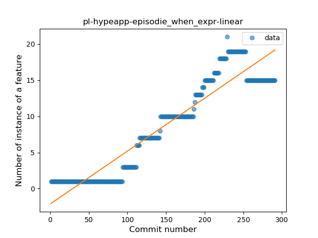
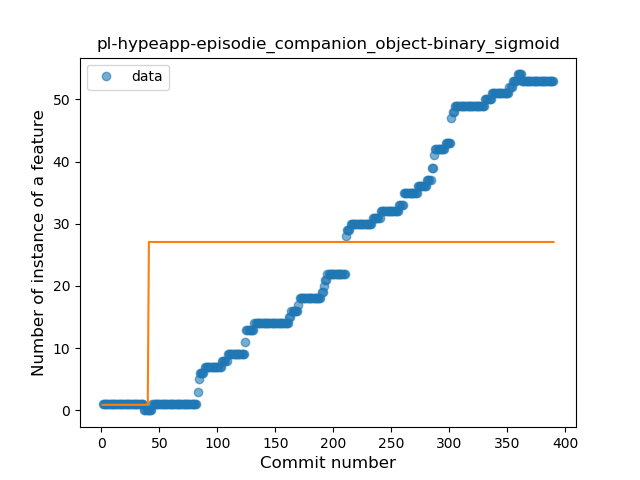
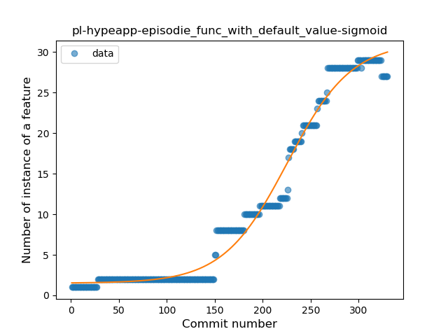
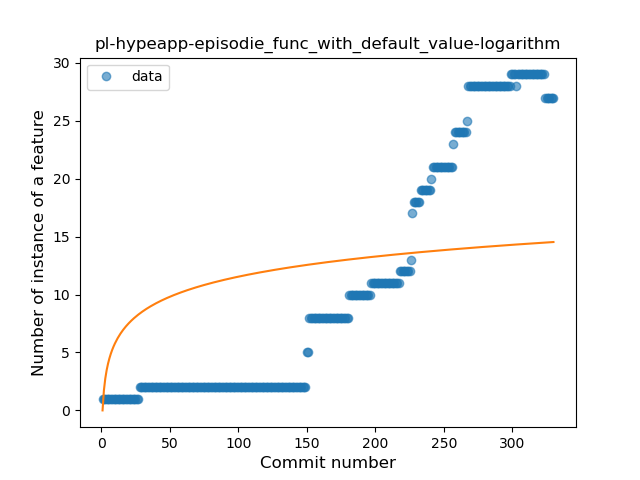
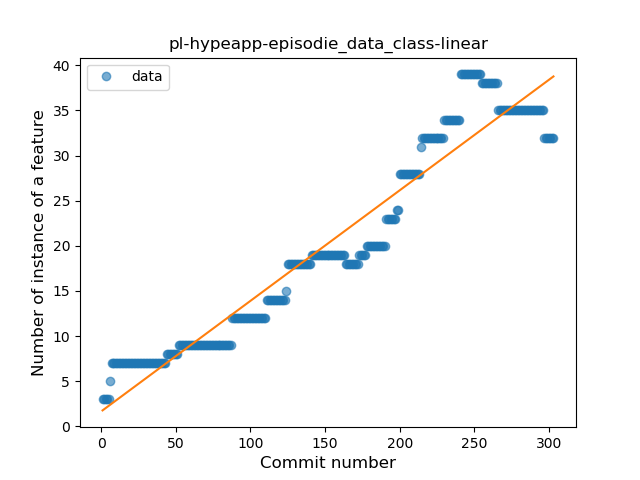
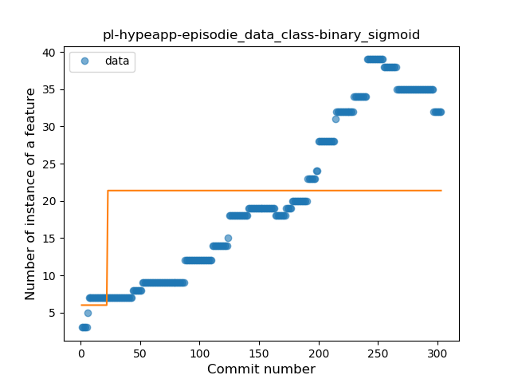

## pl-hypeapp-episodie
----
#### Metrics provided by Detekt
* Number of lines of code 14492
* Number of Kotlin files: 305
* Cyclomatic complexity: 2009
* Cyclomatic complexity by thousands of lines: 288 

----
**17** features analyzed

*	<a href="#type_inference">Type Inference</a> 
*	<a href="#lambda">Lambda</a> 
*	<a href="#safe_call">Safe Call</a> 
*	<a href="#when_expr">When expression</a> 
*	<a href="#unsafe_call">Unsafe Call</a> 
*	<a href="#companion_object">Companion Object</a> 
*	<a href="#string_template">String Template</a> 
*	<a href="#func_with_default_value">Function with Default Value</a> 
*	<a href="#singleton">Singleton</a> 
*	<a href="#range_expr">Range Expression</a> 
*	<a href="#smart_cast">Smart Cast</a> 
*	<a href="#data_class">Data Class</a> 
*	<a href="#func_call_with_named_arg">Function call with Named Argument</a> 
*	<a href="#extension_function">Extension Function</a> 
*	<a href="#property_delegation">Property Delegation</a> 
*	<a href="#destructuring_declaration">Destructuring Declaration</a> 
*	<a href="#inline_func">Inline Function</a> 

### <a name="type_inference">Type Inference</a>
----
#### Functions
* **Sudden Rise - Exponential:** 
    * **R_Squared:** 0.9770068
* **Constant Rise - Linear:** 
    * **R_Squared:** 0.966205
* **Plateau Sudden Rise - Binary Sigmoid:** 
    * **R_Squared:** 0.56613448
* **Sudden Rise Plateau - Logarithm:** 
    * **R_Squared:** 0.34926357

**Plots** :chart_with_upwards_trend:
-----

### <a name="lambda">Lambda</a>
----
#### Functions
* **Sudden Rise - Exponential:** 
    * **R_Squared:** 0.96226565
* **Constant Rise - Linear:** 
    * **R_Squared:** 0.88334259
* **Plateau Sudden Rise - Binary Sigmoid:** 
    * **R_Squared:** 0.40363021
* **Sudden Rise Plateau - Logarithm:** 
    * **R_Squared:** 0.24327022

**Plots** :chart_with_upwards_trend:
-----

### <a name="safe_call">Safe Call</a>
----
#### Functions
* **Sudden Rise - Exponential:** 
    * **R_Squared:** 0.94388349
* **Constant Rise - Linear:** 
    * **R_Squared:** 0.92640664
* **Plateau Sudden Rise - Binary Sigmoid:** 
    * **R_Squared:** 0.65664396
* **Sudden Rise Plateau - Logarithm:** 
    * **R_Squared:** 0.31557244

**Plots** :chart_with_upwards_trend:
-----

### <a name="when_expr">When expression</a>
----
#### Functions
* **Constant Rise - Linear:** 
    * **R_Squared:** 0.88505041
* **Sudden Rise Plateau - Logarithm:** 
    * **R_Squared:** 0.35932816

**Plots** :chart_with_upwards_trend:
-----

### <a name="unsafe_call">Unsafe Call</a>
----
#### Functions
* **Plateau Gradual Rise - Sigmoid:** 
    * **R_Squared:** 0.97139709
* **Sudden Rise - Exponential:** 
    * **R_Squared:** 0.90164377
* **Constant Rise - Linear:** 
    * **R_Squared:** 0.85455986
* **Sudden Rise Plateau - Logarithm:** 
    * **R_Squared:** 0.25636425

**Plots** :chart_with_upwards_trend:
-----

### <a name="companion_object">Companion Object</a>
----
#### Functions
* **Constant Rise - Linear:** 
    * **R_Squared:** 0.97292107
* **Sudden Rise - Exponential:** 
    * **R_Squared:** 0.98047635
* **Sudden Rise Plateau - Logarithm:** 
    * **R_Squared:** 0.35893126
* **Plateau Sudden Rise - Binary Sigmoid:** 
    * **R_Squared:** 0.17920784

**Plots** :chart_with_upwards_trend:
-----

### <a name="string_template">String Template</a>
----
#### Functions
* **Constant Rise - Linear:** 
    * **R_Squared:** 0.81479938
* **Sudden Rise - Exponential:** 
    * **R_Squared:** 0.81587754
* **Sudden Rise Plateau - Logarithm:** 
    * **R_Squared:** 0.57865883

**Plots** :chart_with_upwards_trend:
-----

### <a name="func_with_default_value">Function with Default Value</a>
----
#### Functions
* **Plateau Gradual Rise - Sigmoid:** 
    * **R_Squared:** 0.98264172
* **Sudden Rise - Exponential:** 
    * **R_Squared:** 0.94051162
* **Constant Rise - Linear:** 
    * **R_Squared:** 0.86485709
* **Sudden Rise Plateau - Logarithm:** 
    * **R_Squared:** 0.2633082

**Plots** :chart_with_upwards_trend:
-----

### <a name="singleton">Singleton</a>
----
#### Functions
* **Plateau Gradual Rise - Sigmoid:** 
    * **R_Squared:** 0.83716097
* **Sudden Rise - Exponential:** 
    * **R_Squared:** 0.80716793
* **Constant Rise - Linear:** 
    * **R_Squared:** 0.78364445
* **Sudden Rise Plateau - Logarithm:** 
    * **R_Squared:** 0.32848943

**Plots** :chart_with_upwards_trend:
-----

### <a name="range_expr">Range Expression</a>
----
#### Functions
* **Constant Rise - Linear:** 
    * **R_Squared:** 0.74429464
* **Sudden Rise - Exponential:** 
    * **R_Squared:** 0.75314577
* **Sudden Rise Plateau - Logarithm:** 
    * **R_Squared:** 0.33685004

**Plots** :chart_with_upwards_trend:
-----

### <a name="smart_cast">Smart Cast</a>
----
#### Functions
* **Constant Rise - Linear:** 
    * **R_Squared:** 0.84978916
* **Sudden Rise - Exponential:** 
    * **R_Squared:** 0.85346848
* **Sudden Rise Plateau - Logarithm:** 
    * **R_Squared:** 0.6514146
* **Plateau Gradual Rise - Sigmoid:** 
    * **R_Squared:** 0.44279458

**Plots** :chart_with_upwards_trend:
-----

### <a name="data_class">Data Class</a>
----
#### Functions
* **Constant Rise - Linear:** 
    * **R_Squared:** 0.92778246
* **Sudden Rise - Exponential:** 
    * **R_Squared:** 0.932084
* **Sudden Rise Plateau - Logarithm:** 
    * **R_Squared:** 0.47022323
* **Plateau Sudden Rise - Binary Sigmoid:** 
    * **R_Squared:** 0.12866193

**Plots** :chart_with_upwards_trend:
-----

### <a name="func_call_with_named_arg">Function call with Named Argument</a>
----
#### Functions
* **Constant Rise - Linear:** 
    * **R_Squared:** 0.94328915
* **Sudden Rise - Exponential:** 
    * **R_Squared:** 0.94545887
* **Sudden Rise Plateau - Logarithm:** 
    * **R_Squared:** 0.40819473
* **Plateau Gradual Rise - Sigmoid:** 
    * **R_Squared:** 0.25858258

**Plots** :chart_with_upwards_trend:
-----

### <a name="extension_function">Extension Function</a>
----
#### Functions
* **Constant Rise - Linear:** 
    * **R_Squared:** 0.93335418
* **Sudden Rise Plateau - Logarithm:** 
    * **R_Squared:** 0.66698716
* **Plateau Sudden Rise - Binary Sigmoid:** 
    * **R_Squared:** 0.29636011

**Plots** :chart_with_upwards_trend:
-----

### <a name="property_delegation">Property Delegation</a>
----
#### Functions
* **Sudden Rise - Exponential:** 
    * **R_Squared:** 0.398182
* **Plateau Sudden Decline - Binary Sigmoid:** 
    * **R_Squared:** 0.29491525
* **Constant Rise - Linear:** 
    * **R_Squared:** 0.04484448
* **Sudden Rise Plateau - Logarithm:** 
    * **R_Squared:** -0.0

**Plots** :chart_with_upwards_trend:
-----

### <a name="destructuring_declaration">Destructuring Declaration</a>
----
#### Functions
* **Plateau Sudden Decline - Binary Sigmoid:** 
    * **R_Squared:** 1.0
* **Constant Decline - Linear:** 
    * **R_Squared:** 0.67742832
* **Sudden Rise Plateau - Logarithm:** 
    * **R_Squared:** -0.0

**Plots** :chart_with_upwards_trend:
-----

### <a name="inline_func">Inline Function</a>
----
#### Functions
* **Plateau Gradual Rise - Sigmoid:** 
    * **R_Squared:** 0.94510928
* **Sudden Rise - Exponential:** 
    * **R_Squared:** 0.93422826
* **Constant Rise - Linear:** 
    * **R_Squared:** 0.91254915
* **Sudden Rise Plateau - Logarithm:** 
    * **R_Squared:** 0.3981892

**Plots** :chart_with_upwards_trend:
-----

