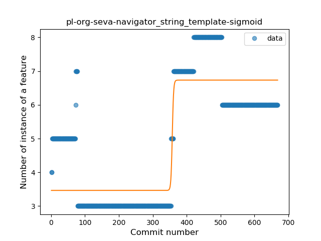
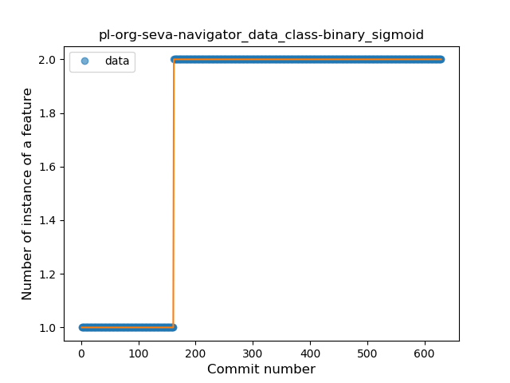
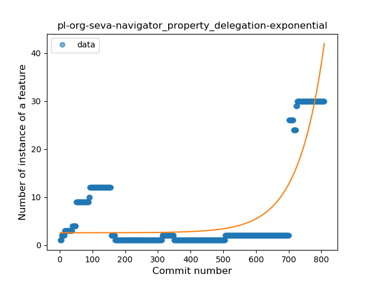

## pl-org-seva-navigator
----
#### Metrics provided by Detekt
* Number of lines of code 4220
* Number of Kotlin files: 59
* Cyclomatic complexity: 392
* Cyclomatic complexity by thousands of lines: 249 

----
**16** features analyzed

*	<a href="#type_inference">Type Inference</a> 
*	<a href="#lambda">Lambda</a> 
*	<a href="#safe_call">Safe Call</a> 
*	<a href="#when_expr">When expression</a> 
*	<a href="#unsafe_call">Unsafe Call</a> 
*	<a href="#companion_object">Companion Object</a> 
*	<a href="#string_template">String Template</a> 
*	<a href="#func_with_default_value">Function with Default Value</a> 
*	<a href="#range_expr">Range Expression</a> 
*	<a href="#data_class">Data Class</a> 
*	<a href="#func_call_with_named_arg">Function call with Named Argument</a> 
*	<a href="#extension_function">Extension Function</a> 
*	<a href="#property_delegation">Property Delegation</a> 
*	<a href="#inline_func">Inline Function</a> 
*	<a href="#overloaded_op">Overloaded Operator</a> 
*	<a href="#infix_func">Infix Function</a> 

### <a name="type_inference">Type Inference</a>
----
#### Functions
* **Constant Rise - Linear:** 
    * **R_Squared:** 0.83813347
* **Sudden Rise - Exponential:** 
    * **R_Squared:** 0.84280428
* **Sudden Rise Plateau - Logarithm:** 
    * **R_Squared:** 0.69797273
* **Plateau Sudden Rise - Binary Sigmoid:** 
    * **R_Squared:** 0.04375899

**Plots** :chart_with_upwards_trend:
-----

### <a name="lambda">Lambda</a>
----
#### Functions
* **Constant Rise - Linear:** 
    * **R_Squared:** 0.93896182
* **Sudden Rise Plateau - Logarithm:** 
    * **R_Squared:** 0.79271668
* **Plateau Sudden Rise - Binary Sigmoid:** 
    * **R_Squared:** 0.21631534

**Plots** :chart_with_upwards_trend:
-----

### <a name="safe_call">Safe Call</a>
----
#### Functions
* **Sudden Rise Plateau - Logarithm:** 
    * **R_Squared:** 0.79023169
* **Constant Rise - Linear:** 
    * **R_Squared:** 0.74118859
* **Plateau Sudden Rise - Binary Sigmoid:** 
    * **R_Squared:** 0.12459871

**Plots** :chart_with_upwards_trend:
-----

### <a name="when_expr">When expression</a>
----
#### Functions
* **Constant Rise - Linear:** 
    * **R_Squared:** 0.8314234
* **Sudden Rise Plateau - Logarithm:** 
    * **R_Squared:** 0.55671245
* **Plateau Gradual Rise - Sigmoid:** 
    * **R_Squared:** 0.40464984

**Plots** :chart_with_upwards_trend:
-----

### <a name="unsafe_call">Unsafe Call</a>
----
#### Functions
* **Sudden Decline - Exponential:** 
    * **R_Squared:** 0.24348824
* **Constant Decline - Linear:** 
    * **R_Squared:** 0.19206762
* **Plateau Sudden Decline - Binary Sigmoid:** 
    * **R_Squared:** 0.04600371
* **Sudden Rise Plateau - Logarithm:** 
    * **R_Squared:** -0.0

**Plots** :chart_with_upwards_trend:
-----

### <a name="companion_object">Companion Object</a>
----
#### Functions
* **Constant Rise - Linear:** 
    * **R_Squared:** 0.88993036
* **Sudden Rise Plateau - Logarithm:** 
    * **R_Squared:** 0.68932274

**Plots** :chart_with_upwards_trend:
-----

### <a name="string_template">String Template</a>
----
#### Functions
* **Plateau Gradual Rise - Sigmoid:** 
    * **R_Squared:** 0.77029116
* **Constant Rise - Linear:** 
    * **R_Squared:** 0.36358198
* **Sudden Rise - Exponential:** 
    * **R_Squared:** 0.37001375
* **Sudden Rise Plateau - Logarithm:** 
    * **R_Squared:** 0.15020652

**Plots** :chart_with_upwards_trend:
-----

### <a name="func_with_default_value">Function with Default Value</a>
----
#### Functions
* **Plateau Gradual Rise - Sigmoid:** 
    * **R_Squared:** 0.92914611
* **Constant Rise - Linear:** 
    * **R_Squared:** 0.90989504
* **Sudden Rise Plateau - Logarithm:** 
    * **R_Squared:** 0.60366981

**Plots** :chart_with_upwards_trend:
-----

### <a name="range_expr">Range Expression</a>
----
#### Functions
* **Constant Decline - Linear:** 
    * **R_Squared:** 0.01130895
* **Sudden Rise Plateau - Logarithm:** 
    * **R_Squared:** -0.0

**Plots** :chart_with_upwards_trend:
-----

### <a name="data_class">Data Class</a>
----
#### Functions
* **Plateau Sudden Rise - Binary Sigmoid:** 
    * **R_Squared:** 1.0
* **Sudden Rise Plateau - Logarithm:** 
    * **R_Squared:** 0.64443828
* **Constant Rise - Linear:** 
    * **R_Squared:** 0.57133758

**Plots** :chart_with_upwards_trend:
-----

### <a name="func_call_with_named_arg">Function call with Named Argument</a>
----
#### Functions
* **Constant Rise - Linear:** 
    * **R_Squared:** 0.87097665
* **Sudden Rise Plateau - Logarithm:** 
    * **R_Squared:** 0.58452492

**Plots** :chart_with_upwards_trend:
-----

### <a name="extension_function">Extension Function</a>
----
#### Functions
* **Constant Rise - Linear:** 
    * **R_Squared:** 0.91897565
* **Sudden Rise Plateau - Logarithm:** 
    * **R_Squared:** 0.43939963
* **Plateau Sudden Rise - Binary Sigmoid:** 
    * **R_Squared:** 0.1399424

**Plots** :chart_with_upwards_trend:
-----

### <a name="property_delegation">Property Delegation</a>
----
#### Functions
* **Sudden Rise - Exponential:** 
    * **R_Squared:** 0.69590788
* **Constant Rise - Linear:** 
    * **R_Squared:** 0.17933556
* **Sudden Rise Plateau - Logarithm:** 
    * **R_Squared:** 0.03697249

**Plots** :chart_with_upwards_trend:
-----

### <a name="inline_func">Inline Function</a>
----
#### Functions
* **Constant Rise - Linear:** 
    * **R_Squared:** 0.78300896
* **Sudden Rise Plateau - Logarithm:** 
    * **R_Squared:** 0.77679885

**Plots** :chart_with_upwards_trend:
-----

### <a name="overloaded_op">Overloaded Operator</a>
----
#### Functions
* **Plateau Sudden Rise - Binary Sigmoid:** 
    * **R_Squared:** 1.0
* **Constant Rise - Linear:** 
    * **R_Squared:** 0.74222918
* **Sudden Rise Plateau - Logarithm:** 
    * **R_Squared:** 0.53379346

**Plots** :chart_with_upwards_trend:
-----

### <a name="infix_func">Infix Function</a>
----
#### Functions
* **Constant Rise - Linear:** 
    * **R_Squared:** 0.71348849
* **Sudden Rise Plateau - Logarithm:** 
    * **R_Squared:** 0.45488815

**Plots** :chart_with_upwards_trend:
-----

