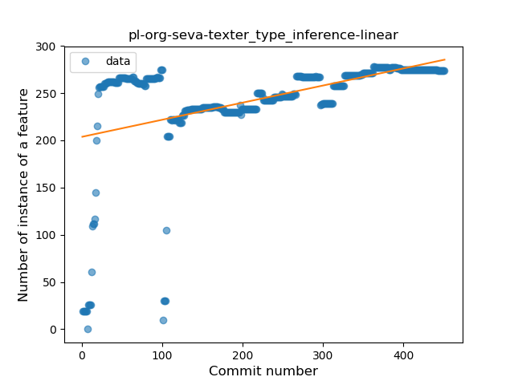
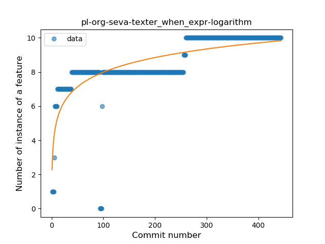
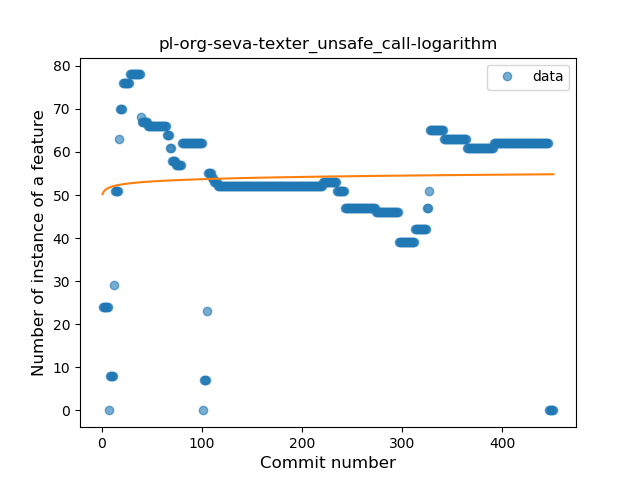
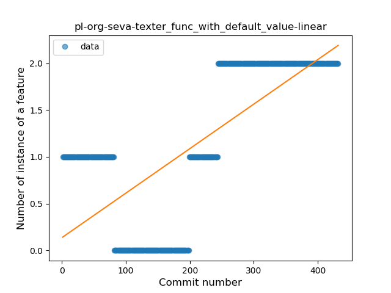
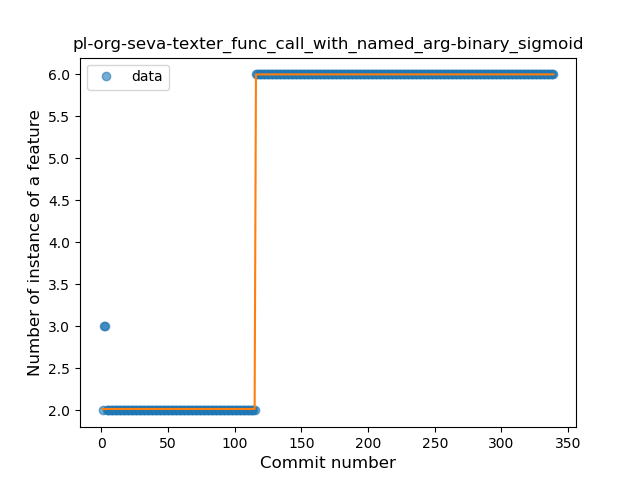

## pl-org-seva-texter
----
#### Metrics provided by Detekt
* Number of lines of code 4144
* Number of Kotlin files: 43
* Cyclomatic complexity: 434
* Cyclomatic complexity by thousands of lines: 241 

----
**16** features analyzed

*	<a href="#type_inference">Type Inference</a> 
*	<a href="#lambda">Lambda</a> 
*	<a href="#safe_call">Safe Call</a> 
*	<a href="#when_expr">When expression</a> 
*	<a href="#unsafe_call">Unsafe Call</a> 
*	<a href="#companion_object">Companion Object</a> 
*	<a href="#string_template">String Template</a> 
*	<a href="#func_with_default_value">Function with Default Value</a> 
*	<a href="#singleton">Singleton</a> 
*	<a href="#range_expr">Range Expression</a> 
*	<a href="#smart_cast">Smart Cast</a> 
*	<a href="#func_call_with_named_arg">Function call with Named Argument</a> 
*	<a href="#extension_function">Extension Function</a> 
*	<a href="#property_delegation">Property Delegation</a> 
*	<a href="#inline_func">Inline Function</a> 
*	<a href="#infix_func">Infix Function</a> 

### <a name="type_inference">Type Inference</a>
----
#### Functions
* **Sudden Rise Plateau - Logarithm:** 
    * **R_Squared:** 0.40227542
* **Constant Rise - Linear:** 
    * **R_Squared:** 0.23489853
* **Plateau Sudden Rise - Binary Sigmoid:** 
    * **R_Squared:** 0.13539235

**Plots** :chart_with_upwards_trend:
-----

### <a name="lambda">Lambda</a>
----
#### Functions
* **Sudden Rise Plateau - Logarithm:** 
    * **R_Squared:** 0.78888221
* **Constant Rise - Linear:** 
    * **R_Squared:** 0.68638991
* **Plateau Sudden Rise - Binary Sigmoid:** 
    * **R_Squared:** 0.59714981

**Plots** :chart_with_upwards_trend:
-----

### <a name="safe_call">Safe Call</a>
----
#### Functions
* **Sudden Rise Plateau - Logarithm:** 
    * **R_Squared:** 0.6483758
* **Plateau Gradual Rise - Sigmoid:** 
    * **R_Squared:** 0.5744742
* **Constant Rise - Linear:** 
    * **R_Squared:** 0.33240832

**Plots** :chart_with_upwards_trend:
-----

### <a name="when_expr">When expression</a>
----
#### Functions
* **Sudden Rise Plateau - Logarithm:** 
    * **R_Squared:** 0.58066299
* **Constant Rise - Linear:** 
    * **R_Squared:** 0.55948709

**Plots** :chart_with_upwards_trend:
-----

### <a name="unsafe_call">Unsafe Call</a>
----
#### Functions
* **Constant Decline - Linear:** 
    * **R_Squared:** 9.7e-07
* **Sudden Decline - Exponential:** 
    * **R_Squared:** 0.00281461
* **Sudden Rise Plateau - Logarithm:** 
    * **R_Squared:** 0.00320934

**Plots** :chart_with_upwards_trend:
-----

### <a name="companion_object">Companion Object</a>
----
#### Functions
* **Sudden Rise Plateau - Logarithm:** 
    * **R_Squared:** 0.61551661
* **Plateau Sudden Rise - Binary Sigmoid:** 
    * **R_Squared:** 0.61337066
* **Constant Rise - Linear:** 
    * **R_Squared:** 0.40202496

**Plots** :chart_with_upwards_trend:
-----

### <a name="string_template">String Template</a>
----
#### Functions
* **Plateau Gradual Rise - Sigmoid:** 
    * **R_Squared:** 0.9459372
* **Sudden Rise - Exponential:** 
    * **R_Squared:** 0.76531118
* **Constant Rise - Linear:** 
    * **R_Squared:** 0.57586507
* **Sudden Rise Plateau - Logarithm:** 
    * **R_Squared:** 0.20398948

**Plots** :chart_with_upwards_trend:
-----

### <a name="func_with_default_value">Function with Default Value</a>
----
#### Functions
* **Sudden Rise - Exponential:** 
    * **R_Squared:** 0.55816213
* **Constant Rise - Linear:** 
    * **R_Squared:** 0.51564105
* **Sudden Rise Plateau - Logarithm:** 
    * **R_Squared:** 0.1746577

**Plots** :chart_with_upwards_trend:
-----

### <a name="singleton">Singleton</a>
----
#### Functions
* **Plateau Gradual Rise - Sigmoid:** 
    * **R_Squared:** 0.2074525
* **Sudden Rise Plateau - Logarithm:** 
    * **R_Squared:** 0.03962585
* **Constant Rise - Linear:** 
    * **R_Squared:** 0.01248662

**Plots** :chart_with_upwards_trend:
-----

### <a name="range_expr">Range Expression</a>
----
#### Functions
* **Sudden Decline - Exponential:** 
    * **R_Squared:** 0.79544288
* **Constant Decline - Linear:** 
    * **R_Squared:** 0.7409283
* **Plateau Sudden Decline - Binary Sigmoid:** 
    * **R_Squared:** 0.57740242
* **Sudden Rise Plateau - Logarithm:** 
    * **R_Squared:** -0.0

**Plots** :chart_with_upwards_trend:
-----

### <a name="smart_cast">Smart Cast</a>
----
#### Functions
* **Plateau Gradual Decline - Sigmoid:** 
    * **R_Squared:** 0.86805359
* **Sudden Decline - Exponential:** 
    * **R_Squared:** 0.7454391
* **Constant Decline - Linear:** 
    * **R_Squared:** 0.2884616
* **Sudden Rise Plateau - Logarithm:** 
    * **R_Squared:** -0.0

**Plots** :chart_with_upwards_trend:
-----

### <a name="func_call_with_named_arg">Function call with Named Argument</a>
----
#### Functions
* **Plateau Sudden Rise - Binary Sigmoid:** 
    * **R_Squared:** 0.99837212
* **Constant Rise - Linear:** 
    * **R_Squared:** 0.66847067
* **Sudden Rise Plateau - Logarithm:** 
    * **R_Squared:** 0.52719547

**Plots** :chart_with_upwards_trend:
-----

### <a name="extension_function">Extension Function</a>
----
#### Functions
* **Plateau Gradual Rise - Sigmoid:** 
    * **R_Squared:** 0.9302344
* **Constant Rise - Linear:** 
    * **R_Squared:** 0.85550394
* **Sudden Rise Plateau - Logarithm:** 
    * **R_Squared:** 0.49251137

**Plots** :chart_with_upwards_trend:
-----

### <a name="property_delegation">Property Delegation</a>
----
#### Functions
* **Sudden Rise - Exponential:** 
    * **R_Squared:** 0.78531777
* **Constant Rise - Linear:** 
    * **R_Squared:** 0.27521598
* **Sudden Rise Plateau - Logarithm:** 
    * **R_Squared:** 0.10640439

**Plots** :chart_with_upwards_trend:
-----

### <a name="inline_func">Inline Function</a>
----
#### Functions
* **Plateau Sudden Decline - Binary Sigmoid:** 
    * **R_Squared:** 0.41796009
* **Constant Decline - Linear:** 
    * **R_Squared:** 0.10772039
* **Sudden Rise Plateau - Logarithm:** 
    * **R_Squared:** -0.0

**Plots** :chart_with_upwards_trend:
-----

### <a name="infix_func">Infix Function</a>
----
#### Functions
* **Plateau Gradual Rise - Sigmoid:** 
    * **R_Squared:** 0.40044042
* **Sudden Rise Plateau - Logarithm:** 
    * **R_Squared:** 0.13611271
* **Constant Rise - Linear:** 
    * **R_Squared:** 0.03283302

**Plots** :chart_with_upwards_trend:
-----

