## pl-poznajapp
----
#### Metrics provided by Detekt
* Number of lines of code 790
* Number of Kotlin files: 13
* Cyclomatic complexity: 91
* Cyclomatic complexity by thousands of lines: 266 

----
**6** features analyzed

*	<a href="#type_inference">Type Inference</a> 
*	<a href="#lambda">Lambda</a> 
*	<a href="#when_expr">When expression</a> 
*	<a href="#unsafe_call">Unsafe Call</a> 
*	<a href="#companion_object">Companion Object</a> 
*	<a href="#singleton">Singleton</a> 

### <a name="type_inference">Type Inference</a>
----
#### Functions
* **Sudden Rise - Exponential:** 
    * **R_Squared:** 0.70691325
* **Constant Rise - Linear:** 
    * **R_Squared:** 0.57388125
* **Sudden Rise Plateau - Logarithm:** 
    * **R_Squared:** 0.2454416

**Plots** :chart_with_upwards_trend:
-----

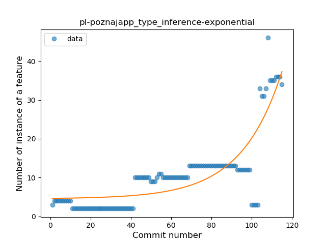
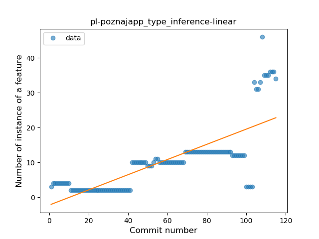
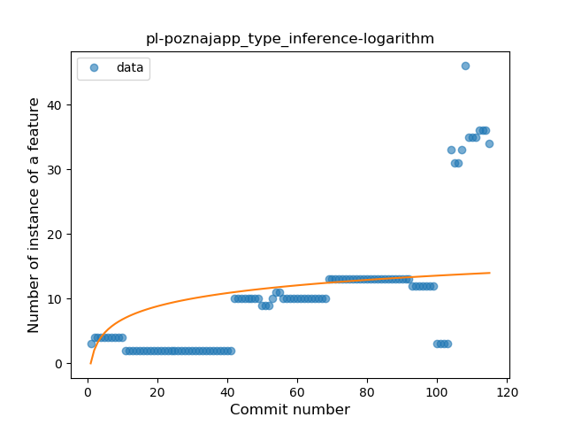
### <a name="lambda">Lambda</a>
----
#### Functions
* **Instability - Polinomial 4:** 
    * **R_Squared:** 0.80943925
* **Sudden Rise - Exponential:** 
    * **R_Squared:** 0.7796451
* **Constant Rise - Linear:** 
    * **R_Squared:** 0.6623917
* **Sudden Rise Plateau - Logarithm:** 
    * **R_Squared:** 0.45412257

**Plots** :chart_with_upwards_trend:
-----

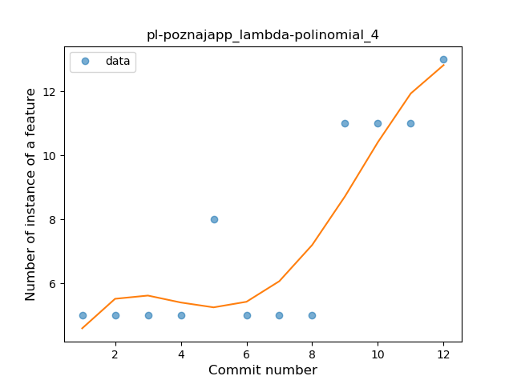
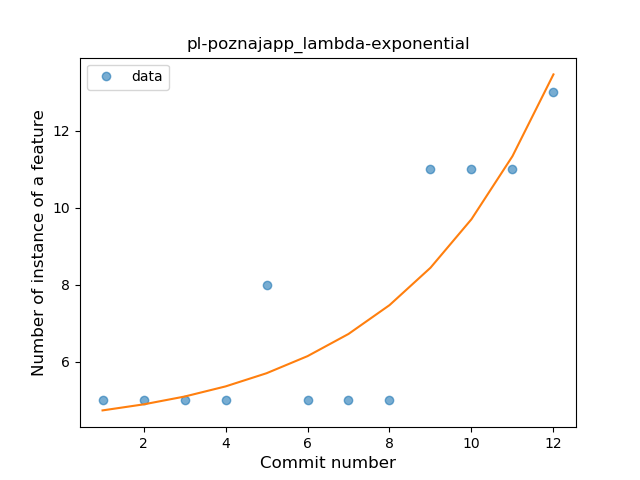
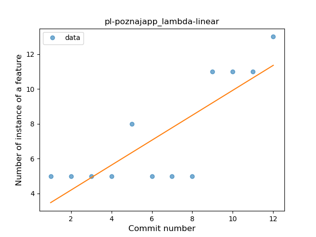
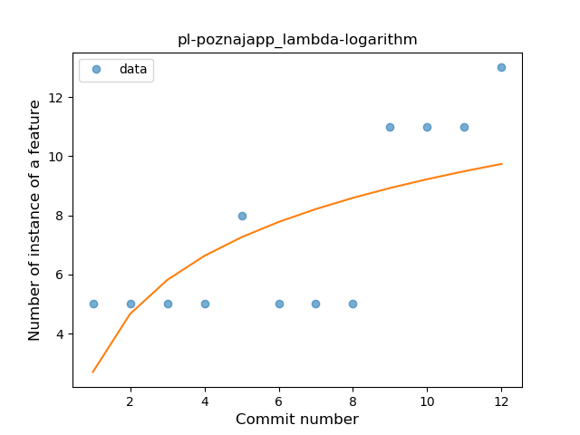
### <a name="when_expr">When expression</a>
----
#### Functions
* **Instability - Polinomial 3:** )
    * **R_Squared:** 0.85708865
* **Instability - Polinomial 4:** 
    * **R_Squared:** 0.85834756
* **Constant Decline - Linear:** 
    * **R_Squared:** 0.73792487
* **Sudden Rise Plateau - Logarithm:** 
    * **R_Squared:** 0.0

**Plots** :chart_with_upwards_trend:
-----

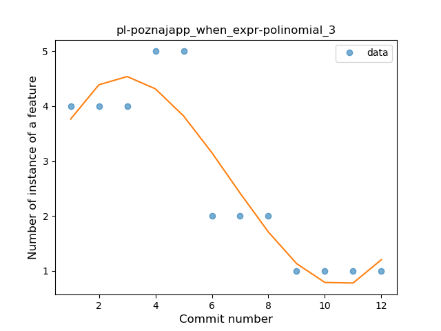
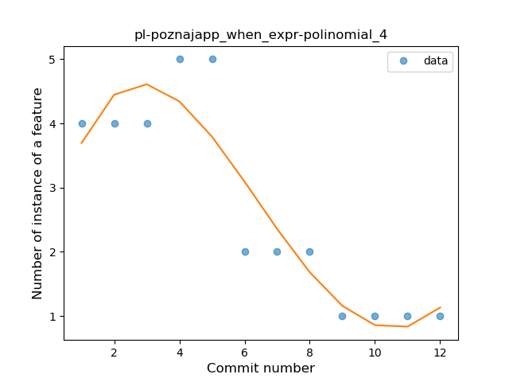
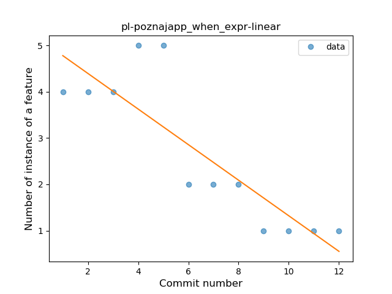
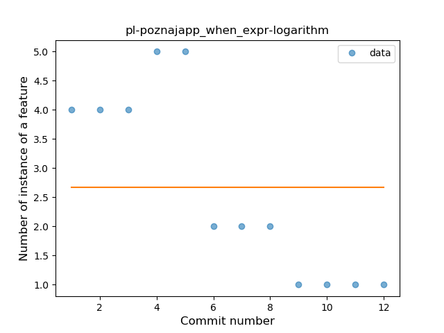
### <a name="unsafe_call">Unsafe Call</a>
----
#### Functions
* **Plateau Gradual Rise - Sigmoid:** 
    * **R_Squared:** 0.43837397
* **Constant Rise - Linear:** 
    * **R_Squared:** 0.36326175
* **Sudden Rise - Exponential:** 
    * **R_Squared:** 0.36936611
* **Sudden Rise Plateau - Logarithm:** 
    * **R_Squared:** 0.20285392

**Plots** :chart_with_upwards_trend:
-----

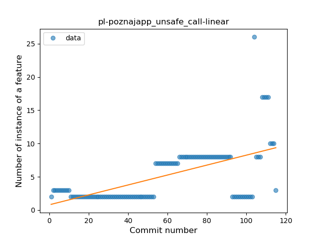
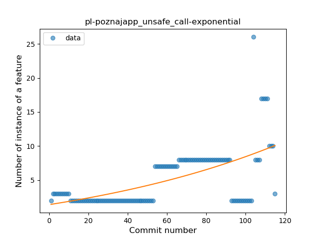
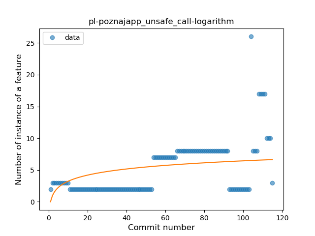
### <a name="companion_object">Companion Object</a>
----
#### Functions
* **Plateau Sudden Rise - Binary Sigmoid:** 
    * **R_Squared:** 0.98163845
* **Sudden Rise - Exponential:** 
    * **R_Squared:** 0.77028131
* **Constant Rise - Linear:** 
    * **R_Squared:** 0.26022633
* **Sudden Rise Plateau - Logarithm:** 
    * **R_Squared:** 0.04655885

**Plots** :chart_with_upwards_trend:
-----

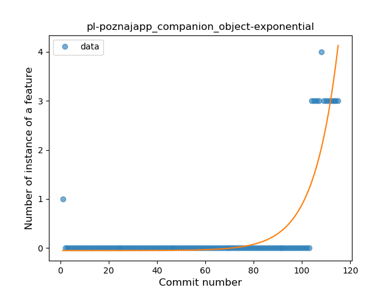
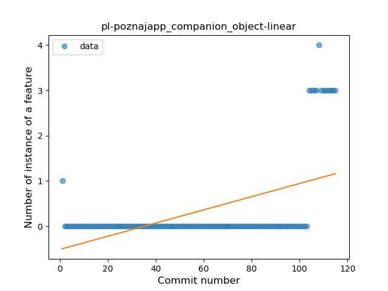
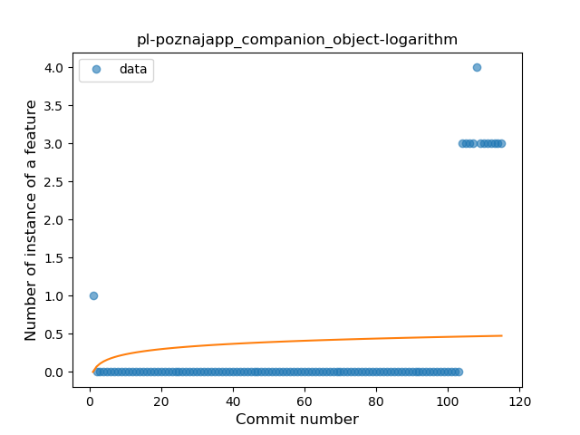
### <a name="singleton">Singleton</a>
----
#### Functions
* **Plateau Sudden Rise - Binary Sigmoid:** 
    * **R_Squared:** 0.96453901
* **Sudden Rise - Exponential:** 
    * **R_Squared:** 0.69619973
* **Constant Rise - Linear:** 
    * **R_Squared:** 0.67891712
* **Sudden Rise Plateau - Logarithm:** 
    * **R_Squared:** 0.41289283

**Plots** :chart_with_upwards_trend:
-----

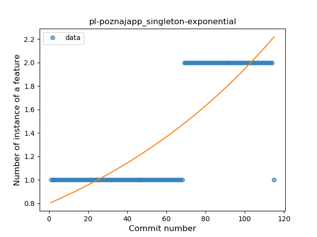
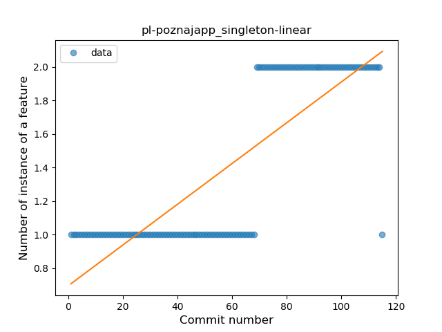
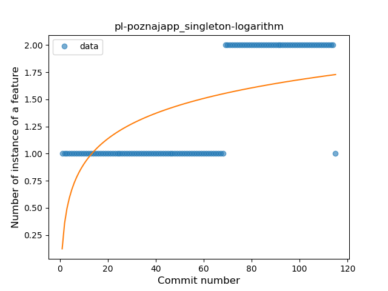
