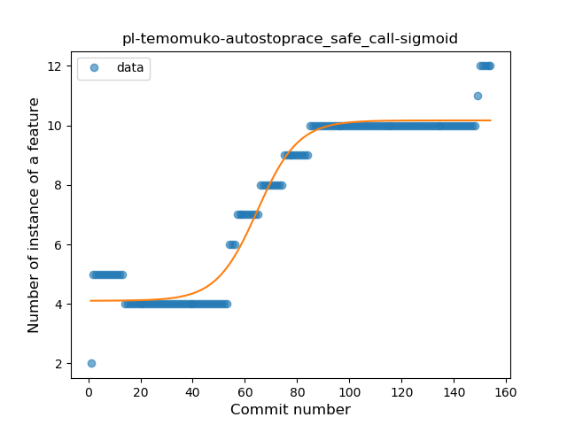
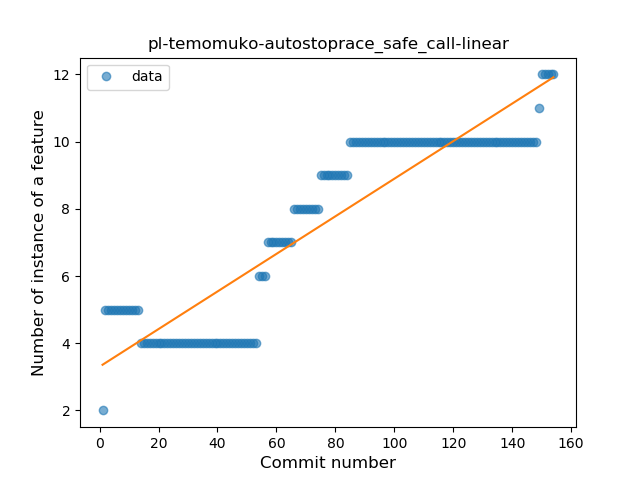
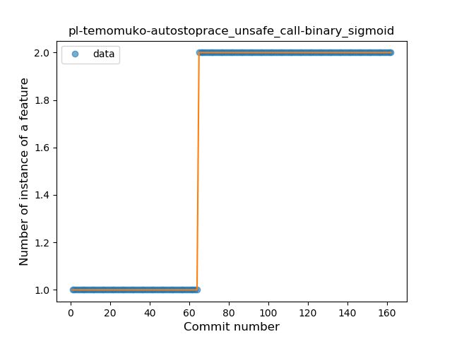
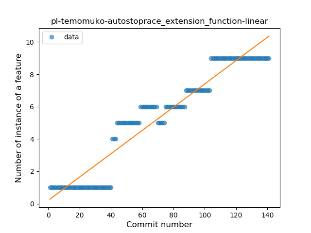

## pl-temomuko-autostoprace
----
#### Metrics provided by Detekt
* Number of lines of code 1059
* Number of Kotlin files: 42
* Cyclomatic complexity: 109
* Cyclomatic complexity by thousands of lines: 216 

----
**10** features analyzed

*	<a href="#type_inference">Type Inference</a> 
*	<a href="#lambda">Lambda</a> 
*	<a href="#safe_call">Safe Call</a> 
*	<a href="#unsafe_call">Unsafe Call</a> 
*	<a href="#companion_object">Companion Object</a> 
*	<a href="#string_template">String Template</a> 
*	<a href="#singleton">Singleton</a> 
*	<a href="#data_class">Data Class</a> 
*	<a href="#func_call_with_named_arg">Function call with Named Argument</a> 
*	<a href="#extension_function">Extension Function</a> 

### <a name="type_inference">Type Inference</a>
----
#### Functions
* **Plateau Gradual Rise - Sigmoid:** 
    * **R_Squared:** 0.65582877
* **Constant Rise - Linear:** 
    * **R_Squared:** 0.6241903
* **Sudden Rise Plateau - Logarithm:** 
    * **R_Squared:** 0.59206672

**Plots** :chart_with_upwards_trend:
-----

### <a name="lambda">Lambda</a>
----
#### Functions
* **Constant Rise - Linear:** 
    * **R_Squared:** 0.94560345
* **Sudden Rise Plateau - Logarithm:** 
    * **R_Squared:** 0.53614431

**Plots** :chart_with_upwards_trend:
-----

### <a name="safe_call">Safe Call</a>
----
#### Functions
* **Plateau Gradual Rise - Sigmoid:** 
    * **R_Squared:** 0.95544526
* **Constant Rise - Linear:** 
    * **R_Squared:** 0.83510133
* **Sudden Rise Plateau - Logarithm:** 
    * **R_Squared:** 0.61312094

**Plots** :chart_with_upwards_trend:
-----

### <a name="unsafe_call">Unsafe Call</a>
----
#### Functions
* **Plateau Sudden Rise - Binary Sigmoid:** 
    * **R_Squared:** 1.0
* **Constant Rise - Linear:** 
    * **R_Squared:** 0.7169912
* **Sudden Rise Plateau - Logarithm:** 
    * **R_Squared:** 0.59676625

**Plots** :chart_with_upwards_trend:
-----

### <a name="companion_object">Companion Object</a>
----
#### Functions
* **Plateau Sudden Rise - Binary Sigmoid:** 
    * **R_Squared:** 1.0
* **Constant Rise - Linear:** 
    * **R_Squared:** 0.7415493
* **Sudden Rise Plateau - Logarithm:** 
    * **R_Squared:** 0.56031039

**Plots** :chart_with_upwards_trend:
-----

### <a name="string_template">String Template</a>
----
#### Functions
* **Constant Decline - Linear:** 
    * **R_Squared:** 0.02770624
* **Sudden Decline - Exponential:** 
    * **R_Squared:** 0.03342882
* **Plateau Gradual Decline - Sigmoid:** 
    * **R_Squared:** 0.03907821
* **Sudden Rise Plateau - Logarithm:** 
    * **R_Squared:** -0.0

**Plots** :chart_with_upwards_trend:
-----

### <a name="singleton">Singleton</a>
----
#### Functions
* **Plateau Gradual Rise - Sigmoid:** 
    * **R_Squared:** 0.76267265
* **Constant Rise - Linear:** 
    * **R_Squared:** 0.69292199
* **Sudden Rise Plateau - Logarithm:** 
    * **R_Squared:** 0.61717126

**Plots** :chart_with_upwards_trend:
-----

### <a name="data_class">Data Class</a>
----
#### Functions
* **Plateau Gradual Rise - Sigmoid:** 
    * **R_Squared:** 0.93134481
* **Constant Rise - Linear:** 
    * **R_Squared:** 0.90160521
* **Sudden Rise Plateau - Logarithm:** 
    * **R_Squared:** 0.44108065

**Plots** :chart_with_upwards_trend:
-----

### <a name="func_call_with_named_arg">Function call with Named Argument</a>
----
#### Functions
* **Plateau Gradual Rise - Sigmoid:** 
    * **R_Squared:** 0.95523789
* **Constant Rise - Linear:** 
    * **R_Squared:** 0.89683578
* **Sudden Rise - Exponential:** 
    * **R_Squared:** 0.90356952
* **Sudden Rise Plateau - Logarithm:** 
    * **R_Squared:** 0.40421597

**Plots** :chart_with_upwards_trend:
-----

### <a name="extension_function">Extension Function</a>
----
#### Functions
* **Plateau Gradual Rise - Sigmoid:** 
    * **R_Squared:** 0.93415625
* **Constant Rise - Linear:** 
    * **R_Squared:** 0.91562974
* **Sudden Rise Plateau - Logarithm:** 
    * **R_Squared:** 0.54502549

**Plots** :chart_with_upwards_trend:
-----

