## plusCubed-velociraptor
----
#### Metrics provided by Detekt
* Number of lines of code 2758
* Number of Kotlin files: 17
* Cyclomatic complexity: 356
* Cyclomatic complexity by thousands of lines: 213 

----
**10** features analyzed

*	<a href="#type_inference">Type Inference</a> 
*	<a href="#lambda">Lambda</a> 
*	<a href="#safe_call">Safe Call</a> 
*	<a href="#when_expr">When expression</a> 
*	<a href="#companion_object">Companion Object</a> 
*	<a href="#unsafe_call">Unsafe Call</a> 
*	<a href="#string_template">String Template</a> 
*	<a href="#func_with_default_value">Function with Default Value</a> 
*	<a href="#func_call_with_named_arg">Function call with Named Argument</a> 
*	<a href="#data_class">Data Class</a> 

### <a name="type_inference">Type Inference</a>
----
#### Functions
* **Instability - Polinomial 4:** 
    * **R_Squared:** 0.89037822
* **Plateau Sudden Rise - Binary Sigmoid:** 
    * **R_Squared:** 0.83238774
* **Sudden Rise - Exponential:** 
    * **R_Squared:** 0.79832964
* **Constant Rise - Linear:** 
    * **R_Squared:** 0.6263025
* **Sudden Rise Plateau - Logarithm:** 
    * **R_Squared:** 0.21087142

**Plots** :chart_with_upwards_trend:
-----

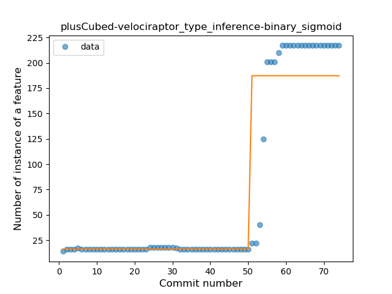
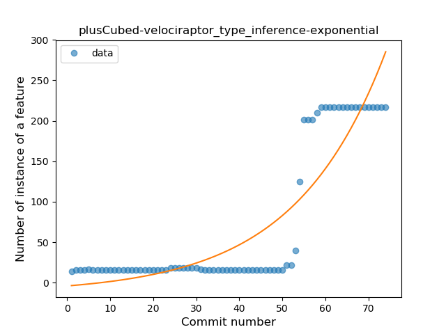
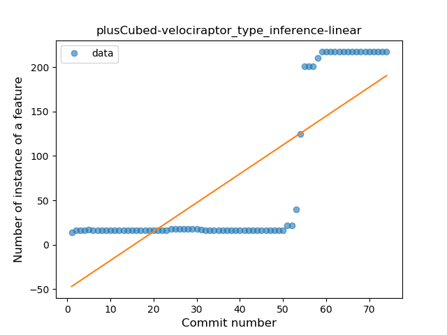
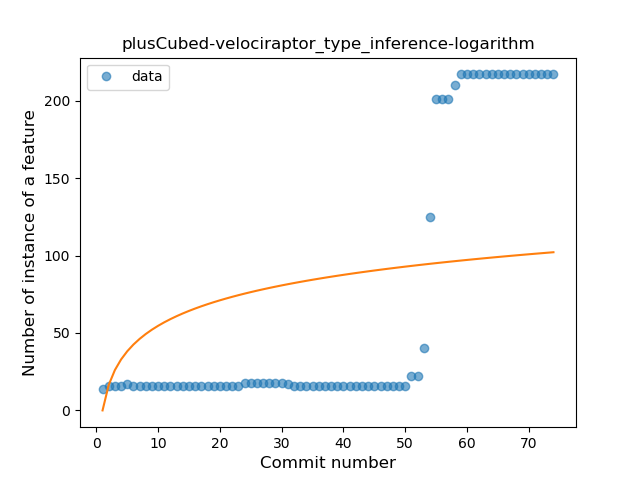
### <a name="lambda">Lambda</a>
----
#### Functions
* **Sudden Rise - Exponential:** 
    * **R_Squared:** 0.80698604
* **Constant Rise - Linear:** 
    * **R_Squared:** 0.62725391
* **Plateau Sudden Rise - Binary Sigmoid:** 
    * **R_Squared:** 0.32319693
* **Sudden Rise Plateau - Logarithm:** 
    * **R_Squared:** 0.20570165

**Plots** :chart_with_upwards_trend:
-----

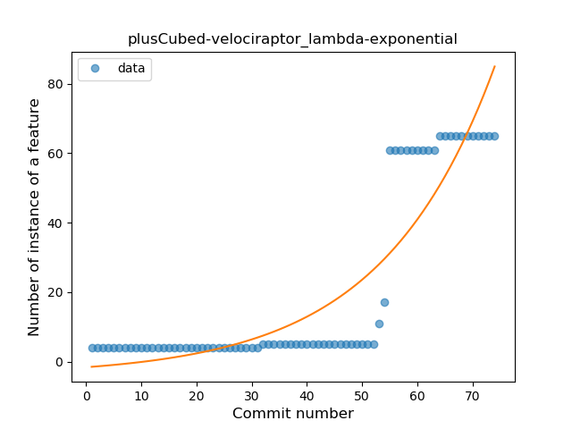
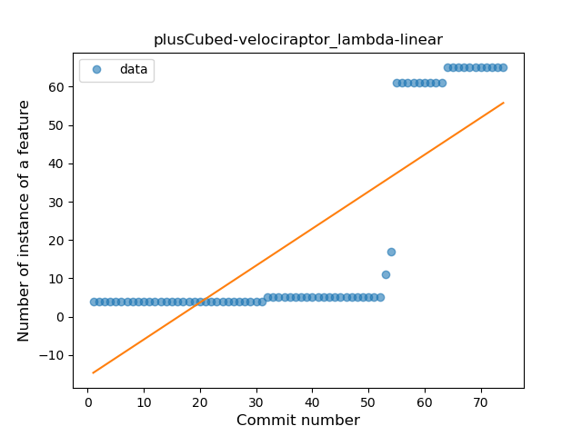
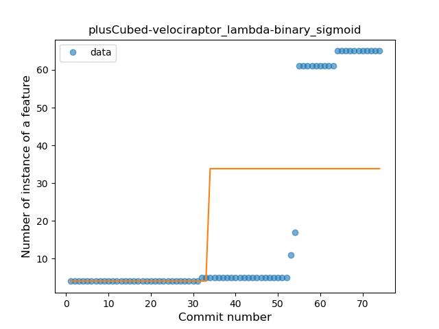
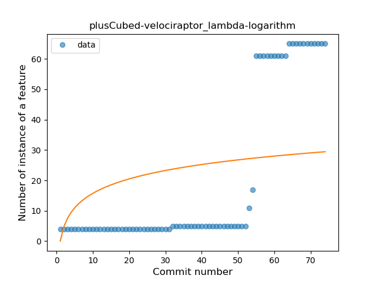
### <a name="safe_call">Safe Call</a>
----
#### Functions
* **Plateau Sudden Rise - Binary Sigmoid:** 
    * **R_Squared:** 1.0
* **Instability - Polinomial 4:** 
    * **R_Squared:** 0.83539266
* **Sudden Rise Plateau - Logarithm:** 
    * **R_Squared:** 0.70739418
* **Constant Rise - Linear:** 
    * **R_Squared:** 0.52795031

**Plots** :chart_with_upwards_trend:
-----

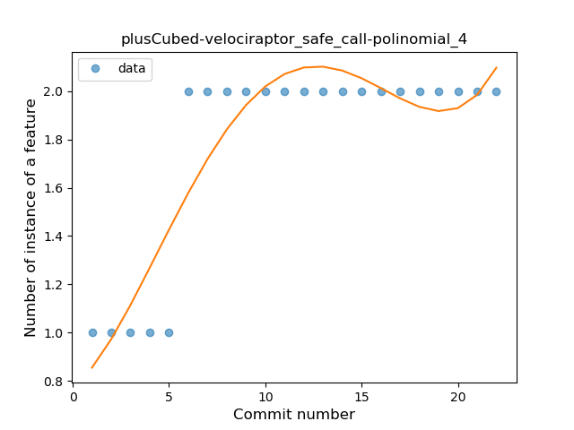
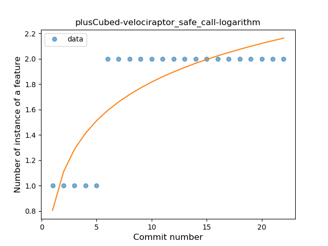
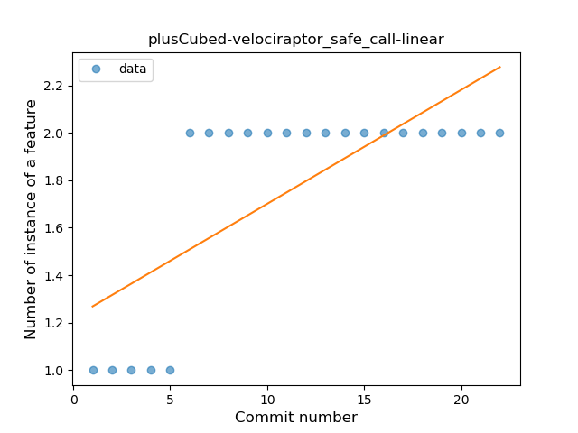
### <a name="when_expr">When expression</a>
----
#### Functions
* **Plateau Gradual Rise - Sigmoid:** 
    * **R_Squared:** 0.99160301
* **Instability - Polinomial 3:** )
    * **R_Squared:** 0.90458553
* **Constant Rise - Linear:** 
    * **R_Squared:** 0.79239071
* **Sudden Rise - Exponential:** 
    * **R_Squared:** 0.79995075
* **Sudden Rise Plateau - Logarithm:** 
    * **R_Squared:** 0.46663139

**Plots** :chart_with_upwards_trend:
-----

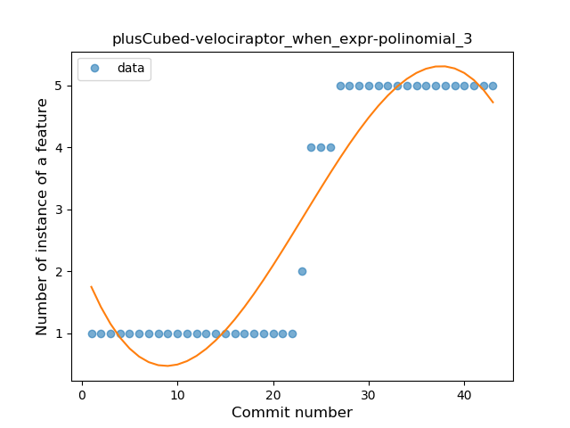
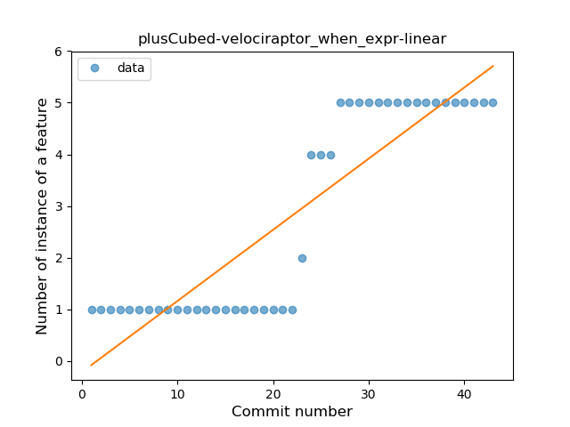
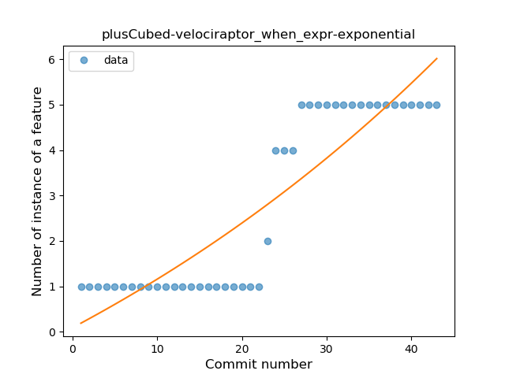
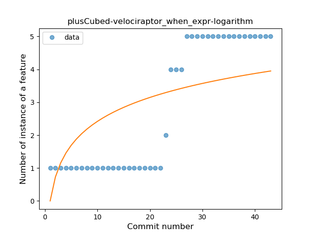
### <a name="companion_object">Companion Object</a>
----
#### Functions
* **Plateau Gradual Rise - Sigmoid:** 
    * **R_Squared:** 0.99788196
* **Sudden Rise - Exponential:** 
    * **R_Squared:** 0.81118338
* **Constant Rise - Linear:** 
    * **R_Squared:** 0.66577979
* **Sudden Rise Plateau - Logarithm:** 
    * **R_Squared:** 0.24996014

**Plots** :chart_with_upwards_trend:
-----

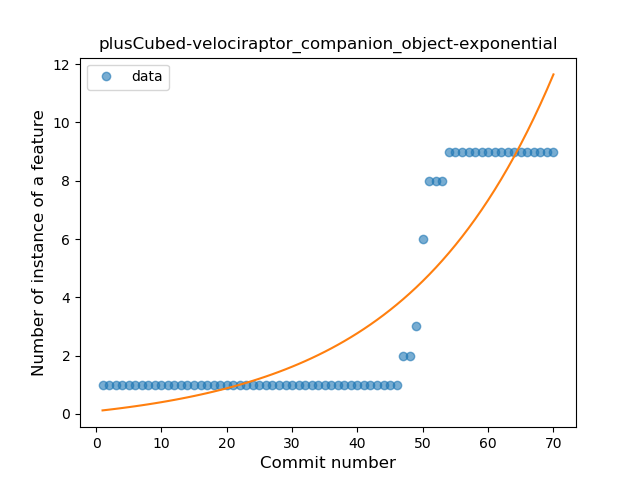

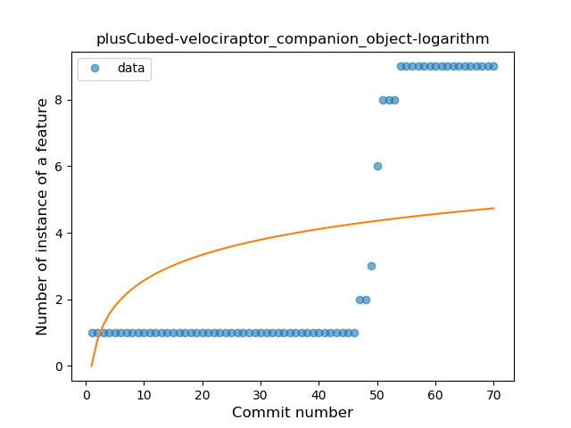
### <a name="unsafe_call">Unsafe Call</a>
----
#### Functions
* **Plateau Gradual Rise - Sigmoid:** 
    * **R_Squared:** 0.99994274
* **Sudden Rise - Exponential:** 
    * **R_Squared:** 0.77736754
* **Constant Rise - Linear:** 
    * **R_Squared:** 0.60872341
* **Sudden Rise Plateau - Logarithm:** 
    * **R_Squared:** 0.17709752

**Plots** :chart_with_upwards_trend:
-----

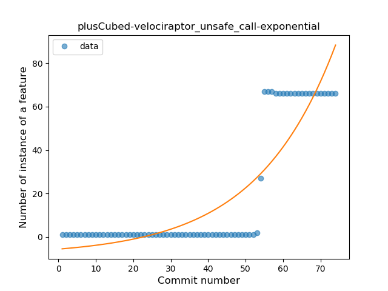
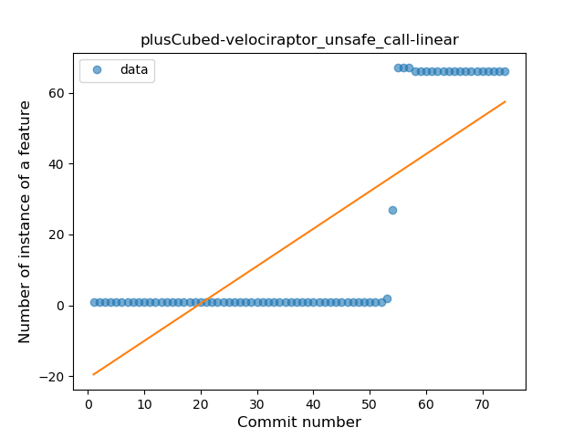
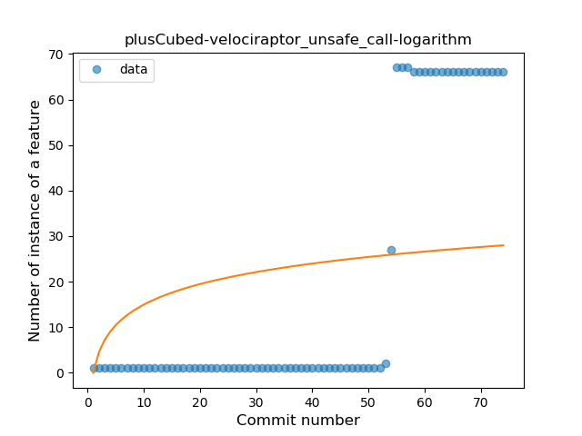
### <a name="string_template">String Template</a>
----
#### Functions
* **Instability - Polinomial 4:** 
    * **R_Squared:** 0.80681306
* **Instability - Polinomial 3:** )
    * **R_Squared:** 0.66161869
* **Sudden Rise Plateau - Logarithm:** 
    * **R_Squared:** 0.61916361
* **Plateau Sudden Rise - Binary Sigmoid:** 
    * **R_Squared:** 0.4725604
* **Constant Rise - Linear:** 
    * **R_Squared:** 0.33440905

**Plots** :chart_with_upwards_trend:
-----

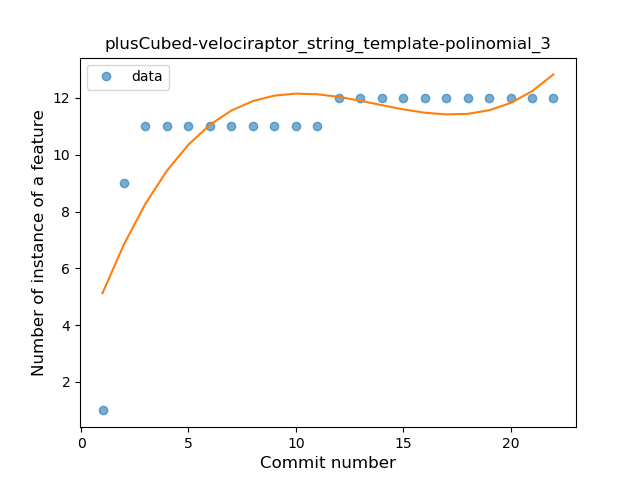
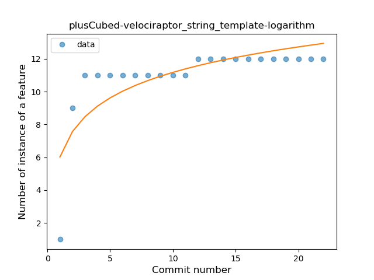
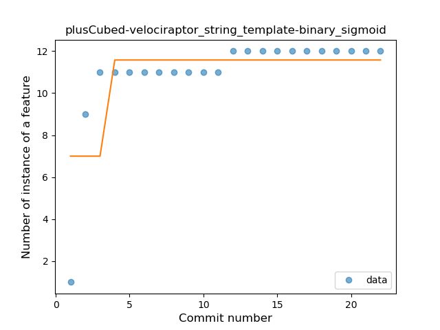
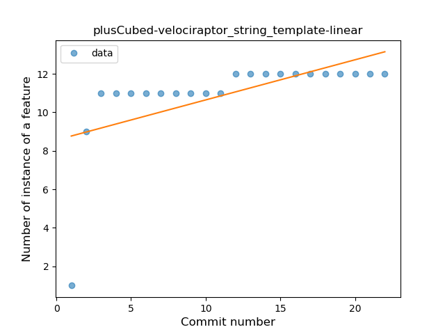
### <a name="func_with_default_value">Function with Default Value</a>
----
#### Functions
* **Plateau Sudden Rise - Binary Sigmoid:** 
    * **R_Squared:** 1.0
* **Instability - Polinomial 3:** )
    * **R_Squared:** 0.82209105
* **Sudden Rise Plateau - Logarithm:** 
    * **R_Squared:** 0.69009322
* **Constant Rise - Linear:** 
    * **R_Squared:** 0.46363636

**Plots** :chart_with_upwards_trend:
-----

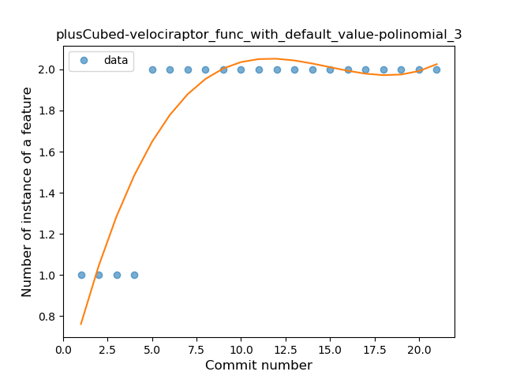
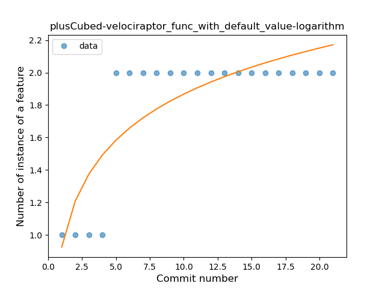
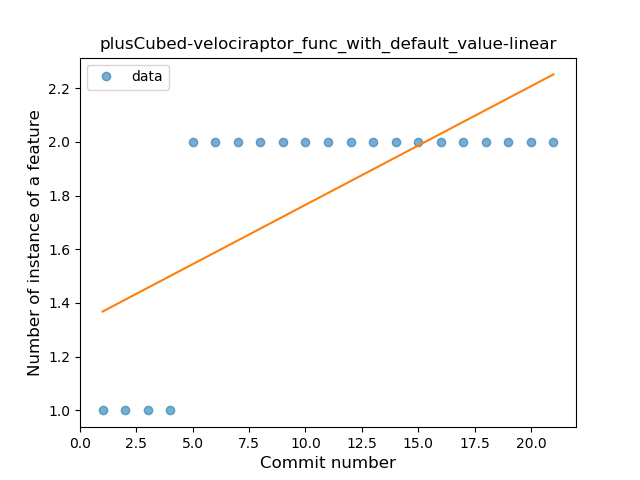
### <a name="func_call_with_named_arg">Function call with Named Argument</a>
----
#### Functions
* **Sudden Decline - Exponential:** 
    * **R_Squared:** 1.0
* **Instability - Polinomial 4:** 
    * **R_Squared:** 0.77192982
* **Instability - Polinomial 3:** )
    * **R_Squared:** 0.60087719
* **Constant Decline - Linear:** 
    * **R_Squared:** 0.16666667
* **Sudden Rise Plateau - Logarithm:** 
    * **R_Squared:** -0.0

**Plots** :chart_with_upwards_trend:
-----

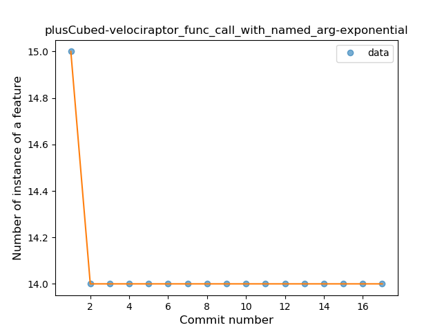
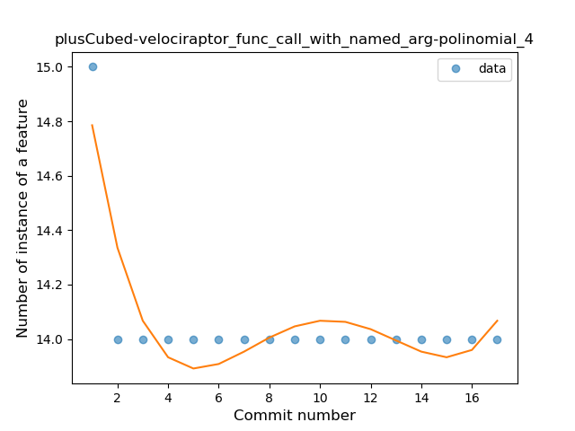
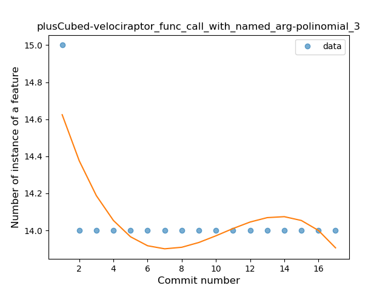
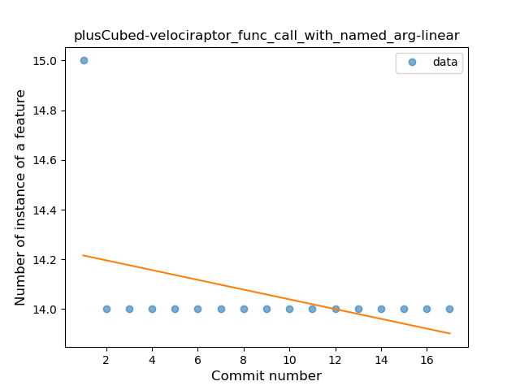
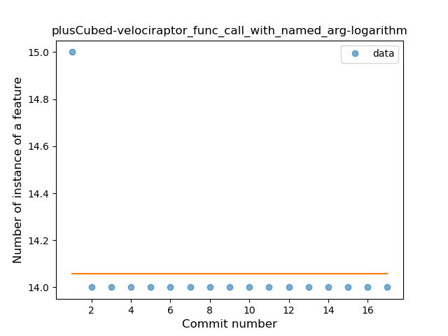
### <a name="data_class">Data Class</a>
----
#### Functions
* **Plateau Sudden Rise - Binary Sigmoid:** 
    * **R_Squared:** 1.0
* **Instability - Polinomial 4:** 
    * **R_Squared:** 0.86834904
* **Sudden Rise Plateau - Logarithm:** 
    * **R_Squared:** 0.70636564
* **Constant Rise - Linear:** 
    * **R_Squared:** 0.62086957

**Plots** :chart_with_upwards_trend:
-----

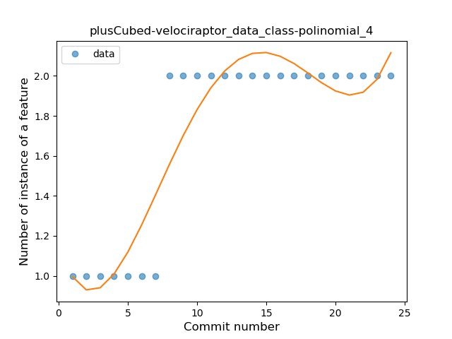
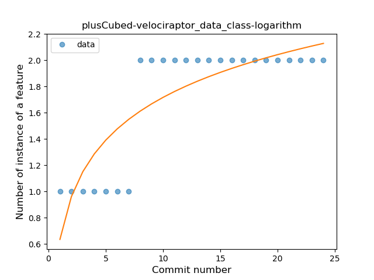
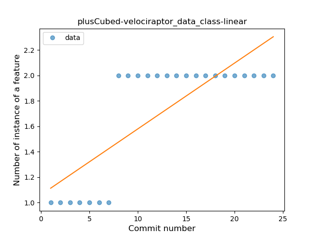
