## premnirmal-StockTicker
----
#### Metrics provided by Detekt
* Number of lines of code 7374
* Number of Kotlin files: 106
* Cyclomatic complexity: 1054
* Cyclomatic complexity by thousands of lines: 272 

----
**17** features analyzed

*	<a href="#type_inference">Type Inference</a> 
*	<a href="#lambda">Lambda</a> 
*	<a href="#safe_call">Safe Call</a> 
*	<a href="#when_expr">When expression</a> 
*	<a href="#companion_object">Companion Object</a> 
*	<a href="#unsafe_call">Unsafe Call</a> 
*	<a href="#string_template">String Template</a> 
*	<a href="#func_with_default_value">Function with Default Value</a> 
*	<a href="#singleton">Singleton</a> 
*	<a href="#smart_cast">Smart Cast</a> 
*	<a href="#range_expr">Range Expression</a> 
*	<a href="#func_call_with_named_arg">Function call with Named Argument</a> 
*	<a href="#data_class">Data Class</a> 
*	<a href="#extension_function">Extension Function</a> 
*	<a href="#property_delegation">Property Delegation</a> 
*	<a href="#destructuring_declaration">Destructuring Declaration</a> 
*	<a href="#overloaded_op">Overloaded Operator</a> 

### <a name="type_inference">Type Inference</a>
----
#### Functions
* **Constant Rise - Linear:** 
    * **R_Squared:** 0.93541189
* **Sudden Rise - Exponential:** 
    * **R_Squared:** 0.9448993
* **Sudden Rise Plateau - Logarithm:** 
    * **R_Squared:** 0.68305622

**Plots** :chart_with_upwards_trend:
-----

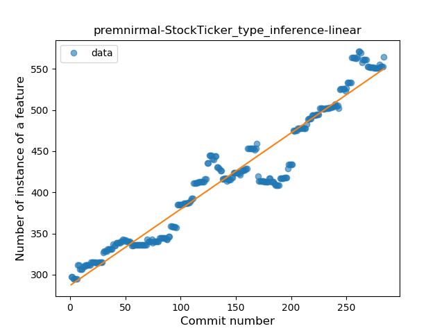
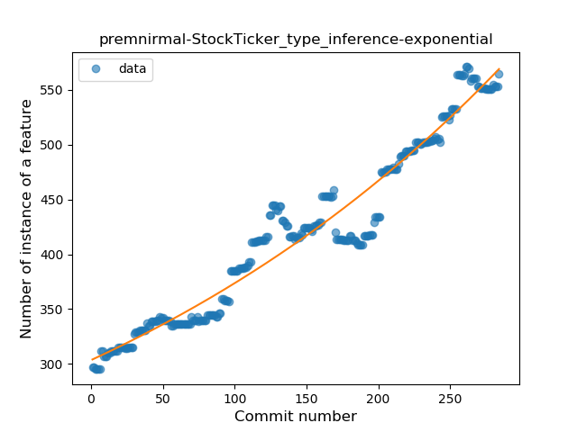
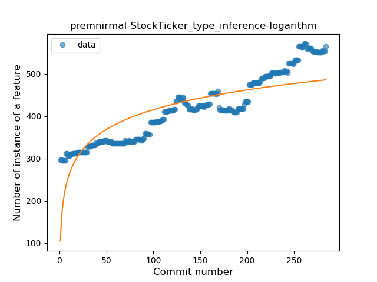
### <a name="lambda">Lambda</a>
----
#### Functions
* **Sudden Rise - Exponential:** 
    * **R_Squared:** 0.96437342
* **Constant Rise - Linear:** 
    * **R_Squared:** 0.82809448
* **Sudden Rise Plateau - Logarithm:** 
    * **R_Squared:** 0.49788405

**Plots** :chart_with_upwards_trend:
-----

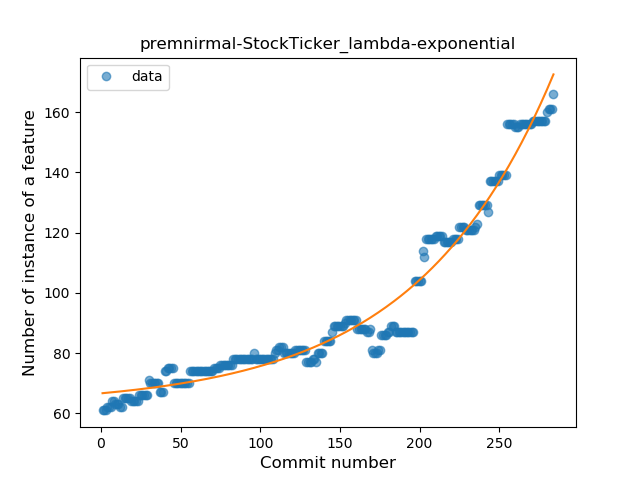
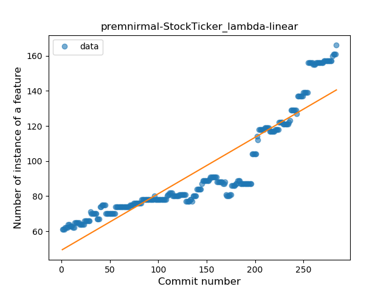
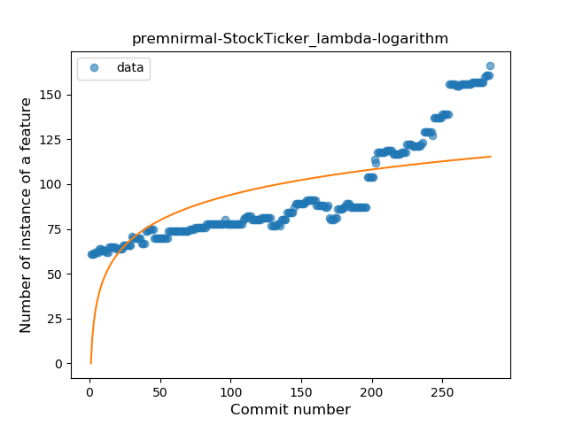
### <a name="safe_call">Safe Call</a>
----
#### Functions
* **Plateau Gradual Rise - Sigmoid:** 
    * **R_Squared:** 0.91623033
* **Sudden Rise - Exponential:** 
    * **R_Squared:** 0.73305963
* **Constant Rise - Linear:** 
    * **R_Squared:** 0.47438732
* **Sudden Rise Plateau - Logarithm:** 
    * **R_Squared:** 0.18025527

**Plots** :chart_with_upwards_trend:
-----

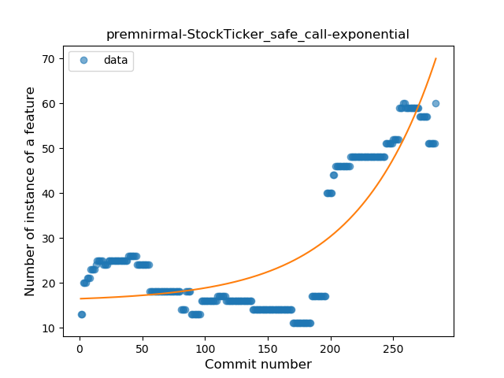
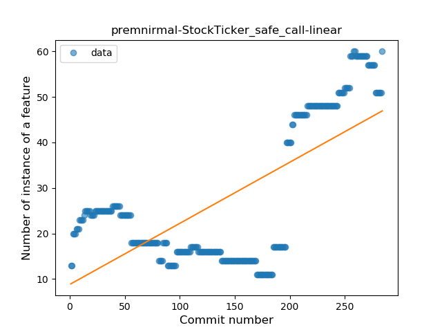
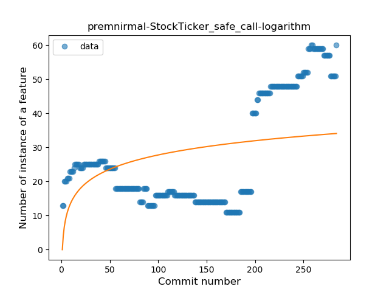
### <a name="when_expr">When expression</a>
----
#### Functions
* **Plateau Gradual Rise - Sigmoid:** 
    * **R_Squared:** 0.91934066
* **Sudden Rise - Exponential:** 
    * **R_Squared:** 0.86036423
* **Constant Rise - Linear:** 
    * **R_Squared:** 0.45618272
* **Sudden Rise Plateau - Logarithm:** 
    * **R_Squared:** 0.2505787

**Plots** :chart_with_upwards_trend:
-----

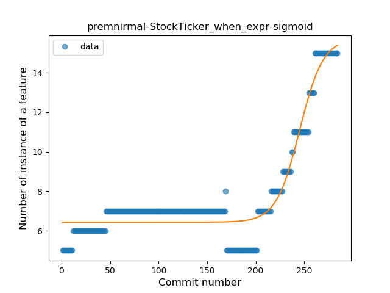
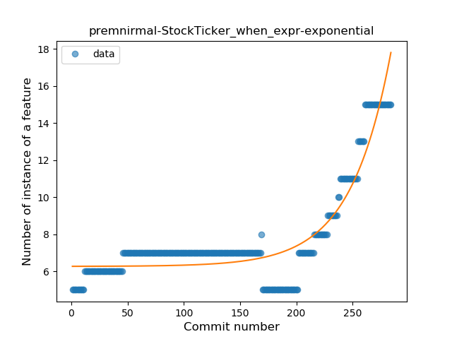
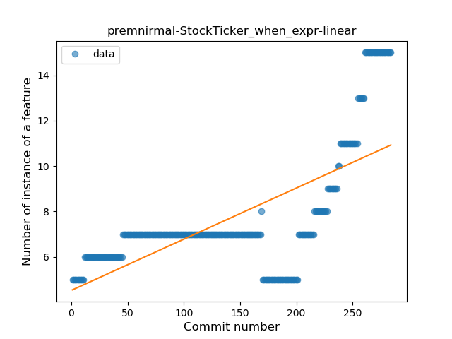

### <a name="companion_object">Companion Object</a>
----
#### Functions
* **Constant Rise - Linear:** 
    * **R_Squared:** 0.32403829
* **Sudden Rise - Exponential:** 
    * **R_Squared:** 0.32506411
* **Sudden Rise Plateau - Logarithm:** 
    * **R_Squared:** 0.29848511

**Plots** :chart_with_upwards_trend:
-----

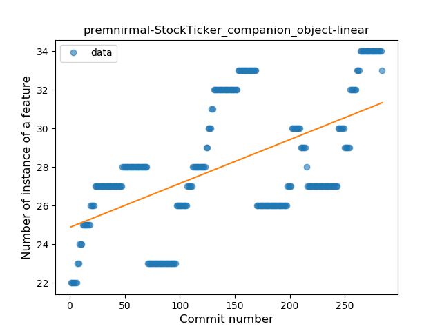
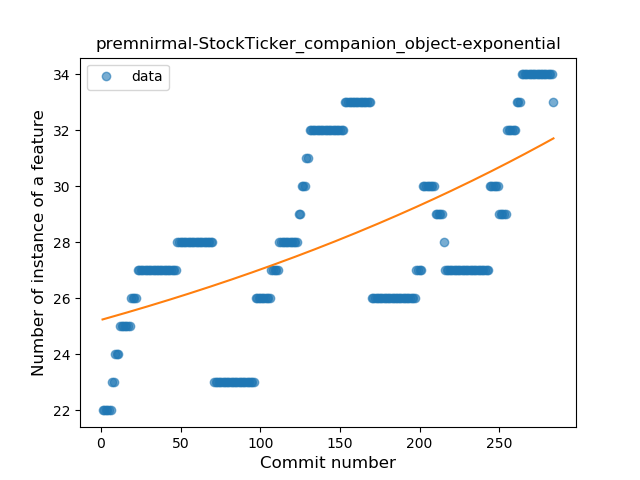
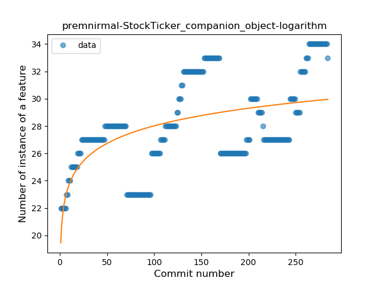
### <a name="unsafe_call">Unsafe Call</a>
----
#### Functions
* **Constant Rise - Linear:** 
    * **R_Squared:** 0.0130987
* **Sudden Rise Plateau - Logarithm:** 
    * **R_Squared:** 0.00265041

**Plots** :chart_with_upwards_trend:
-----

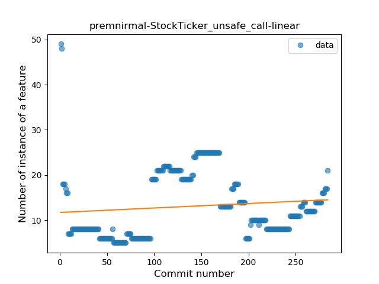
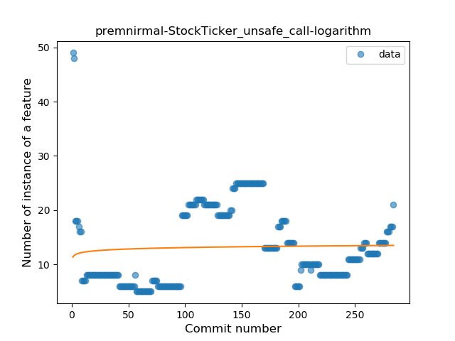
### <a name="string_template">String Template</a>
----
#### Functions
* **Constant Decline - Linear:** 
    * **R_Squared:** 0.25514557
* **Sudden Decline - Exponential:** 
    * **R_Squared:** 0.26266406
* **Sudden Rise Plateau - Logarithm:** 
    * **R_Squared:** -0.0

**Plots** :chart_with_upwards_trend:
-----

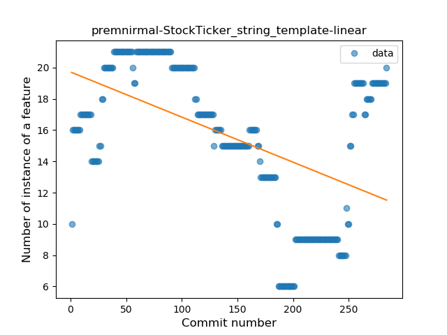
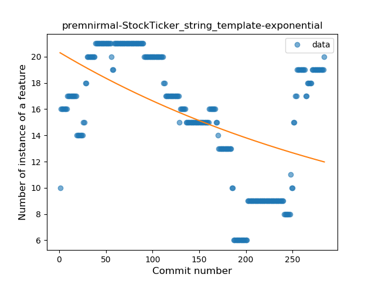
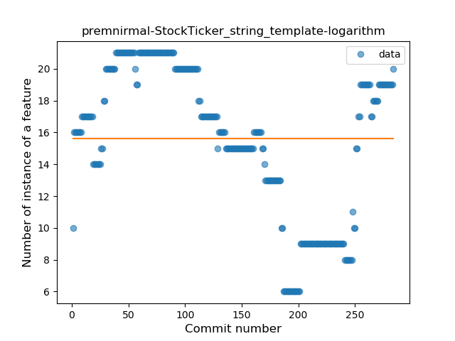
### <a name="func_with_default_value">Function with Default Value</a>
----
#### Functions
* **Sudden Rise - Exponential:** 
    * **R_Squared:** 0.95281823
* **Constant Rise - Linear:** 
    * **R_Squared:** 0.79880327
* **Sudden Rise Plateau - Logarithm:** 
    * **R_Squared:** 0.2564788

**Plots** :chart_with_upwards_trend:
-----

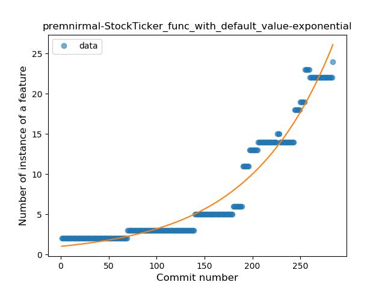
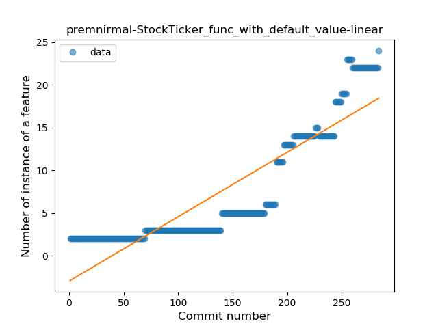
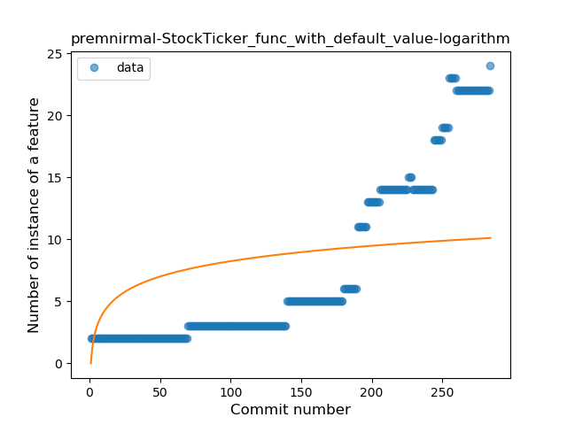
### <a name="singleton">Singleton</a>
----
#### Functions
* **Plateau Gradual Rise - Sigmoid:** 
    * **R_Squared:** 0.89498175
* **Constant Rise - Linear:** 
    * **R_Squared:** 0.57618499
* **Sudden Rise Plateau - Logarithm:** 
    * **R_Squared:** 0.5785213

**Plots** :chart_with_upwards_trend:
-----

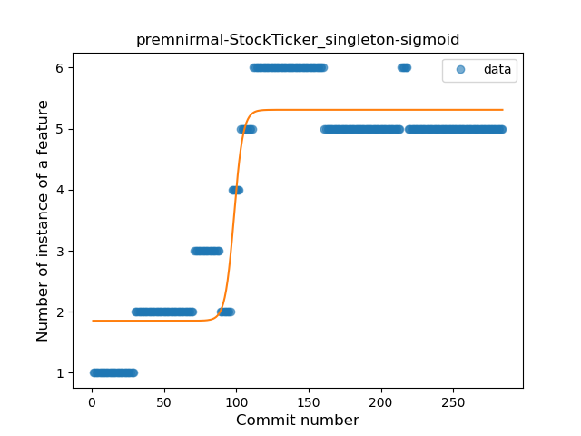
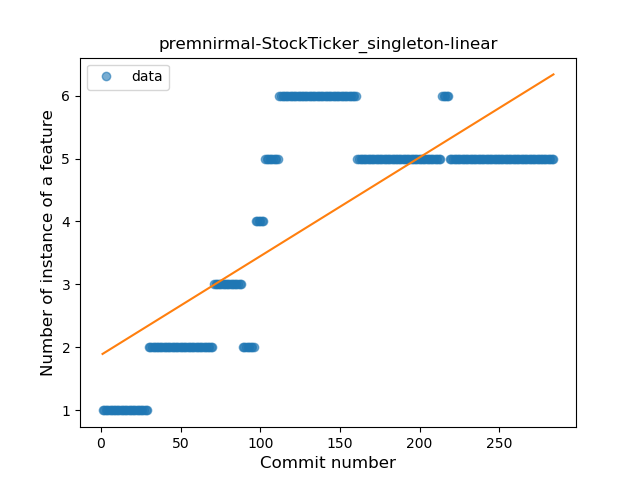
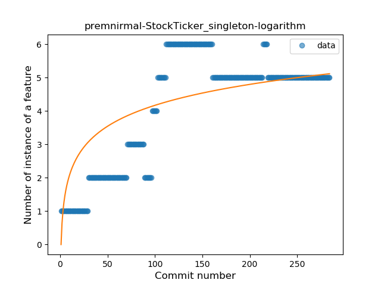
### <a name="smart_cast">Smart Cast</a>
----
#### Functions
* **Plateau Sudden Rise - Binary Sigmoid:** 
    * **R_Squared:** 0.52154808
* **Sudden Rise Plateau - Logarithm:** 
    * **R_Squared:** 0.18751081
* **Constant Rise - Linear:** 
    * **R_Squared:** 0.07481609

**Plots** :chart_with_upwards_trend:
-----

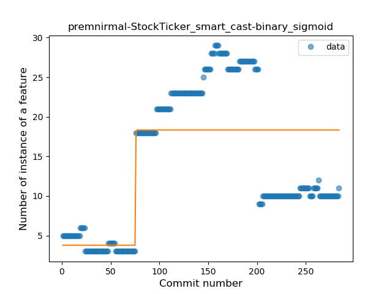
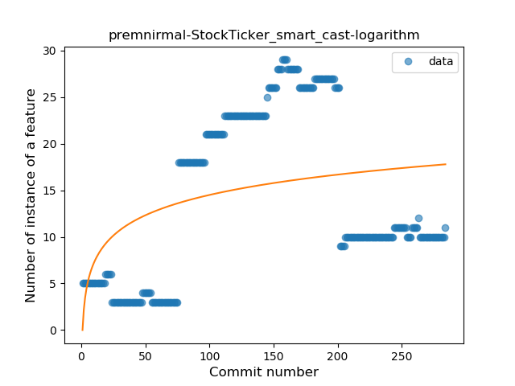
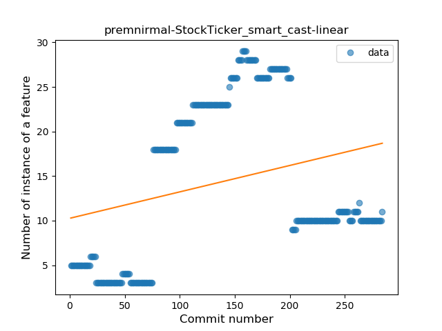
### <a name="range_expr">Range Expression</a>
----
#### Functions
* **Plateau Sudden Rise - Binary Sigmoid:** 
    * **R_Squared:** 0.71597194
* **Constant Rise - Linear:** 
    * **R_Squared:** 0.43339427
* **Sudden Rise Plateau - Logarithm:** 
    * **R_Squared:** 0.36037161

**Plots** :chart_with_upwards_trend:
-----

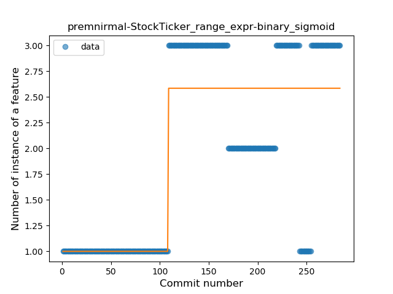
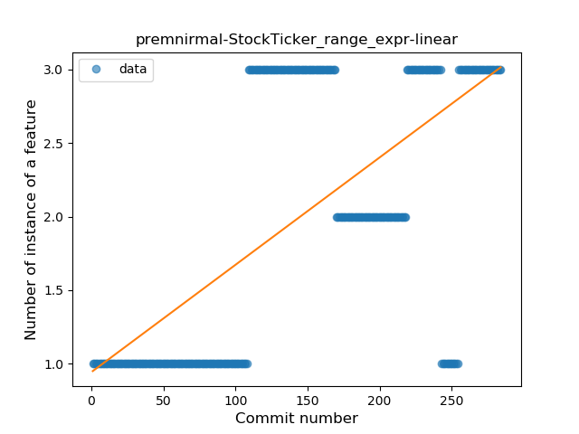
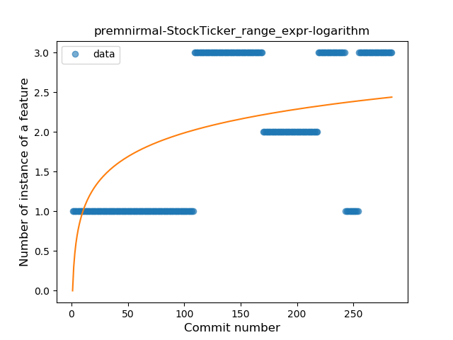
### <a name="func_call_with_named_arg">Function call with Named Argument</a>
----
#### Functions
* **Constant Decline - Linear:** 
    * **R_Squared:** 0.0275046
* **Sudden Rise Plateau - Logarithm:** 
    * **R_Squared:** 0.00073895

**Plots** :chart_with_upwards_trend:
-----

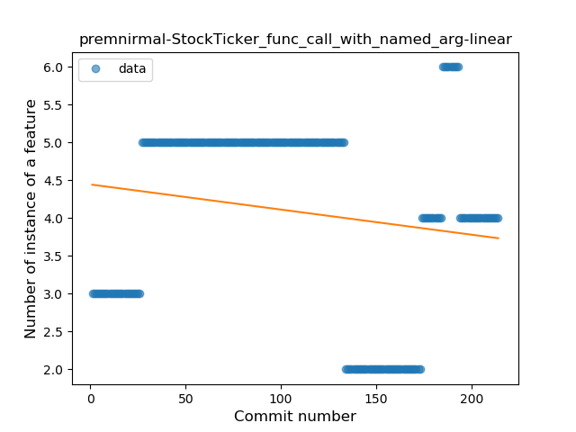
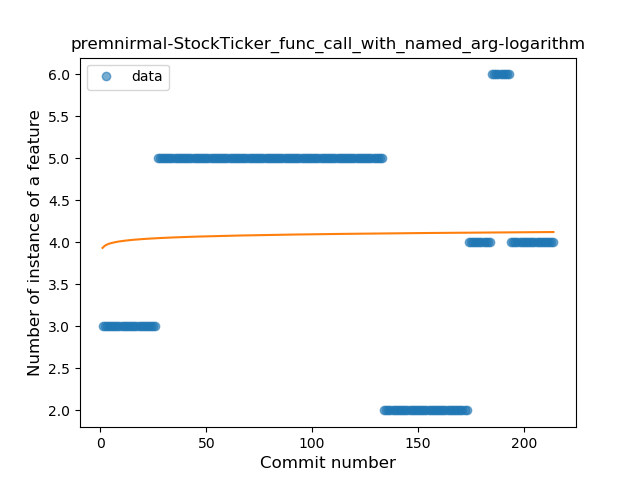
### <a name="data_class">Data Class</a>
----
#### Functions
* **Plateau Gradual Rise - Sigmoid:** 
    * **R_Squared:** 0.94995799
* **Constant Rise - Linear:** 
    * **R_Squared:** 0.90460695
* **Sudden Rise - Exponential:** 
    * **R_Squared:** 0.91190383
* **Sudden Rise Plateau - Logarithm:** 
    * **R_Squared:** 0.64707987

**Plots** :chart_with_upwards_trend:
-----

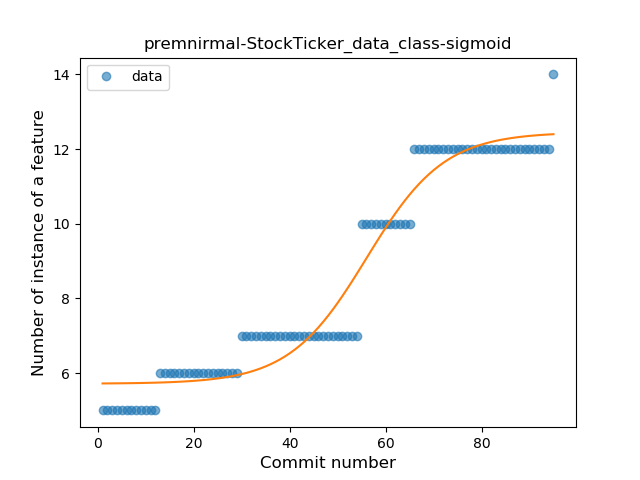
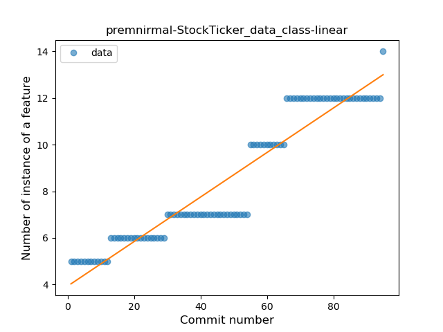
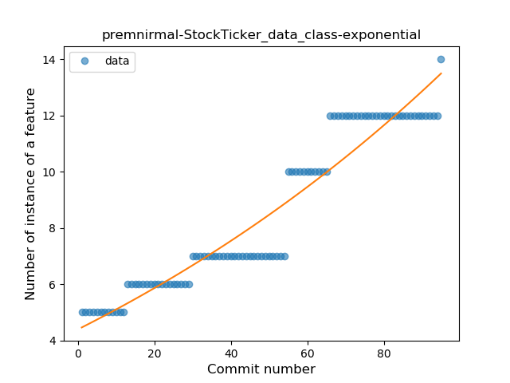
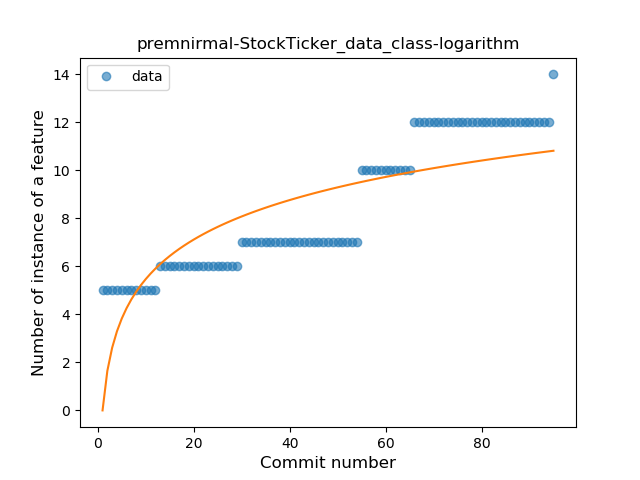
### <a name="extension_function">Extension Function</a>
----
#### Functions
* **Constant Rise - Linear:** 
    * **R_Squared:** 0.7931301
* **Sudden Rise Plateau - Logarithm:** 
    * **R_Squared:** 0.70553953

**Plots** :chart_with_upwards_trend:
-----

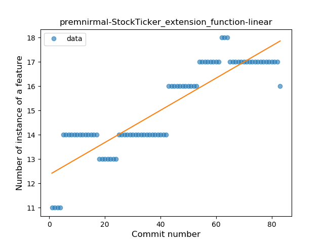
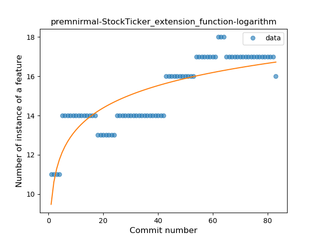
### <a name="property_delegation">Property Delegation</a>
----
#### Functions
* **Sudden Rise - Exponential:** 
    * **R_Squared:** 0.87056421
* **Constant Rise - Linear:** 
    * **R_Squared:** 0.67909477
* **Sudden Rise Plateau - Logarithm:** 
    * **R_Squared:** 0.33645853

**Plots** :chart_with_upwards_trend:
-----

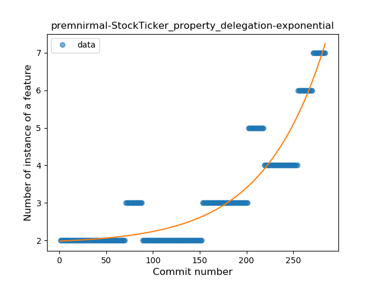
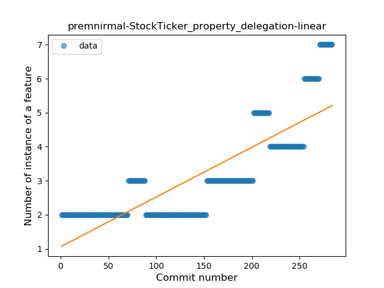
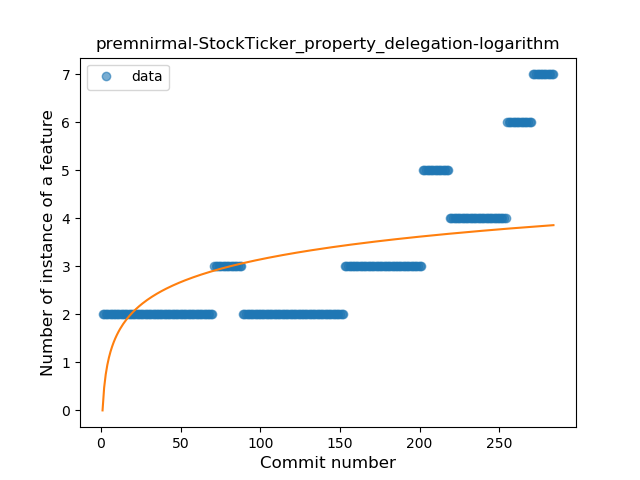
### <a name="destructuring_declaration">Destructuring Declaration</a>
----
#### Functions
* **Constant Decline - Linear:** 
    * **R_Squared:** 0.51662234
* **Sudden Rise Plateau - Logarithm:** 
    * **R_Squared:** -0.0

**Plots** :chart_with_upwards_trend:
-----

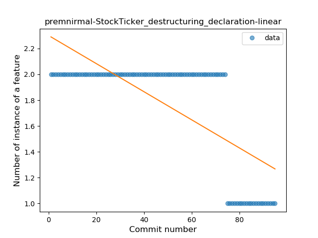
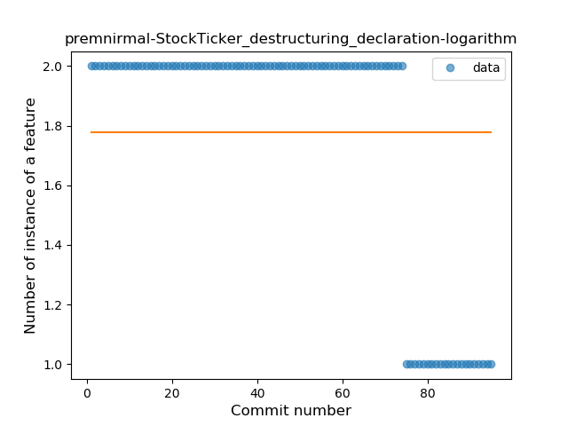
### <a name="overloaded_op">Overloaded Operator</a>
----
#### Functions
* **Constant Rise - Linear:** 
    * **R_Squared:** 0.1525854
* **Sudden Rise Plateau - Logarithm:** 
    * **R_Squared:** 0.13024561

**Plots** :chart_with_upwards_trend:
-----

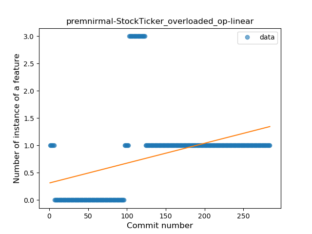
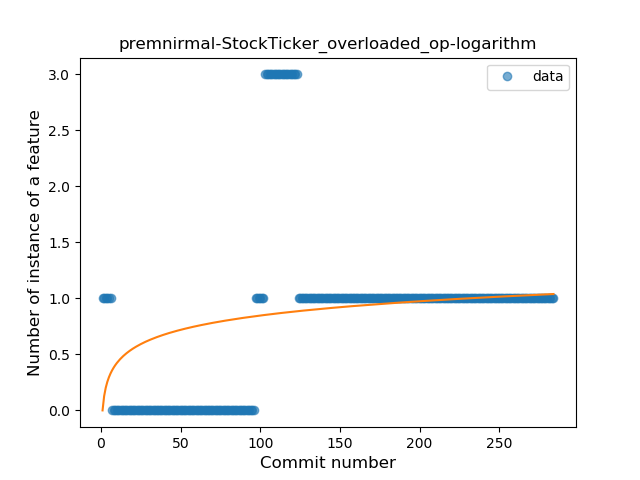
