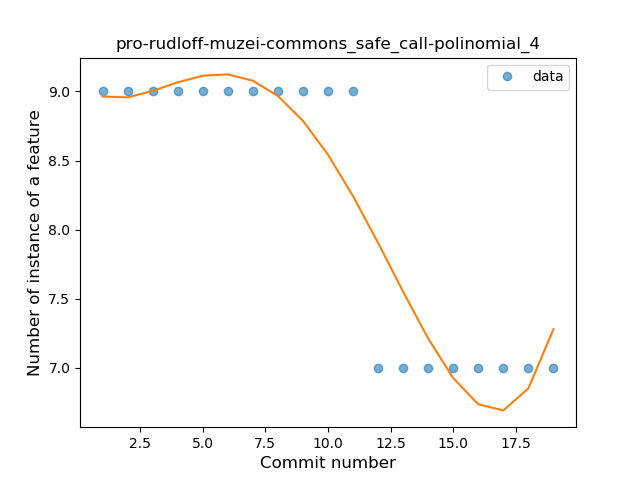

## pro-rudloff-muzei-commons
----
#### Metrics provided by Detekt
* Number of lines of code 265
* Number of Kotlin files: 5
* Cyclomatic complexity: 14
* Cyclomatic complexity by thousands of lines: 144 

----
**1** features analyzed

*	<a href="#safe_call">Safe Call</a> 

### <a name="safe_call">Safe Call</a>
----
#### Functions
* **Instability - Polinomial 4:** 
    * **R_Squared:** 0.87553282
* **Instability - Polinomial 3:** )
    * **R_Squared:** 0.8469888
* **Constant Decline - Linear:** 
    * **R_Squared:** 0.73333333
* **Sudden Rise Plateau - Logarithm:** 
    * **R_Squared:** 0.0

**Plots** :chart_with_upwards_trend:
-----

