## proxer-ProxerAndroid
----
#### Metrics provided by Detekt
* Number of lines of code 31014
* Number of Kotlin files: 353
* Cyclomatic complexity: 4096
* Cyclomatic complexity by thousands of lines: 270 

----
**18** features analyzed

*	<a href="#type_inference">Type Inference</a> 
*	<a href="#lambda">Lambda</a> 
*	<a href="#safe_call">Safe Call</a> 
*	<a href="#when_expr">When expression</a> 
*	<a href="#companion_object">Companion Object</a> 
*	<a href="#unsafe_call">Unsafe Call</a> 
*	<a href="#string_template">String Template</a> 
*	<a href="#func_with_default_value">Function with Default Value</a> 
*	<a href="#singleton">Singleton</a> 
*	<a href="#smart_cast">Smart Cast</a> 
*	<a href="#range_expr">Range Expression</a> 
*	<a href="#func_call_with_named_arg">Function call with Named Argument</a> 
*	<a href="#data_class">Data Class</a> 
*	<a href="#extension_function">Extension Function</a> 
*	<a href="#property_delegation">Property Delegation</a> 
*	<a href="#destructuring_declaration">Destructuring Declaration</a> 
*	<a href="#inline_func">Inline Function</a> 
*	<a href="#overloaded_op">Overloaded Operator</a> 

### <a name="type_inference">Type Inference</a>
----
#### Functions
* **Sudden Rise - Exponential:** 
    * **R_Squared:** 0.85902316
* **Constant Rise - Linear:** 
    * **R_Squared:** 0.77792997
* **Sudden Rise Plateau - Logarithm:** 
    * **R_Squared:** 0.37233616

**Plots** :chart_with_upwards_trend:
-----

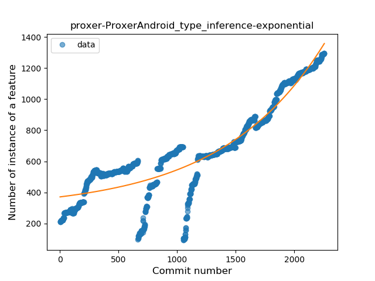
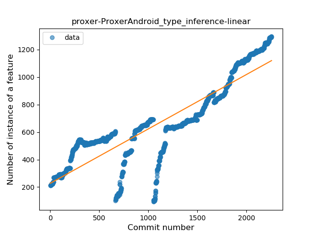
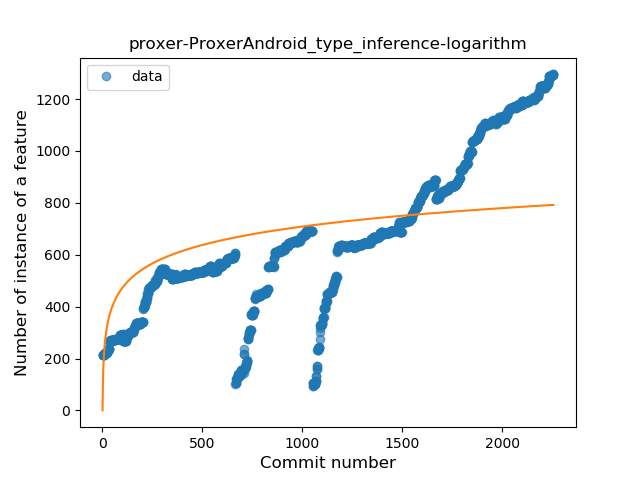
### <a name="lambda">Lambda</a>
----
#### Functions
* **Sudden Rise - Exponential:** 
    * **R_Squared:** 0.9475466
* **Constant Rise - Linear:** 
    * **R_Squared:** 0.93332101
* **Sudden Rise Plateau - Logarithm:** 
    * **R_Squared:** 0.34709071
* **Plateau Sudden Rise - Binary Sigmoid:** 
    * **R_Squared:** 0.04161595

**Plots** :chart_with_upwards_trend:
-----

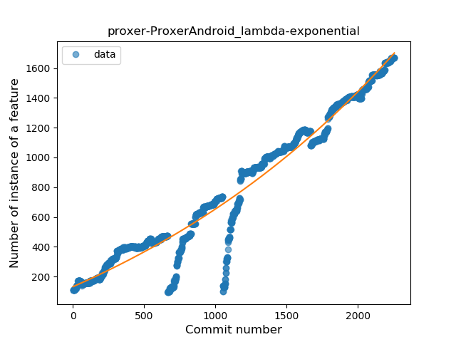

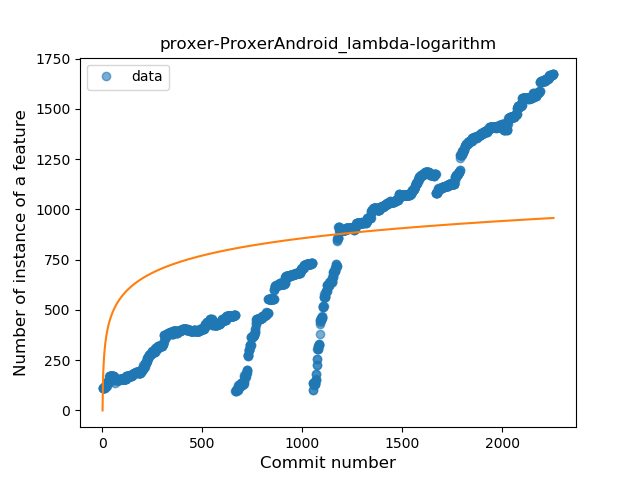
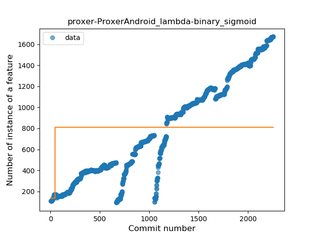
### <a name="safe_call">Safe Call</a>
----
#### Functions
* **Sudden Rise - Exponential:** 
    * **R_Squared:** 0.94413017
* **Constant Rise - Linear:** 
    * **R_Squared:** 0.90001715
* **Sudden Rise Plateau - Logarithm:** 
    * **R_Squared:** 0.31256645
* **Plateau Sudden Rise - Binary Sigmoid:** 
    * **R_Squared:** 0.17648789

**Plots** :chart_with_upwards_trend:
-----

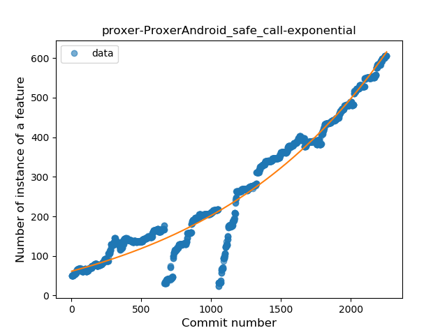
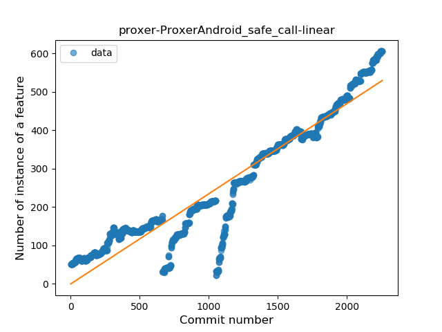
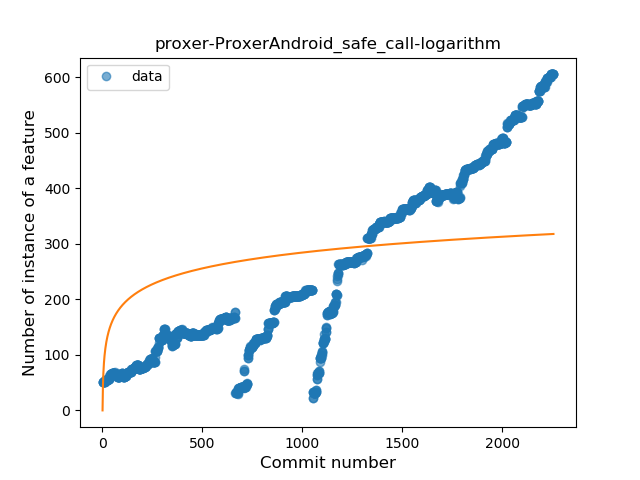
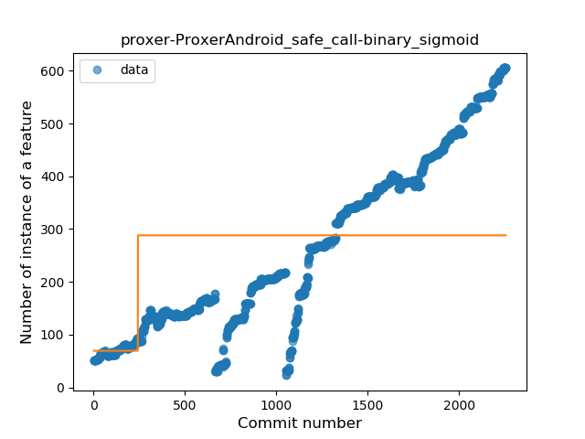
### <a name="when_expr">When expression</a>
----
#### Functions
* **Constant Rise - Linear:** 
    * **R_Squared:** 0.94929648
* **Sudden Rise Plateau - Logarithm:** 
    * **R_Squared:** 0.41253246
* **Plateau Sudden Rise - Binary Sigmoid:** 
    * **R_Squared:** 0.31666639

**Plots** :chart_with_upwards_trend:
-----

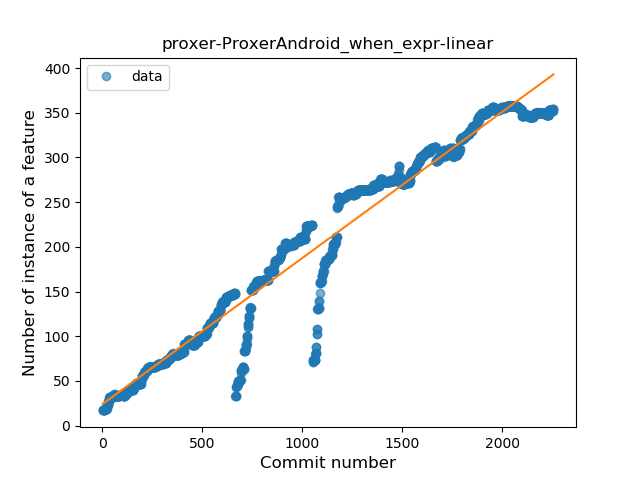
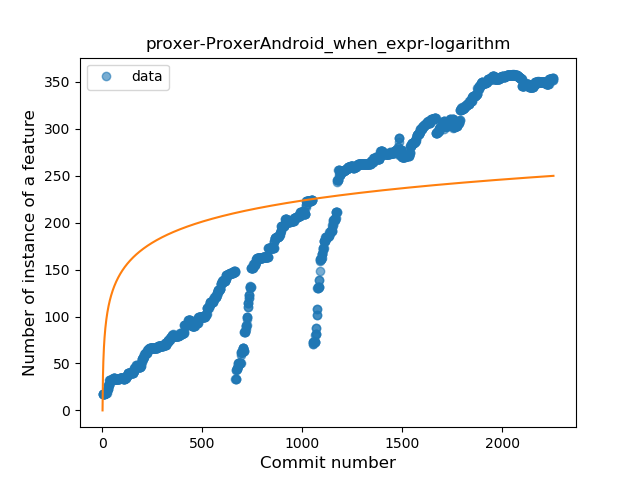
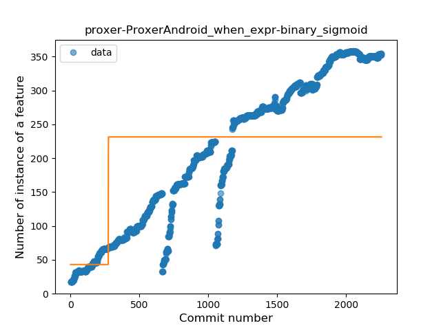
### <a name="companion_object">Companion Object</a>
----
#### Functions
* **Constant Rise - Linear:** 
    * **R_Squared:** 0.79880151
* **Sudden Rise - Exponential:** 
    * **R_Squared:** 0.80439775
* **Sudden Rise Plateau - Logarithm:** 
    * **R_Squared:** 0.46686405
* **Plateau Sudden Rise - Binary Sigmoid:** 
    * **R_Squared:** 0.04488229

**Plots** :chart_with_upwards_trend:
-----

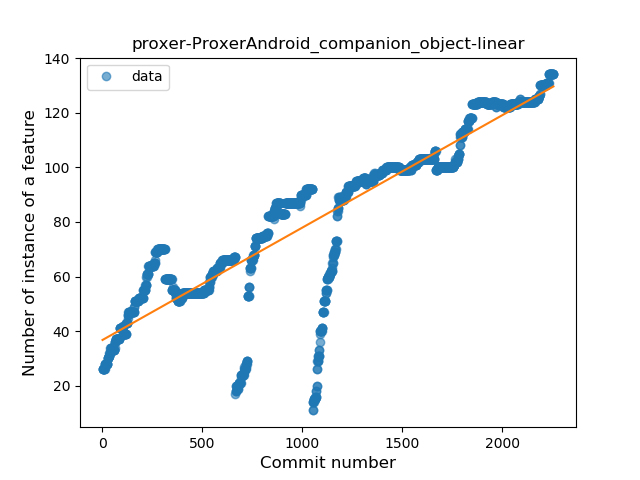
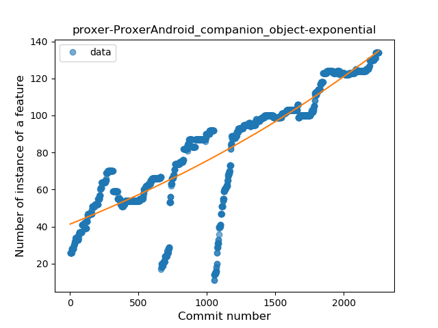
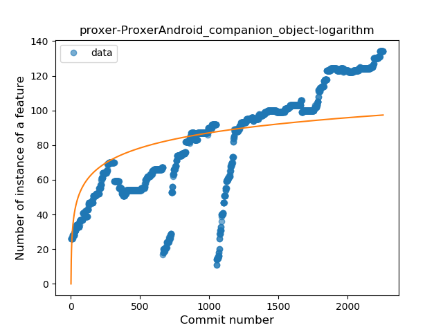
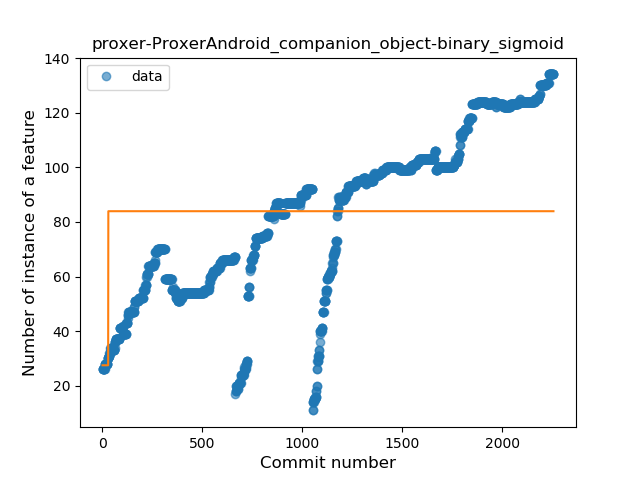
### <a name="unsafe_call">Unsafe Call</a>
----
#### Functions
* **Sudden Decline - Exponential:** 
    * **R_Squared:** 0.59400013
* **Constant Decline - Linear:** 
    * **R_Squared:** 0.56062239
* **Sudden Rise Plateau - Logarithm:** 
    * **R_Squared:** -0.0
* **Plateau Gradual Rise - Sigmoid:** 
    * **R_Squared:** 0.0008135

**Plots** :chart_with_upwards_trend:
-----

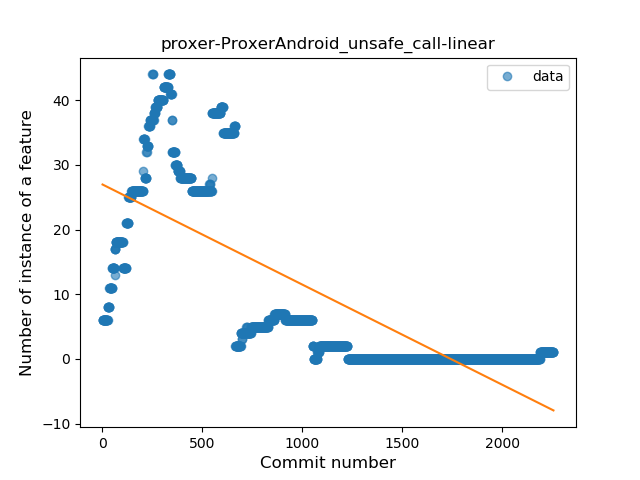

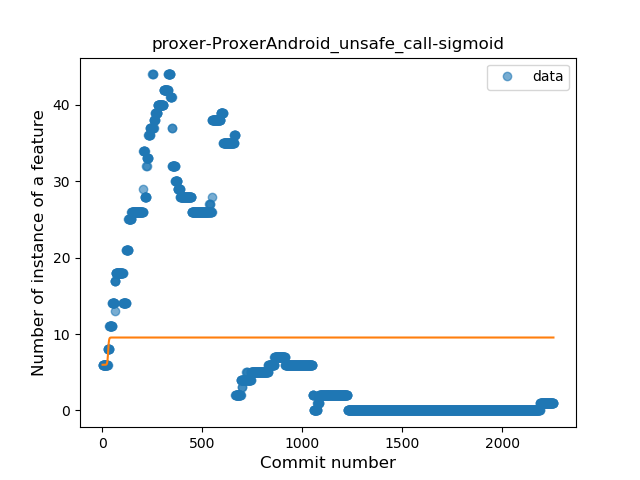
### <a name="string_template">String Template</a>
----
#### Functions
* **Constant Rise - Linear:** 
    * **R_Squared:** 0.56470131
* **Sudden Rise Plateau - Logarithm:** 
    * **R_Squared:** 0.4139628
* **Plateau Sudden Rise - Binary Sigmoid:** 
    * **R_Squared:** 0.1173602

**Plots** :chart_with_upwards_trend:
-----

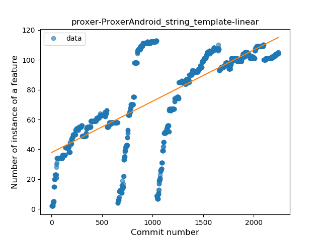
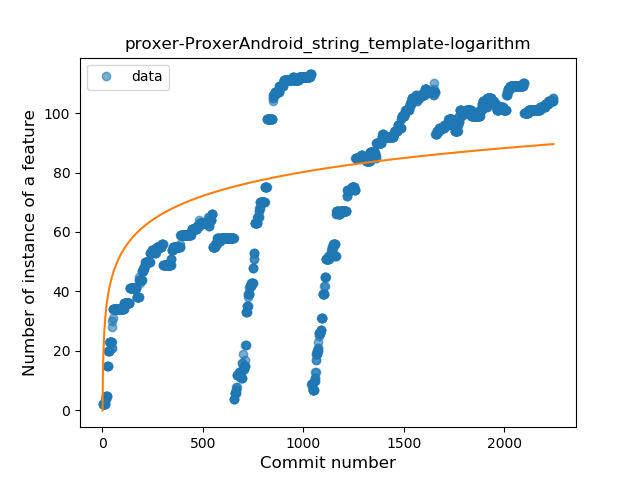

### <a name="func_with_default_value">Function with Default Value</a>
----
#### Functions
* **Constant Rise - Linear:** 
    * **R_Squared:** 0.83485394
* **Sudden Rise - Exponential:** 
    * **R_Squared:** 0.83495774
* **Sudden Rise Plateau - Logarithm:** 
    * **R_Squared:** 0.53754807

**Plots** :chart_with_upwards_trend:
-----

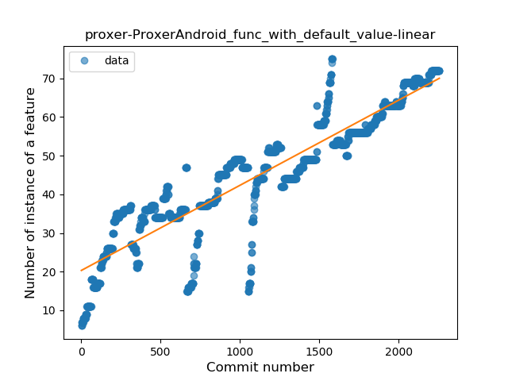

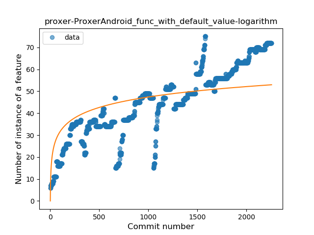
### <a name="singleton">Singleton</a>
----
#### Functions
* **Sudden Rise - Exponential:** 
    * **R_Squared:** 0.75935554
* **Constant Rise - Linear:** 
    * **R_Squared:** 0.6384509
* **Sudden Rise Plateau - Logarithm:** 
    * **R_Squared:** 0.25424101

**Plots** :chart_with_upwards_trend:
-----

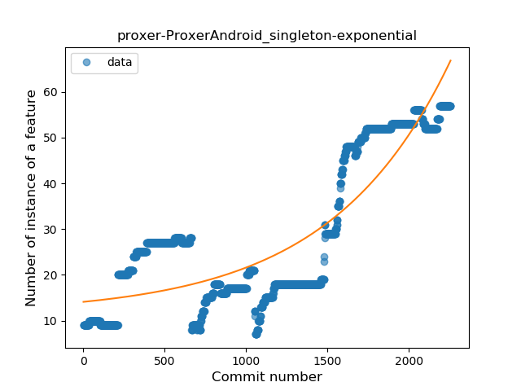
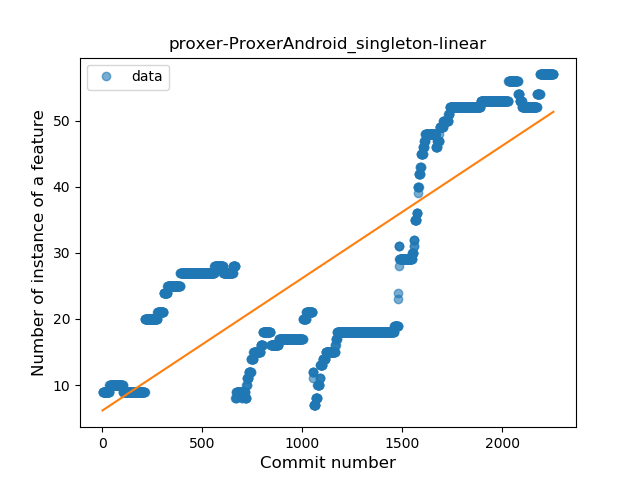
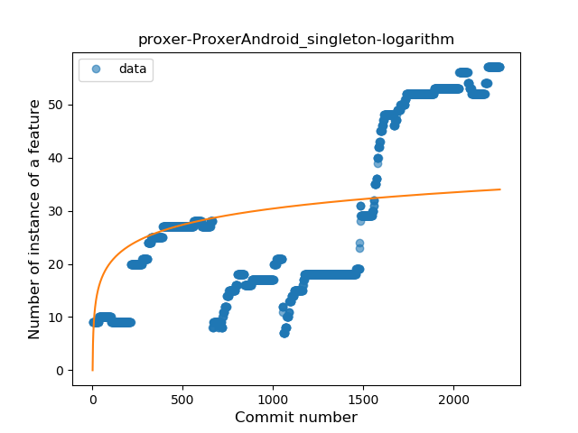
### <a name="smart_cast">Smart Cast</a>
----
#### Functions
* **Constant Rise - Linear:** 
    * **R_Squared:** 0.78084229
* **Sudden Rise Plateau - Logarithm:** 
    * **R_Squared:** 0.39419814

**Plots** :chart_with_upwards_trend:
-----

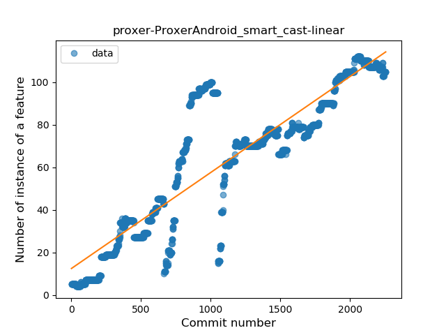
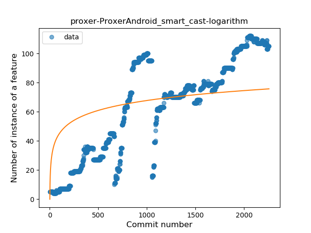
### <a name="range_expr">Range Expression</a>
----
#### Functions
* **Sudden Rise - Exponential:** 
    * **R_Squared:** 0.45033494
* **Constant Rise - Linear:** 
    * **R_Squared:** 0.05663901
* **Sudden Rise Plateau - Logarithm:** 
    * **R_Squared:** 0.02487232

**Plots** :chart_with_upwards_trend:
-----

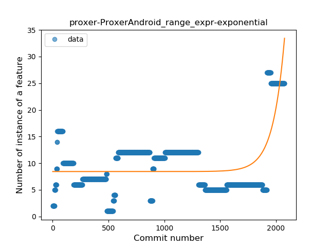

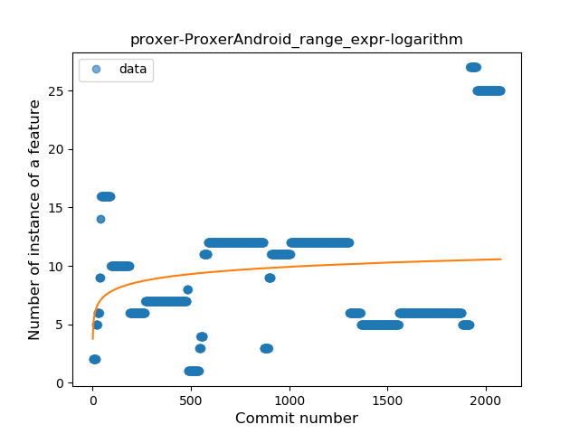
### <a name="func_call_with_named_arg">Function call with Named Argument</a>
----
#### Functions
* **Sudden Rise - Exponential:** 
    * **R_Squared:** 0.85513616
* **Constant Rise - Linear:** 
    * **R_Squared:** 0.6470252
* **Sudden Rise Plateau - Logarithm:** 
    * **R_Squared:** 0.24474107
* **Plateau Sudden Rise - Binary Sigmoid:** 
    * **R_Squared:** 0.20418129

**Plots** :chart_with_upwards_trend:
-----

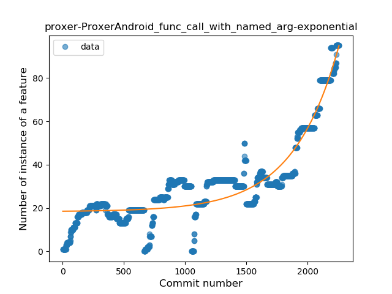
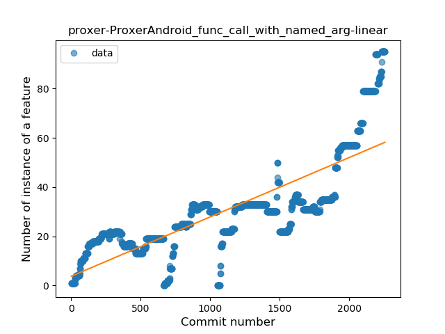
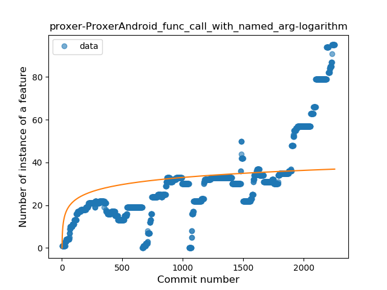
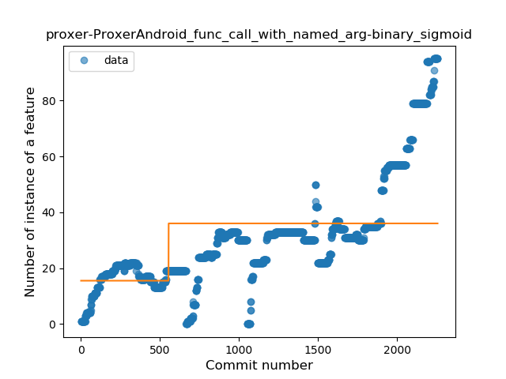
### <a name="data_class">Data Class</a>
----
#### Functions
* **Sudden Rise - Exponential:** 
    * **R_Squared:** 0.9128756
* **Constant Rise - Linear:** 
    * **R_Squared:** 0.87440138
* **Sudden Rise Plateau - Logarithm:** 
    * **R_Squared:** 0.22110793

**Plots** :chart_with_upwards_trend:
-----

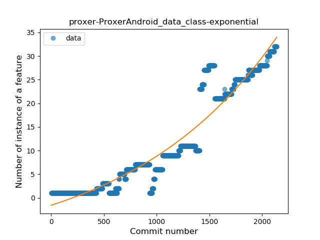
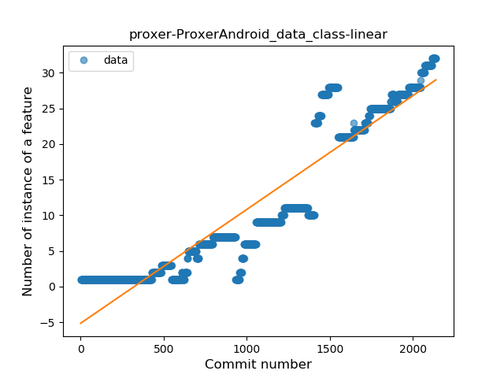
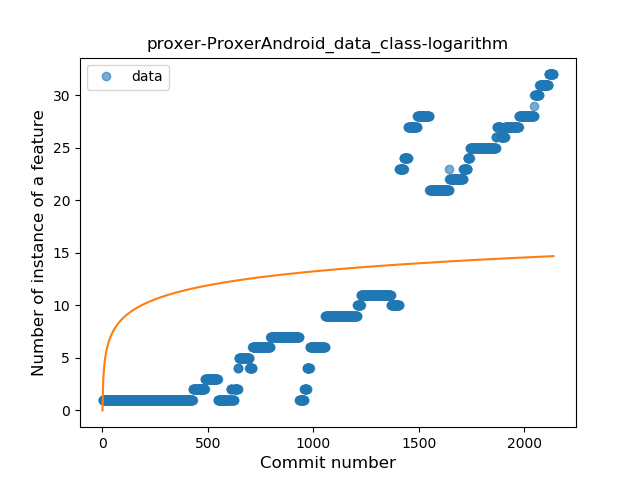
### <a name="extension_function">Extension Function</a>
----
#### Functions
* **Sudden Rise - Exponential:** 
    * **R_Squared:** 0.95706419
* **Constant Rise - Linear:** 
    * **R_Squared:** 0.93914707
* **Sudden Rise Plateau - Logarithm:** 
    * **R_Squared:** 0.38696773

**Plots** :chart_with_upwards_trend:
-----

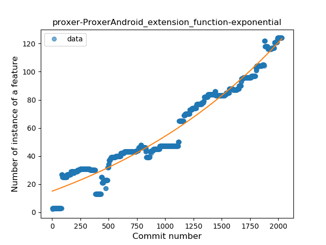
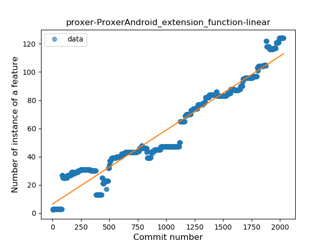
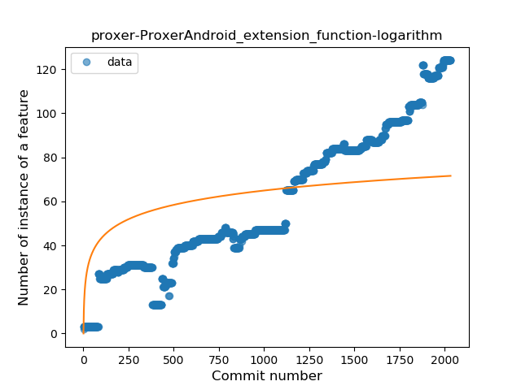
### <a name="property_delegation">Property Delegation</a>
----
#### Functions
* **Sudden Rise - Exponential:** 
    * **R_Squared:** 0.9028402
* **Constant Rise - Linear:** 
    * **R_Squared:** 0.89026632
* **Sudden Rise Plateau - Logarithm:** 
    * **R_Squared:** 0.39142716
* **Plateau Sudden Rise - Binary Sigmoid:** 
    * **R_Squared:** 0.19461135

**Plots** :chart_with_upwards_trend:
-----

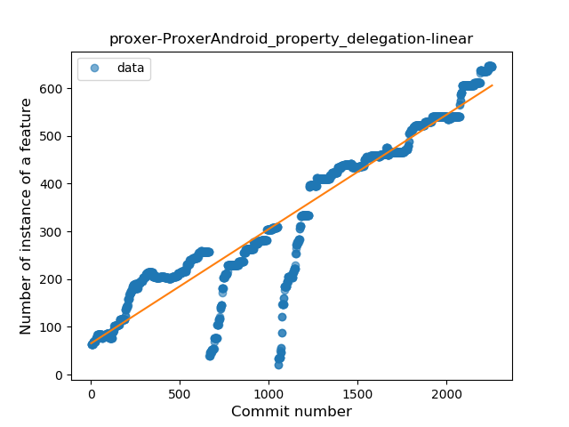
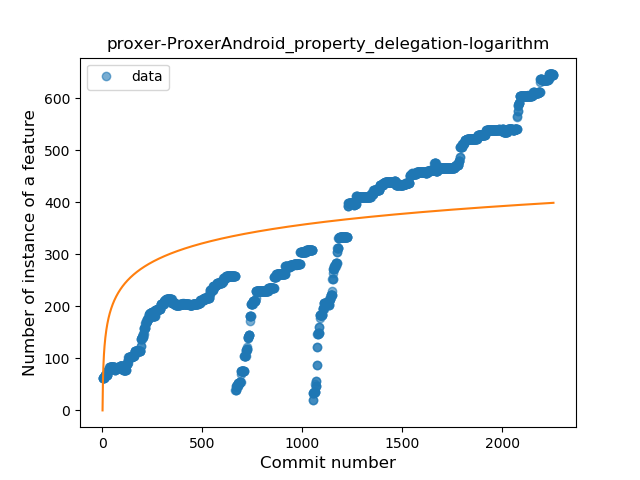
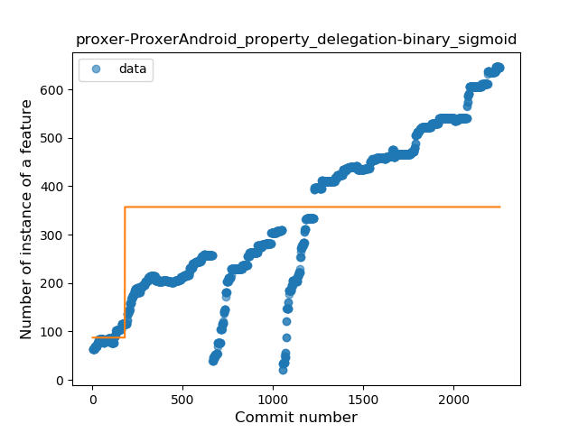
### <a name="destructuring_declaration">Destructuring Declaration</a>
----
#### Functions
* **Sudden Rise - Exponential:** 
    * **R_Squared:** 0.92814855
* **Constant Rise - Linear:** 
    * **R_Squared:** 0.82593932
* **Sudden Rise Plateau - Logarithm:** 
    * **R_Squared:** 0.19664035
* **Plateau Sudden Rise - Binary Sigmoid:** 
    * **R_Squared:** 0.02028137

**Plots** :chart_with_upwards_trend:
-----

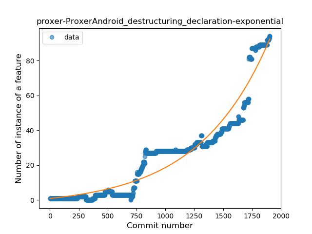
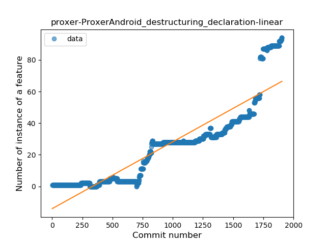
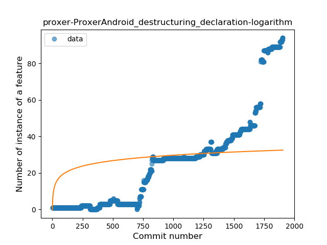

### <a name="inline_func">Inline Function</a>
----
#### Functions
* **Sudden Rise - Exponential:** 
    * **R_Squared:** 0.9293949
* **Constant Rise - Linear:** 
    * **R_Squared:** 0.91026433
* **Sudden Rise Plateau - Logarithm:** 
    * **R_Squared:** 0.32982311

**Plots** :chart_with_upwards_trend:
-----

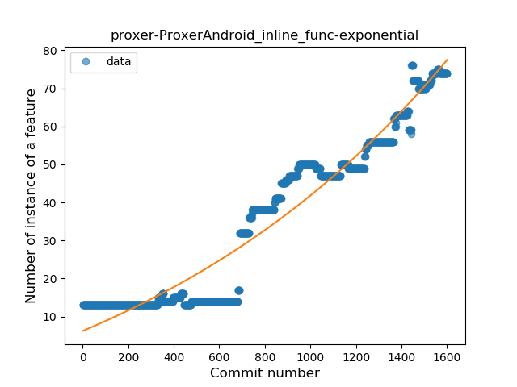
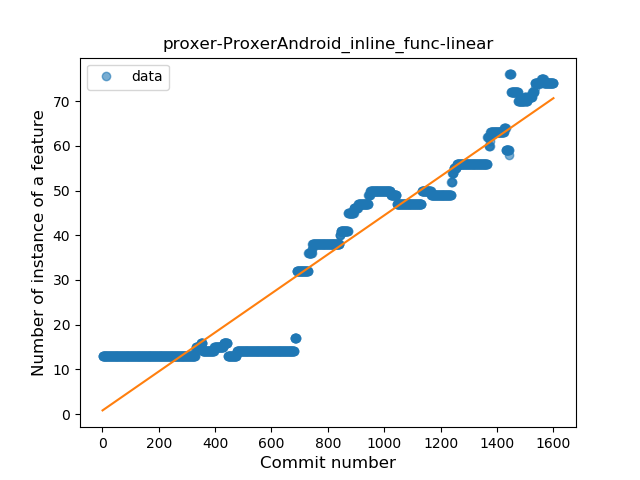
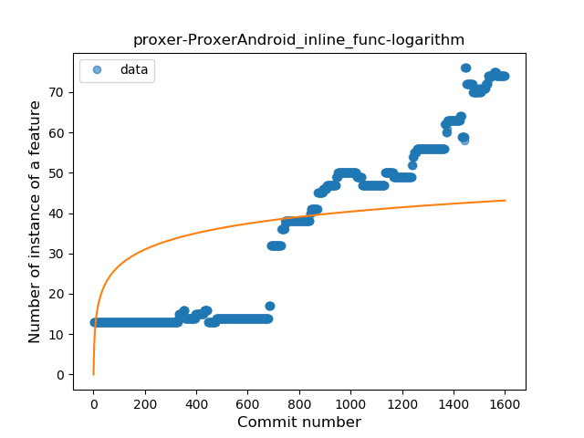
### <a name="overloaded_op">Overloaded Operator</a>
----
#### Functions
* **Sudden Decline - Exponential:** 
    * **R_Squared:** 0.35733178
* **Constant Decline - Linear:** 
    * **R_Squared:** 0.29771641
* **Sudden Rise Plateau - Logarithm:** 
    * **R_Squared:** -0.0

**Plots** :chart_with_upwards_trend:
-----

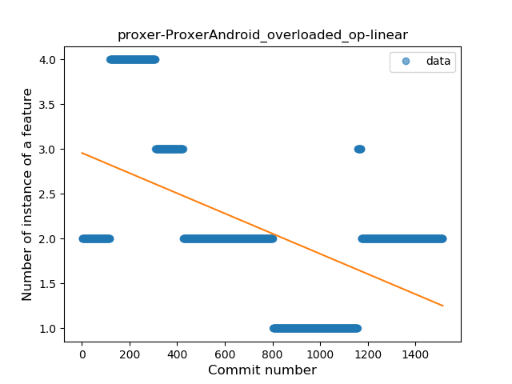
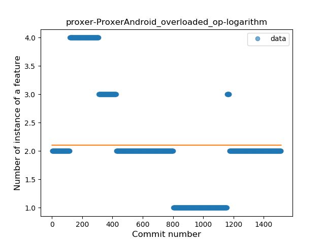
