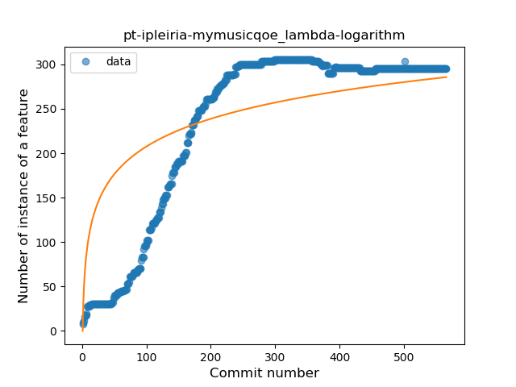
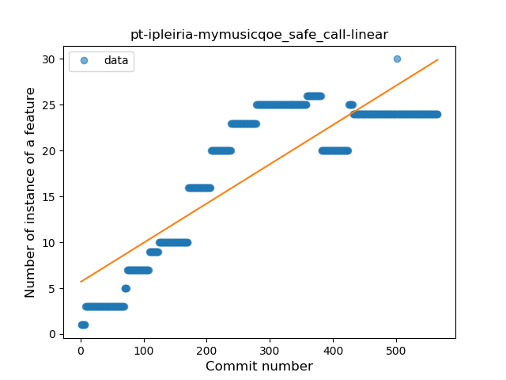
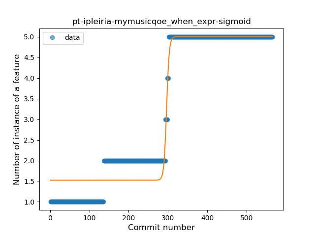
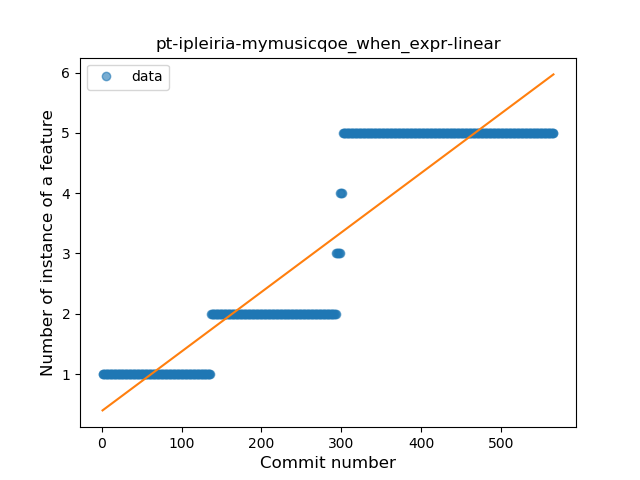
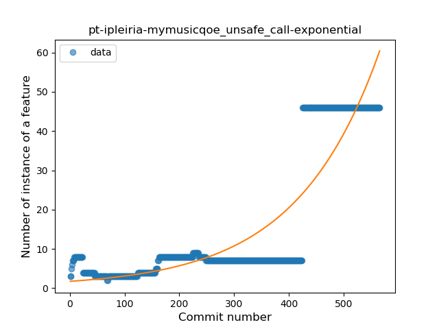
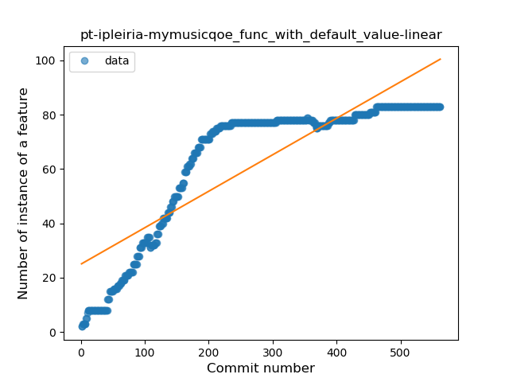
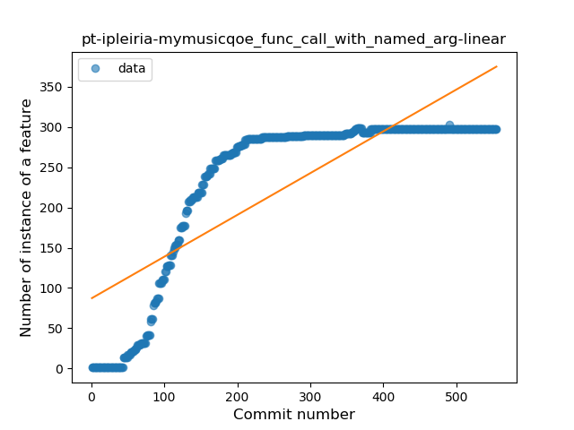
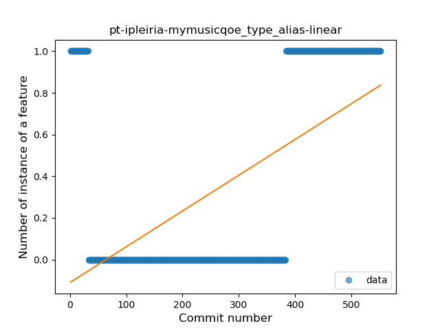

## pt-ipleiria-mymusicqoe
----
#### Metrics provided by Detekt
* Number of lines of code 8057
* Number of Kotlin files: 187
* Cyclomatic complexity: 690
* Cyclomatic complexity by thousands of lines: 160 

----
**15** features analyzed

*	<a href="#type_inference">Type Inference</a> 
*	<a href="#lambda">Lambda</a> 
*	<a href="#safe_call">Safe Call</a> 
*	<a href="#when_expr">When expression</a> 
*	<a href="#unsafe_call">Unsafe Call</a> 
*	<a href="#companion_object">Companion Object</a> 
*	<a href="#string_template">String Template</a> 
*	<a href="#func_with_default_value">Function with Default Value</a> 
*	<a href="#range_expr">Range Expression</a> 
*	<a href="#data_class">Data Class</a> 
*	<a href="#func_call_with_named_arg">Function call with Named Argument</a> 
*	<a href="#extension_function">Extension Function</a> 
*	<a href="#property_delegation">Property Delegation</a> 
*	<a href="#overloaded_op">Overloaded Operator</a> 
*	<a href="#type_alias">Type Alias</a> 

### <a name="type_inference">Type Inference</a>
----
#### Functions
* **Constant Rise - Linear:** 
    * **R_Squared:** 0.90146255
* **Plateau Sudden Rise - Binary Sigmoid:** 
    * **R_Squared:** 0.71700541
* **Sudden Rise Plateau - Logarithm:** 
    * **R_Squared:** 0.57355288

**Plots** :chart_with_upwards_trend:
-----

### <a name="lambda">Lambda</a>
----
#### Functions
* **Constant Rise - Linear:** 
    * **R_Squared:** 0.67859853
* **Sudden Rise Plateau - Logarithm:** 
    * **R_Squared:** 0.59986103
* **Plateau Sudden Rise - Binary Sigmoid:** 
    * **R_Squared:** 0.2108037

**Plots** :chart_with_upwards_trend:
-----

### <a name="safe_call">Safe Call</a>
----
#### Functions
* **Constant Rise - Linear:** 
    * **R_Squared:** 0.74375336
* **Sudden Rise Plateau - Logarithm:** 
    * **R_Squared:** 0.55850647

**Plots** :chart_with_upwards_trend:
-----

### <a name="when_expr">When expression</a>
----
#### Functions
* **Plateau Gradual Rise - Sigmoid:** 
    * **R_Squared:** 0.95826605
* **Constant Rise - Linear:** 
    * **R_Squared:** 0.84260353
* **Sudden Rise Plateau - Logarithm:** 
    * **R_Squared:** 0.4161304

**Plots** :chart_with_upwards_trend:
-----

### <a name="unsafe_call">Unsafe Call</a>
----
#### Functions
* **Sudden Rise - Exponential:** 
    * **R_Squared:** 0.78843974
* **Constant Rise - Linear:** 
    * **R_Squared:** 0.61411108
* **Sudden Rise Plateau - Logarithm:** 
    * **R_Squared:** 0.15941244
* **Plateau Sudden Rise - Binary Sigmoid:** 
    * **R_Squared:** 0.00583909

**Plots** :chart_with_upwards_trend:
-----

### <a name="companion_object">Companion Object</a>
----
#### Functions
* **Constant Rise - Linear:** 
    * **R_Squared:** 0.05604612
* **Sudden Rise - Exponential:** 
    * **R_Squared:** 0.05626952
* **Sudden Rise Plateau - Logarithm:** 
    * **R_Squared:** 0.03055029
* **Plateau Gradual Rise - Sigmoid:** 
    * **R_Squared:** 0.00339946

**Plots** :chart_with_upwards_trend:
-----

### <a name="string_template">String Template</a>
----
#### Functions
* **Plateau Sudden Rise - Binary Sigmoid:** 
    * **R_Squared:** 0.7885409
* **Constant Rise - Linear:** 
    * **R_Squared:** 0.70784181
* **Sudden Rise Plateau - Logarithm:** 
    * **R_Squared:** 0.60130603

**Plots** :chart_with_upwards_trend:
-----

### <a name="func_with_default_value">Function with Default Value</a>
----
#### Functions
* **Constant Rise - Linear:** 
    * **R_Squared:** 0.74134459
* **Sudden Rise Plateau - Logarithm:** 
    * **R_Squared:** 0.64626918

**Plots** :chart_with_upwards_trend:
-----

### <a name="range_expr">Range Expression</a>
----
#### Functions
* **Plateau Sudden Rise - Binary Sigmoid:** 
    * **R_Squared:** 1.0
* **Sudden Rise Plateau - Logarithm:** 
    * **R_Squared:** 0.63670398
* **Constant Rise - Linear:** 
    * **R_Squared:** 0.60119048

**Plots** :chart_with_upwards_trend:
-----

### <a name="data_class">Data Class</a>
----
#### Functions
* **Constant Rise - Linear:** 
    * **R_Squared:** 0.90567989
* **Sudden Rise Plateau - Logarithm:** 
    * **R_Squared:** 0.70194125

**Plots** :chart_with_upwards_trend:
-----

### <a name="func_call_with_named_arg">Function call with Named Argument</a>
----
#### Functions
* **Constant Rise - Linear:** 
    * **R_Squared:** 0.65609941
* **Sudden Rise Plateau - Logarithm:** 
    * **R_Squared:** 0.59051977
* **Plateau Sudden Rise - Binary Sigmoid:** 
    * **R_Squared:** 0.18192415

**Plots** :chart_with_upwards_trend:
-----

### <a name="extension_function">Extension Function</a>
----
#### Functions
* **Plateau Gradual Rise - Sigmoid:** 
    * **R_Squared:** 0.75605695
* **Sudden Rise Plateau - Logarithm:** 
    * **R_Squared:** 0.58862307
* **Constant Rise - Linear:** 
    * **R_Squared:** 0.41388069

**Plots** :chart_with_upwards_trend:
-----

### <a name="property_delegation">Property Delegation</a>
----
#### Functions
* **Sudden Rise Plateau - Logarithm:** 
    * **R_Squared:** 0.68189458
* **Constant Rise - Linear:** 
    * **R_Squared:** 0.5162168

**Plots** :chart_with_upwards_trend:
-----

### <a name="overloaded_op">Overloaded Operator</a>
----
#### Functions
* **Plateau Sudden Rise - Binary Sigmoid:** 
    * **R_Squared:** 1.0
* **Constant Rise - Linear:** 
    * **R_Squared:** 0.74838155
* **Sudden Rise - Exponential:** 
    * **R_Squared:** 0.75018434
* **Sudden Rise Plateau - Logarithm:** 
    * **R_Squared:** 0.31334552

**Plots** :chart_with_upwards_trend:
-----

### <a name="type_alias">Type Alias</a>
----
#### Functions
* **Sudden Rise - Exponential:** 
    * **R_Squared:** 0.52105579
* **Constant Rise - Linear:** 
    * **R_Squared:** 0.32269833
* **Plateau Sudden Decline - Binary Sigmoid:** 
    * **R_Squared:** 0.10746268
* **Sudden Rise Plateau - Logarithm:** 
    * **R_Squared:** 0.03457555

**Plots** :chart_with_upwards_trend:
-----

