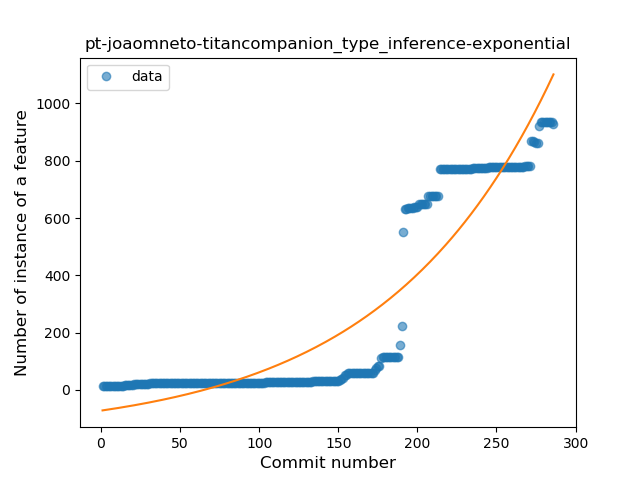
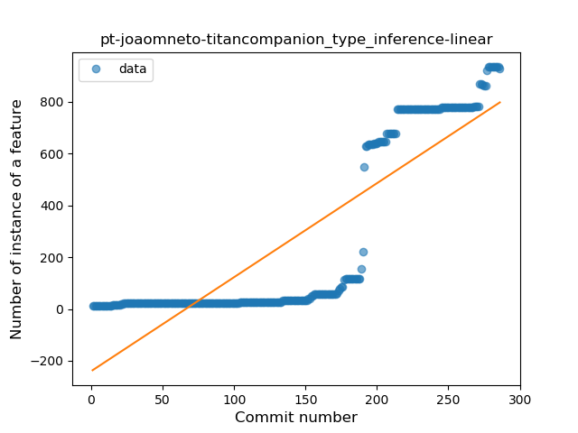
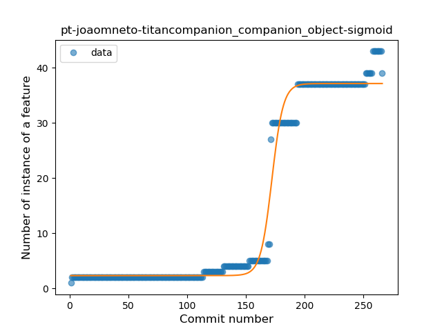
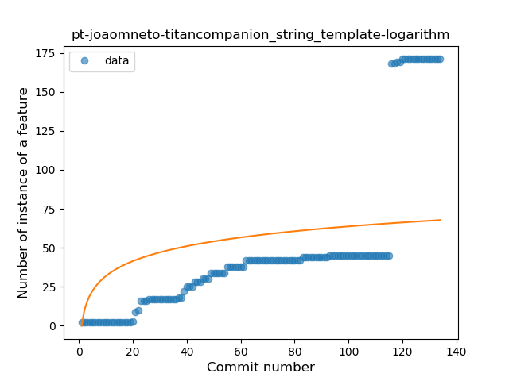
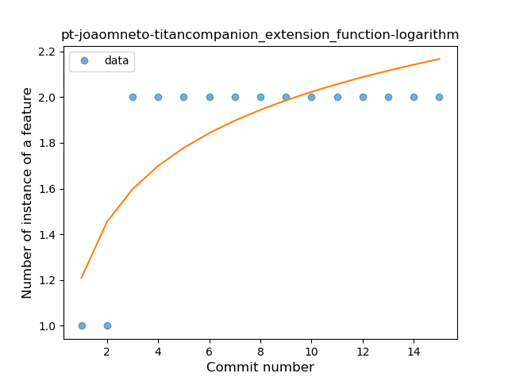

## pt-joaomneto-titancompanion
----
#### Metrics provided by Detekt
* Number of lines of code 14074
* Number of Kotlin files: 227
* Cyclomatic complexity: 1189
* Cyclomatic complexity by thousands of lines: 153 

----
**13** features analyzed

*	<a href="#type_inference">Type Inference</a> 
*	<a href="#lambda">Lambda</a> 
*	<a href="#safe_call">Safe Call</a> 
*	<a href="#when_expr">When expression</a> 
*	<a href="#unsafe_call">Unsafe Call</a> 
*	<a href="#companion_object">Companion Object</a> 
*	<a href="#string_template">String Template</a> 
*	<a href="#func_with_default_value">Function with Default Value</a> 
*	<a href="#singleton">Singleton</a> 
*	<a href="#range_expr">Range Expression</a> 
*	<a href="#func_call_with_named_arg">Function call with Named Argument</a> 
*	<a href="#extension_function">Extension Function</a> 
*	<a href="#inline_func">Inline Function</a> 

### <a name="type_inference">Type Inference</a>
----
#### Functions
* **Sudden Rise - Exponential:** 
    * **R_Squared:** 0.8545685
* **Constant Rise - Linear:** 
    * **R_Squared:** 0.73720914
* **Sudden Rise Plateau - Logarithm:** 
    * **R_Squared:** 0.18653337

**Plots** :chart_with_upwards_trend:
-----

### <a name="lambda">Lambda</a>
----
#### Functions
* **Sudden Rise - Exponential:** 
    * **R_Squared:** 0.91242193
* **Constant Rise - Linear:** 
    * **R_Squared:** 0.78860524
* **Sudden Rise Plateau - Logarithm:** 
    * **R_Squared:** 0.24247534
* **Plateau Sudden Rise - Binary Sigmoid:** 
    * **R_Squared:** 0.21890541

**Plots** :chart_with_upwards_trend:
-----

### <a name="safe_call">Safe Call</a>
----
#### Functions
* **Plateau Gradual Rise - Sigmoid:** 
    * **R_Squared:** 0.89844481
* **Sudden Rise - Exponential:** 
    * **R_Squared:** 0.82575534
* **Constant Rise - Linear:** 
    * **R_Squared:** 0.7616858
* **Sudden Rise Plateau - Logarithm:** 
    * **R_Squared:** 0.21711174

**Plots** :chart_with_upwards_trend:
-----

### <a name="when_expr">When expression</a>
----
#### Functions
* **Constant Rise - Linear:** 
    * **R_Squared:** 0.7051811
* **Sudden Rise Plateau - Logarithm:** 
    * **R_Squared:** 0.56241736

**Plots** :chart_with_upwards_trend:
-----

### <a name="unsafe_call">Unsafe Call</a>
----
#### Functions
* **Sudden Rise - Exponential:** 
    * **R_Squared:** 0.82539538
* **Constant Rise - Linear:** 
    * **R_Squared:** 0.71400023
* **Sudden Rise Plateau - Logarithm:** 
    * **R_Squared:** 0.19373984
* **Plateau Sudden Rise - Binary Sigmoid:** 
    * **R_Squared:** 0.12281644

**Plots** :chart_with_upwards_trend:
-----

### <a name="companion_object">Companion Object</a>
----
#### Functions
* **Plateau Gradual Rise - Sigmoid:** 
    * **R_Squared:** 0.98003051
* **Sudden Rise - Exponential:** 
    * **R_Squared:** 0.84633478
* **Constant Rise - Linear:** 
    * **R_Squared:** 0.7599219
* **Sudden Rise Plateau - Logarithm:** 
    * **R_Squared:** 0.21545365

**Plots** :chart_with_upwards_trend:
-----

### <a name="string_template">String Template</a>
----
#### Functions
* **Instability - Polinomial 3:** )
    * **R_Squared:** 0.85062945
* **Sudden Rise - Exponential:** 
    * **R_Squared:** 0.83520571
* **Constant Rise - Linear:** 
    * **R_Squared:** 0.63229926
* **Sudden Rise Plateau - Logarithm:** 
    * **R_Squared:** 0.24196528
* **Plateau Gradual Rise - Sigmoid:** 
    * **R_Squared:** 0.23514849

**Plots** :chart_with_upwards_trend:
-----

### <a name="func_with_default_value">Function with Default Value</a>
----
#### Functions
* **Sudden Rise - Exponential:** 
    * **R_Squared:** 0.85313458
* **Constant Rise - Linear:** 
    * **R_Squared:** 0.83987144
* **Sudden Rise Plateau - Logarithm:** 
    * **R_Squared:** 0.71216001

**Plots** :chart_with_upwards_trend:
-----

### <a name="singleton">Singleton</a>
----
#### Functions
* **Plateau Sudden Rise - Binary Sigmoid:** 
    * **R_Squared:** 0.89087794
* **Sudden Rise - Exponential:** 
    * **R_Squared:** 0.84530103
* **Constant Rise - Linear:** 
    * **R_Squared:** 0.5447678
* **Sudden Rise Plateau - Logarithm:** 
    * **R_Squared:** 0.24559693

**Plots** :chart_with_upwards_trend:
-----

### <a name="range_expr">Range Expression</a>
----
#### Functions
* **Plateau Sudden Rise - Binary Sigmoid:** 
    * **R_Squared:** 0.79144776
* **Constant Rise - Linear:** 
    * **R_Squared:** 0.41516824
* **Sudden Rise Plateau - Logarithm:** 
    * **R_Squared:** 0.16405061

**Plots** :chart_with_upwards_trend:
-----

### <a name="func_call_with_named_arg">Function call with Named Argument</a>
----
#### Functions
* **Plateau Gradual Rise - Sigmoid:** 
    * **R_Squared:** 0.86074973
* **Instability - Polinomial 3:** )
    * **R_Squared:** 0.83664511
* **Sudden Rise - Exponential:** 
    * **R_Squared:** 0.81227864
* **Constant Rise - Linear:** 
    * **R_Squared:** 0.57298278
* **Sudden Rise Plateau - Logarithm:** 
    * **R_Squared:** 0.30511075

**Plots** :chart_with_upwards_trend:
-----

### <a name="extension_function">Extension Function</a>
----
#### Functions
* **Plateau Sudden Rise - Binary Sigmoid:** 
    * **R_Squared:** 1.0
* **Instability - Polinomial 4:** 
    * **R_Squared:** 0.85201976
* **Instability - Polinomial 3:** )
    * **R_Squared:** 0.82282913
* **Sudden Rise Plateau - Logarithm:** 
    * **R_Squared:** 0.61739235
* **Constant Rise - Linear:** 
    * **R_Squared:** 0.34821429

**Plots** :chart_with_upwards_trend:
-----

### <a name="inline_func">Inline Function</a>
----
#### Functions
* **Constant Rise - Linear:** 
    * **R_Squared:** 0.73097597
* **Sudden Rise - Exponential:** 
    * **R_Squared:** 0.73128099
* **Sudden Rise Plateau - Logarithm:** 
    * **R_Squared:** 0.66067043

**Plots** :chart_with_upwards_trend:
-----

