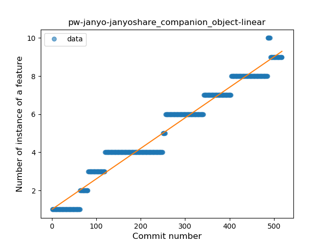
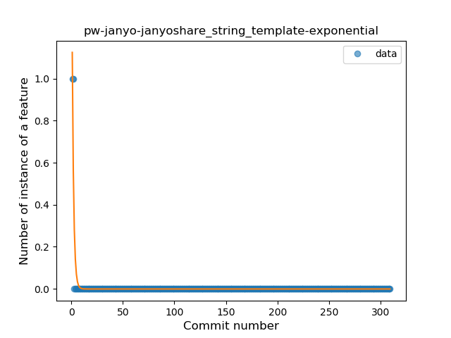
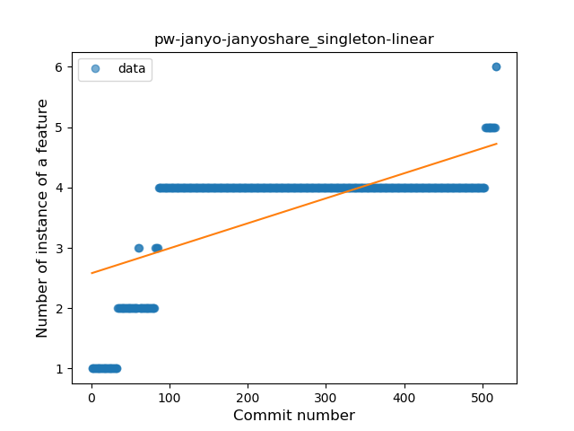
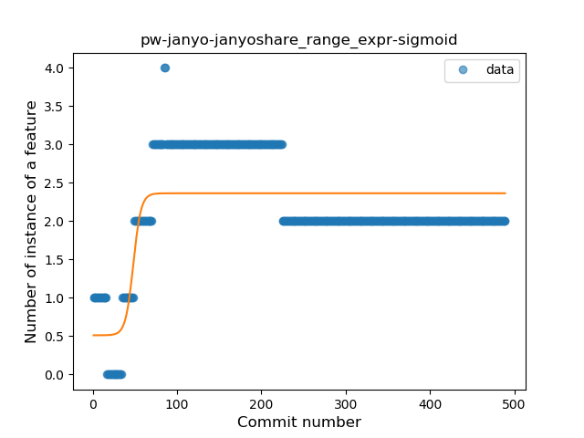
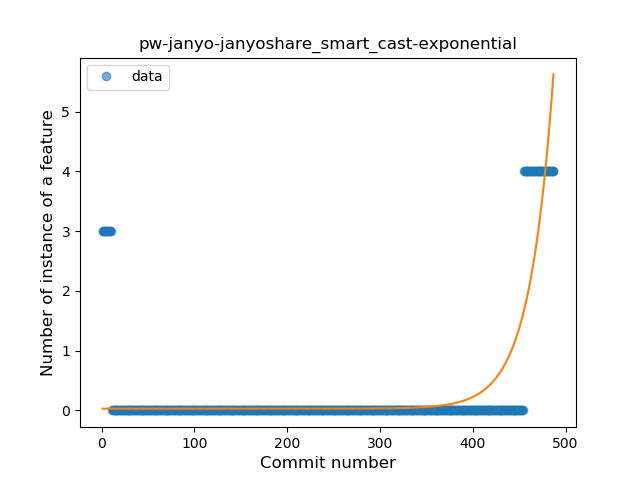

## pw-janyo-janyoshare
----
#### Metrics provided by Detekt
* Number of lines of code 4922
* Number of Kotlin files: 58
* Cyclomatic complexity: 639
* Cyclomatic complexity by thousands of lines: 198 

----
**11** features analyzed

*	<a href="#type_inference">Type Inference</a> 
*	<a href="#lambda">Lambda</a> 
*	<a href="#safe_call">Safe Call</a> 
*	<a href="#when_expr">When expression</a> 
*	<a href="#unsafe_call">Unsafe Call</a> 
*	<a href="#companion_object">Companion Object</a> 
*	<a href="#string_template">String Template</a> 
*	<a href="#singleton">Singleton</a> 
*	<a href="#range_expr">Range Expression</a> 
*	<a href="#smart_cast">Smart Cast</a> 
*	<a href="#data_class">Data Class</a> 

### <a name="type_inference">Type Inference</a>
----
#### Functions
* **Constant Rise - Linear:** 
    * **R_Squared:** 0.89048265
* **Sudden Rise Plateau - Logarithm:** 
    * **R_Squared:** 0.73877043
* **Plateau Sudden Rise - Binary Sigmoid:** 
    * **R_Squared:** 0.66872151

**Plots** :chart_with_upwards_trend:
-----

### <a name="lambda">Lambda</a>
----
#### Functions
* **Constant Rise - Linear:** 
    * **R_Squared:** 0.91126196
* **Sudden Rise Plateau - Logarithm:** 
    * **R_Squared:** 0.66004645
* **Plateau Gradual Rise - Sigmoid:** 
    * **R_Squared:** 0.42312202

**Plots** :chart_with_upwards_trend:
-----

### <a name="safe_call">Safe Call</a>
----
#### Functions
* **Sudden Rise - Exponential:** 
    * **R_Squared:** 0.86473068
* **Constant Rise - Linear:** 
    * **R_Squared:** 0.11638689
* **Sudden Rise Plateau - Logarithm:** 
    * **R_Squared:** 0.04513622

**Plots** :chart_with_upwards_trend:
-----

### <a name="when_expr">When expression</a>
----
#### Functions
* **Sudden Rise Plateau - Logarithm:** 
    * **R_Squared:** 0.84610079
* **Constant Rise - Linear:** 
    * **R_Squared:** 0.83402429

**Plots** :chart_with_upwards_trend:
-----

### <a name="unsafe_call">Unsafe Call</a>
----
#### Functions
* **Constant Decline - Linear:** 
    * **R_Squared:** 0.10605217
* **Sudden Rise Plateau - Logarithm:** 
    * **R_Squared:** -0.0

**Plots** :chart_with_upwards_trend:
-----

### <a name="companion_object">Companion Object</a>
----
#### Functions
* **Constant Rise - Linear:** 
    * **R_Squared:** 0.96073097
* **Sudden Rise Plateau - Logarithm:** 
    * **R_Squared:** 0.54572807

**Plots** :chart_with_upwards_trend:
-----

### <a name="string_template">String Template</a>
----
#### Functions
* **Sudden Decline - Exponential:** 
    * **R_Squared:** 0.84283555
* **Constant Decline - Linear:** 
    * **R_Squared:** 0.019292
* **Sudden Rise Plateau - Logarithm:** 
    * **R_Squared:** -0.0

**Plots** :chart_with_upwards_trend:
-----

### <a name="singleton">Singleton</a>
----
#### Functions
* **Plateau Gradual Rise - Sigmoid:** 
    * **R_Squared:** 0.90613039
* **Sudden Rise Plateau - Logarithm:** 
    * **R_Squared:** 0.71949415
* **Constant Rise - Linear:** 
    * **R_Squared:** 0.44644383

**Plots** :chart_with_upwards_trend:
-----

### <a name="range_expr">Range Expression</a>
----
#### Functions
* **Plateau Gradual Rise - Sigmoid:** 
    * **R_Squared:** 0.53694188
* **Sudden Rise Plateau - Logarithm:** 
    * **R_Squared:** 0.09426154
* **Constant Decline - Linear:** 
    * **R_Squared:** 0.00026694
* **Sudden Decline - Exponential:** 
    * **R_Squared:** 0.00025615

**Plots** :chart_with_upwards_trend:
-----

### <a name="smart_cast">Smart Cast</a>
----
#### Functions
* **Sudden Rise - Exponential:** 
    * **R_Squared:** 0.66755666
* **Plateau Sudden Decline - Binary Sigmoid:** 
    * **R_Squared:** 0.12876756
* **Constant Rise - Linear:** 
    * **R_Squared:** 0.09581736
* **Sudden Rise Plateau - Logarithm:** 
    * **R_Squared:** 0.00096829

**Plots** :chart_with_upwards_trend:
-----

### <a name="data_class">Data Class</a>
----
#### Functions
* **Plateau Sudden Rise - Binary Sigmoid:** 
    * **R_Squared:** 1.0
* **Sudden Rise Plateau - Logarithm:** 
    * **R_Squared:** 0.48065873
* **Constant Rise - Linear:** 
    * **R_Squared:** 0.15992084

**Plots** :chart_with_upwards_trend:
-----

