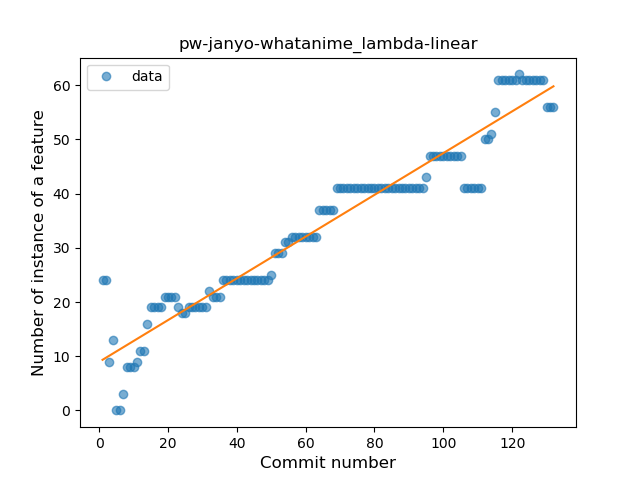
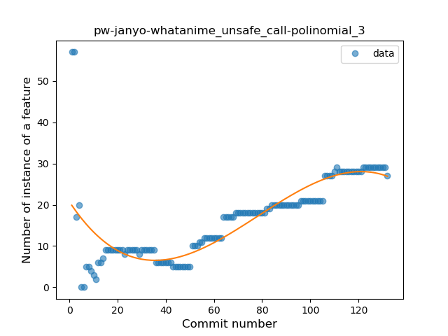
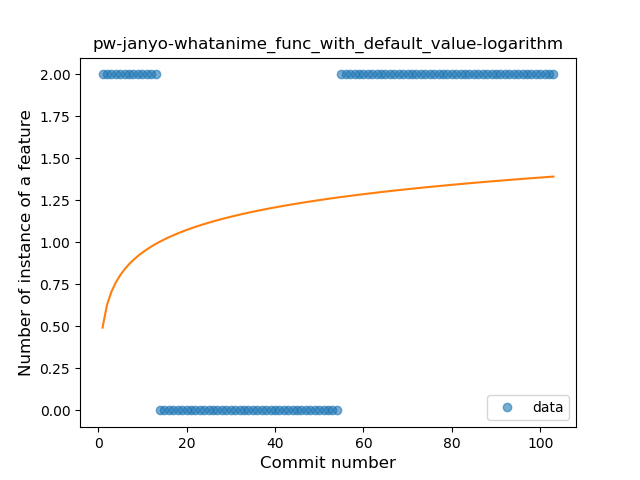
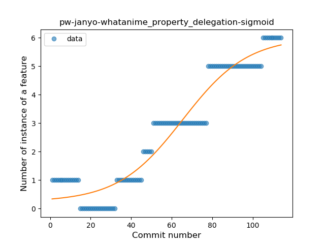

## pw-janyo-whatanime
----
#### Metrics provided by Detekt
* Number of lines of code 1613
* Number of Kotlin files: 34
* Cyclomatic complexity: 199
* Cyclomatic complexity by thousands of lines: 226 

----
**13** features analyzed

*	<a href="#type_inference">Type Inference</a> 
*	<a href="#lambda">Lambda</a> 
*	<a href="#safe_call">Safe Call</a> 
*	<a href="#when_expr">When expression</a> 
*	<a href="#unsafe_call">Unsafe Call</a> 
*	<a href="#companion_object">Companion Object</a> 
*	<a href="#string_template">String Template</a> 
*	<a href="#func_with_default_value">Function with Default Value</a> 
*	<a href="#singleton">Singleton</a> 
*	<a href="#smart_cast">Smart Cast</a> 
*	<a href="#property_delegation">Property Delegation</a> 
*	<a href="#inline_func">Inline Function</a> 
*	<a href="#coroutine">Coroutine</a> 

### <a name="type_inference">Type Inference</a>
----
#### Functions
* **Constant Rise - Linear:** 
    * **R_Squared:** 0.62711309
* **Sudden Rise Plateau - Logarithm:** 
    * **R_Squared:** 0.59540582

**Plots** :chart_with_upwards_trend:
-----

### <a name="lambda">Lambda</a>
----
#### Functions
* **Constant Rise - Linear:** 
    * **R_Squared:** 0.92384621
* **Sudden Rise - Exponential:** 
    * **R_Squared:** 0.92398359
* **Sudden Rise Plateau - Logarithm:** 
    * **R_Squared:** 0.62132722

**Plots** :chart_with_upwards_trend:
-----

### <a name="safe_call">Safe Call</a>
----
#### Functions
* **Sudden Rise - Exponential:** 
    * **R_Squared:** 0.83822532
* **Constant Rise - Linear:** 
    * **R_Squared:** 0.72347031
* **Sudden Rise Plateau - Logarithm:** 
    * **R_Squared:** 0.37287992

**Plots** :chart_with_upwards_trend:
-----

### <a name="when_expr">When expression</a>
----
#### Functions
* **Plateau Gradual Rise - Sigmoid:** 
    * **R_Squared:** 0.76207183
* **Sudden Rise Plateau - Logarithm:** 
    * **R_Squared:** 0.57364939
* **Constant Rise - Linear:** 
    * **R_Squared:** 0.51703979

**Plots** :chart_with_upwards_trend:
-----

### <a name="unsafe_call">Unsafe Call</a>
----
#### Functions
* **Instability - Polinomial 3:** )
    * **R_Squared:** 0.63861826
* **Sudden Rise - Exponential:** 
    * **R_Squared:** 0.50463594
* **Constant Rise - Linear:** 
    * **R_Squared:** 0.43854932
* **Sudden Rise Plateau - Logarithm:** 
    * **R_Squared:** 0.10976707

**Plots** :chart_with_upwards_trend:
-----

### <a name="companion_object">Companion Object</a>
----
#### Functions
* **Plateau Sudden Rise - Binary Sigmoid:** 
    * **R_Squared:** 0.2873909
* **Sudden Rise Plateau - Logarithm:** 
    * **R_Squared:** 0.11075408
* **Constant Rise - Linear:** 
    * **R_Squared:** 0.04018416

**Plots** :chart_with_upwards_trend:
-----

### <a name="string_template">String Template</a>
----
#### Functions
* **Plateau Gradual Rise - Sigmoid:** 
    * **R_Squared:** 0.93692955
* **Sudden Rise - Exponential:** 
    * **R_Squared:** 0.90672851
* **Constant Rise - Linear:** 
    * **R_Squared:** 0.86085796
* **Sudden Rise Plateau - Logarithm:** 
    * **R_Squared:** 0.42108689

**Plots** :chart_with_upwards_trend:
-----

### <a name="func_with_default_value">Function with Default Value</a>
----
#### Functions
* **Sudden Rise - Exponential:** 
    * **R_Squared:** 0.31491155
* **Constant Rise - Linear:** 
    * **R_Squared:** 0.24237338
* **Plateau Sudden Decline - Binary Sigmoid:** 
    * **R_Squared:** 0.09551971
* **Sudden Rise Plateau - Logarithm:** 
    * **R_Squared:** 0.03357538

**Plots** :chart_with_upwards_trend:
-----

### <a name="singleton">Singleton</a>
----
#### Functions
* **Sudden Rise Plateau - Logarithm:** 
    * **R_Squared:** 0.36052395
* **Constant Rise - Linear:** 
    * **R_Squared:** 0.0613425

**Plots** :chart_with_upwards_trend:
-----

### <a name="smart_cast">Smart Cast</a>
----
#### Functions
* **Constant Rise - Linear:** 
    * **R_Squared:** 0.49426804
* **Sudden Rise - Exponential:** 
    * **R_Squared:** 0.49917017
* **Sudden Rise Plateau - Logarithm:** 
    * **R_Squared:** 0.20418442

**Plots** :chart_with_upwards_trend:
-----

### <a name="property_delegation">Property Delegation</a>
----
#### Functions
* **Plateau Gradual Rise - Sigmoid:** 
    * **R_Squared:** 0.93067622
* **Sudden Rise - Exponential:** 
    * **R_Squared:** 0.90204498
* **Constant Rise - Linear:** 
    * **R_Squared:** 0.88526073
* **Sudden Rise Plateau - Logarithm:** 
    * **R_Squared:** 0.39657197

**Plots** :chart_with_upwards_trend:
-----

### <a name="inline_func">Inline Function</a>
----
#### Functions
* **Plateau Sudden Decline - Binary Sigmoid:** 
    * **R_Squared:** 1.0
* **Sudden Decline - Exponential:** 
    * **R_Squared:** 0.75315779
* **Constant Decline - Linear:** 
    * **R_Squared:** 0.72222222
* **Sudden Rise Plateau - Logarithm:** 
    * **R_Squared:** 0.0

**Plots** :chart_with_upwards_trend:
-----

### <a name="coroutine">Coroutine</a>
----
#### Functions
* **Instability - Polinomial 4:** 
    * **R_Squared:** 0.82438914
* **Instability - Polinomial 3:** )
    * **R_Squared:** 0.74011634
* **Constant Decline - Linear:** 
    * **R_Squared:** 0.02155425
* **Sudden Rise Plateau - Logarithm:** 
    * **R_Squared:** -0.0

**Plots** :chart_with_upwards_trend:
-----

