## pyamsoft-home-button
----
#### Metrics provided by Detekt
* Number of lines of code 597
* Number of Kotlin files: 11
* Cyclomatic complexity: 50
* Cyclomatic complexity by thousands of lines: 210 

----
**8** features analyzed

*	<a href="#type_inference">Type Inference</a> 
*	<a href="#lambda">Lambda</a> 
*	<a href="#safe_call">Safe Call</a> 
*	<a href="#when_expr">When expression</a> 
*	<a href="#companion_object">Companion Object</a> 
*	<a href="#unsafe_call">Unsafe Call</a> 
*	<a href="#smart_cast">Smart Cast</a> 
*	<a href="#property_delegation">Property Delegation</a> 

### <a name="type_inference">Type Inference</a>
----
#### Functions
* **Sudden Rise - Exponential:** 
    * **R_Squared:** 0.48560998
* **Constant Rise - Linear:** 
    * **R_Squared:** 0.3077237
* **Sudden Rise Plateau - Logarithm:** 
    * **R_Squared:** 0.14629572

**Plots** :chart_with_upwards_trend:
-----

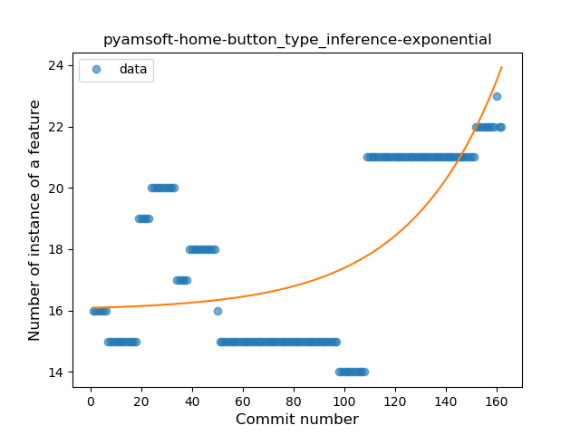

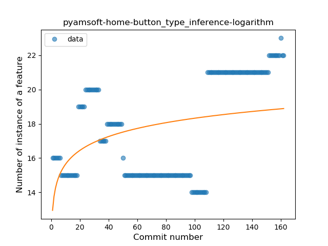
### <a name="lambda">Lambda</a>
----
#### Functions
* **Plateau Gradual Rise - Sigmoid:** 
    * **R_Squared:** 0.95132943
* **Constant Rise - Linear:** 
    * **R_Squared:** 0.86031555
* **Sudden Rise - Exponential:** 
    * **R_Squared:** 0.8658669
* **Sudden Rise Plateau - Logarithm:** 
    * **R_Squared:** 0.53066254

**Plots** :chart_with_upwards_trend:
-----

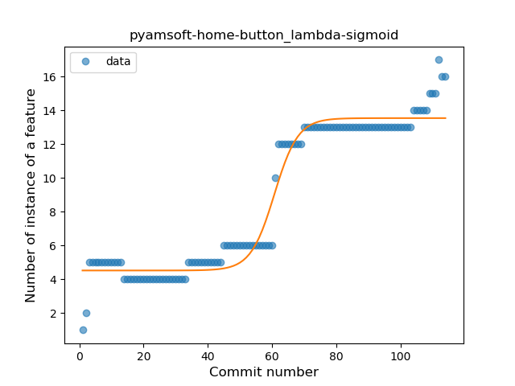
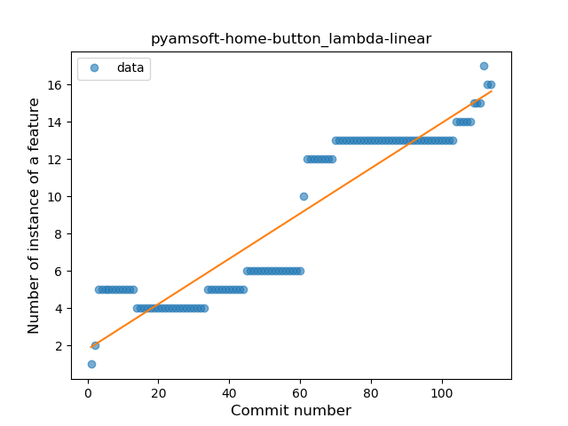
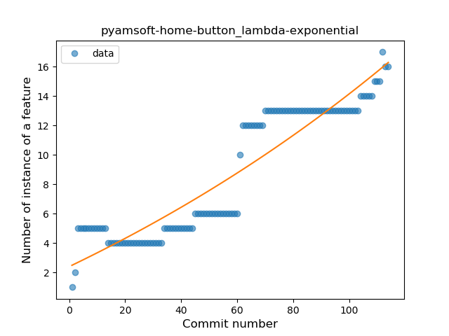

### <a name="safe_call">Safe Call</a>
----
#### Functions
* **Constant Rise - Linear:** 
    * **R_Squared:** 0.70096154
* **Sudden Rise Plateau - Logarithm:** 
    * **R_Squared:** 0.65591547

**Plots** :chart_with_upwards_trend:
-----

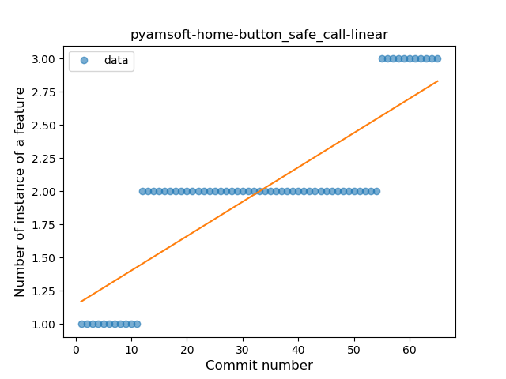
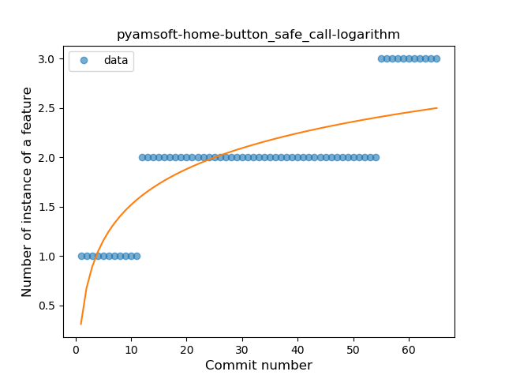
### <a name="when_expr">When expression</a>
----
#### Functions
* **Plateau Sudden Decline - Binary Sigmoid:** 
    * **R_Squared:** 1.0
* **Sudden Decline - Exponential:** 
    * **R_Squared:** 0.76207404
* **Constant Decline - Linear:** 
    * **R_Squared:** 0.64017071
* **Sudden Rise Plateau - Logarithm:** 
    * **R_Squared:** -0.0

**Plots** :chart_with_upwards_trend:
-----

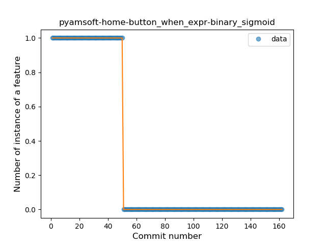
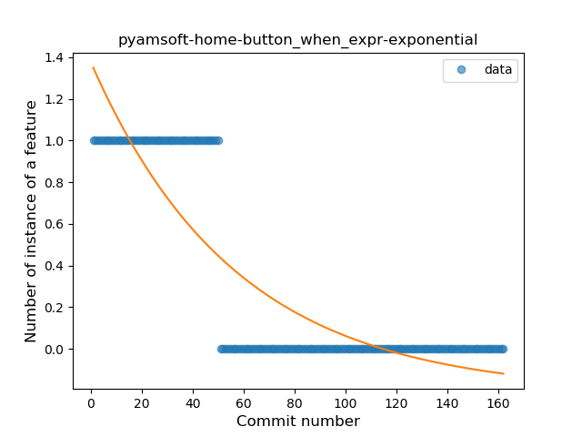
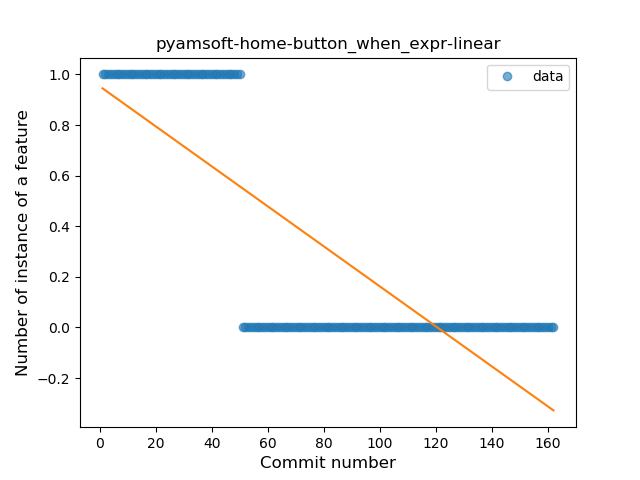
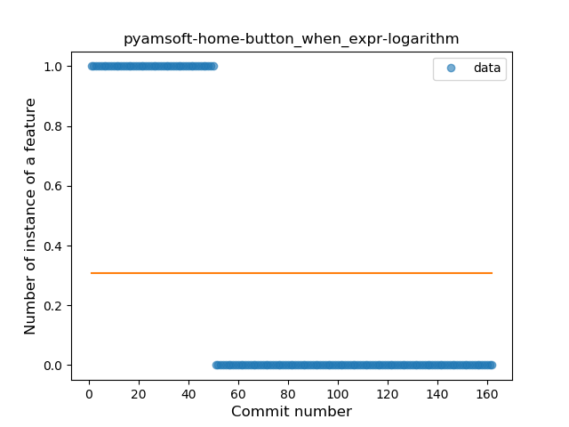
### <a name="companion_object">Companion Object</a>
----
#### Functions
* **Plateau Gradual Rise - Sigmoid:** 
    * **R_Squared:** 0.86960066
* **Constant Rise - Linear:** 
    * **R_Squared:** 0.84819314
* **Sudden Rise - Exponential:** 
    * **R_Squared:** 0.8581281
* **Sudden Rise Plateau - Logarithm:** 
    * **R_Squared:** 0.58744853

**Plots** :chart_with_upwards_trend:
-----

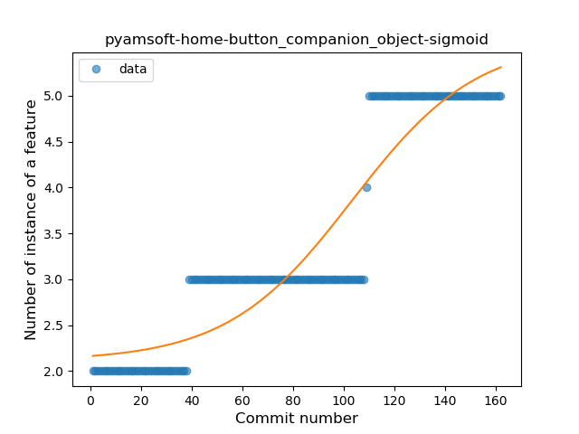
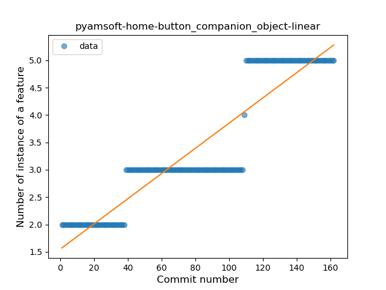
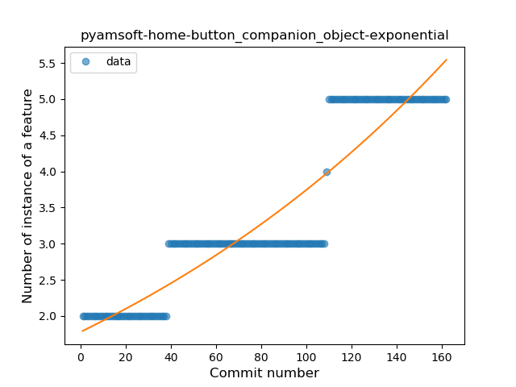
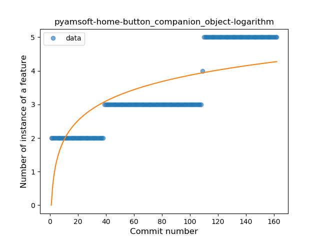
### <a name="unsafe_call">Unsafe Call</a>
----
#### Functions
* **Sudden Decline - Exponential:** 
    * **R_Squared:** 0.85818073
* **Constant Decline - Linear:** 
    * **R_Squared:** 0.7867999
* **Sudden Rise Plateau - Logarithm:** 
    * **R_Squared:** -0.0

**Plots** :chart_with_upwards_trend:
-----

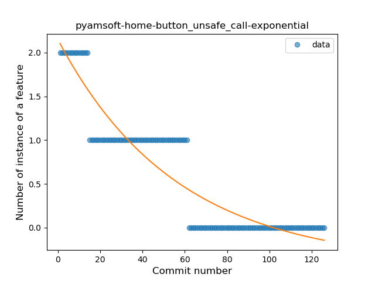
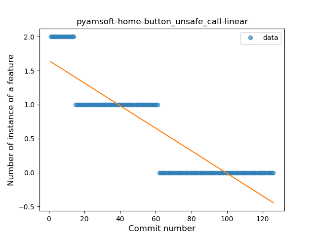
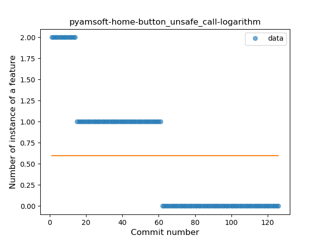
### <a name="smart_cast">Smart Cast</a>
----
#### Functions
* **Plateau Sudden Rise - Binary Sigmoid:** 
    * **R_Squared:** 0.45454545
* **Constant Rise - Linear:** 
    * **R_Squared:** 0.20982265
* **Sudden Rise - Exponential:** 
    * **R_Squared:** 0.20986979
* **Sudden Rise Plateau - Logarithm:** 
    * **R_Squared:** 0.13377625

**Plots** :chart_with_upwards_trend:
-----

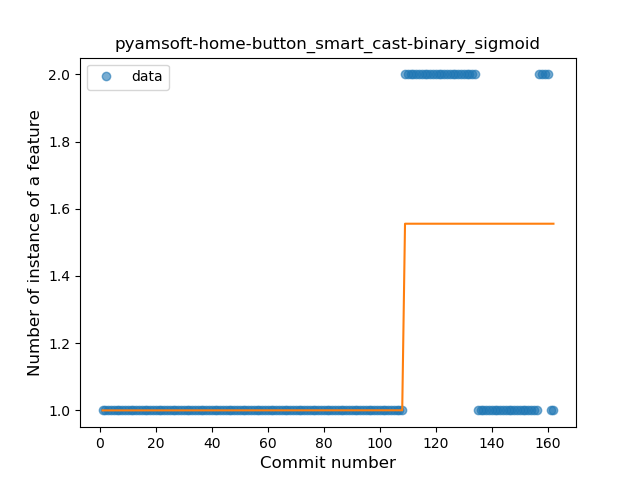
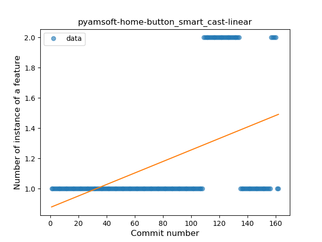

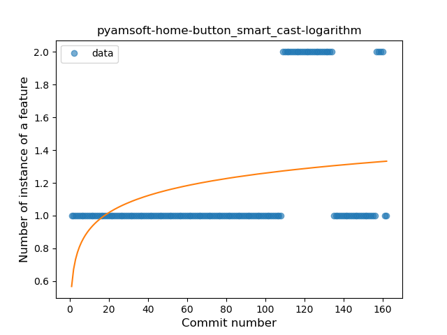
### <a name="property_delegation">Property Delegation</a>
----
#### Functions
* **Plateau Sudden Rise - Binary Sigmoid:** 
    * **R_Squared:** 1.0
* **Sudden Rise Plateau - Logarithm:** 
    * **R_Squared:** 0.66925659
* **Constant Rise - Linear:** 
    * **R_Squared:** 0.41680961

**Plots** :chart_with_upwards_trend:
-----

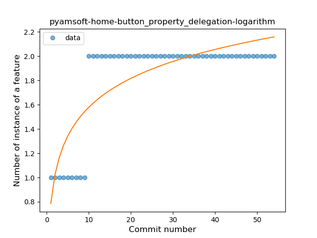
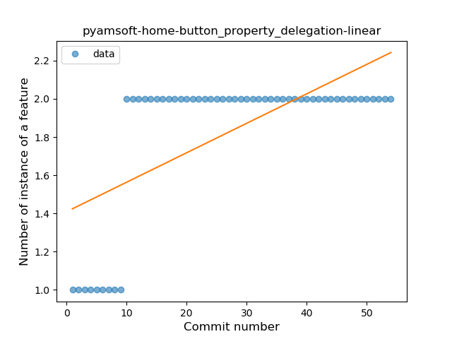
