## qklabs-qksms
----
#### Metrics provided by Detekt
* Number of lines of code 22511
* Number of Kotlin files: 301
* Cyclomatic complexity: 2195
* Cyclomatic complexity by thousands of lines: 253 

----
**16** features analyzed

*	<a href="#type_inference">Type Inference</a> 
*	<a href="#lambda">Lambda</a> 
*	<a href="#safe_call">Safe Call</a> 
*	<a href="#when_expr">When expression</a> 
*	<a href="#companion_object">Companion Object</a> 
*	<a href="#unsafe_call">Unsafe Call</a> 
*	<a href="#string_template">String Template</a> 
*	<a href="#func_with_default_value">Function with Default Value</a> 
*	<a href="#singleton">Singleton</a> 
*	<a href="#smart_cast">Smart Cast</a> 
*	<a href="#range_expr">Range Expression</a> 
*	<a href="#func_call_with_named_arg">Function call with Named Argument</a> 
*	<a href="#data_class">Data Class</a> 
*	<a href="#extension_function">Extension Function</a> 
*	<a href="#property_delegation">Property Delegation</a> 
*	<a href="#destructuring_declaration">Destructuring Declaration</a> 

### <a name="type_inference">Type Inference</a>
----
#### Functions
* **Constant Rise - Linear:** 
    * **R_Squared:** 0.98884656
* **Sudden Rise - Exponential:** 
    * **R_Squared:** 0.98972256
* **Sudden Rise Plateau - Logarithm:** 
    * **R_Squared:** 0.42169557
* **Plateau Sudden Rise - Binary Sigmoid:** 
    * **R_Squared:** 0.40042537

**Plots** :chart_with_upwards_trend:
-----

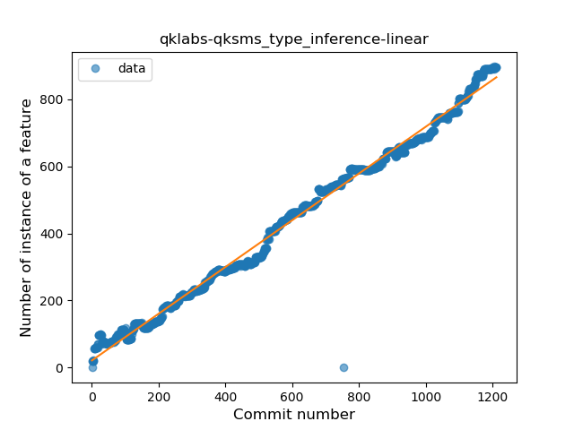
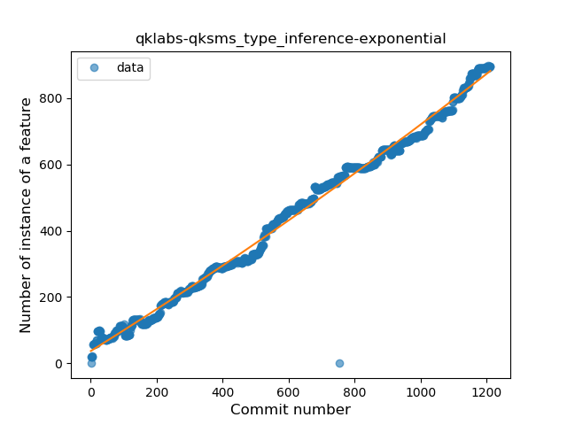

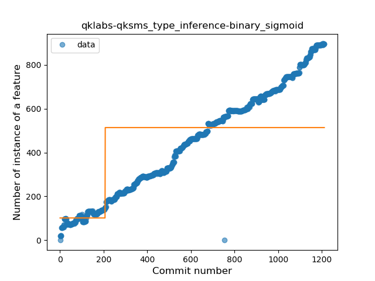
### <a name="lambda">Lambda</a>
----
#### Functions
* **Constant Rise - Linear:** 
    * **R_Squared:** 0.98238893
* **Sudden Rise Plateau - Logarithm:** 
    * **R_Squared:** 0.42429304
* **Plateau Sudden Rise - Binary Sigmoid:** 
    * **R_Squared:** 0.33090723

**Plots** :chart_with_upwards_trend:
-----

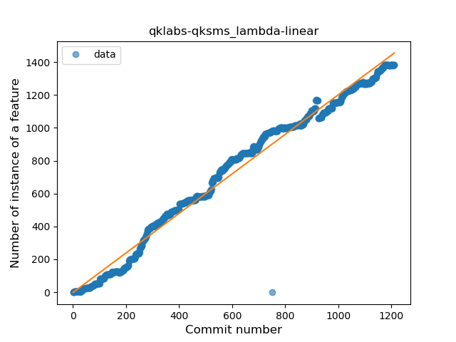

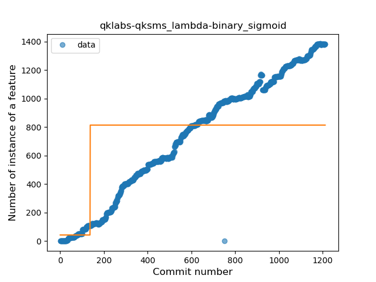
### <a name="safe_call">Safe Call</a>
----
#### Functions
* **Sudden Rise - Exponential:** 
    * **R_Squared:** 0.98212271
* **Constant Rise - Linear:** 
    * **R_Squared:** 0.92736442
* **Sudden Rise Plateau - Logarithm:** 
    * **R_Squared:** 0.29810476
* **Plateau Sudden Rise - Binary Sigmoid:** 
    * **R_Squared:** 0.19667725

**Plots** :chart_with_upwards_trend:
-----

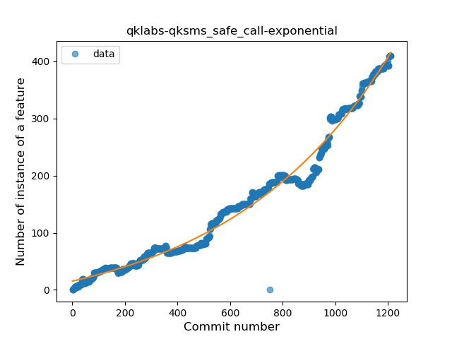
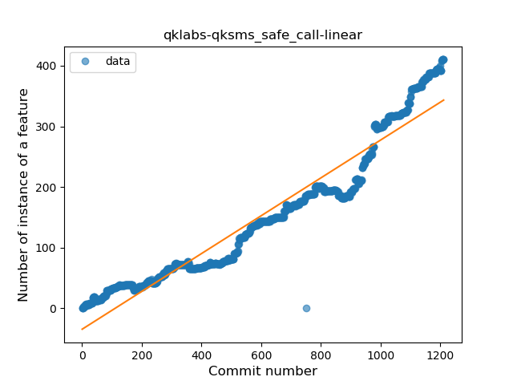
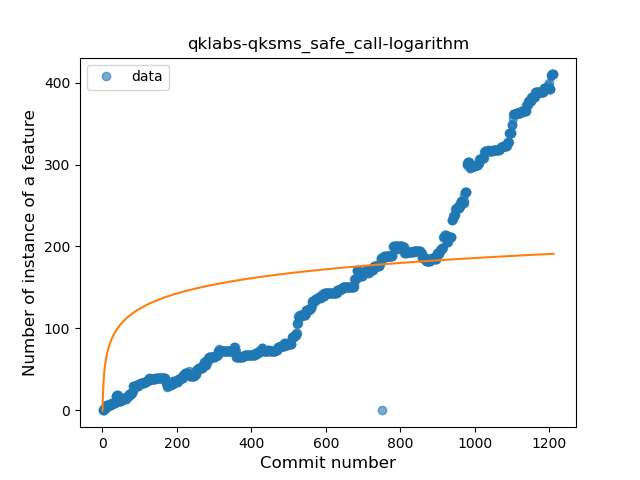

### <a name="when_expr">When expression</a>
----
#### Functions
* **Constant Rise - Linear:** 
    * **R_Squared:** 0.98098498
* **Sudden Rise - Exponential:** 
    * **R_Squared:** 0.98559875
* **Sudden Rise Plateau - Logarithm:** 
    * **R_Squared:** 0.37049929
* **Plateau Sudden Rise - Binary Sigmoid:** 
    * **R_Squared:** 0.10951793

**Plots** :chart_with_upwards_trend:
-----

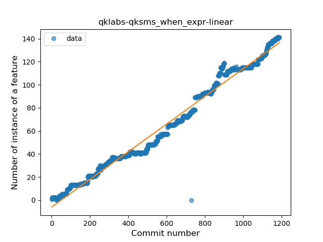
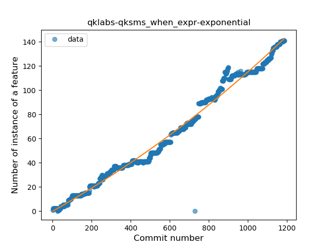
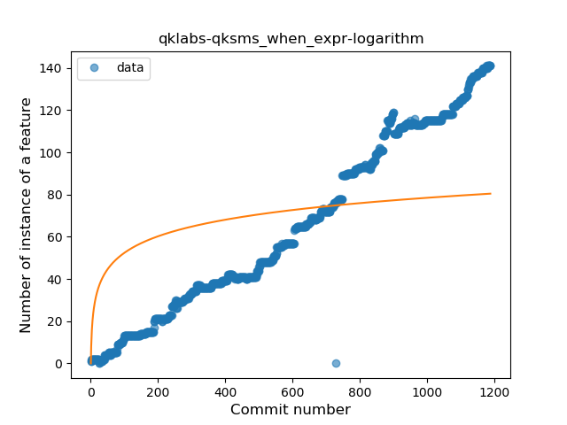
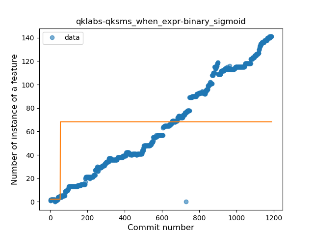
### <a name="companion_object">Companion Object</a>
----
#### Functions
* **Constant Rise - Linear:** 
    * **R_Squared:** 0.9387287
* **Sudden Rise Plateau - Logarithm:** 
    * **R_Squared:** 0.45724814

**Plots** :chart_with_upwards_trend:
-----

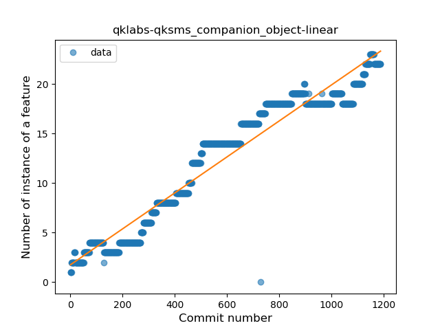
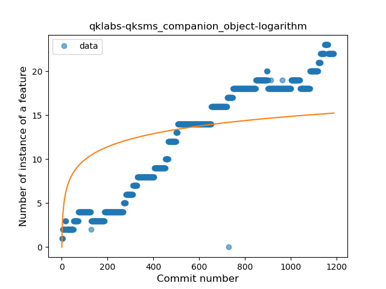
### <a name="unsafe_call">Unsafe Call</a>
----
#### Functions
* **Sudden Rise - Exponential:** 
    * **R_Squared:** 0.91120122
* **Constant Rise - Linear:** 
    * **R_Squared:** 0.46234128
* **Plateau Sudden Rise - Binary Sigmoid:** 
    * **R_Squared:** 0.3384357
* **Sudden Rise Plateau - Logarithm:** 
    * **R_Squared:** 0.13919122

**Plots** :chart_with_upwards_trend:
-----

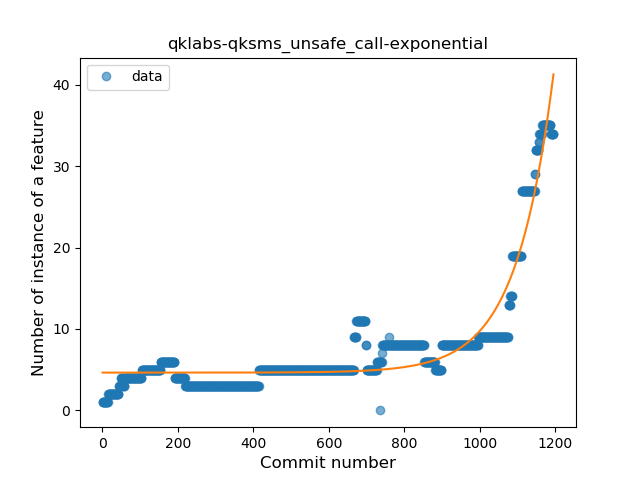
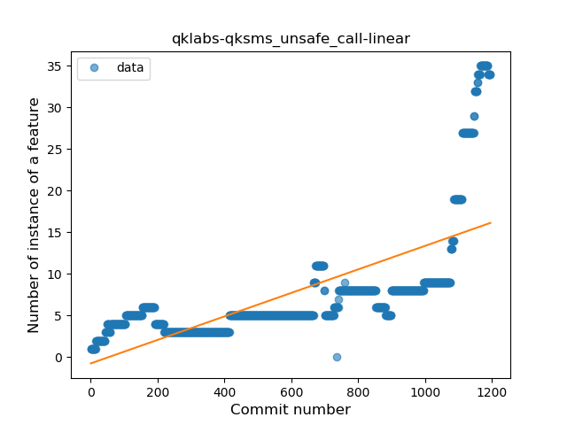
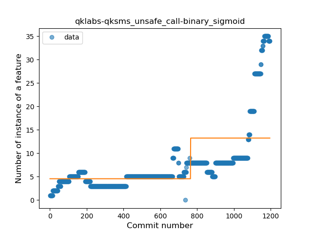
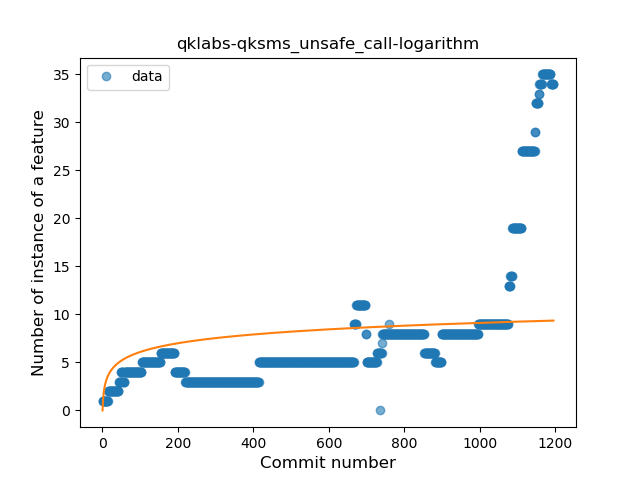
### <a name="string_template">String Template</a>
----
#### Functions
* **Sudden Rise - Exponential:** 
    * **R_Squared:** 0.9811311
* **Constant Rise - Linear:** 
    * **R_Squared:** 0.95931649
* **Sudden Rise Plateau - Logarithm:** 
    * **R_Squared:** 0.3295706
* **Plateau Sudden Rise - Binary Sigmoid:** 
    * **R_Squared:** 0.0680491

**Plots** :chart_with_upwards_trend:
-----

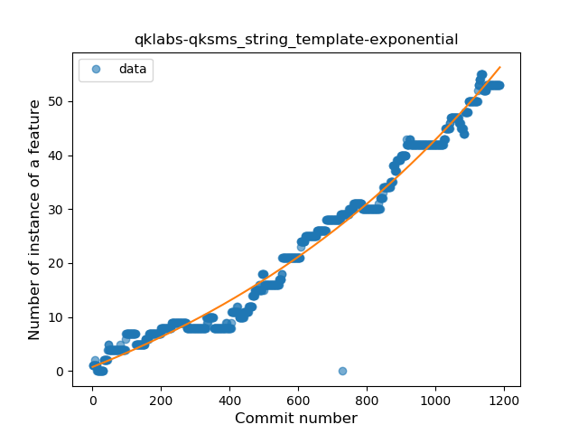
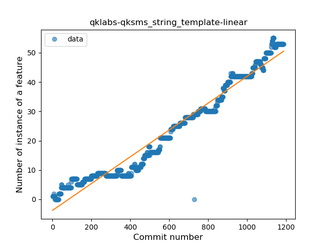
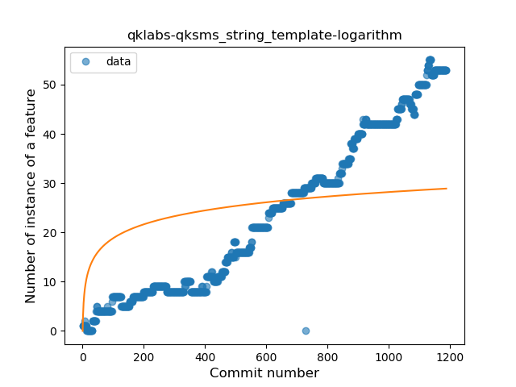
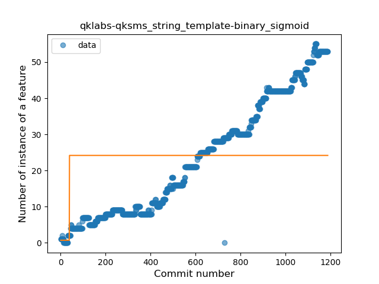
### <a name="func_with_default_value">Function with Default Value</a>
----
#### Functions
* **Constant Rise - Linear:** 
    * **R_Squared:** 0.97670246
* **Plateau Gradual Rise - Sigmoid:** 
    * **R_Squared:** 0.97990627
* **Sudden Rise Plateau - Logarithm:** 
    * **R_Squared:** 0.39872316

**Plots** :chart_with_upwards_trend:
-----

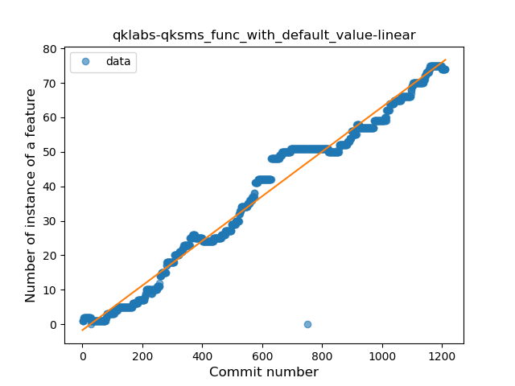
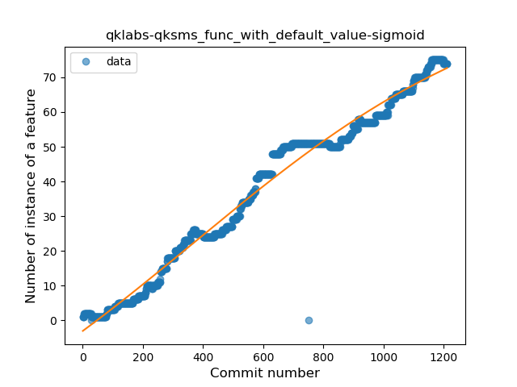
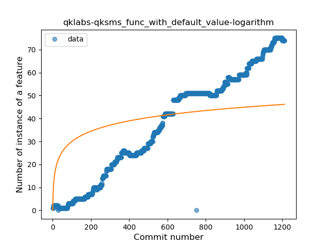
### <a name="singleton">Singleton</a>
----
#### Functions
* **Sudden Rise - Exponential:** 
    * **R_Squared:** 0.83879221
* **Constant Rise - Linear:** 
    * **R_Squared:** 0.81763235
* **Sudden Rise Plateau - Logarithm:** 
    * **R_Squared:** 0.4553656

**Plots** :chart_with_upwards_trend:
-----

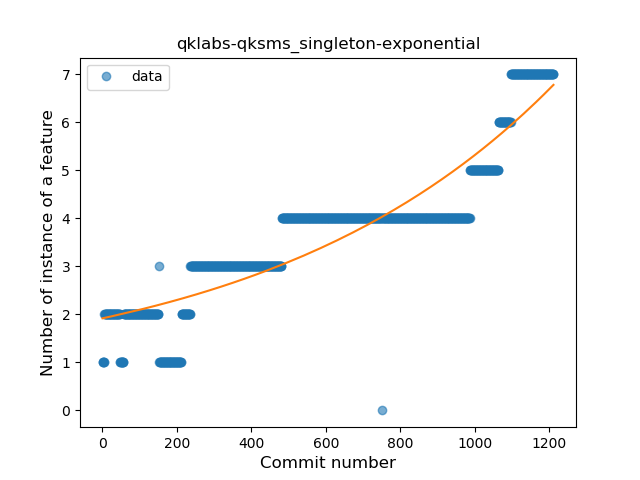
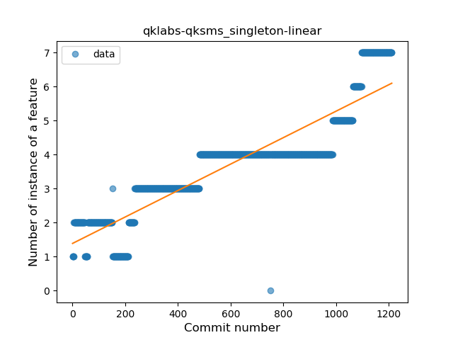
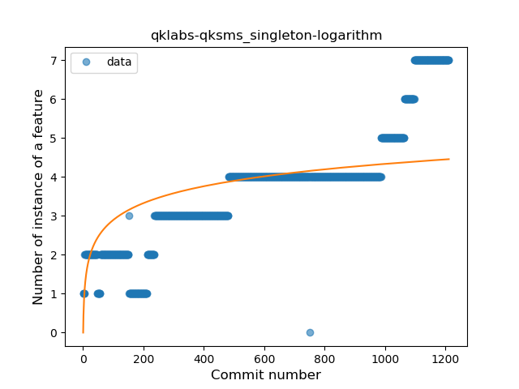
### <a name="smart_cast">Smart Cast</a>
----
#### Functions
* **Constant Rise - Linear:** 
    * **R_Squared:** 0.91694786
* **Sudden Rise - Exponential:** 
    * **R_Squared:** 0.91795279
* **Sudden Rise Plateau - Logarithm:** 
    * **R_Squared:** 0.34910986

**Plots** :chart_with_upwards_trend:
-----

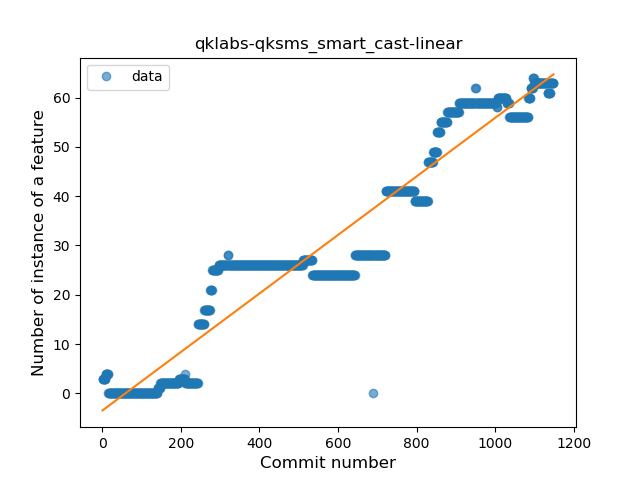
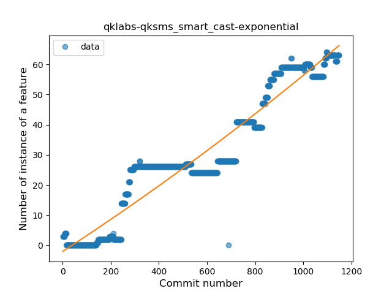
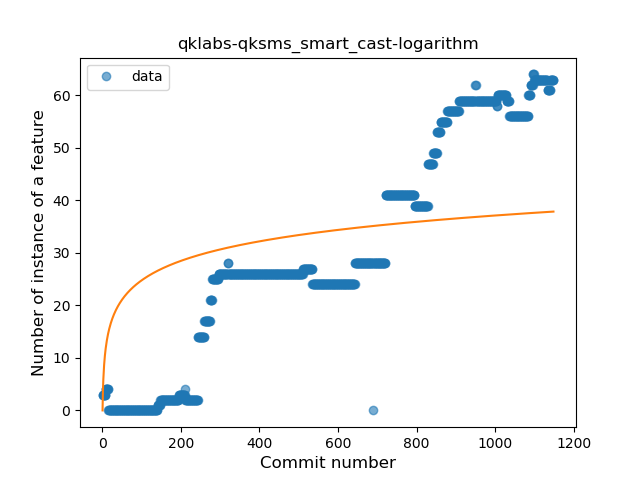
### <a name="range_expr">Range Expression</a>
----
#### Functions
* **Constant Rise - Linear:** 
    * **R_Squared:** 0.90406211
* **Sudden Rise Plateau - Logarithm:** 
    * **R_Squared:** 0.62772241

**Plots** :chart_with_upwards_trend:
-----

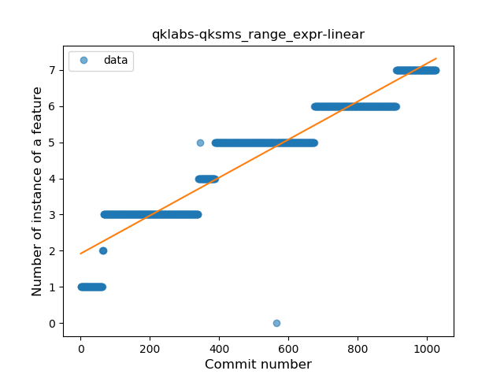
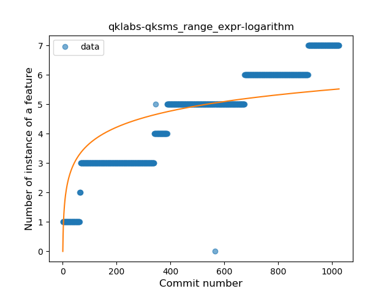
### <a name="func_call_with_named_arg">Function call with Named Argument</a>
----
#### Functions
* **Constant Rise - Linear:** 
    * **R_Squared:** 0.97182536
* **Sudden Rise Plateau - Logarithm:** 
    * **R_Squared:** 0.45324823
* **Plateau Sudden Rise - Binary Sigmoid:** 
    * **R_Squared:** 0.16353843

**Plots** :chart_with_upwards_trend:
-----

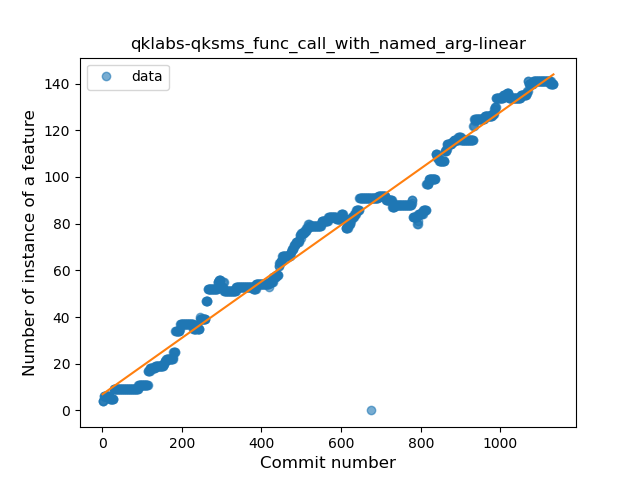
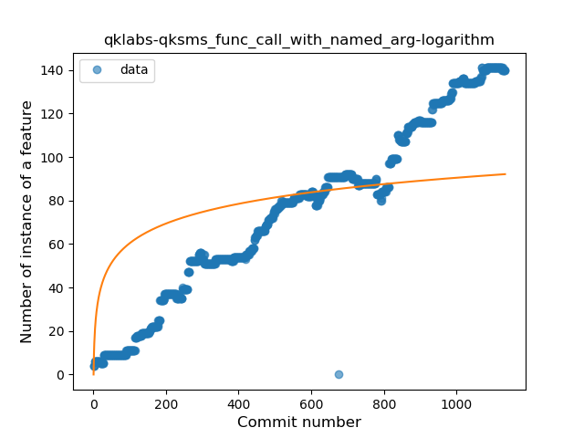
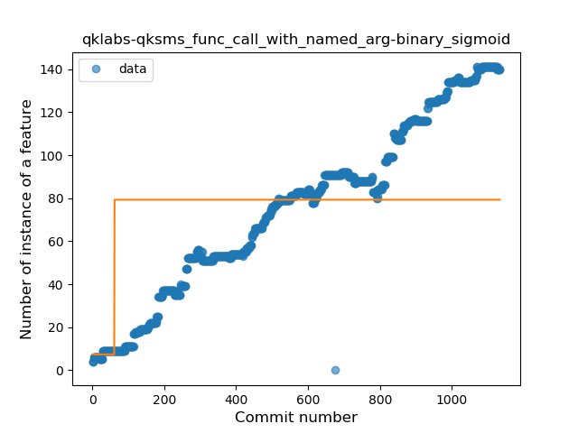
### <a name="data_class">Data Class</a>
----
#### Functions
* **Constant Rise - Linear:** 
    * **R_Squared:** 0.93932633
* **Sudden Rise - Exponential:** 
    * **R_Squared:** 0.94224525
* **Sudden Rise Plateau - Logarithm:** 
    * **R_Squared:** 0.49704807

**Plots** :chart_with_upwards_trend:
-----

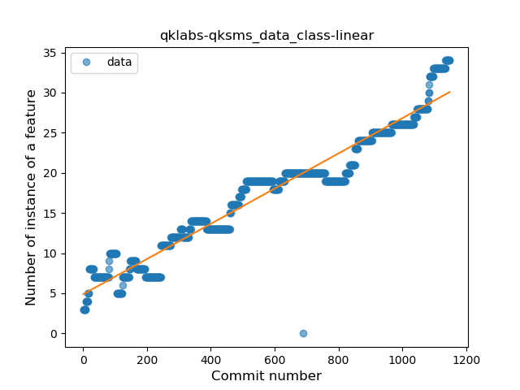
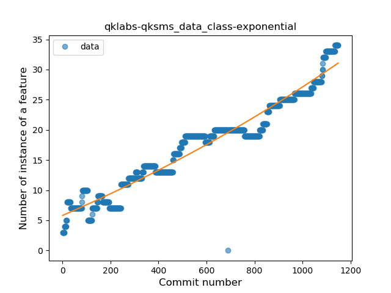
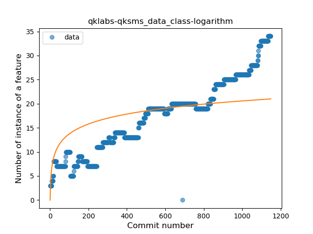
### <a name="extension_function">Extension Function</a>
----
#### Functions
* **Constant Rise - Linear:** 
    * **R_Squared:** 0.96569483
* **Sudden Rise - Exponential:** 
    * **R_Squared:** 0.96669548
* **Sudden Rise Plateau - Logarithm:** 
    * **R_Squared:** 0.50001025
* **Plateau Gradual Rise - Sigmoid:** 
    * **R_Squared:** 0.40259082

**Plots** :chart_with_upwards_trend:
-----

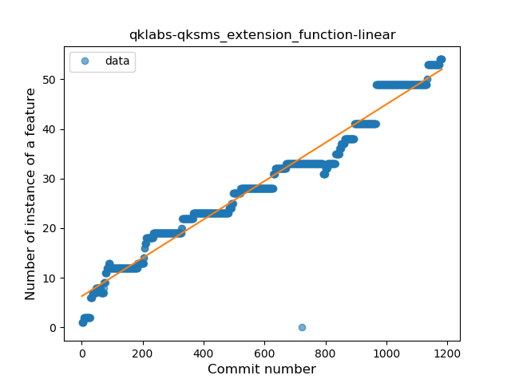
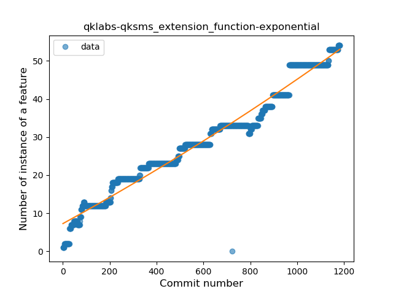
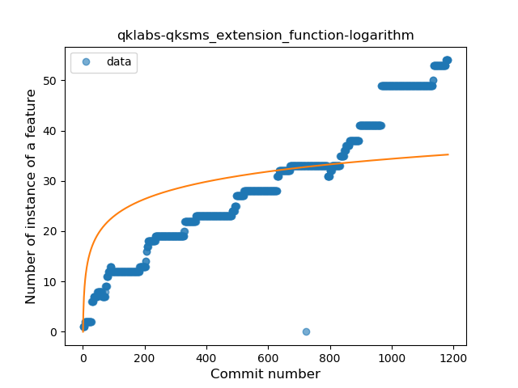
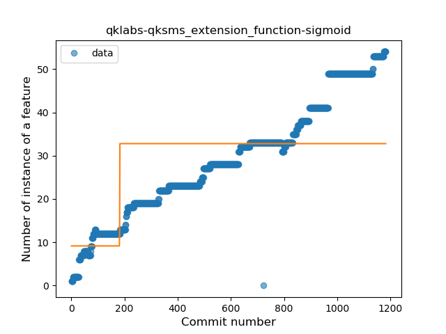
### <a name="property_delegation">Property Delegation</a>
----
#### Functions
* **Constant Rise - Linear:** 
    * **R_Squared:** 0.9240231
* **Sudden Rise Plateau - Logarithm:** 
    * **R_Squared:** 0.60569788
* **Plateau Sudden Rise - Binary Sigmoid:** 
    * **R_Squared:** 0.03427164

**Plots** :chart_with_upwards_trend:
-----

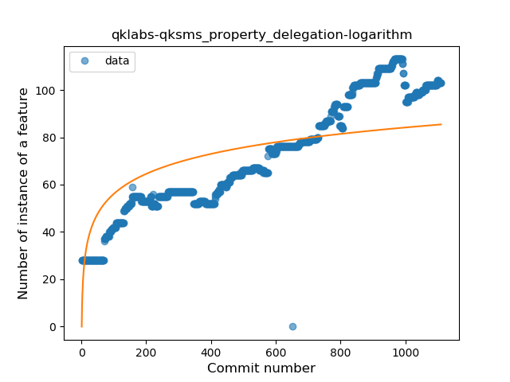
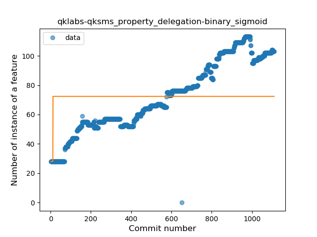
### <a name="destructuring_declaration">Destructuring Declaration</a>
----
#### Functions
* **Plateau Gradual Rise - Sigmoid:** 
    * **R_Squared:** 0.91225976
* **Sudden Rise - Exponential:** 
    * **R_Squared:** 0.81588585
* **Constant Rise - Linear:** 
    * **R_Squared:** 0.53696847
* **Sudden Rise Plateau - Logarithm:** 
    * **R_Squared:** 0.10185007

**Plots** :chart_with_upwards_trend:
-----

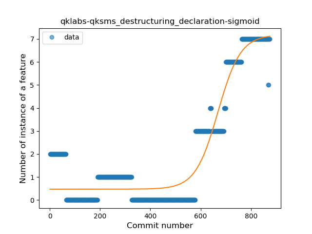
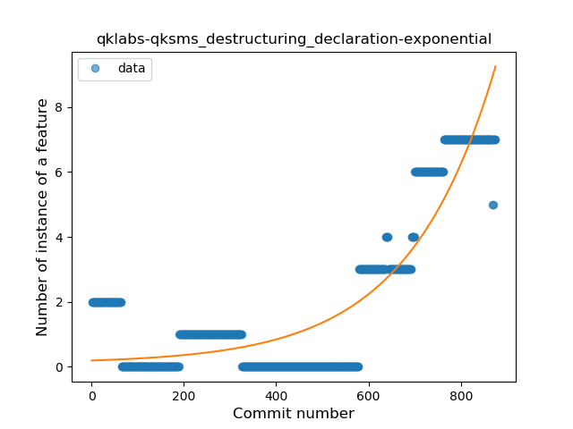
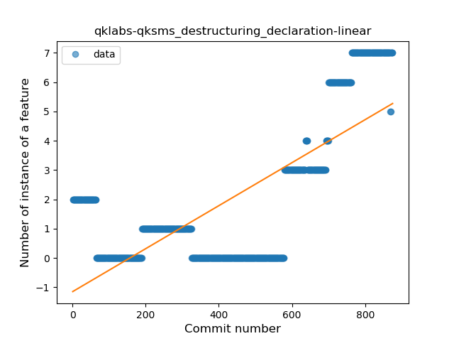
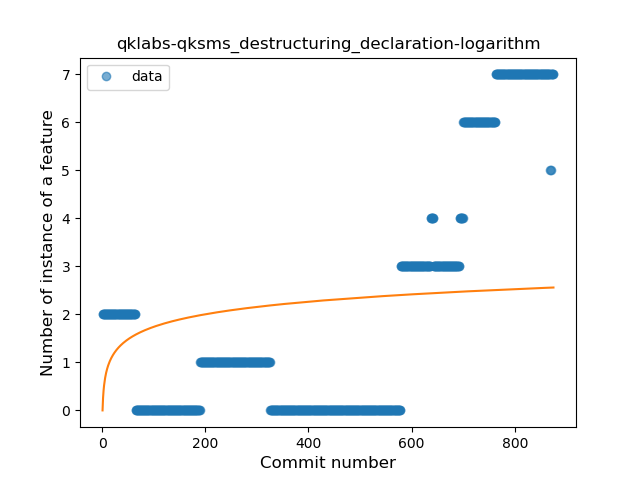
