## quarck-CalendarNotification
----
#### Metrics provided by Detekt
* Number of lines of code 24849
* Number of Kotlin files: 125
* Cyclomatic complexity: 2827
* Cyclomatic complexity by thousands of lines: 208 

----
**18** features analyzed

*	<a href="#type_inference">Type Inference</a> 
*	<a href="#lambda">Lambda</a> 
*	<a href="#safe_call">Safe Call</a> 
*	<a href="#when_expr">When expression</a> 
*	<a href="#companion_object">Companion Object</a> 
*	<a href="#unsafe_call">Unsafe Call</a> 
*	<a href="#string_template">String Template</a> 
*	<a href="#func_with_default_value">Function with Default Value</a> 
*	<a href="#singleton">Singleton</a> 
*	<a href="#smart_cast">Smart Cast</a> 
*	<a href="#range_expr">Range Expression</a> 
*	<a href="#func_call_with_named_arg">Function call with Named Argument</a> 
*	<a href="#data_class">Data Class</a> 
*	<a href="#extension_function">Extension Function</a> 
*	<a href="#property_delegation">Property Delegation</a> 
*	<a href="#destructuring_declaration">Destructuring Declaration</a> 
*	<a href="#inline_func">Inline Function</a> 
*	<a href="#overloaded_op">Overloaded Operator</a> 

### <a name="type_inference">Type Inference</a>
----
#### Functions
* **Constant Rise - Linear:** 
    * **R_Squared:** 0.97250667
* **Sudden Rise Plateau - Logarithm:** 
    * **R_Squared:** 0.46110516

**Plots** :chart_with_upwards_trend:
-----

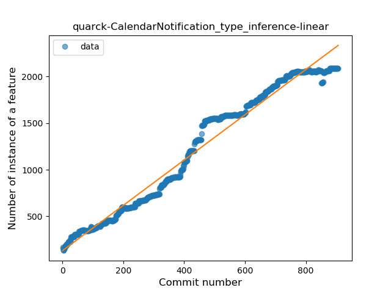
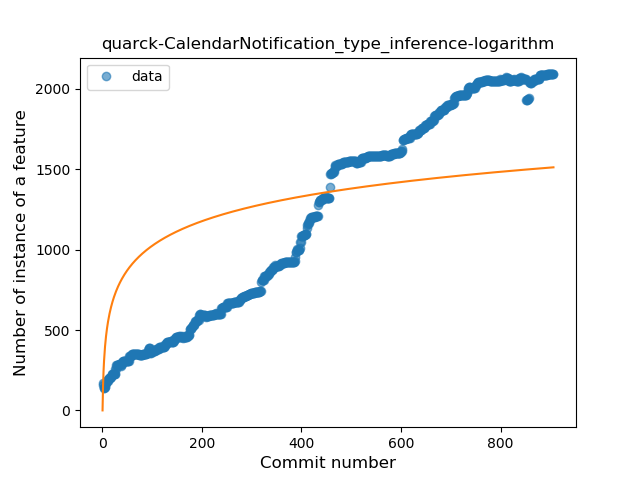
### <a name="lambda">Lambda</a>
----
#### Functions
* **Constant Rise - Linear:** 
    * **R_Squared:** 0.97551459
* **Plateau Sudden Rise - Binary Sigmoid:** 
    * **R_Squared:** 0.7200518
* **Sudden Rise Plateau - Logarithm:** 
    * **R_Squared:** 0.45013297

**Plots** :chart_with_upwards_trend:
-----

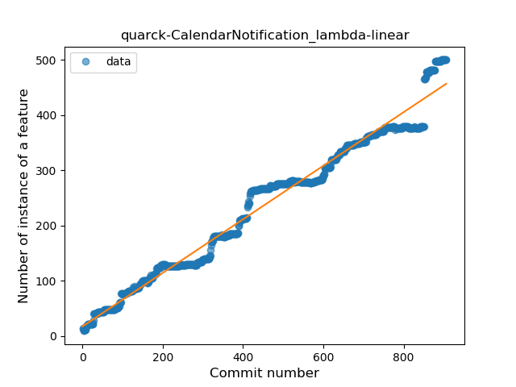
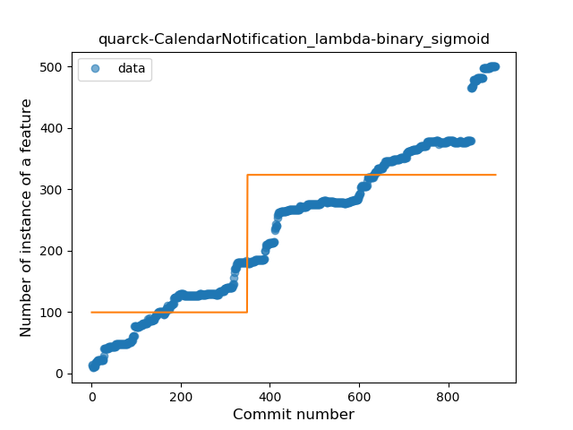
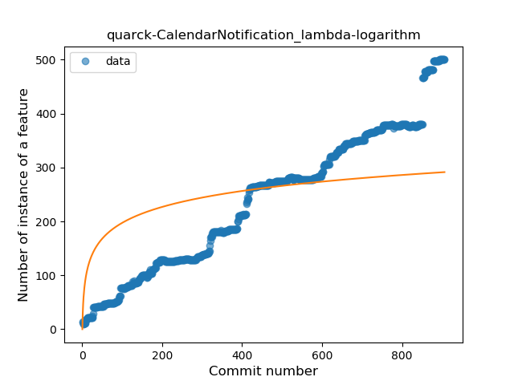
### <a name="safe_call">Safe Call</a>
----
#### Functions
* **Constant Rise - Linear:** 
    * **R_Squared:** 0.88295604
* **Sudden Rise Plateau - Logarithm:** 
    * **R_Squared:** 0.48602342
* **Plateau Sudden Rise - Binary Sigmoid:** 
    * **R_Squared:** 0.23815929

**Plots** :chart_with_upwards_trend:
-----

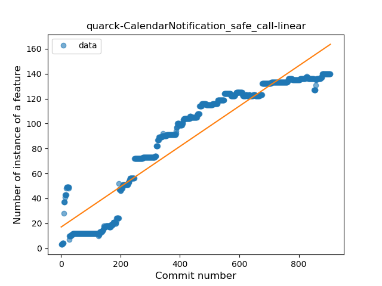
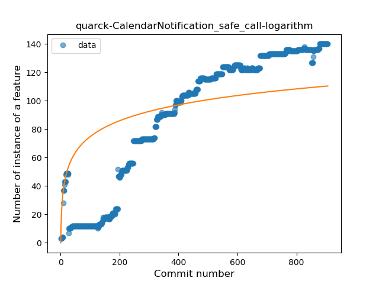
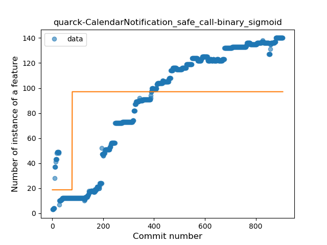
### <a name="when_expr">When expression</a>
----
#### Functions
* **Constant Rise - Linear:** 
    * **R_Squared:** 0.98163753
* **Sudden Rise Plateau - Logarithm:** 
    * **R_Squared:** 0.42634789
* **Plateau Sudden Rise - Binary Sigmoid:** 
    * **R_Squared:** 0.19209097

**Plots** :chart_with_upwards_trend:
-----

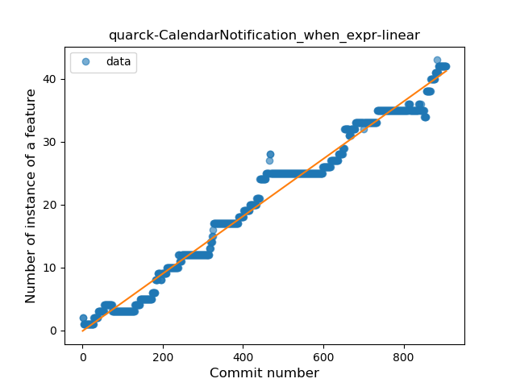
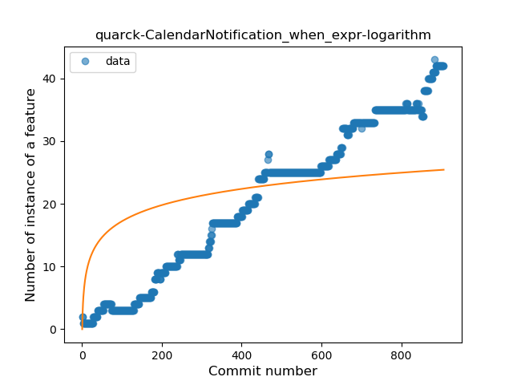
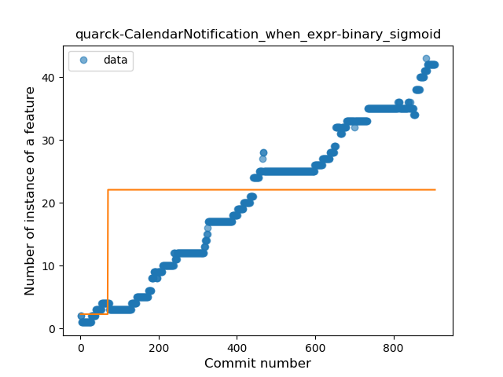
### <a name="companion_object">Companion Object</a>
----
#### Functions
* **Constant Rise - Linear:** 
    * **R_Squared:** 0.96562748
* **Sudden Rise Plateau - Logarithm:** 
    * **R_Squared:** 0.54517148
* **Plateau Sudden Rise - Binary Sigmoid:** 
    * **R_Squared:** 0.0758525

**Plots** :chart_with_upwards_trend:
-----

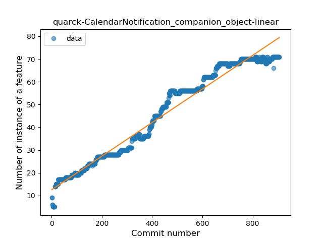
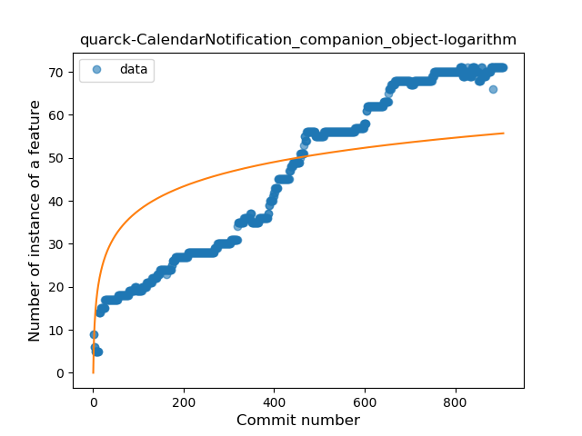
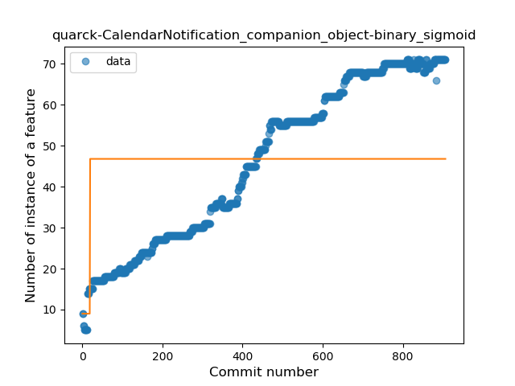
### <a name="unsafe_call">Unsafe Call</a>
----
#### Functions
* **Constant Rise - Linear:** 
    * **R_Squared:** 0.01246145
* **Sudden Rise Plateau - Logarithm:** 
    * **R_Squared:** -0.0

**Plots** :chart_with_upwards_trend:
-----

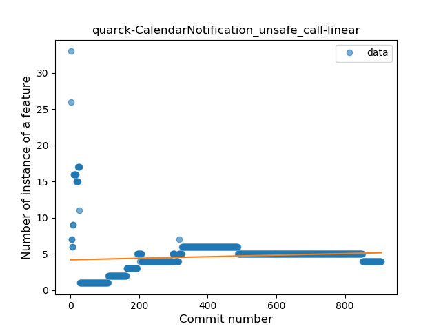
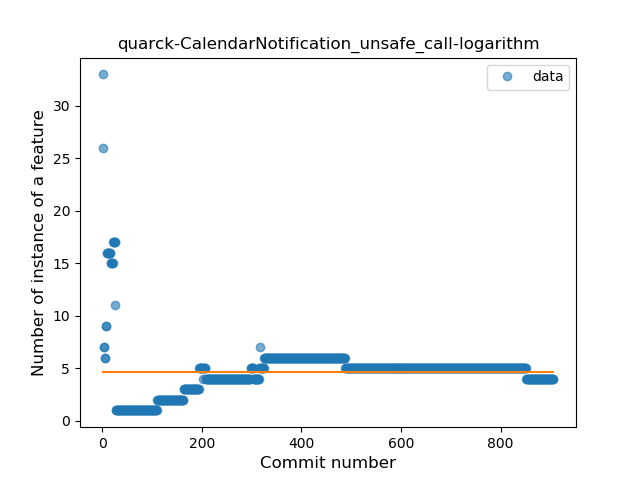
### <a name="string_template">String Template</a>
----
#### Functions
* **Constant Rise - Linear:** 
    * **R_Squared:** 0.9649248
* **Plateau Sudden Rise - Binary Sigmoid:** 
    * **R_Squared:** 0.48131371
* **Sudden Rise Plateau - Logarithm:** 
    * **R_Squared:** 0.44688789

**Plots** :chart_with_upwards_trend:
-----

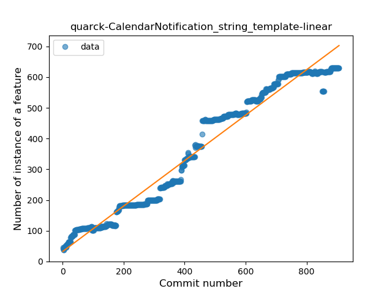
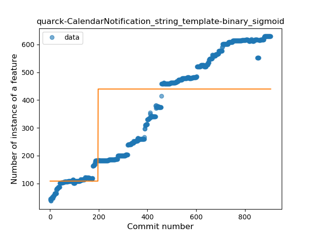
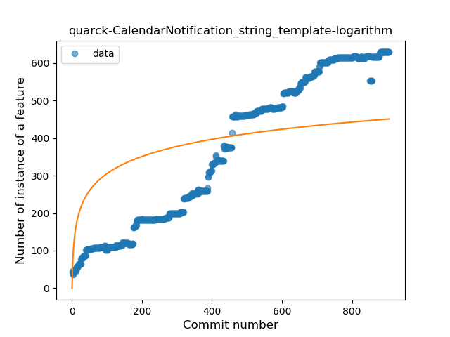
### <a name="func_with_default_value">Function with Default Value</a>
----
#### Functions
* **Constant Rise - Linear:** 
    * **R_Squared:** 0.89961572
* **Sudden Rise Plateau - Logarithm:** 
    * **R_Squared:** 0.47519736

**Plots** :chart_with_upwards_trend:
-----

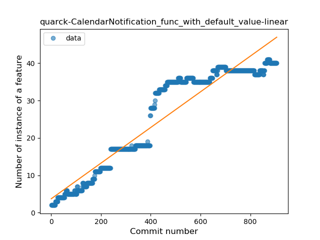
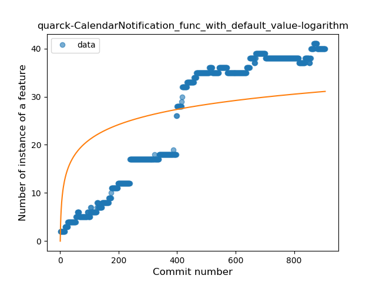
### <a name="singleton">Singleton</a>
----
#### Functions
* **Sudden Rise Plateau - Logarithm:** 
    * **R_Squared:** 0.83946786
* **Constant Rise - Linear:** 
    * **R_Squared:** 0.74919268

**Plots** :chart_with_upwards_trend:
-----

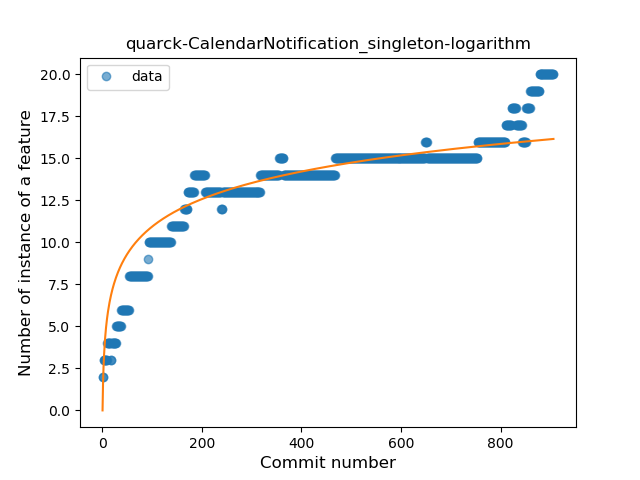
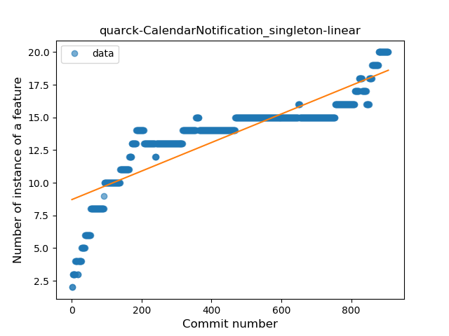
### <a name="smart_cast">Smart Cast</a>
----
#### Functions
* **Plateau Gradual Rise - Sigmoid:** 
    * **R_Squared:** 0.50651624
* **Sudden Rise Plateau - Logarithm:** 
    * **R_Squared:** 0.37136255
* **Constant Rise - Linear:** 
    * **R_Squared:** 0.14185266

**Plots** :chart_with_upwards_trend:
-----

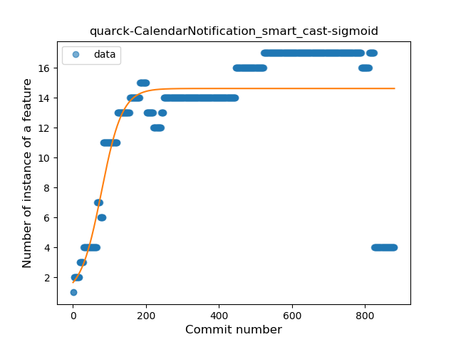
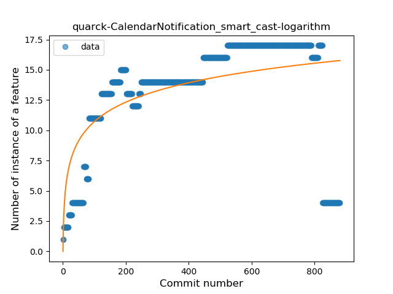

### <a name="range_expr">Range Expression</a>
----
#### Functions
* **Plateau Gradual Rise - Sigmoid:** 
    * **R_Squared:** 0.93219167
* **Sudden Rise - Exponential:** 
    * **R_Squared:** 0.9200272
* **Constant Rise - Linear:** 
    * **R_Squared:** 0.83276301
* **Sudden Rise Plateau - Logarithm:** 
    * **R_Squared:** 0.23705153

**Plots** :chart_with_upwards_trend:
-----

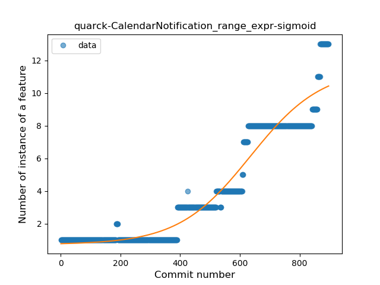
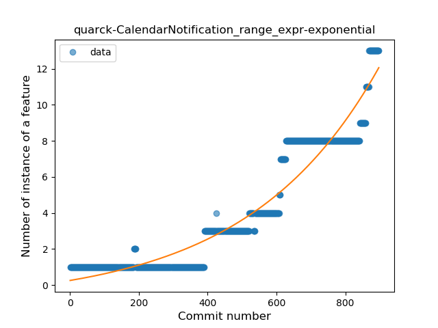
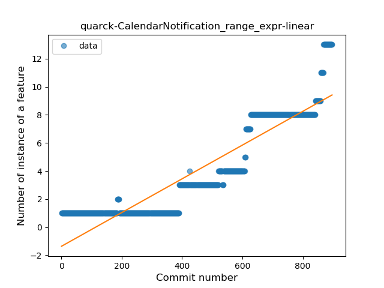
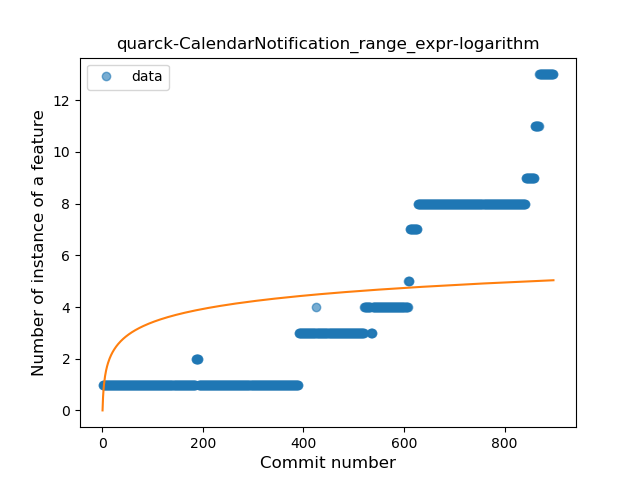
### <a name="func_call_with_named_arg">Function call with Named Argument</a>
----
#### Functions
* **Constant Rise - Linear:** 
    * **R_Squared:** 0.98231061
* **Sudden Rise Plateau - Logarithm:** 
    * **R_Squared:** 0.41580784
* **Plateau Gradual Rise - Sigmoid:** 
    * **R_Squared:** 0.39659353

**Plots** :chart_with_upwards_trend:
-----

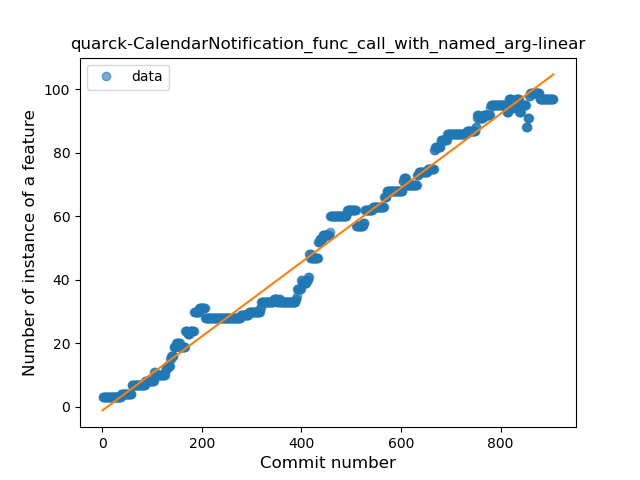
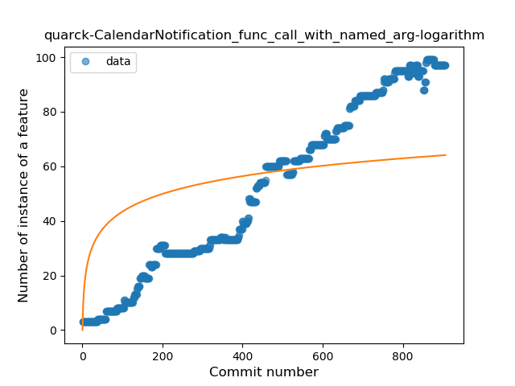
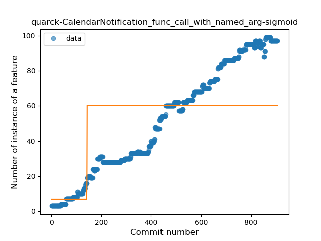
### <a name="data_class">Data Class</a>
----
#### Functions
* **Constant Rise - Linear:** 
    * **R_Squared:** 0.96665714
* **Sudden Rise Plateau - Logarithm:** 
    * **R_Squared:** 0.4519372
* **Plateau Sudden Rise - Binary Sigmoid:** 
    * **R_Squared:** 0.01301874

**Plots** :chart_with_upwards_trend:
-----

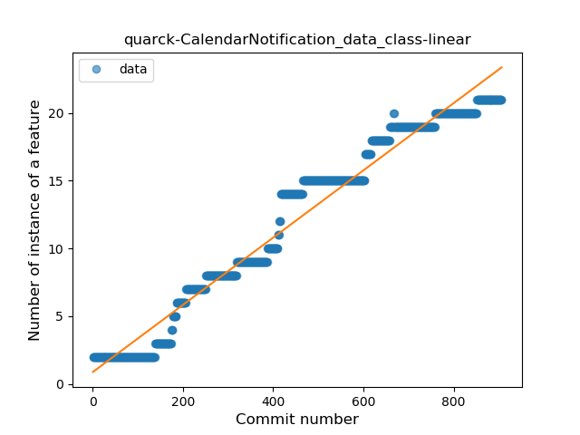
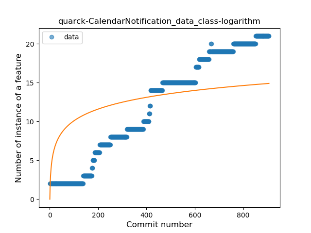
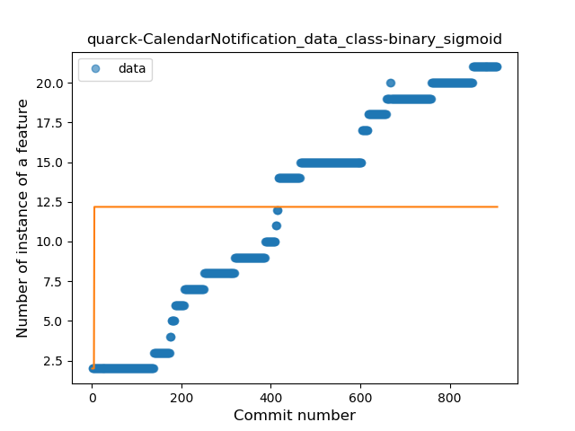
### <a name="extension_function">Extension Function</a>
----
#### Functions
* **Sudden Rise - Exponential:** 
    * **R_Squared:** 0.83455132
* **Constant Rise - Linear:** 
    * **R_Squared:** 0.8243019
* **Sudden Rise Plateau - Logarithm:** 
    * **R_Squared:** 0.62100421
* **Plateau Sudden Rise - Binary Sigmoid:** 
    * **R_Squared:** 0.09497871

**Plots** :chart_with_upwards_trend:
-----

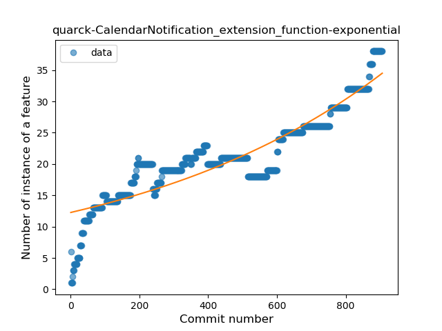
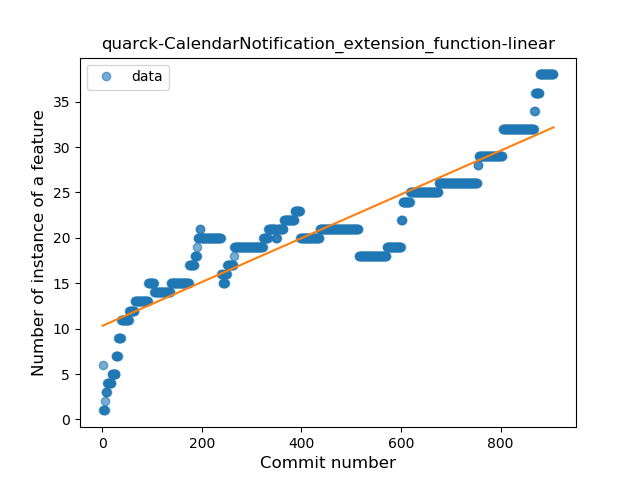
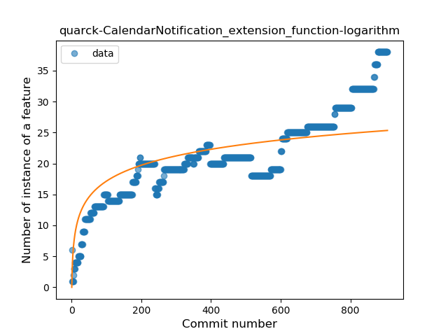
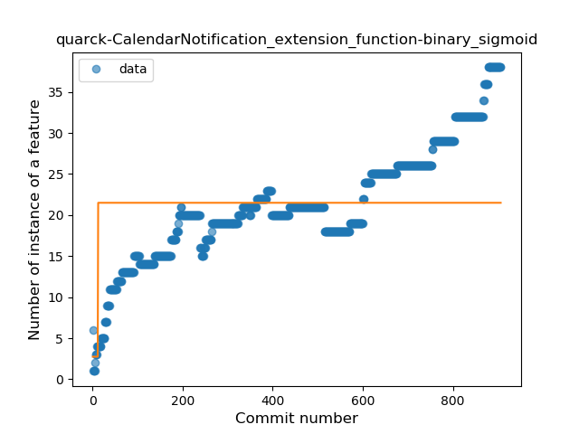
### <a name="property_delegation">Property Delegation</a>
----
#### Functions
* **Constant Rise - Linear:** 
    * **R_Squared:** 0.86917889
* **Sudden Rise Plateau - Logarithm:** 
    * **R_Squared:** 0.41313828
* **Plateau Sudden Rise - Binary Sigmoid:** 
    * **R_Squared:** 0.07198671

**Plots** :chart_with_upwards_trend:
-----

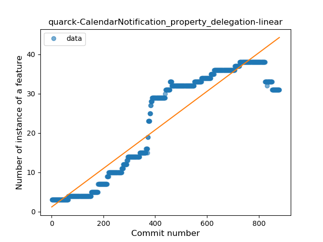
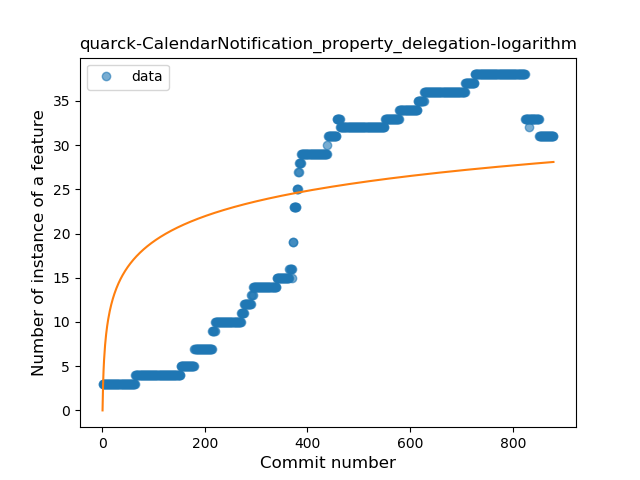
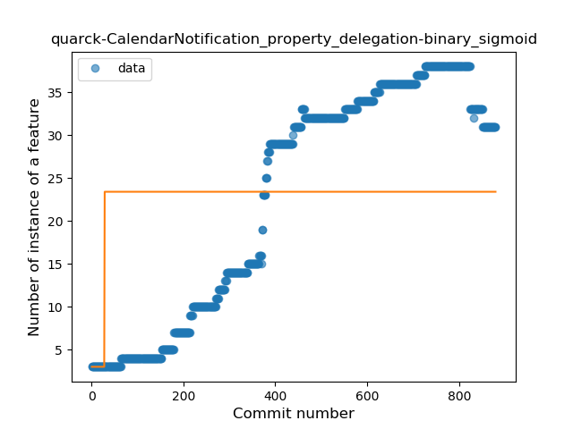
### <a name="destructuring_declaration">Destructuring Declaration</a>
----
#### Functions
* **Constant Rise - Linear:** 
    * **R_Squared:** 0.9319749
* **Sudden Rise Plateau - Logarithm:** 
    * **R_Squared:** 0.41883836
* **Plateau Sudden Rise - Binary Sigmoid:** 
    * **R_Squared:** 0.0993572

**Plots** :chart_with_upwards_trend:
-----

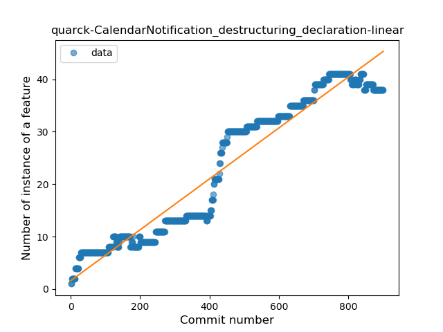
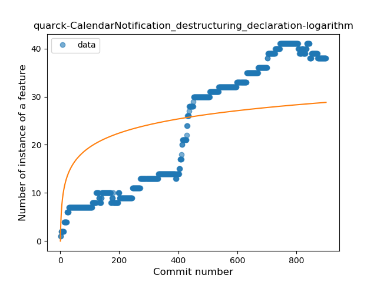
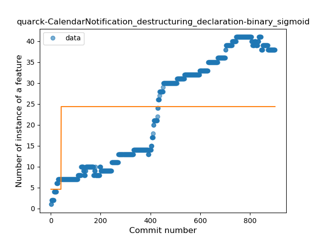
### <a name="inline_func">Inline Function</a>
----
#### Functions
* **Plateau Sudden Rise - Binary Sigmoid:** 
    * **R_Squared:** 1.0
* **Sudden Rise Plateau - Logarithm:** 
    * **R_Squared:** 0.53384763
* **Constant Rise - Linear:** 
    * **R_Squared:** 0.19667892

**Plots** :chart_with_upwards_trend:
-----

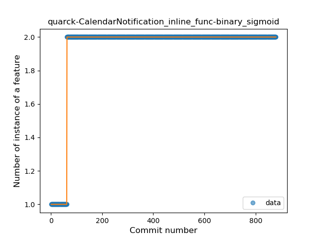
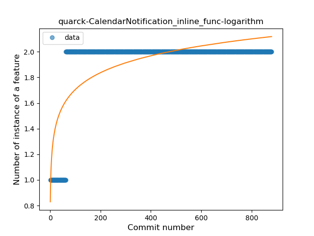
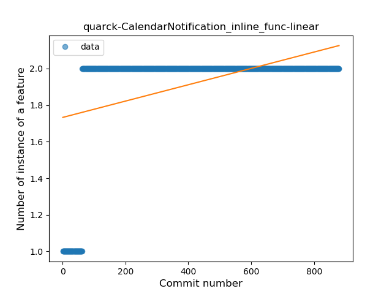
### <a name="overloaded_op">Overloaded Operator</a>
----
#### Functions
* **Constant Rise - Linear:** 
    * **R_Squared:** 0.67829481
* **Sudden Rise Plateau - Logarithm:** 
    * **R_Squared:** 0.32009851

**Plots** :chart_with_upwards_trend:
-----

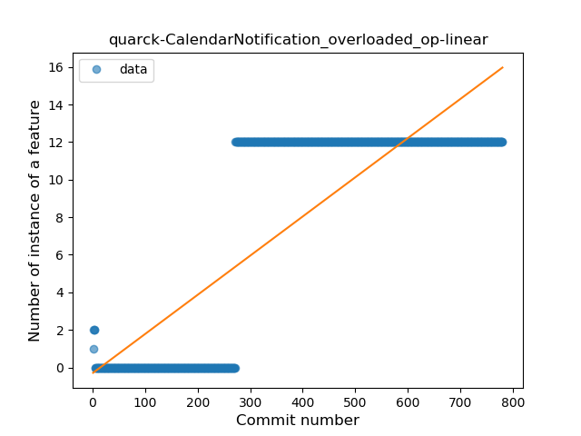
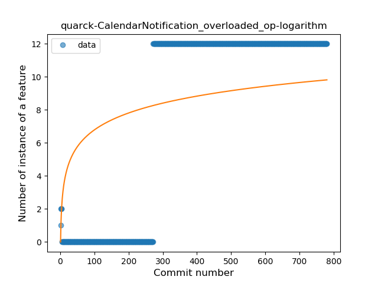
