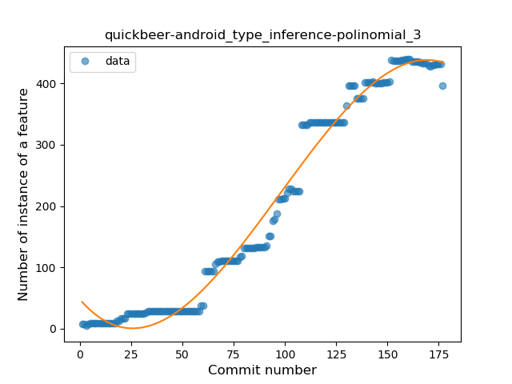
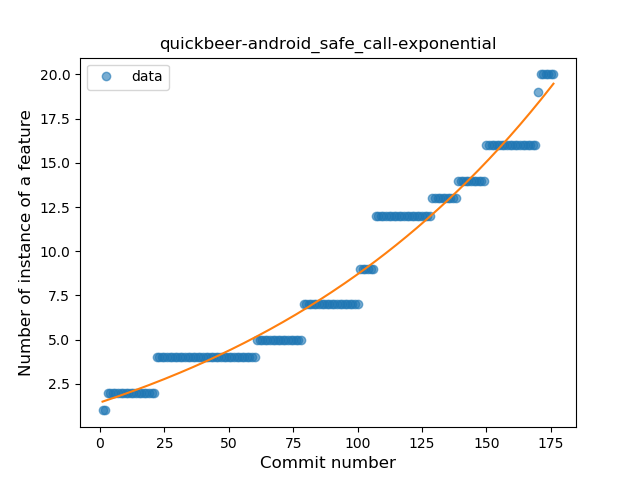
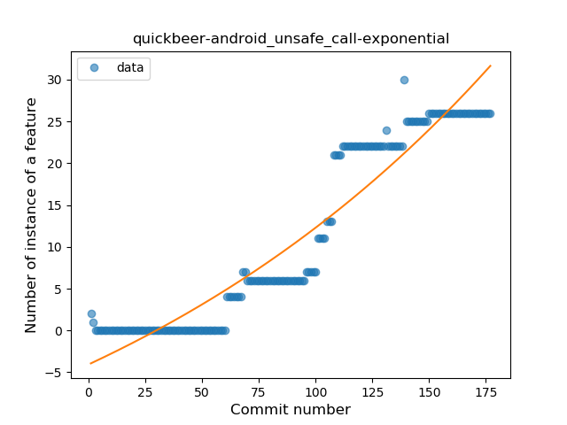
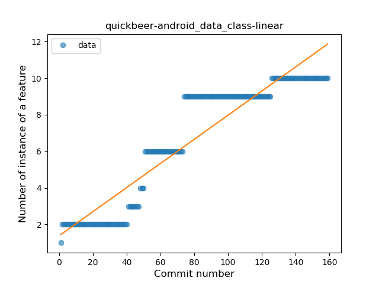
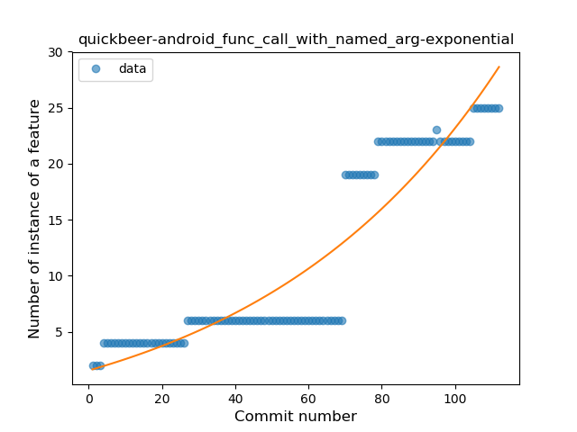
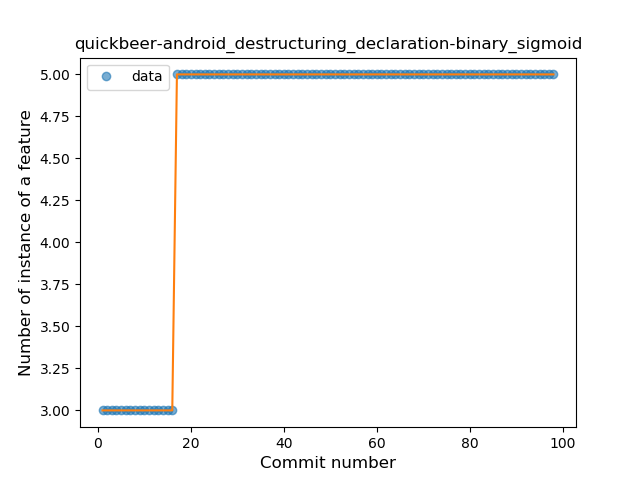

## quickbeer-android
----
#### Metrics provided by Detekt
* Number of lines of code 15439
* Number of Kotlin files: 209
* Cyclomatic complexity: 1333
* Cyclomatic complexity by thousands of lines: 226 

----
**15** features analyzed

*	<a href="#type_inference">Type Inference</a> 
*	<a href="#lambda">Lambda</a> 
*	<a href="#safe_call">Safe Call</a> 
*	<a href="#when_expr">When expression</a> 
*	<a href="#unsafe_call">Unsafe Call</a> 
*	<a href="#companion_object">Companion Object</a> 
*	<a href="#string_template">String Template</a> 
*	<a href="#func_with_default_value">Function with Default Value</a> 
*	<a href="#singleton">Singleton</a> 
*	<a href="#range_expr">Range Expression</a> 
*	<a href="#smart_cast">Smart Cast</a> 
*	<a href="#data_class">Data Class</a> 
*	<a href="#func_call_with_named_arg">Function call with Named Argument</a> 
*	<a href="#extension_function">Extension Function</a> 
*	<a href="#destructuring_declaration">Destructuring Declaration</a> 

### <a name="type_inference">Type Inference</a>
----
#### Functions
* **Instability - Polinomial 3:** )
    * **R_Squared:** 0.98196997
* **Constant Rise - Linear:** 
    * **R_Squared:** 0.93539128
* **Sudden Rise - Exponential:** 
    * **R_Squared:** 0.94432862
* **Sudden Rise Plateau - Logarithm:** 
    * **R_Squared:** 0.37225992

**Plots** :chart_with_upwards_trend:
-----

### <a name="lambda">Lambda</a>
----
#### Functions
* **Instability - Polinomial 3:** )
    * **R_Squared:** 0.98154306
* **Constant Rise - Linear:** 
    * **R_Squared:** 0.90289396
* **Sudden Rise Plateau - Logarithm:** 
    * **R_Squared:** 0.40320734

**Plots** :chart_with_upwards_trend:
-----

### <a name="safe_call">Safe Call</a>
----
#### Functions
* **Sudden Rise - Exponential:** 
    * **R_Squared:** 0.96895037
* **Plateau Gradual Rise - Sigmoid:** 
    * **R_Squared:** 0.97180937
* **Constant Rise - Linear:** 
    * **R_Squared:** 0.93847815
* **Sudden Rise Plateau - Logarithm:** 
    * **R_Squared:** 0.46151756

**Plots** :chart_with_upwards_trend:
-----

### <a name="when_expr">When expression</a>
----
#### Functions
* **Constant Rise - Linear:** 
    * **R_Squared:** 0.90574285
* **Sudden Rise Plateau - Logarithm:** 
    * **R_Squared:** 0.54669739

**Plots** :chart_with_upwards_trend:
-----

### <a name="unsafe_call">Unsafe Call</a>
----
#### Functions
* **Sudden Rise - Exponential:** 
    * **R_Squared:** 0.90476413
* **Constant Rise - Linear:** 
    * **R_Squared:** 0.88990829
* **Sudden Rise Plateau - Logarithm:** 
    * **R_Squared:** 0.31300433

**Plots** :chart_with_upwards_trend:
-----

### <a name="companion_object">Companion Object</a>
----
#### Functions
* **Sudden Rise - Exponential:** 
    * **R_Squared:** 0.96348782
* **Constant Rise - Linear:** 
    * **R_Squared:** 0.93222183
* **Sudden Rise Plateau - Logarithm:** 
    * **R_Squared:** 0.3768801
* **Plateau Sudden Rise - Binary Sigmoid:** 
    * **R_Squared:** 0.22645175

**Plots** :chart_with_upwards_trend:
-----

### <a name="string_template">String Template</a>
----
#### Functions
* **Instability - Polinomial 3:** )
    * **R_Squared:** 0.86744311
* **Constant Rise - Linear:** 
    * **R_Squared:** 0.71148821
* **Plateau Gradual Rise - Sigmoid:** 
    * **R_Squared:** 0.58526254
* **Sudden Rise Plateau - Logarithm:** 
    * **R_Squared:** 0.41728475

**Plots** :chart_with_upwards_trend:
-----

### <a name="func_with_default_value">Function with Default Value</a>
----
#### Functions
* **Sudden Rise - Exponential:** 
    * **R_Squared:** 0.96389443
* **Plateau Gradual Rise - Sigmoid:** 
    * **R_Squared:** 0.96709616
* **Constant Rise - Linear:** 
    * **R_Squared:** 0.86061488
* **Sudden Rise Plateau - Logarithm:** 
    * **R_Squared:** 0.37736516

**Plots** :chart_with_upwards_trend:
-----

### <a name="singleton">Singleton</a>
----
#### Functions
* **Sudden Rise Plateau - Logarithm:** 
    * **R_Squared:** 0.36290151
* **Constant Rise - Linear:** 
    * **R_Squared:** 0.19342105

**Plots** :chart_with_upwards_trend:
-----

### <a name="range_expr">Range Expression</a>
----
#### Functions
* **Plateau Sudden Rise - Binary Sigmoid:** 
    * **R_Squared:** 1.0
* **Constant Rise - Linear:** 
    * **R_Squared:** 0.74035517
* **Sudden Rise Plateau - Logarithm:** 
    * **R_Squared:** 0.58191169

**Plots** :chart_with_upwards_trend:
-----

### <a name="smart_cast">Smart Cast</a>
----
#### Functions
* **Constant Rise - Linear:** 
    * **R_Squared:** 0.8476856
* **Sudden Rise - Exponential:** 
    * **R_Squared:** 0.84972414
* **Sudden Rise Plateau - Logarithm:** 
    * **R_Squared:** 0.74081589

**Plots** :chart_with_upwards_trend:
-----

### <a name="data_class">Data Class</a>
----
#### Functions
* **Constant Rise - Linear:** 
    * **R_Squared:** 0.87283811
* **Sudden Rise Plateau - Logarithm:** 
    * **R_Squared:** 0.6030771

**Plots** :chart_with_upwards_trend:
-----

### <a name="func_call_with_named_arg">Function call with Named Argument</a>
----
#### Functions
* **Sudden Rise - Exponential:** 
    * **R_Squared:** 0.86120985
* **Constant Rise - Linear:** 
    * **R_Squared:** 0.81373787
* **Sudden Rise Plateau - Logarithm:** 
    * **R_Squared:** 0.38388545
* **Plateau Sudden Rise - Binary Sigmoid:** 
    * **R_Squared:** 0.07797545

**Plots** :chart_with_upwards_trend:
-----

### <a name="extension_function">Extension Function</a>
----
#### Functions
* **Instability - Polinomial 3:** )
    * **R_Squared:** 0.85881224
* **Sudden Rise Plateau - Logarithm:** 
    * **R_Squared:** 0.77532656
* **Constant Rise - Linear:** 
    * **R_Squared:** 0.63226413

**Plots** :chart_with_upwards_trend:
-----

### <a name="destructuring_declaration">Destructuring Declaration</a>
----
#### Functions
* **Plateau Sudden Rise - Binary Sigmoid:** 
    * **R_Squared:** 1.0
* **Sudden Rise Plateau - Logarithm:** 
    * **R_Squared:** 0.66340376
* **Constant Rise - Linear:** 
    * **R_Squared:** 0.40987192

**Plots** :chart_with_upwards_trend:
-----

