## raatmarien-red-moon
----
#### Metrics provided by Detekt
* Number of lines of code 4118
* Number of Kotlin files: 47
* Cyclomatic complexity: 565
* Cyclomatic complexity by thousands of lines: 304 

----
**17** features analyzed

*	<a href="#type_inference">Type Inference</a> 
*	<a href="#lambda">Lambda</a> 
*	<a href="#safe_call">Safe Call</a> 
*	<a href="#when_expr">When expression</a> 
*	<a href="#companion_object">Companion Object</a> 
*	<a href="#unsafe_call">Unsafe Call</a> 
*	<a href="#string_template">String Template</a> 
*	<a href="#func_with_default_value">Function with Default Value</a> 
*	<a href="#singleton">Singleton</a> 
*	<a href="#range_expr">Range Expression</a> 
*	<a href="#func_call_with_named_arg">Function call with Named Argument</a> 
*	<a href="#data_class">Data Class</a> 
*	<a href="#extension_function">Extension Function</a> 
*	<a href="#property_delegation">Property Delegation</a> 
*	<a href="#destructuring_declaration">Destructuring Declaration</a> 
*	<a href="#inline_func">Inline Function</a> 
*	<a href="#super_delegation">Super Delegation</a> 

### <a name="type_inference">Type Inference</a>
----
#### Functions
* **Constant Decline - Linear:** 
    * **R_Squared:** 0.34265385
* **Plateau Sudden Decline - Binary Sigmoid:** 
    * **R_Squared:** 0.19351497
* **Sudden Decline - Exponential:** 
    * **R_Squared:** -0.0
* **Sudden Rise Plateau - Logarithm:** 
    * **R_Squared:** -0.0

**Plots** :chart_with_upwards_trend:
-----

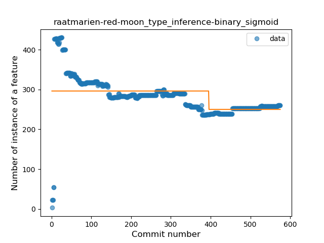
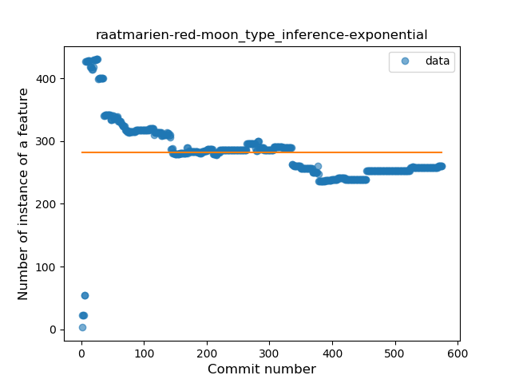
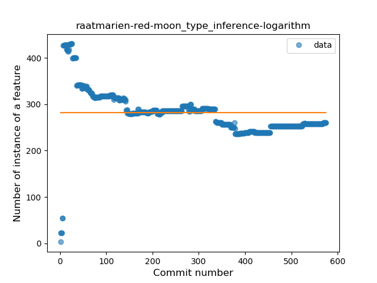
### <a name="lambda">Lambda</a>
----
#### Functions
* **Constant Rise - Linear:** 
    * **R_Squared:** 0.91578872
* **Sudden Rise Plateau - Logarithm:** 
    * **R_Squared:** 0.53741411
* **Plateau Sudden Rise - Binary Sigmoid:** 
    * **R_Squared:** 0.54554463

**Plots** :chart_with_upwards_trend:
-----

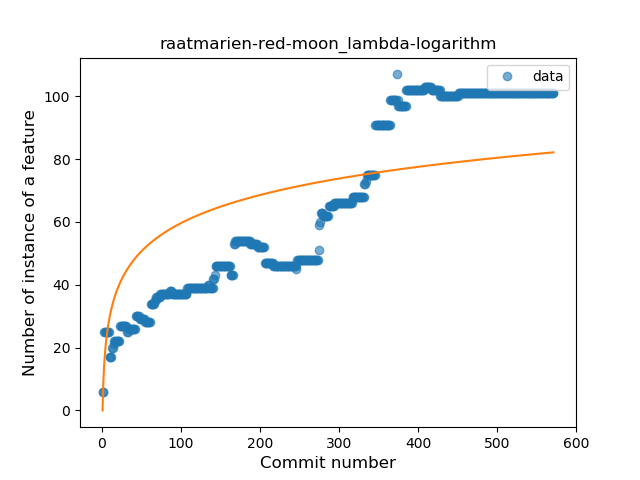
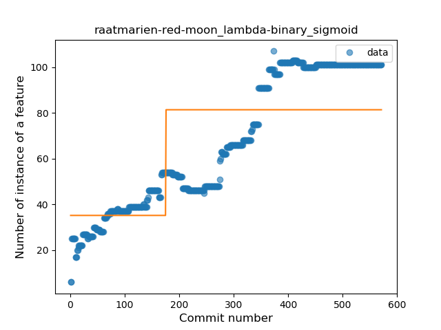
### <a name="safe_call">Safe Call</a>
----
#### Functions
* **Constant Rise - Linear:** 
    * **R_Squared:** 0.85066142
* **Sudden Rise Plateau - Logarithm:** 
    * **R_Squared:** 0.45133797
* **Plateau Sudden Rise - Binary Sigmoid:** 
    * **R_Squared:** 0.04455499

**Plots** :chart_with_upwards_trend:
-----

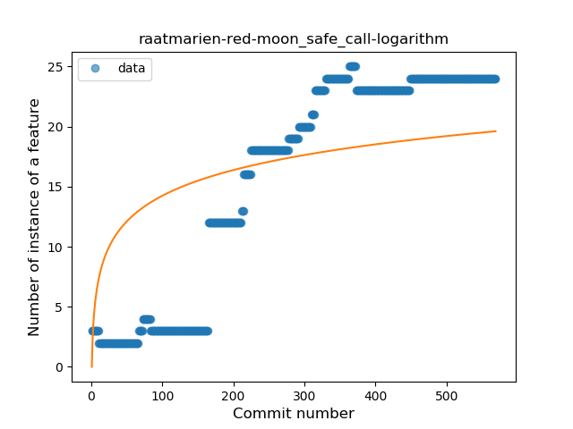
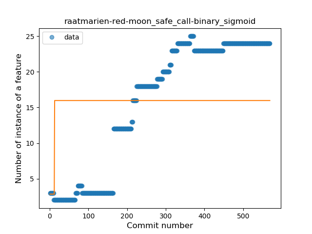
### <a name="when_expr">When expression</a>
----
#### Functions
* **Constant Rise - Linear:** 
    * **R_Squared:** 0.89676725
* **Sudden Rise Plateau - Logarithm:** 
    * **R_Squared:** 0.61580929

**Plots** :chart_with_upwards_trend:
-----

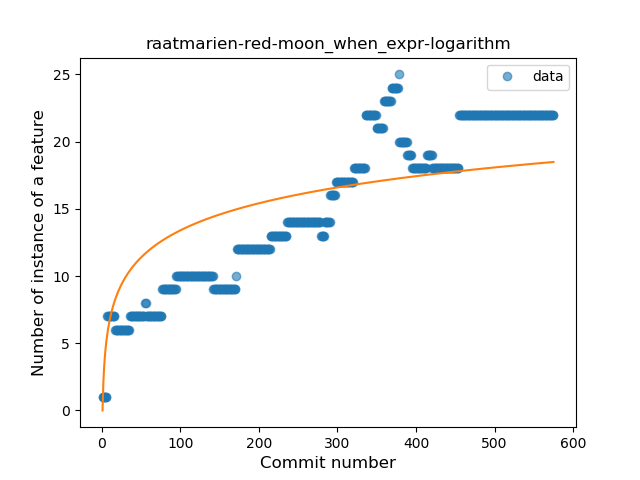
### <a name="companion_object">Companion Object</a>
----
#### Functions
* **Sudden Rise Plateau - Logarithm:** 
    * **R_Squared:** 0.20438713
* **Plateau Sudden Rise - Binary Sigmoid:** 
    * **R_Squared:** 0.08238764
* **Constant Rise - Linear:** 
    * **R_Squared:** 0.06614197

**Plots** :chart_with_upwards_trend:
-----

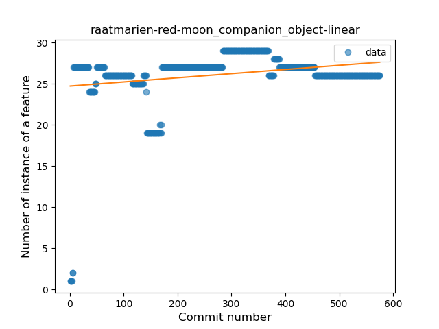
### <a name="unsafe_call">Unsafe Call</a>
----
#### Functions
* **Sudden Decline - Exponential:** 
    * **R_Squared:** 0.56443305
* **Constant Decline - Linear:** 
    * **R_Squared:** 0.29568751
* **Plateau Sudden Decline - Binary Sigmoid:** 
    * **R_Squared:** 0.20862246
* **Sudden Rise Plateau - Logarithm:** 
    * **R_Squared:** -0.0

**Plots** :chart_with_upwards_trend:
-----

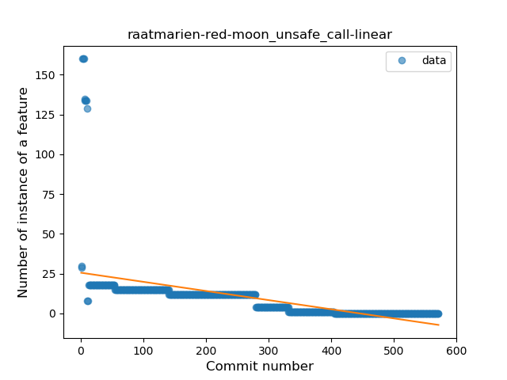

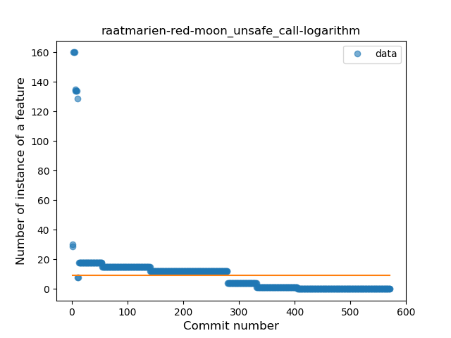
### <a name="string_template">String Template</a>
----
#### Functions
* **Plateau Gradual Rise - Sigmoid:** 
    * **R_Squared:** 0.96101177
* **Constant Rise - Linear:** 
    * **R_Squared:** 0.80264943
* **Sudden Rise Plateau - Logarithm:** 
    * **R_Squared:** 0.5944405

**Plots** :chart_with_upwards_trend:
-----

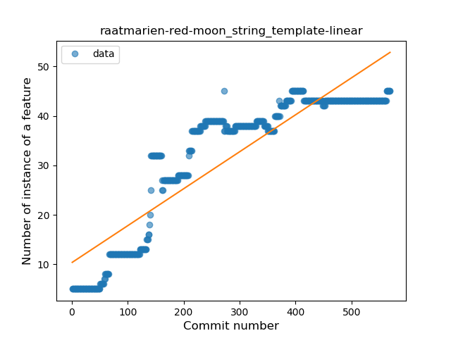
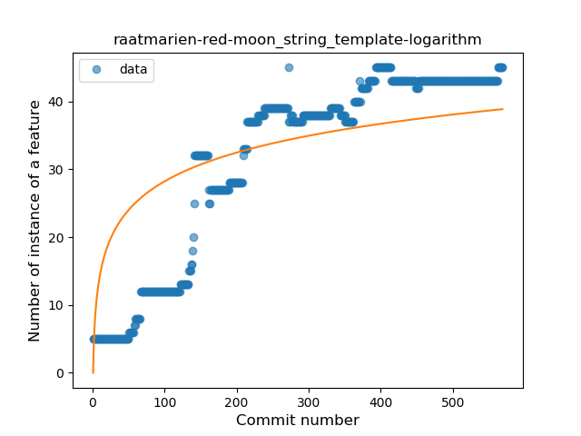
### <a name="func_with_default_value">Function with Default Value</a>
----
#### Functions
* **Constant Rise - Linear:** 
    * **R_Squared:** 0.52706624
* **Sudden Rise Plateau - Logarithm:** 
    * **R_Squared:** 0.34832021

**Plots** :chart_with_upwards_trend:
-----

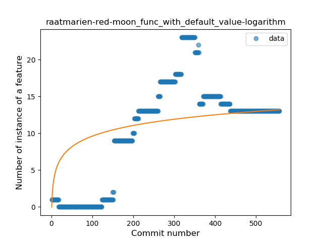
### <a name="singleton">Singleton</a>
----
#### Functions
* **Plateau Gradual Rise - Sigmoid:** 
    * **R_Squared:** 0.96362623
* **Constant Rise - Linear:** 
    * **R_Squared:** 0.81862604
* **Sudden Rise Plateau - Logarithm:** 
    * **R_Squared:** 0.40316578

**Plots** :chart_with_upwards_trend:
-----

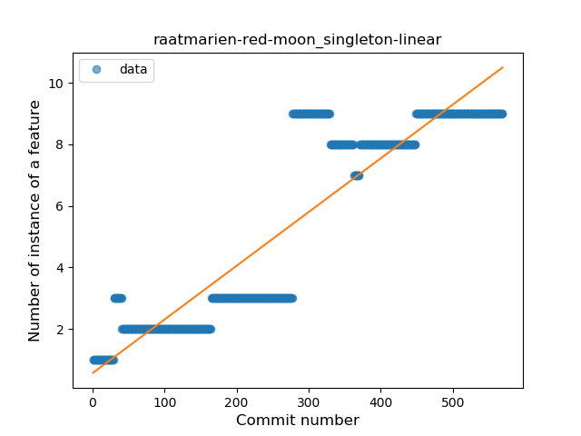
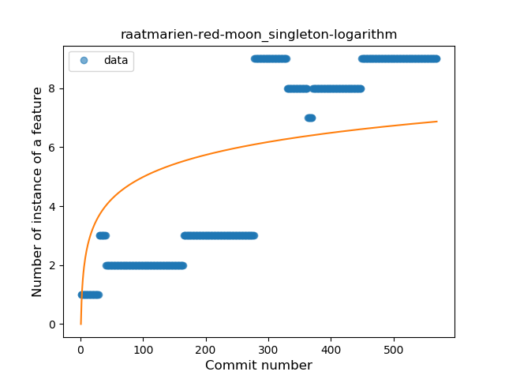
### <a name="range_expr">Range Expression</a>
----
#### Functions
* **Sudden Rise - Exponential:** 
    * **R_Squared:** 0.8070014
* **Constant Rise - Linear:** 
    * **R_Squared:** 0.79654518
* **Sudden Rise Plateau - Logarithm:** 
    * **R_Squared:** 0.30372521

**Plots** :chart_with_upwards_trend:
-----

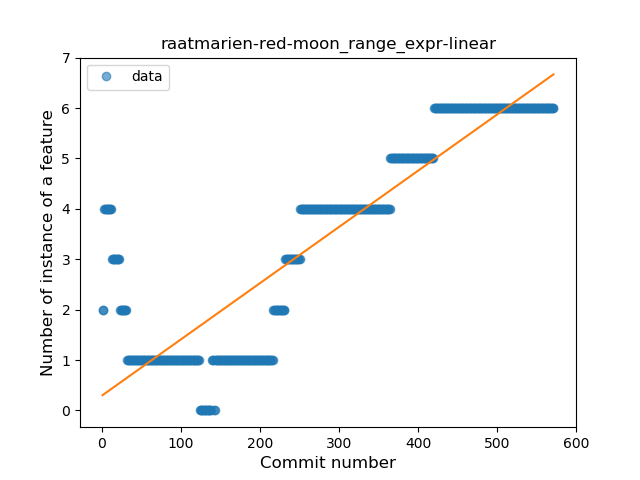
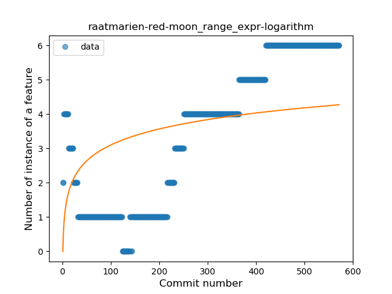
### <a name="func_call_with_named_arg">Function call with Named Argument</a>
----
#### Functions
* **Sudden Rise Plateau - Logarithm:** 
    * **R_Squared:** 0.85789464
* **Constant Rise - Linear:** 
    * **R_Squared:** 0.61947279
* **Plateau Sudden Rise - Binary Sigmoid:** 
    * **R_Squared:** 0.04775639

**Plots** :chart_with_upwards_trend:
-----

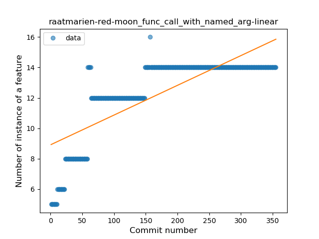
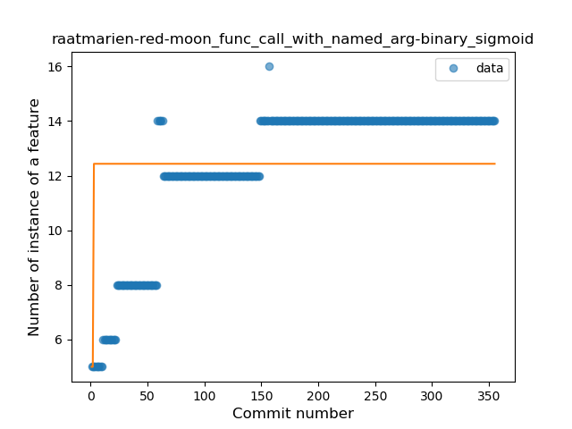
### <a name="data_class">Data Class</a>
----
#### Functions
* **Sudden Rise Plateau - Logarithm:** 
    * **R_Squared:** 0.80839364
* **Constant Rise - Linear:** 
    * **R_Squared:** 0.78001403

**Plots** :chart_with_upwards_trend:
-----

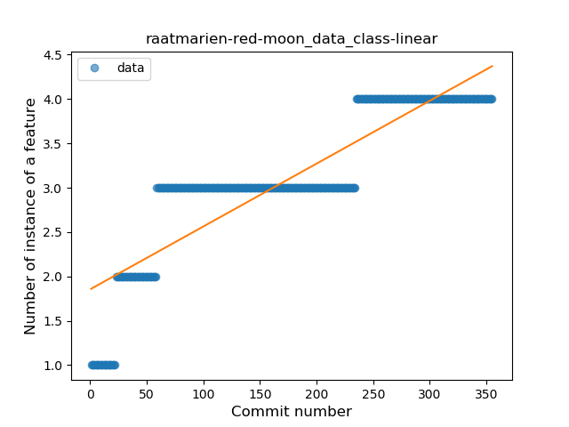
### <a name="extension_function">Extension Function</a>
----
#### Functions
* **Plateau Gradual Rise - Sigmoid:** 
    * **R_Squared:** 0.94966144
* **Constant Rise - Linear:** 
    * **R_Squared:** 0.92410734
* **Sudden Rise Plateau - Logarithm:** 
    * **R_Squared:** 0.46071761

**Plots** :chart_with_upwards_trend:
-----

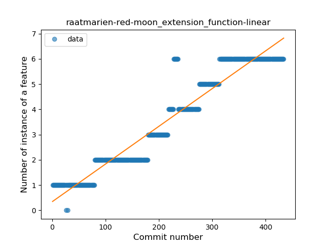
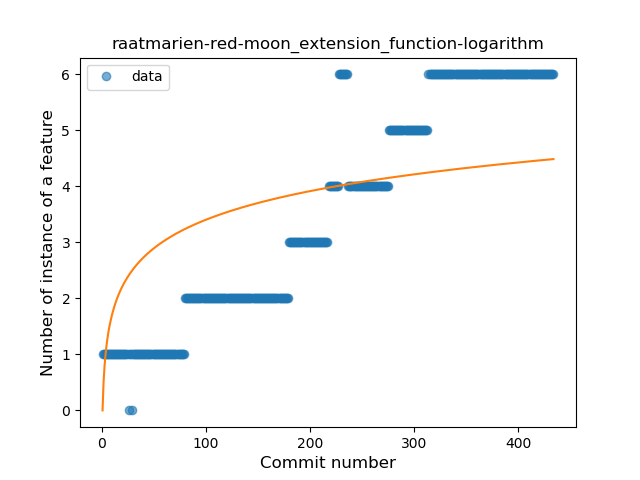
### <a name="property_delegation">Property Delegation</a>
----
#### Functions
* **Constant Rise - Linear:** 
    * **R_Squared:** 0.79721638
* **Sudden Rise Plateau - Logarithm:** 
    * **R_Squared:** 0.61375193

**Plots** :chart_with_upwards_trend:
-----

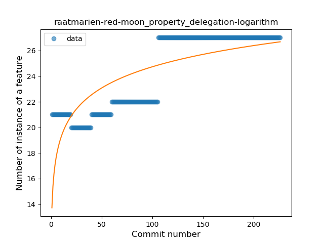
### <a name="destructuring_declaration">Destructuring Declaration</a>
----
#### Functions
* **Plateau Gradual Rise - Sigmoid:** 
    * **R_Squared:** 0.97986746
* **Constant Rise - Linear:** 
    * **R_Squared:** 0.84701183
* **Sudden Rise Plateau - Logarithm:** 
    * **R_Squared:** 0.3827346

**Plots** :chart_with_upwards_trend:
-----

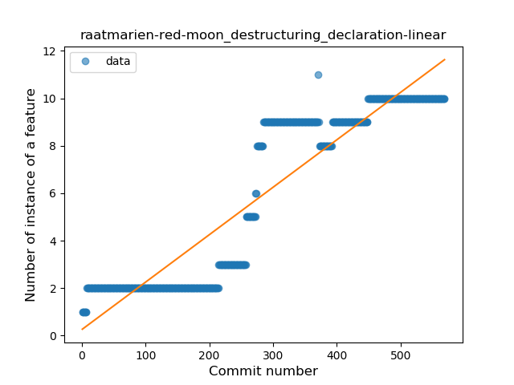
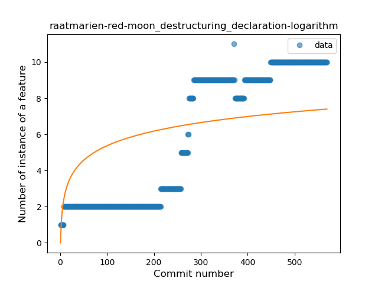
### <a name="inline_func">Inline Function</a>
----
#### Functions
* **Sudden Rise Plateau - Logarithm:** 
    * **R_Squared:** 0.18550382
* **Constant Rise - Linear:** 
    * **R_Squared:** 0.02888051

**Plots** :chart_with_upwards_trend:
-----

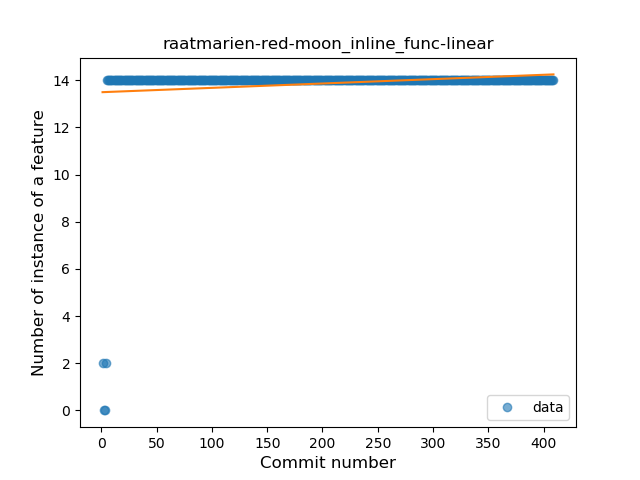
### <a name="super_delegation">Super Delegation</a>
----
#### Functions
* **Plateau Sudden Decline - Binary Sigmoid:** 
    * **R_Squared:** 1.0
* **Sudden Decline - Exponential:** 
    * **R_Squared:** 0.7698634
* **Constant Decline - Linear:** 
    * **R_Squared:** 0.56628319
* **Sudden Rise Plateau - Logarithm:** 
    * **R_Squared:** -0.0

**Plots** :chart_with_upwards_trend:
-----

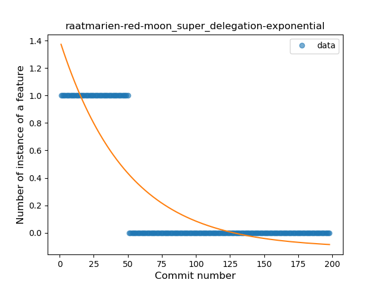
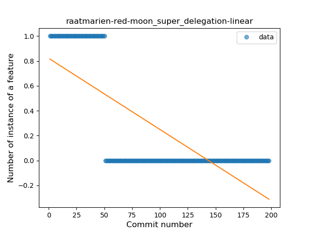
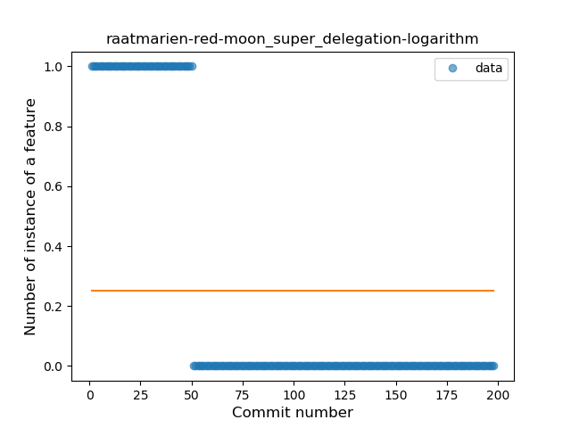
