## rectangle-dbmi-Realtime-Port-Authority
----
#### Metrics provided by Detekt
* Number of lines of code 726
* Number of Kotlin files: 11
* Cyclomatic complexity: 52
* Cyclomatic complexity by thousands of lines: 144 

----
**12** features analyzed

*	<a href="#type_inference">Type Inference</a> 
*	<a href="#lambda">Lambda</a> 
*	<a href="#safe_call">Safe Call</a> 
*	<a href="#when_expr">When expression</a> 
*	<a href="#companion_object">Companion Object</a> 
*	<a href="#unsafe_call">Unsafe Call</a> 
*	<a href="#string_template">String Template</a> 
*	<a href="#func_with_default_value">Function with Default Value</a> 
*	<a href="#singleton">Singleton</a> 
*	<a href="#smart_cast">Smart Cast</a> 
*	<a href="#func_call_with_named_arg">Function call with Named Argument</a> 
*	<a href="#extension_function">Extension Function</a> 

### <a name="type_inference">Type Inference</a>
----
#### Functions
* **Sudden Rise - Exponential:** 
    * **R_Squared:** 0.45313306
* **Constant Rise - Linear:** 
    * **R_Squared:** 0.1632868
* **Sudden Rise Plateau - Logarithm:** 
    * **R_Squared:** 0.01777072

**Plots** :chart_with_upwards_trend:
-----

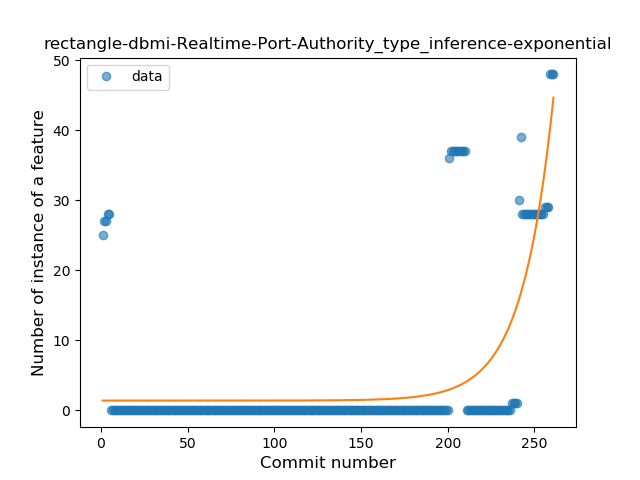
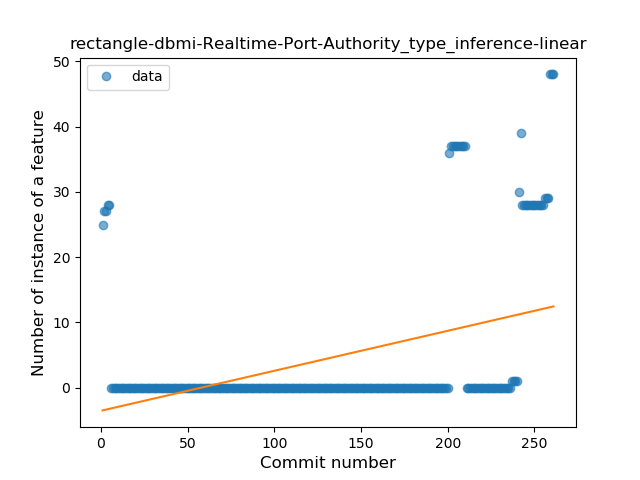
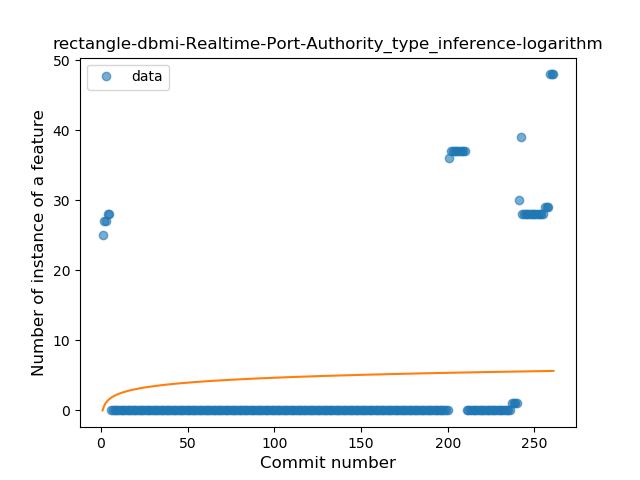
### <a name="lambda">Lambda</a>
----
#### Functions
* **Sudden Rise - Exponential:** 
    * **R_Squared:** 0.60619057
* **Constant Rise - Linear:** 
    * **R_Squared:** 0.12287028
* **Sudden Rise Plateau - Logarithm:** 
    * **R_Squared:** 0.00315378

**Plots** :chart_with_upwards_trend:
-----

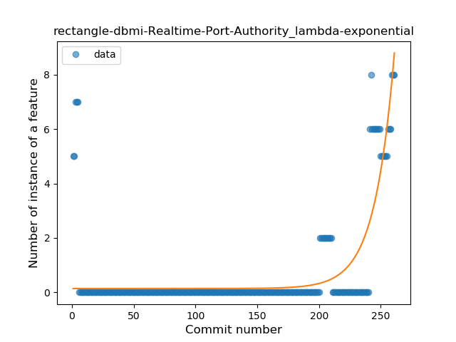
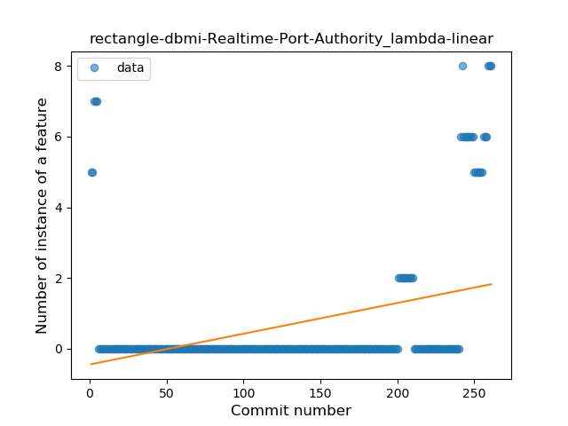
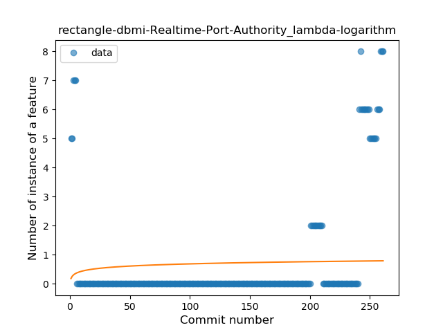
### <a name="safe_call">Safe Call</a>
----
#### Functions
* **Sudden Decline - Exponential:** 
    * **R_Squared:** 0.48665796
* **Plateau Sudden Decline - Binary Sigmoid:** 
    * **R_Squared:** 0.34786898
* **Constant Decline - Linear:** 
    * **R_Squared:** 0.02943342
* **Sudden Rise Plateau - Logarithm:** 
    * **R_Squared:** -0.0

**Plots** :chart_with_upwards_trend:
-----

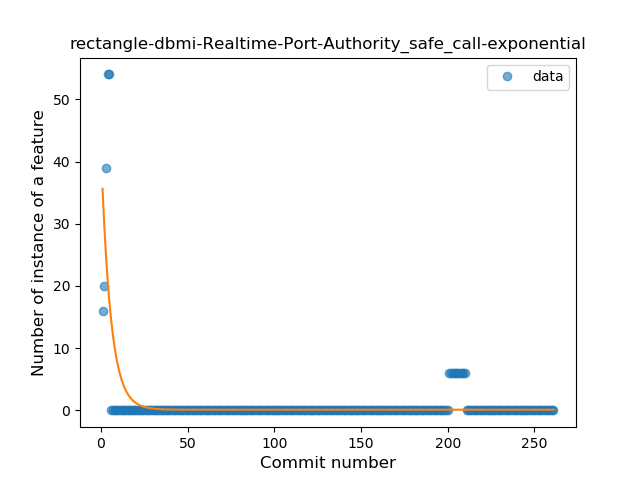
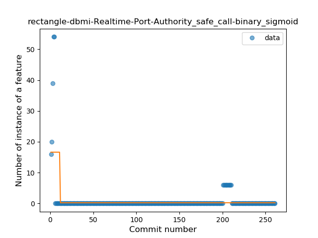
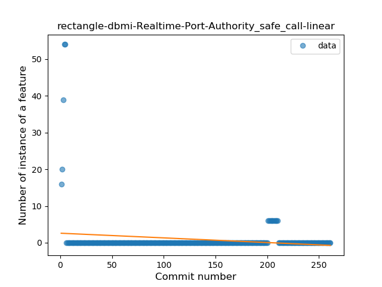
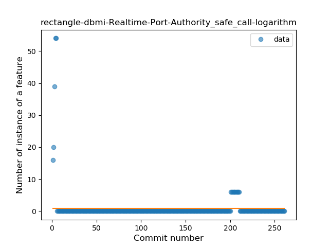
### <a name="when_expr">When expression</a>
----
#### Functions
* **Plateau Sudden Decline - Binary Sigmoid:** 
    * **R_Squared:** 0.56475819
* **Sudden Decline - Exponential:** 
    * **R_Squared:** 0.45826422
* **Constant Decline - Linear:** 
    * **R_Squared:** 0.00159802
* **Sudden Rise Plateau - Logarithm:** 
    * **R_Squared:** -0.0

**Plots** :chart_with_upwards_trend:
-----

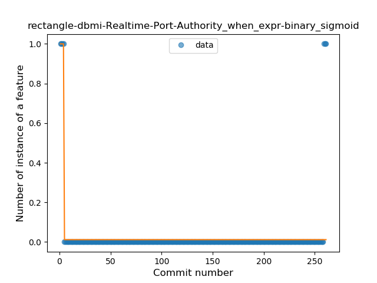
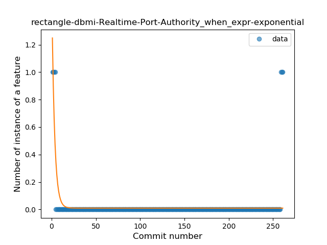
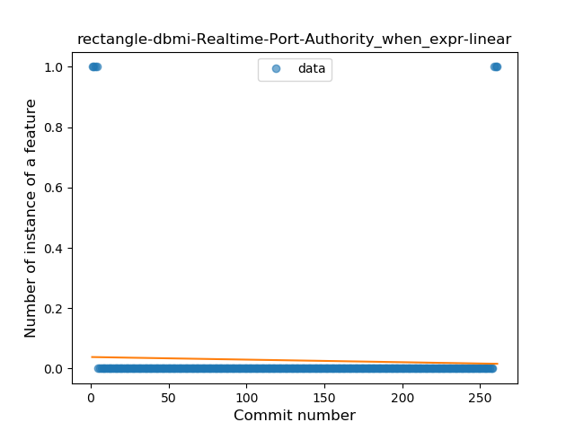
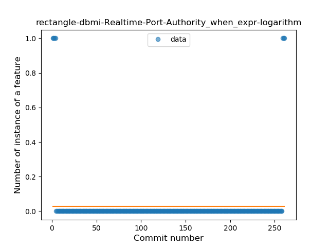
### <a name="companion_object">Companion Object</a>
----
#### Functions
* **Plateau Sudden Decline - Binary Sigmoid:** 
    * **R_Squared:** 0.66244322
* **Sudden Decline - Exponential:** 
    * **R_Squared:** 0.53201941
* **Constant Decline - Linear:** 
    * **R_Squared:** 0.00678618
* **Sudden Rise Plateau - Logarithm:** 
    * **R_Squared:** -0.0

**Plots** :chart_with_upwards_trend:
-----

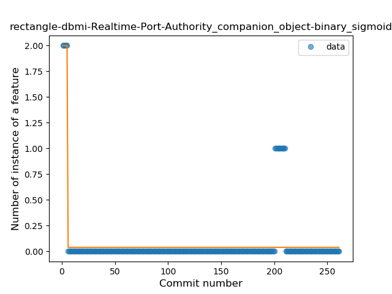
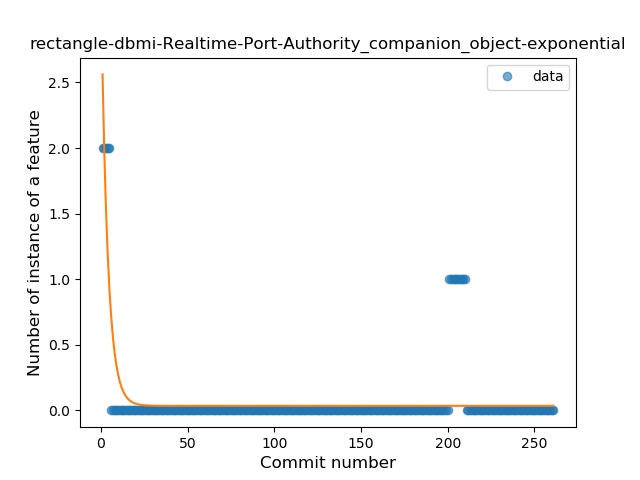
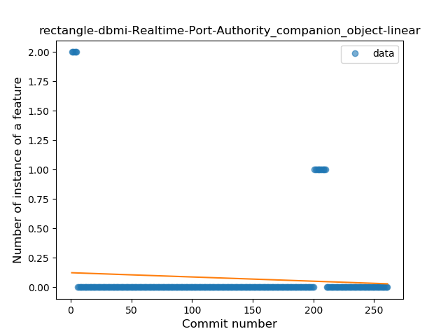
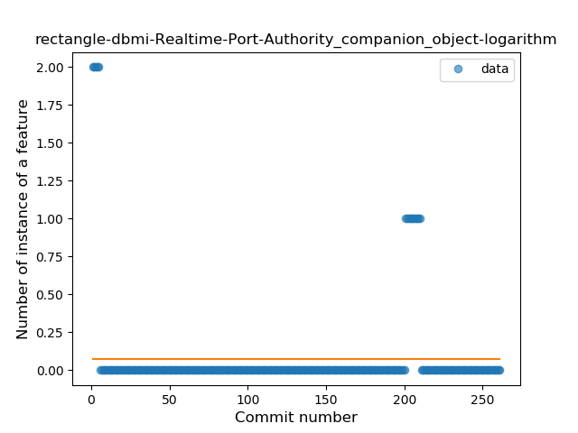
### <a name="unsafe_call">Unsafe Call</a>
----
#### Functions
* **Sudden Rise - Exponential:** 
    * **R_Squared:** 0.13593605
* **Plateau Sudden Decline - Binary Sigmoid:** 
    * **R_Squared:** 0.09052121
* **Constant Rise - Linear:** 
    * **R_Squared:** 6.219e-05
* **Sudden Rise Plateau - Logarithm:** 
    * **R_Squared:** -0.0

**Plots** :chart_with_upwards_trend:
-----

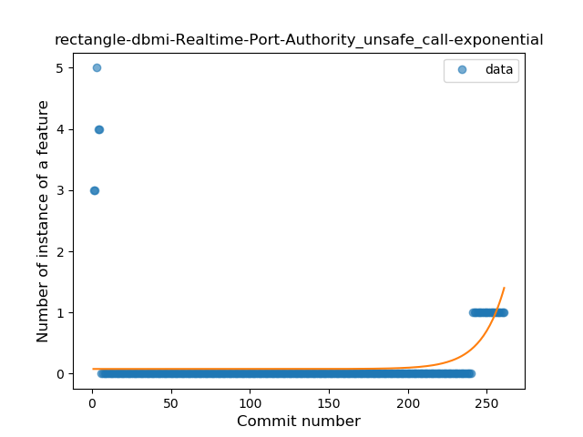
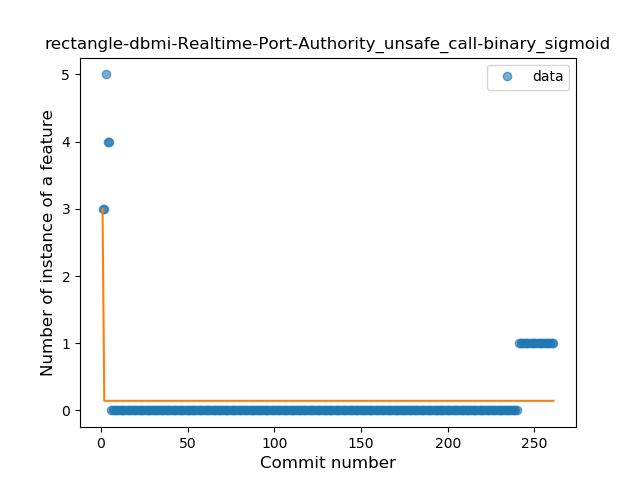
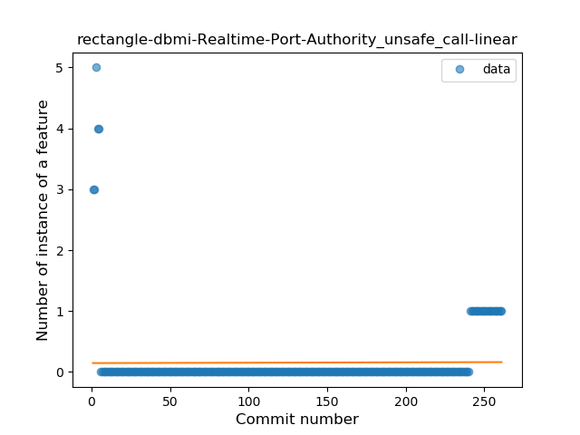
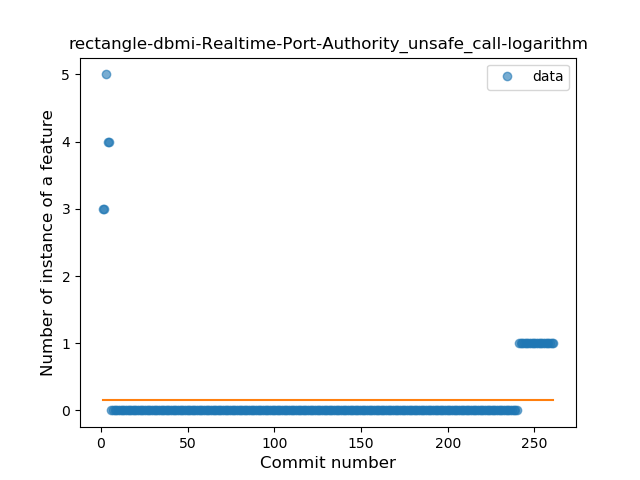
### <a name="string_template">String Template</a>
----
#### Functions
* **Sudden Rise - Exponential:** 
    * **R_Squared:** 0.16352949
* **Constant Rise - Linear:** 
    * **R_Squared:** 0.00716816
* **Sudden Rise Plateau - Logarithm:** 
    * **R_Squared:** -0.0

**Plots** :chart_with_upwards_trend:
-----

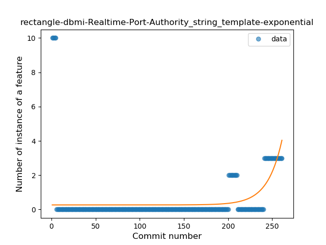
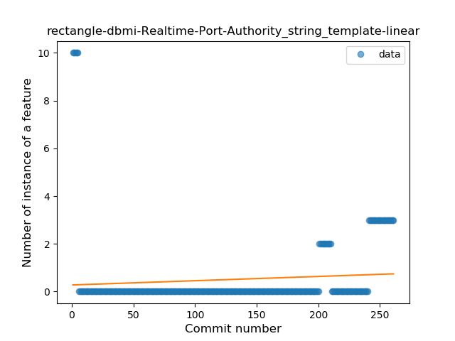

### <a name="func_with_default_value">Function with Default Value</a>
----
#### Functions
* **Plateau Sudden Decline - Binary Sigmoid:** 
    * **R_Squared:** 1.0
* **Sudden Decline - Exponential:** 
    * **R_Squared:** 0.78618206
* **Constant Decline - Linear:** 
    * **R_Squared:** 0.41129032
* **Sudden Rise Plateau - Logarithm:** 
    * **R_Squared:** 0.0

**Plots** :chart_with_upwards_trend:
-----

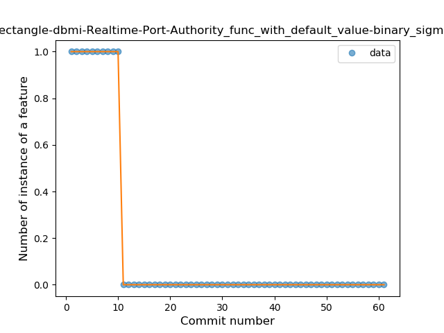
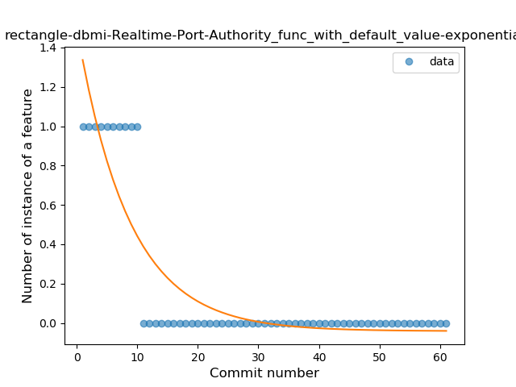
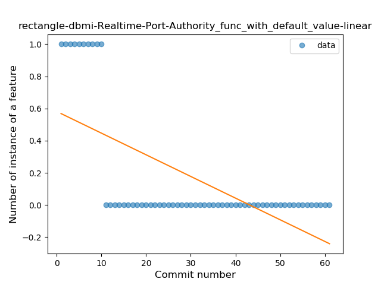
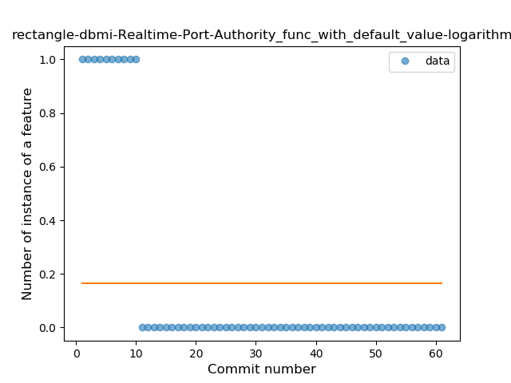
### <a name="singleton">Singleton</a>
----
#### Functions
* **Plateau Sudden Decline - Binary Sigmoid:** 
    * **R_Squared:** 1.0
* **Sudden Decline - Exponential:** 
    * **R_Squared:** 0.78618206
* **Constant Decline - Linear:** 
    * **R_Squared:** 0.41129032
* **Sudden Rise Plateau - Logarithm:** 
    * **R_Squared:** 0.0

**Plots** :chart_with_upwards_trend:
-----

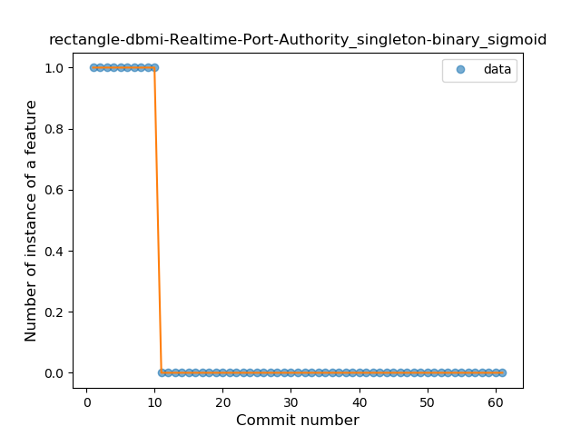
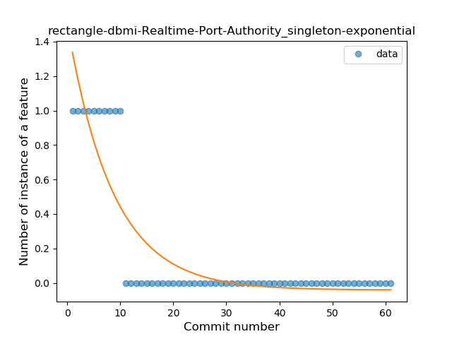
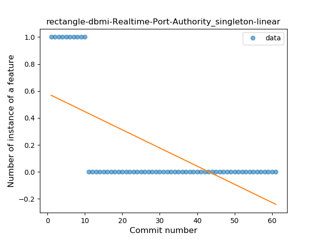
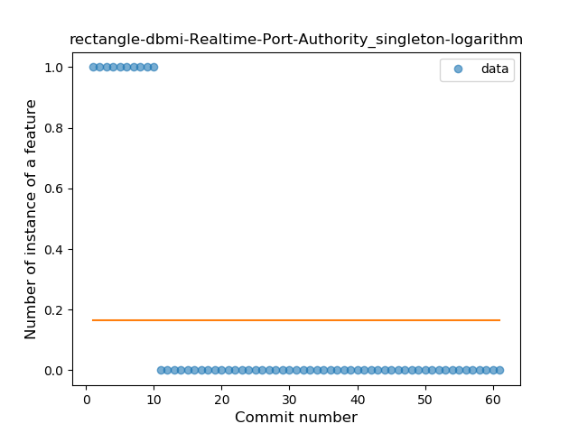
### <a name="smart_cast">Smart Cast</a>
----
#### Functions
* **Plateau Sudden Decline - Binary Sigmoid:** 
    * **R_Squared:** 1.0
* **Sudden Decline - Exponential:** 
    * **R_Squared:** 0.81571769
* **Constant Decline - Linear:** 
    * **R_Squared:** 0.05637111
* **Sudden Rise Plateau - Logarithm:** 
    * **R_Squared:** -0.0

**Plots** :chart_with_upwards_trend:
-----

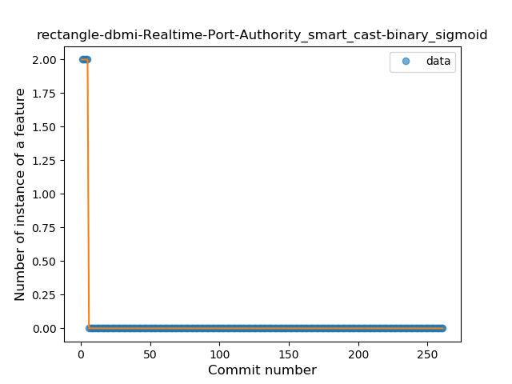
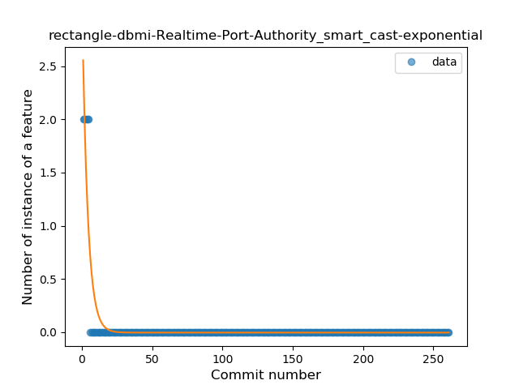
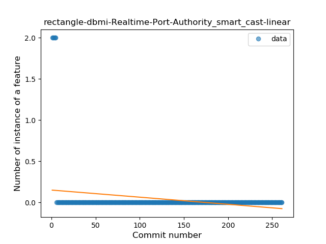
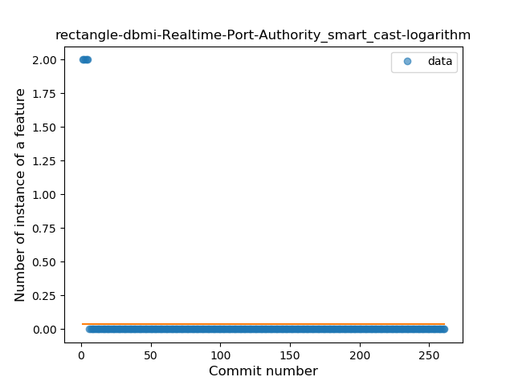
### <a name="func_call_with_named_arg">Function call with Named Argument</a>
----
#### Functions
* **Sudden Rise - Exponential:** 
    * **R_Squared:** 0.82483785
* **Constant Rise - Linear:** 
    * **R_Squared:** 0.03374091
* **Plateau Sudden Rise - Binary Sigmoid:** 
    * **R_Squared:** 0.02287322
* **Sudden Rise Plateau - Logarithm:** 
    * **R_Squared:** 0.00463528

**Plots** :chart_with_upwards_trend:
-----

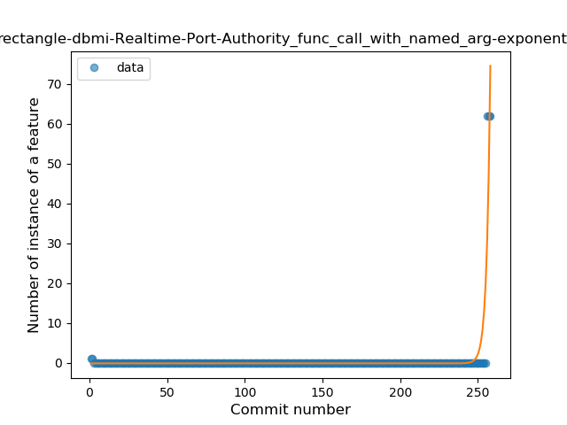
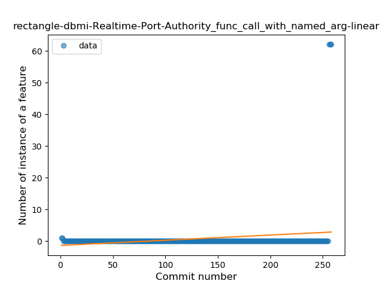

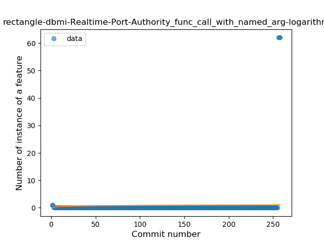
### <a name="extension_function">Extension Function</a>
----
#### Functions
* **Plateau Sudden Decline - Binary Sigmoid:** 
    * **R_Squared:** 0.96242686
* **Instability - Polinomial 3:** )
    * **R_Squared:** 0.78587625
* **Sudden Decline - Exponential:** 
    * **R_Squared:** 0.73995573
* **Constant Decline - Linear:** 
    * **R_Squared:** 0.32348421
* **Sudden Rise Plateau - Logarithm:** 
    * **R_Squared:** -0.0

**Plots** :chart_with_upwards_trend:
-----

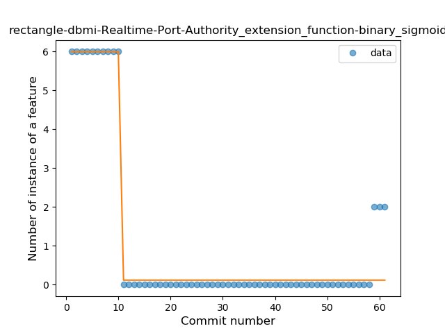
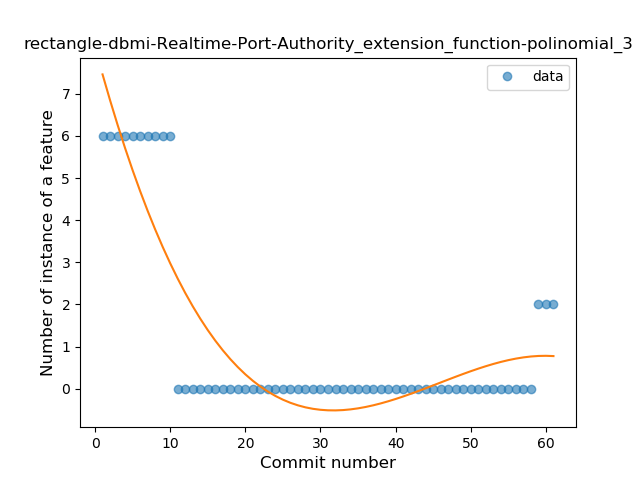
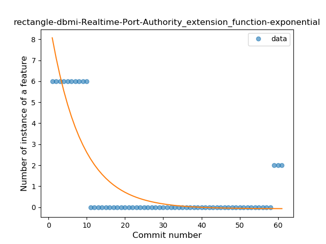
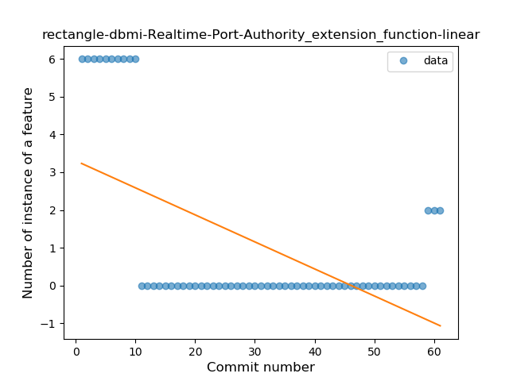
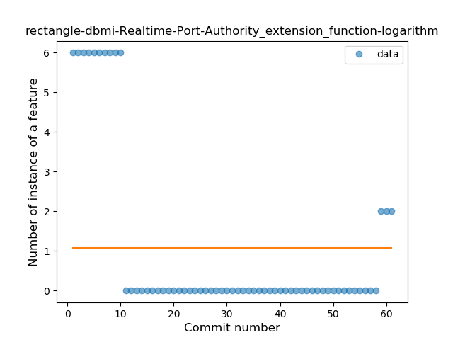
