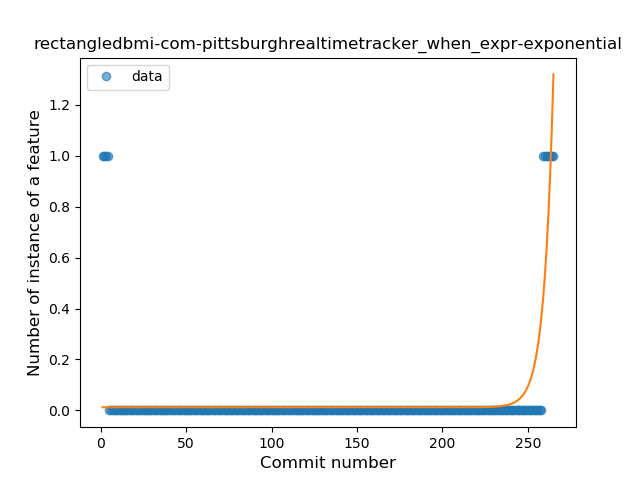
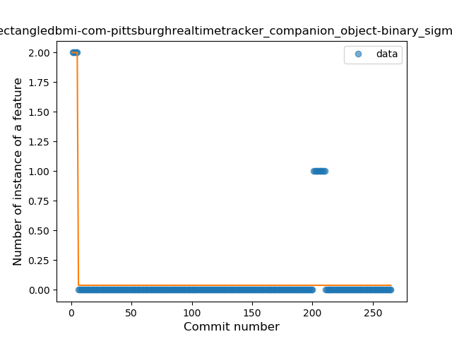
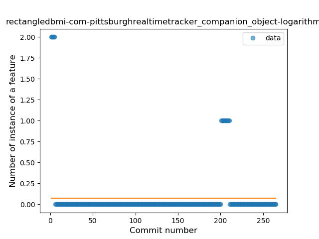
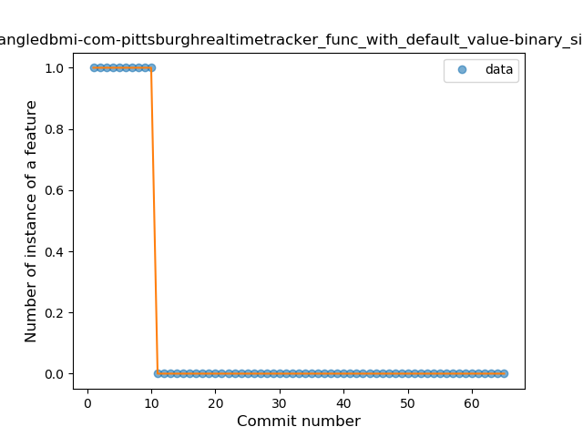
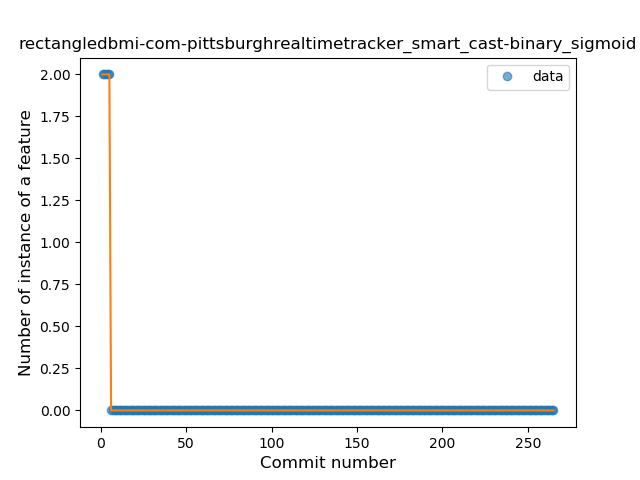

## rectangledbmi-com-pittsburghrealtimetracker
----
#### Metrics provided by Detekt
* Number of lines of code 726
* Number of Kotlin files: 11
* Cyclomatic complexity: 52
* Cyclomatic complexity by thousands of lines: 144 

----
**12** features analyzed

*	<a href="#type_inference">Type Inference</a> 
*	<a href="#lambda">Lambda</a> 
*	<a href="#safe_call">Safe Call</a> 
*	<a href="#when_expr">When expression</a> 
*	<a href="#unsafe_call">Unsafe Call</a> 
*	<a href="#companion_object">Companion Object</a> 
*	<a href="#string_template">String Template</a> 
*	<a href="#func_with_default_value">Function with Default Value</a> 
*	<a href="#singleton">Singleton</a> 
*	<a href="#smart_cast">Smart Cast</a> 
*	<a href="#func_call_with_named_arg">Function call with Named Argument</a> 
*	<a href="#extension_function">Extension Function</a> 

### <a name="type_inference">Type Inference</a>
----
#### Functions
* **Sudden Rise - Exponential:** 
    * **R_Squared:** 0.55028338
* **Constant Rise - Linear:** 
    * **R_Squared:** 0.20003393
* **Sudden Rise Plateau - Logarithm:** 
    * **R_Squared:** 0.02509305

**Plots** :chart_with_upwards_trend:
-----

### <a name="lambda">Lambda</a>
----
#### Functions
* **Sudden Rise - Exponential:** 
    * **R_Squared:** 0.67092612
* **Constant Rise - Linear:** 
    * **R_Squared:** 0.1602046
* **Sudden Rise Plateau - Logarithm:** 
    * **R_Squared:** 0.01043875

**Plots** :chart_with_upwards_trend:
-----

### <a name="safe_call">Safe Call</a>
----
#### Functions
* **Sudden Decline - Exponential:** 
    * **R_Squared:** 0.48686707
* **Plateau Sudden Decline - Binary Sigmoid:** 
    * **R_Squared:** 0.34811453
* **Constant Decline - Linear:** 
    * **R_Squared:** 0.02957739
* **Sudden Rise Plateau - Logarithm:** 
    * **R_Squared:** -0.0

**Plots** :chart_with_upwards_trend:
-----

### <a name="when_expr">When expression</a>
----
#### Functions
* **Sudden Rise - Exponential:** 
    * **R_Squared:** 0.50248137
* **Plateau Sudden Decline - Binary Sigmoid:** 
    * **R_Squared:** 0.35388366
* **Constant Rise - Linear:** 
    * **R_Squared:** 0.00887808
* **Sudden Rise Plateau - Logarithm:** 
    * **R_Squared:** -0.0

**Plots** :chart_with_upwards_trend:
-----

### <a name="unsafe_call">Unsafe Call</a>
----
#### Functions
* **Plateau Sudden Decline - Binary Sigmoid:** 
    * **R_Squared:** 0.56278045
* **Sudden Rise - Exponential:** 
    * **R_Squared:** 0.15370835
* **Constant Rise - Linear:** 
    * **R_Squared:** 0.00197629
* **Sudden Rise Plateau - Logarithm:** 
    * **R_Squared:** -0.0

**Plots** :chart_with_upwards_trend:
-----

### <a name="companion_object">Companion Object</a>
----
#### Functions
* **Plateau Sudden Decline - Binary Sigmoid:** 
    * **R_Squared:** 0.66250637
* **Sudden Decline - Exponential:** 
    * **R_Squared:** 0.53223226
* **Constant Decline - Linear:** 
    * **R_Squared:** 0.00748315
* **Sudden Rise Plateau - Logarithm:** 
    * **R_Squared:** -0.0

**Plots** :chart_with_upwards_trend:
-----

### <a name="string_template">String Template</a>
----
#### Functions
* **Sudden Rise - Exponential:** 
    * **R_Squared:** 0.1856736
* **Constant Rise - Linear:** 
    * **R_Squared:** 0.01467354
* **Sudden Rise Plateau - Logarithm:** 
    * **R_Squared:** -0.0

**Plots** :chart_with_upwards_trend:
-----

### <a name="func_with_default_value">Function with Default Value</a>
----
#### Functions
* **Plateau Sudden Decline - Binary Sigmoid:** 
    * **R_Squared:** 1.0
* **Sudden Decline - Exponential:** 
    * **R_Squared:** 0.78803508
* **Constant Decline - Linear:** 
    * **R_Squared:** 0.390625
* **Sudden Rise Plateau - Logarithm:** 
    * **R_Squared:** -0.0

**Plots** :chart_with_upwards_trend:
-----

### <a name="singleton">Singleton</a>
----
#### Functions
* **Plateau Sudden Decline - Binary Sigmoid:** 
    * **R_Squared:** 1.0
* **Sudden Decline - Exponential:** 
    * **R_Squared:** 0.78803508
* **Constant Decline - Linear:** 
    * **R_Squared:** 0.390625
* **Sudden Rise Plateau - Logarithm:** 
    * **R_Squared:** -0.0

**Plots** :chart_with_upwards_trend:
-----

### <a name="smart_cast">Smart Cast</a>
----
#### Functions
* **Plateau Sudden Decline - Binary Sigmoid:** 
    * **R_Squared:** 1.0
* **Sudden Decline - Exponential:** 
    * **R_Squared:** 0.8157659
* **Constant Decline - Linear:** 
    * **R_Squared:** 0.05553657
* **Sudden Rise Plateau - Logarithm:** 
    * **R_Squared:** 0.0

**Plots** :chart_with_upwards_trend:
-----

### <a name="func_call_with_named_arg">Function call with Named Argument</a>
----
#### Functions
* **Plateau Sudden Rise - Binary Sigmoid:** 
    * **R_Squared:** 0.99992422
* **Sudden Rise - Exponential:** 
    * **R_Squared:** 0.81211245
* **Constant Rise - Linear:** 
    * **R_Squared:** 0.07729464
* **Sudden Rise Plateau - Logarithm:** 
    * **R_Squared:** 0.01098664

**Plots** :chart_with_upwards_trend:
-----

### <a name="extension_function">Extension Function</a>
----
#### Functions
* **Plateau Sudden Decline - Binary Sigmoid:** 
    * **R_Squared:** 0.91955208
* **Sudden Decline - Exponential:** 
    * **R_Squared:** 0.69227583
* **Constant Decline - Linear:** 
    * **R_Squared:** 0.22267064
* **Sudden Rise Plateau - Logarithm:** 
    * **R_Squared:** 0.0

**Plots** :chart_with_upwards_trend:
-----

