## romannurik-muzei
----
#### Metrics provided by Detekt
* Number of lines of code 19843
* Number of Kotlin files: 142
* Cyclomatic complexity: 2480
* Cyclomatic complexity by thousands of lines: 242 

----
**16** features analyzed

*	<a href="#type_inference">Type Inference</a> 
*	<a href="#lambda">Lambda</a> 
*	<a href="#safe_call">Safe Call</a> 
*	<a href="#when_expr">When expression</a> 
*	<a href="#companion_object">Companion Object</a> 
*	<a href="#unsafe_call">Unsafe Call</a> 
*	<a href="#string_template">String Template</a> 
*	<a href="#func_with_default_value">Function with Default Value</a> 
*	<a href="#singleton">Singleton</a> 
*	<a href="#smart_cast">Smart Cast</a> 
*	<a href="#range_expr">Range Expression</a> 
*	<a href="#func_call_with_named_arg">Function call with Named Argument</a> 
*	<a href="#data_class">Data Class</a> 
*	<a href="#extension_function">Extension Function</a> 
*	<a href="#property_delegation">Property Delegation</a> 
*	<a href="#destructuring_declaration">Destructuring Declaration</a> 

### <a name="type_inference">Type Inference</a>
----
#### Functions
* **Sudden Rise Plateau - Logarithm:** 
    * **R_Squared:** 0.77572931
* **Plateau Gradual Rise - Sigmoid:** 
    * **R_Squared:** 0.75767604
* **Constant Rise - Linear:** 
    * **R_Squared:** 0.7301981

**Plots** :chart_with_upwards_trend:
-----

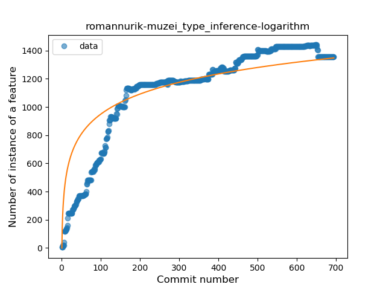

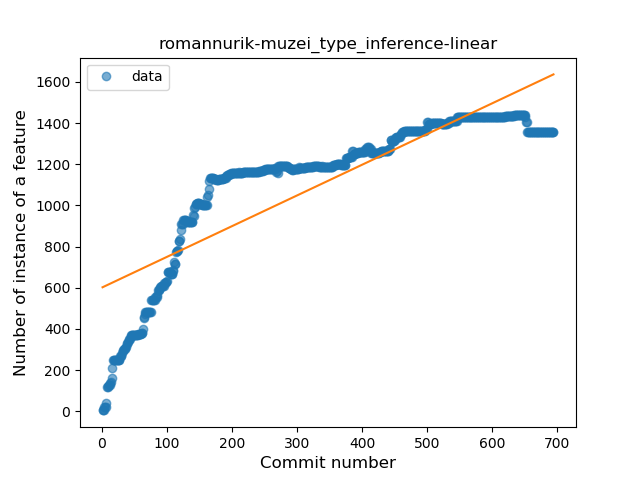
### <a name="lambda">Lambda</a>
----
#### Functions
* **Constant Rise - Linear:** 
    * **R_Squared:** 0.92478072
* **Sudden Rise Plateau - Logarithm:** 
    * **R_Squared:** 0.68891878
* **Plateau Sudden Rise - Binary Sigmoid:** 
    * **R_Squared:** 0.67814984

**Plots** :chart_with_upwards_trend:
-----

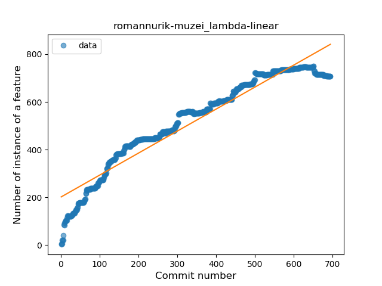
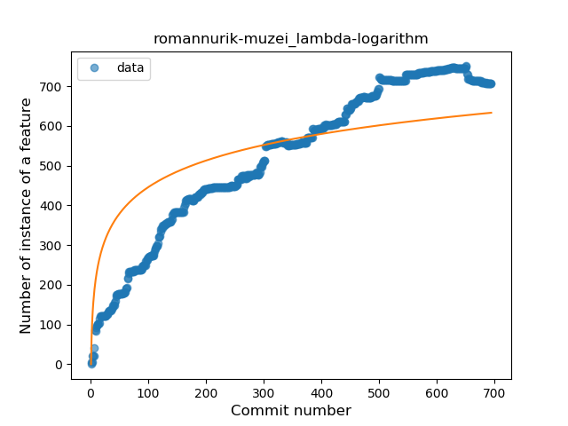
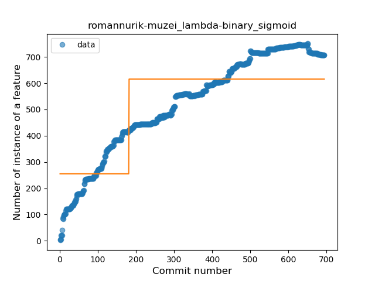
### <a name="safe_call">Safe Call</a>
----
#### Functions
* **Constant Rise - Linear:** 
    * **R_Squared:** 0.80317334
* **Sudden Rise Plateau - Logarithm:** 
    * **R_Squared:** 0.79522212
* **Plateau Sudden Rise - Binary Sigmoid:** 
    * **R_Squared:** 0.52822728

**Plots** :chart_with_upwards_trend:
-----

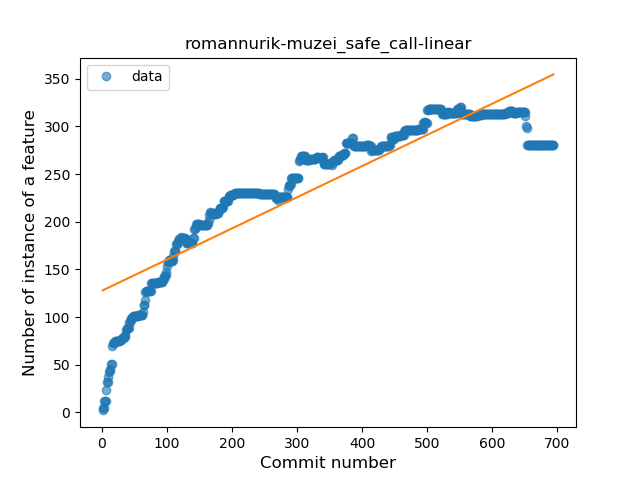
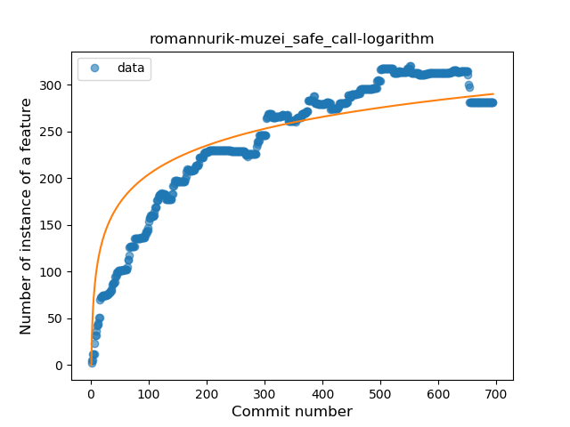
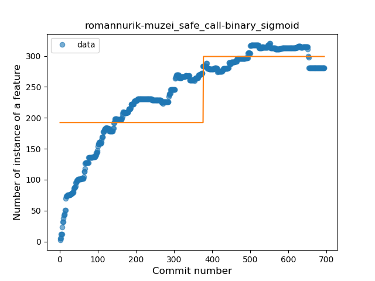
### <a name="when_expr">When expression</a>
----
#### Functions
* **Constant Rise - Linear:** 
    * **R_Squared:** 0.85101341
* **Sudden Rise Plateau - Logarithm:** 
    * **R_Squared:** 0.70567347

**Plots** :chart_with_upwards_trend:
-----

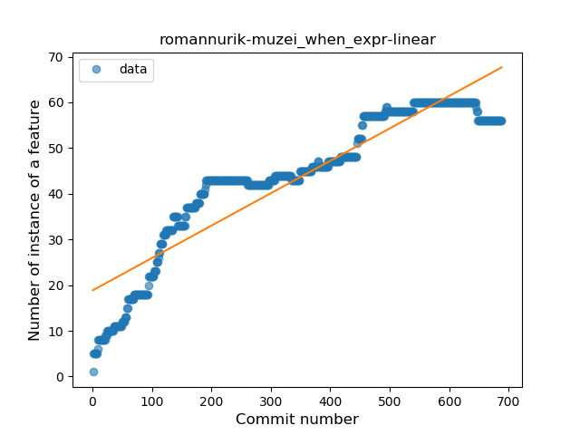
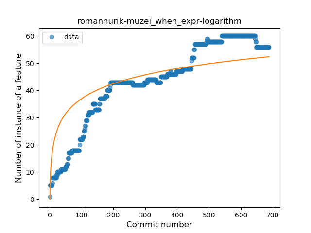
### <a name="companion_object">Companion Object</a>
----
#### Functions
* **Sudden Rise Plateau - Logarithm:** 
    * **R_Squared:** 0.81110834
* **Constant Rise - Linear:** 
    * **R_Squared:** 0.77054637
* **Plateau Sudden Rise - Binary Sigmoid:** 
    * **R_Squared:** 0.20447604

**Plots** :chart_with_upwards_trend:
-----

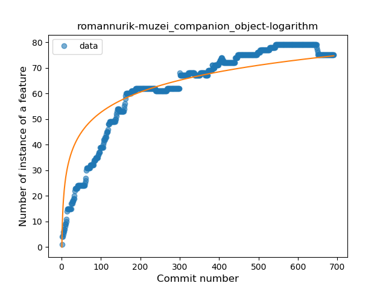
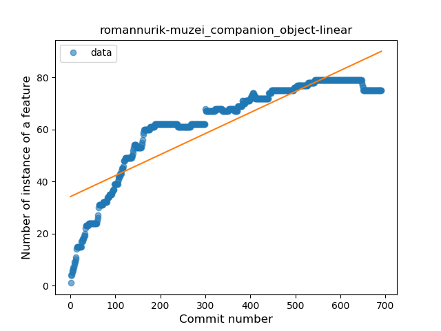
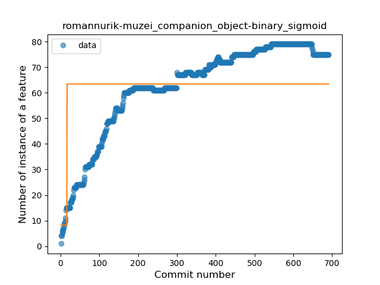
### <a name="unsafe_call">Unsafe Call</a>
----
#### Functions
* **Sudden Decline - Exponential:** 
    * **R_Squared:** 0.22398619
* **Constant Decline - Linear:** 
    * **R_Squared:** 0.09981223
* **Sudden Rise Plateau - Logarithm:** 
    * **R_Squared:** 0.0

**Plots** :chart_with_upwards_trend:
-----

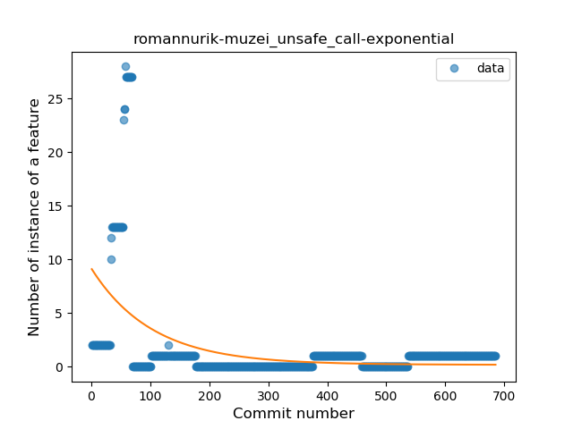
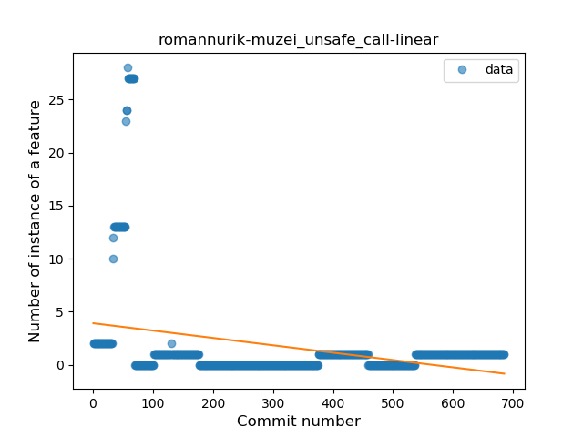
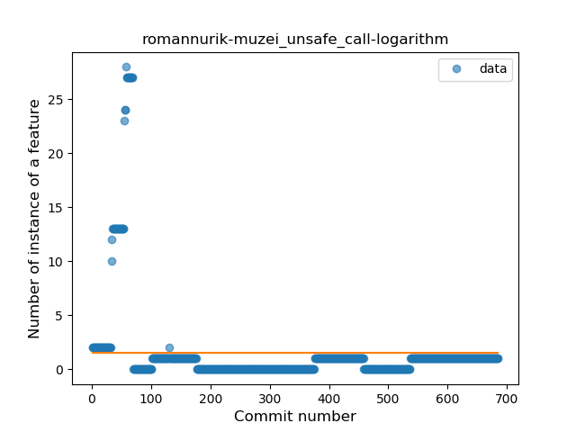
### <a name="string_template">String Template</a>
----
#### Functions
* **Constant Rise - Linear:** 
    * **R_Squared:** 0.84318544
* **Plateau Sudden Rise - Binary Sigmoid:** 
    * **R_Squared:** 0.78971377
* **Sudden Rise Plateau - Logarithm:** 
    * **R_Squared:** 0.68928626

**Plots** :chart_with_upwards_trend:
-----

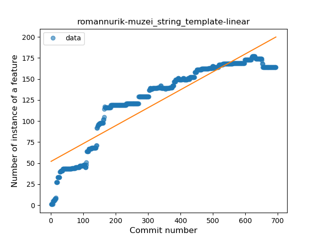
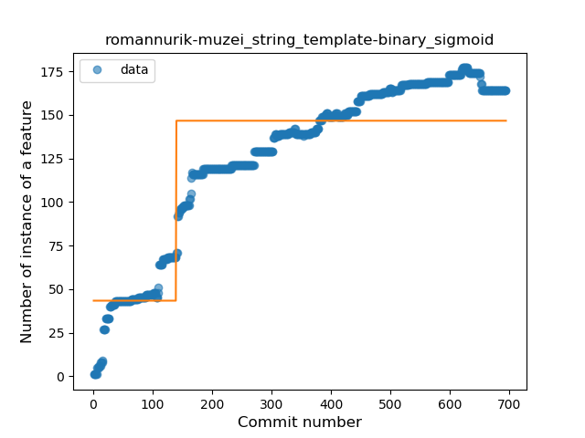
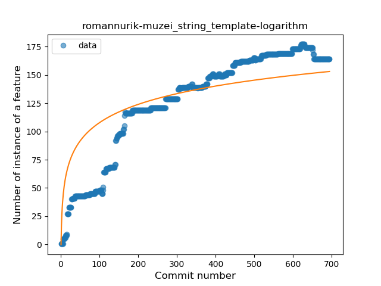
### <a name="func_with_default_value">Function with Default Value</a>
----
#### Functions
* **Sudden Rise Plateau - Logarithm:** 
    * **R_Squared:** 0.72831155
* **Constant Rise - Linear:** 
    * **R_Squared:** 0.69952195
* **Plateau Sudden Rise - Binary Sigmoid:** 
    * **R_Squared:** 0.40385558

**Plots** :chart_with_upwards_trend:
-----

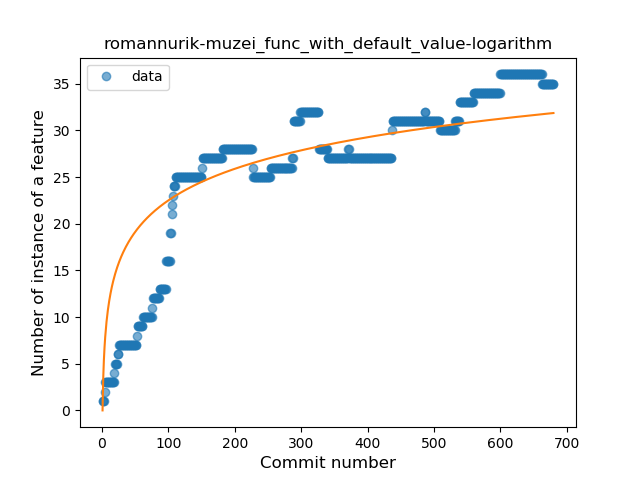
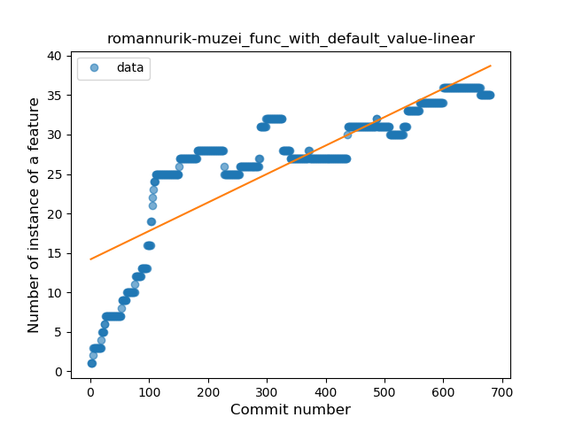
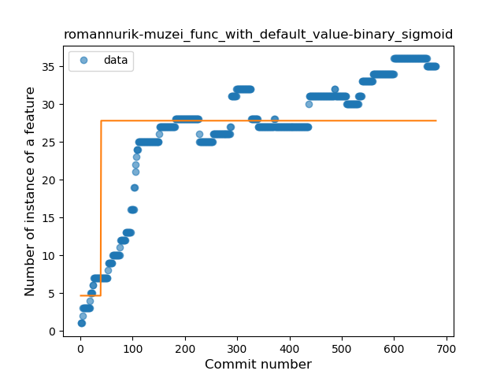
### <a name="singleton">Singleton</a>
----
#### Functions
* **Sudden Rise Plateau - Logarithm:** 
    * **R_Squared:** 0.38648367
* **Constant Rise - Linear:** 
    * **R_Squared:** 0.18402978
* **Plateau Sudden Rise - Binary Sigmoid:** 
    * **R_Squared:** 0.05624299

**Plots** :chart_with_upwards_trend:
-----

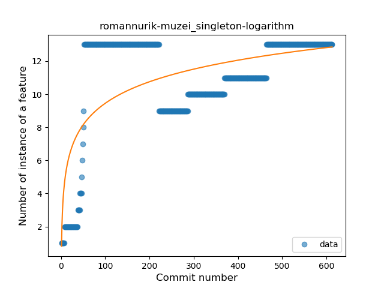
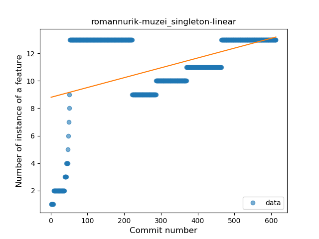
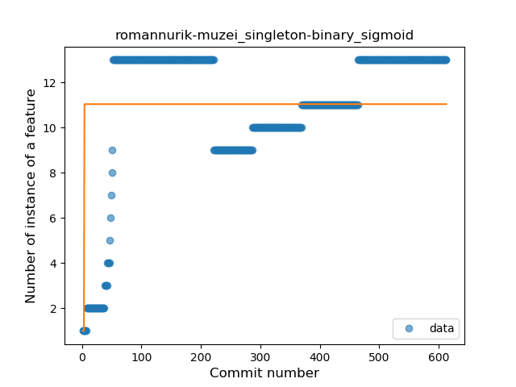
### <a name="smart_cast">Smart Cast</a>
----
#### Functions
* **Sudden Rise - Exponential:** 
    * **R_Squared:** 0.87513442
* **Constant Rise - Linear:** 
    * **R_Squared:** 0.80654243
* **Sudden Rise Plateau - Logarithm:** 
    * **R_Squared:** 0.40092224

**Plots** :chart_with_upwards_trend:
-----

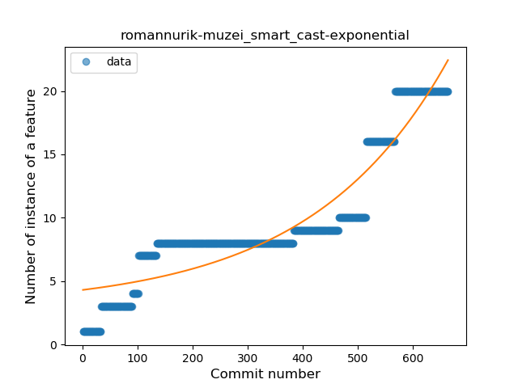
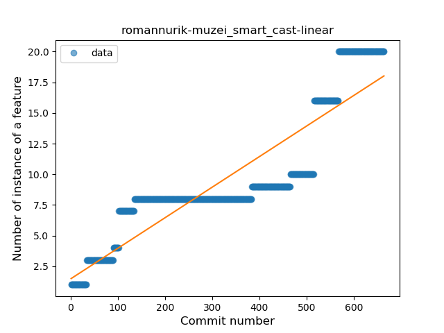
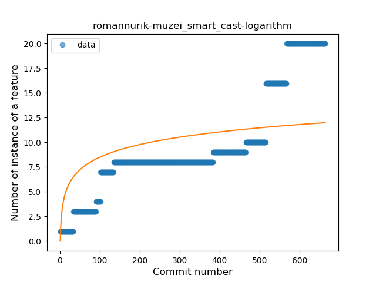
### <a name="range_expr">Range Expression</a>
----
#### Functions
* **Sudden Rise Plateau - Logarithm:** 
    * **R_Squared:** 0.58025456
* **Plateau Sudden Rise - Binary Sigmoid:** 
    * **R_Squared:** 0.2700669
* **Constant Rise - Linear:** 
    * **R_Squared:** 0.22254684

**Plots** :chart_with_upwards_trend:
-----

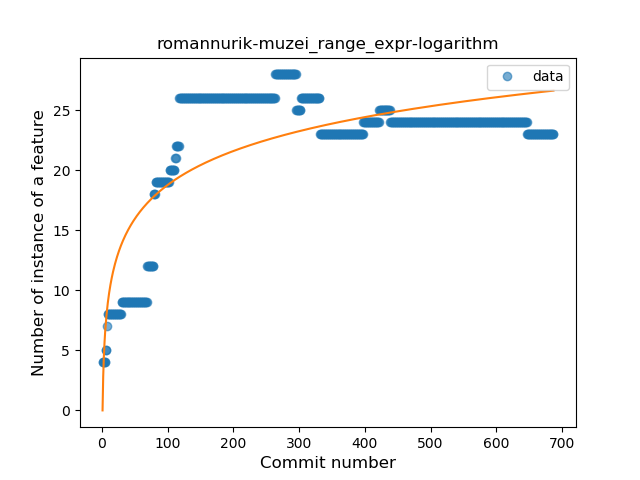
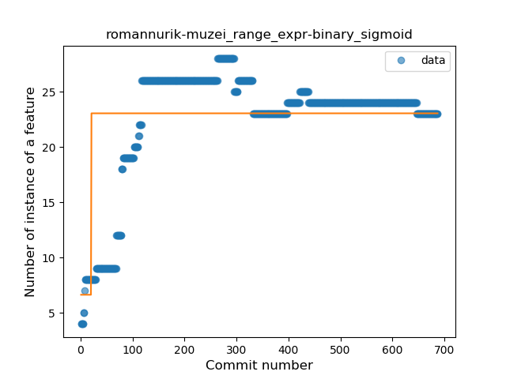

### <a name="func_call_with_named_arg">Function call with Named Argument</a>
----
#### Functions
* **Constant Rise - Linear:** 
    * **R_Squared:** 0.86439589
* **Sudden Rise Plateau - Logarithm:** 
    * **R_Squared:** 0.58700026

**Plots** :chart_with_upwards_trend:
-----

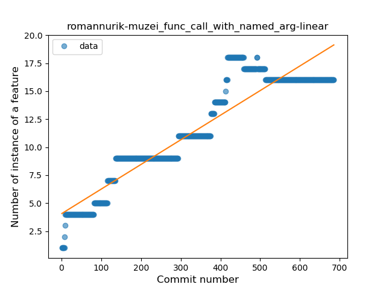
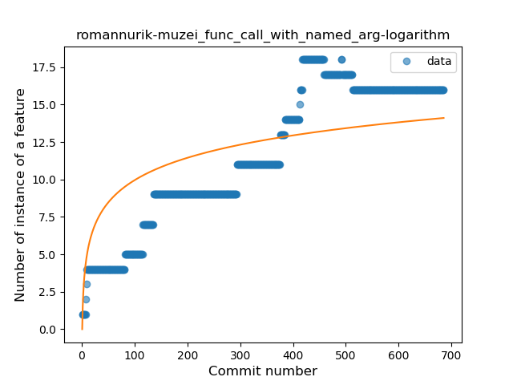
### <a name="data_class">Data Class</a>
----
#### Functions
* **Plateau Gradual Rise - Sigmoid:** 
    * **R_Squared:** 0.93566836
* **Constant Rise - Linear:** 
    * **R_Squared:** 0.78759632
* **Sudden Rise Plateau - Logarithm:** 
    * **R_Squared:** 0.65771392

**Plots** :chart_with_upwards_trend:
-----

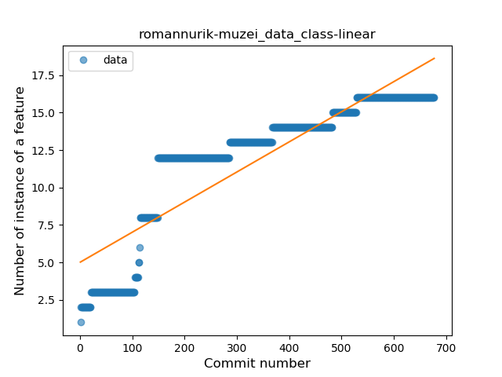
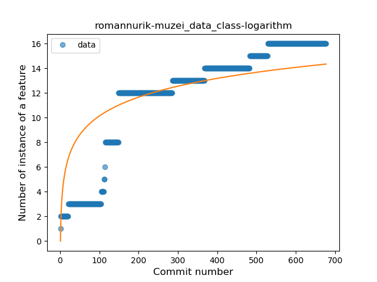
### <a name="extension_function">Extension Function</a>
----
#### Functions
* **Constant Rise - Linear:** 
    * **R_Squared:** 0.80404671
* **Sudden Rise Plateau - Logarithm:** 
    * **R_Squared:** 0.69423165
* **Plateau Sudden Rise - Binary Sigmoid:** 
    * **R_Squared:** 0.22822936

**Plots** :chart_with_upwards_trend:
-----

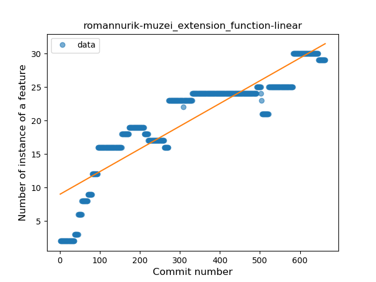
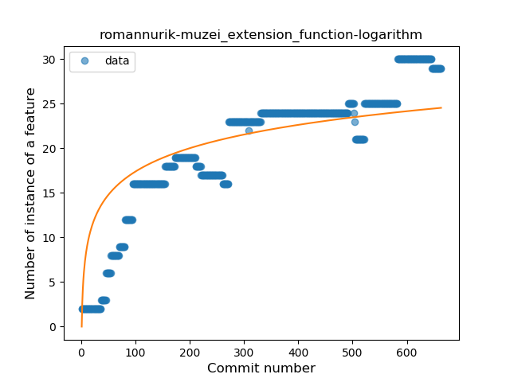
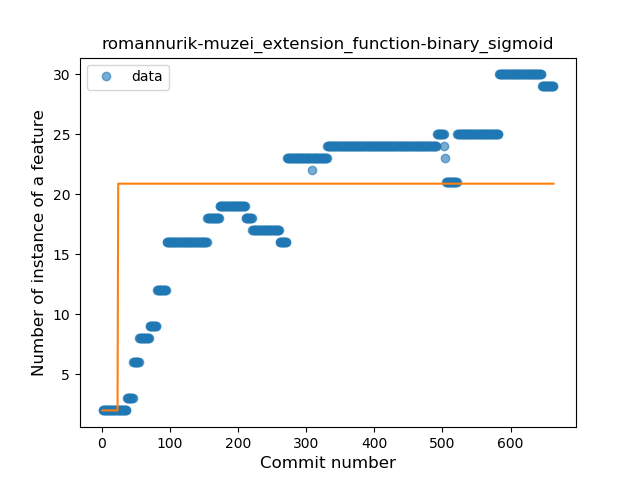
### <a name="property_delegation">Property Delegation</a>
----
#### Functions
* **Sudden Rise Plateau - Logarithm:** 
    * **R_Squared:** 0.78197679
* **Constant Rise - Linear:** 
    * **R_Squared:** 0.74686235

**Plots** :chart_with_upwards_trend:
-----

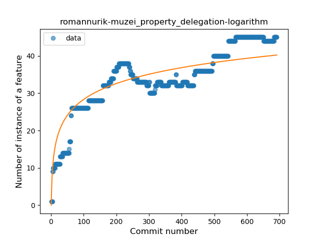
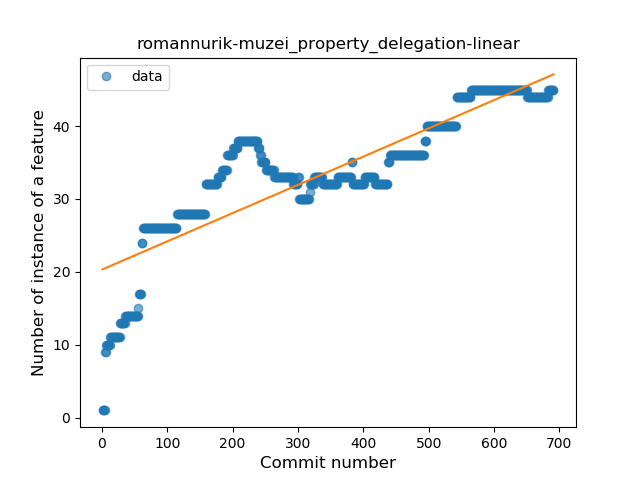
### <a name="destructuring_declaration">Destructuring Declaration</a>
----
#### Functions
* **Plateau Gradual Rise - Sigmoid:** 
    * **R_Squared:** 0.9281853
* **Constant Rise - Linear:** 
    * **R_Squared:** 0.79054392
* **Sudden Rise Plateau - Logarithm:** 
    * **R_Squared:** 0.46416371

**Plots** :chart_with_upwards_trend:
-----

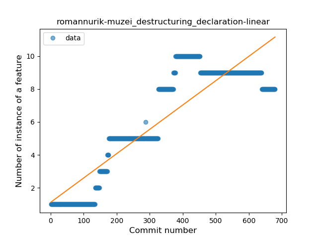

