## ronocod-bus
----
#### Metrics provided by Detekt
* Number of lines of code 518
* Number of Kotlin files: 12
* Cyclomatic complexity: 49
* Cyclomatic complexity by thousands of lines: 180 

----
**14** features analyzed

*	<a href="#type_inference">Type Inference</a> 
*	<a href="#lambda">Lambda</a> 
*	<a href="#safe_call">Safe Call</a> 
*	<a href="#when_expr">When expression</a> 
*	<a href="#companion_object">Companion Object</a> 
*	<a href="#unsafe_call">Unsafe Call</a> 
*	<a href="#string_template">String Template</a> 
*	<a href="#func_with_default_value">Function with Default Value</a> 
*	<a href="#singleton">Singleton</a> 
*	<a href="#func_call_with_named_arg">Function call with Named Argument</a> 
*	<a href="#data_class">Data Class</a> 
*	<a href="#extension_function">Extension Function</a> 
*	<a href="#property_delegation">Property Delegation</a> 
*	<a href="#inline_func">Inline Function</a> 

### <a name="type_inference">Type Inference</a>
----
#### Functions
* **Instability - Polinomial 3:** )
    * **R_Squared:** 0.75126673
* **Constant Decline - Linear:** 
    * **R_Squared:** 0.09534166
* **Sudden Rise Plateau - Logarithm:** 
    * **R_Squared:** 0.00261497

**Plots** :chart_with_upwards_trend:
-----

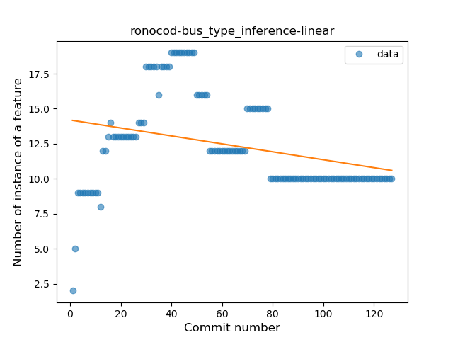
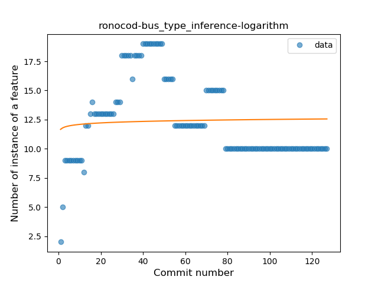
### <a name="lambda">Lambda</a>
----
#### Functions
* **Instability - Polinomial 3:** )
    * **R_Squared:** 0.78351518
* **Sudden Rise Plateau - Logarithm:** 
    * **R_Squared:** 0.71691884
* **Plateau Gradual Rise - Sigmoid:** 
    * **R_Squared:** 0.39457774
* **Constant Rise - Linear:** 
    * **R_Squared:** 0.37806023

**Plots** :chart_with_upwards_trend:
-----

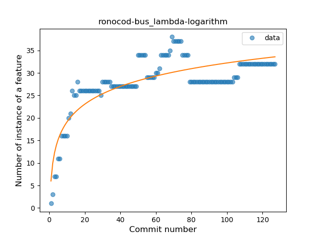
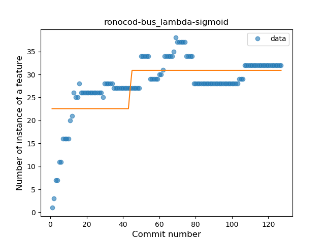
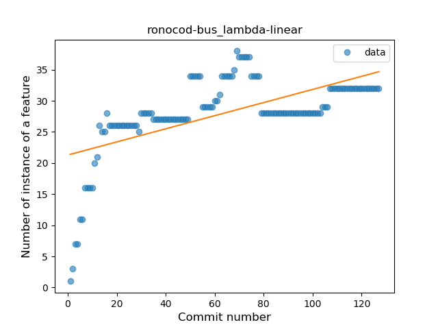
### <a name="safe_call">Safe Call</a>
----
#### Functions
* **Plateau Gradual Rise - Sigmoid:** 
    * **R_Squared:** 0.90748217
* **Constant Rise - Linear:** 
    * **R_Squared:** 0.76059152
* **Sudden Rise Plateau - Logarithm:** 
    * **R_Squared:** 0.54145067

**Plots** :chart_with_upwards_trend:
-----

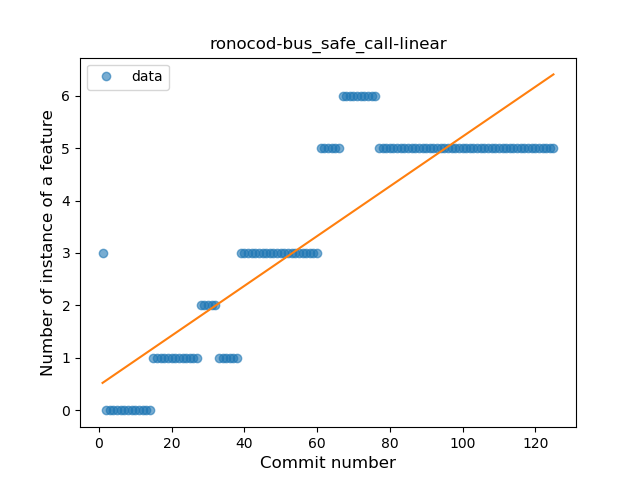
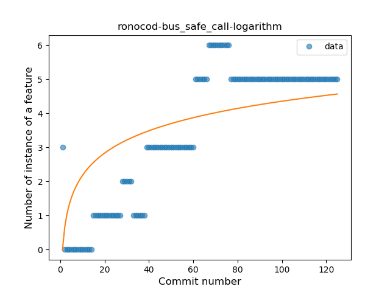
### <a name="when_expr">When expression</a>
----
#### Functions
* **Plateau Sudden Decline - Binary Sigmoid:** 
    * **R_Squared:** 0.87553844
* **Sudden Decline - Exponential:** 
    * **R_Squared:** 0.63247125
* **Constant Decline - Linear:** 
    * **R_Squared:** 0.45278445
* **Sudden Rise Plateau - Logarithm:** 
    * **R_Squared:** -0.0

**Plots** :chart_with_upwards_trend:
-----

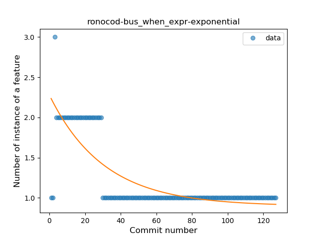
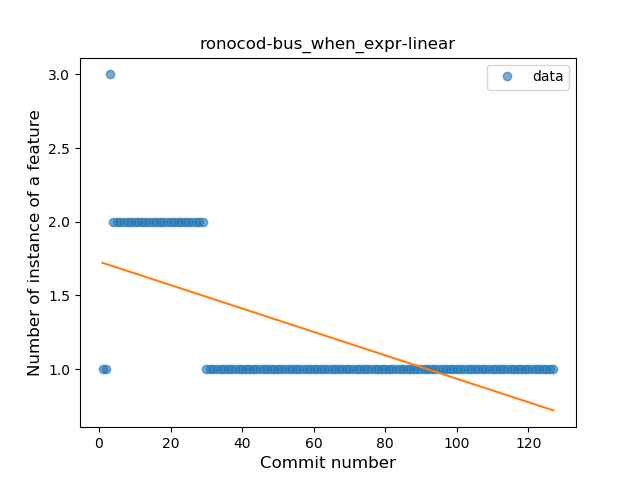
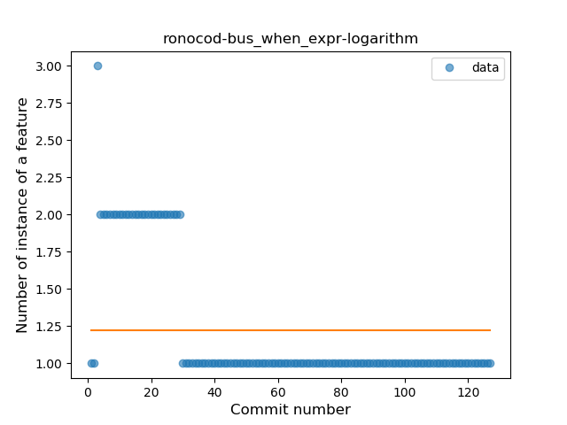
### <a name="companion_object">Companion Object</a>
----
#### Functions
* **Plateau Sudden Decline - Binary Sigmoid:** 
    * **R_Squared:** 1.0
* **Sudden Decline - Exponential:** 
    * **R_Squared:** 0.76962334
* **Constant Decline - Linear:** 
    * **R_Squared:** 0.57013433
* **Sudden Rise Plateau - Logarithm:** 
    * **R_Squared:** -0.0

**Plots** :chart_with_upwards_trend:
-----

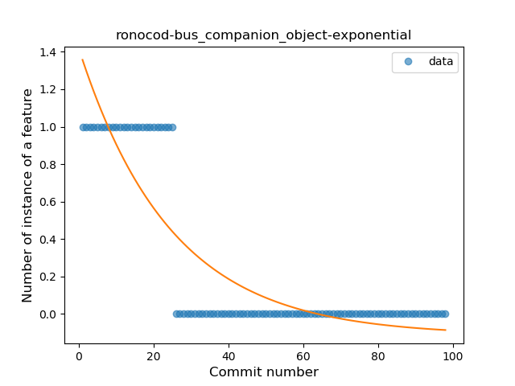
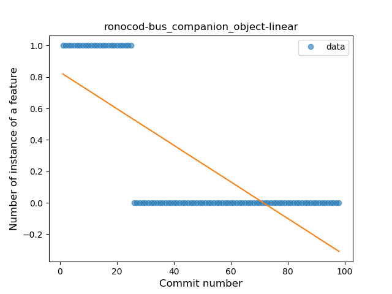
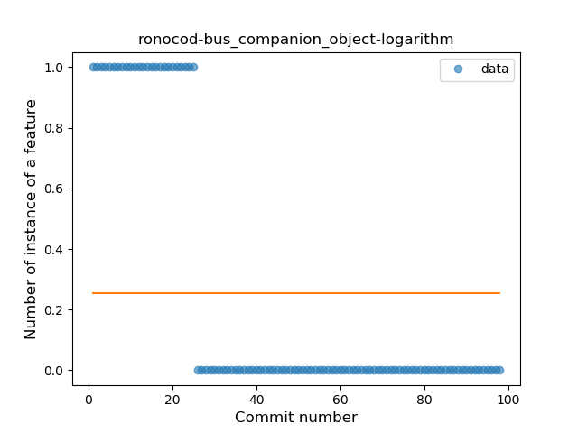
### <a name="unsafe_call">Unsafe Call</a>
----
#### Functions
* **Plateau Sudden Decline - Binary Sigmoid:** 
    * **R_Squared:** 1.0
* **Sudden Decline - Exponential:** 
    * **R_Squared:** 0.78807825
* **Constant Decline - Linear:** 
    * **R_Squared:** 0.39339875
* **Sudden Rise Plateau - Logarithm:** 
    * **R_Squared:** -0.0

**Plots** :chart_with_upwards_trend:
-----

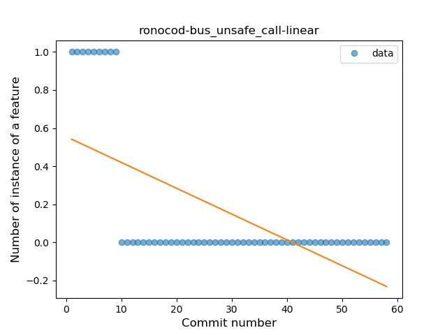
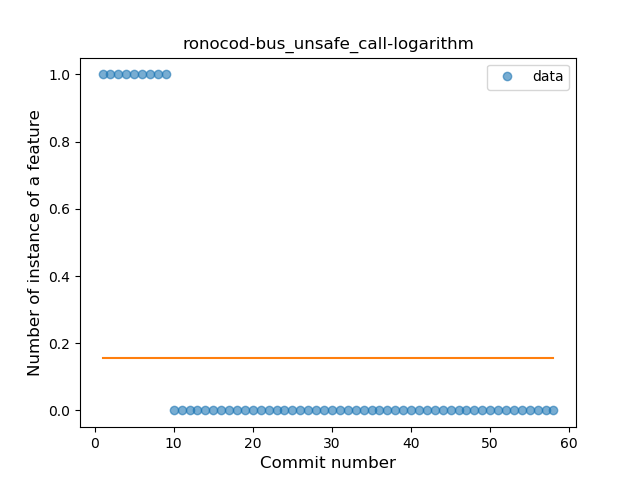
### <a name="string_template">String Template</a>
----
#### Functions
* **Plateau Sudden Rise - Binary Sigmoid:** 
    * **R_Squared:** 0.21807805
* **Constant Decline - Linear:** 
    * **R_Squared:** 0.05711335
* **Sudden Rise Plateau - Logarithm:** 
    * **R_Squared:** 0.00097353

**Plots** :chart_with_upwards_trend:
-----

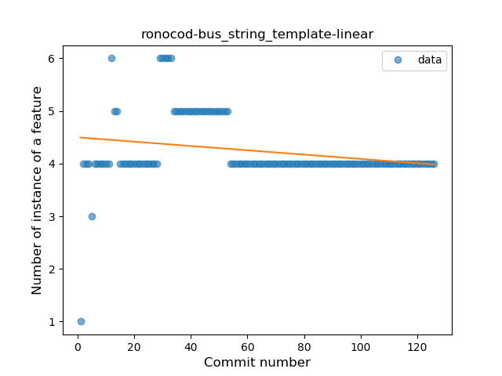
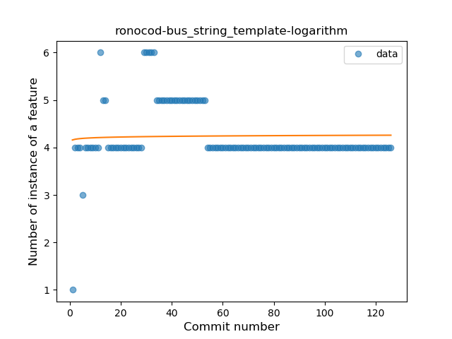
### <a name="func_with_default_value">Function with Default Value</a>
----
#### Functions
* **Sudden Decline - Exponential:** 
    * **R_Squared:** 1.0
* **Constant Decline - Linear:** 
    * **R_Squared:** 0.02380952
* **Sudden Rise Plateau - Logarithm:** 
    * **R_Squared:** -0.0

**Plots** :chart_with_upwards_trend:
-----

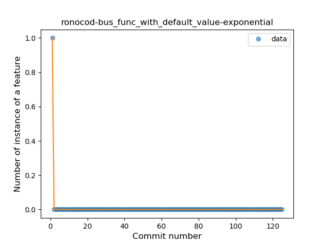
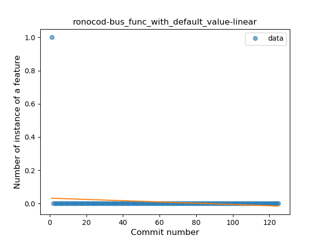
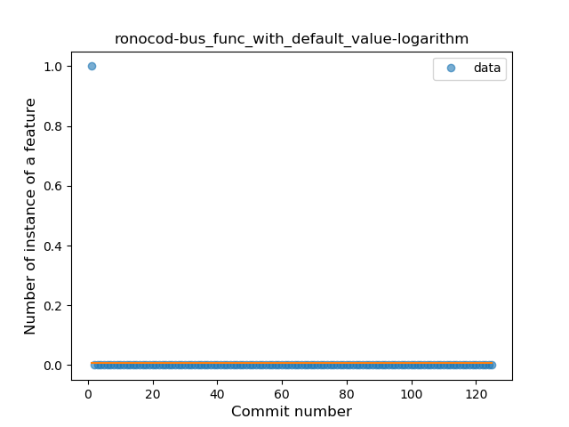
### <a name="singleton">Singleton</a>
----
#### Functions
* **Plateau Sudden Decline - Binary Sigmoid:** 
    * **R_Squared:** 1.0
* **Sudden Decline - Exponential:** 
    * **R_Squared:** 0.75476097
* **Constant Decline - Linear:** 
    * **R_Squared:** 0.70752756
* **Sudden Rise Plateau - Logarithm:** 
    * **R_Squared:** -0.0

**Plots** :chart_with_upwards_trend:
-----

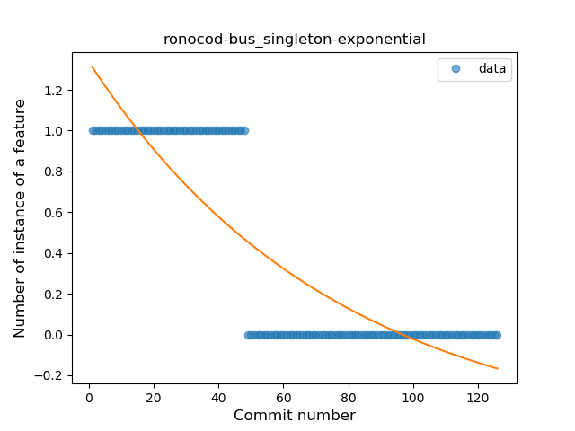
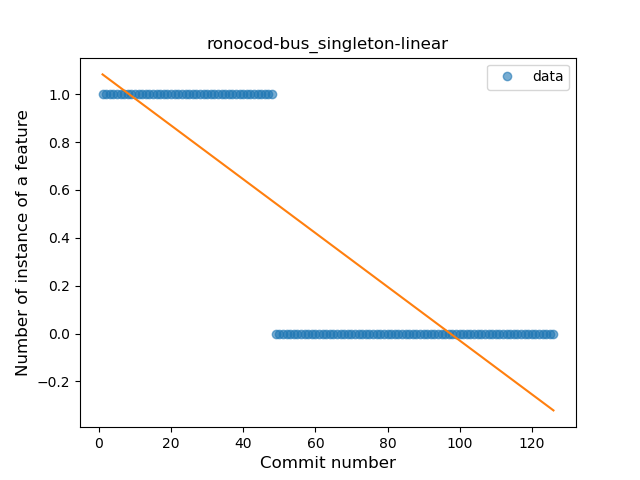
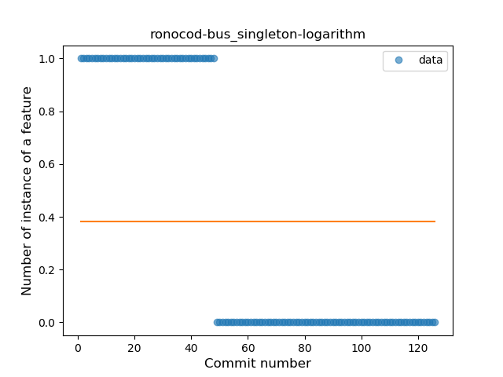
### <a name="func_call_with_named_arg">Function call with Named Argument</a>
----
#### Functions
* **Sudden Rise - Exponential:** 
    * **R_Squared:** 0.78665319
* **Constant Rise - Linear:** 
    * **R_Squared:** 0.40650517
* **Sudden Rise Plateau - Logarithm:** 
    * **R_Squared:** 0.07924445
* **Plateau Gradual Decline - Sigmoid:** 
    * **R_Squared:** 0.00283146

**Plots** :chart_with_upwards_trend:
-----

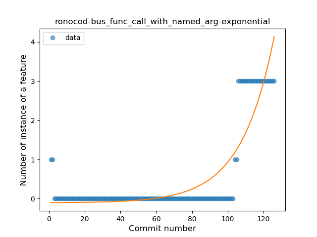
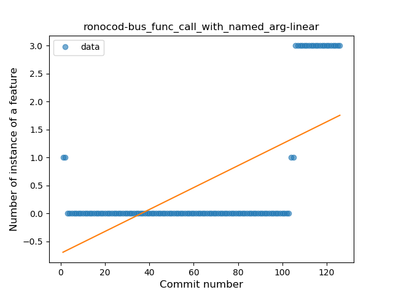
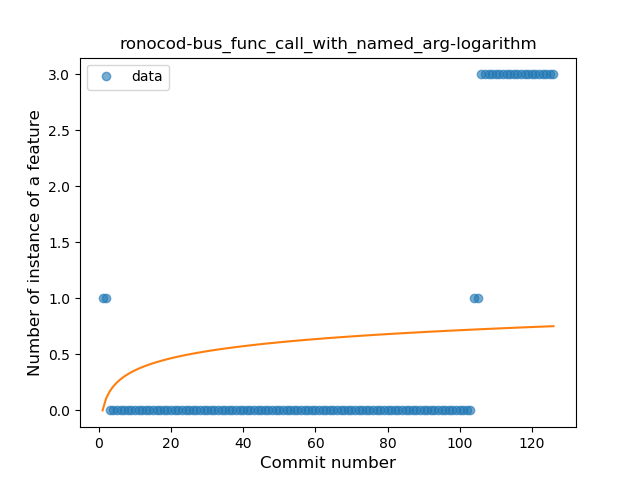
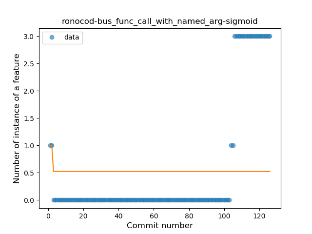
### <a name="data_class">Data Class</a>
----
#### Functions
* **Sudden Rise Plateau - Logarithm:** 
    * **R_Squared:** 0.15822756
* **Constant Rise - Linear:** 
    * **R_Squared:** 0.02036641

**Plots** :chart_with_upwards_trend:
-----

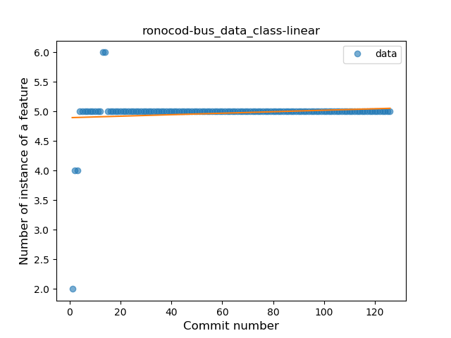
### <a name="extension_function">Extension Function</a>
----
#### Functions
* **Plateau Gradual Decline - Sigmoid:** 
    * **R_Squared:** 0.60815418
* **Constant Decline - Linear:** 
    * **R_Squared:** 0.40948331
* **Sudden Rise Plateau - Logarithm:** 
    * **R_Squared:** -0.0

**Plots** :chart_with_upwards_trend:
-----

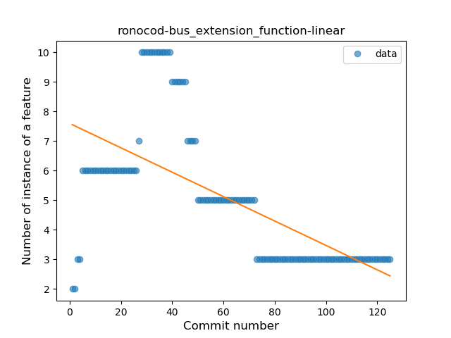
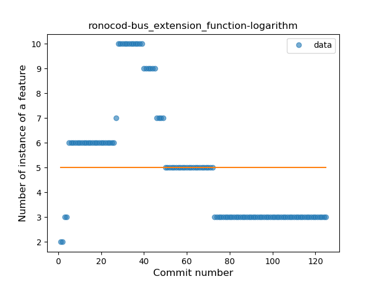
### <a name="property_delegation">Property Delegation</a>
----
#### Functions
* **Sudden Rise Plateau - Logarithm:** 
    * **R_Squared:** 0.47505126
* **Constant Rise - Linear:** 
    * **R_Squared:** 0.35412479
* **Plateau Gradual Rise - Sigmoid:** 
    * **R_Squared:** 0.03945552

**Plots** :chart_with_upwards_trend:
-----

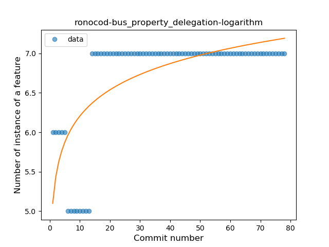
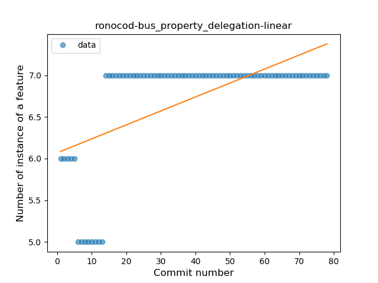
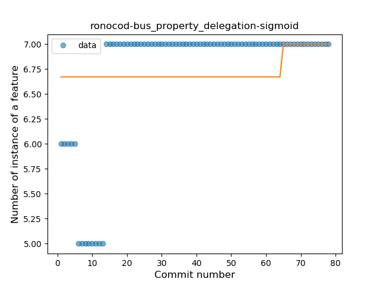
### <a name="inline_func">Inline Function</a>
----
#### Functions
* **Plateau Gradual Decline - Sigmoid:** 
    * **R_Squared:** 0.91864843
* **Sudden Decline - Exponential:** 
    * **R_Squared:** 0.87193119
* **Constant Decline - Linear:** 
    * **R_Squared:** 0.74844283
* **Sudden Rise Plateau - Logarithm:** 
    * **R_Squared:** -0.0

**Plots** :chart_with_upwards_trend:
-----

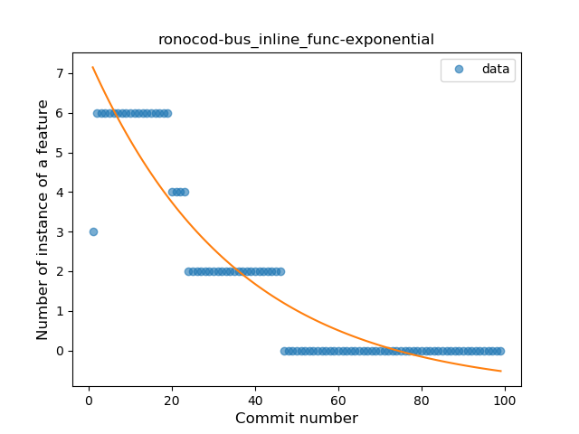
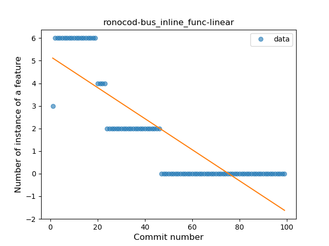
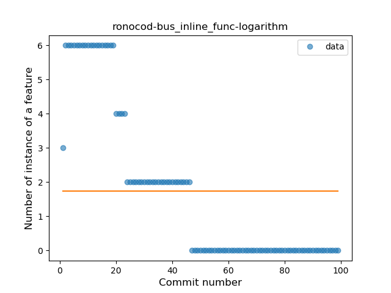
