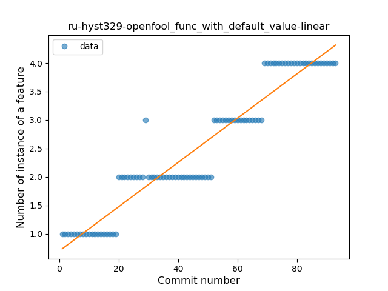
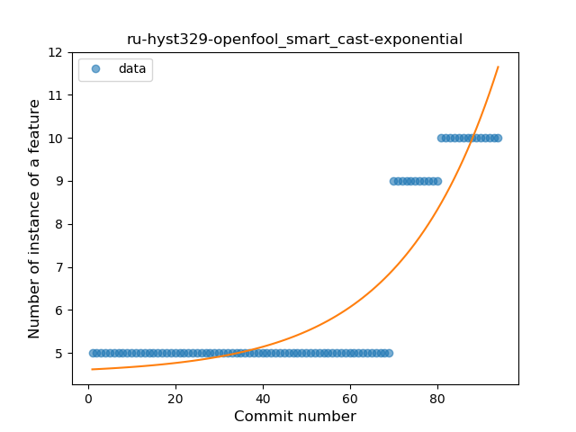

## ru-hyst329-openfool
----
#### Metrics provided by Detekt
* Number of lines of code 2613
* Number of Kotlin files: 16
* Cyclomatic complexity: 491
* Cyclomatic complexity by thousands of lines: 280 

----
**13** features analyzed

*	<a href="#type_inference">Type Inference</a> 
*	<a href="#lambda">Lambda</a> 
*	<a href="#safe_call">Safe Call</a> 
*	<a href="#when_expr">When expression</a> 
*	<a href="#unsafe_call">Unsafe Call</a> 
*	<a href="#companion_object">Companion Object</a> 
*	<a href="#string_template">String Template</a> 
*	<a href="#func_with_default_value">Function with Default Value</a> 
*	<a href="#range_expr">Range Expression</a> 
*	<a href="#smart_cast">Smart Cast</a> 
*	<a href="#func_call_with_named_arg">Function call with Named Argument</a> 
*	<a href="#property_delegation">Property Delegation</a> 
*	<a href="#destructuring_declaration">Destructuring Declaration</a> 

### <a name="type_inference">Type Inference</a>
----
#### Functions
* **Sudden Rise - Exponential:** 
    * **R_Squared:** 0.90220554
* **Constant Rise - Linear:** 
    * **R_Squared:** 0.71758946
* **Sudden Rise Plateau - Logarithm:** 
    * **R_Squared:** 0.42045964

**Plots** :chart_with_upwards_trend:
-----

### <a name="lambda">Lambda</a>
----
#### Functions
* **Sudden Rise - Exponential:** 
    * **R_Squared:** 0.92520575
* **Constant Rise - Linear:** 
    * **R_Squared:** 0.76574663
* **Sudden Rise Plateau - Logarithm:** 
    * **R_Squared:** 0.34237219
* **Plateau Gradual Rise - Sigmoid:** 
    * **R_Squared:** 0.13092354

**Plots** :chart_with_upwards_trend:
-----

### <a name="safe_call">Safe Call</a>
----
#### Functions
* **Instability - Polinomial 3:** )
    * **R_Squared:** 0.92135775
* **Sudden Rise - Exponential:** 
    * **R_Squared:** 0.90127122
* **Constant Rise - Linear:** 
    * **R_Squared:** 0.60147472
* **Sudden Rise Plateau - Logarithm:** 
    * **R_Squared:** 0.30575804

**Plots** :chart_with_upwards_trend:
-----

### <a name="when_expr">When expression</a>
----
#### Functions
* **Plateau Gradual Rise - Sigmoid:** 
    * **R_Squared:** 0.98015401
* **Sudden Rise - Exponential:** 
    * **R_Squared:** 0.90419269
* **Constant Rise - Linear:** 
    * **R_Squared:** 0.79653963
* **Sudden Rise Plateau - Logarithm:** 
    * **R_Squared:** 0.42261984

**Plots** :chart_with_upwards_trend:
-----

### <a name="unsafe_call">Unsafe Call</a>
----
#### Functions
* **Constant Decline - Linear:** 
    * **R_Squared:** 0.61633919
* **Sudden Rise - Exponential:** 
    * **R_Squared:** 0.0
* **Sudden Rise Plateau - Logarithm:** 
    * **R_Squared:** -0.0

**Plots** :chart_with_upwards_trend:
-----

### <a name="companion_object">Companion Object</a>
----
#### Functions
* **Plateau Sudden Rise - Binary Sigmoid:** 
    * **R_Squared:** 1.0
* **Sudden Rise - Exponential:** 
    * **R_Squared:** 0.77127185
* **Constant Rise - Linear:** 
    * **R_Squared:** 0.55449915
* **Sudden Rise Plateau - Logarithm:** 
    * **R_Squared:** 0.2688946

**Plots** :chart_with_upwards_trend:
-----

### <a name="string_template">String Template</a>
----
#### Functions
* **Sudden Rise - Exponential:** 
    * **R_Squared:** 0.90420066
* **Constant Rise - Linear:** 
    * **R_Squared:** 0.69019719
* **Sudden Rise Plateau - Logarithm:** 
    * **R_Squared:** 0.34212441

**Plots** :chart_with_upwards_trend:
-----

### <a name="func_with_default_value">Function with Default Value</a>
----
#### Functions
* **Constant Rise - Linear:** 
    * **R_Squared:** 0.91136815
* **Sudden Rise - Exponential:** 
    * **R_Squared:** 0.91233765
* **Plateau Gradual Rise - Sigmoid:** 
    * **R_Squared:** 0.91528801
* **Sudden Rise Plateau - Logarithm:** 
    * **R_Squared:** 0.64668715

**Plots** :chart_with_upwards_trend:
-----

### <a name="range_expr">Range Expression</a>
----
#### Functions
* **Sudden Rise - Exponential:** 
    * **R_Squared:** 0.9084316
* **Constant Rise - Linear:** 
    * **R_Squared:** 0.80313908
* **Sudden Rise Plateau - Logarithm:** 
    * **R_Squared:** 0.46812322

**Plots** :chart_with_upwards_trend:
-----

### <a name="smart_cast">Smart Cast</a>
----
#### Functions
* **Plateau Gradual Rise - Sigmoid:** 
    * **R_Squared:** 0.98495614
* **Sudden Rise - Exponential:** 
    * **R_Squared:** 0.82614633
* **Constant Rise - Linear:** 
    * **R_Squared:** 0.59922474
* **Sudden Rise Plateau - Logarithm:** 
    * **R_Squared:** 0.29281379

**Plots** :chart_with_upwards_trend:
-----

### <a name="func_call_with_named_arg">Function call with Named Argument</a>
----
#### Functions
* **Constant Rise - Linear:** 
    * **R_Squared:** 0.85859707
* **Sudden Rise Plateau - Logarithm:** 
    * **R_Squared:** 0.74368303

**Plots** :chart_with_upwards_trend:
-----

### <a name="property_delegation">Property Delegation</a>
----
#### Functions
* **Sudden Rise Plateau - Logarithm:** 
    * **R_Squared:** 0.64491444
* **Constant Rise - Linear:** 
    * **R_Squared:** 0.36077706

**Plots** :chart_with_upwards_trend:
-----

### <a name="destructuring_declaration">Destructuring Declaration</a>
----
#### Functions
* **Sudden Rise - Exponential:** 
    * **R_Squared:** 0.87495655
* **Constant Rise - Linear:** 
    * **R_Squared:** 0.85607888
* **Sudden Rise Plateau - Logarithm:** 
    * **R_Squared:** 0.65445612

**Plots** :chart_with_upwards_trend:
-----

