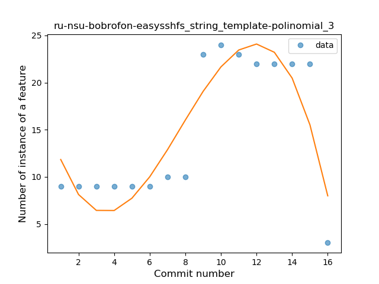
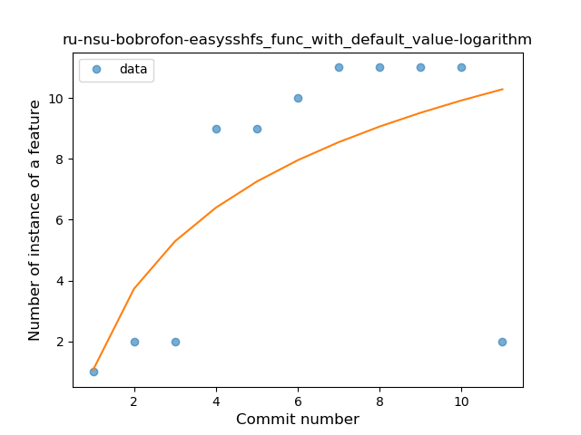
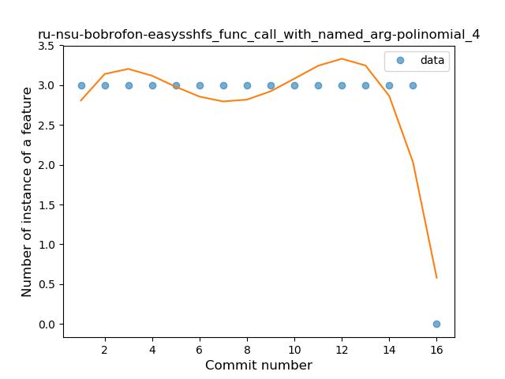
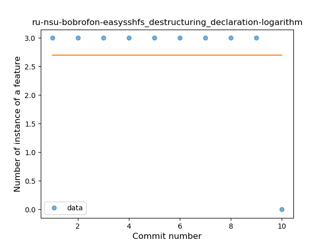

## ru-nsu-bobrofon-easysshfs
----
#### Metrics provided by Detekt
* Number of lines of code 1688
* Number of Kotlin files: 17
* Cyclomatic complexity: 257
* Cyclomatic complexity by thousands of lines: 283 

----
**14** features analyzed

*	<a href="#type_inference">Type Inference</a> 
*	<a href="#lambda">Lambda</a> 
*	<a href="#safe_call">Safe Call</a> 
*	<a href="#when_expr">When expression</a> 
*	<a href="#unsafe_call">Unsafe Call</a> 
*	<a href="#companion_object">Companion Object</a> 
*	<a href="#string_template">String Template</a> 
*	<a href="#func_with_default_value">Function with Default Value</a> 
*	<a href="#singleton">Singleton</a> 
*	<a href="#range_expr">Range Expression</a> 
*	<a href="#smart_cast">Smart Cast</a> 
*	<a href="#func_call_with_named_arg">Function call with Named Argument</a> 
*	<a href="#property_delegation">Property Delegation</a> 
*	<a href="#destructuring_declaration">Destructuring Declaration</a> 

### <a name="type_inference">Type Inference</a>
----
#### Functions
* **Instability - Polinomial 4:** 
    * **R_Squared:** 0.7853917
* **Instability - Polinomial 3:** )
    * **R_Squared:** 0.69438445
* **Constant Decline - Linear:** 
    * **R_Squared:** 0.30718015
* **Sudden Rise Plateau - Logarithm:** 
    * **R_Squared:** -0.0

**Plots** :chart_with_upwards_trend:
-----

### <a name="lambda">Lambda</a>
----
#### Functions
* **Instability - Polinomial 4:** 
    * **R_Squared:** 0.92052429
* **Instability - Polinomial 3:** )
    * **R_Squared:** 0.69351174
* **Constant Rise - Linear:** 
    * **R_Squared:** 0.35632269
* **Sudden Rise Plateau - Logarithm:** 
    * **R_Squared:** 0.32862177

**Plots** :chart_with_upwards_trend:
-----

### <a name="safe_call">Safe Call</a>
----
#### Functions
* **Instability - Polinomial 4:** 
    * **R_Squared:** 0.95679527
* **Instability - Polinomial 3:** )
    * **R_Squared:** 0.86243932
* **Constant Rise - Linear:** 
    * **R_Squared:** 0.62851652
* **Sudden Rise Plateau - Logarithm:** 
    * **R_Squared:** 0.52395977

**Plots** :chart_with_upwards_trend:
-----

### <a name="when_expr">When expression</a>
----
#### Functions
* **Instability - Polinomial 3:** )
    * **R_Squared:** 0.78266009
* **Instability - Polinomial 4:** 
    * **R_Squared:** 0.79047911
* **Plateau Sudden Rise - Binary Sigmoid:** 
    * **R_Squared:** 0.51020408
* **Sudden Rise Plateau - Logarithm:** 
    * **R_Squared:** 0.25643137
* **Constant Rise - Linear:** 
    * **R_Squared:** 0.17647059

**Plots** :chart_with_upwards_trend:
-----

### <a name="unsafe_call">Unsafe Call</a>
----
#### Functions
* **Instability - Polinomial 4:** 
    * **R_Squared:** 0.97046693
* **Constant Decline - Linear:** 
    * **R_Squared:** 0.8784321
* **Sudden Rise Plateau - Logarithm:** 
    * **R_Squared:** -0.0

**Plots** :chart_with_upwards_trend:
-----

### <a name="companion_object">Companion Object</a>
----
#### Functions
* **Instability - Polinomial 4:** 
    * **R_Squared:** 0.87143362
* **Instability - Polinomial 3:** )
    * **R_Squared:** 0.68711141
* **Constant Decline - Linear:** 
    * **R_Squared:** 0.4915601
* **Sudden Rise Plateau - Logarithm:** 
    * **R_Squared:** -0.0

**Plots** :chart_with_upwards_trend:
-----

### <a name="string_template">String Template</a>
----
#### Functions
* **Instability - Polinomial 4:** 
    * **R_Squared:** 0.84721963
* **Instability - Polinomial 3:** )
    * **R_Squared:** 0.79663485
* **Sudden Rise Plateau - Logarithm:** 
    * **R_Squared:** 0.29038957
* **Constant Rise - Linear:** 
    * **R_Squared:** 0.27843439

**Plots** :chart_with_upwards_trend:
-----

### <a name="func_with_default_value">Function with Default Value</a>
----
#### Functions
* **Sudden Rise Plateau - Logarithm:** 
    * **R_Squared:** 0.42790041
* **Constant Rise - Linear:** 
    * **R_Squared:** 0.2597723
* **Plateau Sudden Decline - Binary Sigmoid:** 
    * **R_Squared:** 0.15412713

**Plots** :chart_with_upwards_trend:
-----

### <a name="singleton">Singleton</a>
----
#### Functions
* **Instability - Polinomial 4:** 
    * **R_Squared:** 0.89505326
* **Plateau Sudden Decline - Binary Sigmoid:** 
    * **R_Squared:** 0.79513461
* **Sudden Decline - Exponential:** 
    * **R_Squared:** 0.70661289
* **Constant Decline - Linear:** 
    * **R_Squared:** 0.65766363
* **Sudden Rise Plateau - Logarithm:** 
    * **R_Squared:** -0.0

**Plots** :chart_with_upwards_trend:
-----

### <a name="range_expr">Range Expression</a>
----
#### Functions
* **Instability - Polinomial 4:** 
    * **R_Squared:** 0.79339525
* **Instability - Polinomial 3:** )
    * **R_Squared:** 0.62435501
* **Constant Decline - Linear:** 
    * **R_Squared:** 0.17647059
* **Sudden Rise Plateau - Logarithm:** 
    * **R_Squared:** -0.0

**Plots** :chart_with_upwards_trend:
-----

### <a name="smart_cast">Smart Cast</a>
----
#### Functions
* **Instability - Polinomial 4:** 
    * **R_Squared:** 0.79339525
* **Instability - Polinomial 3:** )
    * **R_Squared:** 0.62435501
* **Constant Decline - Linear:** 
    * **R_Squared:** 0.17647059
* **Sudden Rise Plateau - Logarithm:** 
    * **R_Squared:** -0.0

**Plots** :chart_with_upwards_trend:
-----

### <a name="func_call_with_named_arg">Function call with Named Argument</a>
----
#### Functions
* **Instability - Polinomial 4:** 
    * **R_Squared:** 0.79339525
* **Instability - Polinomial 3:** )
    * **R_Squared:** 0.62435501
* **Constant Decline - Linear:** 
    * **R_Squared:** 0.17647059
* **Sudden Rise Plateau - Logarithm:** 
    * **R_Squared:** -0.0

**Plots** :chart_with_upwards_trend:
-----

### <a name="property_delegation">Property Delegation</a>
----
#### Functions
* **Instability - Polinomial 4:** 
    * **R_Squared:** 0.96969697
* **Instability - Polinomial 3:** )
    * **R_Squared:** 0.87878788
* **Constant Decline - Linear:** 
    * **R_Squared:** 0.33333333
* **Sudden Rise Plateau - Logarithm:** 
    * **R_Squared:** -0.0

**Plots** :chart_with_upwards_trend:
-----

### <a name="destructuring_declaration">Destructuring Declaration</a>
----
#### Functions
* **Instability - Polinomial 4:** 
    * **R_Squared:** 0.93006993
* **Instability - Polinomial 3:** )
    * **R_Squared:** 0.8041958
* **Constant Decline - Linear:** 
    * **R_Squared:** 0.27272727
* **Sudden Rise Plateau - Logarithm:** 
    * **R_Squared:** 0.0

**Plots** :chart_with_upwards_trend:
-----

