## rubenwardy-mtmods4android
----
#### Metrics provided by Detekt
* Number of lines of code 226
* Number of Kotlin files: 4
* Cyclomatic complexity: 42
* Cyclomatic complexity by thousands of lines: 347 

----
**3** features analyzed

*	<a href="#type_inference">Type Inference</a> 
*	<a href="#lambda">Lambda</a> 
*	<a href="#unsafe_call">Unsafe Call</a> 

### <a name="type_inference">Type Inference</a>
----
#### Functions
* **Plateau Gradual Rise - Sigmoid:** 
    * **R_Squared:** 0.95467556
* **Instability - Polinomial 3:** )
    * **R_Squared:** 0.92451865
* **Instability - Polinomial 4:** 
    * **R_Squared:** 0.92497369
* **Sudden Rise - Exponential:** 
    * **R_Squared:** 0.8679547
* **Constant Rise - Linear:** 
    * **R_Squared:** 0.85338462
* **Sudden Rise Plateau - Logarithm:** 
    * **R_Squared:** 0.6080409

**Plots** :chart_with_upwards_trend:
-----

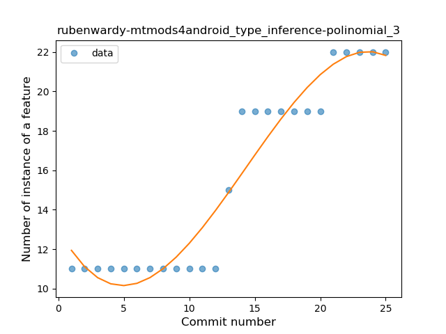
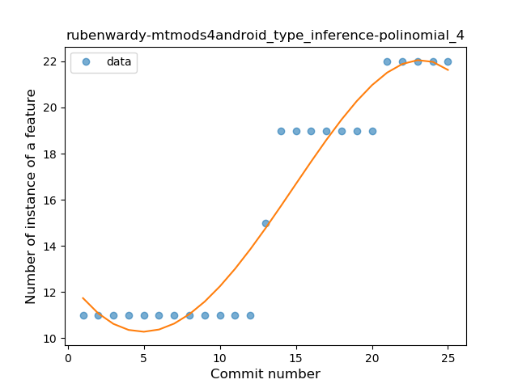
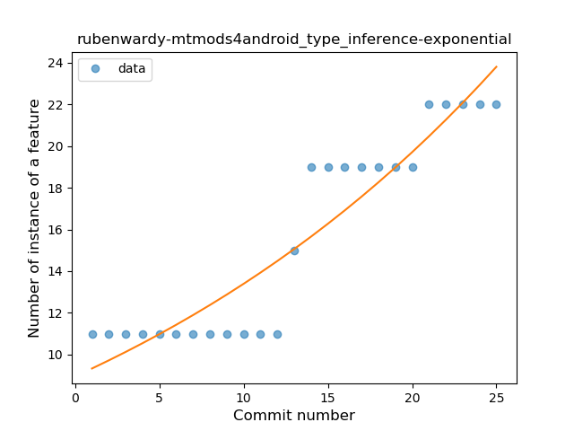
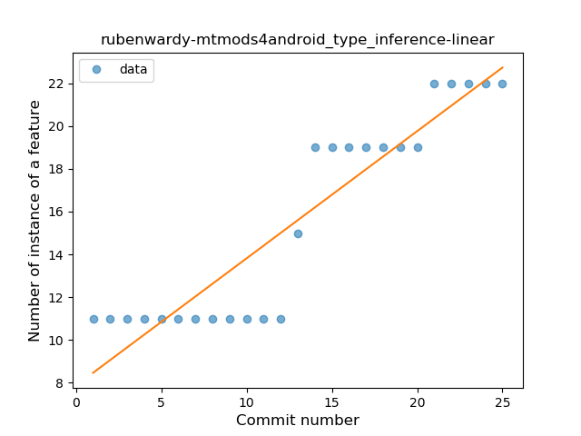
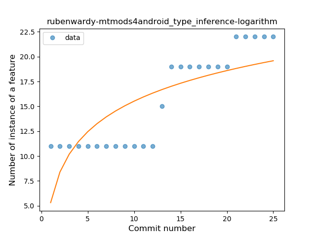
### <a name="lambda">Lambda</a>
----
#### Functions
* **Plateau Sudden Rise - Binary Sigmoid:** 
    * **R_Squared:** 1.0
* **Instability - Polinomial 4:** 
    * **R_Squared:** 0.88438228
* **Instability - Polinomial 3:** )
    * **R_Squared:** 0.85081585
* **Sudden Rise - Exponential:** 
    * **R_Squared:** 0.75826496
* **Constant Rise - Linear:** 
    * **R_Squared:** 0.73426573
* **Sudden Rise Plateau - Logarithm:** 
    * **R_Squared:** 0.53589013

**Plots** :chart_with_upwards_trend:
-----

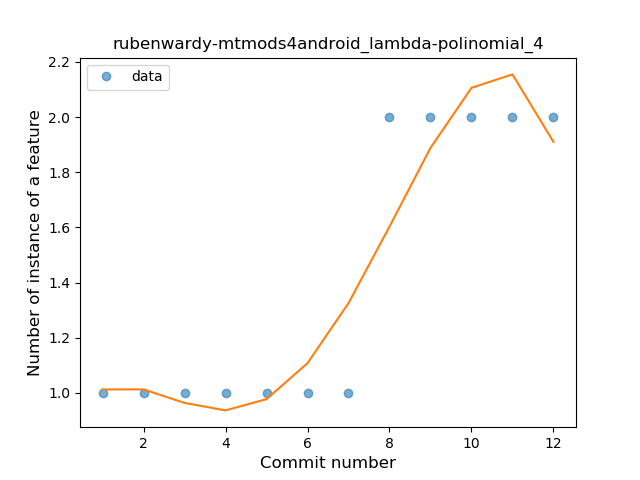
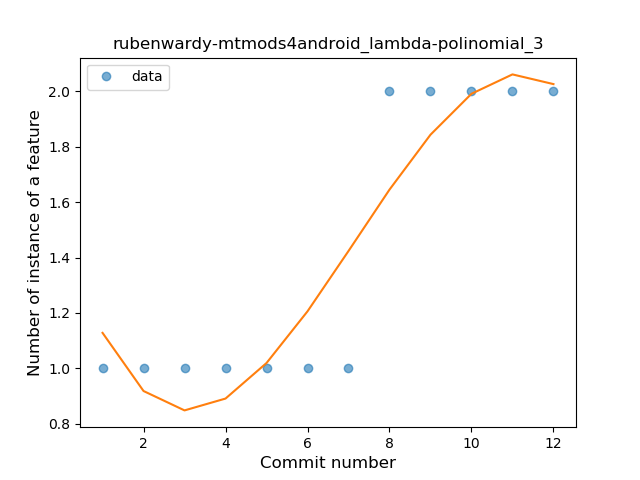
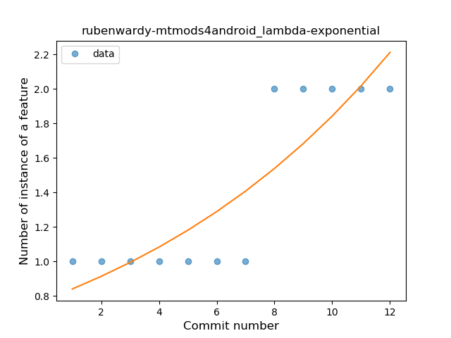
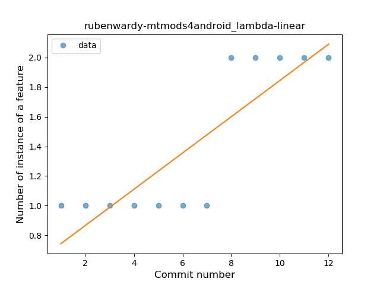
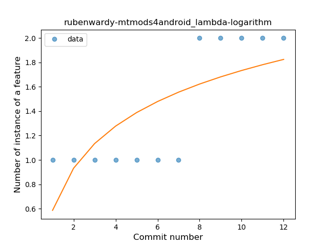
### <a name="unsafe_call">Unsafe Call</a>
----
#### Functions
* **Plateau Sudden Rise - Binary Sigmoid:** 
    * **R_Squared:** 1.0
* **Instability - Polinomial 3:** )
    * **R_Squared:** 0.86050725
* **Constant Rise - Linear:** 
    * **R_Squared:** 0.75
* **Sudden Rise Plateau - Logarithm:** 
    * **R_Squared:** 0.591873

**Plots** :chart_with_upwards_trend:
-----

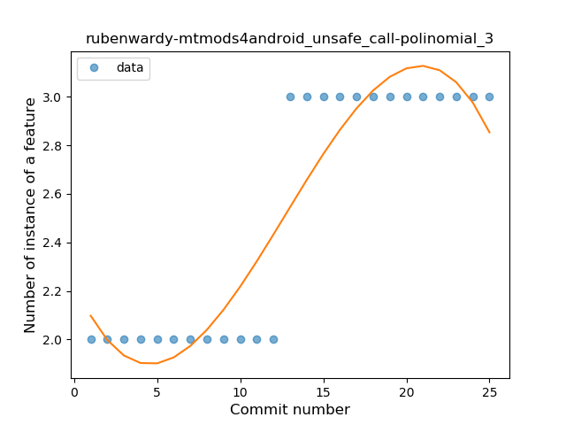
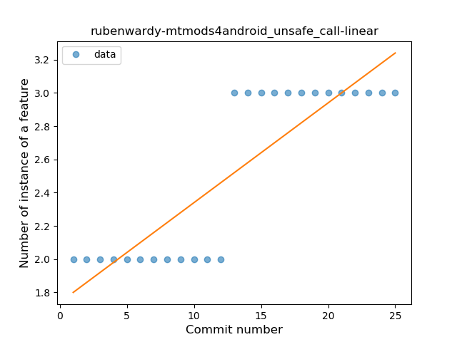
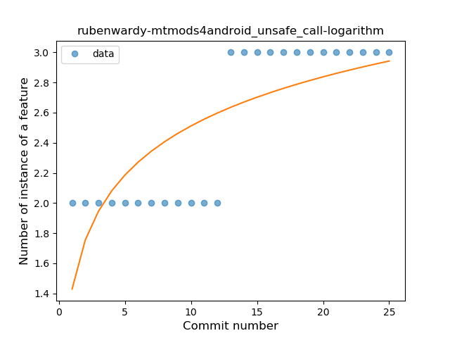
