## ryey-easer-beta
----
#### Metrics provided by Detekt
* Number of lines of code 2381
* Number of Kotlin files: 26
* Cyclomatic complexity: 262
* Cyclomatic complexity by thousands of lines: 249 

----
**7** features analyzed

*	<a href="#type_inference">Type Inference</a> 
*	<a href="#lambda">Lambda</a> 
*	<a href="#safe_call">Safe Call</a> 
*	<a href="#unsafe_call">Unsafe Call</a> 
*	<a href="#companion_object">Companion Object</a> 
*	<a href="#func_with_default_value">Function with Default Value</a> 
*	<a href="#smart_cast">Smart Cast</a> 

### <a name="type_inference">Type Inference</a>
----
#### Functions
* **Constant Rise - Linear:** 
    * **R_Squared:** 0.96137293
* **Sudden Rise Plateau - Logarithm:** 
    * **R_Squared:** 0.61915326
* **Plateau Sudden Rise - Binary Sigmoid:** 
    * **R_Squared:** 0.37254227

**Plots** :chart_with_upwards_trend:
-----

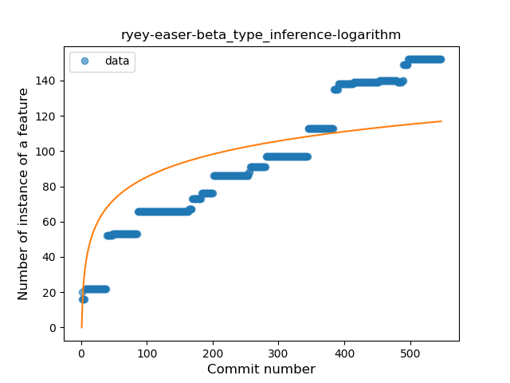
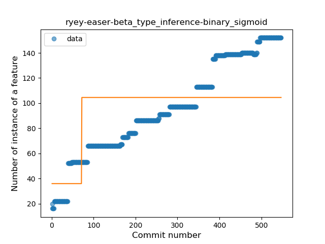
### <a name="lambda">Lambda</a>
----
#### Functions
* **Sudden Rise - Exponential:** 
    * **R_Squared:** 0.81322247
* **Constant Rise - Linear:** 
    * **R_Squared:** 0.77073368
* **Sudden Rise Plateau - Logarithm:** 
    * **R_Squared:** 0.38082417

**Plots** :chart_with_upwards_trend:
-----

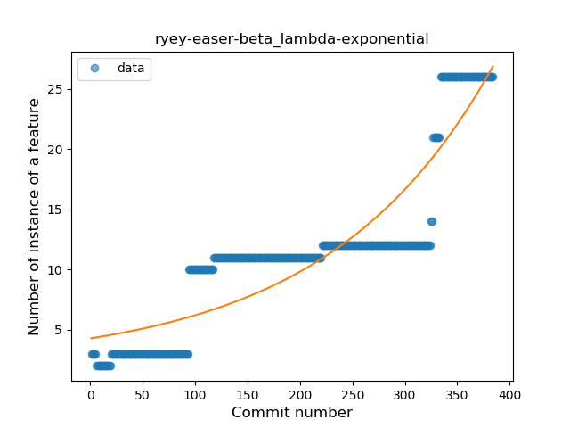
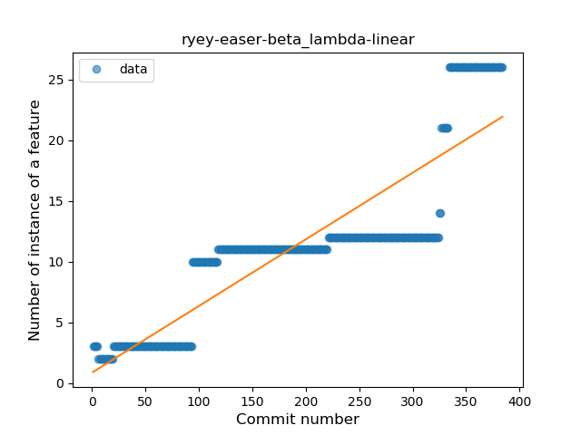
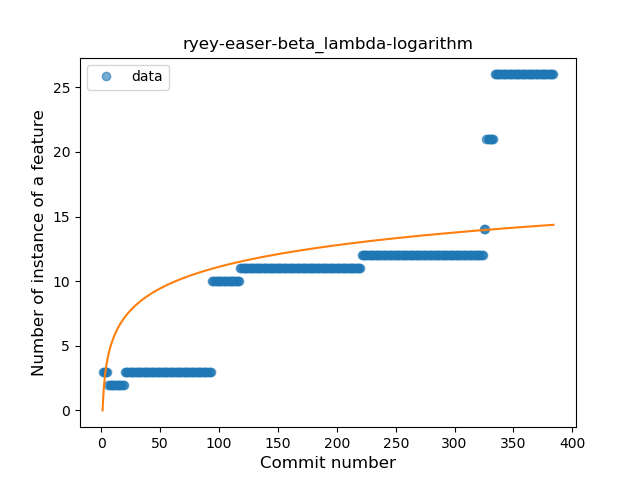
### <a name="safe_call">Safe Call</a>
----
#### Functions
* **Sudden Rise - Exponential:** 
    * **R_Squared:** 0.93973526
* **Constant Rise - Linear:** 
    * **R_Squared:** 0.84408775
* **Sudden Rise Plateau - Logarithm:** 
    * **R_Squared:** 0.38648302

**Plots** :chart_with_upwards_trend:
-----

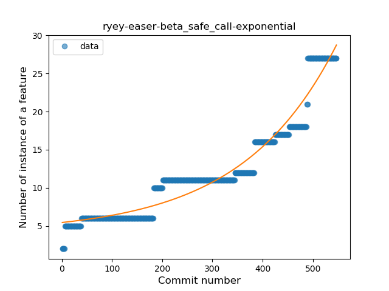
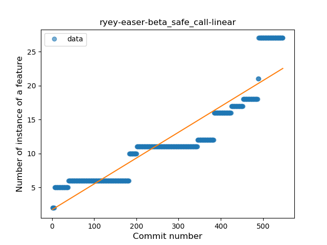
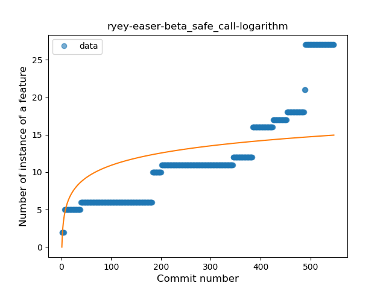
### <a name="unsafe_call">Unsafe Call</a>
----
#### Functions
* **Sudden Rise - Exponential:** 
    * **R_Squared:** 0.9243237
* **Plateau Gradual Rise - Sigmoid:** 
    * **R_Squared:** 0.9308821
* **Constant Rise - Linear:** 
    * **R_Squared:** 0.86416625
* **Sudden Rise Plateau - Logarithm:** 
    * **R_Squared:** 0.32879847

**Plots** :chart_with_upwards_trend:
-----

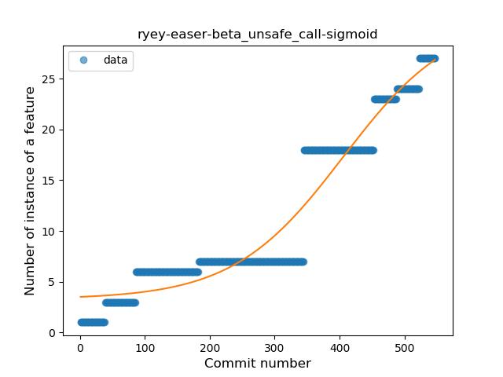
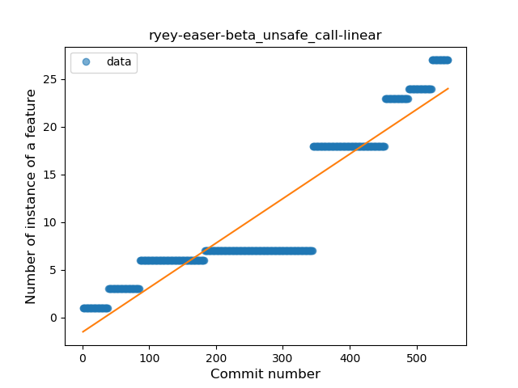
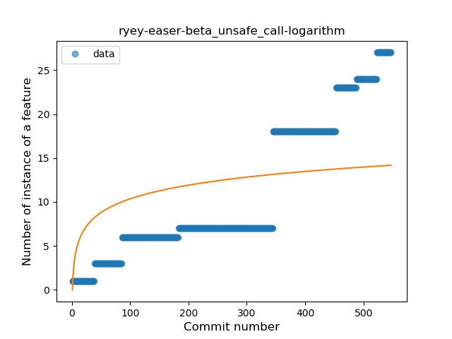
### <a name="companion_object">Companion Object</a>
----
#### Functions
* **Constant Rise - Linear:** 
    * **R_Squared:** 0.95436254
* **Sudden Rise - Exponential:** 
    * **R_Squared:** 0.96070717
* **Sudden Rise Plateau - Logarithm:** 
    * **R_Squared:** 0.66155919

**Plots** :chart_with_upwards_trend:
-----

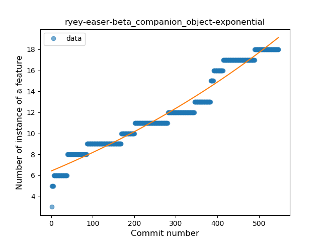
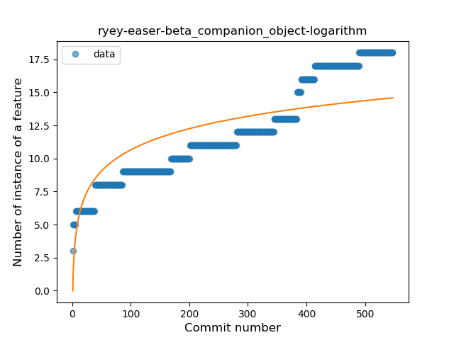
### <a name="func_with_default_value">Function with Default Value</a>
----
#### Functions
* **Plateau Sudden Rise - Binary Sigmoid:** 
    * **R_Squared:** 0.97863496
* **Sudden Rise Plateau - Logarithm:** 
    * **R_Squared:** 0.58461956
* **Constant Rise - Linear:** 
    * **R_Squared:** 0.23147035

**Plots** :chart_with_upwards_trend:
-----

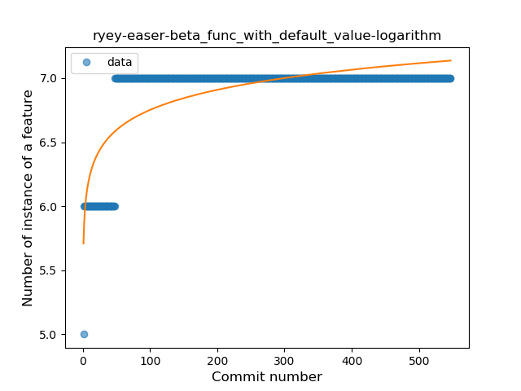
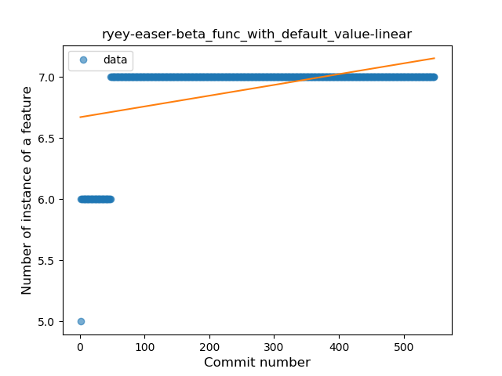
### <a name="smart_cast">Smart Cast</a>
----
#### Functions
* **Sudden Rise - Exponential:** 
    * **R_Squared:** 0.47551257
* **Constant Rise - Linear:** 
    * **R_Squared:** 0.39828841
* **Sudden Rise Plateau - Logarithm:** 
    * **R_Squared:** 0.22024536

**Plots** :chart_with_upwards_trend:
-----

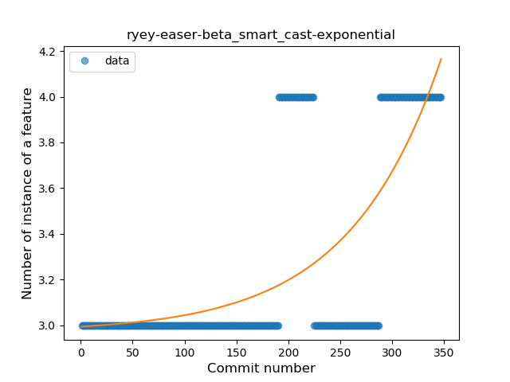
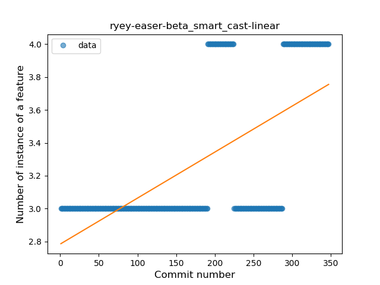
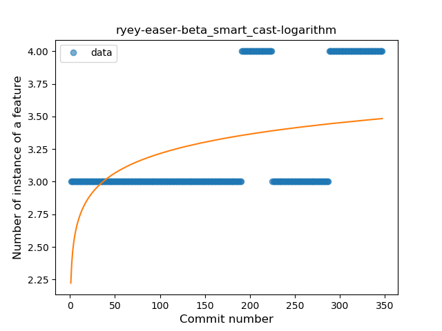
