## sandy-8925-Checklist
----
#### Metrics provided by Detekt
* Number of lines of code 731
* Number of Kotlin files: 9
* Cyclomatic complexity: 66
* Cyclomatic complexity by thousands of lines: 167 

----
**7** features analyzed

*	<a href="#type_inference">Type Inference</a> 
*	<a href="#lambda">Lambda</a> 
*	<a href="#safe_call">Safe Call</a> 
*	<a href="#when_expr">When expression</a> 
*	<a href="#companion_object">Companion Object</a> 
*	<a href="#unsafe_call">Unsafe Call</a> 
*	<a href="#string_template">String Template</a> 

### <a name="type_inference">Type Inference</a>
----
#### Functions
* **Instability - Polinomial 4:** 
    * **R_Squared:** 0.62741768
* **Instability - Polinomial 3:** )
    * **R_Squared:** 0.58762762
* **Sudden Rise Plateau - Logarithm:** 
    * **R_Squared:** 0.42331146
* **Constant Rise - Linear:** 
    * **R_Squared:** 0.1936727

**Plots** :chart_with_upwards_trend:
-----

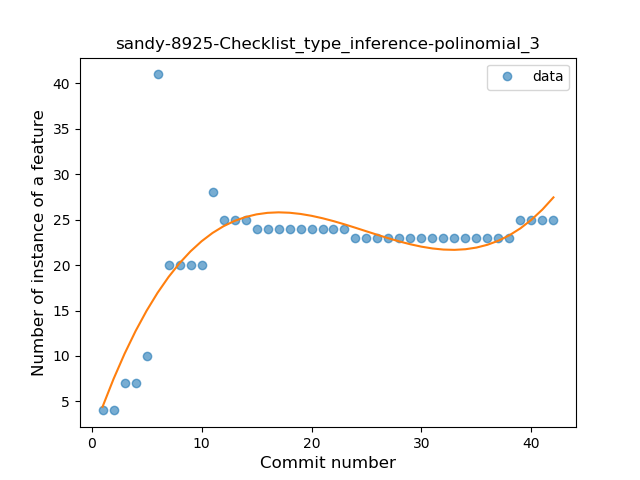
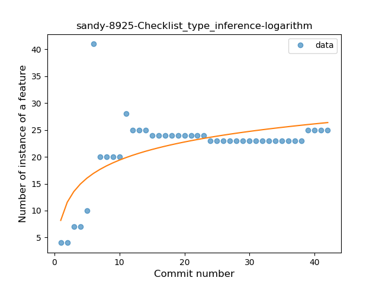
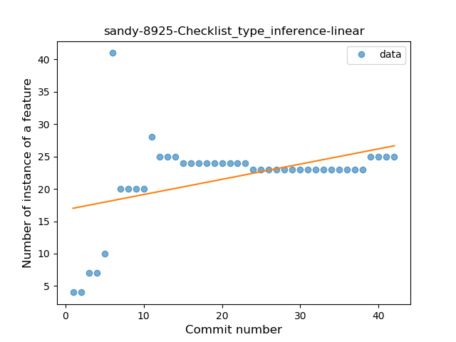
### <a name="lambda">Lambda</a>
----
#### Functions
* **Plateau Gradual Rise - Sigmoid:** 
    * **R_Squared:** 0.97944049
* **Instability - Polinomial 3:** )
    * **R_Squared:** 0.81594948
* **Sudden Rise Plateau - Logarithm:** 
    * **R_Squared:** 0.64094161
* **Constant Rise - Linear:** 
    * **R_Squared:** 0.33955517

**Plots** :chart_with_upwards_trend:
-----

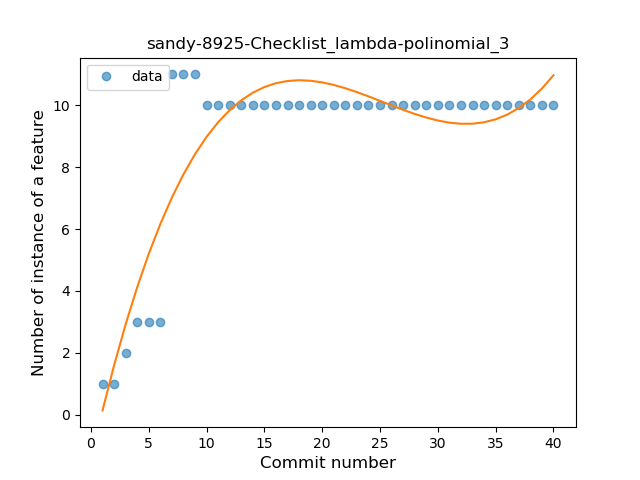
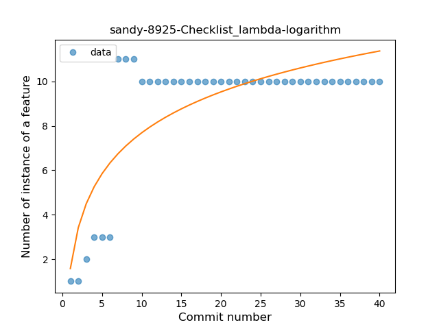
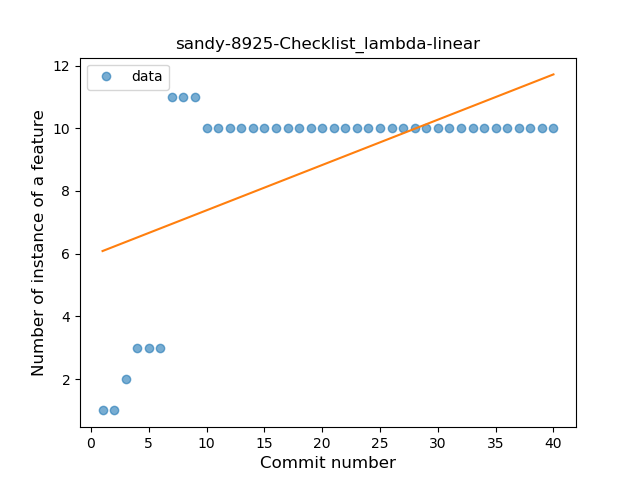
### <a name="safe_call">Safe Call</a>
----
#### Functions
* **Plateau Sudden Rise - Binary Sigmoid:** 
    * **R_Squared:** 1.0
* **Instability - Polinomial 3:** )
    * **R_Squared:** 0.66088563
* **Sudden Rise Plateau - Logarithm:** 
    * **R_Squared:** 0.50391521
* **Constant Rise - Linear:** 
    * **R_Squared:** 0.20357143

**Plots** :chart_with_upwards_trend:
-----

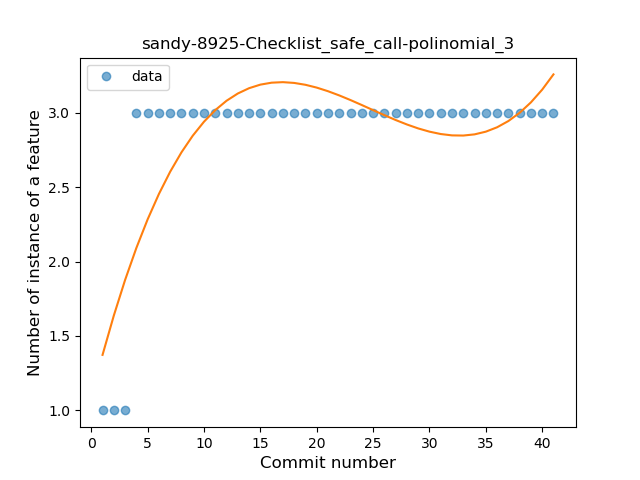
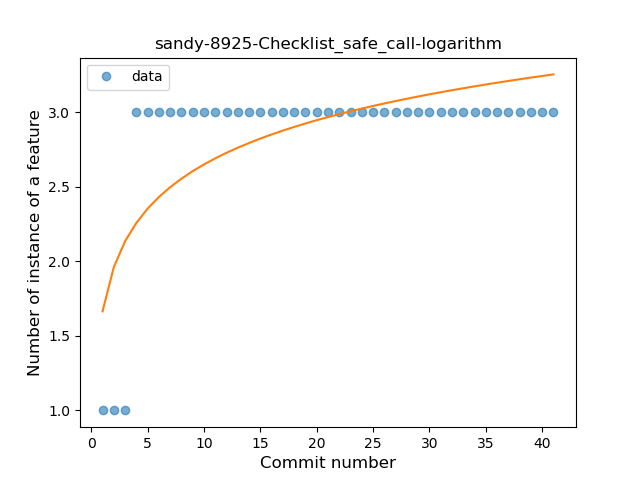
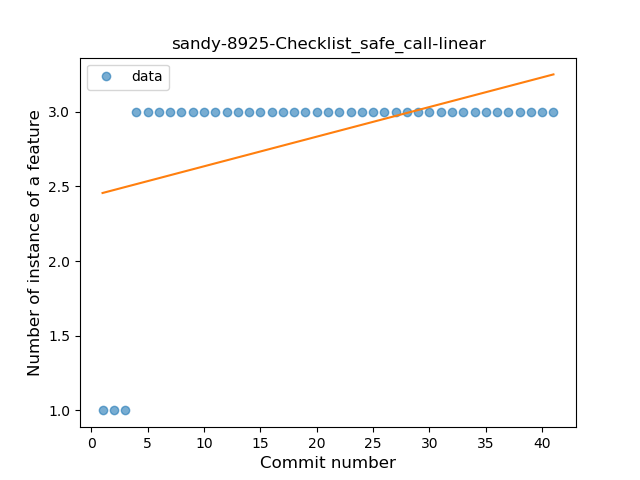
### <a name="when_expr">When expression</a>
----
#### Functions
* **Instability - Polinomial 3:** )
    * **R_Squared:** 0.77275046
* **Sudden Rise - Exponential:** 
    * **R_Squared:** 0.69349607
* **Constant Rise - Linear:** 
    * **R_Squared:** 0.41781392
* **Sudden Rise Plateau - Logarithm:** 
    * **R_Squared:** 0.31940667
* **Plateau Sudden Rise - Binary Sigmoid:** 
    * **R_Squared:** 0.20516218

**Plots** :chart_with_upwards_trend:
-----

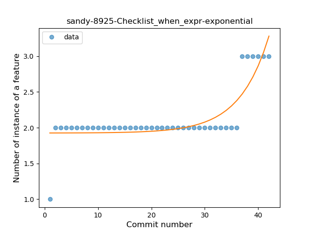
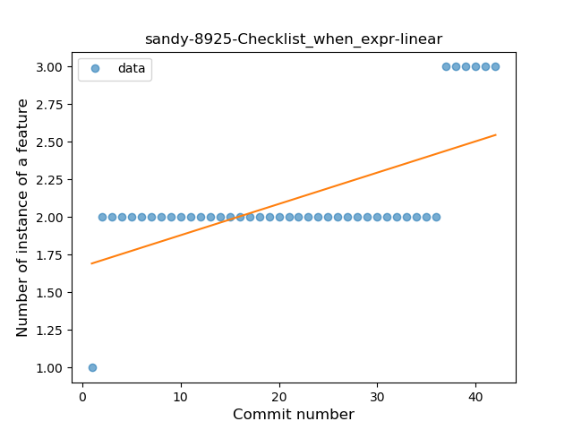
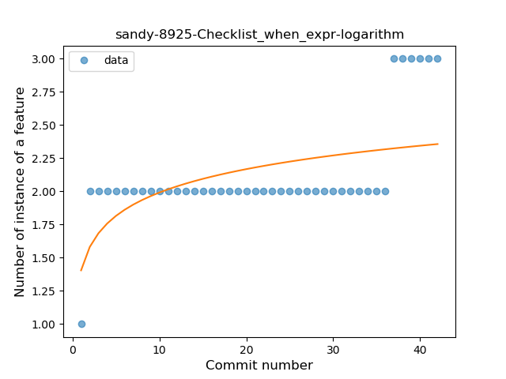
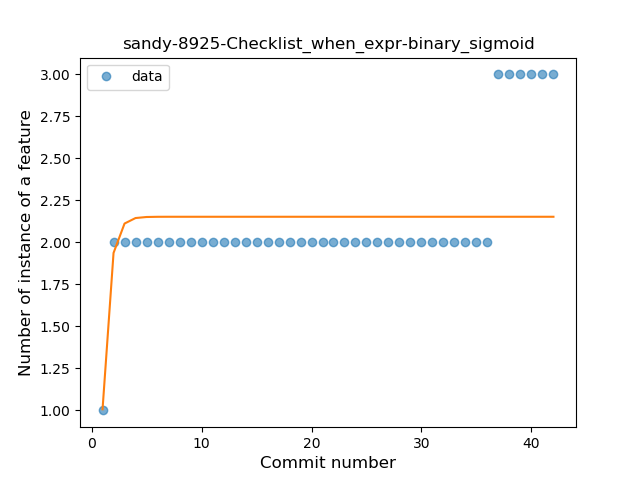
### <a name="companion_object">Companion Object</a>
----
#### Functions
* **Plateau Sudden Rise - Binary Sigmoid:** 
    * **R_Squared:** 0.42060988
* **Instability - Polinomial 3:** )
    * **R_Squared:** 0.33651585
* **Sudden Rise Plateau - Logarithm:** 
    * **R_Squared:** 0.29916181
* **Constant Rise - Linear:** 
    * **R_Squared:** 0.16580206

**Plots** :chart_with_upwards_trend:
-----

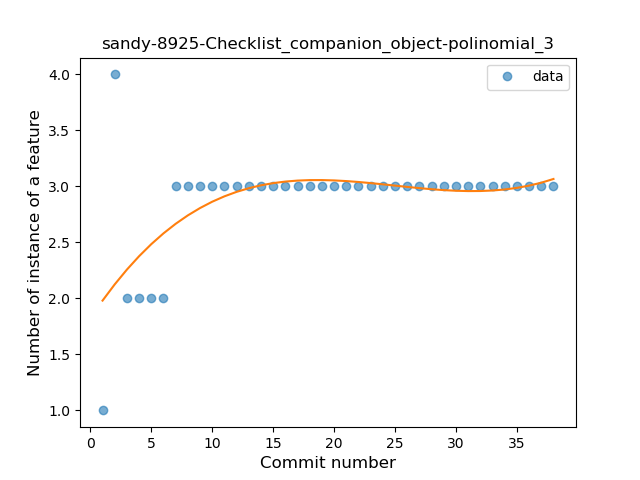
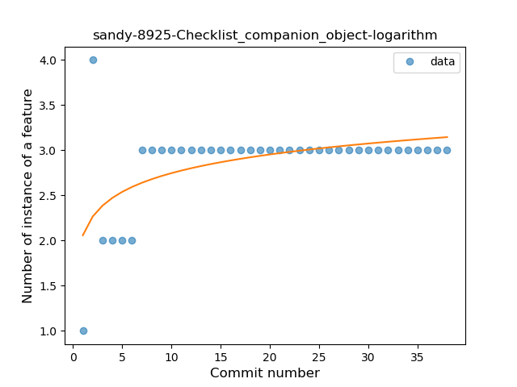
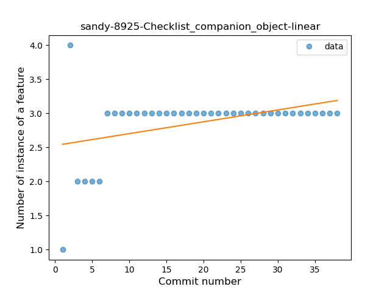
### <a name="unsafe_call">Unsafe Call</a>
----
#### Functions
* **Instability - Polinomial 4:** 
    * **R_Squared:** 0.48296633
* **Instability - Polinomial 3:** )
    * **R_Squared:** 0.33755061
* **Constant Decline - Linear:** 
    * **R_Squared:** 0.07894737
* **Sudden Rise Plateau - Logarithm:** 
    * **R_Squared:** 0.0

**Plots** :chart_with_upwards_trend:
-----

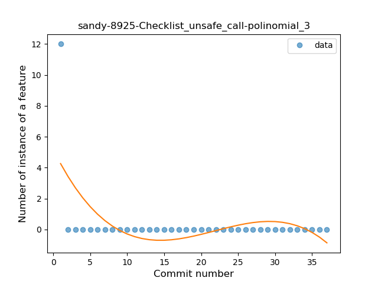

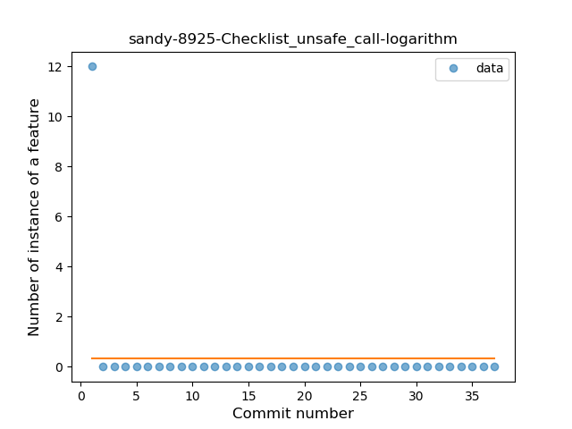
### <a name="string_template">String Template</a>
----
#### Functions
* **Sudden Decline - Exponential:** 
    * **R_Squared:** 1.0
* **Instability - Polinomial 3:** )
    * **R_Squared:** 0.33755061
* **Constant Decline - Linear:** 
    * **R_Squared:** 0.07894737
* **Sudden Rise Plateau - Logarithm:** 
    * **R_Squared:** -0.0

**Plots** :chart_with_upwards_trend:
-----

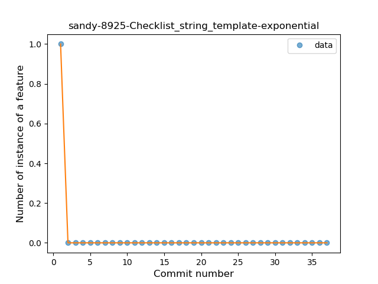

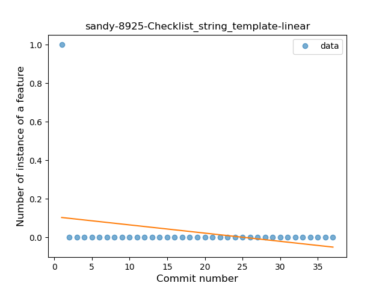
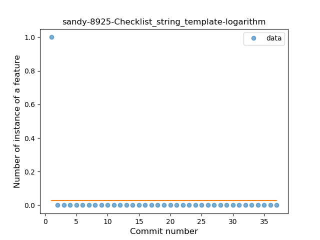
