## saschpe-PlanningPoker
----
#### Metrics provided by Detekt
* Number of lines of code 1129
* Number of Kotlin files: 12
* Cyclomatic complexity: 130
* Cyclomatic complexity by thousands of lines: 256 

----
**6** features analyzed

*	<a href="#type_inference">Type Inference</a> 
*	<a href="#safe_call">Safe Call</a> 
*	<a href="#when_expr">When expression</a> 
*	<a href="#companion_object">Companion Object</a> 
*	<a href="#unsafe_call">Unsafe Call</a> 
*	<a href="#singleton">Singleton</a> 

### <a name="type_inference">Type Inference</a>
----
#### Functions
* **Instability - Polinomial 4:** 
    * **R_Squared:** 0.84641344
* **Instability - Polinomial 3:** )
    * **R_Squared:** 0.77908304
* **Sudden Rise Plateau - Logarithm:** 
    * **R_Squared:** 0.60664237
* **Constant Rise - Linear:** 
    * **R_Squared:** 0.33869156
* **Plateau Sudden Rise - Binary Sigmoid:** 
    * **R_Squared:** 0.14827688

**Plots** :chart_with_upwards_trend:
-----

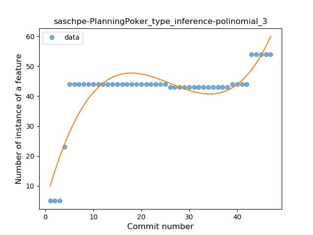
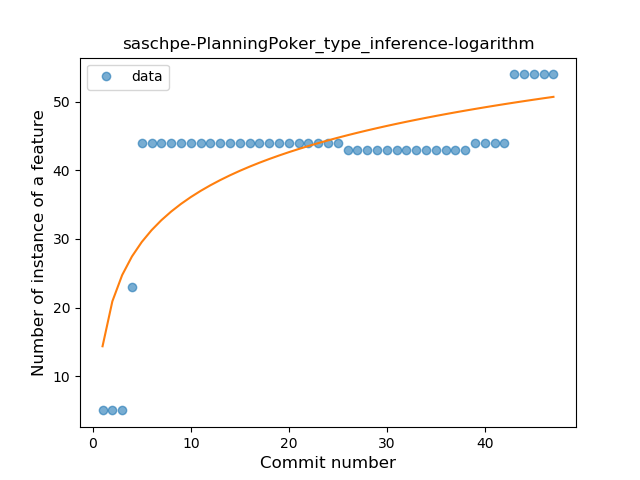
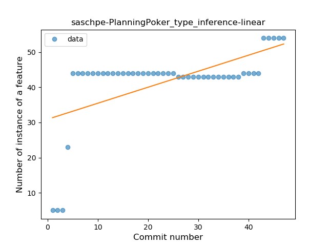
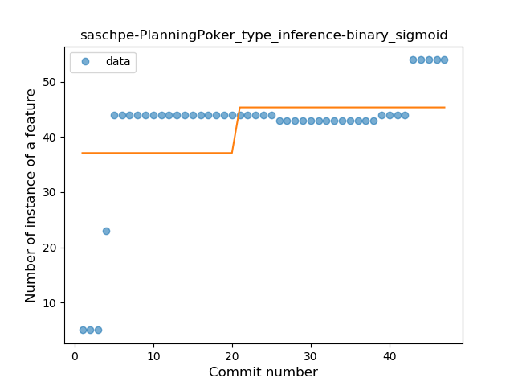
### <a name="safe_call">Safe Call</a>
----
#### Functions
* **Plateau Sudden Rise - Binary Sigmoid:** 
    * **R_Squared:** 1.0
* **Instability - Polinomial 4:** 
    * **R_Squared:** 0.85666147
* **Sudden Rise Plateau - Logarithm:** 
    * **R_Squared:** 0.64615383
* **Constant Rise - Linear:** 
    * **R_Squared:** 0.59534884

**Plots** :chart_with_upwards_trend:
-----

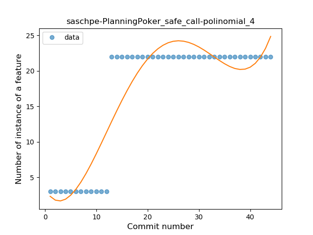
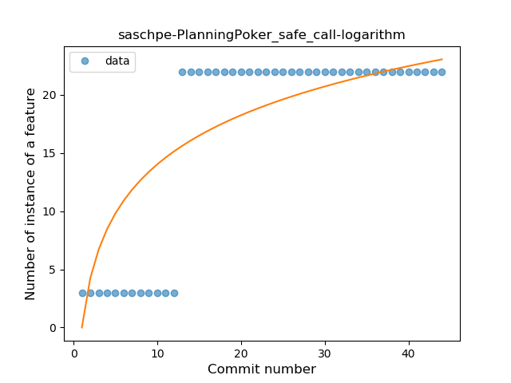
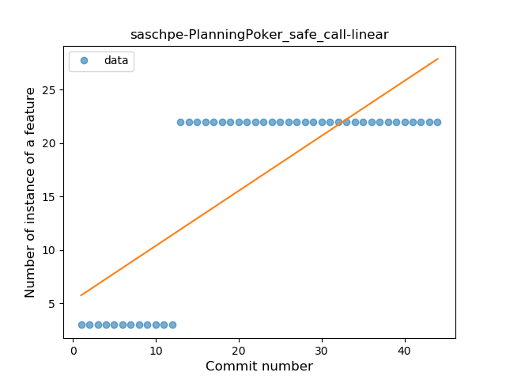
### <a name="when_expr">When expression</a>
----
#### Functions
* **Instability - Polinomial 3:** )
    * **R_Squared:** 0.47313544
* **Sudden Rise Plateau - Logarithm:** 
    * **R_Squared:** 0.35879915
* **Plateau Sudden Rise - Binary Sigmoid:** 
    * **R_Squared:** 0.28222745
* **Constant Rise - Linear:** 
    * **R_Squared:** 0.22624069

**Plots** :chart_with_upwards_trend:
-----

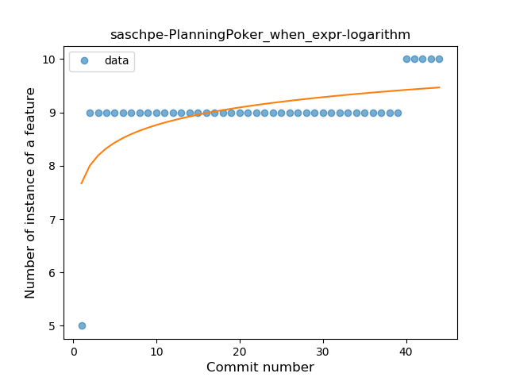
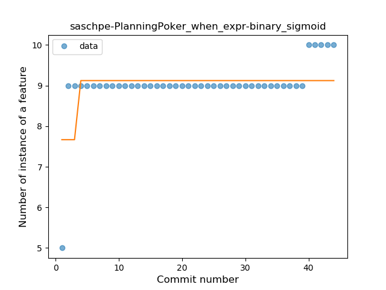
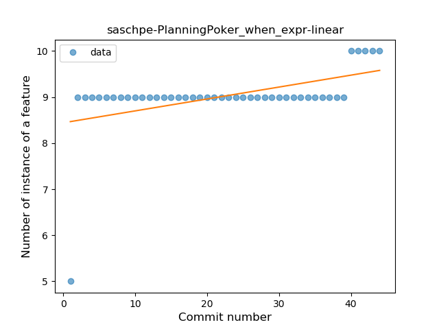
### <a name="companion_object">Companion Object</a>
----
#### Functions
* **Instability - Polinomial 3:** )
    * **R_Squared:** 0.63073565
* **Plateau Sudden Rise - Binary Sigmoid:** 
    * **R_Squared:** 0.49941253
* **Sudden Rise - Exponential:** 
    * **R_Squared:** 0.47001345
* **Sudden Rise Plateau - Logarithm:** 
    * **R_Squared:** 0.35087256
* **Constant Rise - Linear:** 
    * **R_Squared:** 0.31633115

**Plots** :chart_with_upwards_trend:
-----

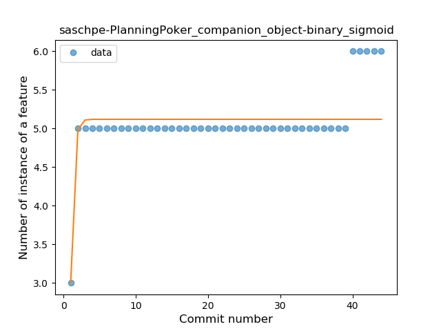
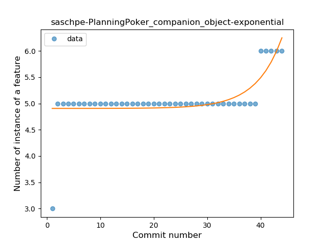
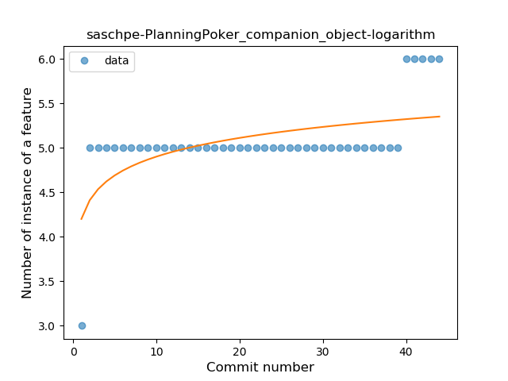
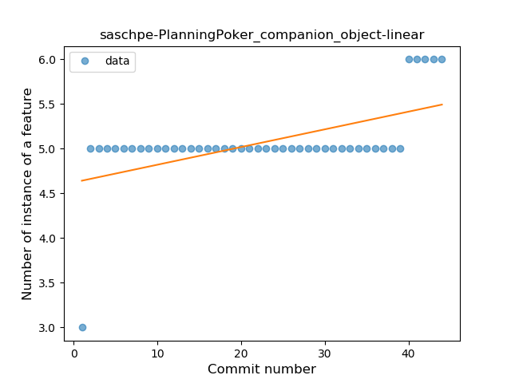
### <a name="unsafe_call">Unsafe Call</a>
----
#### Functions
* **Instability - Polinomial 4:** 
    * **R_Squared:** 0.79199677
* **Sudden Decline - Exponential:** 
    * **R_Squared:** 0.61021534
* **Constant Decline - Linear:** 
    * **R_Squared:** 0.48923226
* **Sudden Rise Plateau - Logarithm:** 
    * **R_Squared:** -0.0

**Plots** :chart_with_upwards_trend:
-----

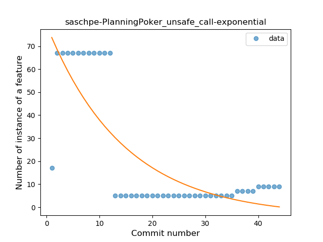
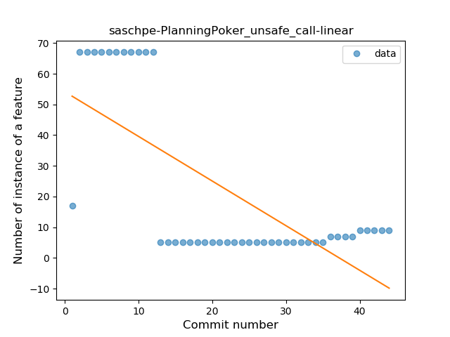
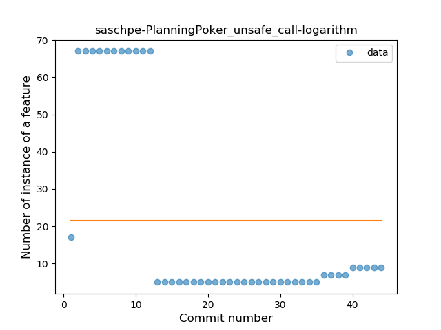
### <a name="singleton">Singleton</a>
----
#### Functions
* **Plateau Sudden Rise - Binary Sigmoid:** 
    * **R_Squared:** 1.0
* **Sudden Rise - Exponential:** 
    * **R_Squared:** 0.80041902
* **Instability - Polinomial 3:** )
    * **R_Squared:** 0.76524562
* **Constant Rise - Linear:** 
    * **R_Squared:** 0.28532609
* **Sudden Rise Plateau - Logarithm:** 
    * **R_Squared:** 0.12454284

**Plots** :chart_with_upwards_trend:
-----

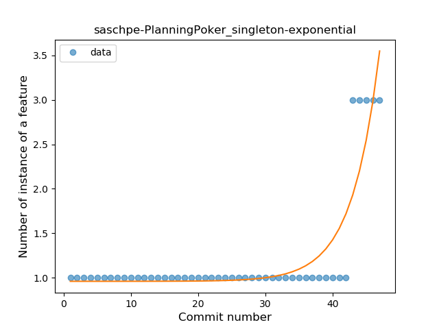
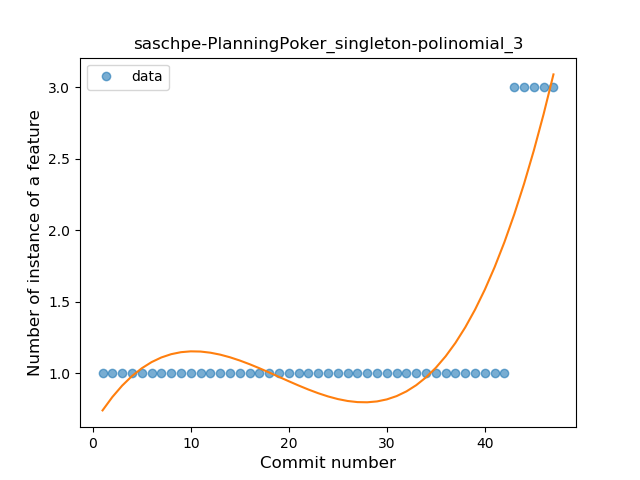
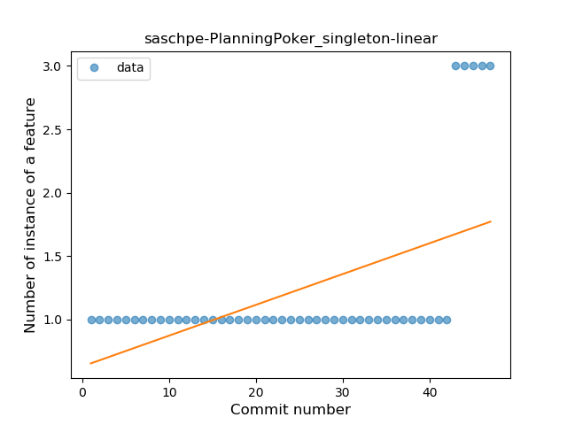
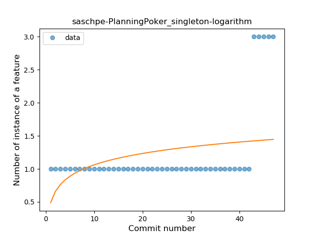
