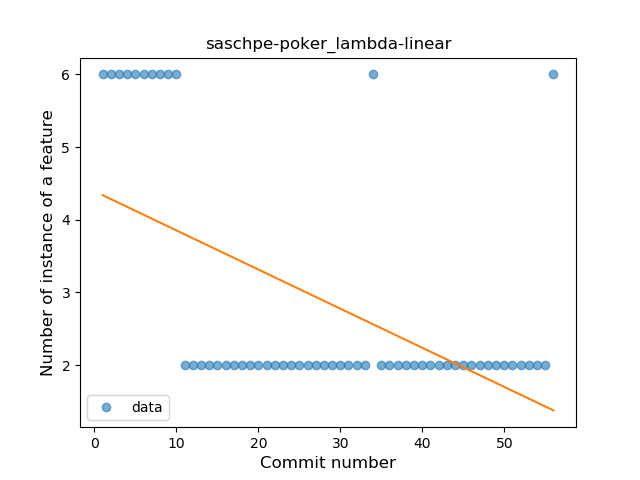

## saschpe-poker
----
#### Metrics provided by Detekt
* Number of lines of code 1120
* Number of Kotlin files: 12
* Cyclomatic complexity: 128
* Cyclomatic complexity by thousands of lines: 252 

----
**7** features analyzed

*	<a href="#type_inference">Type Inference</a> 
*	<a href="#lambda">Lambda</a> 
*	<a href="#safe_call">Safe Call</a> 
*	<a href="#when_expr">When expression</a> 
*	<a href="#unsafe_call">Unsafe Call</a> 
*	<a href="#companion_object">Companion Object</a> 
*	<a href="#singleton">Singleton</a> 

### <a name="type_inference">Type Inference</a>
----
#### Functions
* **Instability - Polinomial 4:** 
    * **R_Squared:** 0.84632782
* **Instability - Polinomial 3:** )
    * **R_Squared:** 0.63227565
* **Sudden Rise Plateau - Logarithm:** 
    * **R_Squared:** 0.61936986
* **Constant Rise - Linear:** 
    * **R_Squared:** 0.48281451
* **Plateau Sudden Rise - Binary Sigmoid:** 
    * **R_Squared:** 0.21723264

**Plots** :chart_with_upwards_trend:
-----

### <a name="lambda">Lambda</a>
----
#### Functions
* **Sudden Decline - Exponential:** 
    * **R_Squared:** 0.59799444
* **Constant Decline - Linear:** 
    * **R_Squared:** 0.28134696
* **Sudden Rise Plateau - Logarithm:** 
    * **R_Squared:** -0.0

**Plots** :chart_with_upwards_trend:
-----

### <a name="safe_call">Safe Call</a>
----
#### Functions
* **Instability - Polinomial 3:** )
    * **R_Squared:** 0.43591766
* **Plateau Gradual Rise - Sigmoid:** 
    * **R_Squared:** 0.40312538
* **Sudden Rise Plateau - Logarithm:** 
    * **R_Squared:** 0.35893903
* **Constant Rise - Linear:** 
    * **R_Squared:** 0.33398411

**Plots** :chart_with_upwards_trend:
-----

### <a name="when_expr">When expression</a>
----
#### Functions
* **Sudden Rise - Exponential:** 
    * **R_Squared:** 0.81965744
* **Constant Rise - Linear:** 
    * **R_Squared:** 0.65658993
* **Sudden Rise Plateau - Logarithm:** 
    * **R_Squared:** 0.46090885

**Plots** :chart_with_upwards_trend:
-----

### <a name="unsafe_call">Unsafe Call</a>
----
#### Functions
* **Instability - Polinomial 4:** 
    * **R_Squared:** 0.74282883
* **Instability - Polinomial 3:** )
    * **R_Squared:** 0.70834231
* **Sudden Decline - Exponential:** 
    * **R_Squared:** 0.65643375
* **Constant Decline - Linear:** 
    * **R_Squared:** 0.39641825
* **Plateau Sudden Decline - Binary Sigmoid:** 
    * **R_Squared:** 0.13130591
* **Sudden Rise Plateau - Logarithm:** 
    * **R_Squared:** -0.0

**Plots** :chart_with_upwards_trend:
-----

### <a name="companion_object">Companion Object</a>
----
#### Functions
* **Plateau Sudden Rise - Binary Sigmoid:** 
    * **R_Squared:** 0.93010076
* **Sudden Rise - Exponential:** 
    * **R_Squared:** 0.74006808
* **Constant Rise - Linear:** 
    * **R_Squared:** 0.66837953
* **Sudden Rise Plateau - Logarithm:** 
    * **R_Squared:** 0.46820751

**Plots** :chart_with_upwards_trend:
-----

### <a name="singleton">Singleton</a>
----
#### Functions
* **Plateau Sudden Rise - Binary Sigmoid:** 
    * **R_Squared:** 1.0
* **Sudden Rise - Exponential:** 
    * **R_Squared:** 0.76351175
* **Constant Rise - Linear:** 
    * **R_Squared:** 0.63017505
* **Sudden Rise Plateau - Logarithm:** 
    * **R_Squared:** 0.33080155

**Plots** :chart_with_upwards_trend:
-----

