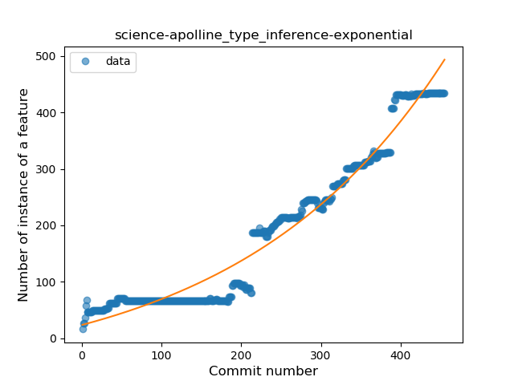
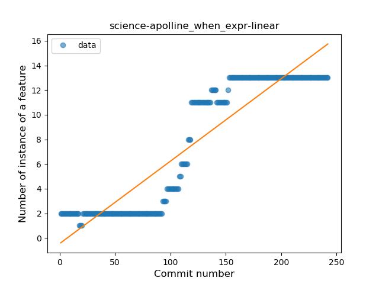
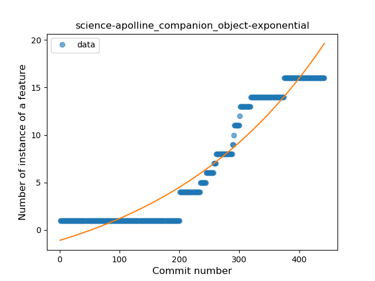
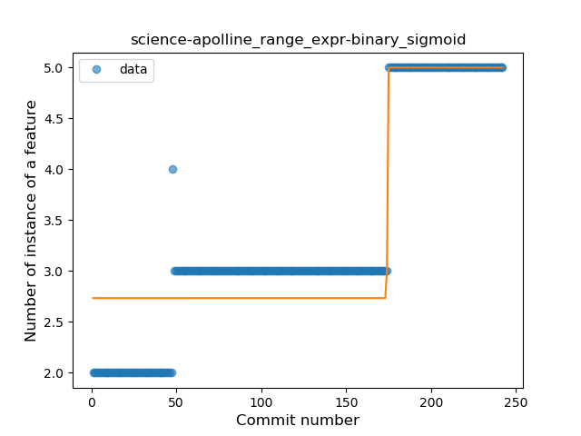
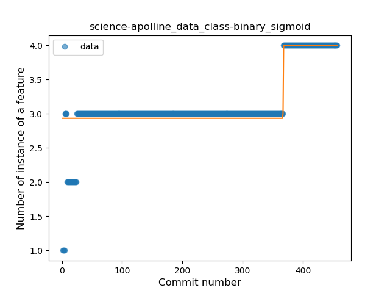
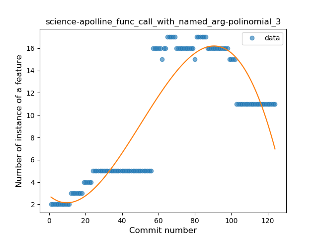
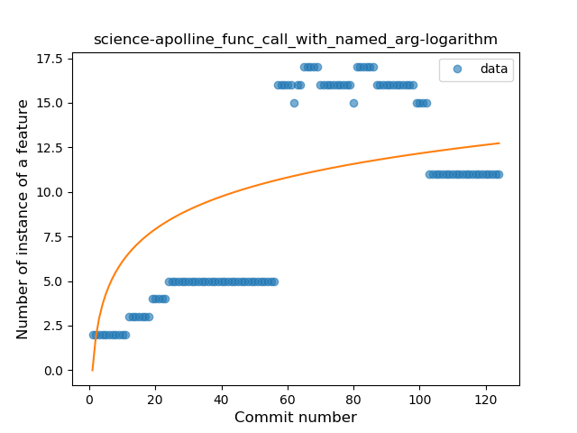

## science-apolline
----
#### Metrics provided by Detekt
* Number of lines of code 6101
* Number of Kotlin files: 52
* Cyclomatic complexity: 732
* Cyclomatic complexity by thousands of lines: 229 

----
**14** features analyzed

*	<a href="#type_inference">Type Inference</a> 
*	<a href="#lambda">Lambda</a> 
*	<a href="#safe_call">Safe Call</a> 
*	<a href="#when_expr">When expression</a> 
*	<a href="#unsafe_call">Unsafe Call</a> 
*	<a href="#companion_object">Companion Object</a> 
*	<a href="#string_template">String Template</a> 
*	<a href="#singleton">Singleton</a> 
*	<a href="#range_expr">Range Expression</a> 
*	<a href="#smart_cast">Smart Cast</a> 
*	<a href="#data_class">Data Class</a> 
*	<a href="#func_call_with_named_arg">Function call with Named Argument</a> 
*	<a href="#property_delegation">Property Delegation</a> 
*	<a href="#destructuring_declaration">Destructuring Declaration</a> 

### <a name="type_inference">Type Inference</a>
----
#### Functions
* **Sudden Rise - Exponential:** 
    * **R_Squared:** 0.95995181
* **Constant Rise - Linear:** 
    * **R_Squared:** 0.90610625
* **Plateau Sudden Rise - Binary Sigmoid:** 
    * **R_Squared:** 0.76259459
* **Sudden Rise Plateau - Logarithm:** 
    * **R_Squared:** 0.33475551

**Plots** :chart_with_upwards_trend:
-----

### <a name="lambda">Lambda</a>
----
#### Functions
* **Plateau Gradual Rise - Sigmoid:** 
    * **R_Squared:** 0.98422681
* **Sudden Rise - Exponential:** 
    * **R_Squared:** 0.92485682
* **Constant Rise - Linear:** 
    * **R_Squared:** 0.84257958
* **Sudden Rise Plateau - Logarithm:** 
    * **R_Squared:** 0.20711717

**Plots** :chart_with_upwards_trend:
-----

### <a name="safe_call">Safe Call</a>
----
#### Functions
* **Constant Rise - Linear:** 
    * **R_Squared:** 0.90454192
* **Sudden Rise Plateau - Logarithm:** 
    * **R_Squared:** 0.58502717

**Plots** :chart_with_upwards_trend:
-----

### <a name="when_expr">When expression</a>
----
#### Functions
* **Constant Rise - Linear:** 
    * **R_Squared:** 0.84750078
* **Sudden Rise Plateau - Logarithm:** 
    * **R_Squared:** 0.40199618

**Plots** :chart_with_upwards_trend:
-----

### <a name="unsafe_call">Unsafe Call</a>
----
#### Functions
* **Sudden Rise - Exponential:** 
    * **R_Squared:** 0.85839772
* **Constant Rise - Linear:** 
    * **R_Squared:** 0.81029742
* **Sudden Rise Plateau - Logarithm:** 
    * **R_Squared:** 0.25675004
* **Plateau Gradual Rise - Sigmoid:** 
    * **R_Squared:** 0.07709739

**Plots** :chart_with_upwards_trend:
-----

### <a name="companion_object">Companion Object</a>
----
#### Functions
* **Sudden Rise - Exponential:** 
    * **R_Squared:** 0.91936409
* **Constant Rise - Linear:** 
    * **R_Squared:** 0.87076136
* **Sudden Rise Plateau - Logarithm:** 
    * **R_Squared:** 0.25782918

**Plots** :chart_with_upwards_trend:
-----

### <a name="string_template">String Template</a>
----
#### Functions
* **Sudden Rise - Exponential:** 
    * **R_Squared:** 0.9305277
* **Constant Rise - Linear:** 
    * **R_Squared:** 0.80867131
* **Sudden Rise Plateau - Logarithm:** 
    * **R_Squared:** 0.26996454
* **Plateau Sudden Rise - Binary Sigmoid:** 
    * **R_Squared:** 0.04649029

**Plots** :chart_with_upwards_trend:
-----

### <a name="singleton">Singleton</a>
----
#### Functions
* **Plateau Gradual Rise - Sigmoid:** 
    * **R_Squared:** 0.90602644
* **Constant Rise - Linear:** 
    * **R_Squared:** 0.83114993
* **Sudden Rise - Exponential:** 
    * **R_Squared:** 0.83157574
* **Sudden Rise Plateau - Logarithm:** 
    * **R_Squared:** 0.57938203

**Plots** :chart_with_upwards_trend:
-----

### <a name="range_expr">Range Expression</a>
----
#### Functions
* **Plateau Sudden Rise - Binary Sigmoid:** 
    * **R_Squared:** 0.87516526
* **Sudden Rise - Exponential:** 
    * **R_Squared:** 0.81917304
* **Constant Rise - Linear:** 
    * **R_Squared:** 0.78909874
* **Sudden Rise Plateau - Logarithm:** 
    * **R_Squared:** 0.54472335

**Plots** :chart_with_upwards_trend:
-----

### <a name="smart_cast">Smart Cast</a>
----
#### Functions
* **Plateau Sudden Rise - Binary Sigmoid:** 
    * **R_Squared:** 1.0
* **Sudden Rise Plateau - Logarithm:** 
    * **R_Squared:** 0.6690991
* **Constant Rise - Linear:** 
    * **R_Squared:** 0.45085054

**Plots** :chart_with_upwards_trend:
-----

### <a name="data_class">Data Class</a>
----
#### Functions
* **Plateau Sudden Rise - Binary Sigmoid:** 
    * **R_Squared:** 0.72946833
* **Sudden Rise - Exponential:** 
    * **R_Squared:** 0.62502078
* **Constant Rise - Linear:** 
    * **R_Squared:** 0.52772083
* **Sudden Rise Plateau - Logarithm:** 
    * **R_Squared:** 0.47753885

**Plots** :chart_with_upwards_trend:
-----

### <a name="func_call_with_named_arg">Function call with Named Argument</a>
----
#### Functions
* **Instability - Polinomial 3:** )
    * **R_Squared:** 0.82757456
* **Constant Rise - Linear:** 
    * **R_Squared:** 0.53965279
* **Sudden Rise Plateau - Logarithm:** 
    * **R_Squared:** 0.45362587

**Plots** :chart_with_upwards_trend:
-----

### <a name="property_delegation">Property Delegation</a>
----
#### Functions
* **Sudden Rise Plateau - Logarithm:** 
    * **R_Squared:** 0.85227937
* **Constant Rise - Linear:** 
    * **R_Squared:** 0.83718367
* **Plateau Sudden Rise - Binary Sigmoid:** 
    * **R_Squared:** 0.22710877

**Plots** :chart_with_upwards_trend:
-----

### <a name="destructuring_declaration">Destructuring Declaration</a>
----
#### Functions
* **Plateau Sudden Decline - Binary Sigmoid:** 
    * **R_Squared:** 1.0
* **Sudden Decline - Exponential:** 
    * **R_Squared:** 0.81535484
* **Constant Decline - Linear:** 
    * **R_Squared:** 0.03903895
* **Sudden Rise Plateau - Logarithm:** 
    * **R_Squared:** -0.0

**Plots** :chart_with_upwards_trend:
-----

