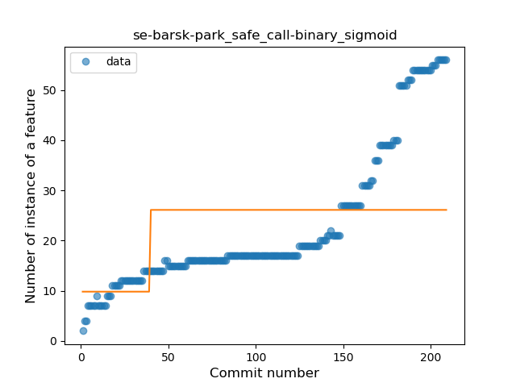
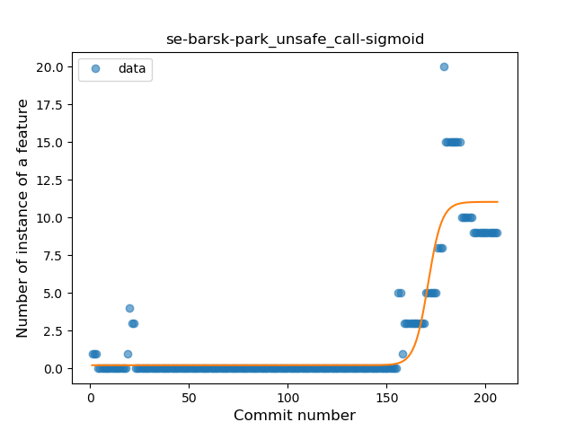
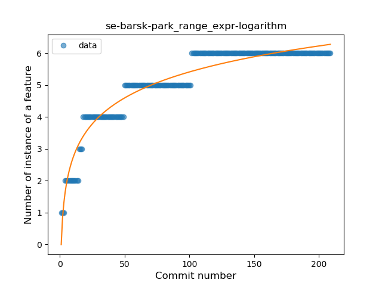
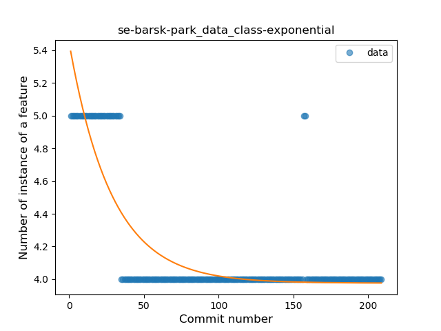
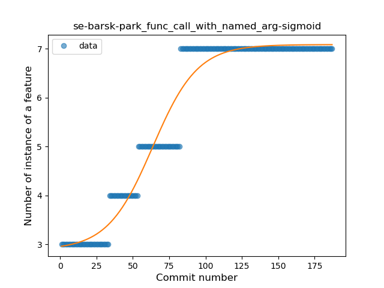
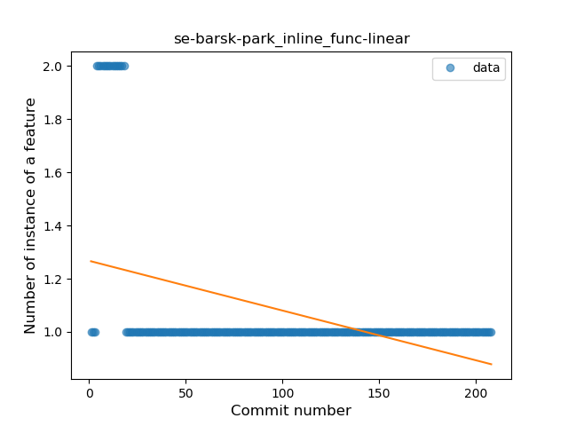

## se-barsk-park
----
#### Metrics provided by Detekt
* Number of lines of code 5685
* Number of Kotlin files: 75
* Cyclomatic complexity: 749
* Cyclomatic complexity by thousands of lines: 243 

----
**18** features analyzed

*	<a href="#type_inference">Type Inference</a> 
*	<a href="#lambda">Lambda</a> 
*	<a href="#safe_call">Safe Call</a> 
*	<a href="#when_expr">When expression</a> 
*	<a href="#unsafe_call">Unsafe Call</a> 
*	<a href="#companion_object">Companion Object</a> 
*	<a href="#string_template">String Template</a> 
*	<a href="#func_with_default_value">Function with Default Value</a> 
*	<a href="#singleton">Singleton</a> 
*	<a href="#range_expr">Range Expression</a> 
*	<a href="#smart_cast">Smart Cast</a> 
*	<a href="#data_class">Data Class</a> 
*	<a href="#func_call_with_named_arg">Function call with Named Argument</a> 
*	<a href="#extension_function">Extension Function</a> 
*	<a href="#property_delegation">Property Delegation</a> 
*	<a href="#destructuring_declaration">Destructuring Declaration</a> 
*	<a href="#inline_func">Inline Function</a> 
*	<a href="#sealed_class">Sealed Class</a> 

### <a name="type_inference">Type Inference</a>
----
#### Functions
* **Constant Rise - Linear:** 
    * **R_Squared:** 0.99096929
* **Sudden Rise - Exponential:** 
    * **R_Squared:** 0.993054
* **Sudden Rise Plateau - Logarithm:** 
    * **R_Squared:** 0.56740282

**Plots** :chart_with_upwards_trend:
-----

### <a name="lambda">Lambda</a>
----
#### Functions
* **Constant Rise - Linear:** 
    * **R_Squared:** 0.95390199
* **Sudden Rise - Exponential:** 
    * **R_Squared:** 0.96171057
* **Sudden Rise Plateau - Logarithm:** 
    * **R_Squared:** 0.6905064

**Plots** :chart_with_upwards_trend:
-----

### <a name="safe_call">Safe Call</a>
----
#### Functions
* **Sudden Rise - Exponential:** 
    * **R_Squared:** 0.95437837
* **Constant Rise - Linear:** 
    * **R_Squared:** 0.77143228
* **Sudden Rise Plateau - Logarithm:** 
    * **R_Squared:** 0.37032055
* **Plateau Sudden Rise - Binary Sigmoid:** 
    * **R_Squared:** 0.19989631

**Plots** :chart_with_upwards_trend:
-----

### <a name="when_expr">When expression</a>
----
#### Functions
* **Sudden Rise - Exponential:** 
    * **R_Squared:** 0.87399456
* **Constant Rise - Linear:** 
    * **R_Squared:** 0.78087281
* **Sudden Rise Plateau - Logarithm:** 
    * **R_Squared:** 0.5227297

**Plots** :chart_with_upwards_trend:
-----

### <a name="unsafe_call">Unsafe Call</a>
----
#### Functions
* **Plateau Gradual Rise - Sigmoid:** 
    * **R_Squared:** 0.8704499
* **Sudden Rise - Exponential:** 
    * **R_Squared:** 0.7056493
* **Constant Rise - Linear:** 
    * **R_Squared:** 0.42374532
* **Sudden Rise Plateau - Logarithm:** 
    * **R_Squared:** 0.08476413

**Plots** :chart_with_upwards_trend:
-----

### <a name="companion_object">Companion Object</a>
----
#### Functions
* **Constant Rise - Linear:** 
    * **R_Squared:** 0.86245641
* **Sudden Rise Plateau - Logarithm:** 
    * **R_Squared:** 0.69161313

**Plots** :chart_with_upwards_trend:
-----

### <a name="string_template">String Template</a>
----
#### Functions
* **Plateau Gradual Rise - Sigmoid:** 
    * **R_Squared:** 0.92156475
* **Sudden Rise - Exponential:** 
    * **R_Squared:** 0.90019785
* **Constant Rise - Linear:** 
    * **R_Squared:** 0.74245214
* **Sudden Rise Plateau - Logarithm:** 
    * **R_Squared:** 0.43698947

**Plots** :chart_with_upwards_trend:
-----

### <a name="func_with_default_value">Function with Default Value</a>
----
#### Functions
* **Sudden Rise - Exponential:** 
    * **R_Squared:** 0.94225576
* **Constant Rise - Linear:** 
    * **R_Squared:** 0.8909794
* **Sudden Rise Plateau - Logarithm:** 
    * **R_Squared:** 0.40610847

**Plots** :chart_with_upwards_trend:
-----

### <a name="singleton">Singleton</a>
----
#### Functions
* **Sudden Rise Plateau - Logarithm:** 
    * **R_Squared:** 0.59924169
* **Constant Rise - Linear:** 
    * **R_Squared:** 0.5859714

**Plots** :chart_with_upwards_trend:
-----

### <a name="range_expr">Range Expression</a>
----
#### Functions
* **Sudden Rise Plateau - Logarithm:** 
    * **R_Squared:** 0.92967439
* **Constant Rise - Linear:** 
    * **R_Squared:** 0.71397842

**Plots** :chart_with_upwards_trend:
-----

### <a name="smart_cast">Smart Cast</a>
----
#### Functions
* **Plateau Gradual Rise - Sigmoid:** 
    * **R_Squared:** 0.9689188
* **Sudden Rise - Exponential:** 
    * **R_Squared:** 0.85616808
* **Constant Rise - Linear:** 
    * **R_Squared:** 0.65128674
* **Sudden Rise Plateau - Logarithm:** 
    * **R_Squared:** 0.32895296

**Plots** :chart_with_upwards_trend:
-----

### <a name="data_class">Data Class</a>
----
#### Functions
* **Sudden Decline - Exponential:** 
    * **R_Squared:** 0.72421247
* **Constant Decline - Linear:** 
    * **R_Squared:** 0.3633405
* **Sudden Rise Plateau - Logarithm:** 
    * **R_Squared:** 0.0

**Plots** :chart_with_upwards_trend:
-----

### <a name="func_call_with_named_arg">Function call with Named Argument</a>
----
#### Functions
* **Plateau Gradual Rise - Sigmoid:** 
    * **R_Squared:** 0.95987085
* **Constant Rise - Linear:** 
    * **R_Squared:** 0.80988753
* **Sudden Rise Plateau - Logarithm:** 
    * **R_Squared:** 0.76096893

**Plots** :chart_with_upwards_trend:
-----

### <a name="extension_function">Extension Function</a>
----
#### Functions
* **Plateau Sudden Rise - Binary Sigmoid:** 
    * **R_Squared:** 1.0
* **Constant Rise - Linear:** 
    * **R_Squared:** 0.74741676
* **Sudden Rise - Exponential:** 
    * **R_Squared:** 0.75048112
* **Sudden Rise Plateau - Logarithm:** 
    * **R_Squared:** 0.50709317

**Plots** :chart_with_upwards_trend:
-----

### <a name="property_delegation">Property Delegation</a>
----
#### Functions
* **Sudden Rise - Exponential:** 
    * **R_Squared:** 0.50796041
* **Sudden Rise Plateau - Logarithm:** 
    * **R_Squared:** 0.47070511
* **Constant Rise - Linear:** 
    * **R_Squared:** 0.44914536

**Plots** :chart_with_upwards_trend:
-----

### <a name="destructuring_declaration">Destructuring Declaration</a>
----
#### Functions
* **Plateau Gradual Rise - Sigmoid:** 
    * **R_Squared:** 0.48748375
* **Sudden Rise Plateau - Logarithm:** 
    * **R_Squared:** 0.18311972
* **Constant Rise - Linear:** 
    * **R_Squared:** 0.00916937

**Plots** :chart_with_upwards_trend:
-----

### <a name="inline_func">Inline Function</a>
----
#### Functions
* **Plateau Sudden Decline - Binary Sigmoid:** 
    * **R_Squared:** 0.82037997
* **Sudden Decline - Exponential:** 
    * **R_Squared:** 0.51942106
* **Constant Decline - Linear:** 
    * **R_Squared:** 0.18846113
* **Sudden Rise Plateau - Logarithm:** 
    * **R_Squared:** 0.0

**Plots** :chart_with_upwards_trend:
-----

### <a name="sealed_class">Sealed Class</a>
----
#### Functions
* **Plateau Sudden Rise - Binary Sigmoid:** 
    * **R_Squared:** 1.0
* **Sudden Rise - Exponential:** 
    * **R_Squared:** 0.78440699
* **Constant Rise - Linear:** 
    * **R_Squared:** 0.41826923
* **Sudden Rise Plateau - Logarithm:** 
    * **R_Squared:** 0.17784787

**Plots** :chart_with_upwards_trend:
-----

