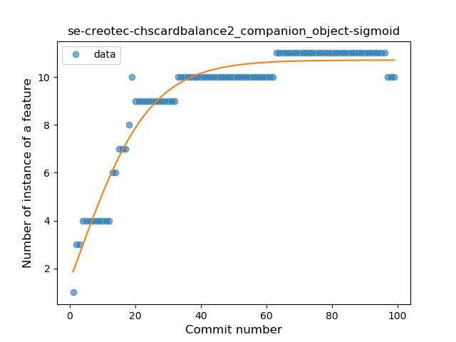

## se-creotec-chscardbalance2
----
#### Metrics provided by Detekt
* Number of lines of code 3052
* Number of Kotlin files: 39
* Cyclomatic complexity: 451
* Cyclomatic complexity by thousands of lines: 278 

----
**12** features analyzed

*	<a href="#type_inference">Type Inference</a> 
*	<a href="#lambda">Lambda</a> 
*	<a href="#safe_call">Safe Call</a> 
*	<a href="#when_expr">When expression</a> 
*	<a href="#unsafe_call">Unsafe Call</a> 
*	<a href="#companion_object">Companion Object</a> 
*	<a href="#string_template">String Template</a> 
*	<a href="#func_with_default_value">Function with Default Value</a> 
*	<a href="#singleton">Singleton</a> 
*	<a href="#range_expr">Range Expression</a> 
*	<a href="#smart_cast">Smart Cast</a> 
*	<a href="#func_call_with_named_arg">Function call with Named Argument</a> 

### <a name="type_inference">Type Inference</a>
----
#### Functions
* **Constant Rise - Linear:** 
    * **R_Squared:** 0.95071882
* **Sudden Rise Plateau - Logarithm:** 
    * **R_Squared:** 0.83174266

**Plots** :chart_with_upwards_trend:
-----

### <a name="lambda">Lambda</a>
----
#### Functions
* **Constant Rise - Linear:** 
    * **R_Squared:** 0.95889755
* **Sudden Rise Plateau - Logarithm:** 
    * **R_Squared:** 0.78690462

**Plots** :chart_with_upwards_trend:
-----

### <a name="safe_call">Safe Call</a>
----
#### Functions
* **Constant Rise - Linear:** 
    * **R_Squared:** 0.87068361
* **Sudden Rise Plateau - Logarithm:** 
    * **R_Squared:** 0.82154133

**Plots** :chart_with_upwards_trend:
-----

### <a name="when_expr">When expression</a>
----
#### Functions
* **Plateau Gradual Rise - Sigmoid:** 
    * **R_Squared:** 0.95563948
* **Constant Rise - Linear:** 
    * **R_Squared:** 0.85233437
* **Sudden Rise Plateau - Logarithm:** 
    * **R_Squared:** 0.63219796

**Plots** :chart_with_upwards_trend:
-----

### <a name="unsafe_call">Unsafe Call</a>
----
#### Functions
* **Plateau Sudden Rise - Binary Sigmoid:** 
    * **R_Squared:** 1.0
* **Sudden Rise Plateau - Logarithm:** 
    * **R_Squared:** 0.33693001
* **Constant Rise - Linear:** 
    * **R_Squared:** 0.08816327

**Plots** :chart_with_upwards_trend:
-----

### <a name="companion_object">Companion Object</a>
----
#### Functions
* **Plateau Gradual Rise - Sigmoid:** 
    * **R_Squared:** 0.94420638
* **Sudden Rise Plateau - Logarithm:** 
    * **R_Squared:** 0.89708743
* **Constant Rise - Linear:** 
    * **R_Squared:** 0.63675606

**Plots** :chart_with_upwards_trend:
-----

### <a name="string_template">String Template</a>
----
#### Functions
* **Sudden Rise - Exponential:** 
    * **R_Squared:** 0.87698553
* **Constant Rise - Linear:** 
    * **R_Squared:** 0.73155002
* **Sudden Rise Plateau - Logarithm:** 
    * **R_Squared:** 0.4952819

**Plots** :chart_with_upwards_trend:
-----

### <a name="func_with_default_value">Function with Default Value</a>
----
#### Functions
* **Plateau Gradual Rise - Sigmoid:** 
    * **R_Squared:** 0.98629218
* **Instability - Polinomial 3:** )
    * **R_Squared:** 0.94059971
* **Constant Rise - Linear:** 
    * **R_Squared:** 0.83445933
* **Sudden Rise Plateau - Logarithm:** 
    * **R_Squared:** 0.4620444

**Plots** :chart_with_upwards_trend:
-----

### <a name="singleton">Singleton</a>
----
#### Functions
* **Plateau Sudden Rise - Binary Sigmoid:** 
    * **R_Squared:** 1.0
* **Sudden Rise - Exponential:** 
    * **R_Squared:** 0.75928161
* **Constant Rise - Linear:** 
    * **R_Squared:** 0.66673469
* **Sudden Rise Plateau - Logarithm:** 
    * **R_Squared:** 0.36134733

**Plots** :chart_with_upwards_trend:
-----

### <a name="range_expr">Range Expression</a>
----
#### Functions
* **Plateau Sudden Rise - Binary Sigmoid:** 
    * **R_Squared:** 1.0
* **Constant Rise - Linear:** 
    * **R_Squared:** 0.70187166
* **Sudden Rise Plateau - Logarithm:** 
    * **R_Squared:** 0.63435959

**Plots** :chart_with_upwards_trend:
-----

### <a name="smart_cast">Smart Cast</a>
----
#### Functions
* **Plateau Gradual Rise - Sigmoid:** 
    * **R_Squared:** 0.9554923
* **Sudden Rise Plateau - Logarithm:** 
    * **R_Squared:** 0.68890281
* **Constant Rise - Linear:** 
    * **R_Squared:** 0.43571324

**Plots** :chart_with_upwards_trend:
-----

### <a name="func_call_with_named_arg">Function call with Named Argument</a>
----
#### Functions
* **Plateau Gradual Rise - Sigmoid:** 
    * **R_Squared:** 0.9760359
* **Sudden Rise - Exponential:** 
    * **R_Squared:** 0.87078881
* **Constant Rise - Linear:** 
    * **R_Squared:** 0.84335035
* **Sudden Rise Plateau - Logarithm:** 
    * **R_Squared:** 0.42632208

**Plots** :chart_with_upwards_trend:
-----

