## sjnyag-stamp
----
#### Metrics provided by Detekt
* Number of lines of code 15465
* Number of Kotlin files: 160
* Cyclomatic complexity: 2893
* Cyclomatic complexity by thousands of lines: 356 

----
**16** features analyzed

*	<a href="#type_inference">Type Inference</a> 
*	<a href="#lambda">Lambda</a> 
*	<a href="#safe_call">Safe Call</a> 
*	<a href="#when_expr">When expression</a> 
*	<a href="#companion_object">Companion Object</a> 
*	<a href="#unsafe_call">Unsafe Call</a> 
*	<a href="#string_template">String Template</a> 
*	<a href="#func_with_default_value">Function with Default Value</a> 
*	<a href="#singleton">Singleton</a> 
*	<a href="#smart_cast">Smart Cast</a> 
*	<a href="#range_expr">Range Expression</a> 
*	<a href="#func_call_with_named_arg">Function call with Named Argument</a> 
*	<a href="#extension_function">Extension Function</a> 
*	<a href="#destructuring_declaration">Destructuring Declaration</a> 
*	<a href="#inline_func">Inline Function</a> 
*	<a href="#overloaded_op">Overloaded Operator</a> 

### <a name="type_inference">Type Inference</a>
----
#### Functions
* **Instability - Polinomial 3:** )
    * **R_Squared:** 0.9492477
* **Constant Rise - Linear:** 
    * **R_Squared:** 0.87114844
* **Sudden Rise Plateau - Logarithm:** 
    * **R_Squared:** 0.38843172

**Plots** :chart_with_upwards_trend:
-----

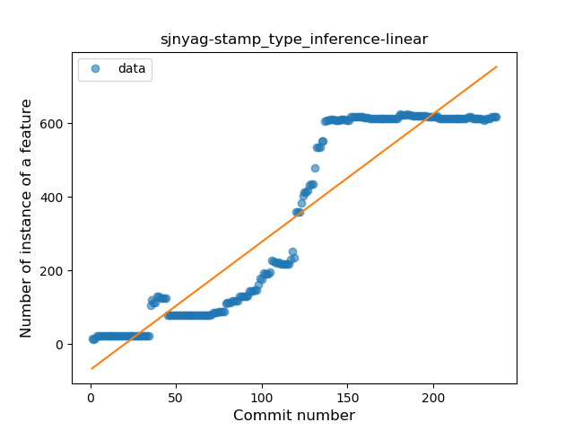
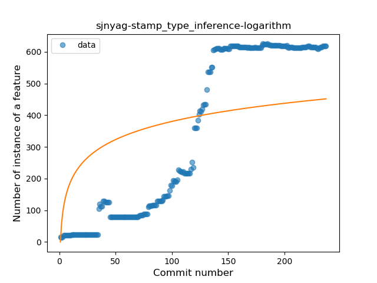
### <a name="lambda">Lambda</a>
----
#### Functions
* **Instability - Polinomial 3:** )
    * **R_Squared:** 0.96874191
* **Constant Rise - Linear:** 
    * **R_Squared:** 0.90952117
* **Sudden Rise Plateau - Logarithm:** 
    * **R_Squared:** 0.37235919

**Plots** :chart_with_upwards_trend:
-----

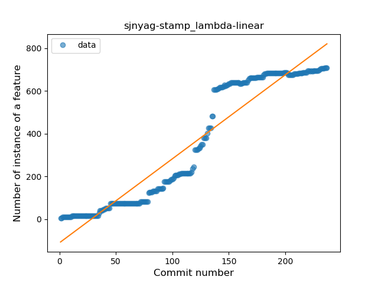
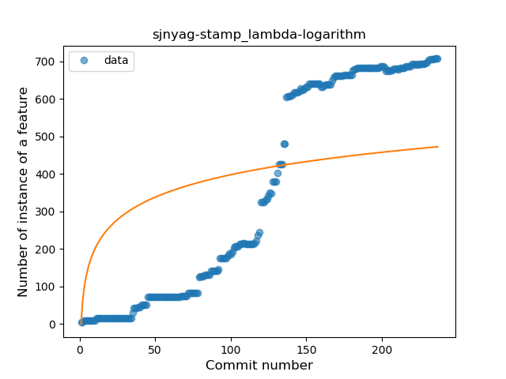
### <a name="safe_call">Safe Call</a>
----
#### Functions
* **Instability - Polinomial 3:** )
    * **R_Squared:** 0.94976081
* **Constant Rise - Linear:** 
    * **R_Squared:** 0.86556924
* **Sudden Rise - Exponential:** 
    * **R_Squared:** 0.87116861
* **Sudden Rise Plateau - Logarithm:** 
    * **R_Squared:** 0.30558882

**Plots** :chart_with_upwards_trend:
-----

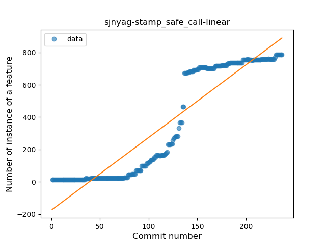
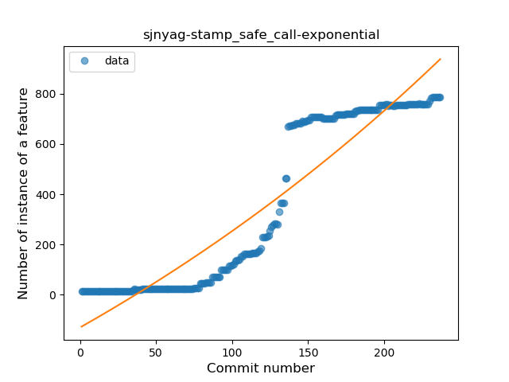
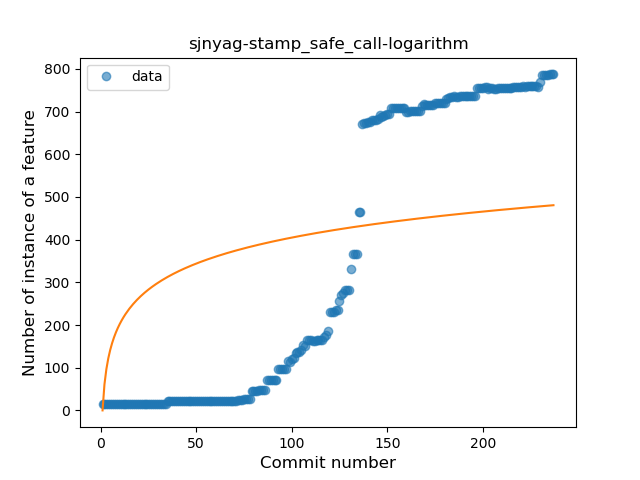
### <a name="when_expr">When expression</a>
----
#### Functions
* **Constant Rise - Linear:** 
    * **R_Squared:** 0.80927181
* **Sudden Rise Plateau - Logarithm:** 
    * **R_Squared:** 0.35442978
* **Plateau Sudden Rise - Binary Sigmoid:** 
    * **R_Squared:** 0.09536815

**Plots** :chart_with_upwards_trend:
-----

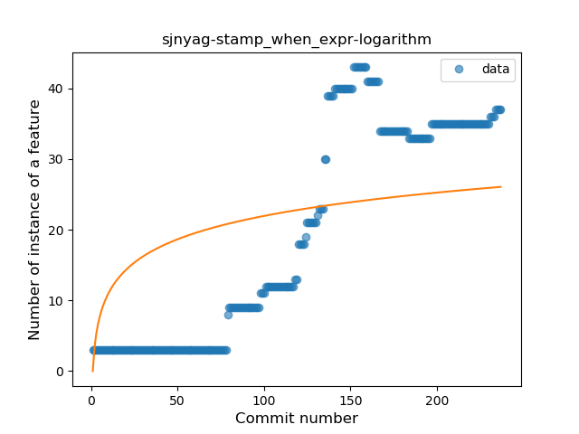
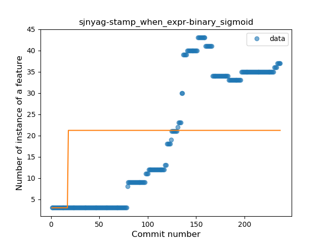
### <a name="companion_object">Companion Object</a>
----
#### Functions
* **Constant Rise - Linear:** 
    * **R_Squared:** 0.86303182
* **Sudden Rise Plateau - Logarithm:** 
    * **R_Squared:** 0.47023161
* **Plateau Sudden Rise - Binary Sigmoid:** 
    * **R_Squared:** 0.25535305

**Plots** :chart_with_upwards_trend:
-----

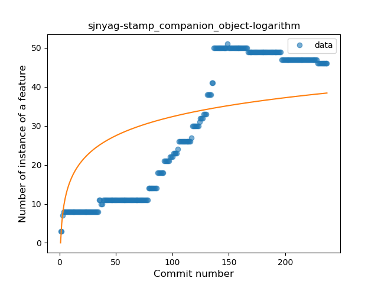
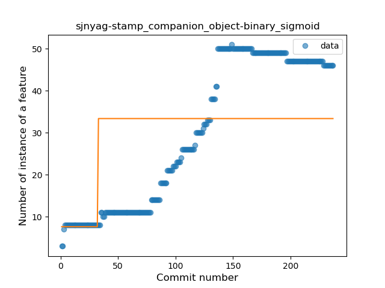
### <a name="unsafe_call">Unsafe Call</a>
----
#### Functions
* **Constant Rise - Linear:** 
    * **R_Squared:** 0.57098188
* **Sudden Rise Plateau - Logarithm:** 
    * **R_Squared:** 0.42620151

**Plots** :chart_with_upwards_trend:
-----

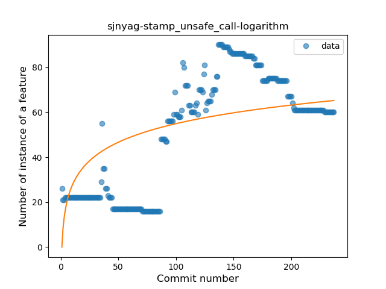
### <a name="string_template">String Template</a>
----
#### Functions
* **Sudden Rise - Exponential:** 
    * **R_Squared:** 0.84559186
* **Constant Rise - Linear:** 
    * **R_Squared:** 0.7759368
* **Sudden Rise Plateau - Logarithm:** 
    * **R_Squared:** 0.22777543

**Plots** :chart_with_upwards_trend:
-----

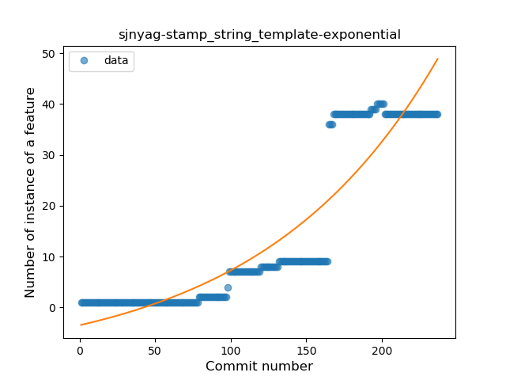
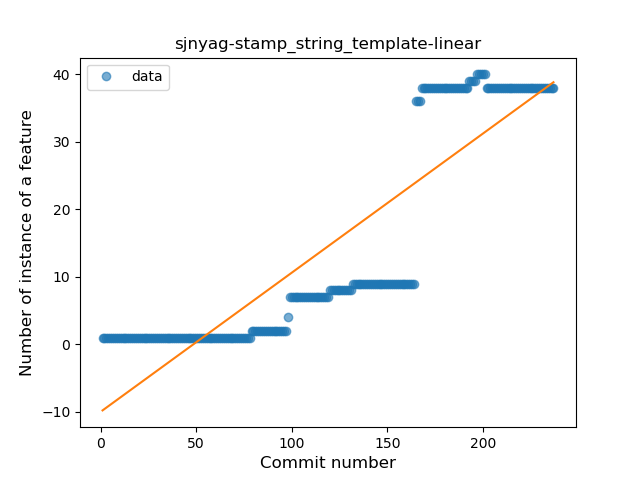
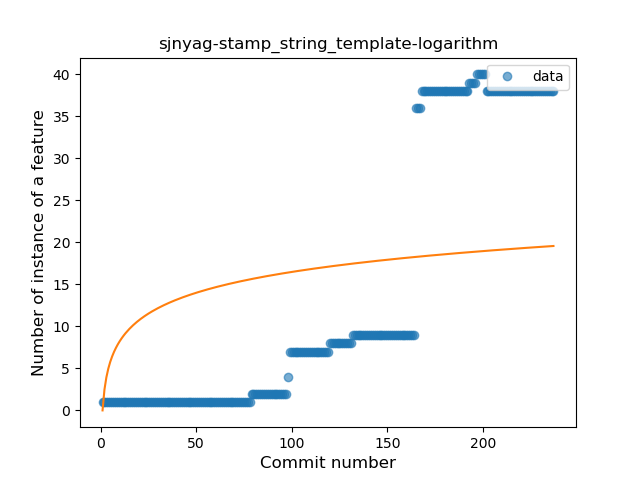
### <a name="func_with_default_value">Function with Default Value</a>
----
#### Functions
* **Sudden Rise - Exponential:** 
    * **R_Squared:** 0.75680466
* **Constant Rise - Linear:** 
    * **R_Squared:** 0.66490831
* **Sudden Rise Plateau - Logarithm:** 
    * **R_Squared:** 0.28177949

**Plots** :chart_with_upwards_trend:
-----

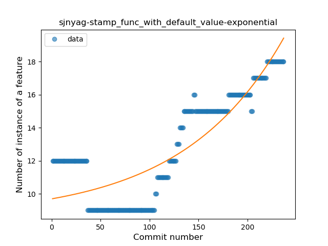
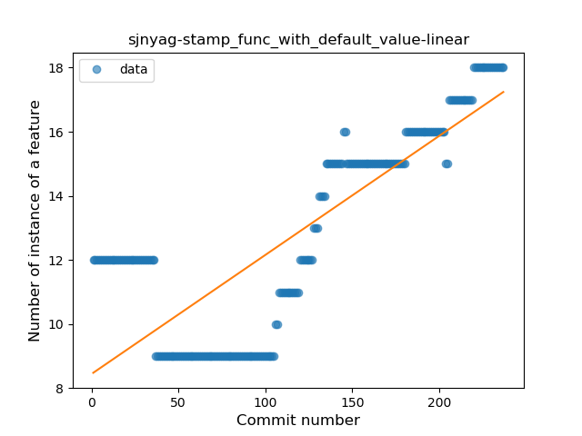
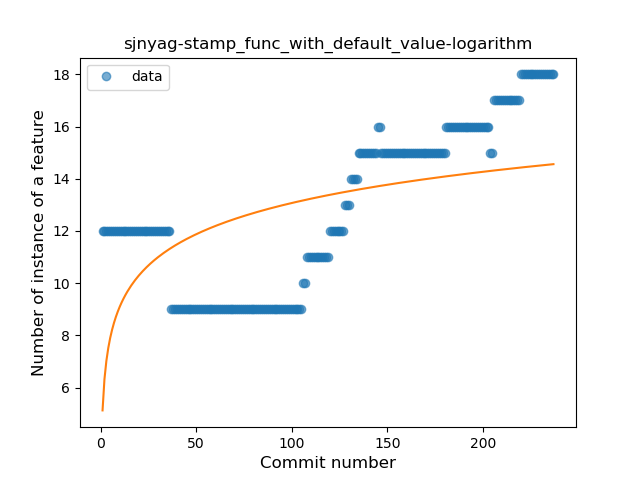
### <a name="singleton">Singleton</a>
----
#### Functions
* **Constant Rise - Linear:** 
    * **R_Squared:** 0.86317941
* **Sudden Rise Plateau - Logarithm:** 
    * **R_Squared:** 0.49648271

**Plots** :chart_with_upwards_trend:
-----

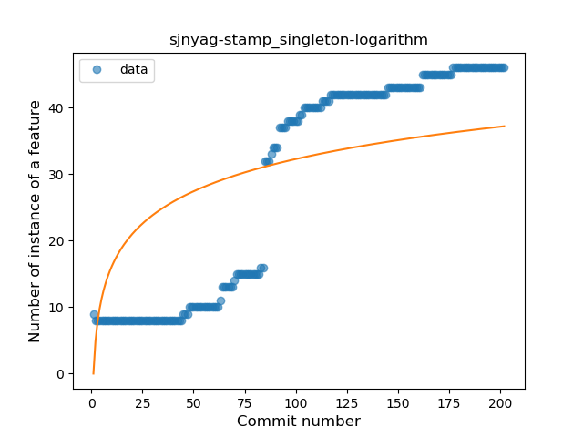
### <a name="smart_cast">Smart Cast</a>
----
#### Functions
* **Sudden Rise - Exponential:** 
    * **R_Squared:** 0.92082411
* **Constant Rise - Linear:** 
    * **R_Squared:** 0.89025641
* **Sudden Rise Plateau - Logarithm:** 
    * **R_Squared:** 0.29766069
* **Plateau Sudden Rise - Binary Sigmoid:** 
    * **R_Squared:** 0.1524431

**Plots** :chart_with_upwards_trend:
-----

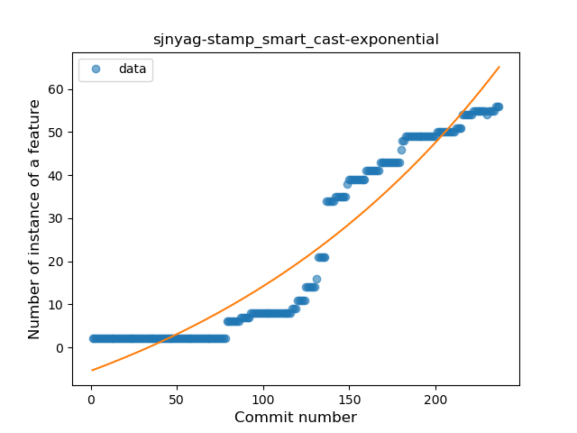
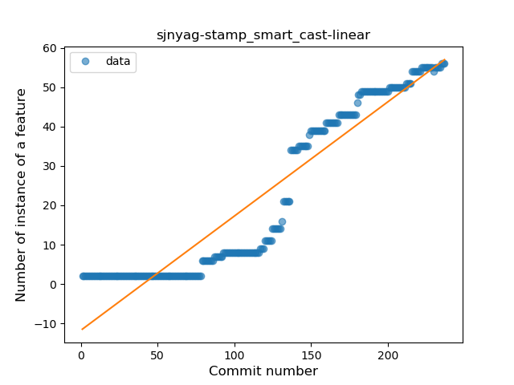
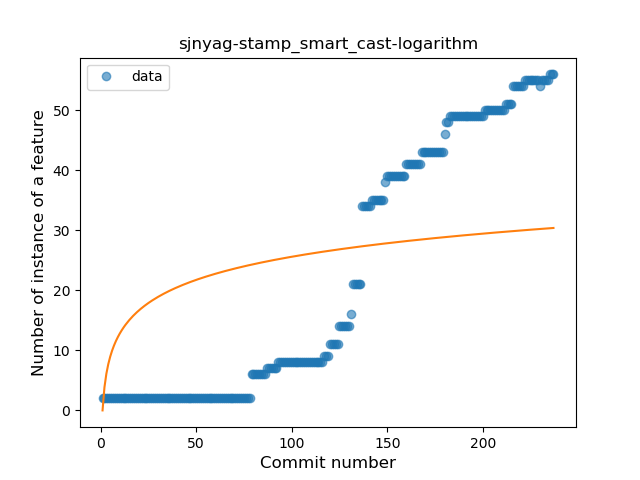
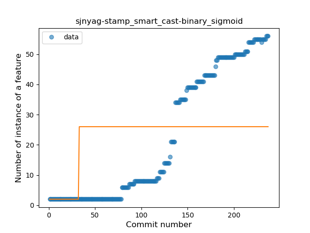
### <a name="range_expr">Range Expression</a>
----
#### Functions
* **Plateau Gradual Rise - Sigmoid:** 
    * **R_Squared:** 0.95660757
* **Constant Rise - Linear:** 
    * **R_Squared:** 0.92444848
* **Sudden Rise Plateau - Logarithm:** 
    * **R_Squared:** 0.63150155

**Plots** :chart_with_upwards_trend:
-----

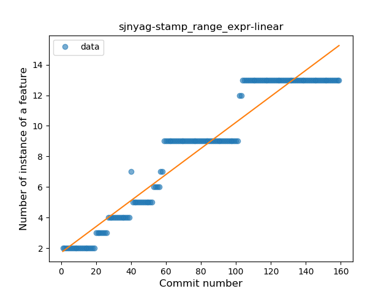
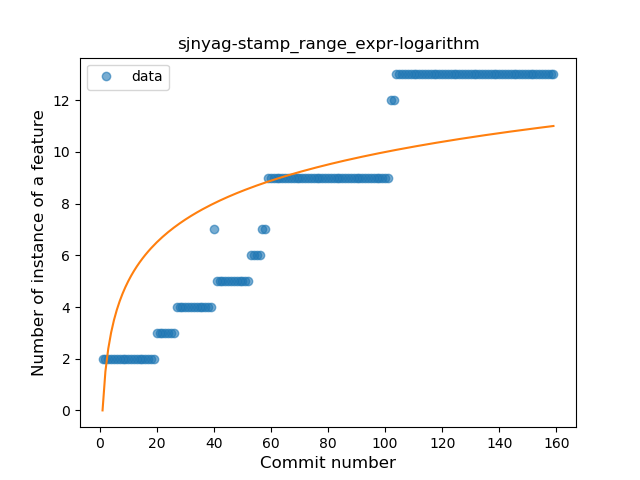
### <a name="func_call_with_named_arg">Function call with Named Argument</a>
----
#### Functions
* **Sudden Decline - Exponential:** 
    * **R_Squared:** 0.13029862
* **Constant Decline - Linear:** 
    * **R_Squared:** 0.02241313
* **Plateau Sudden Rise - Binary Sigmoid:** 
    * **R_Squared:** 0.02541671
* **Sudden Rise Plateau - Logarithm:** 
    * **R_Squared:** -0.0

**Plots** :chart_with_upwards_trend:
-----

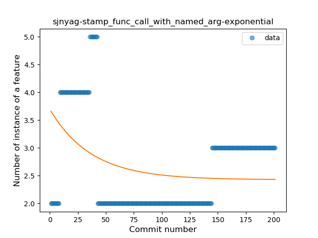
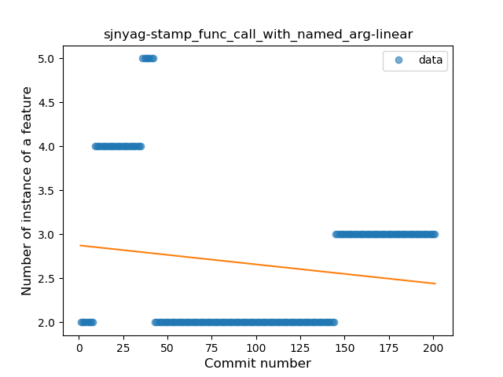
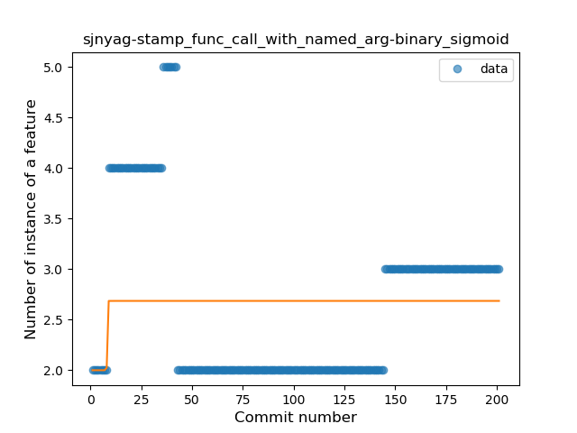
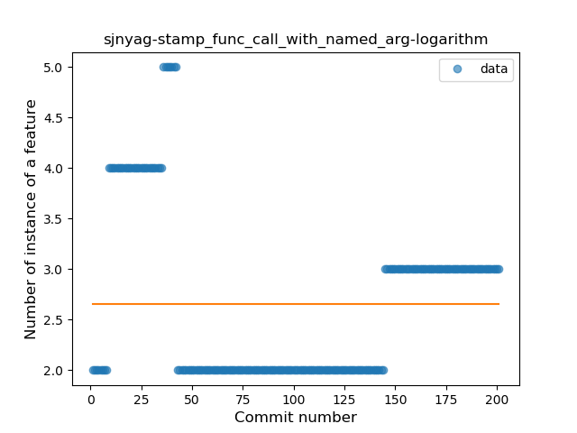
### <a name="extension_function">Extension Function</a>
----
#### Functions
* **Sudden Rise - Exponential:** 
    * **R_Squared:** 0.93973916
* **Constant Rise - Linear:** 
    * **R_Squared:** 0.9004082
* **Sudden Rise Plateau - Logarithm:** 
    * **R_Squared:** 0.49135808

**Plots** :chart_with_upwards_trend:
-----

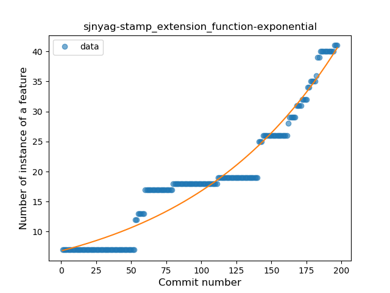
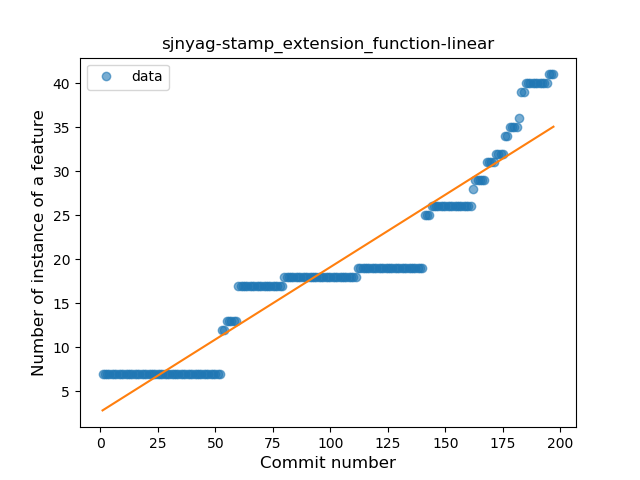
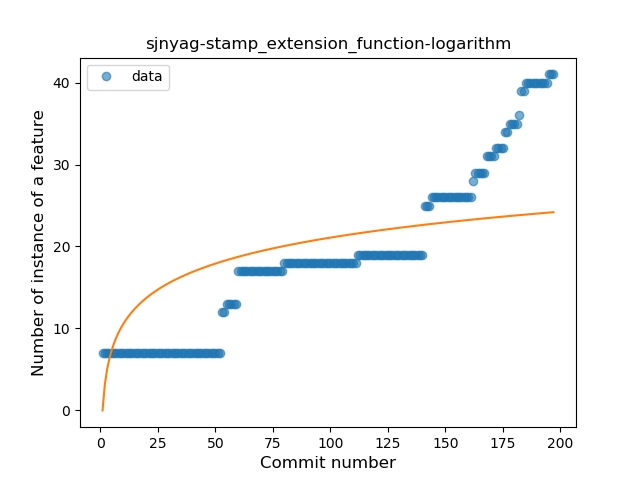
### <a name="destructuring_declaration">Destructuring Declaration</a>
----
#### Functions
* **Constant Rise - Linear:** 
    * **R_Squared:** 0.74697342
* **Sudden Rise Plateau - Logarithm:** 
    * **R_Squared:** 0.68613208

**Plots** :chart_with_upwards_trend:
-----

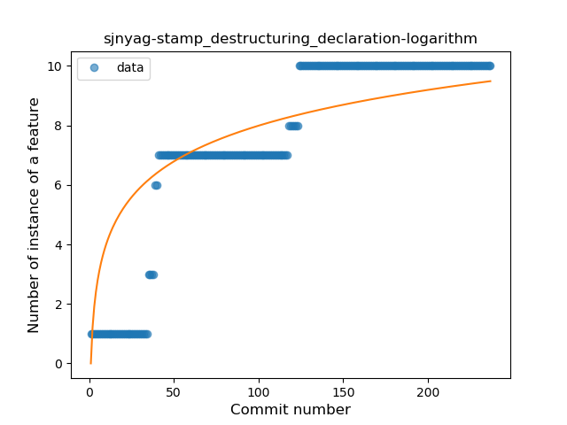
### <a name="inline_func">Inline Function</a>
----
#### Functions
* **Plateau Sudden Rise - Binary Sigmoid:** 
    * **R_Squared:** 1.0
* **Sudden Rise - Exponential:** 
    * **R_Squared:** 0.81791614
* **Constant Rise - Linear:** 
    * **R_Squared:** 0.15746141
* **Sudden Rise Plateau - Logarithm:** 
    * **R_Squared:** 0.06443901

**Plots** :chart_with_upwards_trend:
-----

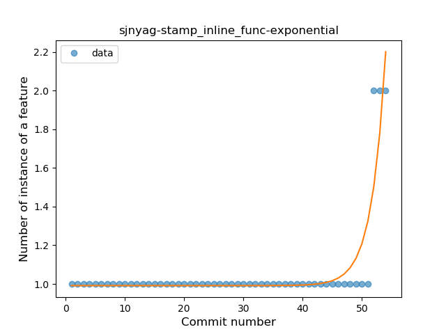
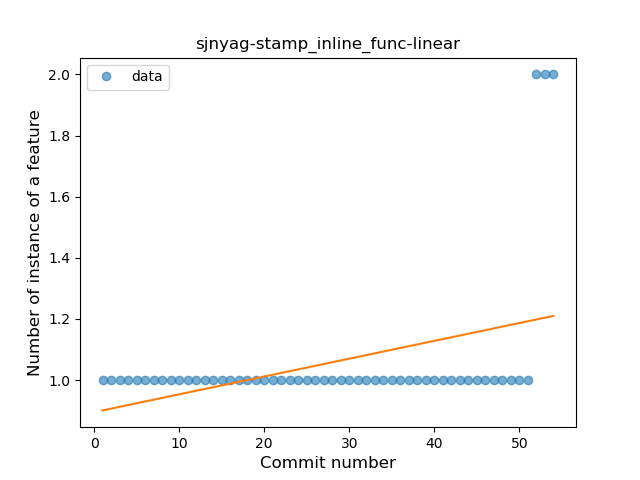
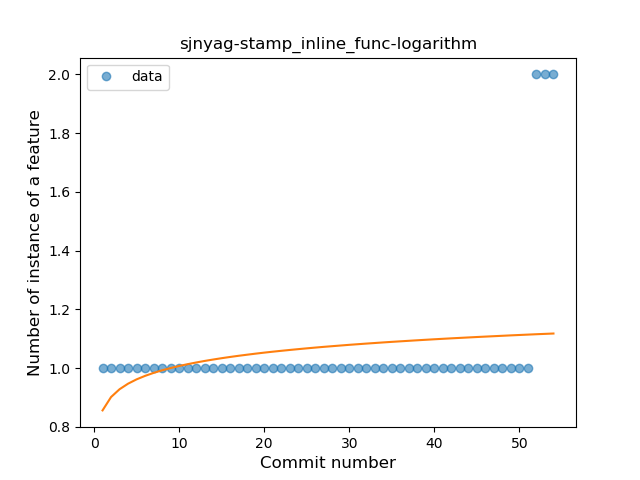
### <a name="overloaded_op">Overloaded Operator</a>
----
#### Functions
* **Plateau Gradual Rise - Sigmoid:** 
    * **R_Squared:** 0.95179675
* **Sudden Rise Plateau - Logarithm:** 
    * **R_Squared:** 0.71540256
* **Constant Rise - Linear:** 
    * **R_Squared:** 0.36776336

**Plots** :chart_with_upwards_trend:
-----

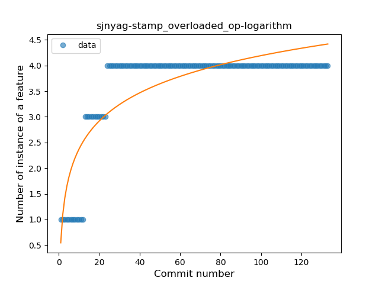
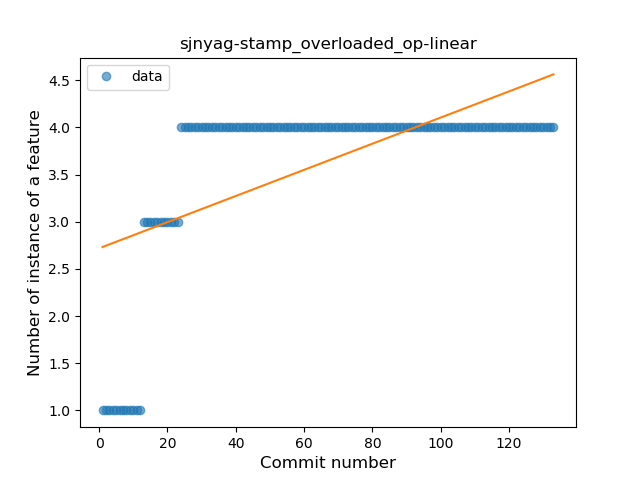
