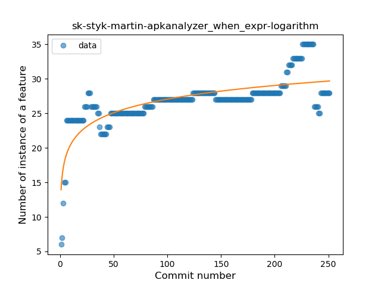
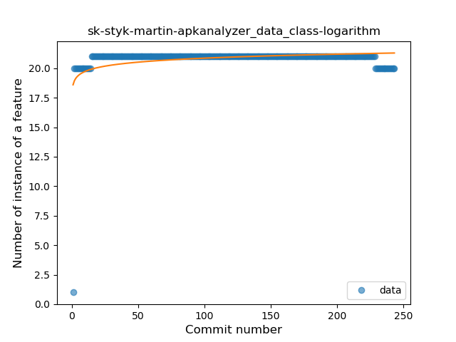
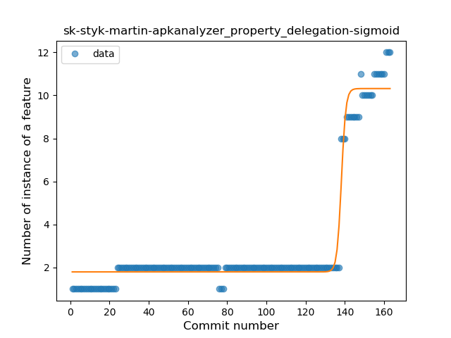
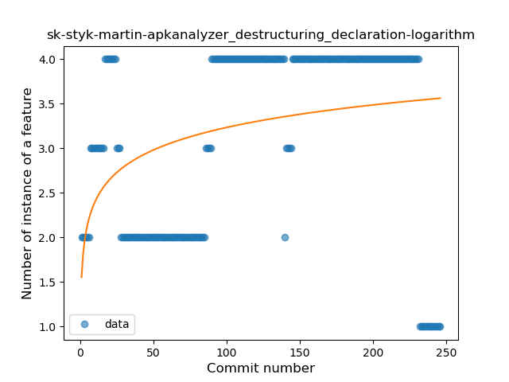

## sk-styk-martin-apkanalyzer
----
#### Metrics provided by Detekt
* Number of lines of code 8453
* Number of Kotlin files: 175
* Cyclomatic complexity: 1194
* Cyclomatic complexity by thousands of lines: 290 

----
**18** features analyzed

*	<a href="#type_inference">Type Inference</a> 
*	<a href="#lambda">Lambda</a> 
*	<a href="#safe_call">Safe Call</a> 
*	<a href="#when_expr">When expression</a> 
*	<a href="#unsafe_call">Unsafe Call</a> 
*	<a href="#companion_object">Companion Object</a> 
*	<a href="#string_template">String Template</a> 
*	<a href="#func_with_default_value">Function with Default Value</a> 
*	<a href="#singleton">Singleton</a> 
*	<a href="#range_expr">Range Expression</a> 
*	<a href="#smart_cast">Smart Cast</a> 
*	<a href="#data_class">Data Class</a> 
*	<a href="#func_call_with_named_arg">Function call with Named Argument</a> 
*	<a href="#extension_function">Extension Function</a> 
*	<a href="#property_delegation">Property Delegation</a> 
*	<a href="#destructuring_declaration">Destructuring Declaration</a> 
*	<a href="#inline_func">Inline Function</a> 
*	<a href="#sealed_class">Sealed Class</a> 

### <a name="type_inference">Type Inference</a>
----
#### Functions
* **Sudden Rise Plateau - Logarithm:** 
    * **R_Squared:** 0.42002829
* **Constant Rise - Linear:** 
    * **R_Squared:** 0.19268105
* **Plateau Sudden Rise - Binary Sigmoid:** 
    * **R_Squared:** 0.10863783

**Plots** :chart_with_upwards_trend:
-----

### <a name="lambda">Lambda</a>
----
#### Functions
* **Sudden Rise - Exponential:** 
    * **R_Squared:** 0.87557318
* **Constant Rise - Linear:** 
    * **R_Squared:** 0.67739749
* **Sudden Rise Plateau - Logarithm:** 
    * **R_Squared:** 0.49821531
* **Plateau Gradual Rise - Sigmoid:** 
    * **R_Squared:** 0.20103395

**Plots** :chart_with_upwards_trend:
-----

### <a name="safe_call">Safe Call</a>
----
#### Functions
* **Constant Rise - Linear:** 
    * **R_Squared:** 0.91379082
* **Sudden Rise Plateau - Logarithm:** 
    * **R_Squared:** 0.83871375
* **Plateau Sudden Rise - Binary Sigmoid:** 
    * **R_Squared:** 0.66819815

**Plots** :chart_with_upwards_trend:
-----

### <a name="when_expr">When expression</a>
----
#### Functions
* **Sudden Rise Plateau - Logarithm:** 
    * **R_Squared:** 0.60126018
* **Constant Rise - Linear:** 
    * **R_Squared:** 0.48327057
* **Plateau Sudden Rise - Binary Sigmoid:** 
    * **R_Squared:** 0.26157118

**Plots** :chart_with_upwards_trend:
-----

### <a name="unsafe_call">Unsafe Call</a>
----
#### Functions
* **Plateau Sudden Decline - Binary Sigmoid:** 
    * **R_Squared:** 0.13580445
* **Constant Decline - Linear:** 
    * **R_Squared:** 0.04908346
* **Sudden Rise - Exponential:** 
    * **R_Squared:** 0.0
* **Sudden Rise Plateau - Logarithm:** 
    * **R_Squared:** -0.0

**Plots** :chart_with_upwards_trend:
-----

### <a name="companion_object">Companion Object</a>
----
#### Functions
* **Sudden Rise Plateau - Logarithm:** 
    * **R_Squared:** 0.63971162
* **Plateau Sudden Rise - Binary Sigmoid:** 
    * **R_Squared:** 0.48289352
* **Constant Rise - Linear:** 
    * **R_Squared:** 0.26398055

**Plots** :chart_with_upwards_trend:
-----

### <a name="string_template">String Template</a>
----
#### Functions
* **Plateau Gradual Rise - Sigmoid:** 
    * **R_Squared:** 0.82121244
* **Constant Rise - Linear:** 
    * **R_Squared:** 0.53202787
* **Sudden Rise Plateau - Logarithm:** 
    * **R_Squared:** 0.39481834

**Plots** :chart_with_upwards_trend:
-----

### <a name="func_with_default_value">Function with Default Value</a>
----
#### Functions
* **Sudden Rise Plateau - Logarithm:** 
    * **R_Squared:** 0.7623544
* **Plateau Gradual Rise - Sigmoid:** 
    * **R_Squared:** 0.70725202
* **Constant Rise - Linear:** 
    * **R_Squared:** 0.49377171

**Plots** :chart_with_upwards_trend:
-----

### <a name="singleton">Singleton</a>
----
#### Functions
* **Sudden Rise Plateau - Logarithm:** 
    * **R_Squared:** 0.46866101
* **Constant Rise - Linear:** 
    * **R_Squared:** 0.29522711
* **Plateau Sudden Rise - Binary Sigmoid:** 
    * **R_Squared:** 0.22476907

**Plots** :chart_with_upwards_trend:
-----

### <a name="range_expr">Range Expression</a>
----
#### Functions
* **Plateau Sudden Rise - Binary Sigmoid:** 
    * **R_Squared:** 0.60968618
* **Sudden Rise - Exponential:** 
    * **R_Squared:** 0.33555371
* **Sudden Rise Plateau - Logarithm:** 
    * **R_Squared:** 0.27866227
* **Constant Rise - Linear:** 
    * **R_Squared:** 0.14222275

**Plots** :chart_with_upwards_trend:
-----

### <a name="smart_cast">Smart Cast</a>
----
#### Functions
* **Sudden Rise Plateau - Logarithm:** 
    * **R_Squared:** 0.45197578
* **Constant Rise - Linear:** 
    * **R_Squared:** 0.27969942

**Plots** :chart_with_upwards_trend:
-----

### <a name="data_class">Data Class</a>
----
#### Functions
* **Sudden Rise Plateau - Logarithm:** 
    * **R_Squared:** 0.12782393
* **Plateau Sudden Rise - Binary Sigmoid:** 
    * **R_Squared:** 0.05644789
* **Constant Rise - Linear:** 
    * **R_Squared:** 0.00960144

**Plots** :chart_with_upwards_trend:
-----

### <a name="func_call_with_named_arg">Function call with Named Argument</a>
----
#### Functions
* **Sudden Rise Plateau - Logarithm:** 
    * **R_Squared:** 0.44549557
* **Constant Rise - Linear:** 
    * **R_Squared:** 0.12949602

**Plots** :chart_with_upwards_trend:
-----

### <a name="extension_function">Extension Function</a>
----
#### Functions
* **Constant Rise - Linear:** 
    * **R_Squared:** 0.67213473
* **Sudden Rise - Exponential:** 
    * **R_Squared:** 0.6815621
* **Sudden Rise Plateau - Logarithm:** 
    * **R_Squared:** 0.44242824

**Plots** :chart_with_upwards_trend:
-----

### <a name="property_delegation">Property Delegation</a>
----
#### Functions
* **Plateau Gradual Rise - Sigmoid:** 
    * **R_Squared:** 0.96455963
* **Sudden Rise - Exponential:** 
    * **R_Squared:** 0.870937
* **Constant Rise - Linear:** 
    * **R_Squared:** 0.47082771
* **Sudden Rise Plateau - Logarithm:** 
    * **R_Squared:** 0.17756567

**Plots** :chart_with_upwards_trend:
-----

### <a name="destructuring_declaration">Destructuring Declaration</a>
----
#### Functions
* **Sudden Rise Plateau - Logarithm:** 
    * **R_Squared:** 0.11586566
* **Constant Rise - Linear:** 
    * **R_Squared:** 0.09255179
* **Plateau Sudden Rise - Binary Sigmoid:** 
    * **R_Squared:** 0.03447904

**Plots** :chart_with_upwards_trend:
-----

### <a name="inline_func">Inline Function</a>
----
#### Functions
* **Plateau Sudden Decline - Binary Sigmoid:** 
    * **R_Squared:** 1.0
* **Constant Decline - Linear:** 
    * **R_Squared:** 0.18363844
* **Sudden Rise Plateau - Logarithm:** 
    * **R_Squared:** -0.0

**Plots** :chart_with_upwards_trend:
-----

### <a name="sealed_class">Sealed Class</a>
----
#### Functions
* **Constant Decline - Linear:** 
    * **R_Squared:** 0.04191101
* **Sudden Rise Plateau - Logarithm:** 
    * **R_Squared:** -0.0

**Plots** :chart_with_upwards_trend:
-----

