## spacecowboy-Feeder
----
#### Metrics provided by Detekt
* Number of lines of code 12714
* Number of Kotlin files: 107
* Cyclomatic complexity: 1719
* Cyclomatic complexity by thousands of lines: 244 

----
**18** features analyzed

*	<a href="#type_inference">Type Inference</a> 
*	<a href="#lambda">Lambda</a> 
*	<a href="#safe_call">Safe Call</a> 
*	<a href="#when_expr">When expression</a> 
*	<a href="#companion_object">Companion Object</a> 
*	<a href="#unsafe_call">Unsafe Call</a> 
*	<a href="#string_template">String Template</a> 
*	<a href="#func_with_default_value">Function with Default Value</a> 
*	<a href="#singleton">Singleton</a> 
*	<a href="#smart_cast">Smart Cast</a> 
*	<a href="#range_expr">Range Expression</a> 
*	<a href="#func_call_with_named_arg">Function call with Named Argument</a> 
*	<a href="#data_class">Data Class</a> 
*	<a href="#extension_function">Extension Function</a> 
*	<a href="#property_delegation">Property Delegation</a> 
*	<a href="#destructuring_declaration">Destructuring Declaration</a> 
*	<a href="#inline_func">Inline Function</a> 
*	<a href="#overloaded_op">Overloaded Operator</a> 

### <a name="type_inference">Type Inference</a>
----
#### Functions
* **Constant Rise - Linear:** 
    * **R_Squared:** 0.94285202
* **Plateau Sudden Rise - Binary Sigmoid:** 
    * **R_Squared:** 0.73817829
* **Sudden Rise Plateau - Logarithm:** 
    * **R_Squared:** 0.44462795

**Plots** :chart_with_upwards_trend:
-----

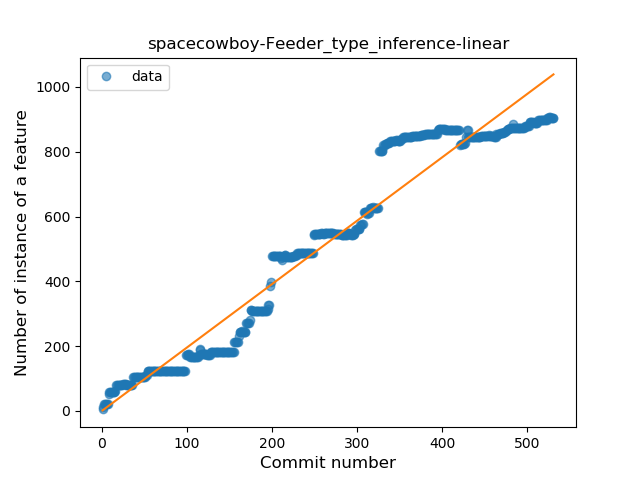
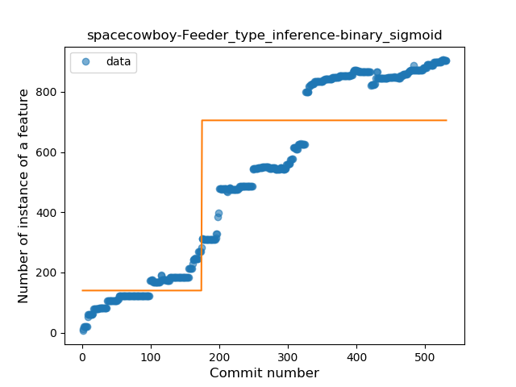
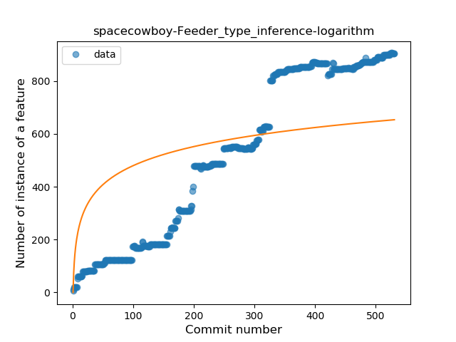
### <a name="lambda">Lambda</a>
----
#### Functions
* **Constant Rise - Linear:** 
    * **R_Squared:** 0.97558065
* **Sudden Rise - Exponential:** 
    * **R_Squared:** 0.9815836
* **Plateau Sudden Rise - Binary Sigmoid:** 
    * **R_Squared:** 0.65723663
* **Sudden Rise Plateau - Logarithm:** 
    * **R_Squared:** 0.42530603

**Plots** :chart_with_upwards_trend:
-----

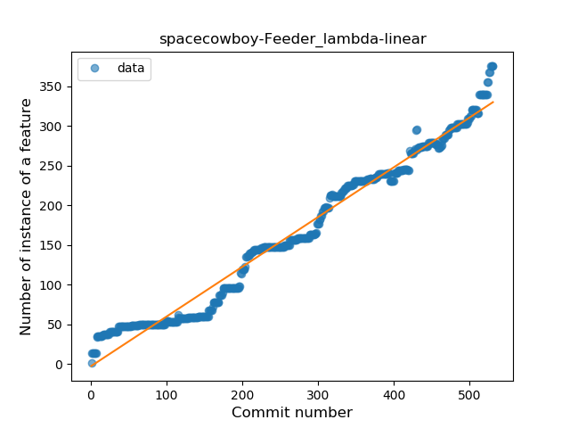
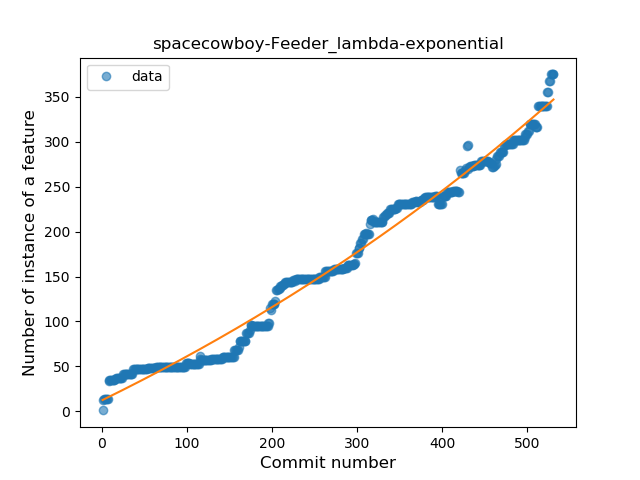
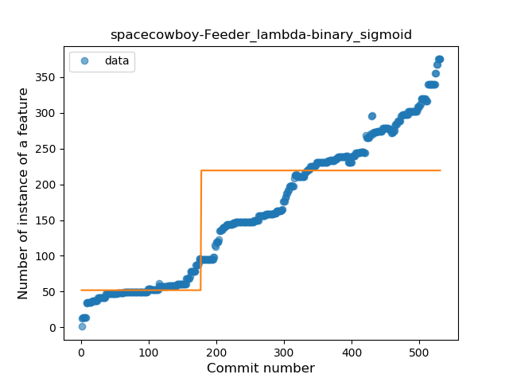
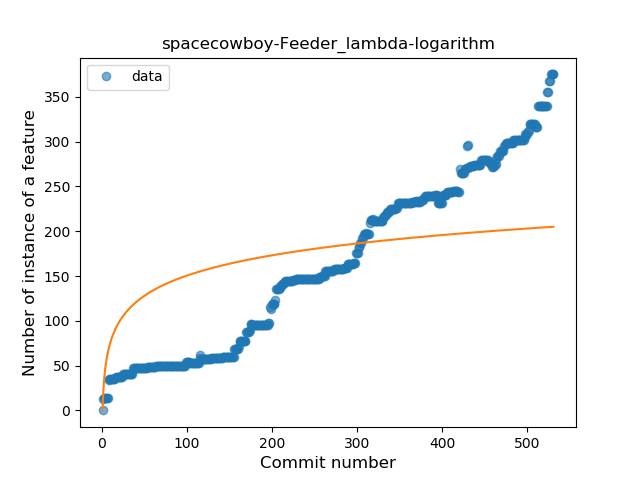
### <a name="safe_call">Safe Call</a>
----
#### Functions
* **Constant Rise - Linear:** 
    * **R_Squared:** 0.94984402
* **Sudden Rise - Exponential:** 
    * **R_Squared:** 0.95286062
* **Plateau Sudden Rise - Binary Sigmoid:** 
    * **R_Squared:** 0.46170997
* **Sudden Rise Plateau - Logarithm:** 
    * **R_Squared:** 0.32981764

**Plots** :chart_with_upwards_trend:
-----

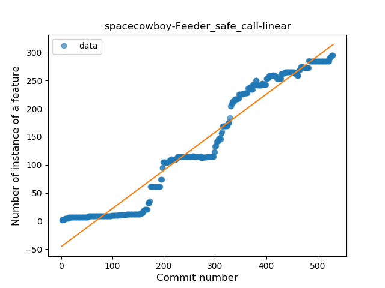
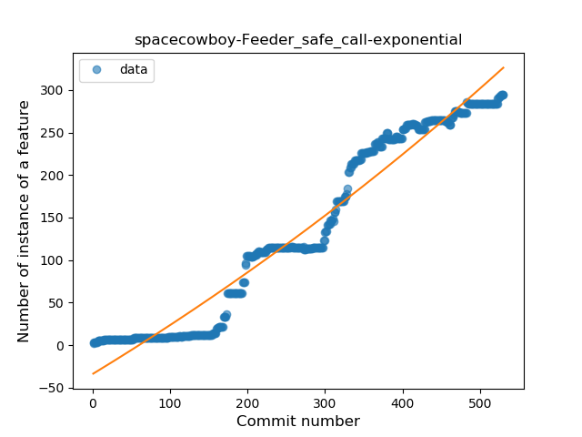
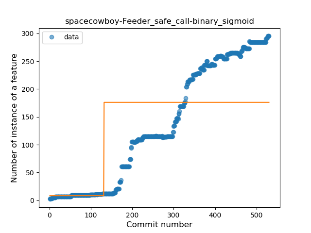
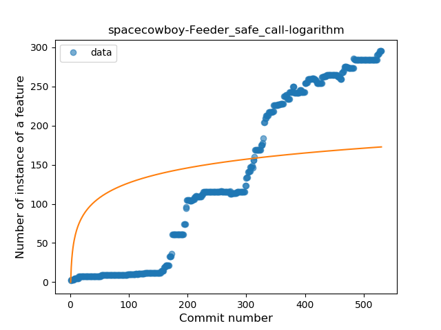
### <a name="when_expr">When expression</a>
----
#### Functions
* **Plateau Gradual Rise - Sigmoid:** 
    * **R_Squared:** 0.86767834
* **Constant Rise - Linear:** 
    * **R_Squared:** 0.85314206
* **Sudden Rise Plateau - Logarithm:** 
    * **R_Squared:** 0.51918988

**Plots** :chart_with_upwards_trend:
-----

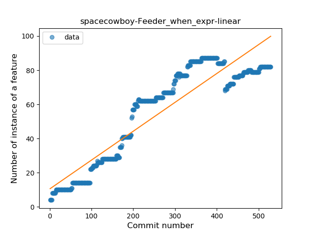
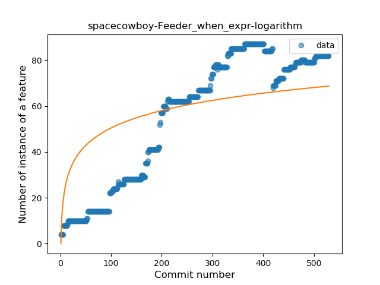
### <a name="companion_object">Companion Object</a>
----
#### Functions
* **Plateau Gradual Rise - Sigmoid:** 
    * **R_Squared:** 0.82846472
* **Constant Rise - Linear:** 
    * **R_Squared:** 0.48819538
* **Sudden Rise Plateau - Logarithm:** 
    * **R_Squared:** 0.4286024

**Plots** :chart_with_upwards_trend:
-----

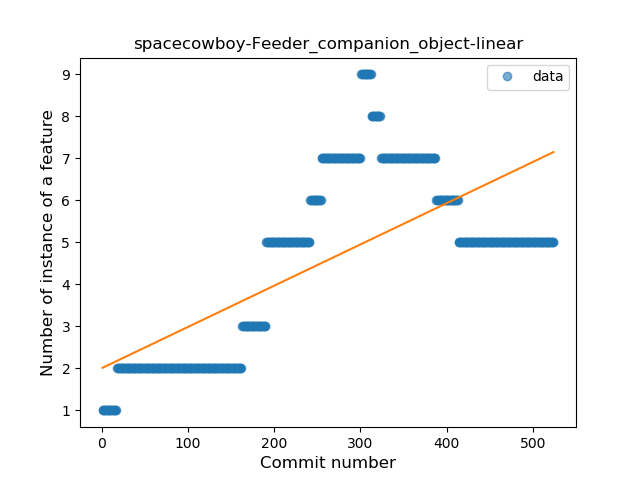
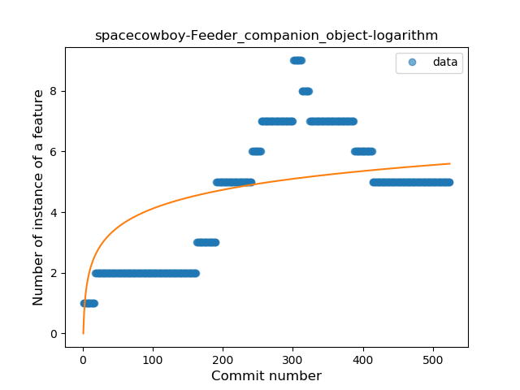
### <a name="unsafe_call">Unsafe Call</a>
----
#### Functions
* **Plateau Gradual Rise - Sigmoid:** 
    * **R_Squared:** 0.59229813
* **Constant Rise - Linear:** 
    * **R_Squared:** 0.56304855
* **Sudden Rise Plateau - Logarithm:** 
    * **R_Squared:** 0.36409263

**Plots** :chart_with_upwards_trend:
-----

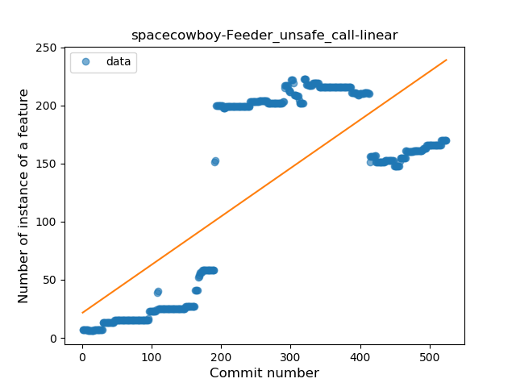
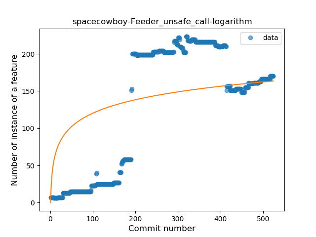
### <a name="string_template">String Template</a>
----
#### Functions
* **Constant Rise - Linear:** 
    * **R_Squared:** 0.96214871
* **Plateau Sudden Rise - Binary Sigmoid:** 
    * **R_Squared:** 0.76131648
* **Sudden Rise Plateau - Logarithm:** 
    * **R_Squared:** 0.45339277

**Plots** :chart_with_upwards_trend:
-----

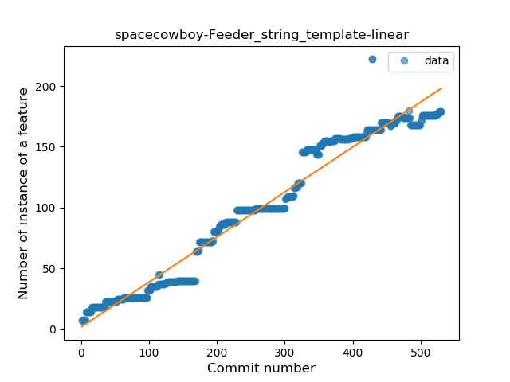
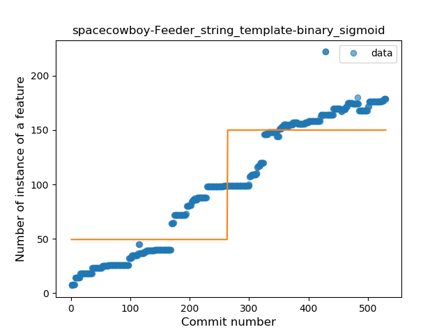
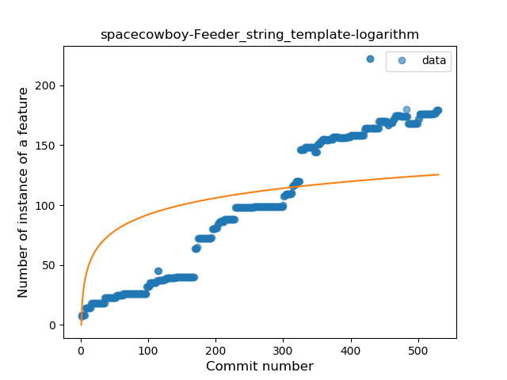
### <a name="func_with_default_value">Function with Default Value</a>
----
#### Functions
* **Constant Rise - Linear:** 
    * **R_Squared:** 0.83936954
* **Sudden Rise Plateau - Logarithm:** 
    * **R_Squared:** 0.59096124
* **Plateau Sudden Rise - Binary Sigmoid:** 
    * **R_Squared:** 0.10653357

**Plots** :chart_with_upwards_trend:
-----

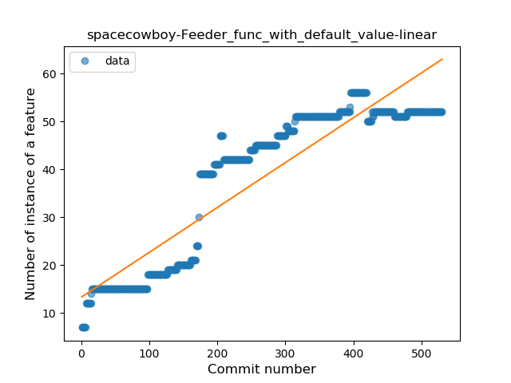
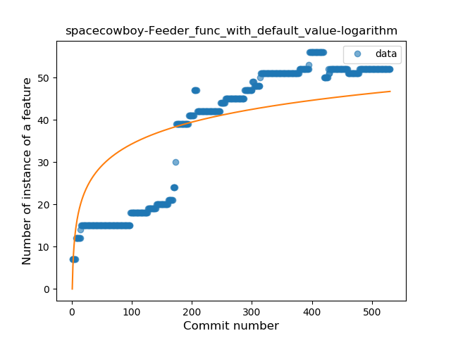
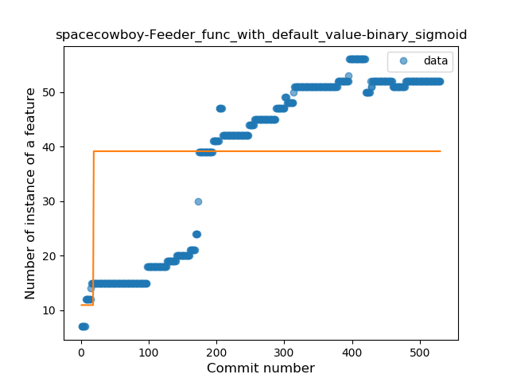
### <a name="singleton">Singleton</a>
----
#### Functions
* **Plateau Gradual Rise - Sigmoid:** 
    * **R_Squared:** 0.92510017
* **Sudden Rise - Exponential:** 
    * **R_Squared:** 0.90217607
* **Constant Rise - Linear:** 
    * **R_Squared:** 0.82892805
* **Sudden Rise Plateau - Logarithm:** 
    * **R_Squared:** 0.41126515

**Plots** :chart_with_upwards_trend:
-----

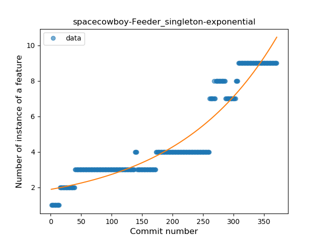
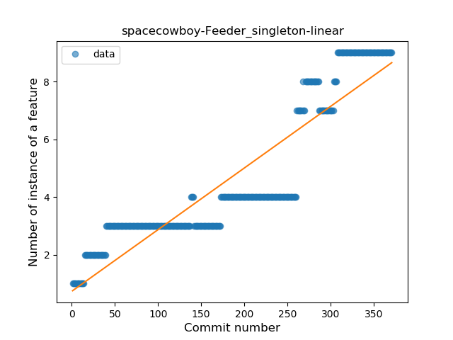
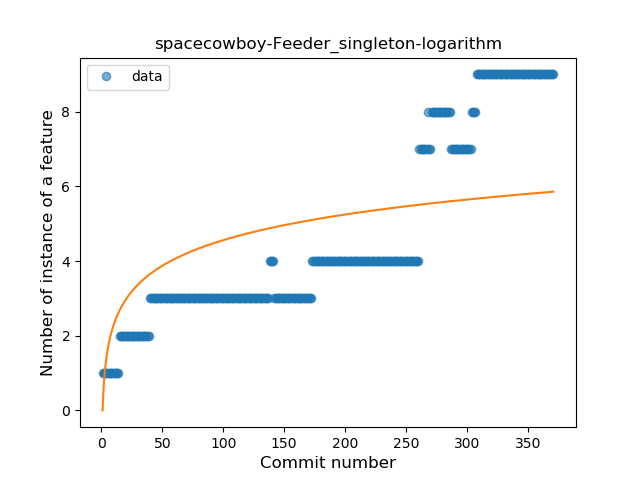
### <a name="smart_cast">Smart Cast</a>
----
#### Functions
* **Plateau Gradual Rise - Sigmoid:** 
    * **R_Squared:** 0.76127364
* **Sudden Rise Plateau - Logarithm:** 
    * **R_Squared:** 0.65045114
* **Constant Rise - Linear:** 
    * **R_Squared:** 0.42284052

**Plots** :chart_with_upwards_trend:
-----

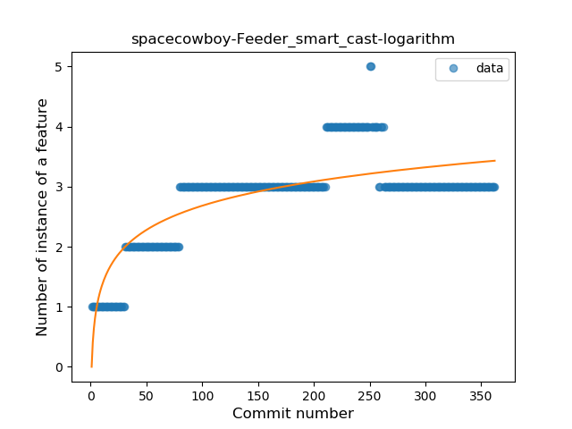
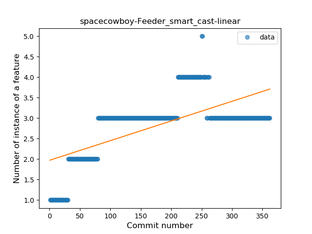
### <a name="range_expr">Range Expression</a>
----
#### Functions
* **Plateau Gradual Rise - Sigmoid:** 
    * **R_Squared:** 0.76773122
* **Constant Rise - Linear:** 
    * **R_Squared:** 0.70797316
* **Sudden Rise Plateau - Logarithm:** 
    * **R_Squared:** 0.54843253

**Plots** :chart_with_upwards_trend:
-----

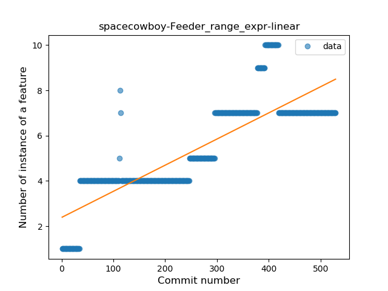
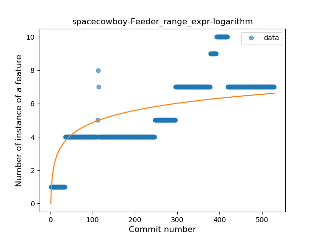
### <a name="func_call_with_named_arg">Function call with Named Argument</a>
----
#### Functions
* **Constant Rise - Linear:** 
    * **R_Squared:** 0.89077941
* **Plateau Sudden Rise - Binary Sigmoid:** 
    * **R_Squared:** 0.85685432
* **Sudden Rise Plateau - Logarithm:** 
    * **R_Squared:** 0.42240599

**Plots** :chart_with_upwards_trend:
-----

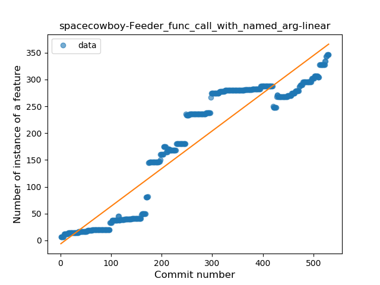
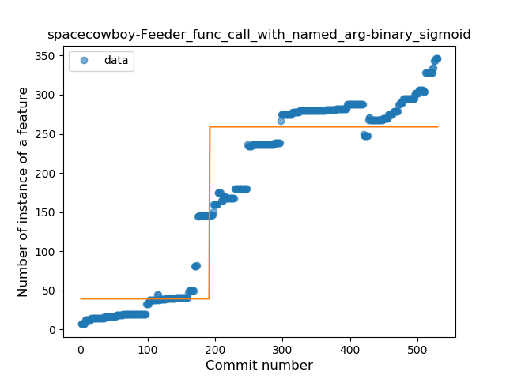
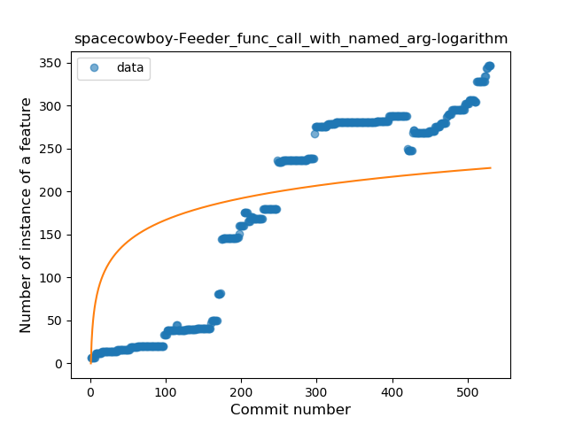
### <a name="data_class">Data Class</a>
----
#### Functions
* **Constant Rise - Linear:** 
    * **R_Squared:** 0.85004823
* **Sudden Rise Plateau - Logarithm:** 
    * **R_Squared:** 0.47223039

**Plots** :chart_with_upwards_trend:
-----

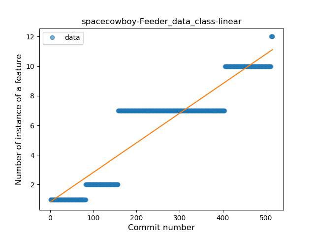
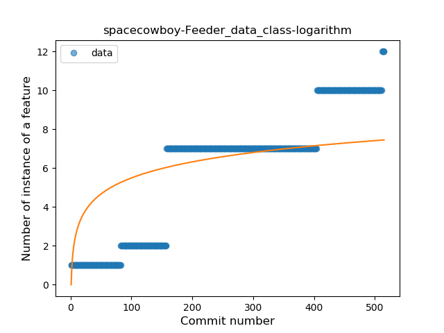
### <a name="extension_function">Extension Function</a>
----
#### Functions
* **Sudden Rise Plateau - Logarithm:** 
    * **R_Squared:** 0.31669163
* **Constant Rise - Linear:** 
    * **R_Squared:** 0.13333849

**Plots** :chart_with_upwards_trend:
-----

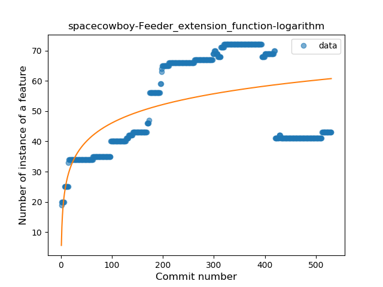
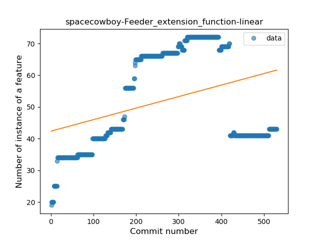
### <a name="property_delegation">Property Delegation</a>
----
#### Functions
* **Plateau Gradual Rise - Sigmoid:** 
    * **R_Squared:** 0.73199913
* **Constant Rise - Linear:** 
    * **R_Squared:** 0.59558697
* **Sudden Rise Plateau - Logarithm:** 
    * **R_Squared:** 0.4334415

**Plots** :chart_with_upwards_trend:
-----

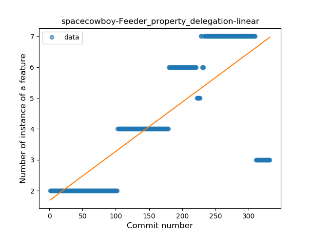
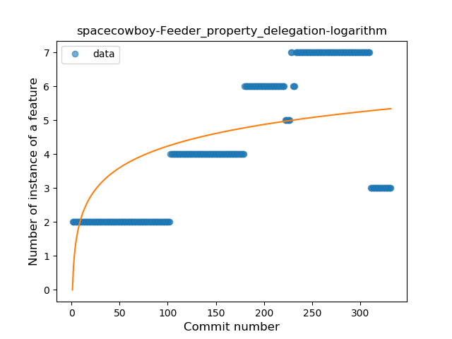
### <a name="destructuring_declaration">Destructuring Declaration</a>
----
#### Functions
* **Constant Rise - Linear:** 
    * **R_Squared:** 0.72794431
* **Sudden Rise Plateau - Logarithm:** 
    * **R_Squared:** 0.34079336

**Plots** :chart_with_upwards_trend:
-----

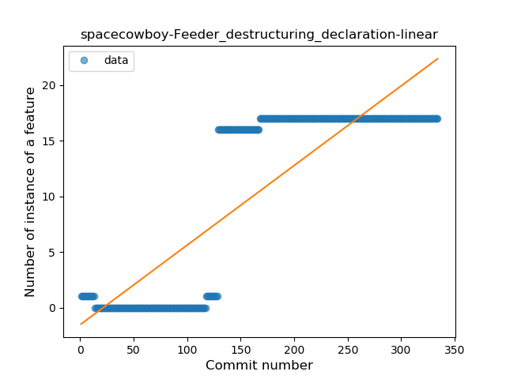
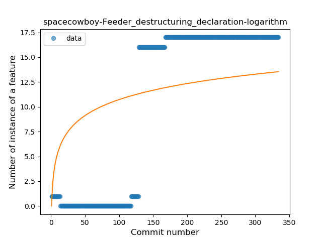
### <a name="inline_func">Inline Function</a>
----
#### Functions
* **Constant Decline - Linear:** 
    * **R_Squared:** 0.03232935
* **Plateau Gradual Rise - Sigmoid:** 
    * **R_Squared:** 0.01905417
* **Sudden Rise Plateau - Logarithm:** 
    * **R_Squared:** 0.0002248

**Plots** :chart_with_upwards_trend:
-----

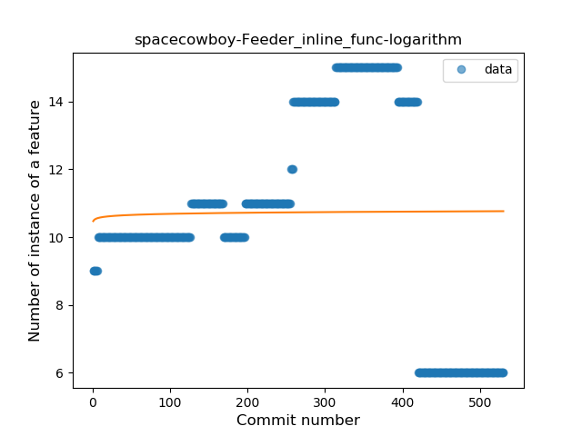
### <a name="overloaded_op">Overloaded Operator</a>
----
#### Functions
* **Plateau Sudden Rise - Binary Sigmoid:** 
    * **R_Squared:** 1.0
* **Constant Rise - Linear:** 
    * **R_Squared:** 0.64074297
* **Sudden Rise Plateau - Logarithm:** 
    * **R_Squared:** 0.61924311

**Plots** :chart_with_upwards_trend:
-----

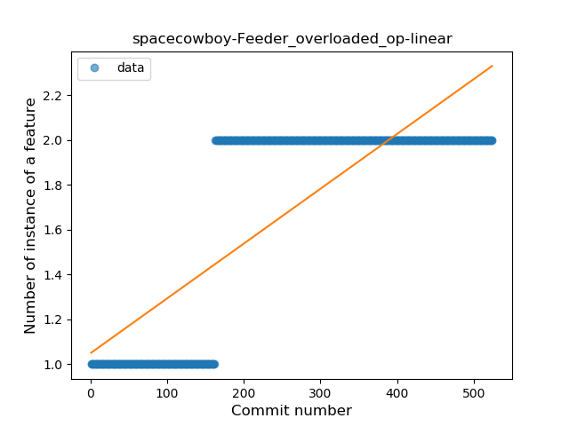
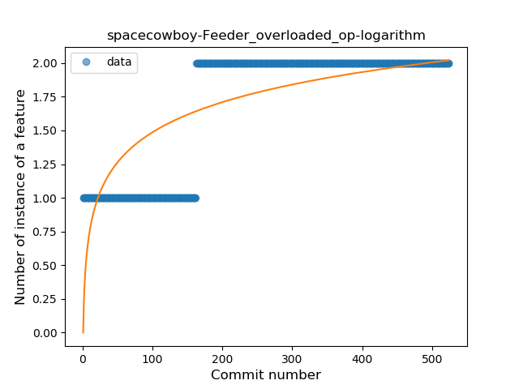
