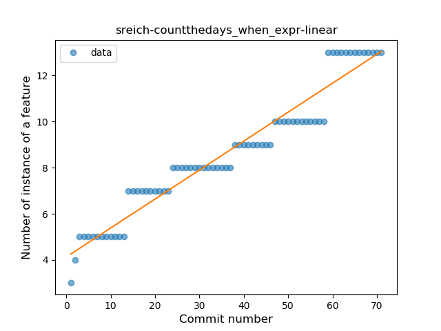

## sreich-countthedays
----
#### Metrics provided by Detekt
* Number of lines of code 1080
* Number of Kotlin files: 7
* Cyclomatic complexity: 128
* Cyclomatic complexity by thousands of lines: 288 

----
**10** features analyzed

*	<a href="#type_inference">Type Inference</a> 
*	<a href="#lambda">Lambda</a> 
*	<a href="#when_expr">When expression</a> 
*	<a href="#unsafe_call">Unsafe Call</a> 
*	<a href="#companion_object">Companion Object</a> 
*	<a href="#string_template">String Template</a> 
*	<a href="#smart_cast">Smart Cast</a> 
*	<a href="#func_call_with_named_arg">Function call with Named Argument</a> 
*	<a href="#extension_function">Extension Function</a> 
*	<a href="#property_delegation">Property Delegation</a> 

### <a name="type_inference">Type Inference</a>
----
#### Functions
* **Constant Rise - Linear:** 
    * **R_Squared:** 0.93680806
* **Sudden Rise Plateau - Logarithm:** 
    * **R_Squared:** 0.77841455
* **Plateau Sudden Rise - Binary Sigmoid:** 
    * **R_Squared:** 0.66365125

**Plots** :chart_with_upwards_trend:
-----

### <a name="lambda">Lambda</a>
----
#### Functions
* **Sudden Rise - Exponential:** 
    * **R_Squared:** 0.93601312
* **Constant Rise - Linear:** 
    * **R_Squared:** 0.81379642
* **Sudden Rise Plateau - Logarithm:** 
    * **R_Squared:** 0.39254612

**Plots** :chart_with_upwards_trend:
-----

### <a name="when_expr">When expression</a>
----
#### Functions
* **Constant Rise - Linear:** 
    * **R_Squared:** 0.93653008
* **Sudden Rise - Exponential:** 
    * **R_Squared:** 0.93916304
* **Sudden Rise Plateau - Logarithm:** 
    * **R_Squared:** 0.77589761

**Plots** :chart_with_upwards_trend:
-----

### <a name="unsafe_call">Unsafe Call</a>
----
#### Functions
* **Constant Rise - Linear:** 
    * **R_Squared:** 0.93152516
* **Sudden Rise - Exponential:** 
    * **R_Squared:** 0.93989387
* **Sudden Rise Plateau - Logarithm:** 
    * **R_Squared:** 0.62990932

**Plots** :chart_with_upwards_trend:
-----

### <a name="companion_object">Companion Object</a>
----
#### Functions
* **Plateau Sudden Rise - Binary Sigmoid:** 
    * **R_Squared:** 1.0
* **Constant Rise - Linear:** 
    * **R_Squared:** 0.71810883
* **Sudden Rise Plateau - Logarithm:** 
    * **R_Squared:** 0.62309195

**Plots** :chart_with_upwards_trend:
-----

### <a name="string_template">String Template</a>
----
#### Functions
* **Instability - Polinomial 3:** )
    * **R_Squared:** 0.71940939
* **Plateau Gradual Rise - Sigmoid:** 
    * **R_Squared:** 0.64418059
* **Sudden Rise Plateau - Logarithm:** 
    * **R_Squared:** 0.58612499
* **Constant Rise - Linear:** 
    * **R_Squared:** 0.53642185

**Plots** :chart_with_upwards_trend:
-----

### <a name="smart_cast">Smart Cast</a>
----
#### Functions
* **Sudden Decline - Exponential:** 
    * **R_Squared:** 1.0
* **Instability - Polinomial 3:** )
    * **R_Squared:** 0.35324798
* **Constant Decline - Linear:** 
    * **R_Squared:** 0.08333333
* **Sudden Rise Plateau - Logarithm:** 
    * **R_Squared:** -0.0

**Plots** :chart_with_upwards_trend:
-----

### <a name="func_call_with_named_arg">Function call with Named Argument</a>
----
#### Functions
* **Sudden Rise Plateau - Logarithm:** 
    * **R_Squared:** 0.74122644
* **Constant Rise - Linear:** 
    * **R_Squared:** 0.65011378

**Plots** :chart_with_upwards_trend:
-----

### <a name="extension_function">Extension Function</a>
----
#### Functions
* **Plateau Gradual Rise - Sigmoid:** 
    * **R_Squared:** 0.92712249
* **Constant Rise - Linear:** 
    * **R_Squared:** 0.82310127
* **Sudden Rise Plateau - Logarithm:** 
    * **R_Squared:** 0.81045944

**Plots** :chart_with_upwards_trend:
-----

### <a name="property_delegation">Property Delegation</a>
----
#### Functions
* **Instability - Polinomial 4:** 
    * **R_Squared:** 0.92660206
* **Sudden Rise Plateau - Logarithm:** 
    * **R_Squared:** 0.7769013
* **Constant Rise - Linear:** 
    * **R_Squared:** 0.67578167

**Plots** :chart_with_upwards_trend:
-----

