## sriharshaarangi-BatteryChargeLimit
----
#### Metrics provided by Detekt
* Number of lines of code 1725
* Number of Kotlin files: 19
* Cyclomatic complexity: 230
* Cyclomatic complexity by thousands of lines: 255 

----
**8** features analyzed

*	<a href="#type_inference">Type Inference</a> 
*	<a href="#lambda">Lambda</a> 
*	<a href="#when_expr">When expression</a> 
*	<a href="#companion_object">Companion Object</a> 
*	<a href="#unsafe_call">Unsafe Call</a> 
*	<a href="#string_template">String Template</a> 
*	<a href="#func_with_default_value">Function with Default Value</a> 
*	<a href="#property_delegation">Property Delegation</a> 

### <a name="type_inference">Type Inference</a>
----
#### Functions
* **Sudden Rise Plateau - Logarithm:** 
    * **R_Squared:** 0.80226079
* **Constant Rise - Linear:** 
    * **R_Squared:** 0.7181535
* **Plateau Gradual Rise - Sigmoid:** 
    * **R_Squared:** 0.3424965

**Plots** :chart_with_upwards_trend:
-----

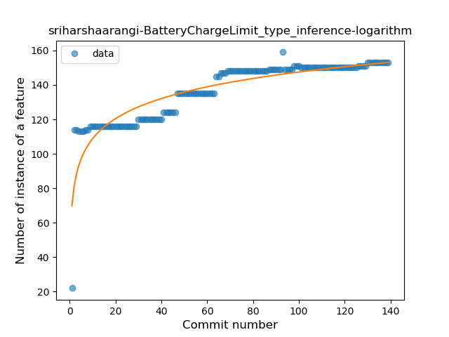
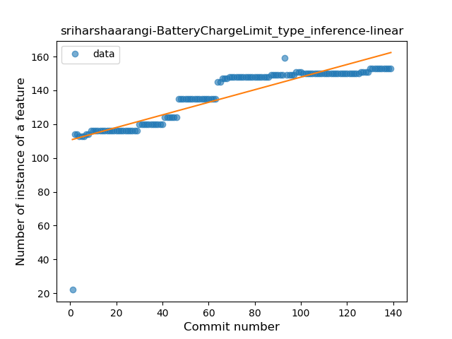
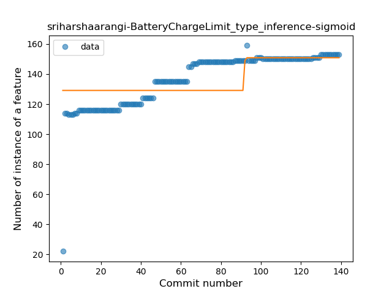
### <a name="lambda">Lambda</a>
----
#### Functions
* **Constant Rise - Linear:** 
    * **R_Squared:** 0.82584662
* **Sudden Rise Plateau - Logarithm:** 
    * **R_Squared:** 0.78021783

**Plots** :chart_with_upwards_trend:
-----

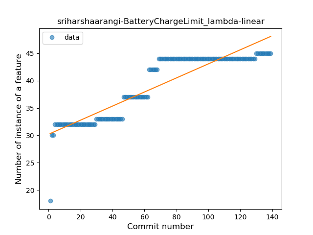
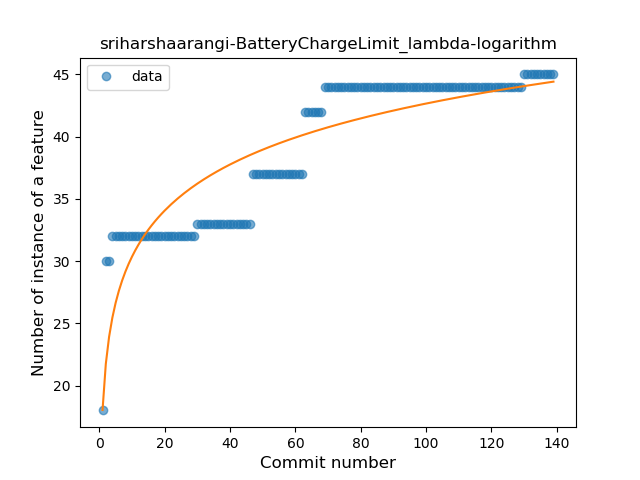
### <a name="when_expr">When expression</a>
----
#### Functions
* **Plateau Sudden Rise - Binary Sigmoid:** 
    * **R_Squared:** 1.0
* **Sudden Rise Plateau - Logarithm:** 
    * **R_Squared:** 0.3368029
* **Constant Rise - Linear:** 
    * **R_Squared:** 0.08385093

**Plots** :chart_with_upwards_trend:
-----

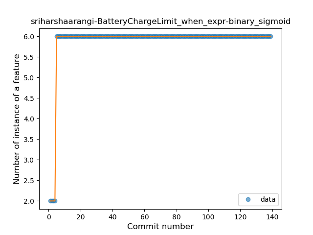
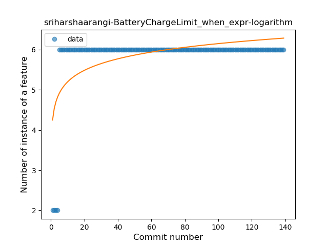
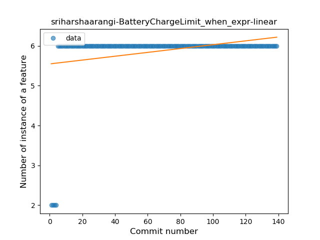
### <a name="companion_object">Companion Object</a>
----
#### Functions
* **Constant Rise - Linear:** 
    * **R_Squared:** 0.50089378
* **Sudden Rise - Exponential:** 
    * **R_Squared:** 0.50540184
* **Sudden Rise Plateau - Logarithm:** 
    * **R_Squared:** 0.47920048
* **Plateau Sudden Rise - Binary Sigmoid:** 
    * **R_Squared:** 0.471384

**Plots** :chart_with_upwards_trend:
-----

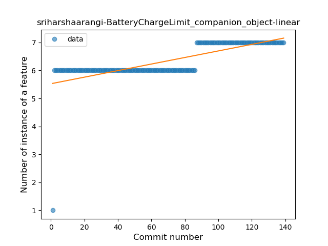
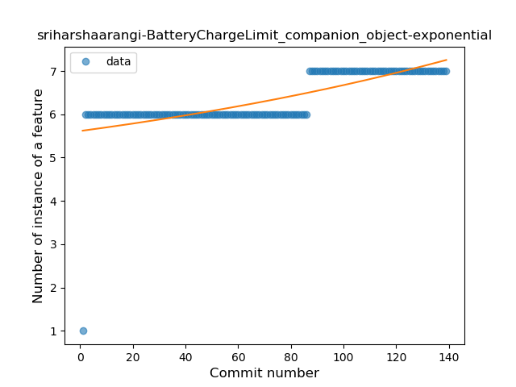
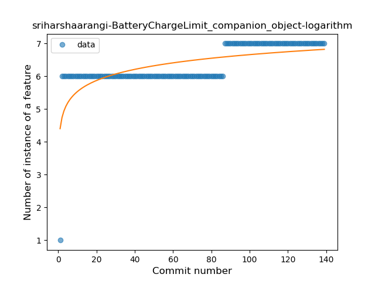
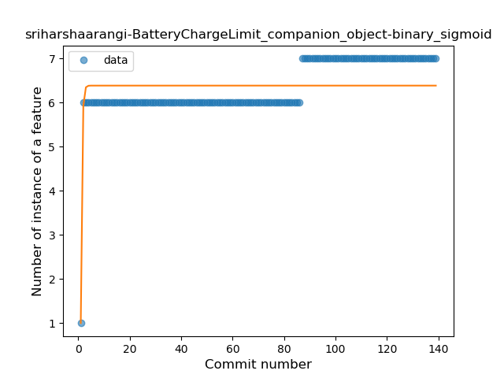
### <a name="unsafe_call">Unsafe Call</a>
----
#### Functions
* **Constant Rise - Linear:** 
    * **R_Squared:** 0.84453373
* **Sudden Rise Plateau - Logarithm:** 
    * **R_Squared:** 0.63329725

**Plots** :chart_with_upwards_trend:
-----

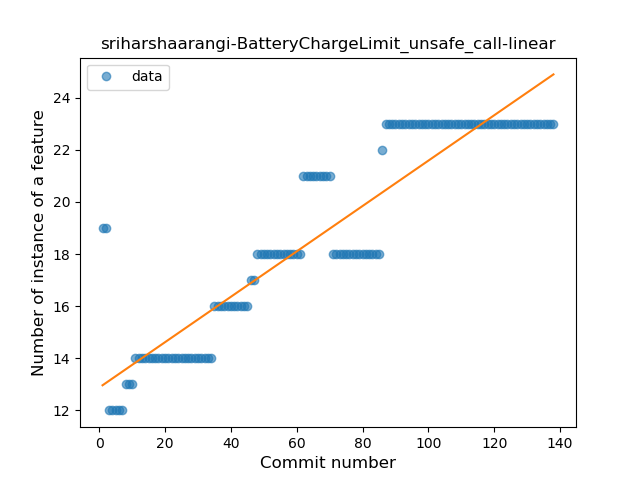
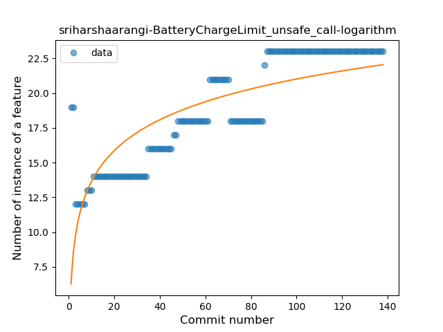
### <a name="string_template">String Template</a>
----
#### Functions
* **Constant Rise - Linear:** 
    * **R_Squared:** 0.81933521
* **Sudden Rise Plateau - Logarithm:** 
    * **R_Squared:** 0.77416466

**Plots** :chart_with_upwards_trend:
-----

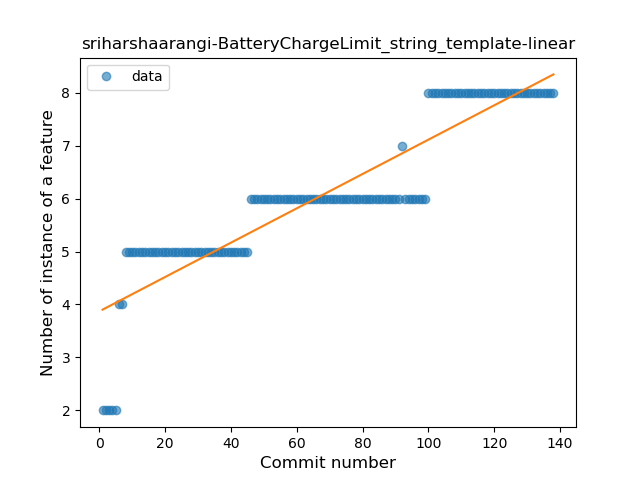
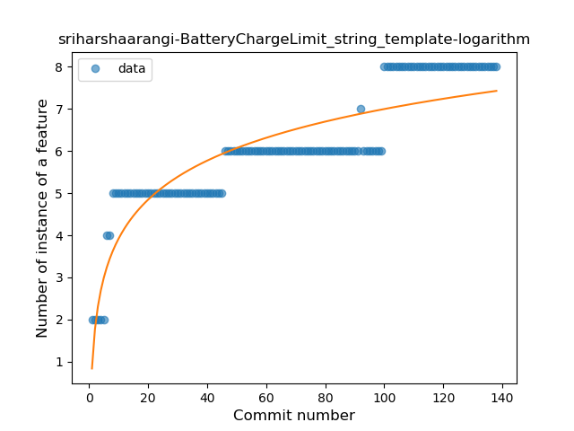
### <a name="func_with_default_value">Function with Default Value</a>
----
#### Functions
* **Plateau Sudden Rise - Binary Sigmoid:** 
    * **R_Squared:** 1.0
* **Sudden Rise - Exponential:** 
    * **R_Squared:** 0.80304801
* **Constant Rise - Linear:** 
    * **R_Squared:** 0.2016489
* **Sudden Rise Plateau - Logarithm:** 
    * **R_Squared:** 0.07876805

**Plots** :chart_with_upwards_trend:
-----

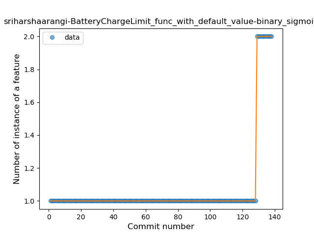
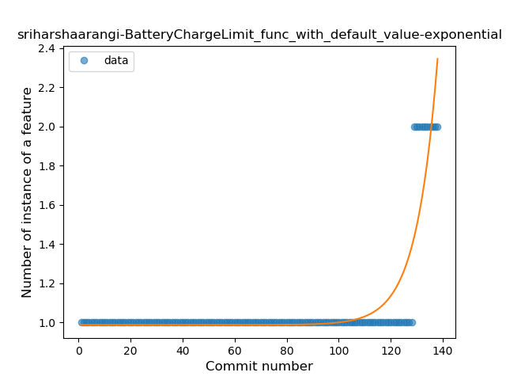
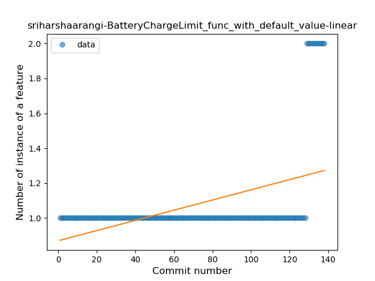
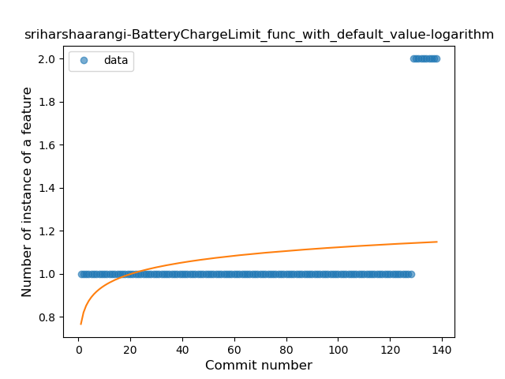
### <a name="property_delegation">Property Delegation</a>
----
#### Functions
* **Plateau Sudden Rise - Binary Sigmoid:** 
    * **R_Squared:** 1.0
* **Sudden Rise Plateau - Logarithm:** 
    * **R_Squared:** 0.28298149
* **Constant Rise - Linear:** 
    * **R_Squared:** 0.06335404

**Plots** :chart_with_upwards_trend:
-----

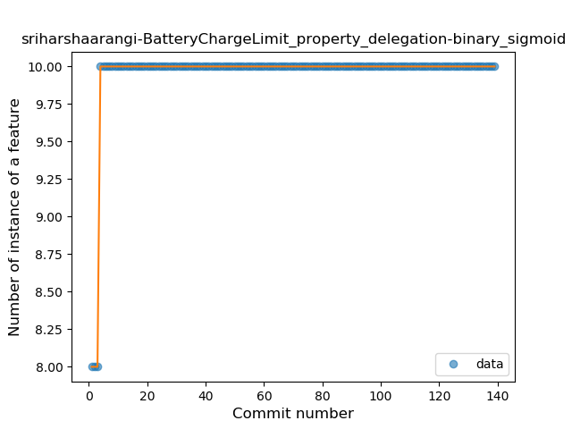
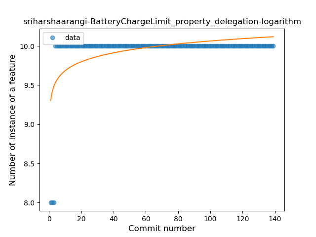
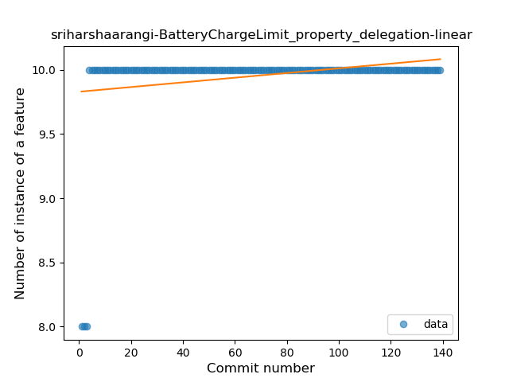
