## stinsonga-GeoQuake
----
#### Metrics provided by Detekt
* Number of lines of code 310
* Number of Kotlin files: 7
* Cyclomatic complexity: 44
* Cyclomatic complexity by thousands of lines: 338 

----
**3** features analyzed

*	<a href="#type_inference">Type Inference</a> 
*	<a href="#when_expr">When expression</a> 
*	<a href="#unsafe_call">Unsafe Call</a> 

### <a name="type_inference">Type Inference</a>
----
#### Functions
* **Plateau Gradual Rise - Sigmoid:** 
    * **R_Squared:** 0.99289139
* **Instability - Polinomial 4:** 
    * **R_Squared:** 0.91779608
* **Sudden Rise Plateau - Logarithm:** 
    * **R_Squared:** 0.72487079
* **Constant Rise - Linear:** 
    * **R_Squared:** 0.70467367

**Plots** :chart_with_upwards_trend:
-----

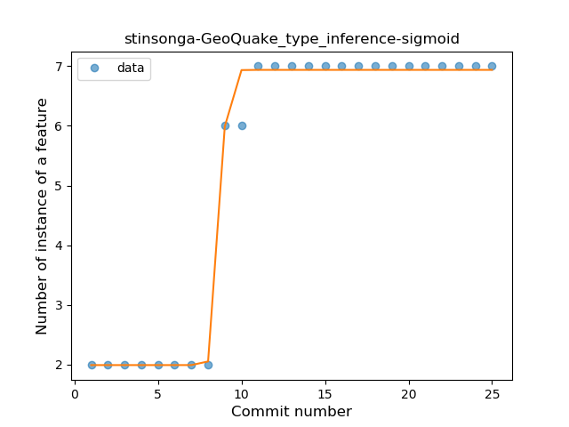
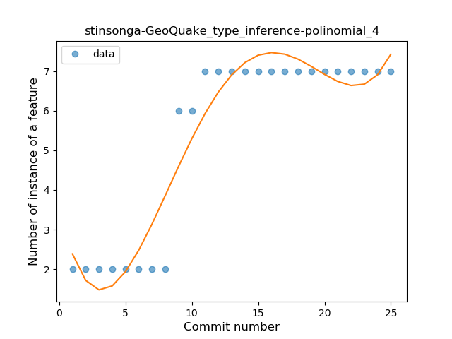
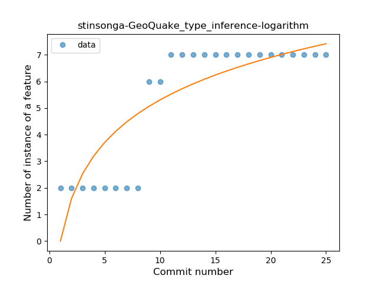
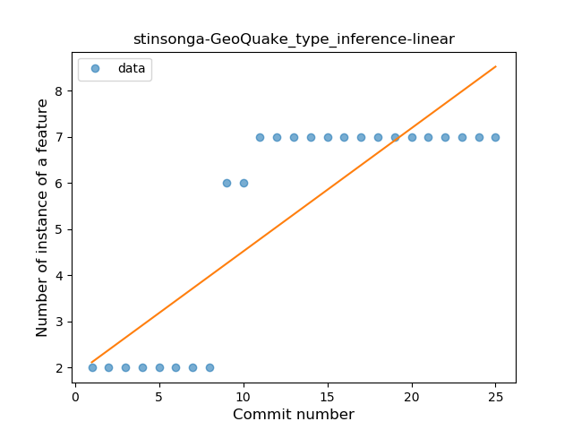
### <a name="when_expr">When expression</a>
----
#### Functions
* **Plateau Sudden Rise - Binary Sigmoid:** 
    * **R_Squared:** 1.0
* **Instability - Polinomial 4:** 
    * **R_Squared:** 0.84081677
* **Sudden Rise Plateau - Logarithm:** 
    * **R_Squared:** 0.70760764
* **Constant Rise - Linear:** 
    * **R_Squared:** 0.54807692

**Plots** :chart_with_upwards_trend:
-----

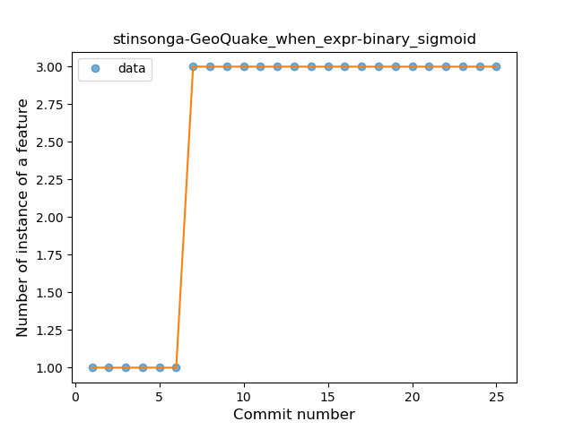
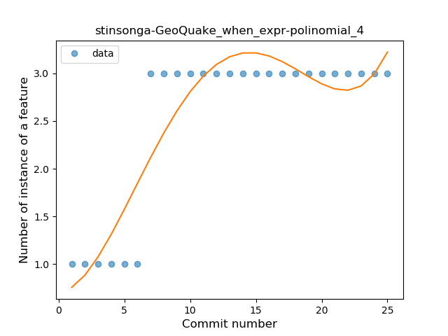
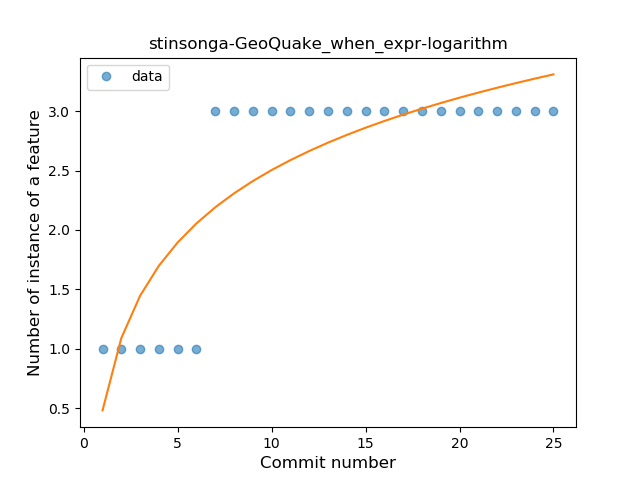
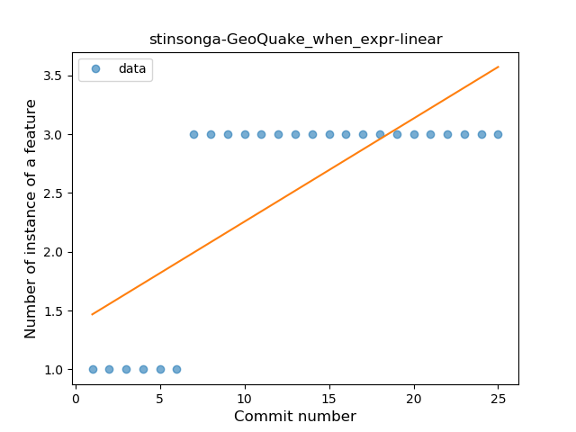
### <a name="unsafe_call">Unsafe Call</a>
----
#### Functions
* **Plateau Sudden Decline - Binary Sigmoid:** 
    * **R_Squared:** 0.75686499
* **Instability - Polinomial 3:** )
    * **R_Squared:** 0.49793228
* **Sudden Decline - Exponential:** 
    * **R_Squared:** 0.45148418
* **Constant Decline - Linear:** 
    * **R_Squared:** 0.22115385
* **Sudden Rise Plateau - Logarithm:** 
    * **R_Squared:** -0.0

**Plots** :chart_with_upwards_trend:
-----

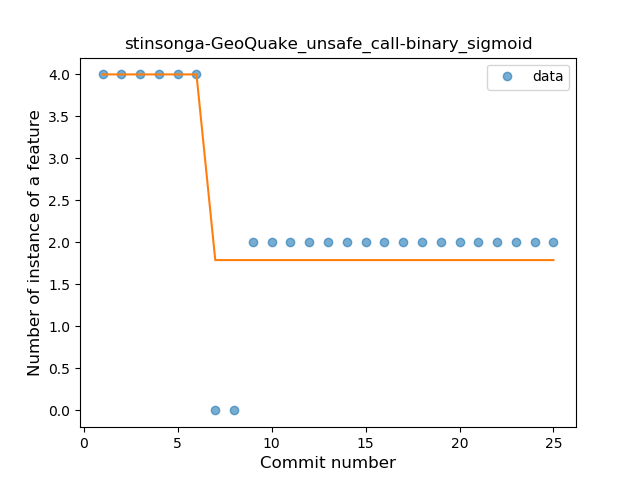
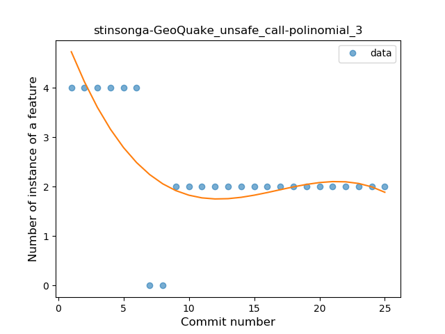
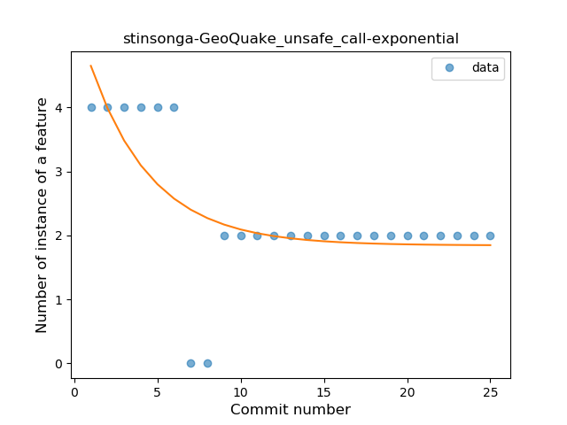
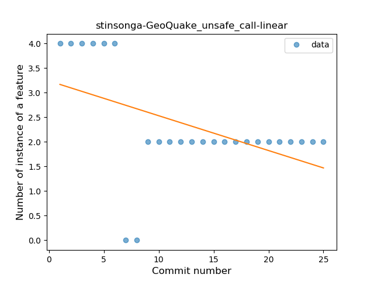
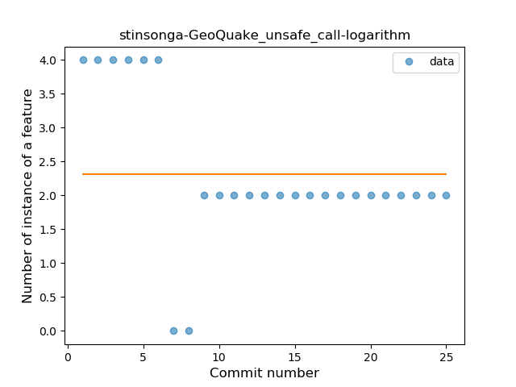
