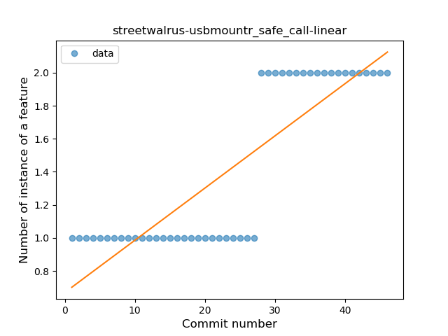
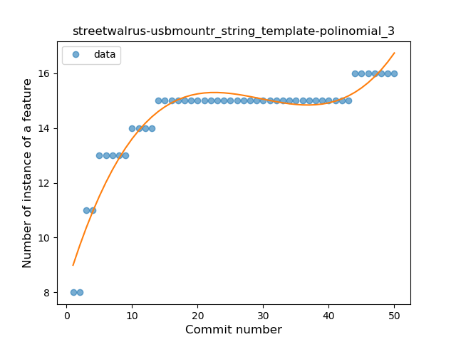

## streetwalrus-usbmountr
----
#### Metrics provided by Detekt
* Number of lines of code 344
* Number of Kotlin files: 6
* Cyclomatic complexity: 44
* Cyclomatic complexity by thousands of lines: 234 

----
**5** features analyzed

*	<a href="#type_inference">Type Inference</a> 
*	<a href="#lambda">Lambda</a> 
*	<a href="#safe_call">Safe Call</a> 
*	<a href="#unsafe_call">Unsafe Call</a> 
*	<a href="#string_template">String Template</a> 

### <a name="type_inference">Type Inference</a>
----
#### Functions
* **Instability - Polinomial 3:** )
    * **R_Squared:** 0.94237188
* **Sudden Rise Plateau - Logarithm:** 
    * **R_Squared:** 0.84746863
* **Constant Rise - Linear:** 
    * **R_Squared:** 0.58404365

**Plots** :chart_with_upwards_trend:
-----

### <a name="lambda">Lambda</a>
----
#### Functions
* **Plateau Sudden Decline - Binary Sigmoid:** 
    * **R_Squared:** 1.0
* **Sudden Decline - Exponential:** 
    * **R_Squared:** 0.80284093
* **Instability - Polinomial 3:** )
    * **R_Squared:** 0.7701366
* **Constant Decline - Linear:** 
    * **R_Squared:** 0.28947368
* **Sudden Rise Plateau - Logarithm:** 
    * **R_Squared:** -0.0

**Plots** :chart_with_upwards_trend:
-----

### <a name="safe_call">Safe Call</a>
----
#### Functions
* **Plateau Sudden Rise - Binary Sigmoid:** 
    * **R_Squared:** 1.0
* **Instability - Polinomial 3:** )
    * **R_Squared:** 0.84098781
* **Sudden Rise - Exponential:** 
    * **R_Squared:** 0.75291979
* **Constant Rise - Linear:** 
    * **R_Squared:** 0.72765957
* **Sudden Rise Plateau - Logarithm:** 
    * **R_Squared:** 0.46389062

**Plots** :chart_with_upwards_trend:
-----

### <a name="unsafe_call">Unsafe Call</a>
----
#### Functions
* **Sudden Rise Plateau - Logarithm:** 
    * **R_Squared:** 0.5149403
* **Constant Rise - Linear:** 
    * **R_Squared:** 0.46808364

**Plots** :chart_with_upwards_trend:
-----

### <a name="string_template">String Template</a>
----
#### Functions
* **Instability - Polinomial 3:** )
    * **R_Squared:** 0.92447789
* **Sudden Rise Plateau - Logarithm:** 
    * **R_Squared:** 0.85912912
* **Constant Rise - Linear:** 
    * **R_Squared:** 0.54374625

**Plots** :chart_with_upwards_trend:
-----

