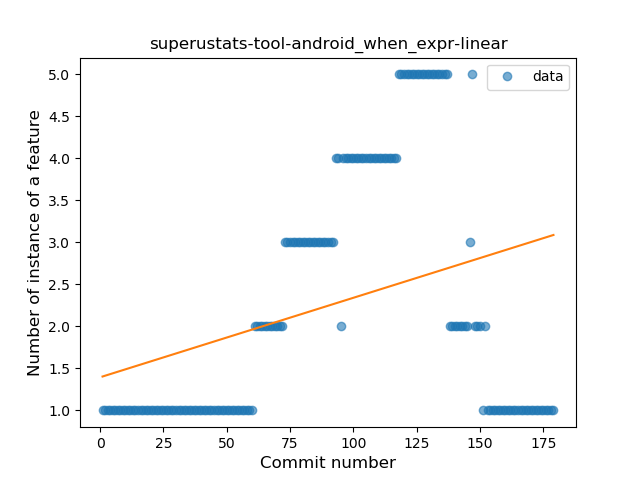

## superustats-tool-android
----
#### Metrics provided by Detekt
* Number of lines of code 740
* Number of Kotlin files: 5
* Cyclomatic complexity: 61
* Cyclomatic complexity by thousands of lines: 171 

----
**13** features analyzed

*	<a href="#type_inference">Type Inference</a> 
*	<a href="#lambda">Lambda</a> 
*	<a href="#safe_call">Safe Call</a> 
*	<a href="#when_expr">When expression</a> 
*	<a href="#unsafe_call">Unsafe Call</a> 
*	<a href="#companion_object">Companion Object</a> 
*	<a href="#string_template">String Template</a> 
*	<a href="#func_with_default_value">Function with Default Value</a> 
*	<a href="#smart_cast">Smart Cast</a> 
*	<a href="#func_call_with_named_arg">Function call with Named Argument</a> 
*	<a href="#extension_function">Extension Function</a> 
*	<a href="#property_delegation">Property Delegation</a> 
*	<a href="#destructuring_declaration">Destructuring Declaration</a> 

### <a name="type_inference">Type Inference</a>
----
#### Functions
* **Plateau Gradual Rise - Sigmoid:** 
    * **R_Squared:** 0.74461663
* **Constant Rise - Linear:** 
    * **R_Squared:** 0.44287504
* **Sudden Rise Plateau - Logarithm:** 
    * **R_Squared:** 0.45070376

**Plots** :chart_with_upwards_trend:
-----

### <a name="lambda">Lambda</a>
----
#### Functions
* **Sudden Rise Plateau - Logarithm:** 
    * **R_Squared:** 0.3898972
* **Plateau Sudden Rise - Binary Sigmoid:** 
    * **R_Squared:** 0.37632917
* **Constant Rise - Linear:** 
    * **R_Squared:** 0.3471544

**Plots** :chart_with_upwards_trend:
-----

### <a name="safe_call">Safe Call</a>
----
#### Functions
* **Constant Rise - Linear:** 
    * **R_Squared:** 0.65475673
* **Sudden Rise Plateau - Logarithm:** 
    * **R_Squared:** 0.43966119

**Plots** :chart_with_upwards_trend:
-----

### <a name="when_expr">When expression</a>
----
#### Functions
* **Plateau Gradual Rise - Sigmoid:** 
    * **R_Squared:** 0.38576486
* **Sudden Rise Plateau - Logarithm:** 
    * **R_Squared:** 0.17513992
* **Constant Rise - Linear:** 
    * **R_Squared:** 0.11175659

**Plots** :chart_with_upwards_trend:
-----

### <a name="unsafe_call">Unsafe Call</a>
----
#### Functions
* **Sudden Rise - Exponential:** 
    * **R_Squared:** 0.22562946
* **Plateau Sudden Decline - Binary Sigmoid:** 
    * **R_Squared:** 0.21859418
* **Constant Rise - Linear:** 
    * **R_Squared:** 0.02930838
* **Sudden Rise Plateau - Logarithm:** 
    * **R_Squared:** 3.797e-05

**Plots** :chart_with_upwards_trend:
-----

### <a name="companion_object">Companion Object</a>
----
#### Functions
* **Plateau Gradual Rise - Sigmoid:** 
    * **R_Squared:** 0.33003939
* **Sudden Rise Plateau - Logarithm:** 
    * **R_Squared:** 0.0994266
* **Constant Rise - Linear:** 
    * **R_Squared:** 0.00098736
* **Sudden Rise - Exponential:** 
    * **R_Squared:** 0.0009645

**Plots** :chart_with_upwards_trend:
-----

### <a name="string_template">String Template</a>
----
#### Functions
* **Plateau Sudden Rise - Binary Sigmoid:** 
    * **R_Squared:** 0.04542792
* **Constant Decline - Linear:** 
    * **R_Squared:** 0.00486284
* **Sudden Rise Plateau - Logarithm:** 
    * **R_Squared:** 0.00599388

**Plots** :chart_with_upwards_trend:
-----

### <a name="func_with_default_value">Function with Default Value</a>
----
#### Functions
* **Plateau Gradual Decline - Sigmoid:** 
    * **R_Squared:** 0.74828258
* **Constant Decline - Linear:** 
    * **R_Squared:** 0.69555164
* **Sudden Rise Plateau - Logarithm:** 
    * **R_Squared:** -0.0

**Plots** :chart_with_upwards_trend:
-----

### <a name="smart_cast">Smart Cast</a>
----
#### Functions
* **Plateau Gradual Decline - Sigmoid:** 
    * **R_Squared:** 0.71994009
* **Constant Decline - Linear:** 
    * **R_Squared:** 0.57119128
* **Sudden Rise Plateau - Logarithm:** 
    * **R_Squared:** -0.0

**Plots** :chart_with_upwards_trend:
-----

### <a name="func_call_with_named_arg">Function call with Named Argument</a>
----
#### Functions
* **Plateau Sudden Rise - Binary Sigmoid:** 
    * **R_Squared:** 0.1466651
* **Constant Decline - Linear:** 
    * **R_Squared:** 0.01222552
* **Sudden Rise Plateau - Logarithm:** 
    * **R_Squared:** 0.02167636

**Plots** :chart_with_upwards_trend:
-----

### <a name="extension_function">Extension Function</a>
----
#### Functions
* **Plateau Sudden Rise - Binary Sigmoid:** 
    * **R_Squared:** 0.56490833
* **Constant Rise - Linear:** 
    * **R_Squared:** 0.23549906
* **Sudden Rise Plateau - Logarithm:** 
    * **R_Squared:** 0.20218962

**Plots** :chart_with_upwards_trend:
-----

### <a name="property_delegation">Property Delegation</a>
----
#### Functions
* **Plateau Gradual Decline - Sigmoid:** 
    * **R_Squared:** 0.6652852
* **Constant Decline - Linear:** 
    * **R_Squared:** 0.47061157
* **Sudden Rise Plateau - Logarithm:** 
    * **R_Squared:** -0.0

**Plots** :chart_with_upwards_trend:
-----

### <a name="destructuring_declaration">Destructuring Declaration</a>
----
#### Functions
* **Sudden Rise - Exponential:** 
    * **R_Squared:** 0.1307606
* **Constant Rise - Linear:** 
    * **R_Squared:** 0.01427026
* **Sudden Rise Plateau - Logarithm:** 
    * **R_Squared:** 0.00161258
* **Plateau Gradual Decline - Sigmoid:** 
    * **R_Squared:** 7.791e-05

**Plots** :chart_with_upwards_trend:
-----

