## syncthing-syncthing-lite
----
#### Metrics provided by Detekt
* Number of lines of code 11138
* Number of Kotlin files: 130
* Cyclomatic complexity: 1401
* Cyclomatic complexity by thousands of lines: 247 

----
**17** features analyzed

*	<a href="#type_inference">Type Inference</a> 
*	<a href="#lambda">Lambda</a> 
*	<a href="#safe_call">Safe Call</a> 
*	<a href="#when_expr">When expression</a> 
*	<a href="#companion_object">Companion Object</a> 
*	<a href="#unsafe_call">Unsafe Call</a> 
*	<a href="#string_template">String Template</a> 
*	<a href="#func_with_default_value">Function with Default Value</a> 
*	<a href="#singleton">Singleton</a> 
*	<a href="#smart_cast">Smart Cast</a> 
*	<a href="#range_expr">Range Expression</a> 
*	<a href="#func_call_with_named_arg">Function call with Named Argument</a> 
*	<a href="#data_class">Data Class</a> 
*	<a href="#extension_function">Extension Function</a> 
*	<a href="#property_delegation">Property Delegation</a> 
*	<a href="#destructuring_declaration">Destructuring Declaration</a> 
*	<a href="#inline_func">Inline Function</a> 

### <a name="type_inference">Type Inference</a>
----
#### Functions
* **Instability - Polinomial 3:** )
    * **R_Squared:** 0.89721988
* **Constant Rise - Linear:** 
    * **R_Squared:** 0.82492624
* **Sudden Rise - Exponential:** 
    * **R_Squared:** 0.82938871
* **Sudden Rise Plateau - Logarithm:** 
    * **R_Squared:** 0.35304118

**Plots** :chart_with_upwards_trend:
-----

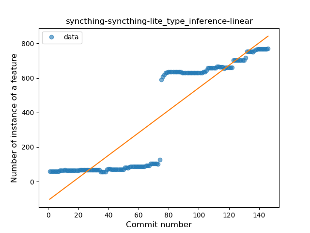
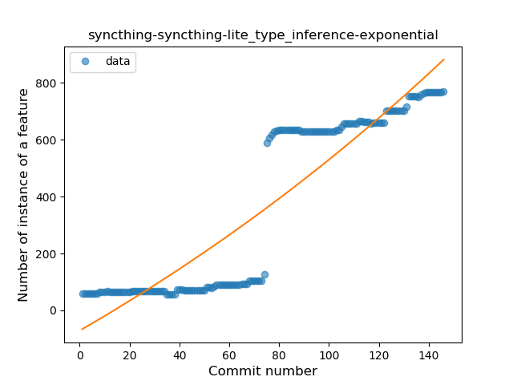
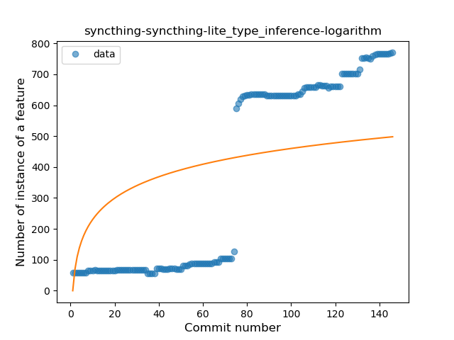
### <a name="lambda">Lambda</a>
----
#### Functions
* **Instability - Polinomial 3:** )
    * **R_Squared:** 0.929711
* **Sudden Rise - Exponential:** 
    * **R_Squared:** 0.89869288
* **Constant Rise - Linear:** 
    * **R_Squared:** 0.8879408
* **Sudden Rise Plateau - Logarithm:** 
    * **R_Squared:** 0.37670187

**Plots** :chart_with_upwards_trend:
-----

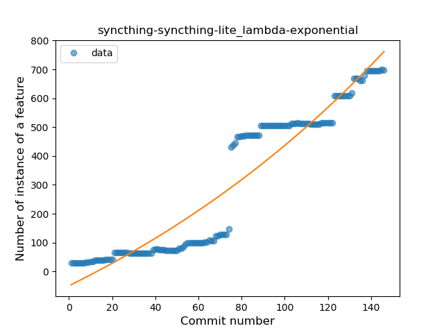
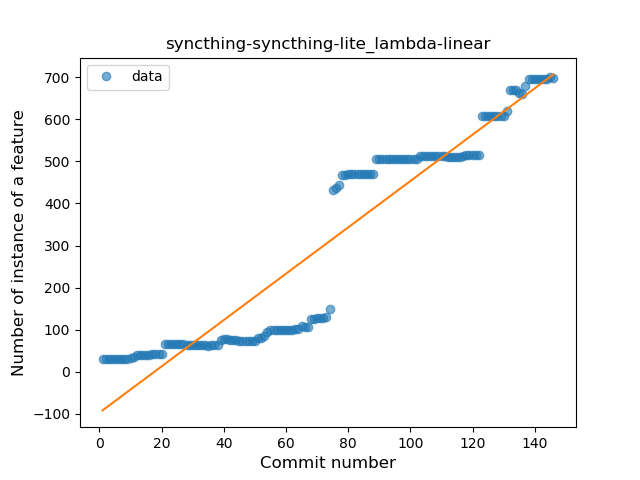
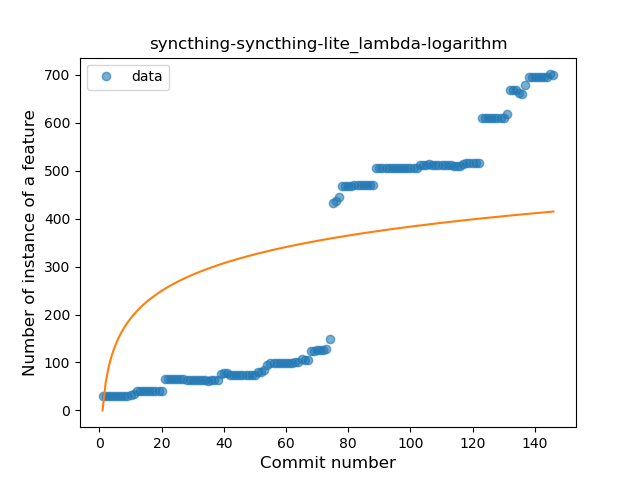
### <a name="safe_call">Safe Call</a>
----
#### Functions
* **Plateau Gradual Rise - Sigmoid:** 
    * **R_Squared:** 0.90201069
* **Constant Rise - Linear:** 
    * **R_Squared:** 0.64827799
* **Sudden Rise Plateau - Logarithm:** 
    * **R_Squared:** 0.64557931

**Plots** :chart_with_upwards_trend:
-----

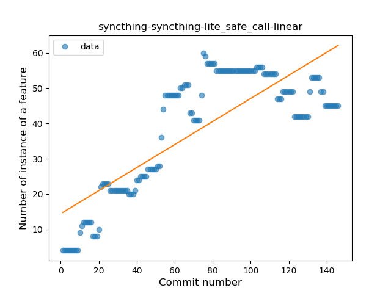
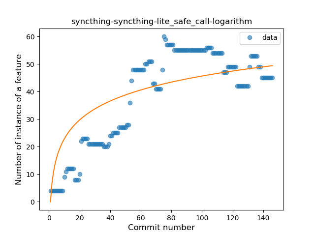
### <a name="when_expr">When expression</a>
----
#### Functions
* **Sudden Rise - Exponential:** 
    * **R_Squared:** 0.82290712
* **Constant Rise - Linear:** 
    * **R_Squared:** 0.77587713
* **Sudden Rise Plateau - Logarithm:** 
    * **R_Squared:** 0.31349322

**Plots** :chart_with_upwards_trend:
-----

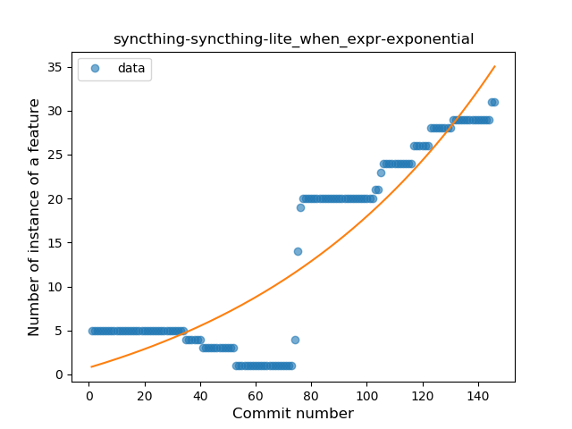
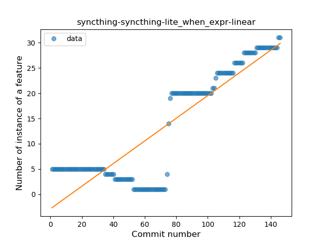
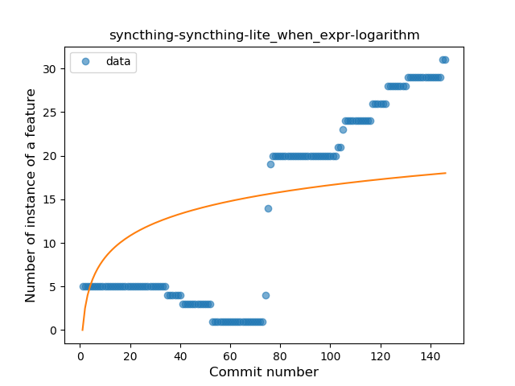
### <a name="companion_object">Companion Object</a>
----
#### Functions
* **Instability - Polinomial 3:** )
    * **R_Squared:** 0.91266747
* **Sudden Rise - Exponential:** 
    * **R_Squared:** 0.83630578
* **Constant Rise - Linear:** 
    * **R_Squared:** 0.81841723
* **Sudden Rise Plateau - Logarithm:** 
    * **R_Squared:** 0.33582106

**Plots** :chart_with_upwards_trend:
-----

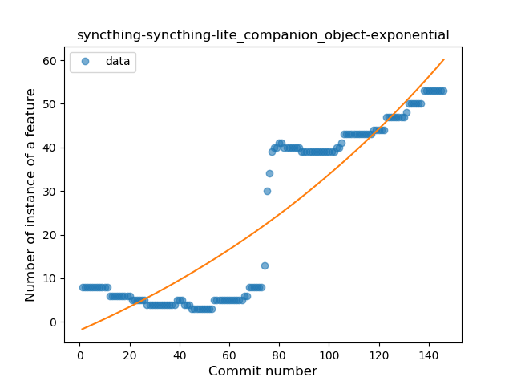
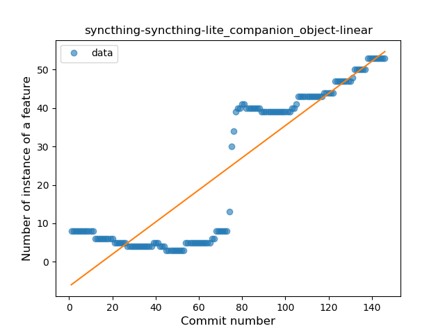
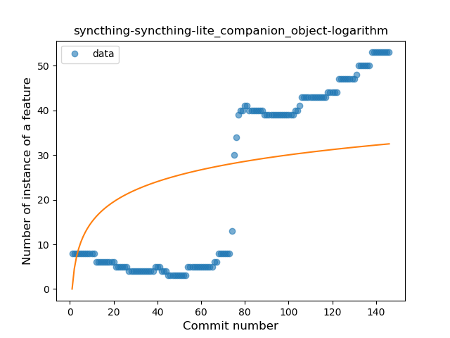
### <a name="unsafe_call">Unsafe Call</a>
----
#### Functions
* **Instability - Polinomial 3:** )
    * **R_Squared:** 0.75872544
* **Constant Rise - Linear:** 
    * **R_Squared:** 0.43527522
* **Sudden Rise - Exponential:** 
    * **R_Squared:** 0.44054725
* **Sudden Rise Plateau - Logarithm:** 
    * **R_Squared:** 0.19794784

**Plots** :chart_with_upwards_trend:
-----

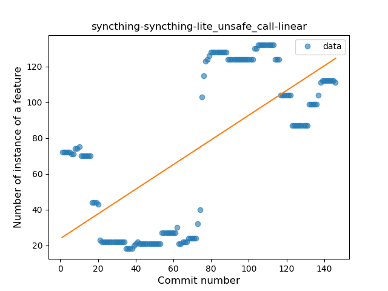
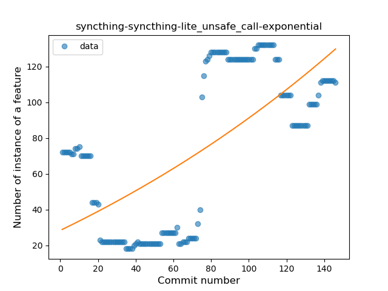
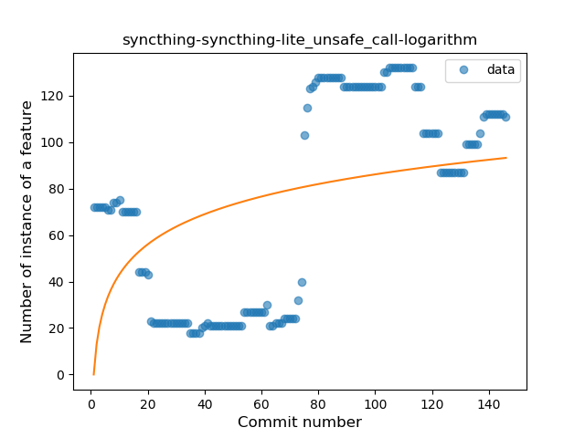
### <a name="string_template">String Template</a>
----
#### Functions
* **Plateau Gradual Rise - Sigmoid:** 
    * **R_Squared:** 0.99594783
* **Instability - Polinomial 3:** )
    * **R_Squared:** 0.86915082
* **Constant Rise - Linear:** 
    * **R_Squared:** 0.77719047
* **Sudden Rise Plateau - Logarithm:** 
    * **R_Squared:** 0.33966985

**Plots** :chart_with_upwards_trend:
-----

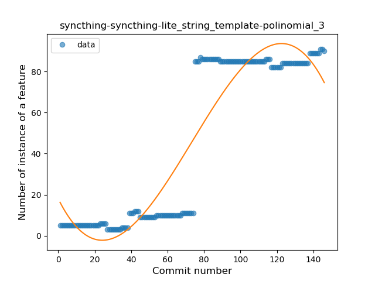
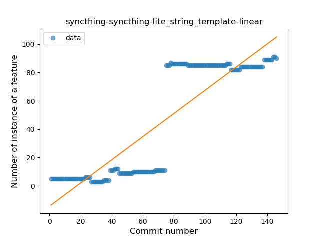
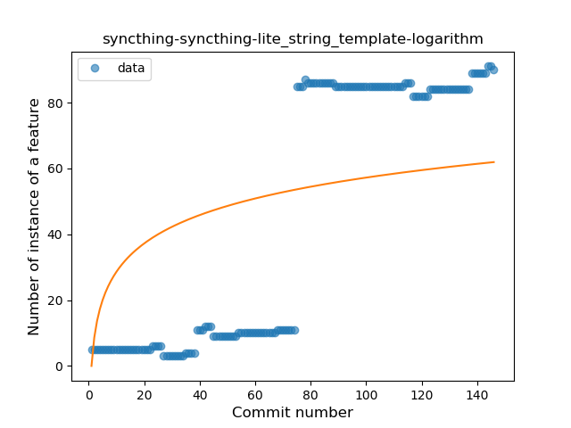
### <a name="func_with_default_value">Function with Default Value</a>
----
#### Functions
* **Instability - Polinomial 3:** )
    * **R_Squared:** 0.79256879
* **Plateau Gradual Rise - Sigmoid:** 
    * **R_Squared:** 0.57475971
* **Sudden Rise Plateau - Logarithm:** 
    * **R_Squared:** 0.22822972
* **Constant Rise - Linear:** 
    * **R_Squared:** 0.01248856

**Plots** :chart_with_upwards_trend:
-----

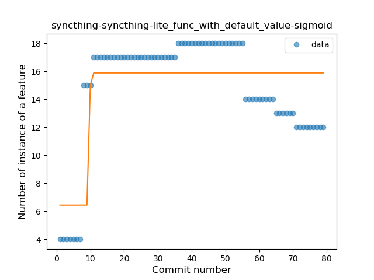
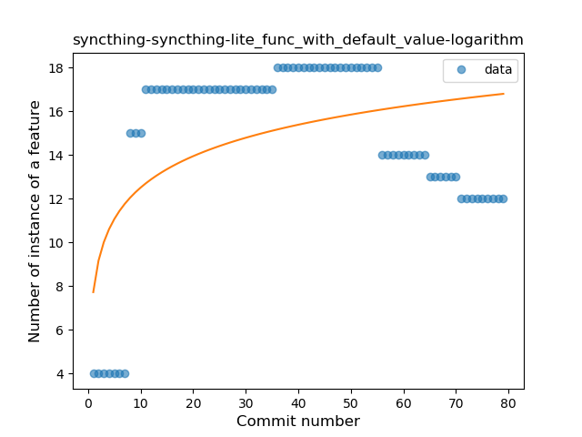
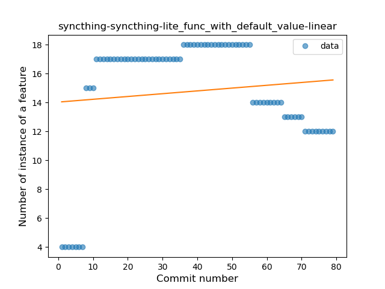
### <a name="singleton">Singleton</a>
----
#### Functions
* **Sudden Rise - Exponential:** 
    * **R_Squared:** 0.94058161
* **Constant Rise - Linear:** 
    * **R_Squared:** 0.76988477
* **Sudden Rise Plateau - Logarithm:** 
    * **R_Squared:** 0.2331208
* **Plateau Sudden Rise - Binary Sigmoid:** 
    * **R_Squared:** 0.00830087

**Plots** :chart_with_upwards_trend:
-----

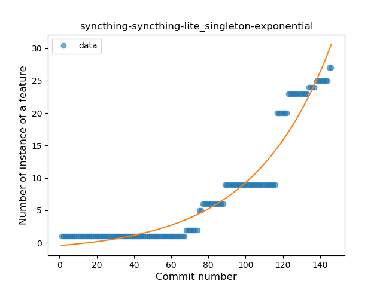
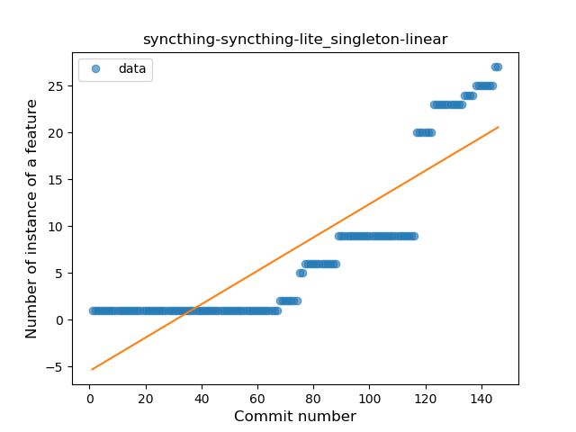
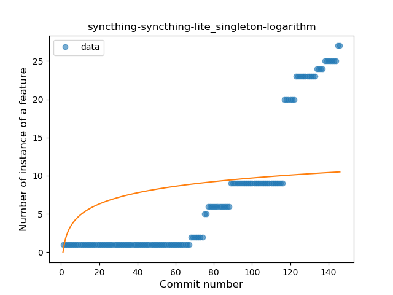
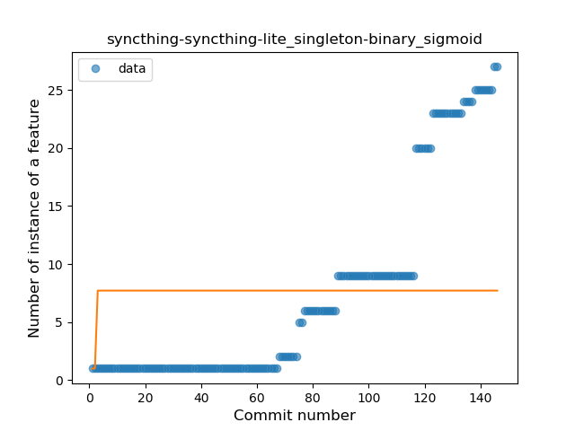
### <a name="smart_cast">Smart Cast</a>
----
#### Functions
* **Constant Rise - Linear:** 
    * **R_Squared:** 0.90168198
* **Sudden Rise - Exponential:** 
    * **R_Squared:** 0.90358625
* **Plateau Sudden Rise - Binary Sigmoid:** 
    * **R_Squared:** 0.5632145
* **Sudden Rise Plateau - Logarithm:** 
    * **R_Squared:** 0.50840767

**Plots** :chart_with_upwards_trend:
-----

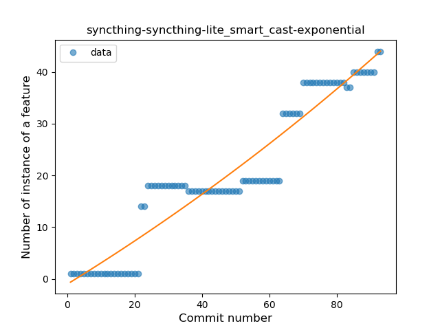
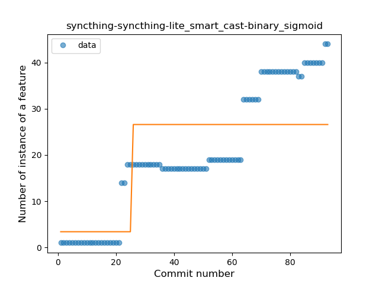
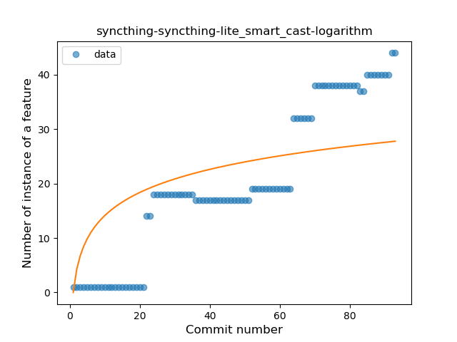
### <a name="range_expr">Range Expression</a>
----
#### Functions
* **Plateau Gradual Rise - Sigmoid:** 
    * **R_Squared:** 0.84684931
* **Constant Rise - Linear:** 
    * **R_Squared:** 0.82226984
* **Sudden Rise Plateau - Logarithm:** 
    * **R_Squared:** 0.62331443

**Plots** :chart_with_upwards_trend:
-----

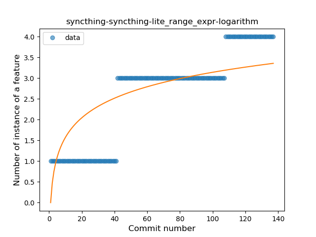
### <a name="func_call_with_named_arg">Function call with Named Argument</a>
----
#### Functions
* **Sudden Rise - Exponential:** 
    * **R_Squared:** 0.96116636
* **Constant Rise - Linear:** 
    * **R_Squared:** 0.89073563
* **Sudden Rise Plateau - Logarithm:** 
    * **R_Squared:** 0.34179178

**Plots** :chart_with_upwards_trend:
-----

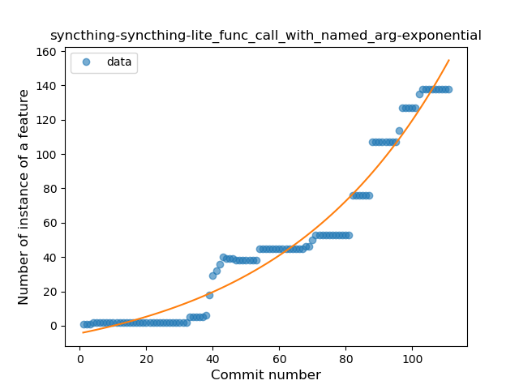
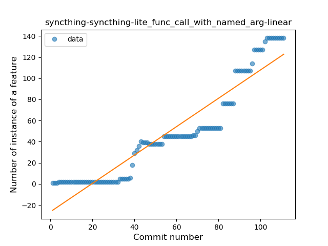
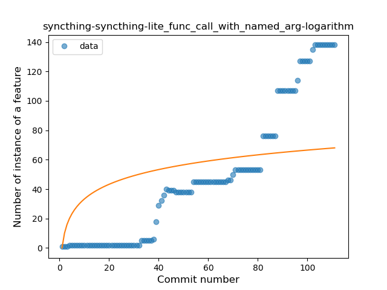
### <a name="data_class">Data Class</a>
----
#### Functions
* **Sudden Rise - Exponential:** 
    * **R_Squared:** 0.89844514
* **Constant Rise - Linear:** 
    * **R_Squared:** 0.85420551
* **Sudden Rise Plateau - Logarithm:** 
    * **R_Squared:** 0.63477389
* **Plateau Sudden Rise - Binary Sigmoid:** 
    * **R_Squared:** 0.3687295

**Plots** :chart_with_upwards_trend:
-----

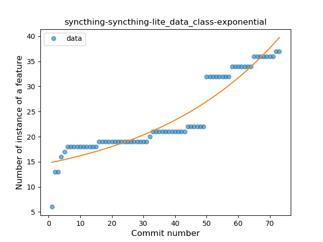
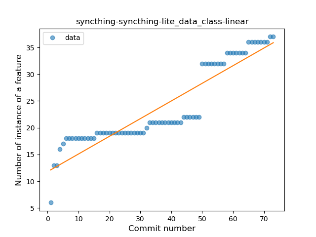

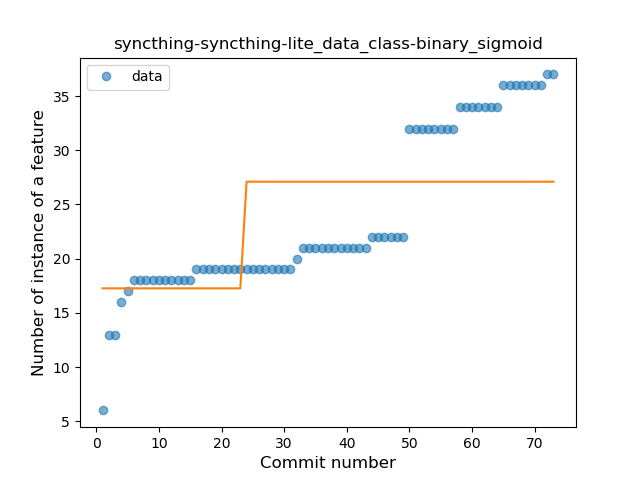
### <a name="extension_function">Extension Function</a>
----
#### Functions
* **Plateau Sudden Decline - Binary Sigmoid:** 
    * **R_Squared:** 0.74815378
* **Constant Decline - Linear:** 
    * **R_Squared:** 0.24711594
* **Sudden Rise Plateau - Logarithm:** 
    * **R_Squared:** -0.0

**Plots** :chart_with_upwards_trend:
-----

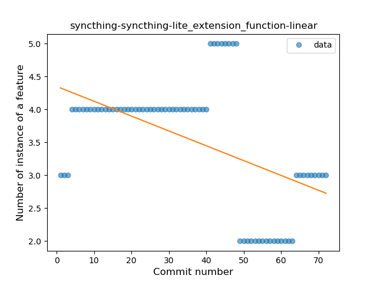
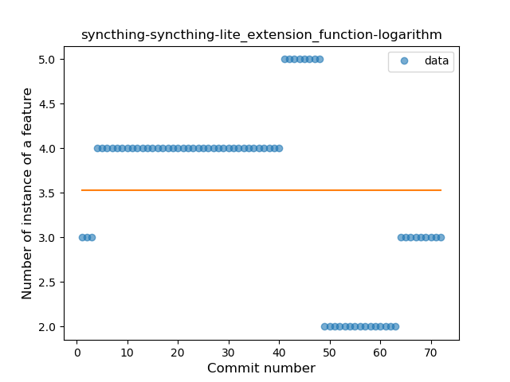
### <a name="property_delegation">Property Delegation</a>
----
#### Functions
* **Constant Rise - Linear:** 
    * **R_Squared:** 0.90468473
* **Sudden Rise Plateau - Logarithm:** 
    * **R_Squared:** 0.85371991

**Plots** :chart_with_upwards_trend:
-----

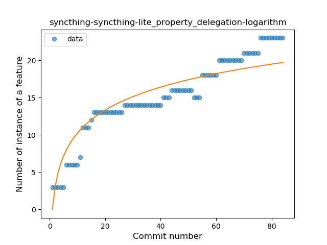
### <a name="destructuring_declaration">Destructuring Declaration</a>
----
#### Functions
* **Plateau Gradual Rise - Sigmoid:** 
    * **R_Squared:** 0.97245428
* **Sudden Rise - Exponential:** 
    * **R_Squared:** 0.86919798
* **Constant Rise - Linear:** 
    * **R_Squared:** 0.71770584
* **Sudden Rise Plateau - Logarithm:** 
    * **R_Squared:** 0.29968798

**Plots** :chart_with_upwards_trend:
-----

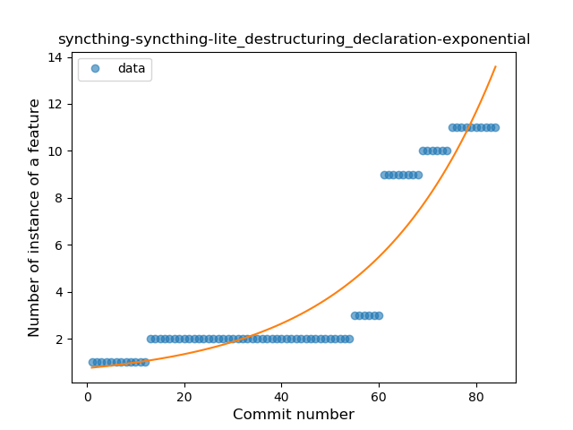
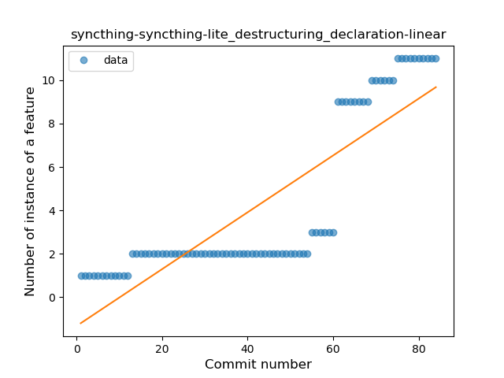
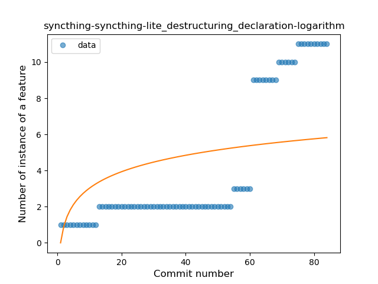
### <a name="inline_func">Inline Function</a>
----
#### Functions
* **Plateau Sudden Rise - Binary Sigmoid:** 
    * **R_Squared:** 1.0
* **Sudden Rise - Exponential:** 
    * **R_Squared:** 0.75788559
* **Constant Rise - Linear:** 
    * **R_Squared:** 0.68067227
* **Sudden Rise Plateau - Logarithm:** 
    * **R_Squared:** 0.38460674

**Plots** :chart_with_upwards_trend:
-----

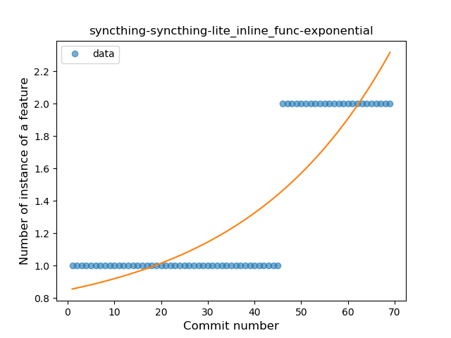
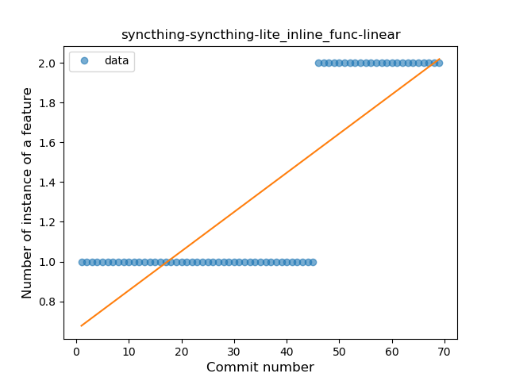
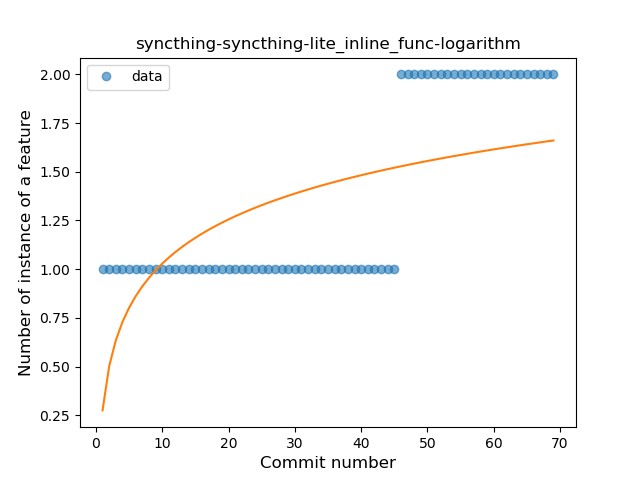
