## syrop-Wiktor-Navigator
----
#### Metrics provided by Detekt
* Number of lines of code 4154
* Number of Kotlin files: 52
* Cyclomatic complexity: 421
* Cyclomatic complexity by thousands of lines: 256 

----
**15** features analyzed

*	<a href="#type_inference">Type Inference</a> 
*	<a href="#lambda">Lambda</a> 
*	<a href="#safe_call">Safe Call</a> 
*	<a href="#when_expr">When expression</a> 
*	<a href="#companion_object">Companion Object</a> 
*	<a href="#unsafe_call">Unsafe Call</a> 
*	<a href="#string_template">String Template</a> 
*	<a href="#func_with_default_value">Function with Default Value</a> 
*	<a href="#range_expr">Range Expression</a> 
*	<a href="#func_call_with_named_arg">Function call with Named Argument</a> 
*	<a href="#data_class">Data Class</a> 
*	<a href="#extension_function">Extension Function</a> 
*	<a href="#property_delegation">Property Delegation</a> 
*	<a href="#inline_func">Inline Function</a> 
*	<a href="#overloaded_op">Overloaded Operator</a> 

### <a name="type_inference">Type Inference</a>
----
#### Functions
* **Sudden Rise Plateau - Logarithm:** 
    * **R_Squared:** 0.72960447
* **Constant Rise - Linear:** 
    * **R_Squared:** 0.69390382

**Plots** :chart_with_upwards_trend:
-----

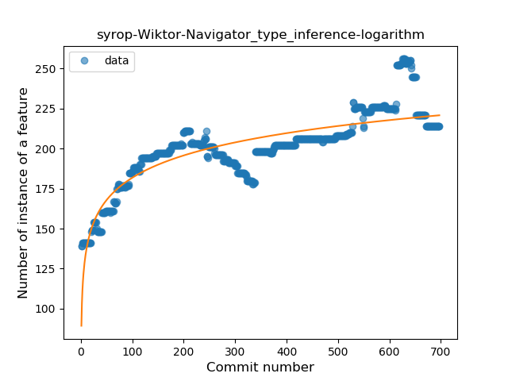
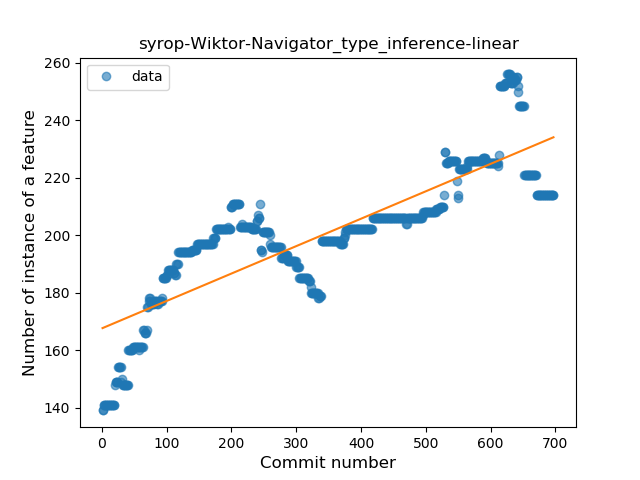
### <a name="lambda">Lambda</a>
----
#### Functions
* **Constant Rise - Linear:** 
    * **R_Squared:** 0.90038002
* **Sudden Rise Plateau - Logarithm:** 
    * **R_Squared:** 0.81414892
* **Plateau Gradual Rise - Sigmoid:** 
    * **R_Squared:** 0.44580295

**Plots** :chart_with_upwards_trend:
-----

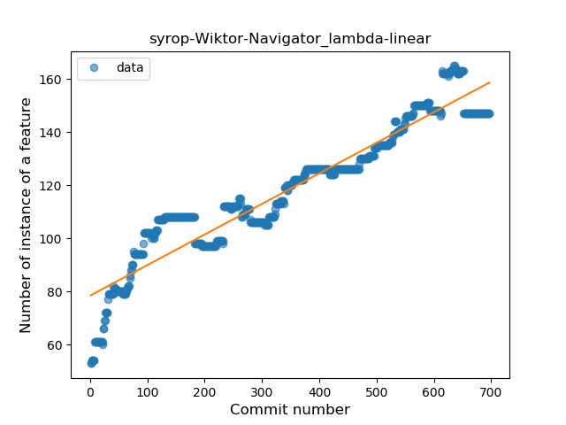
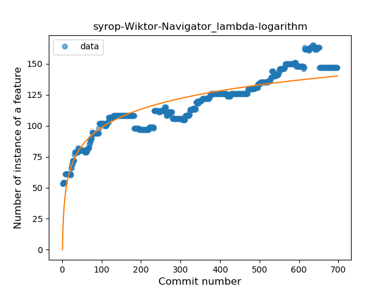
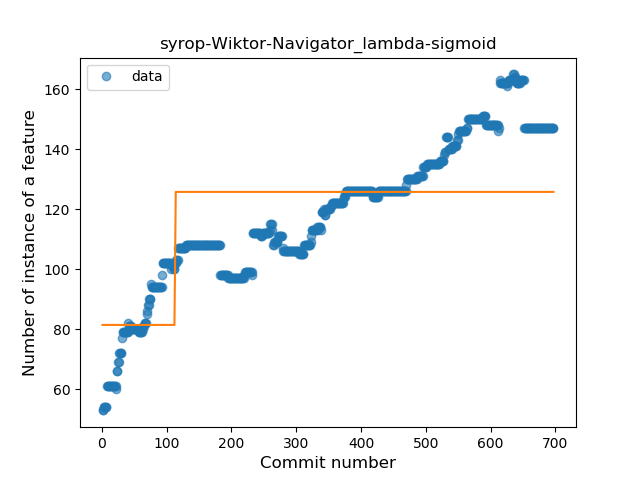
### <a name="safe_call">Safe Call</a>
----
#### Functions
* **Sudden Rise Plateau - Logarithm:** 
    * **R_Squared:** 0.70471749
* **Plateau Gradual Rise - Sigmoid:** 
    * **R_Squared:** 0.64205148
* **Constant Rise - Linear:** 
    * **R_Squared:** 0.4519039

**Plots** :chart_with_upwards_trend:
-----

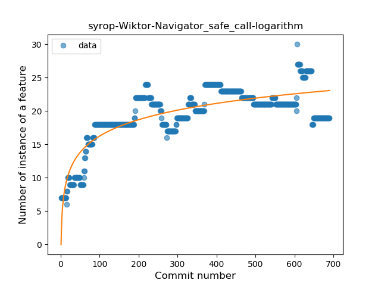
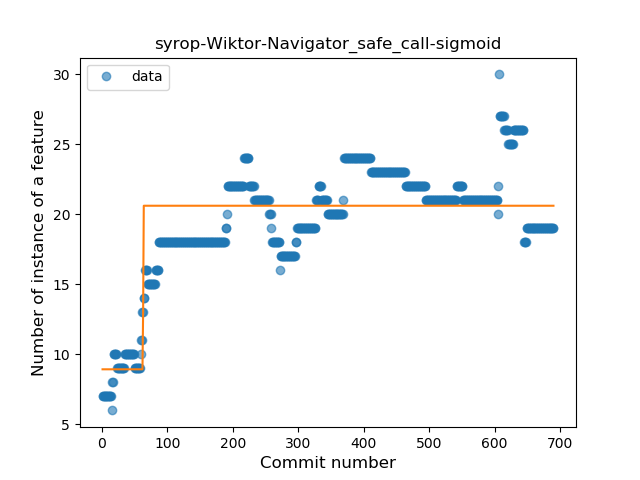
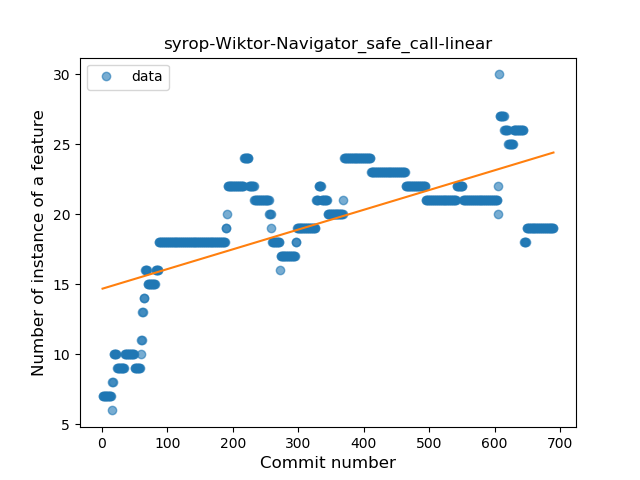
### <a name="when_expr">When expression</a>
----
#### Functions
* **Constant Rise - Linear:** 
    * **R_Squared:** 0.71001053
* **Sudden Rise Plateau - Logarithm:** 
    * **R_Squared:** 0.49871308

**Plots** :chart_with_upwards_trend:
-----

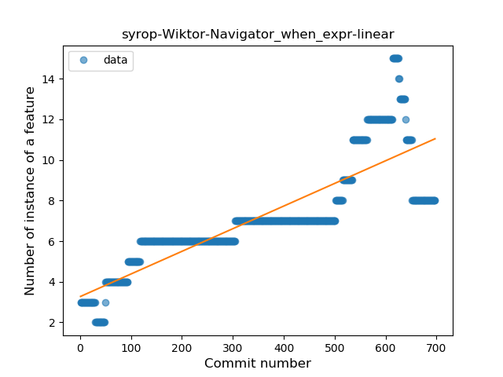
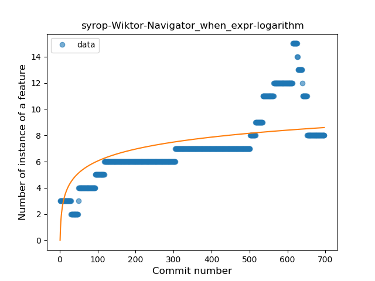
### <a name="companion_object">Companion Object</a>
----
#### Functions
* **Sudden Rise - Exponential:** 
    * **R_Squared:** 0.93191648
* **Constant Rise - Linear:** 
    * **R_Squared:** 0.91509543
* **Sudden Rise Plateau - Logarithm:** 
    * **R_Squared:** 0.64075183

**Plots** :chart_with_upwards_trend:
-----

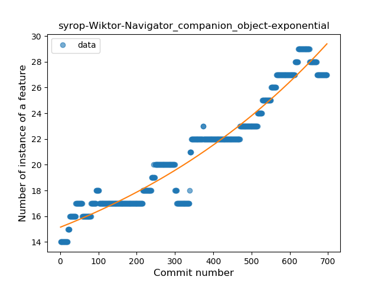
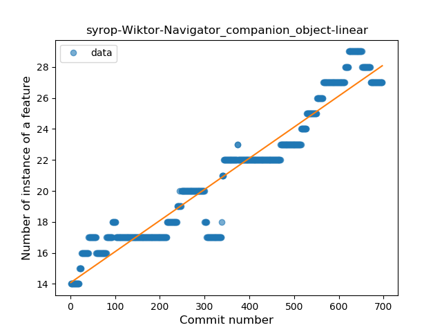
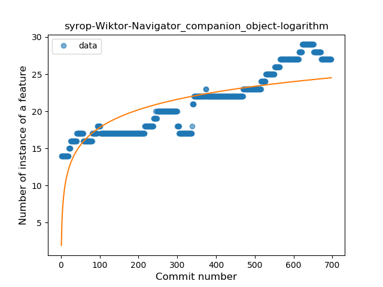
### <a name="unsafe_call">Unsafe Call</a>
----
#### Functions
* **Sudden Decline - Exponential:** 
    * **R_Squared:** 0.32047451
* **Constant Decline - Linear:** 
    * **R_Squared:** 0.29604829
* **Plateau Sudden Decline - Binary Sigmoid:** 
    * **R_Squared:** 0.08178695
* **Sudden Rise Plateau - Logarithm:** 
    * **R_Squared:** -0.0

**Plots** :chart_with_upwards_trend:
-----

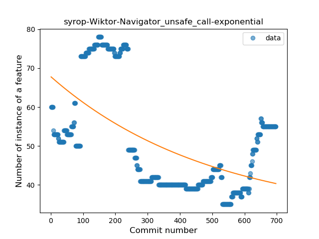
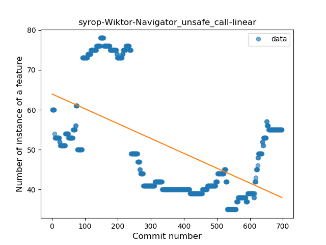
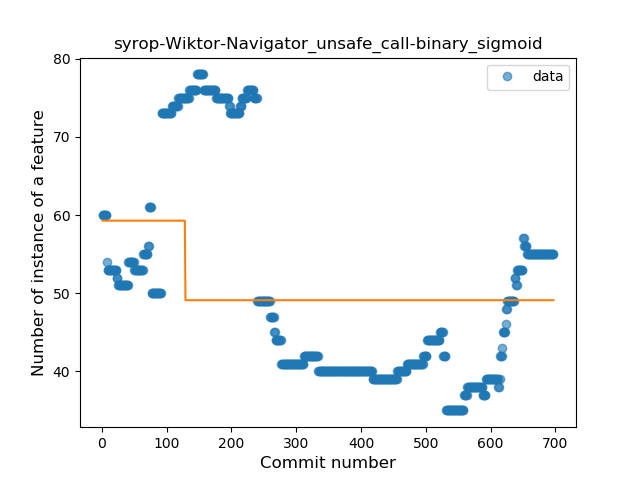
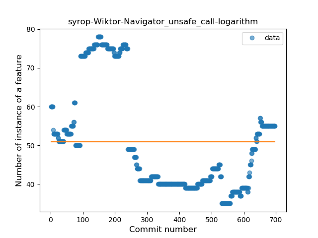
### <a name="string_template">String Template</a>
----
#### Functions
* **Sudden Rise - Exponential:** 
    * **R_Squared:** 0.51992602
* **Constant Rise - Linear:** 
    * **R_Squared:** 0.35923377
* **Sudden Rise Plateau - Logarithm:** 
    * **R_Squared:** 0.092264
* **Plateau Gradual Decline - Sigmoid:** 
    * **R_Squared:** 0.0003113

**Plots** :chart_with_upwards_trend:
-----

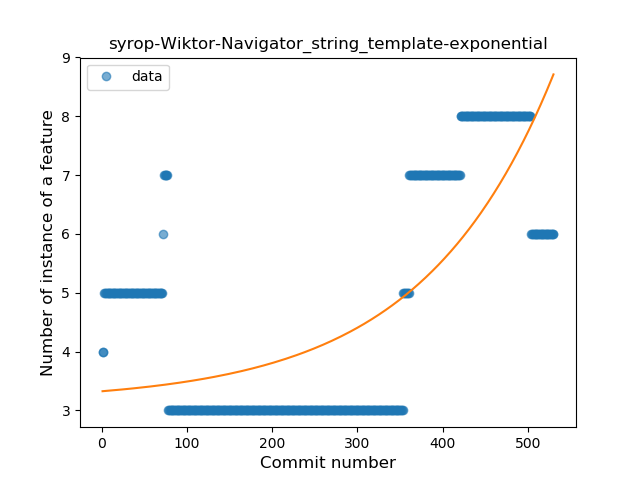
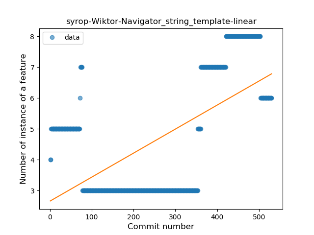
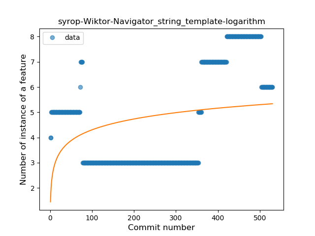

### <a name="func_with_default_value">Function with Default Value</a>
----
#### Functions
* **Plateau Gradual Rise - Sigmoid:** 
    * **R_Squared:** 0.88751809
* **Constant Rise - Linear:** 
    * **R_Squared:** 0.86887394
* **Sudden Rise Plateau - Logarithm:** 
    * **R_Squared:** 0.59879575

**Plots** :chart_with_upwards_trend:
-----

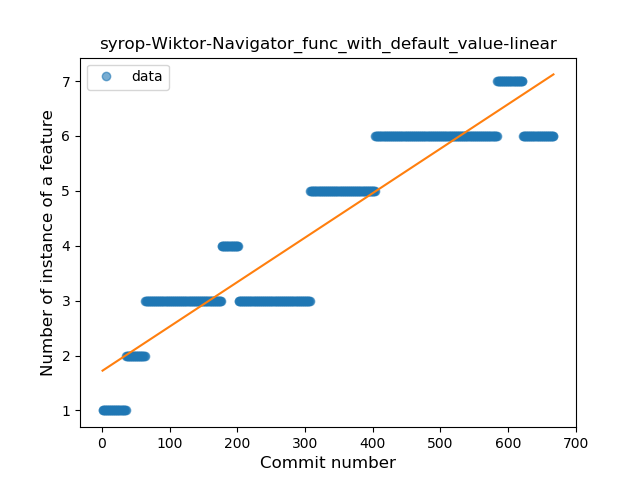
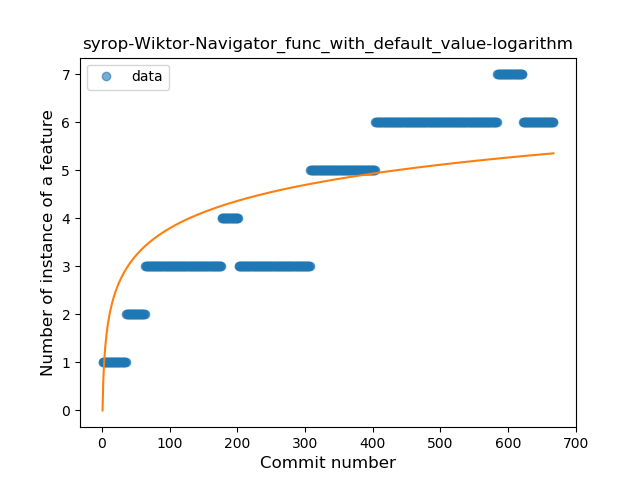
### <a name="range_expr">Range Expression</a>
----
#### Functions
* **Sudden Rise - Exponential:** 
    * **R_Squared:** 0.06222653
* **Constant Rise - Linear:** 
    * **R_Squared:** 0.01519042
* **Sudden Rise Plateau - Logarithm:** 
    * **R_Squared:** 0.0

**Plots** :chart_with_upwards_trend:
-----

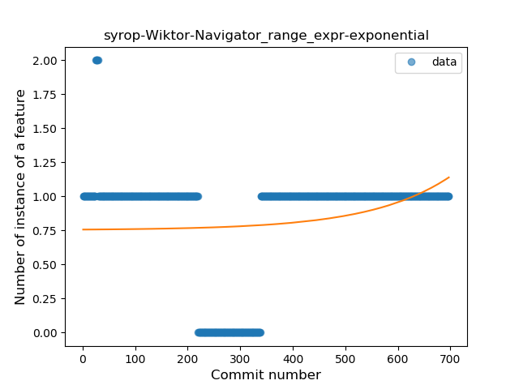
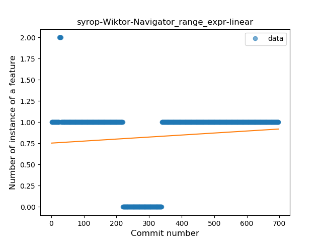
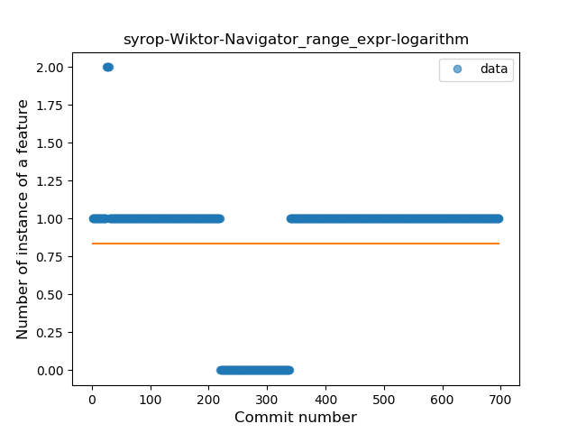
### <a name="func_call_with_named_arg">Function call with Named Argument</a>
----
#### Functions
* **Constant Rise - Linear:** 
    * **R_Squared:** 0.65370134
* **Sudden Rise Plateau - Logarithm:** 
    * **R_Squared:** 0.61358432

**Plots** :chart_with_upwards_trend:
-----

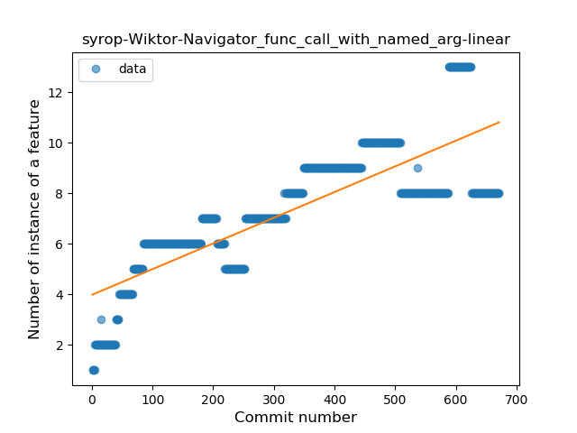
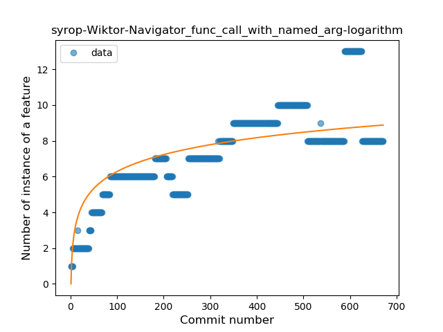
### <a name="data_class">Data Class</a>
----
#### Functions
* **Plateau Sudden Rise - Binary Sigmoid:** 
    * **R_Squared:** 1.0
* **Constant Rise - Linear:** 
    * **R_Squared:** 0.66114983
* **Sudden Rise Plateau - Logarithm:** 
    * **R_Squared:** 0.60890105

**Plots** :chart_with_upwards_trend:
-----

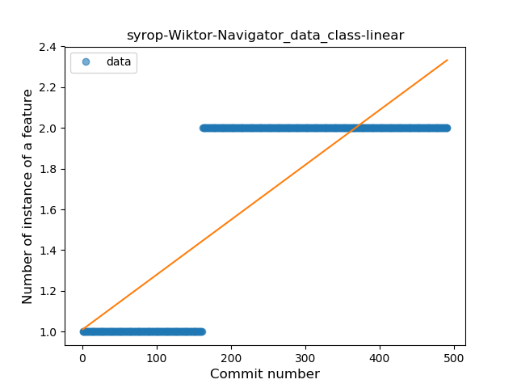
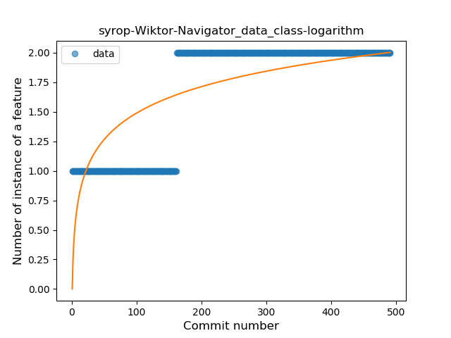
### <a name="extension_function">Extension Function</a>
----
#### Functions
* **Constant Rise - Linear:** 
    * **R_Squared:** 0.9133353
* **Sudden Rise Plateau - Logarithm:** 
    * **R_Squared:** 0.4116849

**Plots** :chart_with_upwards_trend:
-----

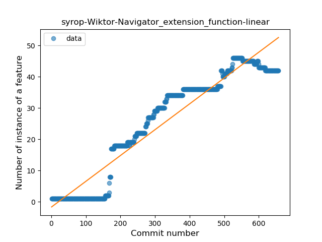
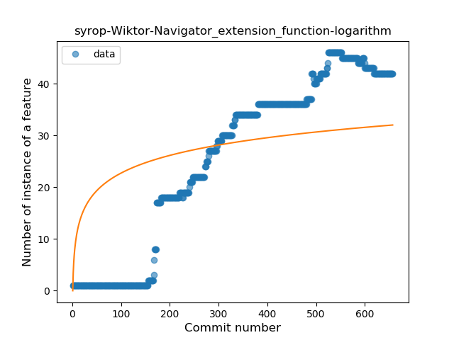
### <a name="property_delegation">Property Delegation</a>
----
#### Functions
* **Sudden Decline - Exponential:** 
    * **R_Squared:** 0.31076807
* **Constant Decline - Linear:** 
    * **R_Squared:** 0.25308696
* **Sudden Rise Plateau - Logarithm:** 
    * **R_Squared:** -0.0
* **Plateau Gradual Rise - Sigmoid:** 
    * **R_Squared:** 0.00349689

**Plots** :chart_with_upwards_trend:
-----

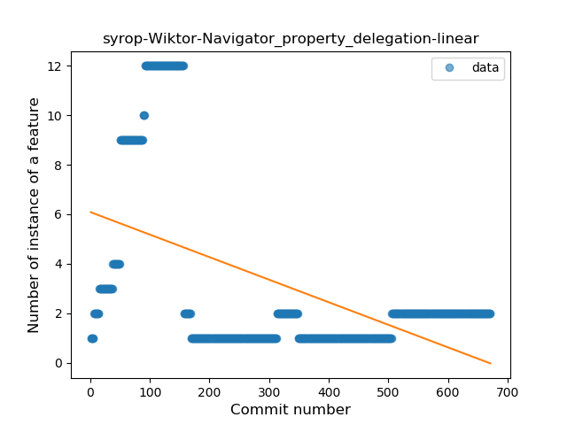
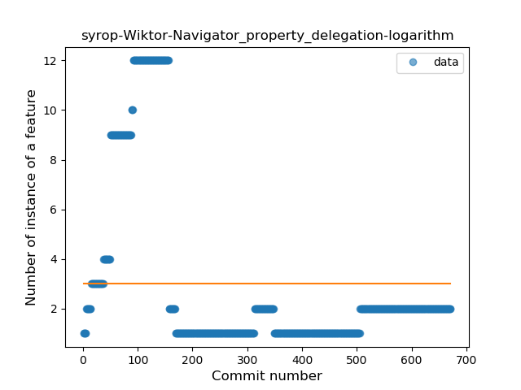
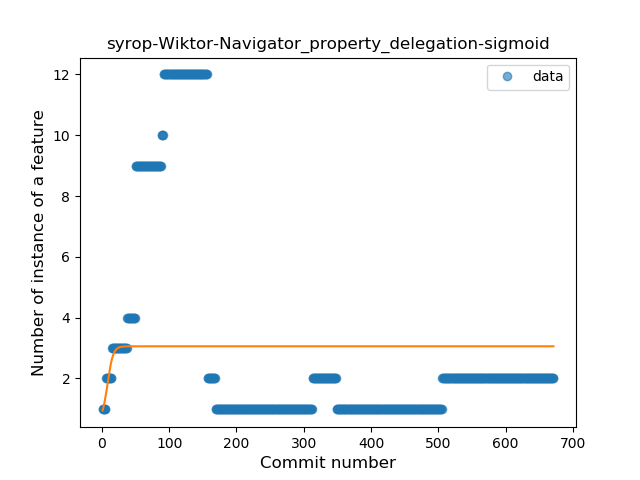
### <a name="inline_func">Inline Function</a>
----
#### Functions
* **Plateau Gradual Rise - Sigmoid:** 
    * **R_Squared:** 0.77783802
* **Sudden Rise Plateau - Logarithm:** 
    * **R_Squared:** 0.64177609
* **Constant Rise - Linear:** 
    * **R_Squared:** 0.33874921

**Plots** :chart_with_upwards_trend:
-----

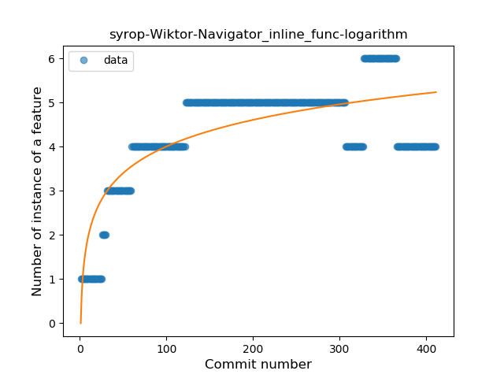
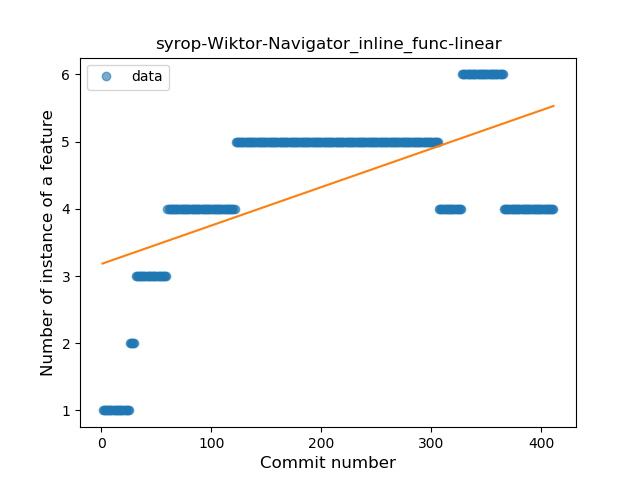
### <a name="overloaded_op">Overloaded Operator</a>
----
#### Functions
* **Plateau Sudden Rise - Binary Sigmoid:** 
    * **R_Squared:** 1.0
* **Constant Rise - Linear:** 
    * **R_Squared:** 0.74566495
* **Sudden Rise - Exponential:** 
    * **R_Squared:** 0.7504832
* **Sudden Rise Plateau - Logarithm:** 
    * **R_Squared:** 0.4590811

**Plots** :chart_with_upwards_trend:
-----

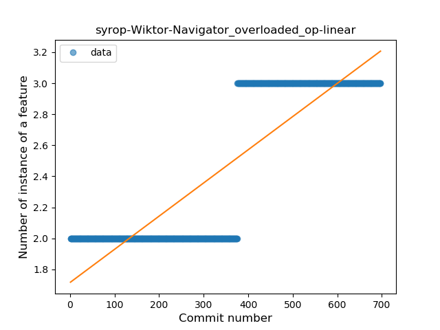
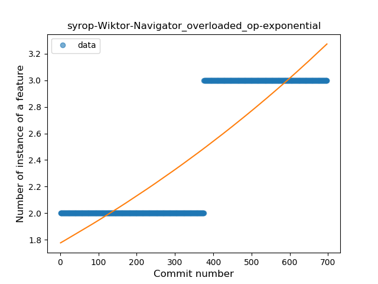
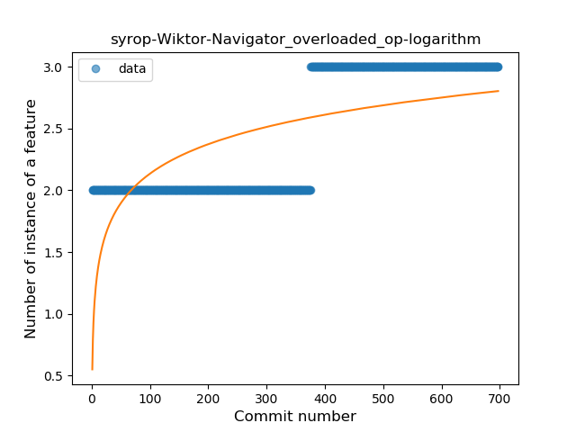
