## systemallica-ValenBisi
----
#### Metrics provided by Detekt
* Number of lines of code 1943
* Number of Kotlin files: 11
* Cyclomatic complexity: 263
* Cyclomatic complexity by thousands of lines: 234 

----
**6** features analyzed

*	<a href="#type_inference">Type Inference</a> 
*	<a href="#lambda">Lambda</a> 
*	<a href="#safe_call">Safe Call</a> 
*	<a href="#when_expr">When expression</a> 
*	<a href="#unsafe_call">Unsafe Call</a> 
*	<a href="#string_template">String Template</a> 

### <a name="type_inference">Type Inference</a>
----
#### Functions
* **Instability - Polinomial 3:** )
    * **R_Squared:** 0.78193157
* **Sudden Rise Plateau - Logarithm:** 
    * **R_Squared:** 0.44346778
* **Constant Rise - Linear:** 
    * **R_Squared:** 0.15482551

**Plots** :chart_with_upwards_trend:
-----

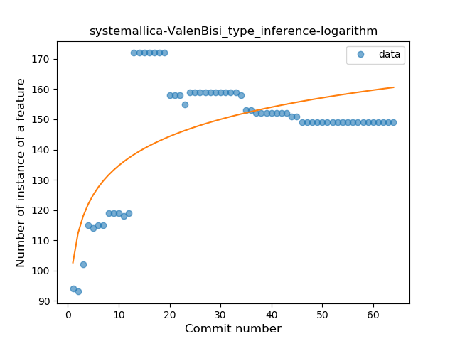
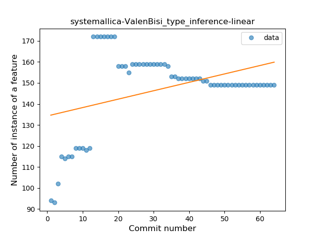
### <a name="lambda">Lambda</a>
----
#### Functions
* **Sudden Rise Plateau - Logarithm:** 
    * **R_Squared:** 0.91262045
* **Constant Rise - Linear:** 
    * **R_Squared:** 0.77612862
* **Plateau Sudden Rise - Binary Sigmoid:** 
    * **R_Squared:** 0.24329783

**Plots** :chart_with_upwards_trend:
-----

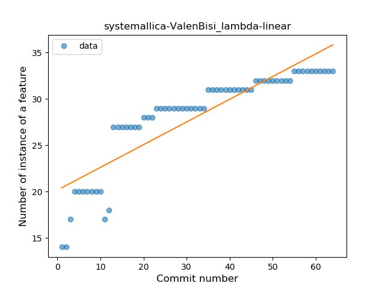
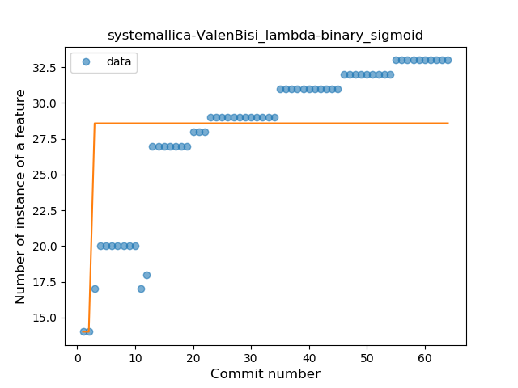
### <a name="safe_call">Safe Call</a>
----
#### Functions
* **Plateau Sudden Rise - Binary Sigmoid:** 
    * **R_Squared:** 1.0
* **Sudden Rise - Exponential:** 
    * **R_Squared:** 0.78759227
* **Constant Rise - Linear:** 
    * **R_Squared:** 0.3956044
* **Sudden Rise Plateau - Logarithm:** 
    * **R_Squared:** 0.17762322

**Plots** :chart_with_upwards_trend:
-----

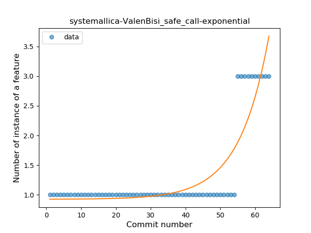
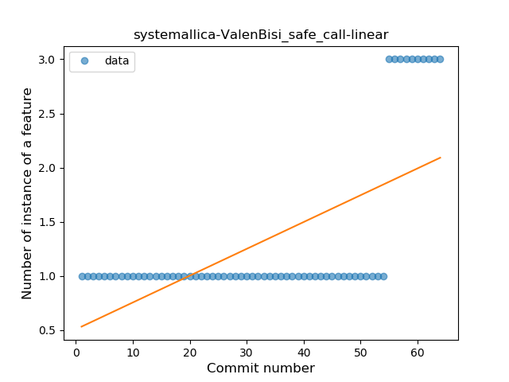
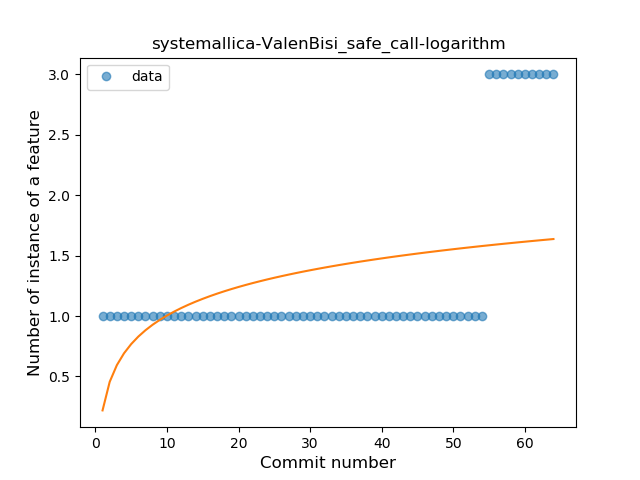
### <a name="when_expr">When expression</a>
----
#### Functions
* **Plateau Sudden Rise - Binary Sigmoid:** 
    * **R_Squared:** 1.0
* **Sudden Rise Plateau - Logarithm:** 
    * **R_Squared:** 0.67946303
* **Constant Rise - Linear:** 
    * **R_Squared:** 0.45714286

**Plots** :chart_with_upwards_trend:
-----

### <a name="unsafe_call">Unsafe Call</a>
----
#### Functions
* **Instability - Polinomial 3:** )
    * **R_Squared:** 0.8913408
* **Constant Decline - Linear:** 
    * **R_Squared:** 0.08578769
* **Sudden Rise Plateau - Logarithm:** 
    * **R_Squared:** 0.01030132
* **Sudden Decline - Exponential:** 
    * **R_Squared:** 0.0

**Plots** :chart_with_upwards_trend:
-----

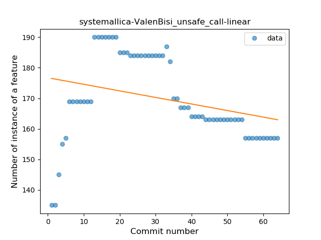
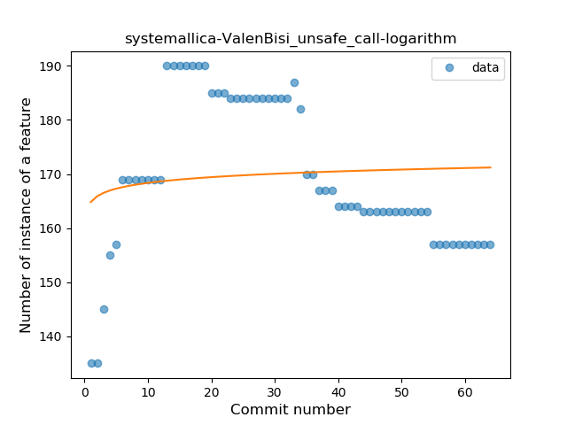
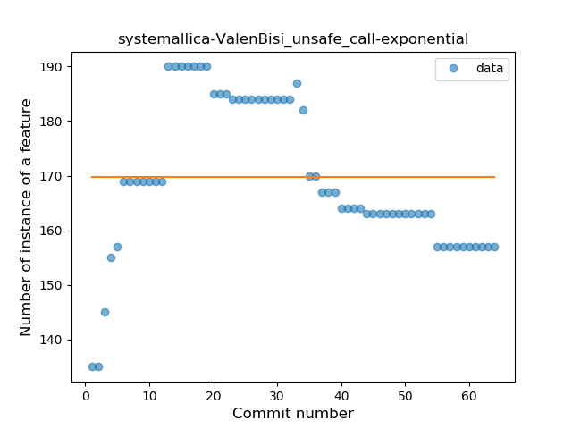
### <a name="string_template">String Template</a>
----
#### Functions
* **Plateau Sudden Rise - Binary Sigmoid:** 
    * **R_Squared:** 1.0
* **Sudden Rise Plateau - Logarithm:** 
    * **R_Squared:** 0.67946303
* **Constant Rise - Linear:** 
    * **R_Squared:** 0.45714286

**Plots** :chart_with_upwards_trend:
-----

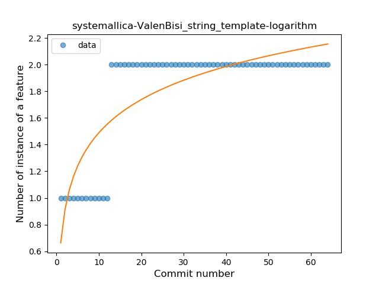
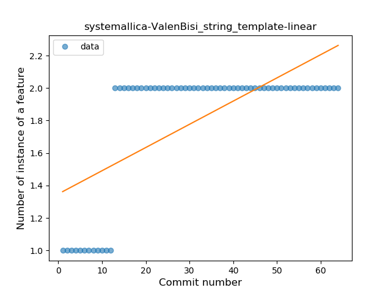
